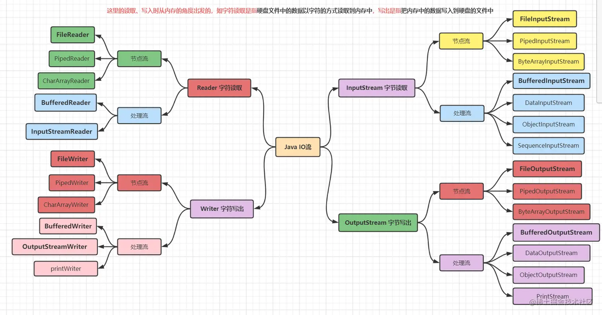

## IO流分类

[掘金——带你轻松理清Java IO体系](https://juejin.cn/post/6992772461645266958?searchId=20231127114334C42397B0257892A2B78D)

+ 按流的流向：输入流`InputStream`和输出流`OutputStream`
+ 按处理数据单位：字节流（`InputStream、OutputStream`）和字符流（`Reader、Writer`）
+ 按流的角色：节点流（直接与数据源相连接进行读写，不方便）和处理流（在节点流的基础上，再套接上一层，成为处理流，效率高，如BufferedInputStream）

> 输入流只能读数据，输出流只能写数据




### 字节输入流InputStream

`InputStream`是所有表示字节输入流的类的父类，InputStream是一个抽象类，抽象类无法直接创建对象，所以我们需要使用其子类，常见子类有：

`FileInputStream`从本地文件中读取数据，

`ByteArrayInputStream`从字节数组中读取数据，

`StringBufferInputStream`从字符串缓冲中读取数据。


#### InputStream的成员方法

+ `public abstract int read()`：从输入流中读取一个数据，返回的是数据的ASCII值
+ `public int read(byte[] b)`：从输入流中读取一定数量的字节，默认从第0个位置读取b.length长度的数据，参数byte[]数组表示起缓冲作用，存储每次读取的多个字节。
+ `int read(byte b[], int off, int len) `从第off位置读取len长度字节的数据放到byte数组中
+ `int available()`：返回可读的字节数量
+ `long skip(long n)`：跳过指定个数的字节不读取
+ `public void close()`：关闭此输入流并释放与该流关联的所有系统资源


#### FileInputStream文件字节输入流

常用构造方法：

+ `public FileInputStream(String name)`通过打开与实际文件的连接创建一个FileInputStream，参数name表示要读取的本地文件的全路径名称
+ `public FileInputStream(File file)`通过打开与实际文件的连接创建一个FileInputStream，参数file表示所要读取的文件的File对象


FileInputStream使用：

```java
//1、创建一个FileInputStream对象，构造方法中传递写入数据的目的地
FileInputStream fis = new  FileInputStream("C:\\Java\\test.txt");

//或通过File文件对象来创建FileInputStream
File file = new File(C:\\Java\\test.txt");
FileInputStream fis2 = new FileInputStream(file);


//2.1调用FileInputStream对象中的方法read,从该输入流中读取一个字节的数据
int s = fis.read();
System.out.println((char)s);

//2.2或循环读取整个文件数据
int data=0;
//返回数据的下一个字节，如果到达文件末尾则返回-1
while((data=fis.read())!=-1){
    System.out.println((char)data);
}

//2.3或从输入流中读取一定数量的字节，并将其存储在缓冲区数组 b 中
byte[] b = new byte[6];
//存储到数组b中
fis.read(b);
//将字节数组转换成字符串输出
String s1 = new String(b);
System.out.println(s1);

//3.关闭流
fis.close();
```


#### ByteArrayInputStream字节数组输入流

构造方法：

+ `public ByteArrayInputStream(byte buf[])`传入一个指定的缓冲区容量
+ `public ByteArrayInputStream(byte buf[], int offset, int length)`


ByteArrayInputStream使用：

```java
public static void main(String[] args) {
    byte[] bytes = {97,98,99,100};
    //从字节数组的索引下标为1的位置开始读取2个元素
    ByteArrayInputStream bais = new ByteArrayInputStream(bytes,1,2);
    int data;
    while((data =bais.read())!=-1){
        System.out.print(data);
    }
    输出：9899
}
```


### 字节输出流OutputStream

`OutputStream`是所有表示字节输出流的类的父类，OutputStream是一个**抽象类**，抽象类无法直接创建对象，所以我们需要使用其子类，OutputStream常见的子类有`FileOutputStream`表示往本地文件中写入数据、`ByteArrayOutputStream`表示将内存中的数据写到指定的字节数组中。


#### OutputStream成员方法

+ `void close() `关闭此输出流并释放与此流有关的所有系统资源
+ `void flush()` 刷新此输出流，将缓冲区中的数据写出
+ `abstract void write(int b)` 将指定的字节写入此输出流
+ `void write(byte[] b)` 将 b.length 个字节从指定的 byte 数组写出
+ `void write(byte[] b, int off, int len)` 将指定 byte 数组中从偏移量 off 开始的 len 个字节写入此输出流


#### FileOutputStream文件字节输出流

常用构造方法：

+ `FileOutputStream(String name, boolean append)` 根据存在的文件的全路径名称创建一个FileOutputStream流，append表示是否追加写
+ `FileOutputStream(String name)`根据存在的文件的全路径名称创建一个FileOutputStream流，append默认为false，不追加写
+ `FileOutputStream(File file)`根据指定的File对象创建FileOutputStream输出流，默认append为false，不追加写。
+ `FileOutputStream(File file, boolean append)`根据指定的File对象创建FileOutputStream输出流，append表示是否追加写

> 如果文件已存在，且不追加写，会将新写入的内容覆盖原有内容


#### ByteArrayOutputStream字节数组输出流

将内存中的数据写到字节数组输出流中，字节数组输出流会将数据写入到定义的缓冲区中，默认缓冲区大小为32，会自动扩容，可以通过`toByteArray()`方法将此输出流的当前内容，作为字节数组输出。

常用构造方法：

- `ByteArrayOutputStream()`，创建一ByteArrayOutputStream流，使用默认的缓冲区容量32
- `ByteArrayOutputStream(int size)` 根据指定的size值创建一个指定缓冲区容量的ByteArrayOutputStream流。

ByteArrayOutputStream的使用：

```java
public static void main(String[] args) throws IOException {
    //创建一个文件输入流
    FileInputStream in = new FileInputStream(new File("C:\Study\aaa.txt"));
    //创建一个字节数组输出流
    ByteArrayOutputStream out = new ByteArrayOutputStream();

    int data = 0;
    //循环遍历文件输入流中的数据
    while((data = in.read()) != -1){
        //将数据写出到字节数组的缓冲区中
        out.write(data);
    }
    //获取内存缓冲区中的数据
    byte[] bytes = out.toByteArray();
    for (int i = 0; i < bytes.length; i++) {
        System.out.println((char)bytes[i]);
    }

    in.close();
    out.close();

}
```

