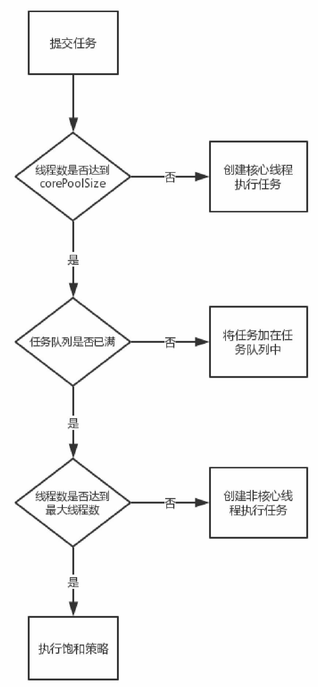
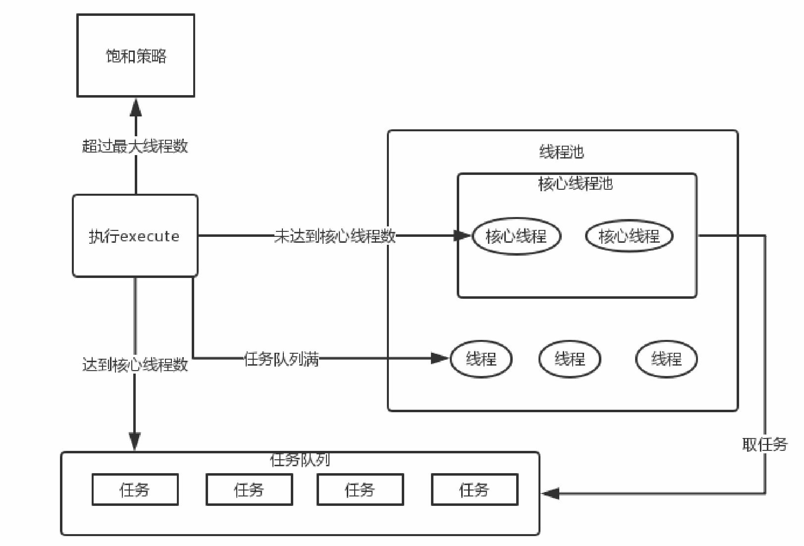
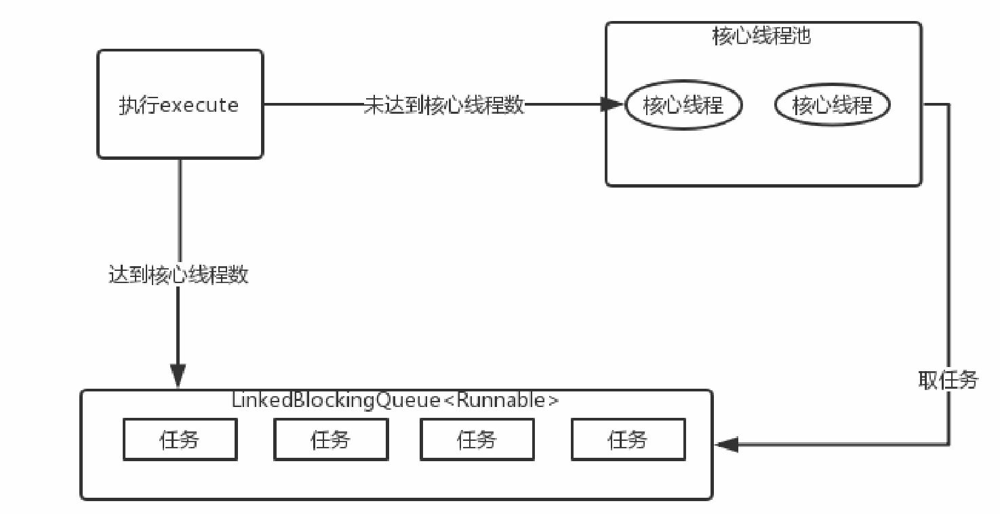
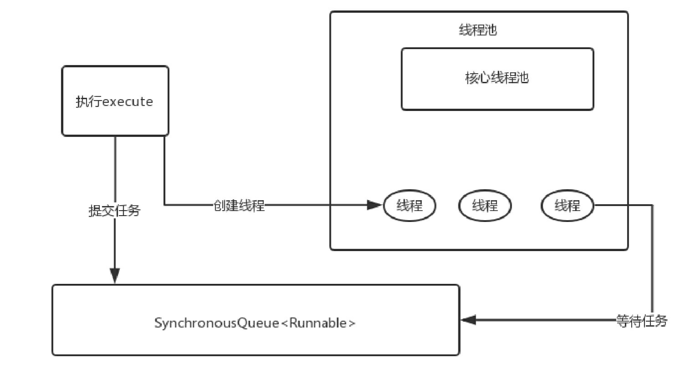
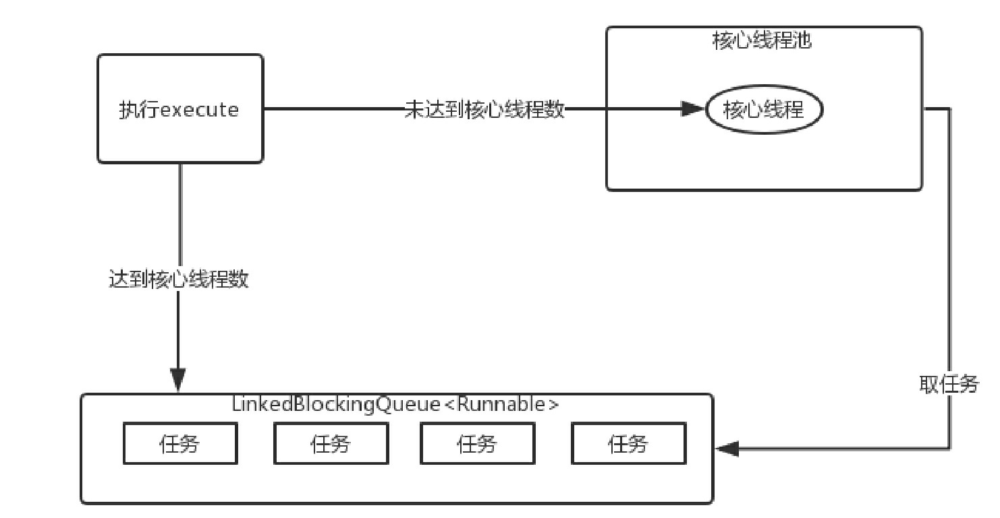
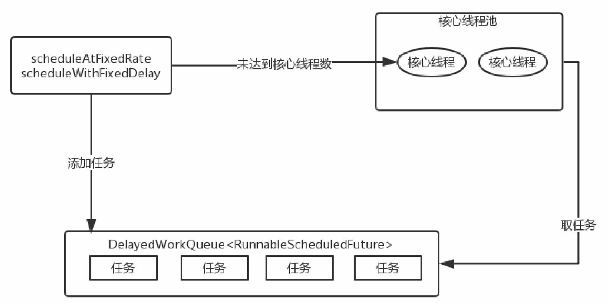

## Thread基本使用

1. 继承Thread类，重写run()方法
2. 实现Runnable接口，重写run()方法


``` java 
public synchronized void start() {
    start0();
}
```

start0()是本地方法，是JVM调用，底层是c/c++实现，

start()方法调用start0()方法后，该线程变为可运行状态，具体什么时候执行取决于CPU，由CPU统一调度。


### 6种线程状态

+ New：新创建状态
+ Runnable：可运行状态，一旦调用start方法，线程就处于Runnable状态，一个可运行的线程可能正在运行也可能没有运行，这取决于操作系统给线程提供运行的时间。
+ Blocked：阻塞状态，线程**被锁阻塞**，暂时不活动
+ Waiting：等待状态，线程暂时不活动，不运行任何代码，直到线程调度器重新激活它
+ Timed waiting：超时等待，可以在指定的时间自行返回
+ Terminated：终止状态，当前线程已经执行完毕。两种情况，第一种run方法执行完毕正常退出；第二种因为一个没有捕获的异常而终止run方法导致线程终止


### 创建线程

1. 继承Thread类，重写run()方法
2. 实现Runnable接口，实现run()方法
3. 实现Callable接口，重写call()方法
   （1）Callable可以在任务接受后提供一个返回值，Runnable无法提供这个功能
   （2）Callable中的call()方法可以抛出异常，而Runnable的run()方法不能抛出异常
   （3）Callable可以拿到一个Future对象，表示异步计算的结果，提供了检查计算是否完成方法。由于线程属于异步计算模型，使用Future来监视目标线程调用call()方法的情况。但调用Future的get()方法获取结果时，当前线程就会阻塞，直到call()方法返回结果。


### 中断

+ interrupt()：表示可以中断线程，实际上只是给线程设置一个中断标志，但是线程依旧会执行。
+ interruped() ：检查中断状态，并清除中断状态，设置为false
+ isInterrupted()：检查中断状态，不进行处理

需要注意的是被中断的线程不一定会终止，中断线程是为了引起线程的注意，被中断的线程可以决定如何去响应中断。如果是比较重要的线程则不会理会中断，而大部分情况则是线程会将中断作为一个终止的请求。

另外，不要在底层代码里捕获InterruptedException异常后不做处理，两种合理处理方式：

（1）在catch子句中，调用Thread.currentThread.interrupted()来设置中断状态（因为抛出异常后中断标识位会复位），让外界通过判断Thread.current.isInterrupted()来决定是否终止线程还是继续下去

```java
void myTask() {
    ···
    try {
        sleep(50);
    } catch(InterruptedException e) {
        Thread.currentThread.interrupted();
    }
    ···
}
```

（2）更好的做法，不使用try来捕获异常，让方法直接抛出，这样调用者可以捕获这个异常

```java
void myTest() throw InterruptedException {
    sleep(50);
}
```


### 中断来终止线程

```java
// 使用中断来终止线程
public class StopThread {
    public static void main(String[]args)throws InterruptedException {
        MoonRunner runnable =new MoonRunner();
        Thread thread =new Thread(runnable,"MoonThread");
        thread.start();
        TimeUnit.MILLISECONDS.sleep(10);//10ms留给MoonThread来感知中断而结束
        thread.interrupt();
    }
    public static class MoonRunner implements Runnable {
        private long i;
        @Override
        public void run(){
            while(!Thread.currentThread().isInterrupted()){
                i++;
                System.out.println("i="+i);
            }
            System.out.println("stop");
        }
    }
}

// 采用boolean变量来控制是否需要停止时间
public class StopThread {
    public static void main(String[]args)throws InterruptedException {
        MoonRunner runnable =new MoonRunner();
        Thread thread =new Thread(runnable,"MoonThread");
        thread.start();
        TimeUnit.MILLISECONDS.sleep(10);
        runnable.cancel();
    }
    public static class MoonRunner implements Runnable {
        private long i;
        private volatile boolean on =true;//1
        @Override
        public void run(){
            while(on){
                i++;
                System.out.println("i="+i);
            }
            System.out.println("stop");
        }
        public void cancel(){
            on =false;
        }
    }
}
```


## 线程同步

### 重入锁与条件对象

重入锁ReentrantLock支持一个线程对资源的重复加锁

ReentrantLock保护代码块的结构如下：

```java
Lock mLock = new ReetrantLock();
mLock.lock();
try{
    ···
}
finally {
    mLock.unlock();
}
```

这一结构确保任何时刻只有一个线程进入临界区，临界区就是在同一时刻只能有一个任务访问的代码区。一旦一个线程封锁了锁对象，其他任何线程都无法进入Lock语句。把解锁的操作放在finally中是十分必要的。如果在临界区发生了异常，锁是必须要释放的，否则其他线程将会永远被阻塞。进入临界区时，却发现在某一个条件满足之后，它才能执行。这时可以使用一个条件对象来管理那些已经获得了一个锁但是却不能做有用工作的线程，条件对象又被称作条件变量。


一个锁对象有多个相关的条件对象，可以用newCondition方法获得一个条件对象，得到条件对象后调用await方法，当前线程就被阻塞了并放弃了锁（自动调用，区别于finally中的unlock，阻塞时不会走finally，阻塞结束才走finally）。


一旦一个线程调用 await 方法，它就会进入该条件的等待集并处于阻塞状态，直到另一个线程调用了同 一个条件的signalAll方法时为止。当另一个线程转账给我们此前的转账方时，只要调用 condition.signalAll（），就会重新激活因为这一条件而等待的所有线程。


当调用signalAll方法时并不是立即激活一个等待线程，它仅仅解除了等待线程的阻塞，以便这些线程能够在当前线程退出同步方法后，通过竞争实现对对象的访问。还有一个方法是signal，它则是随机解除某个线程的阻塞。如果该线程仍然不能运行，则再次被阻塞。如果没有其他线程再次调用signal，那么系统就死锁了。


### 同步方法

Lock和 Condition接口为程序设计人员提供了高度的锁定控制，然而大多数情况下，并不需要那样的控制，并且可以使用一种嵌入到Java语言内部的机制。从Java 1.0版开始，Java中的每一个对象都有一个内部锁。如果一个方法用 synchronized 关键字声明，那么对象的锁将保护整个方法。也就是说，要调用该方法，线程必须获得内部的对象锁。

> 具体来说，当一个线程调用`synchronized`修饰的方法时，它会先尝试获取**该方法所属对象**的锁。如果锁可用，即没有其他线程持有该锁，那么该线程将获取到该对象的锁，并进入方法的执行。在方法执行期间，其他试图获取该对象锁的线程将被阻塞，直到当前线程释放锁。
>
> 这意味着同一个对象的其他`synchronized`方法在同一时间只能由一个线程执行，其他线程需要等待锁的释放。如果有**多个对象实例**，那么它们之间的锁是**相互独立**的，互不影响。

```java
public synchronized void method() {
    ···
}

//等价于
    
Lock mLock = new ReetrantLock();
public void method(){
    mLock.lock();
    try {
    ···
    } finally {
        mLock.unlock();
    }
}
```

对于上面支付宝转账的例子，我们可以将Alipay类的transfer方法声明为synchronized，而不是使用一个显式的锁（即隐式锁）。内部对象锁只有一个相关条件，wait方法将一个线程添加到等待集中，notifyAll或者notify方法解除等待线程的阻塞状态。也就是说wait相当于调用condition.await()，notifyAll等价于condition.signalAll()

> 阻塞与唤醒：
>
> 条件对象：condition.awit()，condition.signal()
>
> synchronized：wait()，notify()

```java
public synchronized void transfer(int from,int to,int amount)throwsInterruptedException{
    while(accounts[from]<amount){
        wait();
    }
    //转账的操作
    accounts[from]=accounts[from]-amount;
    accounts[to]=accounts[to]+amount;
    notifyAll();
}
```

> `synchronized`修饰的方法或代码块。这意味着，在一个线程获取到对象锁并执行`synchronized`方法时，其他线程必须等待对象锁的释放，才能获取到锁并执行相应的`synchronized`方法。
>
> 非`synchronized`方法（如`method3()`）与`synchronized`方法之间的同时执行不会产生互斥


### 同步代码块

```java
synchronized(obj) {
    
}
```

支付宝转账用同步代码块进行改写

```java
private Object lock = new Object();
public void transfer(int from, int to, int amount) {
    synchronized(lock) {
        // 转账的操作
        accounts[from]=accounts[from]-amount;
        accounts[to]=account[to]+amount;
    }
}
```

同步代码块非常脆弱，通常不推荐使用。一般实现同步最好用java.util.concurrent包下提供的类，比如阻塞队列。如果同步方法适合你的程序，那么尽量使用同步方法，这样可以减少编写代码的数量，减少出错的概率。如果特别需要使用Lock/Condition结构提供的独有特性时，才使用Lock/Condition。


#### synchronized

原子性、可见性、有序性

+ 修饰方法：
  1. 实例方法，作用于当前实例加锁，进入方法前需要获取当前实例的锁
  2. 静态方法，作用于当前类对象加锁，进入方法前需要获取类对象的锁

+ 修饰代码块，指定加锁对象，对给定对象加锁，进入代码块前要获得给定对象的锁

使用synchronized修饰普通方法和静态方法，其实也等价于synchronizeid(this){}与synchronizeid(class){}


synchronized在JDK1.6之后的优化

monitorenter与monitorexit指令。这就代表了同步代码块的入口与 出口。 这里的monitor是：对象监视器。

jdk1.6以后为了减少获得锁和释放锁带来的性能消耗，对synchronized 锁进行了优化，包含偏向锁、轻量级锁、重量级锁


#### 释放锁

1. 当前线程的同步方法、同步代码块执行结束。
2. 当前线程在同步方法、同步代码块遇到return、break。
3. 当前线程在同步代码块、同步方法出现了未处理的Error或Exception，导致异常结束。
4. 当前线程在同步代码块、同步方法中执行了线程对象的wait()方法，当前线程暂停，并释放锁。


### volatile

volatile不保证原子性

> 尽管volatile保证可见，但如果自增操作中，线程1读取了变量inc的原始值后被阻塞，线程2对inc又进行了自增操作，线程2结束后线程1再执行加一操作，不会再去主存读最新的数值。

volatile保证有序性

禁止指令重排序：1、程序执行到volatile变量的操作时，其前面的操作已经全部执行完毕，并且结果会对后面的操作可见，在其后面的操作还没有进行；2、在进行指令优化时，在volatile变量之前的语句不能再volatile变量后面执行；同样，在volatile变量之后的语句也不能在volatile变量前面执行。


#### volatile如何保证可见性？

有volatile变量修饰的共享变量进行写操作的时候会多出第二行汇编代码，通过查IA-32架构软件开发者手册可知，Lock前缀的指令在多核处理器下会引发了两件事情：

1）将当前处理器缓存行的数据写回到系统内存。

2）这个写回内存的操作会使在其他CPU里缓存了该内存地址的数据无效。

> 为了提高处理速度，处理器不直接和内存进行通信，而是先将系统内存的数据读到内部缓存（L1，L2或其他）后再进行操作，但操作完不知道何时会写到内存。如果对声明了volatile的变量进行写操作，JVM就会向处理器发送一条Lock前缀的指令，将这个变量所在缓存行的数据写回到系统内存。但是，就算写回到内存，如果其他处理器缓存的值还是旧的，再执行计算操作就会有问题。所以，在多处理器下，为了保证各个处理器的缓存是一致的，就会实现缓存一致性协议，每个处理器通过嗅探在总线上传播的数据来检查自己缓存的值是不是过期了，当处理器发现自己缓存行对应的内存地址被修改，就会将当前处理器的缓存行设置成无效状态，当处理器对这个数据进行修改操作的时候，会重新从系统内存中把数据读到处理器缓存里。


#### 使用条件

使用volatile必须具备以下两个条件：

+ 对变量的写操作不会依赖当前值
+ 该变量没有包含在其他变量的不变式中

第一个条件就是**不能是自增自减**等操作，第二个条件指**不参与其他变量的约束条件、不被其他变量所依赖或不影响其他变量的状态**。


#### volatile两种场景

（1）状态标志

```java
volatile boolean shutdownRequested;
···
public void shutdown() {
    shutdownRequested = true;
}
public void doWork() {
    while(!shutdownRequested) {
        ···
    }
}
```

如果在另一个线程中调用shutdown()方法，就需要执行某种同步来确保正确实现shutdownRequested变量的可见性。这里推荐使用volatile，状态标志shutdownRequested并不依赖于程序内的任何其他状态，并且还能简化代码。

（2）双重检查模式

```java
public class Singleton {
    private volatile static Singleton instance = null;
    public static Singleton getInstance() {
        if(instance == null) {
            synchronized(this) {
                if (instance == null) {
                    instance = new Singleton();
                }
            }
        }
    }
}
```

getInstance中对Singleton进行了两次判空，第一次是为了同步，第二次是只有在Singleton为null的情况下才创建实例。DCL的优点是资源利用率高，第一次执行getInstance方法时单例对象才被实例化，效率高。缺点是第一次加载时反应稍慢一些，在高并发环境下也有一定缺陷（概率很小）。


小结：volatile是一种简单且脆弱的同步机制，某些情况下将提供优于锁的性能和伸缩性。volatile的代码往往比使用锁的代码更容易出错。以上介绍了volatile替代synchronized最常见的两种用例，其他情况最好还是使用synchronized。


### 阻塞队列

常见阻塞场景：

1、队列中没有数据，消费者端的所有线程都会被自动阻塞，直到有数据放入队列。

2、队列中填满数据，生产者端的所有线程都会被自动阻塞，直到队列中有空的位置，线程被自动唤醒。


BlockingQueue的核心方法

放入数据：

+ offer(anObject)：将anObject加到BlockingQueue，如果可以容纳返回true，否则返回false。
+ offer(E o, long timeout, TimeUnit unit) ：可以设定等待的时间。如果在指定的时间内还不能往队列中加入BlockingQueue，则返回失败。
+ put(anObject)：将anObject加到BlockingQueue里，如果没有空间，则调用此方法的线程被阻断，直到BlockingQueue里面有空间再继续。

获取数据：

+ poll(time)：取走BlockingQueue里排在首位的对象。若不能立即取出，则可以等time参数规定的时间。取不到时返回null。
+ poll(long timeout, TimeUnit unit)：取出队首的对象，如果在指定时间内，队列一旦有数据可取，则立即返回队列中的数据，否则直到时间超时还没有数据可取，返回失败。
+ take()：取走BlockingQueue里排在首位的对象。若BlockingQueue为空，则阻断进入等待状态，直到BlockingQueue有新的数据被加入。
+ drainTo()：一次性从BlockingQueue获取所有可用的数据对象（还可以指定获取数据的个数）。


**Java中阻塞队列**

+ ArrayBlockingQueue：由数组结构组成的有界阻塞队列
+ LinkedBlockingQueue：由链表结构组成的有界阻塞队列
+ PriorityBlockingQueue：支持优先级排序的无界阻塞队列
+ DelayQueue：使用的优先级队列实现的无界阻塞队列
+ SynchronousQueue：不存储元素的阻塞队列
+ LinkedTransferQueue：由链表结构组成的无界阻塞队列
+ LinkedBlockingDeque：由链表结构组成的双向阻塞队列


**阻塞队列实现原理**

以ArrayBlockingQueue为例

```java
public class ArrayBlockingQueue<E> extends AbstractQueue<E> implements BlockingQueue<E>, java.io.Serializable {
    private static final long serialVersionUID = -817911632652898426L;
    final Object[] items;
    int takeIndex;//队首元素下标
    int putIndex;//队尾元素下标
    int count;//队列中元素个数
    final ReentrantLock lock;//可重入锁
    private final Condition notEmpty;//等待条件
    private final Condition notFull;//等待条件
    ···
}
```

```java
// put
public void put(E e) throws InterruptedException {
    checkNotNull(e);
    final ReentrantLock lock = this.lock;
    lock.lockInterruptibly();
    try {
        while (count == items.length)
            notFull.await();
        enqueue(e);
    } finally {
        lock.unlock();
    }
}
```

先获取可中断锁，如果队列满了则调用notFull.await()进行等待。当此线程被其他线程唤醒时，通过enqueue(e)方法插入元素，最后解锁，来看下enqueue(e)方法。

```java
// enqueue
private void enqueue(E x) {
    final Object[] items = this.items;
    items[putIndex] = x;
    if (++putIndex == items.length)
        putIndex = 0;
    count++;
    notEmpty.singal();
}
```

插入成功后，通过notEmpty唤醒正在等待取元素的线程，再来看take方法。

```java
// take
public E take() throws InterruptedException {
    final ReentrantLock lock = this.lock;
    lock.lockInterruptibly();
    try {
        while (count == 0)
            notEmpty.await();
        return dequeue();
    } finally {
        lock.unlock();
    }
}
```

跟put方法类似，put方法等待的是notFull信号，而take方法等待的是notEmpty信号。在take方法中如果可以取元素，则通过dequeue方法取得元素，来看dequeue方法的实现。

```java
// dequeue
private E dequeue() {
    final Object[] items = this.items;
    @SuppressWarnings("unchecked")
    E x = (E) items[takeIndex];
    items[takeIndex] = null;
    if (++takeIndex == items.length) takeIndex = 0;
    count--;
    notFull.notify();
    return x;
}
```


阻塞队列使用场景

除了线程池的实现使用阻塞队列外，还可以在生产者-消费者模式中使用阻塞队列：首先使用Object.wait()、Object.notify()和非阻塞队列实现生产者-消费者模式。

```java

```

下面使用阻塞队列实现的生产者-消费者模式

```java

```

很显然使用阻塞队列无须单独考虑同步和线程间通信的问题，其实现起来很简单。


#### sleep 、wait、yield与join的区别，wait 的线程如何唤醒它？

sleep 、wait、yield与join的区别

sleep、yield与join是线程方法，而wait则是Object方法：

+ sleep ，释放cpu资源，不释放锁资源，如果线程进入sleep的话，释放cpu资源，如果外层包有 Synchronize，那么此锁并没有释放掉。
+ wait，释放cpu资源，也释放锁资源，一般用于锁机制中 肯定是要释放掉锁的，因为notify并不会 立即调起此线程，因此cpu是不会为其分配时间片的，也就是说wait 线程进入等待池，cpu不分时 间片给它，锁释放掉。
+ yield：让出CPU调度，Thread类的方法，类似sleep只是不能由用户指定暂停多长时间 ，并且 yield()方法只能让同优先级的线程有执行的机会。 yield()只是使当前线程重新回到可执行状态，所 以执行yield()的线程有可能在进入到可执行状态后马上又被执行。调用yield方法只是一个建议，告 诉线程调度器我的工作已经做的差不多了，可以让别的相同优先级的线程使用CPU了，没有任何机 制保证采纳。
+ join：一种特殊的wait，当前运行线程调用另一个线程的join方法，当前线程进入阻塞状态直到另 一个线程运行结束等待该线程终止。 注意该方法也需要捕捉异常。


### 线程池

Executor框架用于把任务的提交和执行解耦，任务的提交交给Runnable或者Callable，而Executor框架用来处理任务。Executor框架中最核心的成员就是ThreadPoolExecutor，它是线程池的核心实现类。

#### ThreadPoolExecutor

```java
// 4个构造方法之一
public ThreadPoolExecutor(int corePoolSize,
                         int maximumPoolSize,
                         long keepAliveTime,
                         TimeUnit unit,
                         BlockingQueue<Runnable> workQueue,
                         ThreadFactory threadFactory,
                         RejectedExecutionHandler handler) {
    ···
}
```

+ corePoolSize：核心线程数。默认情况下线程池是空的，只有任务提交时才会创建线程。如果当前运行的线程数少于corePoolSize，则创建新线程来处理任务；如果等于或多于corePoolSize，则不再创建。如果调用线程池的prestartAllcoreThread方法，线程池会提前创建并启动所有的核心线程来等待任务。
+ maximumPoolSize：线程池允许创建的最大线程数。如果任务队列满了并且线程数小于maximumPoolSize时，则线程池仍旧会创建新的线程来处理任务。
+ keepAliveTime：非核心线程闲置的超过时间。超过这个时间则回收。如果任务很多并且每个任务的执行时间很短，则可以调大keepAliveTime来提高线程的利用率。另外如果设置allowCoreThreadTimeOut属性为true时，keepAliveTime也会应用到核心线程上。
+ TimeUnit：keepAliveTime参数的时间单位可选的单位有天（DAYS）、小时（HOURS）、分钟（MINUTES）、秒（SECONDS）、毫秒（MILLISECONDS）等。
+ workQueue：任务队列。如果当前线程数大于corePoolSize，则将任务添加到此任务队列中。该任务队列是BlockingQueue类型，即阻塞队列。
+ ThreadFactory：线程工厂。可以用线程工厂给每个创建出来的线程设置名字。一般情况下无须设置该参数。
+ RejectedExecutionHandler：饱和策略。这是当任务队列和线程池都满了是所采用的应对策略，默认是AbordPolicy，表示无法处理新任务，并抛出RejectedExecutionException异常。此外还有3种策略：
  （1）CallerRunsPolicy：用调度者所在的线程来处理任务。此策略提供简单的反馈控制机制，能够减缓新任务的提交速度。
  （2）DiscardPolicy：不能执行的任务，并将该任务删除。
  （3）DiscardOldestPolicy：丢弃队列最近的任务，并执行当前的任务。


#### 线程池的处理流程和原理

线程池的处理流程：



以上主要分为3个步骤：

（1）提交任务后，线程池先判断线程数是否达到了核心线程数，如果未达到核心线程数，则创建核心线程处理任务；否则，就执行下一步操作。

（2）接着线程池判断任务队列是否满了。如果没满，则将任务添加到任务队列；否则，就执行下一步操作。

（3）接着因为任务队列满了，线程池就判断线程数是否达到了最大线程数。如果未达到则创建非核心线程处理任务；否则，就执行饱和策略，默认会抛出RejectedExecutionException异常。

下面是线程池执行示意图：




#### 线程池的种类

4种常用的线程池：FixedThreadPool、CachedThreadPool、SingleThreadExecutor和ScheduledThreadPool

##### **1、FixedThreadPool**

可重用固定线程数的线程池。在Executors类中提供了创建FixedThreadPool的方法：

```java
public static ExecutorService newFixedThreadPool(int nThreads) {
    return new ThreadPoolExecutor(nThreads, nThreads, 0L, TimeUnit.MILLISECONDS, new LikedBlockingQueue<Runnable>());
}
```

FixedThreadPool的corePoolSize和maximumPoolSize都设置为创建FixedThreadPool指定的参数nThreads，也就意味这FixedThreadPool只有核心线程并且数量固定，没有非核心线程。keepAliveTime设置为0L意味着多余的线程会被立即终止。因为不会产生多余的线程，所以keepAliveTime是无效的参数。另外，任务队列采用无界阻塞队列LinkedBlockingQueue。FixedThreadPool的execute方法的执行示意图如下图所示。

> LinkedBlockingQueue是一个有界阻塞队列，但如果使用无参构造器则是一个无界的了




##### **2、CachedThreadPool**

CachedThreadPool是一个根据需要创建线程的线程池，创建CachedThreadPool的代码如下：

```java
public static ExecutorService newCachedThreadPool() {
    return new ThreadPoolExecutor(0, Integer.MAX_VALUE,
                                 60L, TimeUnit.SECONDS,
                                 new SynchronousQueue<Runnable>());
}
```

CachedThreadPool的corePoolSize为0，maximumPoolSize设置为Integer.MAX_VALUE，这意味着CachedThreadPool没有核心线程，非核心线程是无界的。keepAliveTime设置为60L，则空闲线程等待新任务的最长时间为60s。在此用了阻塞队列SynchronousQueue，它是一个不存储元素的阻塞队列，每个插入操作必须等待另一个线程的移除操作，同样任何一个移除操作都等待另一个插入操作。CachedThreadPool的execute方法执行示意图如下所示：



当执行execute方法时，首先执行SynchronousQueue的offer方法来提交任务，并且查询线程池中是否有空闲执行SynchronousQueue的poll方法来移除任务。如果有则配对成功，将任务交给这个空闲的线程处理。如果没有则配对失败，创建新的线程去处理任务。当线程池中的线程空闲时，它会执行SynchronousQueue的poll方法，等待SynchronousQueue中新提交的任务。如果超过60s没有新任务提交到SynchronousQueue，则这个空闲线程将终止。因为maximumPoolSize是无界的，所以如果提交的任务大于线程池中处理任务的速度就会不断创建新线程。另外，每次提交任务都会立即有线程去处理。所以，CachedThreadPool比较适用于大量的需要立即处理并且耗时较少的任务。


##### **3、SingleThreadExecutor**

SingleThreadExecutor是使用单个工作线程的线程池，其创建源码如下：

```java
public static ExecutorService newSingleThreadExecutor() {
    return new FinalizableDelegatedExecutorService
        (new ThreadPoolExecutor(1,1,
                               0L,TimeUnit.MILLISECONDS,
                               new LinkedBlockingQueue<Runnable>()));
}
```

corePoolSize和maximumPoolSize都为1，意味着SingleThreadExecutor只有一个核心线程，其他的参数都和FixedThreadPool一样。SingleThreadExecutor的execute方法示意图如下图所示：



当执行execute方法时，如果当前没有运行的线程，则创建一个新线程来处理任务。如果当前有运行的线程，则将任务添加到阻塞队列LinkedBlockingQueue中。因此，SingleThreadExecutor能确保所有的任务在一个线程中按照顺序逐一执行。


##### **4、ScheduledThreadPool**

ScheduledThreadPool是一个能实现定时和周期性任务的线程池，它的创建源码如下：

```java
public static ScheduledExcutorService newScheduledThreadPool(int corePoolSize) {
    return new ScheduledThreadPoolExecutor(corePoolSize);
}
```

这里创建了ScheduledThreadPoolExecutor，继承自ThreadPoolExecutor，他主要用于给定延时之后的运行任务或者定期处理任务。ScheduledThreadPoolExecutor的构造方法如下：

```java
public ScheduledThreadPoolExecutor(int corePoolSize) {
    super(corePoolSize, Integer.MAX_VALUE,
         DEFAULT_KEEPALIVE_MILLIS,MILLISECONDS,
         new DealyWorkQueue());
}
```

从上面的代码看出，ScheduledThreadPoolExecutor的构造方法最终调用的是ThreadPoolExecutor的构造方法。corePoolSize是传进来的固定数值，maximumPoolSize的值是Integer.MAX_VALUE。因为采用的DelayedWorkQueue是无界的，所以maximunPoolSize这个参数是无效的。ScheduledThreadPoolExecutor的execute方法示意图如图所示：



当执行ScheduledThreadPoolExecutor的scheduleAtFixedRate或者scheduleWithFixedDelay方法时，会向DelayedWorkQueue添加一个实现RunnableScheduleFuture接口的ScheduledFutureTask（任务的包装类），并会检查运行的线程是否达到了corePoolSize。如果没有则新建线程并启动它，但并不是立即去执行任务，而是去DelayedWorkQueue中取ScheduleFutureTask，然后去执行任务。如果运行的线程达到了corePoolSize时，则将任务添加到DelayedWorkQueue中。DelayedWorkQueue会将任务进行排序，先要执行的任务放在队列的前面。其跟此前介绍的线程池不同的是，当执行完任务后，会将ScheduledFutureTask中的time变量改为下次要执行的时间并放回到DelayedWorkQueue中。


### AsyncTask

```java
public abstract class AsyncTask<Params, Progress, Result> {
    ···
}
```

AsyncTask是一个抽象的泛型类，它有3个泛型参数，分别是Params、Progress和Result，其中Params为参数类型，Progress为后台任务执行进度的类型，Result为返回结果的类型。如果不需要某个参数，可以将其设置为Void类型。AsyncTask有4个核心方法，如下：

（1）onPreExecute()：在主线程中执行。一般在任务执行前做准备工作，比如对UI做一些标记。

（2）doInBackground(Params...params)：在线程池中执行。在onPreExecute方法执行后运行，用来执行较为耗时的操作。在执行过程中可以调用publishProgress(Params...values)来更新进度信息。

（3）onProgressUpdate(Progress...values)：在主线程中执行。当调用publishProgress(Progress...values)时，此方法会将进度更新到UI组件上。

（4）onPostExecute(Result result)：在主线程中执行。当后台任务执行完成后，它会被执行。doInBackground方法得到的结果就是返回的result的值。此方法一般做任务执行后的收尾工作，比如更新UI和数据。


#### AsyncTask源码分析

**1、Android 3.0版本以前的AsyncTask**

AsyncTask的线程池的核心线程数是5个，线程池允许创建的最大线程数为128，非核心线程空闲等待新任务的最长时间为1s。采用的阻塞队列为LinkedBlockingQueue，容量为10。所以AsyncTask最多能同时容纳138个任务，当提交139个任务时就会执行饱和策略，默认抛出RejectedExecutionException异常。

**2、Android 7.0**

```java
public AsyncTask(){
    mWorker =new WorkerRunnable<Params,Result>(){//1
        public Result call()throws Exception {
            mTaskInvoked.set(true);
            Process.setThreadPriority(Process.THREAD_PRIORITY_BACKGROUND);
            Result result = doInBackground(mParams);
            Binder.flushPendingCommands();
            return postResult(result);
        }
    };
    mFuture =new FutureTask<Result>(mWorker){//2
        @Override
        protected void done(){
            try {
                postResultIfNotInvoked(get());
            }catch(InterruptedException e){
                android.util.Log.w(LOG_TAG,e);
            }catch(ExecutionException e){
                throw new RuntimeException("An error occurred while executing doInBackground()",e.getCause());
            }catch(CancellationException e){
                postResultIfNotInvoked(null);
            }
        }
    }
};
```

注释1处WorkerRunnable实现了Callable接口，并实现了call方法，在call方法中调用了doInBackground（mParams）来处理任务并得到结果，并最终用postResult将结果投递出去。注释2处的FutureTask是一个可管理的异步任务，它实现了Runnable和Future这两个接口。因此，它可以包装Runnable和Callable，并提供给Executor执行。也可以调用线程直接执行(FutureTask.run())。在这里WorkerRunnable作为参数传递给FutureTask。这两个变量会暂时保存在内存中，稍后会用到它们。当要执行AsyncTask时，需要调用它的execute方法，代码如下：

```java
public final AsyncTask<Params,Progress,Result> execute(Params... params) {
    return executeOnExecutor(sDefaultExecutor, params);
}
```

execute方法又调用了executeOnExecutor方法，代码如下：

```java
public final AsyncTask<Params,Progress,Result> executeOnExecutor(Executor exec, Params... params) {
    if(mStatus !=Status.PENDING){
        switch(mStatus){
            case RUNNING:
                throw new IllegalStateException("Cannot execute task: the task is already running.");
            case FINISHED:
                throw new IllegalStateException("Cannot execute task: the task has already been executed (a task can be executed only once)");
        }
    }
    mStatus = Status.RUNNING;
    onPreExecute();
    mWorker.mParams = params;//1
    exec.execute(mFuture);
    return this;
}
```

这里首先会调用onPreExecute()方法，在注释1处将AsyncTask的参数传给WorkerRunnable。我们知道WorkerRunnable会作为参数传给FutureTask，因此参数被封装到FutureTask中。接下来调用exec的execute方法，并将mFuture即FutureTask对象传进去。这里exec是传进来的参数sDefaultExecutor，它是一个串行的线程池SerialExecutor，其代码如下：

```java
private static class SerialExecutor implements Executor {
    final ArrayDeque<Runnable> mTasks = new ArrayDeque<Runnable>();
    Runnable mActive;
    public synchronized void execute(final Runnable r) {
        mTasks.offer(new Runnable() {//1
            public void run() {
                try {
                    r.run();//2
                } finally {
                    scheduleNext();
                }
            }
        });
        if (mActive == null) {
            scheduleNext();
        }
    }
    protected synchronized void scheduleNext() {
        if ((mActive = mTask.poll()) != null) {
            THREAD_POOL_EXECUTOR.execute(mActive);
        }
    }
}
```

注释1处，当调用SerialExecutor的execute方法时，会将FutureTask加入到mTasks中。当任务执行完成或者当前没有活动的任务时都会执行scheduleNext方法，它会从mTasks取出FutureTask任务并交由THREAD_POOL_EXECUTOR处理。关于THREAD_POOP_EXECUTOR的内容，后面会介绍。这里可以看出SerialExecutor是串行执行的。注释2处可以看到执行了FutureTask的run方法，它最终会调用WorkerRunnable的call方法。前面我们提到call方法最终会调用postResult方法将结果投递出去，postResult方法代码如下：

```java
private Result postResult(Result result) {
    @SuppressWarnings("unchecked")
    Message message = getHandler().obtainMessage(MESSAGE_POST_RESULT,new AsyncTaskResult<Result>(this, result));
    message.sendToTarget();
    return result;
}
```

在postResult中会创建Message，将结果赋值给这个Message，通过getHandler方法得到Handler，并通过这个Handler发送消息。getHandler方法如下：

```java
private static Handler getHandler() {
    synchronized (AsyncTask.class) {
        if (sHandler == null) {
            sHandler = new InternalHandler();
        }
        return sHandler;
    }
}
```

在getHandler中创建了InternalHandler，InternalHandler定义如下：

```java
private static class InternalHandler extends Handler {
    public InternalHandler() {
        super(Looper.getMainLooper());
    }
    
    @SuppressWarning({"unchecked","RawUseOfParameterizedType"})
    @Override
    public void handleMessage(Message msg) {
        AsyncTaskResult<?> result = (AsyncTaskResult<?>) msg.obj;
        switch(msg.what) {
            case MESSAGE_POST_RESULT:
                // There is only one result
                result.mTask.finish(result.mData[0]);
                break;
            case MESSAGE_POST_PROGRESS:
                result.mTask.onProgressUpdate(result.mData);
                break;
        }
    }
}
```

在接收到MESSAGE_POST_RESULT消息后会调用AsyncTask的finish方法，代码如下：

```java
private void finish(Result result) {
    if (isCancelled()) {
        onCancelled(result);
    } else {
        onPostExecute(result);
    }
    mStatus = Status.FINISHED;
}
```

如果AsyncTask任务被取消了，则执行onCancelled方法，否则就调用onPostExecute方法。正是通过onPostExecute方法，我们才能够得到异步任务执行后的结果。接着回头来看SerialExecutor，线程池SerialExecutor主要用来处理排队，将任务串行处理。在SerialExecutor中调用scheduleNext方法时，将任务交给THREAD_POOL_EXECUTOR。THREAD_POOL_EXECUTOR同样是一个线程池，用来处理任务，代码如下：

```java
private static final int CPU_COUNT = Runtime.getRuntime().availableProcessors();
private static final int CORE_POOL_SIZE = Math.max(2,Math.min(CPU_COUNT-1,4));
private static final int MAXIMUM_POOL_SIZE = CPU_COUNT * 2 + 1;
private static final int KEEP_ALIVE_SECONDS = 30;
private static final BlockingQueue<Runnable> sPoolWorkQueue = new LinkedBlockingQueue<Runnable>(128);
public static final Executor THREAD_POOL_EXECUTOR;
static {
    ThreadPoolExecutor threadPoolExecutor = new threadPoolExecutor(CORE_POOL_SIZE,MAXIMUM_POOL_SIZE,KEEP_ALIVE_SECONDS,TimeUnit.SECONDS,sPoolWorkQueue,sThreadFactory);
    threadPoolExecutor.allowCoreThreadTimeOut(true);
    THREAD_POOL_EXECUTOR = threadPoolExecutor;
}
```

THREAD_POOL_EXECUTOR指的是threadPoolExecutor，其核心线程和线程池允许创建的最大线程数都是由CPU的核数计算出来的。它采用的阻塞队列仍旧是LinkedBlockingQueue，容量128。

> 到此，Android 7.0版本的AsyncTask源码就分析完了。在AsyncTask中用到了线程池，在线程池中运行线程，并且又用到了阻塞队列。因此，本章前面介绍的知识在本节中做了很好的铺垫。Android 3.0及以上版本用SerialExecutor作为默认的线程，它将任务串行地处理，保证一个时间段只有一个任务执行；而Android 3.0之前的版本是并行处理的。Android 3.0之前版本的缺点在Android 3.0之后的版本中也不会出现，因为线程是一个接一个执行的，不会出现超过任务数而执行饱和策略的情况。如果想要在Android 3.0及以上版本使用并行的线程处理，可以使用如下的代码：
>
> asyncTask.executeOnExecutor(AsyncTask.THREAD_POOL_EXECUTOR,＂＂);
>
> 其中asyncTask是我们自定义的AsyncTask，当然也可以传入4.4.3节中讲到的4种线程池，比如传入CachedThreadPool。
>
> asyncTask.executeOnExecutor(Executors.newCachedThreadPool(),＂＂);
>
> 还可以传入自定义的线程池，如下所示：
>
> ```java
> Executor exec = new ThreadPoolExecutor(0, Integer.MAX_VALUE,
> 		0L,TimeUnit.MILLISECONDS,new LinkedBlockingQueue<Runnable>());
> asyncTask.executeOnExecutor(exec,"");
> ```
>
> 

