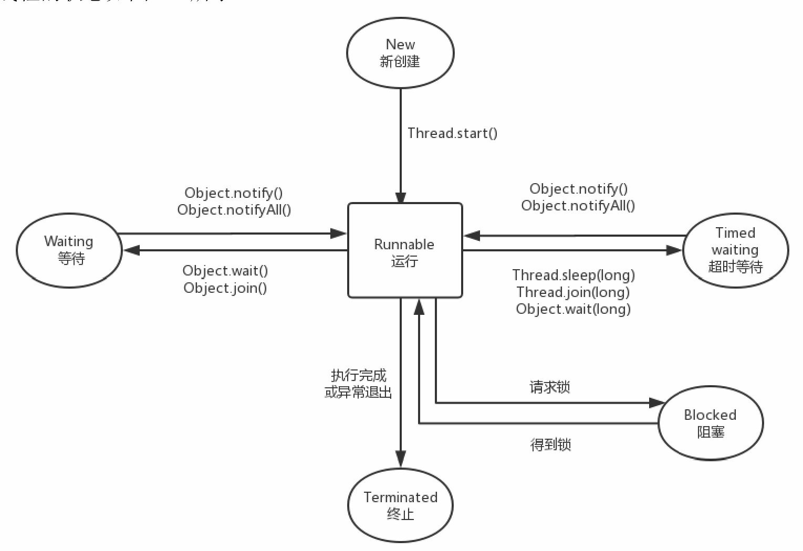

### Thread基本使用

1. 继承Thread类，重写run()方法
2. 实现Runnable接口，重写run()方法


``` java 
public synchronized void start() {
    start0();
}
```

start0()是本地方法，是JVM调用，底层是c/c++实现，

start()方法调用start0()方法后，该线程变为可运行状态，具体什么时候执行取决于CPU，由CPU统一调度。


### 6种线程状态

+ New：新创建状态
+ Runnable：可运行状态，一旦调用start方法，线程就处于Runnable状态，一个可运行的线程可能正在运行也可能没有运行，这取决于操作系统给线程提供运行的时间。
+ Blocked：阻塞状态，线程**被锁阻塞**，暂时不活动
+ Waiting：等待状态，线程暂时不活动，不运行任何代码，直到线程调度器重新激活它
+ Timed waiting：超时等待，可以在指定的时间自行返回
+ Terminated：终止状态，当前线程已经执行完毕。两种情况，第一种run方法执行完毕正常退出；第二种因为一个没有捕获的异常而终止run方法导致线程终止




### 创建线程

1. 继承Thread类，重写run()方法
2. 实现Runnable接口，实现run()方法
3. 实现Callable接口，重写call()方法
   （1）Callable可以在任务接受后提供一个返回值，Runnable无法提供这个功能
   （2）Callable中的call()方法可以抛出异常，而Runnable的run()方法不能抛出异常
   （3）Callable可以拿到一个Future对象，表示异步计算的结果，提供了检查计算是否完成方法。由于线程属于异步计算模型，使用Future来监视目标线程调用call()方法的情况。但调用Future的get()方法获取结果时，当前线程就会阻塞，直到call()方法返回结果。


### 中断

+ interrupt()：表示可以中断线程，实际上只是给线程设置一个中断标志，但是线程依旧会执行。
+ interruped() ：检查中断状态，并清除中断状态，设置为false
+ isInterrupted()：检查中断状态，不进行处理

需要注意的是被中断的线程不一定会终止，中断线程是为了引起线程的注意，被中断的线程可以决定如何去响应中断。如果是比较重要的线程则不会理会中断，而大部分情况则是线程会将中断作为一个终止的请求。

另外，不要在底层代码里捕获InterruptedException异常后不做处理，两种合理处理方式：

（1）在catch子句中，调用Thread.currentThread.interrupted()来设置中断状态（因为抛出异常后中断标识位会复位），让外界通过判断Thread.current.isInterrupted()来决定是否终止线程还是继续下去

```java
void myTask() {
    ···
    try {
        sleep(50);
    } catch(InterruptedException e) {
        Thread.currentThread.interrupted();
    }
    ···
}
```

（2）更好的做法，不使用try来捕获异常，让方法直接抛出，这样调用者可以捕获这个异常

```java
void myTest() throw InterruptedException {
    sleep(50);
}
```


### 中断来终止线程

```java
// 使用中断来终止线程
public class StopThread {
    public static void main(String[]args)throws InterruptedException {
        MoonRunner runnable =new MoonRunner();
        Thread thread =new Thread(runnable,"MoonThread");
        thread.start();
        TimeUnit.MILLISECONDS.sleep(10);//10ms留给MoonThread来感知中断而结束
        thread.interrupt();
    }
    public static class MoonRunner implements Runnable {
        private long i;
        @Override
        public void run(){
            while(!Thread.currentThread().isInterrupted()){
                i++;
                System.out.println("i="+i);
            }
            System.out.println("stop");
        }
    }
}

// 采用boolean变量来控制是否需要停止时间
public class StopThread {
    public static void main(String[]args)throws InterruptedException {
        MoonRunner runnable =new MoonRunner();
        Thread thread =new Thread(runnable,"MoonThread");
        thread.start();
        TimeUnit.MILLISECONDS.sleep(10);
        runnable.cancel();
    }
    public static class MoonRunner implements Runnable {
        private long i;
        private volatile boolean on =true;//1
        @Override
        public void run(){
            while(on){
                i++;
                System.out.println("i="+i);
            }
            System.out.println("stop");
        }
        public void cancel(){
            on =false;
        }
    }
}
```

