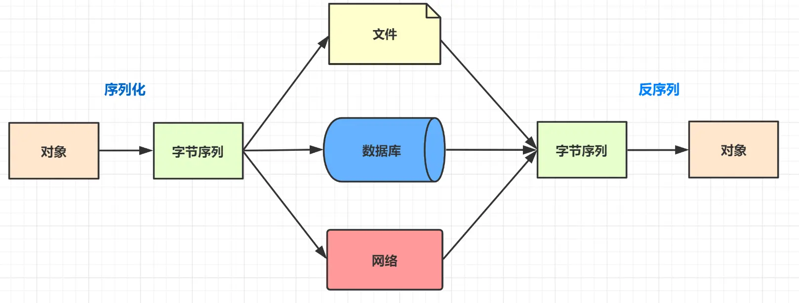
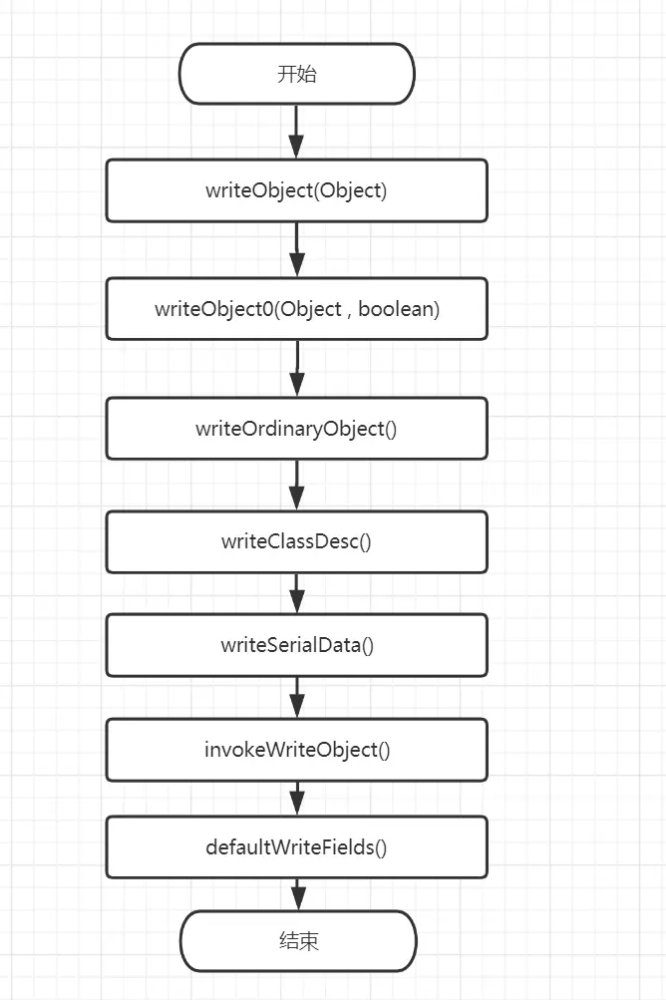

## Java序列化

序列化：把Java对象转换为字节序列的过程

反序列化：把字节序列恢复为Java对象的过程




### 为什么需要系列化

Java对象是运行在JVM的堆内存中的，如果JVM停止后，它的生命也就戛然而止。

如果想在JVM停止后，把这些对象保存到磁盘或者通过网络传输到另一远程机器，怎么办呢？磁盘这些硬件可不认识Java对象，它们只认识二进制这些机器语言，所以我们就要把这些对象转化为字节数组，这个过程就是序列化。


### 序列化用途

1. 序列化机制可以让对象保存到硬盘上，减轻内存压力的同时，也起到持久化的作用

   > 比如Web服务器中的Session对象，当有10+万的用户并发访问时，就可能出现10万个Session对象，内存可能消化不良，于是Web容器就会把一些session先序列化到硬盘中，等要用了再把保存在硬盘中的对象还原到内存中。

2. 序列化机制让Java对象在网络传输成为可能

   > 我们在使用Dubbo远程调用服务框架时，需要把传输的Java对象实现Serializable接口，即让Java对象序列化，因为这样才能让对象在网络上传输。


### Java序列化常用API

```java
java.io.OjectOutputStream
java.io.ObjectInputStream
java.io.Serializable
java.io.Exteranlizable
```

#### Serializable接口

是一个标记接口，没有方法或字段。一旦实现此接口，就标志该类的对象可序列化

```java
public interface Serializable {}
```

#### Externalizable

Externalizable继承了Serializable接口，还定义了两个抽象方法：writeExternal()和readExternal()，如果开发人员使用Externalizable来实现序列化和反序列化，需要重写writeExternal()和readExternal()方法

```java
public interface Externalizable extends java.io.Serializable {
    void writeExternal(ObjectOutput out) throws IOException;
    void readExternal(ObjectInput in) throws IOException, ClassNotFoundException;
}
```

#### java.io.ObjectOutputStream

表示对象输出流，它的writeObject(Object obj)方法可以对指定obj对象参数进行序列化，再把得到的字节序列写到一个目标输出流中。

#### java.io.ObjectInputStream

表示对象输入流，它的readObject()方法，从输入流中读取到字节序列，反序列化成为一个对象，最后将其返回。


### 序列化底层

#### Serializable底层

ObjectOutputStream 在序列化的时候，会判断被序列化的Object是哪一种类型，String、array、enum、还是 Serializable，如果都不是的话，抛出 NotSerializableException异常。所以Serializable只是一个标志，一个序列化标志。

#### writeObject(Object)

序列化的方法就是writeObject，一下是它的核心调用链：



writeObject直接调用的就是writeObject0()方法，

```java
public final void writeObject(Object obj) throws IOException {
    ......
    writeObject0(obj, false);
    ......
}
```

writeObject0 主要实现是对象的不同类型，调用不同的方法写入序列化数据，这里面如果对象实现了Serializable接口，就调用writeOrdinaryObject()方法

```java
private void writeObject0(Object obj, boolean unshared)
        throws IOException
    {
    ......
   //String类型
    if (obj instanceof String) {
        writeString((String) obj, unshared);
   //数组类型
    } else if (cl.isArray()) {
        writeArray(obj, desc, unshared);
   //枚举类型
    } else if (obj instanceof Enum) {
        writeEnum((Enum<?>) obj, desc, unshared);
   //Serializable实现序列化接口
    } else if (obj instanceof Serializable) {
        writeOrdinaryObject(obj, desc, unshared);
    } else{
        //其他情况会抛异常
        if (extendedDebugInfo) {
            throw new NotSerializableException(
                cl.getName() + "\n" + debugInfoStack.toString());
        } else {
            throw new NotSerializableException(cl.getName());
        }
    }
    ......
```

writeOrdinaryObject()会先调用writeClassDesc(desc)，写入该类的生成信息，然后调用writeSerialData方法,写入序列化数据

```java
private void writeOrdinaryObject(Object obj,
                                     ObjectStreamClass desc,
                                     boolean unshared)
        throws IOException
    {
            ......
            //调用ObjectStreamClass的写入方法
            writeClassDesc(desc, false);
            // 判断是否实现了Externalizable接口
            if (desc.isExternalizable() && !desc.isProxy()) {
                writeExternalData((Externalizable) obj);
            } else {
                //写入序列化数据
                writeSerialData(obj, desc);
            }
            .....
    }
```

writeSerialData()实现的就是写入被序列化对象的字段数据

```java
private void writeSerialData(Object obj, ObjectStreamClass desc)
        throws IOException
    {
        for (int i = 0; i < slots.length; i++) {
            if (slotDesc.hasWriteObjectMethod()) {
                   //如果被序列化的对象自定义实现了writeObject()方法，则执行这个代码块
                    slotDesc.invokeWriteObject(obj, this);
            } else {
                // 调用默认的方法写入实例数据
                defaultWriteFields(obj, slotDesc);
            }
        }
    }
```

defaultWriteFields()方法，获取类的基本数据类型数据，直接写入底层字节容器；获取类的obj类型数据，循环递归调用writeObject0()方法，写入数据

```java
private void defaultWriteFields(Object obj, ObjectStreamClass desc)
        throws IOException
    {   
        // 获取类的基本数据类型数据，保存到primVals字节数组
        desc.getPrimFieldValues(obj, primVals);
        //primVals的基本类型数据写到底层字节容器
        bout.write(primVals, 0, primDataSize, false);

        // 获取对应类的所有字段对象
        ObjectStreamField[] fields = desc.getFields(false);
        Object[] objVals = new Object[desc.getNumObjFields()];
        int numPrimFields = fields.length - objVals.length;
        // 获取类的obj类型数据，保存到objVals字节数组
        desc.getObjFieldValues(obj, objVals);
        //对所有Object类型的字段,循环
        for (int i = 0; i < objVals.length; i++) {
            ......
              //递归调用writeObject0()方法，写入对应的数据
            writeObject0(objVals[i],
                             fields[numPrimFields + i].isUnshared());
            ......
        }
    }
```


### 日常开发序列化的注意点

+ static静态变量和transient修饰的字段是不会被序列化的
+ serialVersionUID问题
+ 如果某个序列化类的成员变量是对象类型，则该对象类型的类必须实现序列化
+ 子类如果实现了序列化，父类没有实现序列化，父类中的字段丢失问题

#### static和transient

1）静态成员属于类级别的，而序列化是针对对象的，所以不能序列化

2）transient关键字，可以组织修饰的字段被序列化到文件中，再被反序列化后，transient字段的值被设为初始值，比如int型会为设置为0，对象型会被设置为null。

#### serialVersionUID

`serialVersionUID`表面意思就是序列化版本号ID，其实每一个实现Serializable接口的类，都有一个表示序列化版本标识符的静态变量，或者默认等于1L，或者等于对象的哈希码

serialVersionUID的作用：Java的反序列化机制是通过判断serialVersionUID来验证版本是否一致的。在进行反序列化时，JVM会吧传来的字节流中的serialVersionUID和本地相应实体类的serialVersionUID进行比较，如果相同，反序列化成功，如果不相同，就抛出InvalidClassException异常。

实际上，阿里开发手册，强制要求序列化类新增属性时，不能修改serialVersionUID字段

在Java中，serialVersionUID的写法有两种：

1. 显示声明
   ```java
   public class MyClass implements Serializable {
       private static final long serialVersionUID = 123456789L;
       // ...
   }
   ```

   我们通过定义一个`serialVersionUID`的静态变量，并赋予一个固定值来指定序列化版本号。这个值可以是任何长整型数字，通常简易使用随机数或时间戳等唯一标识。

2. 自动生成
   如果一个类没有显式声明`serialVersionUID`变量，则Java虚拟机会自动为它生成一个序列化版本号。这个自动生成的版本号是根据类的结构和成员变量等信息计算得出的，因此可以保证在不同的JVM上生成相同的值。

   ```java
   public class MyClass implements Serializable {
       // ...
   }
   ```

   我们没有显式声明`serialVersionUID`变量，因此Java虚拟机会自动为它生成一个版本号。如果需要查看自动生成的版本号，可以使用`serialver`命令行工具（例如：`serialver MyClass`）来获取。


## Android序列化

Android数据对象序列化的主要用途是将对象转换为字节流的形式，以便在网络传输、持久化存储或进程间通信中使用。具体的用途包括：

1. 网络传输：在Android开发中，我们经常需要将对象通过网络传输给其他设备或服务器。通过序列化，我们可以将对象转换为字节流，然后通过网络发送给目标设备或服务器，目标设备或服务器再将字节流反序列化为对象进行处理。
2. 持久化存储：Android应用程序通常需要将数据保存在本地存储中，以便在应用程序关闭后仍然可以访问。通过序列化，我们可以将对象转换为字节流，并将其保存在本地文件或数据库中。当应用程序再次启动时，我们可以将字节流反序列化为对象，以便恢复之前保存的数据。
3. 进程间通信：在Android中，不同的组件（如Activity、Service、BroadcastReceiver等）可能运行在不同的进程中。通过序列化，我们可以将对象转换为字节流，并通过进程间通信机制（如Binder）将字节流传递给其他进程，其他进程再将字节流反序列化为对象进行处理。


### 常用序列化方式

#### Serializable接口

同Java


#### Parcelable接口

Parcelable接口是Android特有的接口，相比Serializable接口，它更高效。在需要序列化的类中实现Parcelable接口，并实现相关方法。然后使用Parcel对象将对象写入Parcel，使用Parcel对象从Parcel中读取对象。

```java
public class MyClass implements Parcelable {
    // 类的成员变量和方法

    protected MyClass(Parcel in) {
        // 从Parcel中读取数据并赋值给成员变量
    }

    public static final Creator<MyClass> CREATOR = new Creator<MyClass>() {
        @Override
        public MyClass createFromParcel(Parcel in) {
            return new MyClass(in);
        }

        @Override
        public MyClass[] newArray(int size) {
            return new MyClass[size];
        }
    };

    @Override
    public int describeContents() {
        return 0;
    }

    @Override
    public void writeToParcel(Parcel dest, int flags) {
        // 将成员变量写入Parcel
    }
}
```

#### Gson库

Gson是Google提供的一个用于在Java对象和JSON数据之间进行序列化和反序列化的库。可以使用Gson将对象转换为JSON字符串，然后再将JSON字符串转换为对象。

```java
public class MyClass {
    // 类的成员变量和方法

    public static void main(String[] args) {
        // 序列化对象
        MyClass obj = new MyClass();
        Gson gson = new Gson();
        String json = gson.toJson(obj);
        System.out.println("对象已序列化为JSON字符串：" + json);

        // 反序列化对象
        MyClass newObj = gson.fromJson(json, MyClass.class);
        System.out.println("JSON字符串已反序列化为对象");
    }
}
```


### Parcelable底层

**Parcelable**是Android中用于实现对象序列化的接口。它的原理是将对象的数据按照一定的格式进行打包和解包，以便在不同的组件之间传输或存储。

具体实现步骤如下：

1. 实现Parcelable接口：在需要序列化的类中实现Parcelable接口，并实现其中的方法，包括`describeContents()`和`writeToParcel(Parcel dest, int flags)`。
2. `describeContents()`方法：该方法返回一个标志位，用于描述Parcelable对象特殊对象的类型。一般情况下，返回0即可。
3. `writeToParcel(Parcel dest, int flags)`方法：该方法将对象的数据写入Parcel对象中。在该方法中，需要将对象的各个字段按照一定的顺序写入Parcel对象中，以便在解包时按照相同的顺序读取。
4. 实现Parcelable.Creator接口：在需要序列化的类中实现Parcelable.Creator接口，并实现其中的方法，包括`createFromParcel(Parcel source)`和`newArray(int size)`。
5. `createFromParcel(Parcel source)`方法：该方法从Parcel对象中读取数据，并创建出Parcelable对象。在该方法中，需要按照写入Parcel对象时的顺序读取数据，并将其赋值给相应的字段。
6. `newArray(int size)`方法：该方法返回一个指定大小的Parcelable数组。

通过实现Parcelable接口，可以将对象的数据打包成一个Parcel对象，然后可以通过Intent传递给其他组件，或者通过Bundle存储到本地。在接收端，可以通过读取Parcel对象的数据，重新构建出原始的对象。

总结起来，Parcelable的原理就是将对象的数据按照一定的格式进行打包和解包，以实现对象的序列化和反序列化。这种方式相对于Java中的Serializable接口，更加高效和灵活。


### Serializable与Parcelable对比

Serializable和Parcelable都是用于实现对象的序列化和反序列化的接口，但在实现方式和性能方面有所不同。

1. Serializable：

- Serializable是Java提供的默认序列化机制，通过实现Serializable接口，可以将对象转换为字节流，以便在网络传输或保存到文件中。
- Serializable使用反射机制，将对象的状态保存到字节流中，然后再从字节流中恢复对象的状态。这种方式相对简单，但效率较低。
- Serializable的缺点是序列化和反序列化的过程需要大量的I/O操作，对性能要求较高的场景下可能会影响程序的执行效率。

2. Parcelable：

- Parcelable是Android提供的专门用于Android平台的序列化机制，通过实现Parcelable接口，可以将对象转换为字节流，以便在Activity之间传递。
- Parcelable使用了更加高效的序列化方式，将对象的状态拆分为多个字段，分别写入和读取字节流。这种方式相对复杂，但效率较高。
- Parcelable的优点是序列化和反序列化的过程更加高效，对性能要求较高的场景下可以提升程序的执行效率。

Serializable适用于简单的序列化场景，而Parcelable适用于对性能要求较高的Android平台。在选择使用Serializable还是Parcelable时，需要根据具体的需求和性能要求进行权衡。

| 对比     | Serializable                                                 | Parcelable                                                   |
| -------- | ------------------------------------------------------------ | ------------------------------------------------------------ |
| 所属API  | Java API                                                     | Android SDK API                                              |
| 特点     | 序列化和反序列化会经过大量的I/O操作，产生大量的临时变量引起GC，且反序列化时需要反射 | 基于内存拷贝实现的封装和解封(marshalled& unmarshalled)，序列化基于Native层实现 |
| 开销     | 相对高                                                       | 相对低                                                       |
| 效率     | 相对低                                                       | 相对高                                                       |
| 适用场景 | 简单序列化                                                   | Android                                                      |

