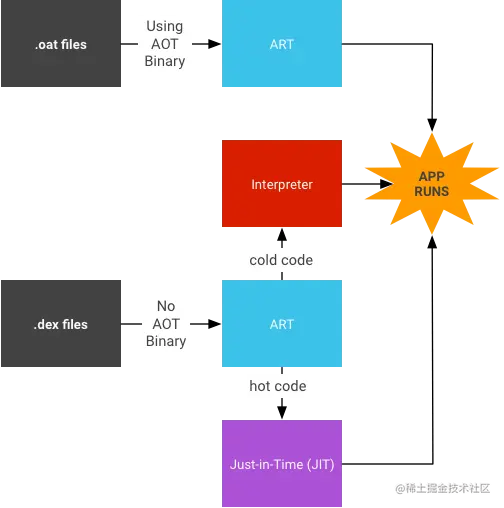
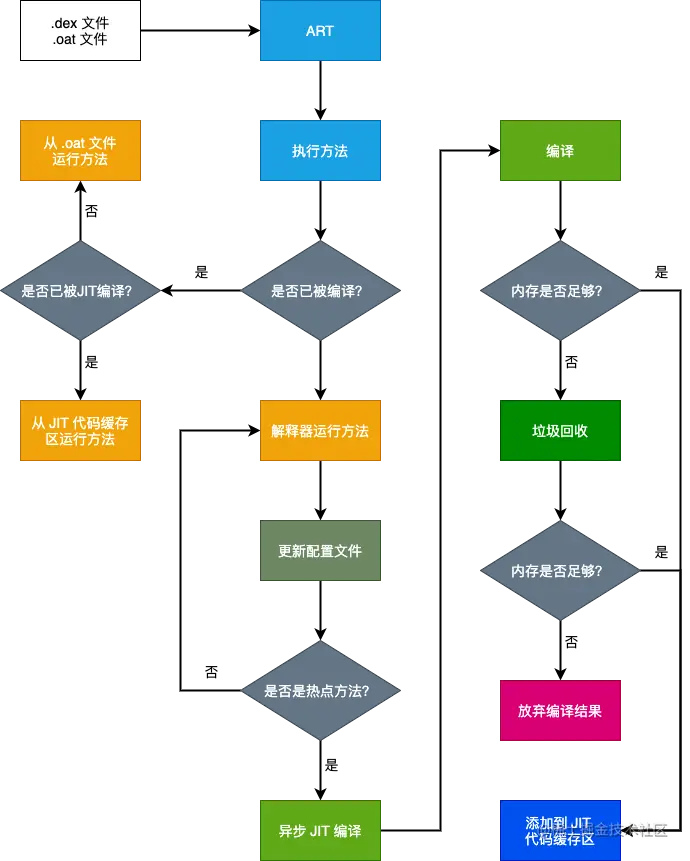
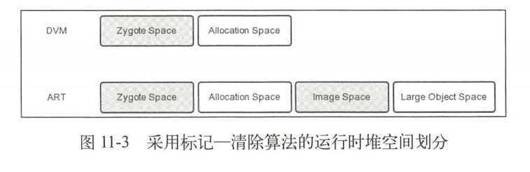
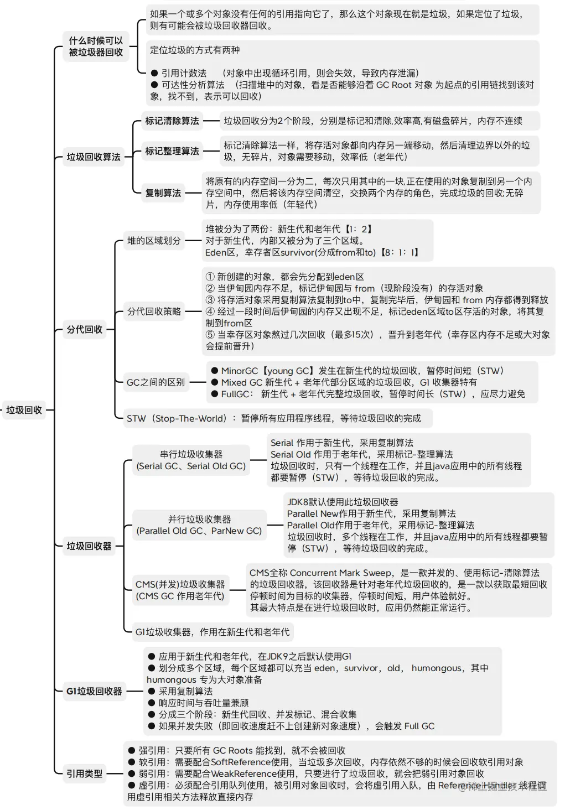

# 内存

[每日笔记-2023-06:3011    Java类加载内存分析](../安卓/每日笔记/每日笔记-2023-06)

[掘金-关于OOM的那些事](https://juejin.cn/post/7236903196148334629?searchId=2023091110443770F2C257EE3063B83933#heading-7)

## DVM虚拟机

### DVM

原名 Dalvik 是 Google 公司自己设计用于 Android 平台的虚拟机， 本质上也是一个 Java 虚拟机，但它并没有遵循 JVM 规范来实现，文件格式 -dex

DVM的堆结构与JVM的堆结构有所区别，主要体现在**将堆分成了Active堆和Zygote堆**

#### JIT 和 AOT 区别

- Just In Time

  DVM 使用 JIT 编译器，每次应用运行时，它实时的将一部分 dex 字节码翻译成机器码。在程序的执行过程中，更多的代码被编译缓存，由于 JIT 只翻译一部分代码，它消耗更少的内存，占用更少的物理内存空间

- Ahead Of Time

  ART 内置了一个 AOT 编译器，在应用安装期间，她将 dex 字节码编译成机器码存储在设备的存储器上，这个过程旨在应用安装到设备的时候发生，由于不在需要 JIT 编译，代码的执行速度回快很多


### DVM与JVM区别

[掘金](https://juejin.cn/post/6961611061229256712?searchId=202311211926435050C826BC4424AA2E6A#heading-0)

#### 架构区别

【JVM基于栈】

+ 以**零地址指令**为主，执行过程依赖于操作栈。指令数更多，指令集更小，编译器易实现。
+ 设计和实现简单，适用于资源受限的系统。

【DVM基于寄存器】

+ 以**多地址指令**为主，执行过程依赖于寄存器。指令数更少，指令集更大，执行性能好
+ 没有大量的出入栈指令，且指令更紧凑简洁
+ 指令集架构完全依赖硬件，可移植性差，难跨平台

【指令对比】`int x = 4; int y = 2;` 计算 `(x + y) * (x - y)` ：

```java
// JVM 字节码指令（基于栈）
0: iload_1	// 从局部变量1号槽位读取变量x的值到操作数栈 [4
1: iload_2	// 从局部变量2号槽位读取变量y的值到操作数栈 [4,2
2: iadd		// 栈顶两个元素相加并保存到操作数栈(x+y)   [6
3: iload_1	// 从局部变量1号槽位读取变量x的值到操作数栈 [6,4
4: iload_2	// 从局部变量2号槽位读取变量y的值到操作数栈 [6,4,2
5: isub		// 栈顶两个元素相减并保存到操作数栈(x-y)   [6,2
6: imul		// 栈顶两个元素相乘并保存到操作数栈        [12

// DVM 字节码指令（基于寄存器）
0000: add-int v0, v3, v4	// 将v3和v4寄存器的值相加并保存到v0寄存器(x+y)
0002: sub-int v1, v3, v4	// 将v3和v4寄存器的值相减并保存到v1寄存器(x-y)
0004: mul-int/2addr v0, v1	// 将v0和v1寄存器的值相乘并保存到v0寄存器
```


#### 字节码区别

Java类被编译成一个或多个.class文件，每个class文件里面包含了该类的常量池、类信息、属性等信息

【JVM执行**class字节码**】

+ 多个.class文件会打包成`.jar`文件
+ 加载.jar文件会加载里面的全部.class文件，比较慢
+ .jar文件是一个打包压缩文件，I/O操作频繁，类的查比较慢

【DVM执行**dex字节码**】

+ 多个.class文件打包成`.dex`文件，并把包含的信息全部整合在一起，并去除冗余信息
+ 加载.dex文件时会加载里面的全部信息
+ .dex文件是一个整合文件，I/O操作少，类的查比较快

#### 其他区别

+ DVM允许有限的内存中同时运行多个进程。
  + Android中的每一个应用都运行在一个DVM实例中，每一个DVM实例拥有独立的进程空间

+ DVM由Zygote创建和初始化。
  + 每当系统需要创建一个应用程序时，Zygote就会fock自身，快速的创建和初始化一个DVM实例，用于应用程序的运行。
+ DVM有共享机制
  + 不同应用之间在运行时可以共享相同的类，拥有更高的效率
+ DVM在2.2版本以前只使用解释器，没有使用JIT编译器。
  + 早期的DVM每次执行代码都需要解释器将dex代码编译成机器码后再处理，效率不高。
  + JIT编译器会对多次运行的代码（热点代码）矩形编译，生成相当精简的本地机器码（NativeCode），下次执行到相同逻辑的时候，直接使用编译之后的本地机器码，而不需要再编译。需要注意的是，应用程序每一次重新运行时，都要做这个编译工作，因此每次重新打开应用程序都需要JIT编译。


### DVM运行时堆

#### COW策略

COW（copy-on-write）即写时复制

+ 当多个调用者同时请求一个数据时，会同时获取同一个指针指向该数据。
+ 当任意一个调用者想对数据内容进行修改时，会复制一份数据给该调用者，其他调用者仍然指向原来的数据。
+ 如果全部调用者都只读不写数据，则数据不会被复制，永远只有一份，节省存储空间。


#### 运行时堆

Android系统启动后，第一个进程Zygote会创建第一个Dalvik虚拟机，维护了一个Zygote堆。第一个应用程序创建（从Zygote进程fork）时，会使用COW策略，创建Active堆并把Zygote堆中的内容复制进去。

+ Zygote堆：Zygote进程在启动过程中预加载的类、资源和对象，可以在Zygote进程和应用程序中长期，节约内存。
+ Active堆：创建以后，为Zygote进程和应用程序进程分配内存空间，非进程共享，每个进程独立一份，减少对Zygote堆写，减少COW的发生。
+ Card Table：用于DVM Concurrent GC，当第一次矩形垃圾标记后，记录垃圾信息。
+ Heap Bitmap：分为两个，Live Bitmap用来记录上次GC存活的对象，Mark Bitmap用来记录这次GC存活的对象。
+ Mark Stack：在GC的标记阶段使用的，用来遍历存活的对象。


#### 垃圾回收

DVM的运行时堆使用标记—清除算法进行GC，它由两个Space以及多个辅助数据结构组成，两个Space分别是Zygote Space（Zygote Heap）和Allocation Space（Active Heap）。Zygote Space用来管理Zygote进程在启动过程中预加载和创建的各种对象，**Zygote Space不会触发GC**，**在Zygote进程和应用程序进程之间会共享Zygote Space**。在Zygote进程fork第一个子进程之前，会把Zygote Space分为两个部分，原来的已经被使用的那部分堆仍旧叫Zygote Space，而未使用的那部分堆就叫Allocation Space，以后的对象都会在Allocation Space上进行分配和释放。Allocation Space不是进程间共享的，在每个进程中都独立拥有一份。除了这两个Space，还包含以下数据结构。

+ Card Table：用于DVM Concurrent GC，当第一次进行垃圾标记后，记录垃圾信息。
+ Heap Bitmap：有两个Heap Bitmap，一个用来记录上次GC存活的对象，另一个用来记录这次GC存活的对象。
+ Mark Stack：DVM的运行时堆使用标记—清除（Mark-Sweep）算法进行GC，Mark Stack就是在GC的标记阶段使用的，它用来遍历存活的对象。


【Mark阶段】

通过递归，从GC Roots开始标记被引用的对象。为了避免Stop-The-World，采用GC线程和其他线程并发执行，分为两步：

1. 只标记GC Roots对象（在GC过程开始的时刻，被全局变量、栈变量、寄存器对象引用的对象）。
   + 这个阶段会短时间Stop-The-World，防止这些GC Roots对象在此过程中再去引用其他对象
2. 通过这些GC Roots对象的引用关系，找到并标记其他正在使用的对象。
   + 这个阶段并发执行，需要把其他线程对对象的修改记录到Card Table（未修改为clean，修改过为dirty）
   + 执行结束后，需要在此使用GC线程对这些发生修改的对象在此标记（Stop-The-World，量少，速度快）

【Sweep阶段】

+ GC线程和用户线程同时并发执行，同时GC线程开始对未标记的区域做清扫，回收所有垃圾对象。
+ 清楚Live Bitmap中有，MarkBitmap中没有对象，即为垃圾对象。

【缺点】

+ 对CPU资源敏感：在并发阶段，它虽然不会导致用户线程停顿，但会因为占用了一部分线程（或者说CPU资源）而导致应用程序导致应用程序变慢，总吞吐量会降低。
+ 无法处理浮动垃圾：在并发清除时，用户线程新产生的垃圾，称为浮动垃圾。

### GC日志

在 DVM 中每次垃圾收集都会将 GC 日志打印到 logcat 中，具体格式为： `<GC_Reason> <Amount_freed>, <Heap_stats>, <External_memory_stats>, <Pause_time>`

#### GC原因

`GC_Reason`指的是引起GC的原因，有以下几种：

+ GC_CONCURRENT：当堆开始填充，并发GC可以释放内存。
+ GC_FOR_MALLOC：当堆内存已满时，App尝试分配内存而引起的GC，系统必须停止App并回收内存。
+ GC_HPROF_DUMP_HEAP：当你请求创建HPROF文件来分析对内存时出现的GC。
+ GC_EXPLICIT：显式的GC，例如调用System.gc()（应该避免调用显式的GC，信任GC会在需要时运行）
+ GC_EXTERNAL_ALLOC：仅适用于API级别小于等于10，且用于外部分配内存的GC。

#### 其他字段

`Amount_freed`：本次 GC 释放内存的大小。

`Heap_stats`：堆的空闲内存百分比（已用内存 / 堆总内存）。

`External_memory_stats`：API 小于等于级别 10 的内存分配（已分配的内存 / 引起 GC 的阈值）。

`Pause_time`：暂停时间，堆越大暂停时间越长。并发暂停时间会显示两个，一个是垃圾收集开始时， 另一个是垃圾收集快要完成时。

### 日志示例

```
D/dalvikvm: GC_CONCURRENT freed 2012K, 63% free 3213K/9291K, external 4501K/5161K, paused 2ms+2ms
```

本次 GC 原因是 GC_CONCURRENT；释放内存 2012KB；堆空闲内存占比 63%，已用3213KB，总内存为 9291KB；暂停总时长 4ms。


## ART虚拟机

### ART

ART（Android Runtime）虚拟机于Android 4.4发布，Android 5.0 中默认使用，用来代替Dalvik虚拟机

### 与DVM的区别

#### 运行机制区别

【DVM基于JIT运行】

运行程序时使用解释器执行，同时将热点代码通过JIT编译器编译成机器码，并缓存到`jit code cache`，再执行时就无需解释直接运行。

【ART基于AOT运行】

+ Android 7.0 以前：安装APK时把全部字节码矩形AOT编译成机器码`.oat`文件，并存储到磁盘，程序运行时不需要编译直接使用。
+ Android 7.0 开始：安装APK时不进行全量编译，运行程序时使用解释器执行。
  + 将热点代码矩形JIT编译成机器码并缓存到`jit code cache`
  + 把经过JIT编译的热点方法记录到Profile配置文件中。
  + 当设备闲置和充电时，会启动编译守护进程，根据Profile文件把热点方法进行AOT编译成机器码`.oat`文件，并存储到磁盘待下次运行时直接使用。

#### CPU区别

+ DVM只支持32位CPU
+ ART支持64位CPU并兼容32位CPU

这也是DVM被淘汰的主要原因之一


#### 其他区别

+ ART对垃圾回收机制进行了改进，比如更频繁地执行垃圾收集，将GC暂停由2次减少为1次等。
+ ART的运行时堆空间和DVM不同。


### 解释器、JIT和AOT

Java为了实现“一次编写随处运行”，将java代码编译成与本地平台无关的字节码文件，让字节码文件在不同平台、不同系统的不同虚拟机上运行，从而实现跨平台。而虚拟机运行字节码文件有多种不同方式：`解释器`、`JIT`和`AOT`

【解释器】：解释器一次编译一行字节码并运行，实现成本低，性能低。

【JIT】：即时编译（Just-in-time）

+ 一次编译一个方法然后缓存到`jit code cache`，再次执行相同方法时就无需解释器编译，而直接运行，性能一般。
+ JIT只会对经常执行的字节码（循环、高频方法）进行编译，以减少编译器负担
+ 程序运行结束后，已编译并缓存的机器码就会被清除，下次运行会在此编译

【AOT】：提前编译（Ahead-of-time）

+ 将全部字节码一次性编译成本地机器码，生成`.oat`文件并存储到磁盘控件，程序运行时不需要编译直接使用，性能好。
+ 由于会对全部字节码进行编译，因此安装APK时速度慢、安装之后占用的空间较大

> **⭐️注意**：尽管JIT和AOT使用相同的编译器，且举行的一系列优化也比较相似，但它们生成的代码可能会有所不同。JIT会利用运行时类型信息，可以更高效的进行内联，并让堆栈替换（OSR）编译成为可能，而这一切会使其生成的代码略有不同。

#### 三者配合



+ 已编译完成的机器码`.oat`文件，ART虚拟机直接运行。
+ 未编译的字节码`.dex`文件，ART虚拟机先判断是否热点文件：
  + 非热点代码：使用解释器解释执行。
  + 热点代码：使用JIT编译运行。


#### method的编译运行

在ART中，执行一个方法前，可以在`ArtMethod`结构体中判断该方法是否已经被编译过了，从而使用不同的策略来执行方法。



当设备空闲且在充电时，AOT编译守护程序（`dex2oat`）将解析JIT配置文件来编译热点方法。

1. 唤醒并分析全部APK。
2. 判断该app是否被其他app所依赖使用：如果是，则全量编译该apk中的字节码，生成`.oat`文件。
3. 否则判断对应的配置文件数据是否有意义：如果是，则根据配置文件中的描述，编译部分字节码，生成`.oat`文件。

### 垃圾回收

与DVM的GC不同的是，ART采用了多种垃圾收集方案，每个方案会运行不同的垃圾收集器，默认采用了CMS，该方案主要使用了sticky-CMS和partial-CMS。根据不同的CMS方案，ART的运行时堆的空间也会由不同的划分，默认是由4个Space和多个辅助数据结构组成的，4个Space分别是Zygote Space、Allocation Space、Image Space和Large Object Space。Zygote Space、Allocation Space和DVM中的作用是一样的，Image Space用来存放一些预加载类，Large Object Space用来分配一些大对象（默认大现为12KB），其中Zygote Space和Image Space是进程见共享的。采用标记—清除算法的运行时堆空间划分如图11-3所示。



除了这四个Space、ART的Java堆中还包括两个Mod Union Table，一个Card Table，两个Heap Bitmap，两个Object Map，以及三个Object Stack。


不同版本，垃圾回收器不同，运行时堆也不同。而ART同时包含多种方案，OEM厂商可以更改GC类型。

#### Android 8 之前

默认采用并发标记清除（CMS）方案

支持内存压缩，但是有条件，进行的次数不多，可能会产生内存碎片

+ 应用进入后台之前，它会避免执行压缩
+ 应用进入后台之后，它会暂停应用线程以执行压缩（Stop-The-World）
+ 如果对象分配因内存碎片而失败，则必须执行压缩操作，应用可能会短时间无响应

#### Android 8 开始

默认采用并发复制（CC）方案

+ 支持使用名为"RegionTLAB"的触碰指针分配器。此分配器可以向每个应用线程分配一个线程本地分配缓冲区，这样应用线程只需触碰“栈顶”指针，而无需任何同步操作，即可从其TLAB中将对象分配出去。
+ 依靠读取屏障拦截来自堆的引用读取，并发复制对象来执行对碎片整理，从而不用暂停用户线程
+ GC只有一次很短的暂停，对于堆大小而言，盖茨暂停在时间上是一个常量

#### Android 10 开始

默认采用并发复制（CC）方案，但是增加了分待处理

+ 支持快速回收存留期较短的对象，提高GC吞吐量，并降低全堆GC的执行。

### GC日志

ART 会在**主动请求 GC** 时或**认为 GC 速度慢**（暂停超过5ms或者持续超过100ms，且暂停可以被察觉）时才会打印 GC 日志，具体格式为：

```
<GC_Reason> <GC_Name> <Objects_freed>(<Size>) AllocSpace Objects, <Large_objects_freed>(<size>) <Heap_stats> LOS objects , <Pause_time> <Total_time>
```

#### GC 原因

`GC_Reason` 指的是引起 GC 的原因，有以下几种。

- `Concurrent`：并发 GC，不会使 App 的线程暂停，该 GC 在后台线程运行，不会阻止内存分配。
- `Alloc`：当堆内存已满时，App 尝试分配内存引起的 GC，这个 GC 会发生在正在分配内存的线程中。
- `Explicit`：App显式的请求垃圾回收，例如调用 `System.gc()`。
- `NativeAlloc`：Native 内存分配时，触发的 GC。
- `CollectorTransition`：由堆转换引起的回收，运行时切换 GC 引起的。将所有对象从空闲列表空间复制到碰撞指针空间，反之亦然。仅出现在内存较小的设备上App将进程从可察觉的暂停状态更改为可察觉的非暂停状态。
- `HomogeneousSpaceCompact`：齐性空间压缩是指空闲列表到压缩的空闲列表空间，通常发生在App移动到可察觉的暂停进程状态。以此来减小内存使用并对堆内存进行碎片整理。
- `DisableMovingGc`：不是真正触发 GC 的原因。发生并发堆压缩时，由于使用了GetPrimitiveArrayCritical，收集会被阻塞。
- `HeapTrim`：不是触发 GC 的原因。收集会一直被阻塞，直到堆内存整理完毕。

#### 垃圾收集器名称

`GC_Name` 指的是垃圾收集器名称，有以下几种。

- `Concurrent Mark Sweep`：CMS 收集器，采用标记清除算法实现，收集暂停时间短。完整的堆垃圾收集器，能释放除了 Image Space 外的所有空间。
- `Concurrent Partial Mark Sweep`：局部收集器，能释放除了 Image Space 和 Zygote Space 外的所有空间。
- `Concurrent Sticky Mark Sweep`：粘性收集器，基于分代的垃圾收集思想，只能释放自上次 GC 以来分配的对象。比完整或局部垃圾收集器扫描更频繁、更快且暂停时间更短。
- `Marksweep + Semispace`：非并发的 GC，复制 GC 用于堆转换以及碎片整理。

#### 其他字段

- `Objects_freed`：从非 Large Object Space 中回收的对象的数量。
- `Size_freed`：从非 Large Object Space 中回收的字节数。
- `Large_objects_freed`：从 Large O同ect Space 中回收的对象的数量。
- `Large_object_size_freed`：从 Large Object Space 中回收的字节数。
- `Heap_stats`：堆的空闲内存百分比，即（已用内存 / 堆的总内存）。
- `Pause_times`：暂停时间，暂停时间与在 GC 运行时修改的对象引用的数量成比例。目前， ART 的 CMS 收集器仅有一次暂停，它出现在 GC 的结尾附近。移动的垃圾收集器暂停时间会很长，会在大部分垃圾回收期间持续出现 。


## Java运行时数据区

[51博客](https://blog.51cto.com/u_14153136/3150535)

[掘金](https://juejin.cn/post/7057538798686568461?searchId=20231024145524BDA07908B05A17FFEC59)

前三个是线程私有的，方法区和堆是所有线程共享的

#### 1.程序计数器

(JVM 中唯一不会发生OOM的内存区域)

主要是作为当前线程执行时的字节码行号指示器来使用的，当线程执行一个 Java 方法时，记录线程正在执行的字节码指令地址，当执行引擎处理完某个指令后，程序计数器需要进行对应更新，将指针改向下一条要执行的指令地址，执行引擎会根据 PC 计数器中记录的地址进行对应的指令执行。当线程在执行一些由`C/C++`编写的`Native`方法时，PC 计数器中则为空（`Undefined`）。除此作用之外，也可以保证线程发生 CPU 时间片切换后能恢复到正确的位置执行。

#### 2.虚拟机栈

(可能抛出 StackOverFlowError 和 OutOfMemoryError)
**栈帧**：栈帧存储方法的相关信息，包含**局部变量表、返回值、操作数栈、动态链接**。
***一个栈帧对应一个方法调用***
（a）局部变量表：包含了方法执行过程中的所有变量。局部变量数组所需要的空间在编译期间完成分配，在方法运行期间不会改变局部变量数组的大小。

> 局部变量表中存储的数据只对于当前方法中有效，虚拟机在执行时，依靠于操作数栈与局部变量表中存储的数据完成执行操作。方法执行结束后，局部变量表会随着栈帧的的出栈/销毁而随之销毁。一般而言，如果当前方法属于构造方法或实例方法，那么这些方法的局部变量表中下标为`0`的槽位必然存储的是`this`引用，也就是局部变量表中的第一个位置会被用来放当前方法所属的对象引用，其他的局部变量会按照顺序在局部变量表中进行存储。如下图：
>
> 

（b）返回值：如果有返回值的话，压入调用者栈帧中的操作数栈中，并且把PC的值指向方法调用指令后面的一条指令地址。

> 一个方法当开始被执行引擎执行时，只有两种情况会导致方法退出，一种是在执行过程中遇到了正常返回的字节码指令，如：`ireturn、lreturn、dreturn、areturn、return`，释义如下：
>
> - `ireturn`：返回值为`int、byte、char、short、boolean`类型时使用该指令返回
> - `lreturn`：返回值为`long`类型时使用该指令返回
> - `dreturn`：返回值为`double`类型时使用该指令返回
> - `areturn`：返回值为引用类型时使用该指令返回
> - `return`：无返回`void`、类或接口初始化方法时使用该指令返回
>
> 方法正常执行完成后退出的情况被称为**正常完成出口**，一般执行返回的字节码指令时，调用者的程序计数器会被作为返回的地址。
>
> 除开正常执行完成后退出的情况外，还有一种情况也会导致方法的退出，那就是方法执行过程中出现了异常，并且在方法体中没有处理该异常（没有`try/catch`），此时也会导致方法退出，这种情况下被称为**异常完成出口**，返回地址则需要通过异常处理器表来确定。
>
> 当一个方法执行结束退出时，会执行如下步骤：
>
> - ①复原上层方法的局部变量表以及操作数栈。
> - ②如果当前方法有返回值的情况下，把返回值压入调用者方法栈帧的操作数栈中。
> - ③将PC计数器的地址指向改为方法下一条指令的位置，从而使得调用者正常工作。
> - PS：异常退出的情况下，是不会给上层调用者返回任何值的。

（c）操作数栈：操作变量的内存模型。操作数栈的最大深度在编译的时候已经确定（写入方法区`code`属性的`max_stacks`项中）。操作数栈的元素可以是任意Java类型，包括long和double，32位数据占用栈空间为1,64位数据占用2。方法刚开始执行的时候，栈是空的，当方法执行过程中，各种字节码指令往栈中存取数据。
（d）动态链接：每个栈帧中都持有在运行时常量池中该栈帧所属方法的引用，持有这个引用是为了支持方法中的动态链接（比如`invokedynamic`指令的调用）

> 在Java源文件被编译成Class文件时，类中所有的变量、方法调用都会化为符号引用，然后保存在`class`文件的常量池中，在`class`文件中描述一个方法调用另一个方法时，就使用常量池中指向方法的符号引用来表示的。动态链接的作用就是为了将这些符号引用转换为调用方法的直接引用。

> 常量池：位于编译后生成的`class`字节码文件中。
> 运行时常量池：位于运行期间的元数据空间/方法区中。

[虚拟机栈的特点与运行原理](https://juejin.cn/post/7057538798686568461?searchId=20231024145524BDA07908B05A17FFEC59#heading-4)


#### 3.本地方法栈

(可能抛出 StackOverFlowError 和 OutOfMemoryError)

存储Java程序 native 方法的调用栈

它与Java虚拟机栈类似，只不过本地方法栈是用来支持Native方法的。如果Java虚拟机不支持Native方法，并且也不依赖于CStacks,可以无须支持本地方法栈。在Java虚拟机规范中对本地方法栈的语言和数据结构等没有强制规定，因此具体的Java虚拟机可以自由实现它，比如HotSpot VM将本地方法栈和Java虚拟机栈合二为一。

#### 4.元数据空间|方法区|永久代

(可能抛出 OutOfMemoryError)

包含运行时常量池、类信息

> 常量池用来存放编译时期生成的字面量和符号引用，这些内容会在类加载后存放在方法区的运行时常量池中。运行时常量池可以理解为是类或接口的常量池的运行时表现形式。

用于存储已被虚拟机加载的类信息、常量、静态变量、即时编译后的代码等数据

> 方法区并不等同于永久代，只是因为 HotSpot VM 使用永久代来实现方法区，对于其他的 Java 虚拟机，比如 J9和JRockit 等，并不存在永久代概念。

#### 5.堆

(可能抛出 OutOfMemoryError)

大部分 JVM 调优手段是基于堆空间进行展开
（a）Java堆是虚拟机管理的内存中最大的一块
（b）在虚拟机启动时创建
（c）此内存区域的唯一目的就是存放对象事例，几乎所有对象实例都在这里分配内存。存放new生成的对象和数组
（d）Java堆是垃圾收集器管理的内存区域，因此很多时候称为GC堆

[Java 堆空间](https://juejin.cn/post/7057538798686568461?searchId=20231024145524BDA07908B05A17FFEC59#heading-13)

Java堆同时也是变化比较频繁的区域，在不同Java版本中，堆空间也发生了不同的改变：

- JDK7及之前：堆空间包含新生代、年老代以及永久代。
- JDK8：堆空间包含新生代和年老代，永久代被改为元数据空间，位于堆之外。
- JDK9：堆空间从逻辑上保留了分代的概念，但物理上本身不分代。
- JDK11：堆空间从此以后逻辑和物理上都不分代。

本质上来说，影响堆空间结构的并不是Java版本的不同，Java堆结构是跟JVM运行时所使用的垃圾回收器息息相关的，由GC器决定了运行时的堆空间会被划分为何种结构。

> 在JDK1.8及之前的Java版本中，几乎所有的GC器都会把堆空间划分为至少两个区域：新生代和年老代，但在JDK1.9到之后的GC器中，大多数的GC器开始了不分代的路子（具体原因稍后分析）。


##### 分代堆空间

JDK1.8之前的堆结构是完全分代，逻辑+物理分代

运行时物理内存被划分为几块不同的内存：一个`Eden`区、两个`Survivor`区（`From/To`区）以及一个`Old`区，从物理内存上来说各个区域都是**完整且连续**的内存，每块区域都用与存储不同的对象实例，相互之间并不干扰

##### 不分代堆空间

JDK1.9时，G1 正式出道，成为 JVM 内嵌的默认 GC 器，Java 堆空间从此出现了不分代的概念，一种逻辑分代物理不分代（G1），另一种逻辑+物理都不分代（ZGC、ShenandoahGC）。


##### JDK7及以前的堆空间的内存划分

GC 器都是物理+逻辑分代，包括内嵌的默认 GC 器Parallel Scavenge（新生代）+ Parallel Old（老年代）也分代，所以一般堆空间会被划分为三个区域：新生代、老年代以及永久代：

+ 新生代：一个`Eden`区、两个`Survivor`区（`From/To区`），比例：8：1：1
+ 年老代：一个`Old`区
+ 永久代：方法区

新生代主要用于存储未达到年老代分配条件的对象，其中 `Eden` 区是专门用来存储刚创建出来的对象实例，两个 `Survivor` 区主要用于垃圾回收时给存活对象“避难”。
 年老代主要用于存储达到符合分配条件的对象实例，比如达到“年龄”的对象以及过大“体积”的大对象等。
 方法区/永久代主要用于存储类的元数据信息，如类描述信息、字段信息、方法信息、静态变量信息、异常表、方法表等。

##### JDK8堆空间内存划分

到了JDK1.8的时候，JVM 将永久代，也就是方法区整合成了元数据空间，并且将其移除了堆，将其存放在空间外的本地内存中。（原方法区中的数据并不是所有都被迁移到了元空间存储，有些数据被分散到了 JVM 各个区域）。此之外，常量池在1.8的时候也被移到了堆外。

##### JDK9堆空间内存划分

Java9默认 GC 器改为了 G1，所以堆中得内存区域被划分为了多个大小相等的独立的 `Region` 区域，不过 `HotSpot` 的源码 `TAGET_REGION_NUMBER` 定义了 `Region` 区的数量限制为 `2048` 个（实际上允许超过这个值，但是堆空间会变得难以管理）

G1中的年老代晋升条件和之前的无差，达到年龄阈值的对象会被转入年老代的`Region`区中，不同的是对于大对象的分配，在G1中不会让大对象进入年老代，在G1中由专门存放大对象的`Region`区叫做`Humongous`区，如果在分配对象时，判定出一个对象属于大对象，那么则会直接将其放入`Humongous`区存储。

> 在G1中，判定一个对象是否为大对象的方式为：对象大小是否超过单个普通`Region`区的50%，如果超过则代表当前对象为大对象，那么该对象会被直接放入`Humongous`区。比如：目前是8GB的堆空间，每个`Region`区的大小为`4MB`，当一个对象大小超过`2MB`时则会被判定为属于大对象

`Humongous`区存在的意义：可以避免一些“短命”的巨型对象直接进入年老代，节约年老代的内存空间，可以有效避免年老代因空间不足时的GC开销。

当堆空间发生全局GC(`FullGC`)时，除开回收新生代和年老代之外，也会对`Humongous`区进行回收。

##### JDK11堆空间内存划分

JDK11使用 ZGC 垃圾回收器，也是一款基于 Region 区内存布局的 GC 器，这款 GC 器是真正意义上的不分代，无论是从逻辑上还是物理上不分代。

ZGC 中的 Region 区不存在分代的概念，它仅仅将所有 Region 区分为了大、中、小三个等级：

+ 小型 Region 区（Small）：固定大小 2MB，用于分配小于 256KB 的对象。

+ 中型 Region 区（Medium）：固定大小为 32MB，用于分配 >=256KB ~ <=4MB 的对象。

+ 大型 Region 区（Large）：没有固定大小，容量动态变化，但是大小必须为 2MB 的整数倍，专门用于存放 >4MB 的巨型对象。

  > 值得一提的是，每个 Large 区只能存放一个大对象，也就代表着你的这个大对象多大，那么这个 Large 区就为多大，所以一般情况下，Large 区的容量要小于 Medium 区，并且需要注意：Large 区的空间是不会被重新分配的。

##### 总结

Java堆空间是JVM运行时内存区域中占比最大的一块，此内存区域唯一的目的就是存储运行时创建出的对象实例。同时，随着运行时采用的GC器不同，Java堆也会被分为不同的结构，其中主要可分为分代和不分代的两类结构。相对来说，分代结构是最适合Java对象“朝生夕死”的特性的，如果堆结构是分代的，可以使得JVM能够更好的管理堆内存中的对象，包括内存的分配以及回收。


### 垃圾收集算法

Java语言会自动分配和回收内存，其中内存回收是由 JVM 中的垃圾回收器来提供支持的。在 JVM 中，内存分配的 基本单位是对象，所以内存回收也是以对象为单位来回收的。

垃圾收集过程分成两步：

0. 标记哪些对象需要回收；
1. 怎么回收这些对象。

标记内存中哪些对象需要回收的算法由两种，分别是引用计数器法和可达性分析法。

**引用计数器法**

引用计数器法指的是在每个对象中维护一个计数器，当有一个地方引用它时计数器就加一，当一个引用失效时计数器就减一，当计数器为 0 的时候判定对象是垃圾内存，需要回收。

引用计数器法需要解决循环引用的问题，即两个对象互相引用，其他再没有地方引用它们，这时它们应该算是需要被回收对象才对，但是它们的引用计数器却不是 0。（Java中使用的是可达性分析法，不会有这个问题）

**可达性分析法**

可达性分析法指通过一系列被称为 “GC Roots” 的根对象作为起始节点集，从这些节点开始根据引用关系向下搜索，在搜索过程中能够遍历到的对象就是存活的对象，没有遍历到的对象就是垃圾对象，需要回收。

> 值得注意的是，所有的垃圾收集器使用的判断对象是否可回收的算法都是**可达性分析法**。因为可达性分析法没有循环引用的问题，而要解决引用计数器法的循环引用问题，带来的复杂性和性能消耗可能会得不偿失。


确定了哪些内存可以回收之后我们需要确定怎么回收，在 Java 虚拟机发展过程中出现了许多垃圾收集算法。

**标记-清理算法**

分为标记和清理两个步骤，其中标记是使用前面介绍的可达性分析法将可回收对象标记出来，标记结束后，统一回收掉所有的被标记对象。

标记-清理算法会造成大量不连续的内存碎片，因为给对象分配内存需要连续的内存空间，如果空间碎片太多的话会出现当前总的内存可用空间大于需要分配的空间，但是连续的内存可用空间都小于需要分配的内存，从而导致 JVM 需要提前触发垃圾收集动作。

**标记-复制算法**

标记-复制算法将内存按容量划分为大小相等的两块，每次只使用其中一块，当这一块内存用完了之后就将存活的对象复制到另外一块内存中，然后吧一块的内存一次清理掉。

因为每次垃圾收集之后都会将存活对象复制到另外一块内存区域，这里的复制和后续的新对象分配都是从内存区域的开头开始分配的，所以不会存在空间碎片的问题，但是这种算法的缺点也明显，只能使用可用内存空间的一半，空间浪费非常严重。

**标记-整理算法**

标记-整理算法的标记阶段和标记-清理算法一样，先标记出所有可回收对象，然后让所有存活对象向内存空间的一端移动，最后直接清理掉最后一个存活对象之后的所有内存控件，移动存活对象时就像整理一个个货物，所以它被称为标记-整理算法。

标记-整理算法看似比前两种算法都优秀，因为它既没有空间碎片的问题也没有空间浪费的问题，但是在整理过程中需要移动存活对象，移动之后需要更新所有引用这些对象的地方，这是一项非常中的操作。


### Java的分代回收机制

#### 新生代——复制回收机制

对于新生代区域，由于每次 GC 都会有大量新对象死去，只有少量存活。因此采用`复制`回收算法，GC 时把少量的存活对象复制过去即可。

对于8:1:1（Eden、Survivor A、Survivor B）的新生代，工作原理如下：

工作原理如下：

1. 首先，`Eden`区最大，对外提供堆内存。当 `Eden` 区快要满了，则进行 `Minor GC`，把存活对象放入`Survivor A`区，清空 `Eden` 区；
2. `Eden`区被清空后，继续对外提供堆内存；
3. 当`Eden`区再次被填满，此时对`Eden`区和`Survivor A`区同时进行 `Minor GC`，把存活对象放入`Survivor B`区，同时清空`Eden` 区和`Survivor A`区；
4. `Eden`区继续对外提供堆内存，并重复上述过程，即在`Eden`区填满后，把`Eden`区和某个`Survivor`区的存活对象放到另一个`Survivor`区；
5. 当某个`Survivor`区被填满，且仍有对象未被复制完毕时，或者某些对象在反复`Survive` `15` 次左右时，则把这部分剩余对象放到`Old`区；
6. 当 `Old` 区也被填满时，进行 `Major GC`，对 `Old` 区进行垃圾回收。

> 注意：在真实的 JVM 环境里，可以通过参数 `SurvivorRatio` 手动配置`Eden`区和单个`Survivor`区的比例，默认为8。

#### 老年代——标记整理回收机制

根据上面我们知道，老年代一般存放的是存活时间较久的对象，所以每一次GC时，存活对象比较大，也就是说每次只有少部分被回收。因此这里选择存活对象多，垃圾少的标记整理回收机制，仅仅通过少量地移动对象就能清理垃圾，而且不存在内存碎片化。


#### 方法区的回收

因为方法与主要存放永久代对象，永久代对象的回收率比新生代低很多，所以在方法区上进行回收性价比不高。主要是对常量池的回收和对类的加载。

为了避免内存溢出，在大量使用反射和动态的场景都需要虚拟机具备类卸载功能。类的卸载条件很多，需要满足一下三个条件，并且满足了条件也不一定会被卸载：

+ 该类所有的实例都已经被回收，此时堆中不存在该类的任何实例
+ 加载该类的ClassLoader已经被回收
+ 该类对应的Class对象没有在任何地方被引用，也就无法在任何地方通过反射访问该类方法。


### MinorGC、 Mixed GC 、 FullGC的区别是什么

1. **Minor GC（新生代垃圾回收）：**
   - 发生在新生代内存区域（通常是Eden区和Survivor区）。
   - 主要回收生命周期短的对象，即存活时间较短的对象。
   - 通常使用复制算法来进行垃圾回收，将存活的对象复制到Survivor区域，并清理掉不再使用的对象。
   - Minor GC的目标是保持新生代的空间可用，以便存放新对象。
2. **Mixed GC（混合垃圾回收）：**
   - 发生在新生代和老年代之间。
   - 将新生代中存活的对象移动到老年代，以减少新生代的内存压力。
   - 通常在新生代空间不足时，会触发Mixed GC，它的目标是在新生代和老年代之间平衡内存使用。
3. **Full GC（老年代垃圾回收）：**
   - 主要回收生命周期较长的对象，即存活时间较长的对象。
   - 通常会涉及到对整个堆内存的垃圾回收，包括新生代和老年代。
   - Full GC的目标是回收整个堆内存的空间，以便释放不再使用的对象，避免内存泄漏。


+ 新生代收集（Minor GC/Young GC）：指目标只是新生代的垃圾收集器。
+ 老年代收集（Major GC/Old GC）：指目标只是老年代的垃圾收集。目前只有CMS收集器会有单独收集老年代的行为。
+ 混合收集（Mixed GC）：指目标是收集整个新生代以及部分老年代的垃圾收集。目前只有G1收集器会有这种行为。
+ 整堆收集（Full GC）：收集整个Java堆和方法区的垃圾收集。


### 垃圾回收器

[掘金](https://juejin.cn/post/7267576847109324839?searchId=2023112115595151352659940005924E07#heading-21)



