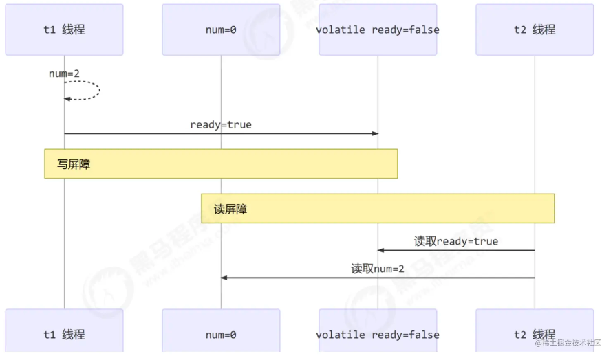

#### volatile如何保证可见性

有volatile变量修饰的共享变量进行写操作的时候会多出第二行汇编代码，通过查IA-32架构软件开发者手册可知，Lock前缀的指令在多核处理器下会引发了两件事情：

1）将当前处理器缓存行的数据写回到系统内存。

2）这个写回内存的操作会使在其他CPU里缓存了该内存地址的数据无效。

> 为了提高处理速度，处理器不直接和内存进行通信，而是先将系统内存的数据读到内部缓存（L1，L2或其他）后再进行操作，但操作完不知道何时会写到内存。如果对声明了volatile的变量进行写操作，JVM就会向处理器发送一条Lock前缀的指令，将这个变量所在缓存行的数据写回到系统内存。但是，就算写回到内存，如果其他处理器缓存的值还是旧的，再执行计算操作就会有问题。所以，在多处理器下，为了保证各个处理器的缓存是一致的，就会实现缓存一致性协议，每个处理器通过嗅探在总线上传播的数据来检查自己缓存的值是不是过期了，当处理器发现自己缓存行对应的内存地址被修改，就会将当前处理器的缓存行设置成无效状态，当处理器对这个数据进行修改操作的时候，会重新从系统内存中把数据读到处理器缓存里。

#### synchronized

先来看下利用synchronized实现同步的基础：Java中的每一个对象都可以作为锁。具体表现

为以下3种形式。

+ 对于普通同步方法，锁是当前实例对象。
+ 对于静态同步方法，锁是当前类的Class对象。
+ 对于同步方法块，锁是Synchonized括号里配置的对象。

synchronized用的锁是存在Java对象头里的。如果对象是数组类型，则虚拟机用3个字宽（Word）存储对象头，如果对象是非数组类型，则用2字宽存储对象头。在32位虚拟机中，1字宽等于4字节，即32bit

#### 内存屏障

Java内存模型还定义了内存屏障（Memory Barrier），用于控制内存交互操作的顺序和可见性。
内存屏障分为四种类型：

- LoadLoad屏障：保证load指令之前的所有load指令已经执行完毕。
- StoreStore屏障：保证store指令之前的所有store指令已经执行完毕。
- LoadStore屏障：保证load指令之前的所有store指令都已经执行完毕，并且能够读取到最新的变量值。
- StoreLoad屏障：保证store指令之前的所有load指令都已经执行完毕，并且该指令所写入的变量值对于其他线程可见。

**内存屏障分为写屏障和读屏障，有什么有呢？**

​	1.**保证可见性**

+ 写屏障保证在该屏障之前的，对共享变量的改动，都同步到主存当中

+ 读屏障保证在该屏障之后，对共享变量的读取，加载的是主存中最新数据

​	2.**保证有序性**

- 写屏障会确保指令重排序时，不会将写屏障之前的代码排在写屏障之后
- 读屏障会确保指令重排序时，不会将读屏障之后的代码排在读屏障之前

回到前面的问题，如果对`ready`加了`volatile`以后，那么num=2就无法到后面去了，同样读取也是，如上图所示。

> final底层也是通过内存屏障实现的，它与volatile一样。
>
> - 对final变量的写指令加入写屏障。也就是类初始化的赋值的时候会加上写屏障。
> - 对final变量的读指令加入读屏障。加载内存中final变量的最新值。