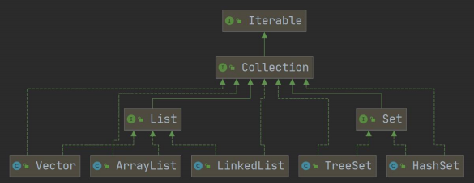
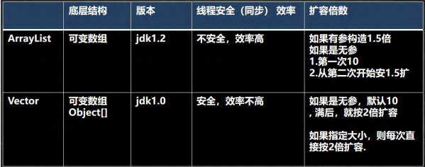
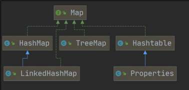

# 集合

## 集合架构体系——Collection和Map

### Collection：



Collection没有直接实现的子类，通过子接口List（有序）、Set（无序）来实现


Iterator主要用于遍历Collection集合中的元素

```java
Iterator iterator = coll.iterator();
//hasNext():判断是否还有下一个元素
while(iterator.hasNext()) {
    //next()作用：1.下移 2.将下移以后集合位置上的元素返回
    System.out.println(iterator.next());
}
```

> 增强for循环就是简化版的iterator，本质一样，只能用于遍历集合或数组。


#### List

```java
void add(int index, Object ele);

Object get(int index);

//obj在集合中首次出现的位置
int indexOf(Object obj);

//obj在集合中末次出现的位置
int lastIndexOf(Object obj);

Object remove(int index);

Object set(int index, Object ele);

//返回从fromIndex到toIndex位置的子集合（fromIndex<=subList<toIndex）
List subList(int fromIndex, int toIndex);
```


`ArrayList`线程不安全，多线程不建议使用

`Vector`线程同步，级线程安全，Vector类的操作方法带有**synchronized**



`LinkedList`线程不安全，底层实现了双向链表和双端队列特点，增删快，改查慢（改查选ArrayList）


#### Set

**无序**，**没有索引**。不允许重复元素，最多包含一个null。

可以使用迭代器和增强for遍历，不能使用索引来获取。

`HashSet`实际上是HashMap

> Java8中，如果一条链表的元素个数到达TREEIFY——THRESHOLD（默认是8），并且table的大小>=MIN_TREEFY_CAPACITY（默认64），就会进行树化（红黑树）


##### 源码分析

```java
//如果当前索引位置对应的链表的第一个元素和准备添加的key的hash值一样，并且满足下面两个条件之一：
//（1）准备加入的 key 和 p 指向的 Node 结点的 key 是同一个对象
//（2）p 指向的 Node 结点的 key 的 equals() 和准备加入的 key 比较后相同 
//就不能加入
Node<K,V> e; K k;
if (p.hash == hash && 
    ((k = p.key) == key || (key != null && key.equals(k))))
    e = p;

//在判断 p 是不是一颗红黑树，
//如果是一个红黑树，就调用 putTreeVal 来进行添加
else if (p instanceof TreeNode)
    e = ((TreeNode<K,V>)p).putTreeVal(this, tab, hash, key, value);
else {
    for (int binCount = 0; ; ++binCount) {
        if ((e = p.next) == null) {
            p.next = newNode(hash, key, value, null);
            if (binCount >= TREEIFY_THRESHOLD -1)
                treeifyBin(tab, hash);
            break;
        }
        if (e.hash == hash && 
            ((k = e.key) == key || (key != null && key.equals(k))))
            break;
        p = e;
    }
}
```


如果当前索引位置对应的链表的第一个元素和准备添加的key的hash值一样，并且满足下面两个条件之一：
（1）准备加入的 key 和 p 指向的 Node 结点的 key 是同一个对象
（2）p 指向的 Node 结点的 key 的 equals() 和准备加入的 key 比较后相同 

就不能加入

### Map：




