## 3 View体系与自定义View

### 3.1 View与ViewGroup

View是Android所有空间的基类，我们平常所用的TextView和ImageView都是继承View的，平常用的布局控件LinearLayout，它继承自ViewGroup。

ViewGroup可以理解为View的组合，它可以包含很多View以及ViewGroup，而它包含的ViewGroup又可以包含View和ViewGroup，以此类推，形成一个View树，如图3-1所示。

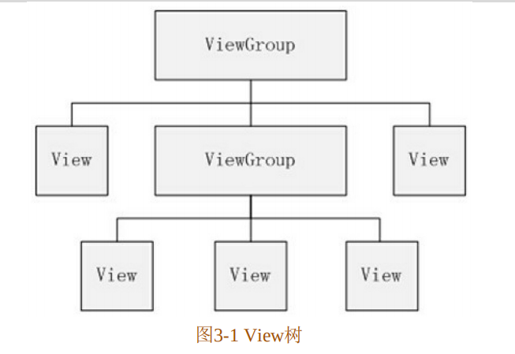

需要注意的是ViewGroup也继承自View。ViewGroup作为View或者ViewGroup这些组件的容器，派生了多种布局控件的子类，比如LinearLayout、RelativeLayout等，一般来说，开发Android应用的UI界面都不会直接使用View和ViewGroup，而是使用这两大基类的派生类。看图3-2有一个直观的了解。

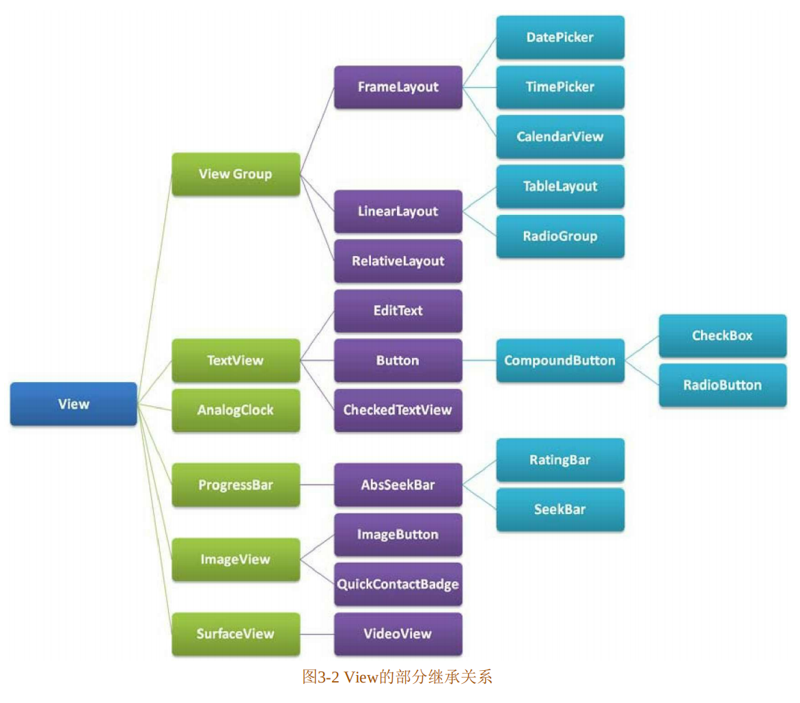


### 3.2 坐标系

Android系统中有两种坐标系，分别是Android坐标系和View坐标系。了解这两种坐标系能够帮助我们实现View的各种操作，比如我们要实现View的滑动，你连这个View的位置都不知道，那如何去操作呢？首先来看Android坐标系。

#### 3.2.1 Android坐标系

将屏幕左上角的顶点作为Android坐标系的顶点。在触控事件中，使用`getRawX()`和`getRawY()`方法获得的坐标也是Android坐标系的坐标。

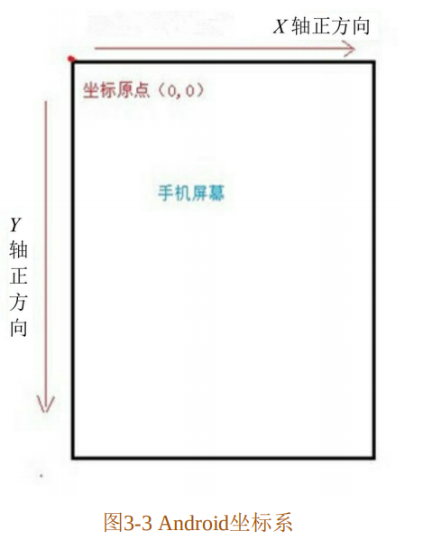


#### 3.2.2 View坐标系

除了Android坐标系，还有一个坐标系：View坐标系，它与Android坐标系并不冲突，两者是共同存在的，它们一起来帮助开发者更好地控制View。对于View坐标系，我们只需要搞明白图3-4中提供的信息就好。

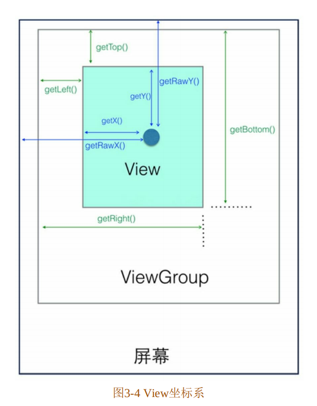

**1.View获取自身的宽和高**

根据图3-4可以得到很多结论，首先我们能计算出View的宽和高：

```java
width = getRight()-getLeft();
height = getBottom() - getTop();
```

当然这样做有些麻烦，因为系统已经向我们提供了获取View宽和高的方法。`getHeight()`用来获取View自身的高度，`getWidth()`用来获取View自身的宽度。从View的源码来看，getHeight()和getWith()获取View自身宽高的算法与上面从图3-4得出的结论是一致的。

```java
public final int getHeight() {
    return mBottom - mTop;
}
public final int getWidth() {
    return mRight - mLeft;
}
```

**2.View自身的坐标**

通过如下方法可以获得View到其父控件（ViewGroup）的距离。

+ getTop()：获取View自身顶边到其父控件（ViewGroup）的距离。
+ getLeft()：获取View自身左边到其父控件的距离。
+ getRight()：获取View自身右边到其父控件的距离。
+ getBottom()：获取View自身底边到其父控件的距离。

**3.MotionEvent提供的方法**

图3-4中间的那个圆点，假设就是我们触摸的点。我们知道无论是View还是ViewGroup，最终的点击事件都会由onTouchEvent（MotionEvent event）方法来处理。MotionEvent在用户交互中作用重大，其内部提供了很多时间常量，比如我们常用的ACTION_DOWN、ACTION_UP和ACTION_MOVE。此外，Motion

Event也提供了获取焦点坐标的各种方法。

+ getX()：获取点击事件距离控件左边的距离，即视图坐标。
+ getY()：获取点击事件距离控件顶边的距离，即视图坐标。
+ getRawX()：获取点击事件距离整个屏幕左边的距离，即绝对坐标。
+ getRawY()：获取点击事件距离整个屏幕顶边的距离，即绝对坐标。


### 3.3 View的滑动

View的滑动是Android实现自定义控件的基础，同时在开发中我们也难免会遇到View的滑动处理。其实不管是哪种滑动方式，其基本思想都是类似的：当点击事件传到View时，牺牲记下触摸点的坐标，手指移动时系统记下移动后触摸的坐标并计算偏移量，并通过偏移量来修改View的坐标。实现View滑动有很多种方法，在这里主要讲解6中滑动方法，分别是layout()、offsetLeftAndRight()与offsetTopAndBottom()、LayoutParams、动画、scrollTo与scrollBy，以及Scroller。

#### 3.3.1 layout()方法

View进行绘制的时候会调用onLayout()方法来设置显示的位置，因此我们同样也可以通过修改View的left、top、right、bottom这4种属性来控制View的坐标。首先我们要自定义一个View，在onTouchEvent()方法中获取触摸点的坐标，代码如下所示：

```java
public boolean onTouchEvent(MotionEvent event) {
    // 获取手指触摸点的横坐标和纵坐标
    int x = (int) event.getX();
    int y = (int) event.getY();
    
    switch (event.getAction()) {
        case MotionEvent.ACTION_DOWN:
            lastX = x;
            lastY = y;
            break;
    ···
    }
}
```

接下来我们在ACTION_MOVE时间中计算偏移量，再调用layout()方法重新放置这个自定义View的位置即可。

```java
case MotionEvent.ACTION_MOVE:
	//计算移动的距离
	int offsetX = x - lastX;
	int offsetY = y - lastY;
	//调用layout方法来重新放置它的位置
	layout(getLeft()+offsetX,getTop()+offsetY,
          getRight()+offsetX,getBottom()+offsetY);
	break;
```

在每次移动时都会调用layout()方法对屏幕重新布局，从而达到移动View的效果。

自定义View，CustomView的全部代码如下所示：

```java
public class CustomView extends View {

    private int lastX;
    private int lastY;

    public CustomView(Context context) {
        super(context);
    }

    public CustomView(Context context, @Nullable AttributeSet attrs) {
        super(context, attrs);
    }

    public CustomView(Context context, @Nullable AttributeSet attrs, int defStyleAttr) {
        super(context, attrs, defStyleAttr);
    }

    public CustomView(Context context, @Nullable AttributeSet attrs, int defStyleAttr, int defStyleRes) {
        super(context, attrs, defStyleAttr, defStyleRes);
    }

    public boolean onTouchEvent(MotionEvent event) {
        //获取手指触摸点的横坐标和纵坐标
        int x = (int) event.getX();
        int y = (int) event.getY();
        switch (event.getAction()) {
            case MotionEvent.ACTION_DOWN:
                lastX = x;
                lastY = y;
                break;
            case MotionEvent.ACTION_MOVE:
                //计算移动的距离
                int offsetX = x - lastX;
                int offsetY = y - lastY;
                //调用layout方法来重新放置它的位置
                layout(getLeft()+offsetX,getTop()+offsetY,
                        getRight()+offsetX,getBottom()+offsetY);
                break;
        }
        return true;
    }
}
```


#### 3.3.2 offsetLeftAndRight()与offsetTopAndBottom()

这两种方法和layout()方法的效果差不多。我们将ACTION_MOVE中的代码替换成如下代码：

```java
case Motion.Event.ACTION_MOVE:
	//计算移动的距离
	int offsetX = x - lastX;
	int offsetY = y - lastY;
	//对left和right进行偏移
	offsetLeftAndRight(offsetX);
	//对top和bottom进行偏移
	offsetTopAndBottom(offsetY);
    break;
```


#### 3.3.3 LayoutParams（改变布局参数）

LayoutParams主要保存了一个View的布局参数，因此我们可以通过LayoutParams来改变View的布局参数从而达到改变View位置的效果。同样，我们将ACTION_MOVE中的代码替换成如下代码：

```java
LinearLayout.LayoutParams layoutParams = (LinearLayout.LayoutParams) getLayoutParams();
layoutParams.leftMargin = getLeft() + offsetX;
layoutParams.topMargin = getTop() + offsetY;
setLayoutParams(layoutParams);
```

因为父控件是LinearLaout，所以我们用了LinearLayout.LayoutParams。如果父控件是RelativeLayout，则要使用RelativeLayout.LayoutParams。除了使用布局的LayoutParams外，我们还可以用ViewGroup.MarginLayoutParams来实现：

```java
ViewGroup.MarginLayoutParams layoutParams = (ViewGroup.MarginLayoutParams) getLayoutParams();
layoutParams.leftMargin = getLeft() + offsetX;
layoutParams.topMargin = getTop() + offsetY;
setLayoutParams(layoutParams);
```


#### 3.3.4 动画

可以采用View动画来移动，在res目录新建anim文件夹并创建translate.xml：

```xml
<?xml version="1.0" encoding="utf-8"?>
<set xmlns:android="http://schemas.android.com/apk/res/android">
    <translate
        android:duration="1000"
        android:fromXDelta="0"
        android:toXDelata="300"/>
</set>
```

接下来在Java代码中调用就好了，代码如下所示：

```java
mCustomView.setAnimation(AnimationUtils.loadAnimation(this,R.anim.translate));
```

运行程序，我们设置的方块会向右平移300像素，然后又会回到原来的位置，为了解决这个问题，我们需要在translate.xml中加上fillAfter="true"，代码如下所示。运行代码后会发现，方块向右平移300像素后就停留在当前位置了。

```xml
<?xml version="1.0" encoding="utf-8"?>
<set xmlns:android="http://schemas.android.com/apk/res/android"
     android:fillAfter="true">
    <translate
        android:duration="1000"
        android:fromXDelta="0"
        android:toXDelata="300"/>
</set>
```

需要注意的是，View动画并不能改变View的位置参数。如果对一个Button进行如上的平移动画操作，当Button平移300像素停留在当前位置时，我们点击这个Button并不会触发点击事件，但在我们点击这个Button的原始位置时却触发了点击事件。对于系统来说这个Button并没有改变原有的位置，所以我们点击其他位置当然不会触发这个Button的点击事件。在Android 3.0时出现的属性动画解决了上述问题，因为它不仅可以执行动画，还能够改变View的位置参数。当然，这里使用属性动画移动那就更简单了，我们让CustomView在1000ms内沿着X轴向右平移300像素，代码如下所示。关于属性动画，会在3.4节进行讲解。

```java
ObjectAnimator.ofFloat(mCustomView,"translationX",0,300).setDuration(1000).start();
```


#### 3.3.5 scrollTo与scrollBy

scrollTo(x,y)表示移动到一个具体的坐标点，而scrollBy(dx,dy)，则表示移动的增量为dx、dy。其中，scrollBy最终也是要调用scrollTo的。View.java的scrollBy和scrollTo的源码如下所示：

```java
public void scrollTo(int x, int y) {
    if (mScrollX != x || mScrollY != y) {
        int oldX = mScrollX;
        int oldY = mScrollY;
        mScrollX = x;
        mScrollY = y;
        invalidateParentCaches();
        onScrollChanged(mScrollX,mScrollY,oldX,oldY);
        if(!awakenScrollBars()) {
            postInvalidateOnAnimation();
        }
    }
}

public void scrollBy(int x, int y) {
    scrollTo(mScrollX + x, mScrollY + y);
}
```

scrollTo、scrollBy移动的是View的内容，如果在ViewGroup中使用，则是移动其所有的子View。我们将ACTION_MOVE中的代码替换成如下代码：

```java
((View)getParent()).scrollBy(-offsetX,-offsetY);
```

这里若要实现CustomView随手指移动的效果，就需要将偏移量设置为负值。为什么要设置为负值呢？

这里若要实现 CustomView 随手指移动的效果，就需要将偏移量设置为负值。为什么要设置为负值呢?下面具体讲解一下。假设我们正用放大镜来看报纸，放大镜用来显示字的内容。同样我们可以把放大镜看作我们的手机屏幕，它们都是负责显示内容的；而报纸则可以被看作屏幕下的画布，它们都是用来提供内容的。放大镜外的内容，也就是报纸的内容不会随着放大镜的移动而消失，它一直存在。同样，我们的手机屏幕看不到的视图并不代表其不存在，如图3-6所示。画布上有3个控件，即Button、EditText利SwichButton。只有Button在手机屏幕中显示，它的Android坐标为 (60，60) 。现在我们调用scrolIBy (50，50)，按照字面的意思，这个 Buton 应该会在屏幕右下侧，可是事实并非如此。如果我们调用scrolIBy (50，50)，里面的参数都是正值，我们的手机屏幕向X轴正方向，也就是向右边平移 50，然后手机屏幕向Y轴正方向，也就是向下方平移 50，平移后的效果如图3-7所示。虽然我们设置的数值是正数并且在X轴和Y轴的正方向移动，但 Button 却向相反方向移动了，这是参考对象不同导致的差异。所以我们用 scrollBy 方法的时候要设置负数才会达到自己想要的效果。

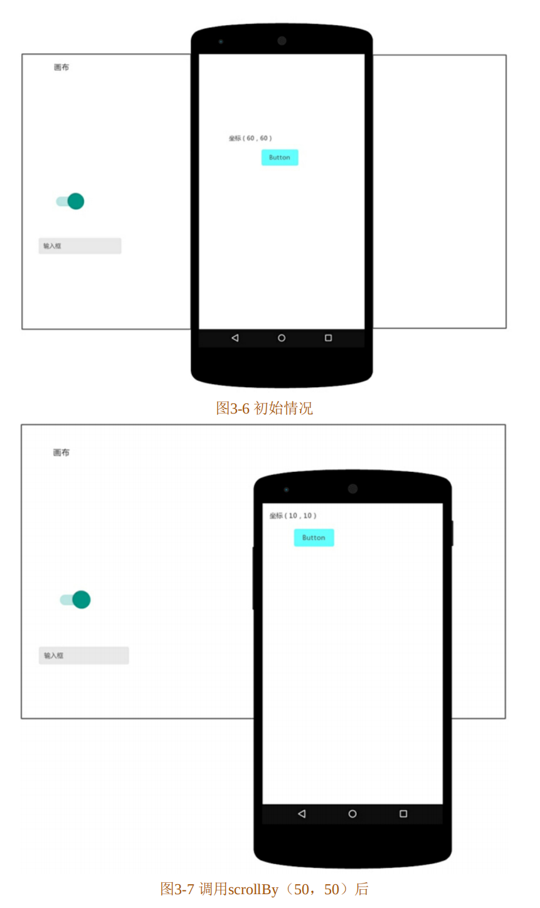

#### 3.3.6 Scroller

我们在用scrollTo/scrollBy方法进行滑动时，这个过程是瞬间完成的，所以用户体验不大好。这里我们可以使用Scoller来实现有过渡效果的滑动，这个过程不是瞬间完成的，而是在一定时间间隔内完成的。Scroller本身是不能实现View的滑动的，它需要与View的computeScroll()方法配合才能实现弹性滑动的效果。在这里我们实现CustomView平滑地向右移动。首先我们要初始化Scroller，代码如下所示：

```java
public CustomView(Context context, AttributeSet attrs) {
    super(context, attrs);
    mScroller = new Scroller(context);
}
```

接下来重写`computeScroll()`方法，**系统会在绘制View的时候在draw()方法中调用该方法**。在这个方法中，我们调用父类的scrollTo()方法并**通过Scroller来不断获取当前的滚动值**，每滑动一小段距离我们就调用invalidate()方法不断地进行重绘，重绘就会调用computeScroll()方法，这样我们通过不断地移动一个小的距离并连贯起来就实现了平滑移动的效果。

```java
@Override
public void computeScroll() {
    super.computeScroll();
    if (mScroller.computeScrollOffset()) {
        ((View) getParent()).scrollTo(mScroller.getCurrX(),mScroller.getCurrY());
        invalidate();
    }
}
```

我们在CustomView中写一个smoothScrollTo方法，调用Scroller的startScroll()方法，在2000ms内沿X轴平移delta像素，代码如下所示：

```java
public void smoothScrollTo(int destX, int destY) {
    int scrollX = getScrollX();
    int delta = destX - scrollX;
    mScroller.startScroll(scrollX,0,delta,0,2000);
    invalidate();
}
```

最后我们在ViewSlideActivity.java中调用CustomView的smoothScrollTo()方法。这里我们设定CustomView沿着X轴向右平移400像素。

```java
mCustomView.smoothScrollTo(-400,0);
```


### 3.4 属性动画

在3.3.4节中我们用属性动画实现了一个View的平移，但却并没有详细介绍它怎么用，本节就来学习一下如何使用属性动画。在属性动画出现之前，Android系统提供的动画只有顿动画和 View 动画。View 动要我们都了解，它提供了**AlphaAnimation、RotateAnimation、TranslateAnimation、ScaleAnimation这4种动画方式**，并提供了AnimationSet动画集合来混合使用多种动画。随着**Android 3.0属性动画**的推出，View动画不再风光。相比属性动画，View动画一个非常大的缺陷突显，其不具有交互性。当某个元素发生View动画后其响应事件的位置依然在动画进行前的地方，所以View动画只能做普通的动画效果，要避免涉及交互操作。但是它的优点也非常明显：效率比较高，使用也方便。由于 Android 3.0 之前已有的动画框架Animation存在一些局限性，也就是动画改变的只是显示，但View的位置没有发生变化，View移动后并不能响应事件，所以在Android 3.0之后，谷歌就推出了新的动画框架，帮助开发者实现更加丰富的动画效果。在Animator框架中使用最多的就是**AnimatorSet和ObjectAnimator配合**；使用 ObjectAnimator 进行更精细化的控制，控制一个对象和一个属性值，而使用多个ObjectAnimator组合到AnimatorSet形成一个动画。属性动画通过调用属性get、set方法来真实地控制一个View的属性值，因此，强大的属性动画框架基本可以实现所有的动画效果。

#### **1.ObjectAnimator**

ObjectAnimator是属性动画最重要的类，创建一个ObjectAnimator只需要通过其**静态工厂类**直接返还一个ObjectAnimator对象。参数包括**一个对象和对象的属性名字，但这个属性必须有get和set方法**，其内部会**通过Java反射机制来调用set方法修改对象的属性值**。下面看看平移动画是如何实现的，代码如下所示：

```java
ObjectAnimator mObjectAnimator = ObjectAnimator.ofFloat(view,"translationX",200);
mObjectAnimator.setDuration(300);
mObjectAnimator.start();
```

通过ObjectAnimator的静态方法，创建一个ObjectAnimator对象，查看ObjectAnimator.java的静态方法ofFloat()，代码如下所示：

```java
public static ObjectAnimator ofFloat(Object target, String propertyName, float ... values) {
    ObjectAnimator anim = new ObjectAnimator(target, propertyName);
    anim.setFloatValues(values);
    return anim;
}
```

> ...表示可变长参数，就是说这个位置可以传入任意个该类型参数，简单来说就是个数组。

从源码可以看出**第一个参数是要操作的Object**；**第二个参数是要操作的属性**；**最后一个参数是一个可变的float类型数组，需要传进去该属性变化的取值过程**，这里设置了一个参数，变化到200。与View动画一样，也可以给属性动画设置显示时长、插值器等属性。下面就是一些常用的可以直接使用的属性动画的属性值。

+ translationX和translationY：用来沿着X轴或者Y轴进行平移。
+ rotation、rotationX、rotationY：用来围绕View的支点进行旋转。
+ PrivotX和PrivotY：控制View对象的支点位置，围绕这个支点进行旋转和缩放变换处理。默认该支点位置就是View对象的中心点。
+ alpha：透明度，默认是1（不透明），0代表完全透明
+ x和y：描述View对象在其容器中的最终位置。

需要注意的是，在使用ObjectAnimator的时候，要操作的属性必须要有get和set方法，不然ObjectAnimator就无法生效。如果一个属性没有get、set方法，也可以通过自定义一个属性类或者包装类来间接地给这个属性增加get和set方法。现在来看看如何通过包装类的方法给一个属性增加get和set方法，代码如下所示：

```java
private static class MyView {
    private View mTarget;
    private MyView(View mTarget) {
        this.mTarget = mTarget;
    }
    public int getWidth() {
        return mTarget.getLayoutParams().width;
    }
    public void setWidth(int width) {
        mTarget.getLayoutParams().width = width;
        mTarget.requestLayout();
    }
}
```

使用时只需要操作包装类就可以调用get、set方法了：

```java
MyView mMyView = new MyView(mButton);
ObjectAnimator.ofInt(mMyView,"width",500).setDuration(500).start();
```

> 多次执行只有一次动画的原因：
>
> **动画结束后不复位：** 如果动画在结束时停留在目标位置，下一次点击时不会再次触发动画，因为视图已经处于目标位置。你可以尝试在每次点击前将视图重置到初始状态：
>
> ```java
> view.setTranslationX(0);
> mObjectAnimator.start();
> ```


#### **2.ValueAnimator**

ValueAnimator不提供任何动画效果，它更像一个数值发生器，用来产生有一定规律的数字，从而让调用者控制动画的实现过程。通常情况下，在ValueAnimator的AnimatorUpdateListener中监听数值的变化，从而完成动画的变换，代码如下所示：

```java
ValueAnimator mValueAnimator = ValueAnimator.ofFloat(0,100);
mValueAnimator.setTarget(view);
mValueAnimator.setDuration(1000).start();
mValueAnimator.addUpdateListener(new ValueAnimator.AnimatorUpdateListener() {
    @Override
    public void onAnimationUpdate(ValueAnimator animation) {
        Float mFloat = (Float) animation.getAnimatedValue();
    }
});
```


#### **3.动画的监听**

完整的动画具有start、Repest、End、Cancel这4个过程，代码如下所示：

```java
ObjectAnimator animator = ObjectAnimator.ofFloat(view,"alpha",1.5f);
animator.addListener(new Animator.AnimatorListener() {
    @Override
    public void onAnimationStart(Animator animation) {
    }
    @Override
    public void onAnimationEnd(Animator animation) {
    }
    @Override
    public void onAnimationCancel(Animator animation) {
    }
    @Override
    public void onAnimationRepeat(Animator animation) {
    }
});
```

大部分时候我们只关心onAnimationEnd事件，Android也提供了AnimatorListenerAdapter来让我们选择必要的事件进行监听。

```java
ObjectAnimator animator = ObjectAnimator.ofFloat(view,"alpha",1.5f);
animator.addListener(new AnimatorListenerAdapter() {
    @Override
    public void onAnimationEnd(Animator animation) {
    }
};
```


#### **4.组合动画——AnimatorSet**

AnimatorSet类提供了一个play()方法，如果我们向这个方法中传入一个Animator对象（ValueAnimator或ObjectAnimator），将会返回一个AnimatorSet.Builder的实例。AnimatorSet的play()方法源码如下所示：

```java
public Builder play(Animator anim) {
    if(anim!=null) {
        mNeedSort = true;
        return new Builder(anim);
    }
    return null;
}
```

很明显，在play()方法中创建了一个AnimatorSet.Builder类，这个Builder类是AnimatorSet的内部类。我们来看看这个Builder类中有什么，代码如下所示：

```java
public class Builder {
    private Node mCurrentNode;
    Builder(Animator anim) {
        mCurrentNode=mNodeMap.get(anim);
        if (mCurrentNode == null) {
            mCurrentNode=new Node(anim);
            mNodeMap.put(anim, mCurrentNode);
            mNodes.add(mCurrentNode);
        }
    }
    
    public Builder with(Animator anim) {
        Node node = mNodeMap.get(anim);
        if (node== null){
            node =new Node(anim);
            mNodeMap.put(anim, node);
            mNodes.add(node);
        }
        Dependency dependency = new Dependency (mCurrentNode, Dependency.WITH);
        node.addDependency(dependency);
        return this;
    }
    
    public Builder before(Animator anim) {
        mReversible=false;
        Node node =mNodeMap.get(anim);
        if (node == null) {
            node =new Node(anim);
            mNodeMap.put(anim， node);
            mNodes.add(node);
        }
        Dependency dependency = new Dependency(mCurrentNode, Dependency.AFTER);
        node.addDependency(dependency);
        return this;
    }
    
    public Builder after(Animator anim) {
        mReversible=false;
        Node node = mNodeMap.get(anim);
        if (node== null) {
            node = new Node(anim);mNodeMap.put(anim,node);
            mNodes.add(node);
        }
        Dependency dependency = new Dependency(node, Dependency.AFTER);
        mCurrentNode.addDependency(dependency);
        return this;
    }
    
    public Builder after(long delay) {
        ValueAnimator anim = ValueAnimator.ofFloat(0f, lf);
        anim.setDuration(delay);
        after(anim);
        return this;
    }
}
```

从源码可以看出，Builder类采用了建造者模式，每次调用方法都返回Builder自身用于继续构建。AnimatorSet.Builder中包括以下4个方法。

+ after(Animator anim)：将现有动画插入到传入的动画之后执行
+ after(long delay)：将现有动画延迟指定毫秒后执行
+ before(Animator anim)：将现有动画插入到传入的动画之前执行
+ with(Animator anim)：将现有动画和传入的动画同时执行

AnimatorSet正是通过这几种方法来控制动画播放顺序的。这里举一个例子，代码如下所示：

```java
ObjectAnimator animatorl = ObjectAnimator.ofFloat(mCustomView, "translationx",0.0f,200.0f,0f);
ObjectAnimator animator2 = ObjectAnimator.ofFloat(mCustomView, "scalex",
1.0f,2.0f);
ObjectAnimator animator3 = ObiectAnimator.ofFloat(mCustomView, "rotationx", 0.0f,90.0f,0.0F);
AnimatorSet set=new AnimatorSet();
set.setDuration(1000);
set.play(animatorl).with(animator2).after(animator3);
set.start();
```

首先我们创建3个ObjectAnimator，分别是animator1、animator2、animator3，然后创建AnimatorSet。在这里先执行animator3，然后同时执行animator1和animator2（也可以调用set.playTogether(animator1,animator2)，来使这两种动画同时执行）。


#### **5.组合动画——PropertyValuesHolder**

除了上面的AnimatorSet类，还可以使用PropertyValuesHolder类来实现组合动画。不过这个组合动画就没有上面的丰富了，使用PropertyValuesHolder类只能是多个动画一起执行。当然我们得结合ObjectAnimator.ofPropertyValuesHolder(Object target,PropertyValuesHolder...values)方法来使用。其第一个参数是动画的目标对象，之后的参数是PropertyValuesHolder类的示例。可以有多个这样的实例。具体代码如下所示：

```java
PropertyValuesHolder valuesHolderl = PropertyValuesHolder.ofFloat("scalex"，1.0f，1.5f);
PropertyValuesHolder valuesHolder2 = PropertyValuesHolder.ofFloat("rotationx"，0.0f，90.0f，0.0F);
PropertyValuesHolder valuesHolder3= PropertyValuesHolder.ofFloat("alpha"1.0f，0.3f，1.0F);
ObjectAnimator objectAnimator = ObjectAnimator.ofPropertyValuesHolder(mCustomView，valuesHolderl, valuesHolder2， valuesHolder3);
objectAnimator.setDuration(2000).start();
```


**6.在XML中使用属性动画**

和View动画一样，属性动画也可以直接写在XML中。在res文件中新建animator文件，在里面新建一个scale.xml，其内容如下所示：

```xml
<?xml version="1.0" encoding="utf-8"?>
<objectAnimator xmlns:android="http://schemas.android.com/apk/res/android"
	android:layout_width="wrap_content"
    android:layout_height="wrap_content"
	android:duration="3000"                
	android:propertyName="scaleX"
	android:valueFrom="1.0"
	android:valueTo="2.0"
	android:valueType="floatType"
    >
</objectAnimator>
```

在程序中引用XML定义的属性动画也很简单，代码如下所示：

```java
Animator animator = AnimatorInflater.loadAnimator(this, R.animator.scale);
animator.setTarget(view);
animator.start();
```


### 3.5 解析Scroller

在3.3.6节中我们介绍了如何使用Scroller进行滑动，但是其使用流程和一般的类的使用方式稍有不同。为了更好地理解Scroller的使用流程，我们有必要学习一下Scroller的源码。想要使用Scroller，必须先调用new Scroller()。下面先来看看Scroller的构造方法，代码如下所示：

```java
public Scroller(Context context) {
    this(context, null);
}
public Scroller(Context context，Interpolator interpolator) {
    this(context, interpolator, context.getApplicationInfo().targetSdkVersion >= Build.VERSION_CODES.HONEYCOMB);
}
public Scroller(Context context, Interpolator interpolator, booleanflywheel){
    mFinished=true;
    if (interpolator == null) {
        mInterpolator =new ViscousFluidInterpolator();
    } else if {
        mInterpolator = interpolator;
    }
    mPpi = context.getResources().getDisplayMetrics().density * 160.0f;
    mDeceleration = computeDeceleration(ViewConfiguration.getScrollFriction());
    mFlywheel=flywheel;
    mPhysicalCoeff = computeDeceleration(0.84f);
}
```

从上面的代码我们得知，Scroller有三个构造方法，通常情况下我们都用第一个；第二个需要传进去一个插值器Interpolator，如果不传则采用默认的插值器ViscousFluidInterpolator。接下来看看Scroller的startScroll()方法，代码如下所示：

```java
public void startScroll(int startX, int startY, int dx, int dy, int duration) {
    mMode = SCROLL_MODE;
    mFinished = false;
    mDuration = duration;
    mStartTime = AnimationUtils.currentAnimationTimeMillis();
    mStartX = startX;
    mStartY = startY;
    mFinalX = startX + dx;
    mFinalY = startY + dy;
    mDeltaX = dx;
    mDeltaY = dy;
    mDurationReciprocal = 1.0f / (float) mDuration;
}
```

在startScroll()方法中并没有调用类似开启滑动的方法，而是保存了传进来的各种参数：startX和startY表示滑动开始的起点，dx和dy表示滑动的距离，duration则表示滑动持续的时间。所以**startScroll()方法只是用来做前期准备的，并不能使View进行滑动**。关键是我们在startScroll()方法后调用了**`invalidate()`方法**，这个方法会导致View的重绘，而**View的重绘会调用View的`draw()`方法**，**draw()方法又会调用View的`computeScroll()`方法**。我们重写computeScroll()方法如下：

```java
@Override
public void computeScroll() {
    super.computeScroll();
    if(mScroller.computeScrollOffset()){
        ((View) getParent()).scrollTo(mScroller.getCurrX(),mScroller.getCurrY());
        invalidate();
    }
}
```

我们在 computeScroll() 方法中**通过 Scroller 来获取当前的 ScrollX 和 ScrollY**，然后**调用scrolITo()方法进行View的滑动**，接着**调用invalidate 方法来让View进行重绘**，**重绘就会调用computeScroll()方法来实现View的滑动**。这样通过不断地移动一个小的距离并连贯起来就实现了平滑移动的效果。但是在Scroller中如何获取当前位置的ScrollX和SrolIY呢？我们忘了一点，**那就是在调用 scrollTo() 方法前会调用Scroller 的 computeScrollOffset() 方法**。接下来看看computeScrollOffset () 方法：

```java
public boolean computeScrolloffset() {
    if (mFinished) {
        return false;
    }
    int timePassed = (int)(AnimationUtils.currentAnimationTimeMillis()- mStartTime);
    if (timePassed < mDuration) {
        switch (mMode) {
            case SCROLL MODE:
                final float x = mInterpolator.getInterpolation(timePassedmDurationReciprocal);
                mCurrX = mStartX + Math.round(x * mDeltaX);
                mCurrY = mStartY + Math.round(x * mDeltaY);
                break;
            case FLING_MODE: 
                final float t=(float) timePassed /mDuration;
                final int index= (int) (NB SAMPLES * t);
                float distanceCoef =1.f;
                float velocityCoef=0.f;
                if (index<NB_SAMPLES){
                    final float t_inf= (float) index/NB SAMPLES;
                    final float t_sup= (float) (index+1) /NB SAMPIES;
                    final float d_inf = SPLINE_POSITION[index];
                    final float d_sup = SPLINE_POSITION[index+1];
                    velocityCoef=(d_sup -d_inf) / (t_sup-t_inf);
                    distanceCoef=d_inf + (t - t_inf) * velocityCoef;
                }
                mCurrVelocity=velocityCoef*mDistance/mDuration *1000.0f;
                mCurrX=mStartX + Math,round(distanceCoef * (mFinalX -mStartX));
                mCurrX=Math.min(mCurrX,mMaxX);
                mCurrx=Math.max(mCurrx，mMinX);
                mCurrY = mStartY + Math.round(distanceCoef *(mFinalY-mStarty));
                mCurrY=Math.min(mCurrY，mMaxY);
                mCurrY=Math.max(mCurrY，mMinY);
                if (mCurrX==mFinalX && mCurrY== mFinalY) {
                    mFinished=true;
                }
                break;
        }
    }
    else {
        mCurrX=mFinalX;
        mCurrY=mFinalY;
        mFinished=true;
    }
    return true;
}
```

首先会计算**动画持续的时间**`timePassed`。如果动画持续时间小于我们设置的滑动持续时间mDuration，则执行Switch语句。因为在**startScroll()方法中的mMode值为**`SCROLL_MODE`，所以执行分支语句SCROLL_MODE，然后**根据插值器 Interpolator 来计算出在该时间段内移动的距离，赋值给mCurrX和mCurrY**，这样我们**就能通过Scroller来获取当前的ScrollX和ScrollY了**。另外，computeScrollOffset () 的返回值如果为true则表示滑动未结束，为false则表示滑动结束。所以，如果滑动未结束，我们就得持续调用scrolITo() 方法和 invalidate() 方法来进行 View 的滑动。讲到这里总结一下Scroller的原理：**Scroller并不能直接实现View的滑动，它需要配合View的computeScroll() 方法。在computeScroll () 中不断让View进行重绘，每次重绘都会计算滑动持续的时间，根据这个持续时间就能算出这次View滑动的位置，我们根据每次滑动的位置调用scrollTo() 方法进行滑动，这样不断地重复上述过程就形成了弹性滑动。**


### 3.6 View的事件分发机制

本章我们讲到了View的基础知识、View的滑动、属性动画以及Scroller的相关知识，现在开始了解一下View体系中比较重要的知识点，即View的事件分发机制。在讲到View的事件分发机制之前要首先了解一下Activity的组成，然后从源码的角度来分析View的事件分发机制。

#### 3.6.1 源码解析Activity的构成

点击事件用MotionEvent来表示，当一个点击事件产生后，事件最先传递给Activity，所以我们首先要了解一下Activity的构成，当我们写Activity时会调用setContentView()方法来加载布局。现在来看看setContentView()方法是怎么实现的，代码如下所示：

```java
public void setContentView(@LayoutRes int layoutResID) {
    getWindow().setContentView(layoutResID);
    initWindowDecorActionBar();
}
```

这里调用了getWindow().setContentView(LayoutResID)，getWindow()指的是什么呢？接着往下看，getWindow()返回了mWindow：

```java
public Window getWindow() {
    return mWindow;
}
```

这个mWindow又是什么呢？我们继续查看代码，最终在Activity的attach()方法中发现了mWindow，代码如下所示：

```java
final void attach(Context context,ActivityThread aThread, Instrumentation instr, IBinder token, int ident, Application application, Intent intent, ActivityInfo info, CharSequence title, Activity parent, String id, NonConfigurationInstance lastNonConfigurationInstance, Configuration config, String referrer, IVoiceInteractor, voiceInteractor) {
    attachBaseContext(context);
    mFragments.attachHost(null /*parent*/);
    mWindow = new PhoneWindow(this);
    ···
}
```

而getWindow()又指的是PhoneWindow。所以来看看PhoneWindow的setContentView，代码如下所示：

```java
@Override
public void setContentView(View view，ViewGroup.LayoutParams params) {
    if (mContentParent == null) {
        installDecor();//1
    } else if (!hasFeature(FEATURE CONTENT TRANSITIONS)) {
        mContentParent.removeAllViews();
    }
    if (hasFeature(FEATURE CONTENT TRANSITIONS)) { 
        view.setLayoutParams(params);
        final Scene newScene = new Scene(mContentParent，view);
        transitionTo(newScene); 
    } else {
        mContentParent.addView(view， params);
    }
    final Callback cb= getCallback();
    if (cb != null && !isDestroyed()) {
        cb.onContentChanged();
    }
}
```

原来mWindow指的就是PhoneWindow，**PhoneWindow是继承抽象类Window的**，这样就知道了getWindow()得到的是一个PhoneWindow，因为**Activity中setContentView()方法调用的是getWindow().setContentView(layoutResID)**。

挑关键的接着看，看看上面代码注释1处installDecor()方法里面做了什么，代码如下所示：

```java
private void installDecor() {
    if (mDecor == null) {
        mDecor = generateDecor();//1
        mDecor.setDescendantFocusability(ViewGroup.FOCUS_AFTER_DESCENDANTS);
        mDecor.setIsRootNamespace(true);
        if (!mInvalidatePanelMenuPosted && mInvalidatePanelMenuFeatures != 0) {
            mDecor.postOnAnimation(mInvalidatePanelMenuRunnable);
        }
    }
    if (mContentParent == null) {
        mContentParent = generateLayout(mDecor);
        ···
    }
    ···
}
```

在前面的代码中没发现什么，紧接着查看上面 代码注释1处的generateDecor方法里做了什么：

```java
protected DecorView generateDecor() {
    return new DecorView(getContext(),-1);
}
```

这里创建了一个DecorView，**这个DecorView就是Activity中的根View**。接着查看DecorView的源码，发现**`DecorView`是PhoneWindow类的内部类，并且继承了`FrameLayout`**。我们再回到installDecor()方法中，查看generateLayout(mDecor)做了什么：

```java
protected ViewGroup generateLayout(DecorView decor) {
    ···
    // 根据不同的情况加载不同的布局给layoutResource
    int layoutResource;
    int features = getLocalFeatures();
    if ((features & (1<<FEATURE_SWIPE_TO_DISMISS))!=0) {
        layoutResource = R.layout.screen_swipe_dismiss;
    } else if ((features & (1<<FEATURE_LEFT_ICON) | (1<<FEATURE_RIGHT_ICON)) !=0) {
        if(mIsFloating){
            TypedValue res=new TypedValue();
            getContext().getTheme().resolveAttribute(R.attr.dialogTitleIconsDecorLayout， res， true);
            layoutResource =res.resourceId;
        } else {
            layoutResource=R.layout.screen title icons;
        }
        removeFeature(FEATUREACTION BAR);
    } else if ((features & ((1 << FEATURE_PROGRESS) | (1 << FEATURE_INDETERMINATE_PROGRESS))) != 0 && (features & (1 << FEATURE_ACTION_BAR)) == 0){
        layoutResource =R.layout.screen progress;
    } else if ((features & (1 << FEATURE CUSTOM TITLE)) != 0) {
        if(mIsFloating) {
            TypedValue res=new TypedValue();
            getContext().getTheme().resolveAttribute(R.attr.dialogCustomTitleDecorLayout,res, true);
            layoutResource = res.resourceId;
        } else {
            layoutResource = R.layout.screen_custom_title;
        }
        removeFeature(FEATURE_ACTION_BAR);
    } else if ((features & (1<<FEATURE_NO_TITLE))==0) {
        if(mIsFloating) {
            TypedValue res = new TypedValue();
            getContext().getTheme().resolveAttribute(R.attr.dialogTitleDecorLayout, res, true);
            layoutResource = res.resourceId;
        } else if ((features & (1 << FEATURE_ACTION_BAR)) != 0) {
            layoutResource = a.getResourceId(R.styleable.Window windowActionBarFullscreenDecorLayout,R.layout.screen_action_bar);
        } else {
            layoutResource = R.layout.screen_title;//1
        } 
    } else if ((features & (1<< FEATURE_ACTION_MODE_OVERLAY)) != 0){
        layoutResource= R.layout.screen_simple_overlay_action_mode;
    } else {
        layoutResource = R.layout.screen_simple;
    }
    ···
    return contentParent;
}
```

PhoneWindow的generateLayout()方法比较长，这里只截取了一小部分关键的代码，其主要内容就是**根据不同的情况加载不同的布局给layoutResource**。现在查看上面代码注释1处的布局R.layout.screen_title，这个文件在frameworks，它的代码如下所示：

```xml
<LinearLayout xmlns:android="http://schemas.android.com/apk/res/android"
	android;orientation="vertical"
    android:fitsSystemWindows="true">
    <!-- Popout bar for action modes -->
    <ViewStub android:id="@+id/action_mode_bar_stub"
              android:inflatedId="@+id/action_mode_bar"
              android:layout="@layout/action_mode_bar"
              android:layout_width="match_parent"
              android:layout_height="wrap_content"
              android:theme="?attr/actionBarTheme" />
    <FrameLayout
        android:layout width="match parent"
        android:lavout height="?android:attr/windowTitleSize"
        style="?android:attr/windowTitleBackgroundStyle">
        <TextView android:id="@android:id/title"
        	style="?android:attr/windowTitleStyle"
            android:background="@null"
            android:fadingEdge="horizontal"
            android:gravity="center_vertical"
            android:layout_width="match_parent"
            android:layout_height="match_parent" />
    </FrameLayout>
    <FrameLayout android:id="@android:id/content"
    	android:layout_width="match_parent"
        android:layout_height="0dip"
        android:layout_weight="1"
		android:foregroundGravity="fill_horizontall|top"
        android:foreground="?android:attr/windowContentOverlay"/>
</LinearLayout>
```

上面的ViewStub是用来显示ActionBar的。下面的两个FrameLayout：一个是title，用来显示标题；另一个是content，用来显示内容。看到上面的源码，大家就知道了一个Activity包含一个Window对象，这个对象由PhoneWindow来实现。**PhoneWindow将DecorView作为整个应用窗口的根View**，而这个DecorView又将屏幕华为两个区域：一个是`TitleView`，另一个是`ContentView`，而我们平常做应用所写的布局正是展示在ContentView中的，如图3-8所示。

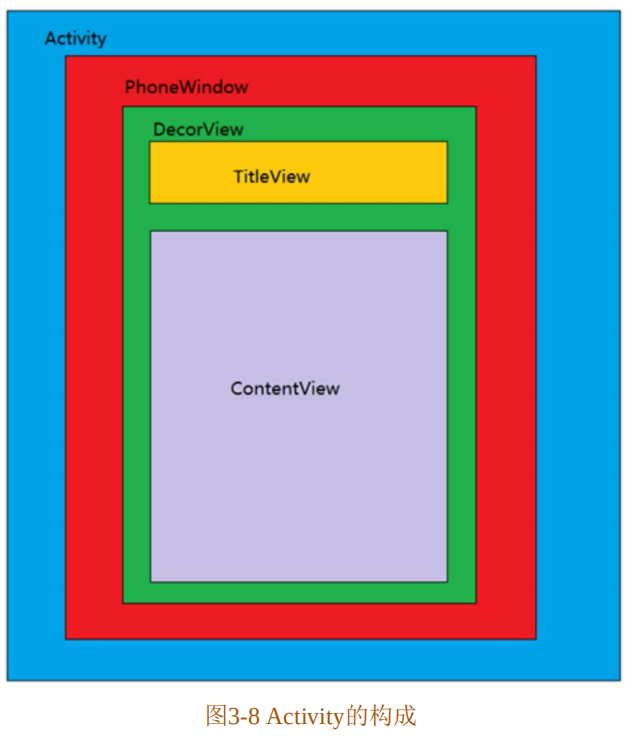


#### 3.6.2 源码解析View的事件分发机制

当我们点击屏幕时，就产生了点击事件，这个事件被封装成了一个类：MotionEvent。而当这个MotionEvent产生后，那么系统就会将这个MotionEvent传递给View的层级，MotionEvent在View中的层级传递过程就是点击事件分发。在了解了什么是事件分发后，我们还需要了解事件分发的3个重要方法。点击事件有3个重要的方法（**发布**、**拦截**、**消费**），它们分别是：

+ dispatchTouchEven(MotionEvent ev) ——用来进行事件的分发。
+ onInterceptTouchEvent(MotionEvent ev) ——用来进行事件的拦截，在dispatchTouchEvent()中调用，需要注意的**是View没有提供该方法**。
+ onTouchEvent(MotionEvent ev) ——用来处理点击事件，在dispatchTouchEvent()方法中进行调用。

[掘金](https://juejin.cn/post/7067698735874539527)

> 默认的事件分发过程：
>
> 对于 ACTION_DOWN 事件，会从最外层的 `dispatchTouchEvent` 传递到最内层的 `dispatchTouchEvent`，然后由最内层的 `onTouchEvent` 传递到最外层的 `onTouchEvent`。
>
> 对于 ACTION_MOVE 和 ACTION_UP 来说，只会传递到 Activity 的 `dispatchTouchEvent` 和 `onTouchEvent` 中。
>
> **1、在 dispatchTouchEvent 中拦截事件**，可以得出如下结论。
>
> 在 `Activity`，`ViewGroup`，`View` 的 dispatchTouchEvent 中拦截事件，所有的事件只能传递到拦截的地方，而处于其内部的控件将无法收到任何事件。
>
> 


[掘金](https://juejin.cn/post/7148256594310987812)

> 一个 View 只能从 down 事件开始处理事件，如果它不消耗 down 事件，那么同一事件序列中的其它事件都不会再交给它处理，并且事件将会重新交给它的父 View 处理，即父元素的 onTouchEvent() 会被调用。如果它消耗 down 事件，意味着它能接收到后续的 move、up事件，如果它不消耗后续的 move、up 事件，那么这些 move、up 事件会消失，父元素的 onTouchEvent() 不会被调用，这些消失的事件最终会传给 Activity 处理。


[CSDN](https://blog.csdn.net/qq_40987010/article/details/123057042)

流程图


**1.View的事件分发机制**

当点击事件产生后，事件首**先会传递给当前的Activity，这会调用Activity的`dispatchTouchEvent()`方法**，当然**具体的事件处理工作都是交由**Activity中的`PhoneWindow`来完成的，然后PhoneWindow再把事件处理工作**交给`DecorView`**，之后再由DecorView将事件处理工作**交给根`ViewGroup`**。所以，我们从ViewGroup的dispatchTouchEvent()方法开始分析，代码如下所示：

```java
@Override
public boolean dispatchTouchEvent(MotionEvent ev) {
    ···
    if (actionMasked == MotionEvent.ACTION_DOWN) {
        cancelAndClearTouchTargets(ev);
        resetTouchState();
    }        
    if(actionMasked == MotionEvent.ACTION_DOWN || mFirstTouchTarget != null) {//1
        final boolean disallowIntercept = (mGroupFlags & FLAG_DISALLOW_INTERCEPT) != 0;//2
        if (!disallowIntercept) {
            intercepted = onInterceptTouchEvent(ev);
            ev.setAction(action);
        } else {
            intercepted= false;
        }
    } else {
        intercepted = true;
    }
    ···
    return handled;
}
```

这里首先判断事件是否为**DOWN事件**，如果是，**则进行初始化**，resetTouchState方法中会把**mFirstTouchTarget的值置为null**。这里为什么要进行初始化呢？原因就是一个完整的事件序列是以DOWN开始，以UP结束的。所以如果是DOWN事件，那么说明这是一个新的事件序列，故而需要初始化之前的状态。接着往下看，上面的代码注释1处的条件如果满足，则执行下面的句子，**mFirstTouchTarget的意义是：当前 ViewGroup 是否拦截了事件，如果拦截了，mFirstTouchTarget=null； 如果没有拦截并交由子View来处理，则mFirstTouchTarget! =null**。假设**当前的 ViewGroup 拦截了此事件**，mFirstTouchTarget! =null 则为false，**如果这时触发ACTION_DOWN 事件，则会执行 `onInterceptTouchEvent (ev)` 方法**；**如果触发的是ACTION_MOVE、ACTION_UP事件，则不再执行onInterceptTouchEvent (ev)方法，而是直接设置intercepted=true，此后的一个事件序列均由这个ViewGroup处理**。再往下看，上面代码注释 2 处又出现了一个FLAG_DISALLOW_INTERCEPT 标志位，它主要是**禁止 ViewGroup 拦截除了DOWN之外的事件**，一般通过**子View**的`requestDisallowInterceptIouchEvent`来设置。所以总结一下就是，**当ViewGroup要拦截事件的时候，那么后续的事件序列都将交给它处理，而不用再调用onInterceptTouchEvent () 方法了**。所以，onInterceptTouchEvent ()方法并不是每次事件都会调用的。接下来查看onnterceptTouchEvent()方法：

```java
public boolean onInterceptTouchEvent(MotionEvent ev) {
    return false;
}
```

onInterceptTouchEvent()方法默认返回false，不进行拦截。如果想要让ViewGroup拦截事件，那么应该在自定义的ViewGroup中重写这个方法。接着来看看dispatchTouchEvent()方法剩余的部分源码，如下所示：

···


### 补充

[掘金](https://juejin.cn/post/7148256594310987812?searchId=2024012515440443CDA9B19946188DF102)

#### 个人理解

##### down事件分发

down事件会重置状态和标记，子View无法禁止父View拦截down事件，调用`intercepted = onInterceptTouchEvent(ev) `。（该方法默认返回false，即不拦截）；

若ViewGroup不拦截也没有被取消（`!caneled && !intercepted`），将会遍历子View，从深度高（z轴值大）的子View开始传递，调用`dispatchTransformedTouchEvent(ev,false,mChildren[i],idBitsToAssign)`，其内部会调用`child.dispatchTouchEvent(event)`，直到事件被某子View消耗（`dispatchTranformedTouchEvent`会返回true）或所有子View都遍历完了（事件未被子View消耗）；

如果没有被子View消耗（`mFirstTouchTarget == null`），调用`handled = dispatchTransformedTouchEvent(ev,canceled,null,TouchTarget.ALL_POINTER_IDS)`，其内部会调用`super.dispatchTouchEvent(event)`(没有child可以处理事件)，即ViewGroup父类View的dispatchTouchEvent，View的`dispatchTouchEvent`方法默认会消耗掉事件；

如果事件被子View消耗（`mFirstTouchTarget != null`），执行`handled = true `，最后dispatchTouchEvent返回handled。


##### move/up事件分发：

如果**子View消耗了down事件**，则`mFirstTouchTarget!=null`，此时接下来的move、up事件都应该交给子View来处理，但ViewGroup可以决定是否拦截调子View的事件（`onInterceptTouchEvent()`），让接下来的事件由ViewGroup处理；

如果**子View没有消耗down事件**，则`mFirstTouchTarget=null`，执行`intercepted = true`拦截move、up事件，ViewGroup自己处理；


`if(mFirstTouchTarget==null)`，后续同down事件；

`else`，如果ViewGroup拦截事件，则`cancelChild=true`，否则`false`；

如果`cancelChild=true`会向消费了down事件的子View分发一个cancel事件，重置子View的状态；

**①ViewGroup 拦截子 View 的 move/up 事件**

如果是cancel事件，事件分发后需要将子View从单链中去掉，下次有事件过来就不会分发到该子View了，在单点触碰中，单链只有一个元素，即mFirstTouchTarget只有一个touchTarget，分发完cancel事件后，唯一的touchTarget被回收，mFirstTouchTarget = null，下次事件过来后就由ViewGroup自己处理了，这就是ViewGroup拦截的原理。

> 证实了第四条结论：4. 如果一个 down 事件已经被子 View 处理，父 View 在拦截子 View 能接受的后续事件前，会向子 View 分发一个 cancel 事件，接着父 View 才能接手子 View 的事件

分析到这里也可以知道，无论 ViewGroup 从 down、move，up 中的哪个事件开始拦截，都会导致 mFirstTouchTarget = null，只要 ViewGroup 决定拦截事件，下一次事件来时，无需再询问 ViewGroup 是否要拦截事件了。

**②ViewGroup 不拦截子 View 的 move/up 事件**

如果子 View 不消耗 move、up 事件，dispatchTransformedTouchEvent() 返回 false，那么 ViewGroup 的 dispatchTouchEvent() 方法也会返回 false，这些事件就消失了，也没有机会再调用 ViewGroup 的 onTouchEvent() 方法了，**这些消失的事件会传回给 Activity 处理，调用 Activity 的 onTouchEvent() 处理。**

```java
// ViewGroup 类
public boolean dispatchTouchEvent(MotionEvent ev) {
    boolean handled = false;
    ...
    // 没有消耗事件时，handled 依然为 false
    if (dispatchTransformedTouchEvent(ev, cancelChild,
          target.child, target.pointerIdBits)) {
        handled = true;
    }
    return handled;
}
// Activity 类
public boolean dispatchTouchEvent(MotionEvent ev) {
    if (ev.getAction() == MotionEvent.ACTION_DOWN) {
        onUserInteraction();
    }
    // ViewGroup 返回 false，window 返回 false，最终走到下面的 onTouchEvent()
    if (getWindow().superDispatchTouchEvent(ev)) {
        return true;
    }
    return onTouchEvent(ev);
}
```


##### 其余知识点

> TouchTarget 是一个对象，名字直译过来就是触摸目标，存储了可以接受事件的 View 信息。
>
> 一个可接收事件（事件触摸点在 View 的边界范围内且该 View 可见）的 View 就是一个 touchTarget。
>
> 从 TouchTarget 类结构可以看出，它是一个单向链表的结构。在 ViewGroup 中，我们经常看到 `mFirstTouchTarget` 属性，它是单向链表的头，指向的是最近被触摸的 View。


##### View处理事件


#### 部分源码

##### ViewGroup.dispatchTouchEvent() 分发 down 事件

dispatchTouchEvent

```java
// ViewGroup 类
@Override
public boolean dispatchTouchEvent(MotionEvent ev) {
    // ...
    final int action = ev.getAction();
    final int actionMasked = action & MotionEvent.ACTION_MASK;

    // Handle an initial down.
    if (actionMasked == MotionEvent.ACTION_DOWN) {
        // 在接收到 ACTION_DOWN 事件时，重置状态和标记
        cancelAndClearTouchTargets(ev);
        // 将 mFirstTouchTarget 置空，重置 FLAG_DISALLOW_INTERCEPT 标志位
        resetTouchState();
    }

    // 下面代码检查 是否拦截此事件
    final boolean intercepted;
    // 如果是 down 事件或 mFirstTouchTarget != null 不为空，
    // mFirstTouchTarget 不为空，表子 View 处理了 down 事件(onTouchEvent 返回 true)
    if (actionMasked == MotionEvent.ACTION_DOWN
            || mFirstTouchTarget != null) {
        // 检查 FLAG_DISALLOW_INTERCEPT 标志位
        // 这个标志可以被子 View 控制，干预事件的传递方向，除了 down 事件以外
        final boolean disallowIntercept = (mGroupFlags & FLAG_DISALLOW_INTERCEPT) != 0;
        // 子 View 没有禁止父 View 拦截事件
        if (!disallowIntercept) {
            // 调用 onInterceptTouchEvent()
            intercepted = onInterceptTouchEvent(ev);
        } else {
            // 否则不允许拦截事件
            intercepted = false;
        }
    } else {
        // 否则，事件没有被子 View 消耗，ViewGroup 会拦截掉剩下的事件。
        // (如果在一个事件序列中，子 View 没有处理 down 事件，那么后续的事件都会被ViewGroup拦截掉)
        intercepted = true;
    }

    // 检查事件是否被中途被取消了
    final boolean canceled = resetCancelNextUpFlag(this)
            || actionMasked == MotionEvent.ACTION_CANCEL;

    final boolean isMouseEvent = ev.getSource() == InputDevice.SOURCE_MOUSE;
    final boolean split = (mGroupFlags & FLAG_SPLIT_MOTION_EVENTS) != 0
            && !isMouseEvent;
    TouchTarget newTouchTarget = null;
    boolean alreadyDispatchedToNewTouchTarget = false;
    // ViewGroup 不拦截，将会遍历子View，从深度较高的的子 View 开始传递
    // 直到事件被某子 View 消耗或所有子 View 都遍历完了（事件未被子 View 消耗）
    if (!canceled && !intercepted) {
        // ...
        // 如果是 down 事件
        if (actionMasked == MotionEvent.ACTION_DOWN
                || (split && actionMasked == MotionEvent.ACTION_POINTER_DOWN)
                || actionMasked == MotionEvent.ACTION_HOVER_MOVE) {
            /**
             接下来一长串，都是向子View分发 down 事件的过程，运行的结果只有两种：
             1. 事件被子 View 消耗，mFirstTouchTarget 会被赋值，
                指向该子 View，然后 break 退出 for循环
             2. 事件没有被子 View 消耗，那么 mFirstTouchTarget 为 null
             */
            for (int i = childrenCount - 1; i >= 0; i--) {
                // ...
                // dispatchTransformedTouchEvent() 内部会调用 child.dispatchTouchEvent() 方法，将 down 事件
                // 传给子 View，若子 View 消耗掉该事件 dispatchTransformedTouchEvent()
                // 会返回 true， 反之 返回 false
                if (dispatchTransformedTouchEvent(ev, false, mChildren[i], idBitsToAssign)) {
                    // ...
                    // 在 addTouchTarget 里会对 mFirstTouchTarget 赋值
                    newTouchTarget = addTouchTarget(child, idBitsToAssign);
                    alreadyDispatchedToNewTouchTarget = true;
                    break;
                }
            }
        }
    }

    // 如果事件没有被子 View 消耗
    if (mFirstTouchTarget == null) {
        // No touch targets so treat this as an ordinary view.
        handled = dispatchTransformedTouchEvent(ev, canceled, null,
                TouchTarget.ALL_POINTER_IDS);
    } else {
        // mFirstTouchTarget =! null, 说明在一个事件序列中，down 事件已经被子View处理了
        TouchTarget target = mFirstTouchTarget;
        while (target != null) {
            final TouchTarget next = target.next;
            // 如果是 down 事件，因为事件在上面分发的过程中被子View 处理了
            // alreadyDispatchedToNewTouchTarget && target == newTouchTarget 会返回 true
            if (alreadyDispatchedToNewTouchTarget && target == newTouchTarget) {
                handled = true;
            } else {
                // 否则是 move，up事件，分两种情况
                // 1. cancelChild 为 true，即 ViewGroup 决定拦截事件(intercepted = true)
                // 2. cancelChild 为 false，ViewGroup 不拦截
                // traget.child 指向的是之前处理了 down 事件的那个子 View
                final boolean cancelChild = resetCancelNextUpFlag(target.child)
                        || intercepted;
                // 再次调用 dispatchTransformedTouchEvent，因为cancelChild为 true
                // 所以这时候会调用child的dispatchTouchEvent，传递一个cancel事件
                if (dispatchTransformedTouchEvent(ev, cancelChild,
                        target.child, target.pointerIdBits)) {
                    handled = true;
                }
                // ...
            }
            target = next;
        }
    }

    // 到此事件分发结束，如果是 up 事件，或者事件 cancelled等
    // 会触发 resetTouchState 重置 mFirstTouchTarget
    if (canceled
            || actionMasked == MotionEvent.ACTION_UP
            || actionMasked == MotionEvent.ACTION_HOVER_MOVE) {
        resetTouchState();
    } else if (split && actionMasked == MotionEvent.ACTION_POINTER_UP) {
        final int actionIndex = ev.getActionIndex();
        final int idBitsToRemove = 1 << ev.getPointerId(actionIndex);
        removePointersFromTouchTargets(idBitsToRemove);
    }
    // ...
    return handled;
}

```

onInterceptTouchEvent

```java
// ViewGroup 类
public boolean onInterceptTouchEvent(MotionEvent ev) {
   	// ...
    return false;
}
```

dispatchTransformedTouchEvent

```java
// ViewGroup 类
private boolean dispatchTransformedTouchEvent(MotionEvent event, boolean cancel, View child, int desiredPointerIdBits) {
    final boolean handled;    
    final int oldAction = event.getAction();   
    // 如果事件被拦截，或本来就是一个 cancel action   
    // 会分发一个cancel事件    
    if (cancel || oldAction == MotionEvent.ACTION_CANCEL) {
        // 设置取消事件（如果本身不是cancel 事件，但被父类拦截了）
        event.setAction(MotionEvent.ACTION_CANCEL);  
        // 如果没有 child 可以处理事件
        if (child == null) {            
            // 调用 ViewGroup 父类的 dispatchTouchEvent() 方法，也即调用 View 的dispatchTouchEvent()，因为这些方法都是用 ViewGroup 对象调用的，
            // 进而最终会调用 ViewGroup 自己的 onTouchEvent() 方法，ViewGroup 自己处理这个事件            
            handled = super.dispatchTouchEvent(event); 
        } else {            
            // 有的话，调用 child.dispatchTouchEvent() 
            // 将事件从 ViewGroup 分发到 View            
            handled = child.dispatchTouchEvent(event);
        }       
        // 将取消事件传递完后，重置事件类型，如果是父类拦截了事件导致的取消，事件依然会传递到子 View
        // 但是是一个取消事件，View 对于 cancel 事件的默认行为就是不作为，
        event.setAction(oldAction);
        return handled;
    }
    // ...
    // 省略了一些代码，一般情况下，省略的代码运行效果与下面这行代码相同
    final MotionEvent transformedEvent = event;
    // 接下来进行事件的正常分发
    // 如果没有 child 可以处理事件
    if (child == null) {
        // 调用 ViewGroup 父类的 dispatchTouchEvent() 方法，也即调用 View 的dispatchTouchEvent()        
        // 进而会调用 ViewGroup 自己的 onTouchEvent() 方法，ViewGroup 自己处理这个事件        
        handled = super.dispatchTouchEvent(transformedEvent);    
    } else {       
        // ...       
        // 有的话，调用 child.dispatchTouchEvent()     
        // 将事件从 ViewGroup 分发到 View        
        handled = child.dispatchTouchEvent(transformedEvent);   
    }   
    return handled;
}
```

##### ViewGroup.dispatchTouchEvent() 分发 move/up 事件

```java
@Override
public boolean dispatchTouchEvent(MotionEvent ev) {
    final int action = ev.getAction();
    final int actionMasked = action & MotionEvent.ACTION_MASK;

    // Handle an initial down.
    // ...

    // Check for interception.
    final boolean intercepted;
    // 只分析 move、up 事件
    // 子 View 消耗了 down 事件，mFirstTouchTarget != null，此时接下来的 move、up 事件都应该交给子 View 处理。
    // 但 ViewGroup 可以决定是否拦截掉子 View 的事件，让接下来的事件由 ViewGroup 处理
    if (actionMasked == MotionEvent.ACTION_DOWN
            || mFirstTouchTarget != null) {
        // 判断 FLAG_DISALLOW_INTERCEPT 标志位
        final boolean disallowIntercept = (mGroupFlags & FLAG_DISALLOW_INTERCEPT) != 0;
        // 子 View 没有禁止 ViewGroup 拦截事件
        if (!disallowIntercept) {
            // 调用 onInterceptTouchEvent()，询问父 View 是否拦截事件。
            intercepted = onInterceptTouchEvent(ev);
        } else {
            // 子 View 禁止 ViewGroup 拦截事件
            intercepted = false;
        }
    } else {
        // 子 View 没有消耗 down 事件，mFirstTouchTarget = null，ViewGroup 自己处理
        intercepted = true;
    }


    // 检查事件是否被取消了
    final boolean canceled = resetCancelNextUpFlag(this)
            || actionMasked == MotionEvent.ACTION_CANCEL;

    // 事件没取消，也没有被 ViewGroup 拦截
    if (!canceled && !intercepted) {
        // 只有 down 事件才会进入 if 语句
        if (actionMasked == MotionEvent.ACTION_DOWN
                || (split && actionMasked == MotionEvent.ACTION_POINTER_DOWN)
                || actionMasked == MotionEvent.ACTION_HOVER_MOVE) {
            // ...
        }
    }

    if (mFirstTouchTarget == null) {
        // ViewGroup 自己处理
        handled = dispatchTransformedTouchEvent(ev, canceled, null,
                TouchTarget.ALL_POINTER_IDS);
    } else {
        TouchTarget predecessor = null;
        TouchTarget target = mFirstTouchTarget;
        while (target != null) {
            final TouchTarget next = target.next;
            // 如果是 down 事件，且被子 View 消耗了，alreadyDispatchedToNewTouchTarget 会赋值为 true
            // 这里分析的是 move、up 事件，所以会走进 else 
            if (alreadyDispatchedToNewTouchTarget && target == newTouchTarget) {
                handled = true;
            } else {
                // 是 move up 事件，如果 ViewGroup 需要拦截事件的话，cancelChild = true，否则 false
                final boolean cancelChild = resetCancelNextUpFlag(target.child)
                        || intercepted;
                // 如果 cancelChild = true 会向 子 View 分发一个 cancel 事件
                if (dispatchTransformedTouchEvent(ev, cancelChild,
                        target.child, target.pointerIdBits)) {
                    handled = true;
                }
                // 如果是 cancel 事件，事件分发后，需要将子 View 从单链中去掉，下次有事件过来就不会分发到该子 View 了
                // 在单点触碰中，单链只有一个元素，即 mFirstTouchTarget 只有一个 touchTarget，
                // 分发完 cancel 事件后，唯一的 touchTarget 被回收，mFirstTouchTarget = null
                // 下次事件过来时，就由 ViewGroup 自己处理了，这就是 ViewGroup 拦截的原理。
                if (cancelChild) {
                    // 指向单链下一个节点。
                    mFirstTouchTarget = next;
                    // 回收当前节点
                    target.recycler();
                    target = next;
                    continue;
                }
            }
            predecessor = target;
            target = next;
        }
    }

    return handled;
}
```


##### View.dispatchTouchEvent()源码

```java
// View 类
public boolean dispatchTouchEvent(MotionEvent event) {  	
    boolean result = false;
    final int actionMasked = event.getActionMasked();
    if (actionMasked == MotionEvent.ACTION_DOWN) {
        // 有新的事件系列发过来，停止嵌套滑动
        stopNestedScroll();
    }
    // mOnTouchListener 不为空，且 View 是 enable 的话，会先调用 mOnTouchListener.onTouch()    
    // 如果 onTouch() 返回 true，则方法到此为止，不会再接着调用 onTouchEvent() 方法了。
    ListenerInfo li = mListenerInfo;
    if (li != null && li.mOnTouchListener != null
        && (mViewFlags & ENABLED_MASK) == ENABLED
        && li.mOnTouchListener.onTouch(this, event)) {
        result = true;
    }    
    // mOnTouchListener.onTouch() 返回 false，调用 onTouchEvent()    
    if (!result && onTouchEvent(event)) {
        result = true;
    }
    // ...
    return result;
}
```


##### View.onTouchEvent()源码分析

```java
// View 类
public boolean onTouchEvent(MotionEvent event) {
    final float x = event.getX();
    final float y = event.getY();
    final int viewFlags = mViewFlags;
    final int action = event.getAction();
    final boolean clickable = ((viewFlags & CLICKABLE) == CLICKABLE
            || (viewFlags & LONG_CLICKABLE) == LONG_CLICKABLE)
	        || (viewFlags & CONTEXT_CLICKABLE) == CONTEXT_CLICKABLE;    
    // 如果 View 是 disable 的，直接返回，
    if ((viewFlags & ENABLED_MASK) == DISABLED
            && (mPrivateFlags4 & PFLAG4_ALLOW_CLICK_WHEN_DISABLED) == 0) {
        // A disabled view that is clickable still consumes the touch        
        // events, it just doesn't respond to them.
        return clickable;
    }
    if (mTouchDelegate != null) {
        if (mTouchDelegate.onTouchEvent(event)) {
            return true;
        }
    }
    if (clickable || (viewFlags & TOOLTIP) == TOOLTIP) {
        switch (action) {
            case MotionEvent.ACTION_UP:
                // ...
                break;
            case MotionEvent.ACTION_DOWN:
                // ...
                break;
            case MotionEvent.ACTION_CANCEL:
                // ...
                break;
            case MotionEvent.ACTION_MOVE:
                // ...
                break;
        }
        return true;
    }
    return false;
}
```

**View.onTouchEvent() 处理 down 事件**：

```java
// 如果当前在被包含在一个可滚动的容器中，设置一个预按压的标志位
// 这个预按压的标志位会在 ViewConfiguration.getTapTimeout()
// 时间后重置，同时在重置预按压标志位时，会给 View 设置一个
// 按压标志位。
// （预按压标志位是用来延迟设置按压标志位的，当设置了按压标志位后，预按压标志位就会被重置）
boolean isInScrollingContainer = isInScrollingContainer();
if (isInScrollingContainer) {
    mPrivateFlags |= PFLAG_PREPRESSED;
    if (mPendingCheckForTap == null) {
        mPendingCheckForTap = new CheckForTap();
    }
    mPendingCheckForTap.x = event.getX();
    mPendingCheckForTap.y = event.getY(); 
    postDelayed(mPendingCheckForTap, ViewConfiguration.getTapTimeout());
} else {
    // 如果 View 不在一个滚动容器中，立刻设置按压标志位。  
    setPressed(true, x, y);
}
```

**View.onTouchEvent() 处理 up 事件**：

```java
// 显示 tool tip
if ((viewFlags & TOOLTIP) == TOOLTIP) {
    handleTooltipUp();
}
// 不可点击时，直接退出
if (!clickable) {
    break;
}
// 检查预按压标志位
boolean prepressed = (mPrivateFlags & PFLAG_PREPRESSED) != 0;
// 如果 View 被设置了 按压标志位，或预按压标志位
if ((mPrivateFlags & PFLAG_PRESSED) != 0 || prepressed) {
    // take focus if we don't have it already and we should in
    // touch mode.  boolean focusTaken = false;
    // View 是否可以在触摸模式下，获取焦点（光标），比如 EditText 这种
    if (isFocusable() && isFocusableInTouchMode() && !isFocused()) {
        focusTaken = requestFocus();
    }
    // 如果预按压标志位还在，说明还没有设置按压标志位，
    // 此时立刻给 View 设置按压标志位。
    if (prepressed) {
        // 设置 pressed state
        setPressed(true, x, y);
    }
    // 不是长按事件
    if (!mHasPerformedLongPress && !mIgnoreNextUpEvent) {
        // View 没有获取焦点，不是 Editable 的类型
        if (!focusTaken) {
            // 使用 runnable 来延迟调用，而不是直接调用它，
            // 这样可以让 View 在单击操作开始之前更新 View 的其他可视状态。
            if (mPerformClick == null) {
                mPerformClick = new PerformClick();
            }
            // post 执行
            if (!post(mPerformClick)) {
                performClickInternal();
            }
        }
    }
    // 一个 runnable 用于重置 pressed state
    if (mUnsetPressedState == null) {
        mUnsetPressedState = new UnsetPressedState();
    }
    // 重置 pressed state
    if (prepressed) {
        postDelayed(mUnsetPressedState,                ViewConfiguration.getPressedStateDuration());
    } else if (!post(mUnsetPressedState)) {
        // If the post failed, unpress right now
        mUnsetPressedState.run();  
    }
}
```


#### 流程图

Down事件传递给ViewGroup

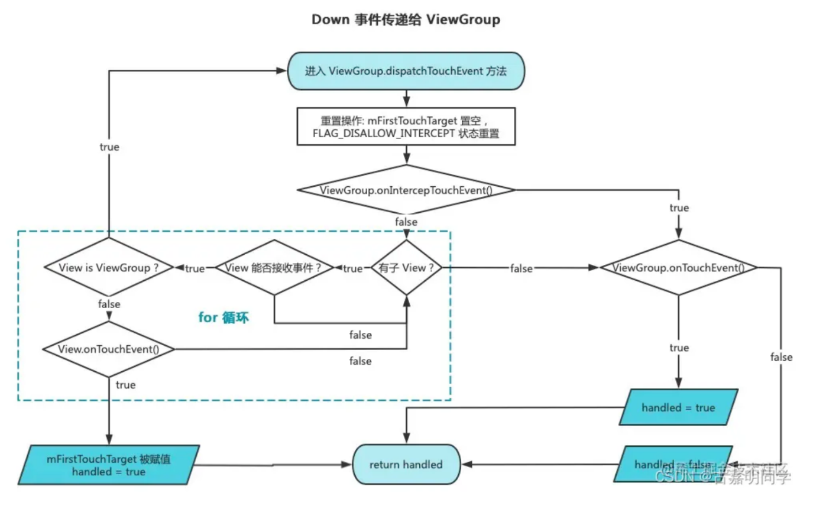


Move/Up事件传递给ViewGroup

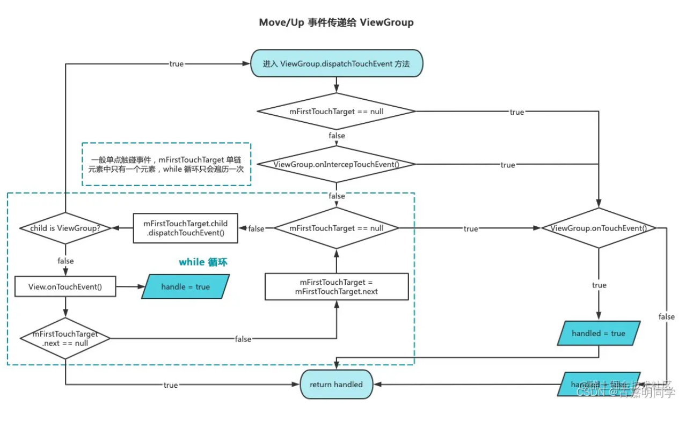


View.dispatchTouchEvent()方法流程

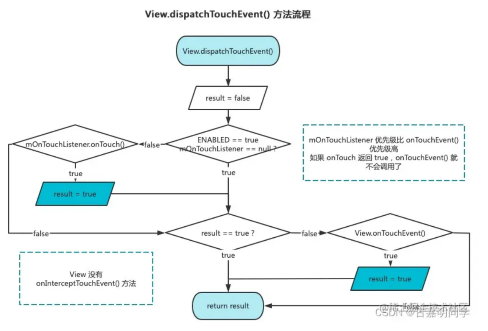


View.onTouchEvent()处理流程

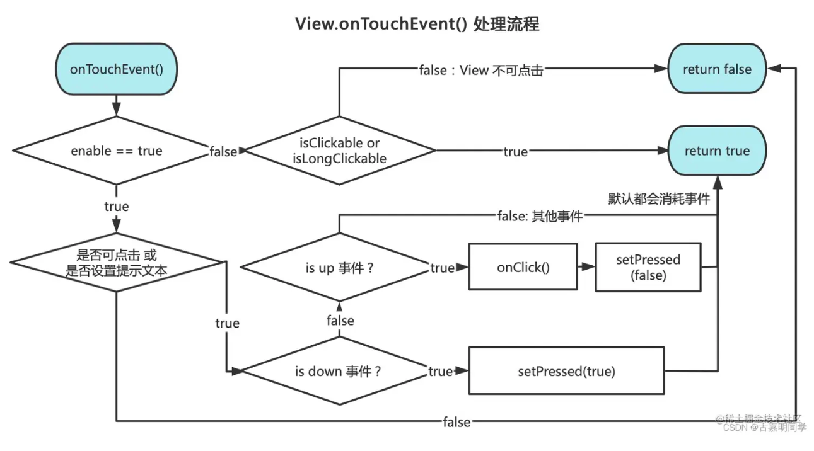


View事件传递机制

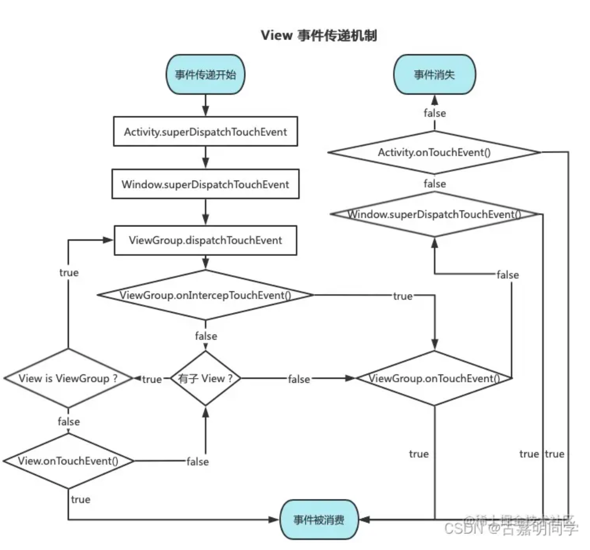


