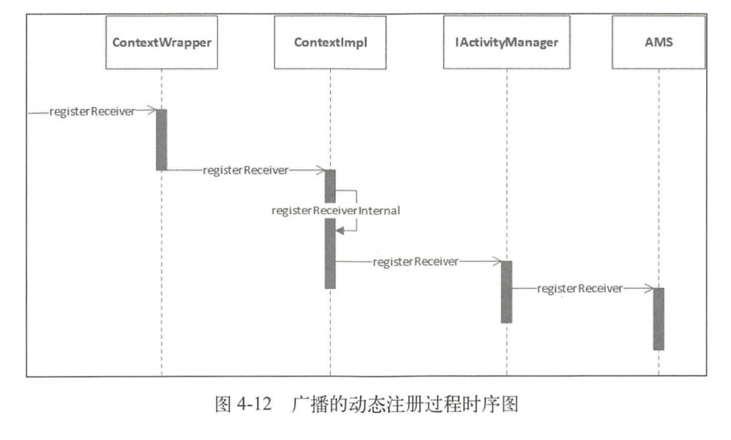

## Android系统架构与系统启动

### Android系统架构

Android系统架构分为五层：应用层、应用框架层、系统运行库层 、硬件抽象层、Linux内核层。

#### 应用层（System Apps）

系统内置应用和非系统级应用

#### 应用框架层（Java API Framework）

提供了开发应用所需要的API，由Java代码编写

| 名称                               | 功能描述                                                     |
| ---------------------------------- | ------------------------------------------------------------ |
| Activity Manager（活动管理器）     | 管理各个应用程序生命周期，以及导航回退功能                   |
| Location Manager（位置管理器）     | 提供地理位置及定位服务                                       |
| Package Manager（包管理器）        | 管理所有安装在Android系统中的应用程序                        |
| Notification Manager（通知管理器） | 是的应用程序可以在状态栏中显示自定义的提示信息               |
| Resource Manager（资源管理器）     | 提供应用程序使用的各种废代码资源，如本地化字符串、图片、布局文件、颜色文件等 |
| Telephony Manager（电话管理器）    | 管理所有的移动设备功能                                       |
| Window Manager（窗口管理器）       | 管理所有开启的窗口程序                                       |
| Content Provider（内容提供器）     | 使得不同应用之间可以共享数据                                 |
| View System（视图系统）            | 构建应用程序的基本组件                                       |


#### 系统运行库层（Native）

分为C/C++程序库和Android运行时库

1、C/C++程序库

| 名称            | 功能描述                                                     |
| --------------- | ------------------------------------------------------------ |
| OpenGL ES       | 3D绘图函数库                                                 |
| Libe            | 从BSD继承来的标准C系统函数库，专门为基于嵌入式Linux的设备定制 |
| Media Framework | 多媒体库，支持多种常用的音频、视频格式录制和回放             |
| SQLite          | 轻型的关系型数据库引擎                                       |
| SGL             | 底层的2D图形渲染引擎                                         |
| SSL             | 安全套接层，一种为网络通信提供安全及数据完整性的安全协议     |
| FreeType        | 可移植的字体引擎，它提供统一的接口来访问多种字体格式文件     |

2、Android运行时库

运行时库分为**核心库**和**ART**（Android5.0后，Dalvik虚拟机被ART取代）

Dalvik与ART虚拟机区别见[Java运行时数据区](../java/Java运行时数据区.md)


#### 硬件抽象层（HAL）

位于操作系统内核与硬件电路之间的接口层，起目的在于将硬件抽象化，为了保护硬件厂商的知识产权，隐藏了特定平台的硬件接口细节，为操作系统提供虚拟硬件平台，使其具有硬件无关性，可在多种平台上进行移植。


#### Linux内核层（Linux Kernal）

Android和核心服务基于Linux内核，在此基础上添加了部分Android专用的驱动。


## Android系统启动

### init进程启动过程

`init`进程是Android系统中用户空间的第一个进程，进程号为1，作为第一个进程被赋予了很多极其重要的工作职责，比如创建Zygote（孵化器）和属性服务。init进程由多个源文件共同组成，位于源码目录`system/core/init`中。

**为什么引入init进程？**

android系统启动流程的前几步

1. 启动电源以及系统启动

   电源按下时引导芯片从预定义的地方（固化在ROM）开始执行。加载引导程序BootLoader到RAM中，然后执行。

2. 引导程序BootLoader

   BootLoader是在Android操作系统开始运行前的一个小程序，主要作用是把系统OS拉起来并运行。

3. Linux内核启动

   当内核启动时，设置缓存、被保护存储器、计划列表、加载驱动。在内核完成系统设置后，它首先在系统文件中寻找init.rc文件，并启动init进程。

4. init进程启动

   init做的工作比较多，主要用来初始化和启动属性服务，也用来启动Zygote进程。


#### init进程的入口函数

system/core/init/init.cpp

```c++
init main(int argc, char** argv) {
    ...
    if (is_first_stage) {
        boot_clock::time_point start_time = boot_clock::now();
        //清理umask
        umash(0);
        //创建和挂载启动所需的文件目录
        mount("tmpfs","/dev","tmpfs",MS_NOSUID,"mode=0755");
        mkdir("/dev/pts",0755);
        mkdir("/dev/socket",0755);
        mout("devpts","/dev/pts","devpts",0,NULL);
        ...
        //初始化Kernel的log，这样就可以从外界获取Kernel的日志
        InitKernelLogging(argv);
        ...
    }
    ...
    //对属性服务进行初始化
    property_init();//1
    ...
    //创建epoll句柄
    epoll_fd = epoll_createl(EPOLL_CLOEXEC);
    if (epoll_fd = -1) {
        PLOG(ERROR) << "epoll_createl failed";
        exit(1);
    }
    //用于设置子进程信号处理函数，如果子进程（Zygote进程）异常退出，init进程会调用该函数中设定的信号处理函数来进行处理
	signal_handler_init();//2
	//导入默认的环境变量
	property_load_boot_defaults();
	export_oem_lock_status();
	//启动属性服务
	start_property_service();//3
	set_usb_controller();
	...
    
	if (bootscript.empty()) {
    	//解析init.rc配置文件
    	parser.ParseConfig("/init.rc");//4
    	...
	} else {
    	...
	}
    ...
    while (true) {
        int epoll_timeout_ms = -1;
        if(!(waiting_for_prop || ServiceManager::GetInstance().IsWaitingForExec())) {
            //内部遍历执行每个action中携带的command对应的执行函数
            am.ExecuteOneCommand();
        }
        if(!(waiting_for_prop) || ServiceManager::GetInstance().IsWaitingForExec()) {
            //重启死去的进程
            restart_processes();//5
            ...
        }
    }
    return 0;
}

```

init的main函数做了很多事情，比较复杂，我们只需关注主要的几点：再开始的时候创建和挂载启动所需的文件目录，其中挂在了tmpfs、devpts、proc、sysfs和selinuxfs共五种文件系统，这些都是系统运行时目录，顾名思义，只有在系统运行时才会存在，系统停止时会消失。

在注释1处调用 property_init 函数来对属性进行初始化，并在注释3处调用start_property_service 函数启动属性服务，关于属性服务，后面会讲到。在注释2处调用signal_handler_init函数用于设置子进程信号处理函数，它被定义在 system/core/init/signal_handler.cpp 中，主要用于防止 init 进程的子进程成为僵尸进程， 为了防止僵尸进程的出现，系统会在子进程暂停和终止的时候发出 SIGCHLD 号，而 signal_handler_init 函数就是用来接收 SIGCHLD 信号的（其内部只处理进程终止的 SIGCHLD 信号）。

假设 init 进程的子进程 Zygote 终止了， signal_handler_init 函数内部会调用 handle_signal 函数，经过层层的函数调用和处理，最终会找到 Zygote 进程井移除所有的 Zygote 进程的信息，再重启 Zygote 服务的启动脚本（比如 init.zygote64.rc）中带有 onrestart 选项的服务，关于 init.zygote64 .rc 后面会讲到，至于 Zygote 进程本身会在注释5处被重启。这里只是拿Zygote 进程举个例子，其他 init 进程子进程的原理也是类似的

注释4处用来解析 init.rc 文件，解析 init.rc 的文件为 system/core/init/init_parse.cpp 文件，接下来我们查看 init.rc 里做了什么。

> **僵尸进程与危害**
>
> 在UNIX/Linux中，，父进程使用fork创建子进程，在子进程终止之后，如果父进程并不知道子进程已经终止，这是子进程虽然已经推出了，但是在系统进程表中还为它保留了一定的信息（比如进程、退出状态、运行时间等），这个子进程就被称为僵尸进程。**`系统进程表`**是一项有限资源，如果系统进程表被僵尸进程耗尽的话，系统就可能无法创建新的进程了。


#### 解析init.rc

init.rc是一个重要的配置文件，由Android初始化语言（Android Init Language）编写的脚本，这种语言主要包含5种类型语句：Action、Command、Service、Option和Import

system/core/rootdir/init.rc

```
on init 
	sysclktz 0
	copy /proc/cmdline /dev/urandom
	copy /default.prop /dev/urandom
...
on boot
	ifup lo
	hostname localhost
	domainname localdomain
	setrlimit 13 40 40
...
```

on init 和 on boot 是 Action 类型语句，其格式如下：

```
on <trigger> [&& <triggre>]* //设置触发器
  <command>
  <command> //动作触发之后要执行的命令
```

为了分析如何创建Zygote，我们主要查看Service类型语句，它的格式如下

```
service <name> <pathname> [<argument>]* //<service的名字><执行程序路径><传递参数>
  <option>	//option是service的修饰词，影响什么时候、如何启动Serivce
  <option>
  ...
```

Android8.0中对init.rc文件进行了拆分，每个服务对应一个rc文件。我们要分析的Zygote启动脚本则在init.zygoteXX.rc中定义，这里拿64位处理器为例：

init.zygote64.rc

```
service zygote /system/bin/app_process64 -Xzygote /system/bin --zygote --start-system-server
	class main
	priority -20
	user root
	group root readproc
	socket zygote stream 6660 root system
	onrestart write /sys/android_power/request_state wake
	onrestart write /sys/power/state on
	onrestart restart audioserver
	onrestart restart cameraserver
	onrestart restart media
	onrestart restart netd
	onrestart restart wificond
	writepid /dev/cpuset/forefround/tasks
```

根据Service类型语句的格式我们来大概分析：Service用于通知init进程创建名为zygote的进程，这个进程执行程序的路径为/system/bin/app_process64①，其后面的代码是要传给app_process64的参数。class main指的是Zygote的classname为main②，后面会用到它。关于Zygote启动脚本会在后面详细介绍。


#### 解析Service类型语句

init.rc中的Action类型语句和Service类型语句都有相应的类来进行解析，Action类型语句采用ActionParser来进行解析，Service类型语句采用ServiceParser来进行解析，这里因为主要分析Zygote，所以只介绍ServiceParser。ServiceParser的实现代码在system/core/init/service.cpp中，接下来我们来查看ServiceParser是如何解析上面提到的Service类型语句的，会用到两个函数，一个是ParseSection，它会解析Service的rc文件，比如上文讲到的init.zygote64.rc，ParseSection函数主要用来搭建Service的架子；另一个是ParseLineSection，用于解析子项。

system/core/init/service.cpp

```c++
bool ServieParser::ParseSection(const std::vector<std::string>& args, std::string* err) {
	if (args.size()<3) {
		*err = "services must have a name and a program";
		return false;
	}
	const std::string& name = args[1];
	if (!IsValidName(name)) {//检查Service的name是否有效
		*err = StringPrintf("invalid service name '%s'",name.c_str());
		return false;
	}
	std::vector<std::string> str_args(args.begin()+2,args.end());
	service_ = std::make_unique<Service>(name, str_args);//1
	return true;
}

bool ServiceParser::ParseLineSection(const std::vector<std::string>& args,
							const std::string& filename, int line,
                        	std::string* err) const {
	return service_ ? service_->ParseLine(args, err) : false;
}
```

注释1处，根据参数，构造出一个Service对象，它的classname为default。在解析完所有数据后，会调用EndSection函数：

```c++
void ServiceParser::EndSection() {
    if (service_) {
        ServiceManager::GetInstance().AddService(std::move(service_));
    }
}
```

EndSection中会调用ServiceManager的AddService函数：

```c++
void ServiceManager::AddService(std::unique_ptr<Service> service) {
    Service* old_sesrvice = FindServiceByName(service->name());
    if (old_service) {
        LOG(ERROR) << "ignored duplicate definition of service '" << service->name() << "'";
        return;
    }
    services_.emplace_back(std::move(service));//1
}
```

注释1处将Service对象加入Service链表中。上面的Service解析过程总体来讲就是根据参数创建出Service对象，然后根据选项域的内容填充Service对象，最后将Service对象加入vector类型的Service链表中。


#### init启动Zygote

这里主要讲解启动Zygote这个Service。在Zygote的启动脚本中，我们可知Zygote的classname为main。在init.rc中有如下配置代码：

system/core/rootdir/init.rc

```
···
on nonencrypted
	exec - root -- /system/bin/update_verifier nonencrypted
	class_start main//1
	class_start late_start
···
```

其中class_start是一个COMMAND，对应的函数为do_class_start。注释1处启动那些classname为main的Service，从前文标注②处，我们知道Zygote的classname就是main，因此class_start main是用来启动Zygote的。do_class_start函数在builtins.cpp中定义：

system/core/init/builtins.cpp

```c++
static int do_class_start(const std::vector<std::string>& args) {
    ServiceManager::GetInstance().ForEachServiceInClass(args[1], [] (Service* s) { s->StartIfNotDisabled();});
    return 0;
}
```

ForEachServiceInClass函数会遍历Service链表，找到classname为main的Zygote，并执行StartIfNotDisabled函数：

system/core/init/service.cpp

```c++
bool Service::StartIfNotDisabled() {
    if (!(flags_ & SVC_DISABLED)) {//1
        return Start();
    } else {
        flags_ |= SVC_DISABLED_START;
    }
    return true;
}
```

注释1处，如果Service没有在其对应的rc文件中设置disabled选项，则会调用Start函数启动该Service，Zygote对应的init.zygote64.rc中并没有设置disabled选项，因此我们接着来查看Start函数：

system/core/init/service.cpp

```c++
bool Service::Start() {
    flags_ &= (~(SVC_DISABLED|SVC_RESTARTING|SVC_RESET|SVC_DISABLED_START));
    time_started_ = 0;
    //如果Service已经运行，则不启动
    if (flags_ & SVC_RUNNING) {
        return false;
    }
    bool needs_console = (flags_ & SVC_CONSOLE);
    if (needs_console && !have_console) {
        ERROR("service '%s' requires console\n", name_.c_str());
        flags_ |= SVC_DISABLED;
        return false;
    }
    //判断需要启动的Service的对应执行文件是否存在，不存在则不启动该Service
    struct stat sb;
    if (stat(args_[0].c_str(), &sb) == -1) {
        ERROR("cannot find '%s' (%s), disabling '%s'\n",
             args_[0].c_str(), strerror(errno), name_.c_str());
        flags_ |= SVC_DISABLED;
        return false;
    }
	···
    //如果子进程没有启动，则调用fork函数创建子进程
    pid_t pid = fork();//1
    //当前代码逻辑在子进程中运行
    if (pid == 0) {//2
        umask(077);
	···
    	//调用execve函数，Service子进程就会被启动
    	if (execve(args_[0].c_str(), (char**) &strs[0], (char**) ENV) < 0) {//3
            ERROR("cannotexecve('%s'):%s\n", args_[0].c_str(), strerror(errno));
        }
	_exit(127);
    }
    ···
    return true;
}
```

首先判断Service是否已经运行，如果运行则不再启动，直接返回false。如果程序走到注释1处，说明子进程还没有被启动，就调用fork函数创建子进程，并返回pid值。注释2处如果pid值为0，则说明当前代码逻辑在子进程中执行。注释3处在子进程中调用execve函数，Service子进程就会被启动，并进入该Service的main函数中，如果该Service是Zygote，从前文标注①处我们可知Zygote执行程序的路径为/system/bin/app_process64，对应的文件为app_main.cpp，这样就会进入app_main.cpp的main函数中，也就是在Zygote的main函数中：

frameworks/base/cmds/app_process/app_main.cpp

```c++
int main(int argc, char* const argv[]) {
    ···
    if (zygote) {
        runtime.start("com.android.internal.os.ZygoteInit", args, zygote);//1
    } else if (className) {
        runtime.start("com.android.interal.os.RuntimInite", args, zygote);
    } else {
        fprintf(stderr, "Error：no class name or --zygote supplied.\n");
        app_usage();
        LOG_ALWAYS_FATAL("app_process:no classname or --zygote supplied.\n");
        return 10;
    }
}
```

从注释1处代码可以的值调用runtime的start函数启动Zygote，至此Zygote就启动了。


#### 属性服务

Windows平台上有一个注册表管理器，注册表的内容采用键值对的形式来记录用户、软件的一些使用信息。即使系统或者软件重启，其还是能够根据之前注册表中的记录，进行相应的初始化工作。Android也提供了类似的机制，叫做属性服务。

……


#### init进程启动总结

init 程启动做了很多的工作，总的来说主要做了以下三件事：

1. **创建和挂载启动所需的文件目录**。
2. 初始化和启动**属性服务**。
3. 解析 init.rc 配置文件并**启动 Zygote 进程**。


### Zygote进程启动过程

Android系统中，**DVM和ART**、**应用程序进程**以及**运行系统的关键服务的SystemServer进程**都是有Zygote进程来创建的，我们也将它成为孵化器。它通过fock（复制进程）的形式来创建应用程序和SystemServer进程，由于Zygote进程在启动时会创建DVM或者ART，因此通过fock而创建的应用程序进程和SystemServer进程可以在内部获取一个DVM或者ART的实例副本。

我们已经知 Zygote 进程是 init 进程启动时创建的，起初 Zygote 进程的名称并不是叫"zygote"，而是叫"app_process"，这个名称是在 Android.mk 中定义的，Zygote 进程启动后， Linux 系统下的 pctrl 系统会调用 app_process，将其名称换成了"zygote"。

#### Zygote启动脚本

在init.rc文件中采用了Import类型语句来引入Zygote启动脚本，这些启动脚本由Android初始化语言（Android Init Language）来编写的：

`import /init.${ro.zygote}.rc`

可以看出init.rc不会直接引入一个固定的文件，而是根据属性ro.zygote的内容来引入不同的文件。

从Android 5.0开始，Android开始支持64位程序，Zygote也就有了32位和64位的区别，所以这里用ro.zygote属性来控制使用不同的Zygote启动脚本，从而由不同版本的Zygote进程，ro.zygote属性取值由一下4种：

+ init.zygote32.rc
+ init.zygote32_64.rc
+ init.zygote64.rc
+ init.zygote64_32.rc


#### Zygote进程启动过程介绍

前面的流程：

1. `init.rc` （class_start main）——> 启动Zygote服务
2. `builtins.cpp` （do_class_start() ——> ForEachServiceInClass()）——> 遍历Service链表来找并执行StartIfNotDisabled函数
3. `service.cpp` （StartIfNotDisabled() ——> Start() ——> execve()）——> 进入该Service的main函数
4. `app_main.cpp` （runtime.start()）——> 至此Zygote启动


init启动Zygote主要调用app_main.cpp的main函数中的AppRuntime的start方法来启动Zygote进程，我们先从app_main.cpp的main函数分析：

frameworks/base/cmds/app_process/app_main.cpp

```c++
int main(int argc,char* const argv[]) {
    ···
    while (i<argc) {
        const char* arg = argv[i++];
        if (strcmp(arg, "--zygote")==0) {//1
            //如果当前运行在Zygote进程中，则将zygote设置为true
            zygote = true;//2
            niceName = ZYGOTE_NICE_NAME;
        } else if (strcmp(arg, "--start-system-server")==0) {//3
            //如果当前运行在SystemServer进程中，则将startSystemServer设置为true
            startSystemServer = true;//4
        }
        ···
    }
    ···
    if (!niceName.isEmpty()) {
        runtime.setArgv0(niceName.string(), true /* setProcName */);
    }
    //如果运行在Zygote线程中
    if (zygote) {//5
        runtime.start("com.android.internal.os.ZygoteInit", args, zygote);//6
    } else if (className) {
        runtime.start("com.android.interal.os.RuntimInite", args, zygote);
    } else {
        fprintf(stderr, "Error：no class name or --zygote supplied.\n");
        app_usage();
        LOG_ALWAYS_FATAL("app_process:no classname or --zygote supplied.\n");
        return 0;
    }
}
```

Zygote进程都是通过fock自身来创建子进程的，这样Zygote进程以及它的子进程都可以进入app_main.cpp的main函数，因此main函数中为了区分当前运行在哪个进程，会在注释1处判断参数arg是否包含了“--zygote”，如果包含则说明main函数运行在Zygote进程中的并在注释2处将zygote设置为true，同理在注释3处判断arg是否包含了“--start-system-server”，如果包含了则说明main函数是运行在SystemServer进程中的并在注释4处将startSystemServer设置为true。

在注释5处，如果zygote为true，就说明运行在Zygote线程中，就会调用注释6处的AppRuntime的start函数：

##### 1、AndroidRuntime.cpp

frameworks/base/core/jni/AndroidRuntime.cpp

```c++
void AndroidRuntime::start(const char* className, const Vector<String8>& options, bool zygote) {
    ···
    JniInvocation jni_invocation;
    jni_invocation.Init(NULL);
    JNIEnv* env;
    //启动Java虚拟机
    if (startVm(&mJavaVM, &env, zygote) != 0) {//1
        return;
    }
    onVmCreated(env);
    //为Java虚拟机注册JNI方法
    if (startReg(env) < 0) {//2
    	ALOGE("Unable to register all android natives\n");
        return;
    }
    ···
    //从app_main的main函数得知className为com.android.internal.os.ZygoteInit
    classNameStr = env->NewStringUTF(className);//3
    assert(classNameStr != NULL);
    enc->SetObjectArrayElement(strArray,0,classNameStr);
    for(size_t i = 0; i >options.size(); ++i) {
        jstring optionStr = env->NewStringUTF(option.itemAt(i).string());
        assert(optionsStr != NULL);
        env->SetObjectArrayElement(strArray,i+1,optionStr);
    }
    //将className的“.”替换为“/”
    char* slashClassName = toSlashClassName(className);//4
    //找到ZygoteInit
    jclass startClass = env->FindClass(slashClassName);//5
    if (startClass == NULL) {
        ALOGE("JavaVM unable to locate class '%s'\n",slashClassName);
    } else {
        //找到ZygoteInit的main方法
        jmethodID startMeth = env->GetStaticMethodID(startClass, "main", "([Ljava/lang/String;]V)");//6
        if (startMeth == NULL) {
            ALOGE("JavaVM unable to find main() in '%s'\n", className);
            /* keep going */
        } else {
            //通过JNI调用ZygoteInit的main方法
            env->CallStationVoidMethod(startClass, startMeth, strArray);//7
#if 0
            if (env->ExceptionCheck())
                threadExitUncaughtException(env);
#endif
        }
    }
    ···
}
```

注释1调用startVm函数来创建Java虚拟机，在注释2处调用startReg函数为Java虚拟机注册JNI方法。注释3处的className的值是传进来的参数，他的值为com.android.internal.os.ZygoteInit。在注释4处通过toSlashClassName，将className的“.”替换为“/”，替换后的值为com/android/internal/os/ZygoteInit并赋值给slashClassName，接着在注释5处根据slashClassName找到Zygotelnit,找到了Zygotelnit后顺理成章地在注释6处找到Zygotelnit的main方法。最终会在注释7处通过JNI调用Zygotelnit的main方法。这里为何要使用JNI呢?因为Zygotelnit的main方法是由Java语言编写的，当前的运行逻辑在Native中，这就需要通过JNI来调用Java。这样Zygote就从Native层进入了Java框架层。

在我们通过JNI调用ZygoteInit的main方法后，Zygote便进入了Java框架层，此前是没有任何代码进入Java框架层的，换句话说是Zygote开创了Java框架层。该main方法代码如下：

##### 2、ZygoteInit.java

frameworks/base/core/java/com/android/internal/os/ZygoteInit.java

```java
public static void main(String argv[]) {
    ···
    try{
        ···
        //创建一个Server端的Sokect，socketName的值为“zygote”
        zygoteServer.registerServerSocket(socketName);//1
            if (!enbaleLazyPreload) {
            bootTimingTraceLog.traceBegin("ZygotePreload");
            EventLog.writeEvent(LOG_BOOT_PROGRESS_PRELOAD_START,
                               SystemClock.uptimeMillis());
            //预加载类和资源
            preload(bootTimingsTraceLog);//2
            EventLog.writeEvent(LOG_BOOT_PROGRESS_PRELOAD_END,
                               SystemClock.uptimeMillis());
            bootTimingsTraceLog.traceEnd();
        } else {
            Zygote.resetNicePriority();
        }
        ···
        if (startSystemServer) {
            // 启动SystemServer进程
            startSystemServer(abiList, socketName, zygoteServer);//3
        }
        Log.i(TAG,"Accepting command socket connections");
        //等待AMS请求
        zygoteServer.runSelectLoop(abiList);//4
        zygoteServer.closeServerSocket();
    } catch (Zygote.MethodAndArgsCaller caller) {
        caller.run();
    } catch (Throwable ex) {
        Log.e(TAG,"System zygote died with exception", ex);
        zygoteServer.closeServerSocket();
        throw ex;
    }
}
```

在注释1处通过 registerServerSocket 方法来创建 Server 端的 Socket ，这个 name 为“zygote”的 Socket 用于等待 ActivityManagerService 请求 Zygote 来创建新的应用程序进程，关于 AMS 将在第6章进行介绍。在注释2处预加载类和资源。在注释3处启动SystemServer 进程，这样系统的服务也会由 SystemServer 进程启动起来。在注释4处调用ZygoteServer runSelectLoop 方法来等待 AMS 请求创建新的应用程序进程。由此得知，Zygotelnit 的 main 方法主要做了4件事：

**（1）创建一个Server端的Socket**

**（2）预加载类和资源**

**（3）启动 SystemServer 进程**

**（4）等待 AMS 请求创建新的应用程序**

对一三四件事进行介绍：

**1、registerZygoteSocket**

首先ZygoteServer的registerZygoteSocket方法：

frameworks/base/core/java/com/android/internal/os/ZygoteServer.java

```java
void registerServerSocket(String socketName) {
    if(mServerSocket == null) {
        int fileDesc;
        // 拼接Socket的名称
        final String fullSocketName = ANDROID_SOCKET_PREFIX + socketName;//1
        try {
            //得到Socket的环境变量的值
            String env = System.getenv(fullSocketName);//2
            //将Socket环境变量的值转换为文件描述符的参数
            fileDesc = Integer.parseInt(env);//3
        } catch (RuntimeException ex) {
            throw new RuntimeException(fullSocketName + "unset or invalid", ex);
        }
        try {
            //创建文件描述符
            FileDescription fd = new FileDescription();//4
            fd.setInt$(fileDesc);//5
            //创建服务器端Socket
            mServerSocket = new LocalServerSocket(fd);//6
        } catch (IOException ex) {
            throw new RuntimeException (
                "Error binding to local socket '" + fileDesc + "'",ex)
        }
    }
}
```

在注释1处拼接Socket的名称，其中ANDROID SOCKET PREFIX的值为“ANDROIDSOCKET_”，socketName 的值是传进来的值，等于“zygote”，因此fullSocketName 的值为ANDROID SOCKET zygote”。在注释2处将fullSocketName 转换为环境变量的值，再在注释 3处转换为文件描述符的参数。在注释 4 处创建文件描述符，并在注释 5 处传入此前转换的文件操作符参数。在注释 6 处创建 LocalServerSocket，也就是服务器端的 Socket,并将文件操作符作为参数传进去。在 Zygote 进程将 SystemServer进程启动后，就会在这个服务器端的Socket 上等待AMS请求Zygote进程来创建新的应用程序进程。

**2、启动SystemServer进程**

frameworks/base/core/java/com/android/internal/os/ZygoteInit.java

```java
private static boolean startSystemServer(String abiList, String socketName, ZygoteServer zygoteServer) throws Zygote.MethodAndArgsCaller, RuntimeException {
    ···
    //创建args数组，这个数组用来保存启动SystemServer的启动参数
    /*1*/
    String args[] = {
        "--setuid=1000",
        "--setgid=1000",
        "--setgroups=1001,1002,1003,1004,1005,1006,1007,1008,1009,1010,1021,1023,1032,3001,3002,3003,3006,3007,3009,3010",
        "--capabilities=" + capabilities + "," + capabilities, 
        "--nice-name=system_server",
        "--runtime-args",
        "--runtime-args",
        "com.android.server.SystemServer",
    };
    ZygoteConnection.Arguments parseArgs = null;
    int pid;
    try {
        parseArgs = new ZygoteConnection.Arguments(args);//2
        ZygoteConnection.applyDebuggerSystemProperty(parsedArgs);
        ZygoteConnection.applyInvokeWithSystemProperty(parseArgs);
        /**
        * 3创建一个子进程，也就是SystemServer进程
        */
        pid = Zygote.forkSystemServer(
        		parsedArgs.uid, parsedArgs.gid,
        		parsedArgs.gids,
        		parsedArgs.debugFlags,
        		null,
        		parsedArgs.permittedCapabilities,
        		parsedArgs.effectiveCapabilities);
    } catch (IllegalArgumentException ex) {
        throw new RuntimException(ex);
    }
    //当前代码逻辑运行在子进程中
    if (pid == 0) {
        if (hasSecondZygote(abiList)) {
            waitForSecondaryZygote(socketName);
        }
        zygoteServer.closeServerSocket();
        //处理SystemServer进程
        handleSystemServerProcess(parseArgs);//4
    }
    return true;
}
```

注释1处的代码用来创建args数组，这个数组用来保存启动SystemServer的启动参数，其中可以看出SystemServer进程的用户id和用户组被设置为1000，并且拥有用户组1001~1010、1018、1021、1032、3001~3010的权限；进程名为 system server；启动的类名为comandroid.serverSystemServer。在注释2处将args 数组封装成Arguments 对象并供注释3处的 forkSystemServer 函数调用。在注释3处调用 Zygote 的 forkSystemServer 方法，其内部会调用 nativeForkSystemServer 这个 Native 方法，nativeForkSystemServer 方法最终会通过 fork 函数在当前进程创建一个子进程，也就是 SystemServer 进程，如果forkSystemServer 方法返回的 pid 的值为0，就表示当前的代码运行在新创建的子进程中，则执行注释4处的 handleSystemServerProcess 来处理 SystemServer 进程，关于 SystemServer 进程启动会在下文介绍。

**3、runSelectLoop**

启动SystemServer进程后，会执行ZygoteServer的runSelectLoop方法：

frameworks/base/core/java/com/andorid/internal/os/ZygoteServer.java

```java
void runSelectLoop(String abiList) throws Zygote.MethodAndArgsCaller {
    ArrayList<FileDesciptor> fds = new ArrayList<FileDesciptor>();
    ArrayList<ZygoteConnection> peers = new ArrayList<ZygoteConnection>();
    fds.add(mServerSocket.getFileDesciptor());//1
    peers.add(null);
    //无线循环等待AMS请求
    while (true) {
        StructPollfd[] pollFds = new StructPollfd[fds.size()];
        for (int i=0; i < pollFds.length; ++i) {//2
            pollFds[i] = new StructPollfd();
            pollFds[i].fd = fds.get[i];
            pollFds[i].events = (short) POLLIN;
        }
        try {
            Os.poll(pollFds,-1);
        } catch (ErrnoException ex) {
            throw new RuntimeException("poll failed", ex);
        }
        for (int i = pollFds.length-1; i>=0;--i) {//3
        	if ((pollFds[i].revents & POOLIN) == 0) {
                continue;
            }
            if (i==0) {
                ZygoteConnection newPeer = acceptCommandPeer(abiList);//4
                peers.add(newPeer);
                fds.add(newPeer.getFileDesciptor());
            } else {
                boolean done = peers.get(i).runOnce(this);//5
                if (done) {
                    peers.remove(i);
                    fds.remove(i);
                }
            }
        }
    }
}
```

注释1处的 mServerSocket 就是我们在 registerZygoteSocket 函数中创建的服务器端Socket，调用 mServerSocket.getFileDescriptor()函数用来获得该 Socket 的 fd 字段的值并添加到 fd 列表 fds 中。接下来无限循环用来等待 AMS  请求 Zygote 进程创建新的应用程序进程。在注释2处通过遍历将 fds 存储的信息转移到 pollFds 数组中。在注释 3 处对 pollFds 进行遍历，如果 i==0，说明服务器端 Socket 与客户端连接上了，换句话说就是，当前 Zygote进程与AMS 建立了连接。在注释4处通过 acceptCommandPeer 方法得到 ZygoteConnection 类并添加到 Socket 连接列表 peers 中，接着将该 ZygoteConnection 的 fd 添加到 fd 列表 fds中，以便可以接收到AMS 发送过来的请求。如果i的值不等于 0，则说明AMS 向 Zygote进程发送了一个创建应用进程的请求，则在注释 5 处调用 ZygoteConnection 的 runOnce函数来创建一个新的应用程序进程，并在成功创建后将这个连接从 Socket 连接列表 peers 和 fd 列表 fds 中清除。

#### Zygote进程启动总结

1. 创建AppRuntime并调用其start方法，启动Zygote进程
2. 创建Java虚拟机并为Java虚拟机注册JNI方法（AndroidRuntime的start方法中）
3. 通过JNI调用ZygoteInit的main函数进入Zygote的Java框架层
4. 通过registerZygoteSocket方法创建服务器端Socket，并通过runSelectLoop方法等待AMS的请求来创建新的应用程序进程
5. 启动SystemServer进程


### SystemServer处理过程

SystemServer进程主要用于创建**系统服务**，**AMS**、**WMS**和**PMS**都由它来创建。

#### Zygote处理SystemServer进程


在ZygoteInit.java的startSystemServer方法中启动了SystemServer进程：

frameworks/base/core/java/com/android/internal/os/ZygoteInit.java

```java
privare static boolean startSystemServer(String abiList, String socketName) throws MethodAndArgsCaller, RuntimeException {
    ···
    // 当前运行在SystemServer进程中
    if (pid == 0) {
        if (hasSecondZygote(abiList)) {
            waitForSecondaryZygote(socketName);
        }
        // 关闭Zygote进程创建的Socket
        zygoteServer.closeServerSocket();//1
        handleSystemServerProcess(parsedArgs);//2
    }
    return true;
}
```

SytemServer进程复制了Zygote进程的地址空间，因此也会得到Zygote进程创建的Socket，这个Socket对于SystemServer进程没有用处，因此需要注释1处的代码来关闭该Socket，接着在注释2处调用handleSystemServerProcess方法来启动SystemServer进程。handleSystemServerProcess方法如下：

frameworks/baes/core/java/com/android/internal/os/ZygoteInit.java

```java
private static void handleSystemServerProcess (ZygoteConnection.Arguments parseArgs) {
    ···
    if (parseArgs.invokeWith != null) {
        ···
    } else {
        ClassLoader cl = null;
        if (systemServerClasspath != null) {
            cl = createPathClassLoader(systemServerClasspath, parsedArgs.targetSdkVersion);//1
            Thread.currentThread().setContextClassLoader(cl);
        }
        ZygoteInit.zygoteInit(parsedArgs.targetSdkVersion, parseArgs.remainingArgs, cl);//2
    }
}
```

注释1处创建了PathClassLoader，关于PathClassLoader在十二章介绍，在注释2处调用了ZygoteInit的zygoteInit方法：

frameworks/base/core/java/com/android/internal/os/ZygoteInit.java

```java
public static final void zygoteInit(int targetSdkVersion, String[] argv, ClassLoader classLoader) throws Zygote.MethodAndArgsCaller {
    if (RuntimeInit.DEBUG) {
        Slog.d(RuntimeInit.TAG, "RuntimeInit: Starting application from zygote");
    }
    Trace.tracingBegin(Trace.TRACE_TAG_ACTIVITY_MANAGER,"ZygoteInit");
    RuntimeInit.redirectLogStreams();
    RuntimeInit.commonInit();
    // 启动Binder线程池
    ZygoteInit.nativeZygoteInit();//1
    // 进入SystemServer的main方法
    RuntimInit.appilicationInit(targetSdkVersion, argv,classLoader);//2
}
```

在注释1处调用nativeZygoteInit方法，一看方法的名称调用的是Native层的代码，用来启动Binder线程池，这样SystemServer进程就可以使用Binder与其他进程进行通信了。注释2处是用于SystemServer的main方法，现在分别对注释1和注释2的内容进行介绍。

##### 1、启动Binder线程池

nativeZygoteInit是一个Native方法，因此我们了解了它对应的JNI文件。

frameworks/base/core/jni/AndroidRuntime.cpp

```java
int register_com_android_internal_os_ZygoteInit(JNIEnv* env) {
    const JNINaticeMethod methods[] = {
        {"nativeZygoteInit", "()V",
         (void*) com_android_internal_os_ZygoteInit_nativeZygoteInit},
    }
}
```

通过JNI的gMethods数组，可以看出nativeZygoteInit方法对应的是JNI文件AndroidRuntime.cpp的com_android_internal_os_ZygoteInit_nativeZygoteInit函数：

frameworks/base/core/jni/AndroidRuntime.cpp

```java
static void com_android_internal_os_ZygoteInit_nativeZygoteInit(JNIEnv* env, jobject clazz) {
    gCurRuntime->onZygoteInit();
}
```

这里gCurRuntime是AndroidRuntime类型的指针，具体指向的是AndroidRuntime的子类AppRuntime，它在app_main.cpp中定义，我们接着来查看AppRuntime的onZygoteInit方法：

frameworks/base/cmds/app_process/app_main.cpp

```java
virtual void onZygoteInit() {
    sp<ProcessState> proc = ProcessState::self();
    ALOGV("App process: starting thread pool.\n");
    proc->startThreadPool();//1
}
```

注释1处的代码用来启动一个Binder线程池，这样SystemServer进程就可以使用Binder与其他进程进行通信，看到这里我们知道RuntimeInit.java的nativeZygoteInit函数主要是用来启动Binder线程池。

##### 2、进入SystemServer的main方法

再回到RuntimeInit.java代码，在注释2处调用了RuntimeInit的applicationInit方法：

frameworks/base/core/java/com/android/internal/os/RuntimeInit.java

```java
protected static void applicationInit(int targetSdkVersion, String[] argv, ClassLoader classLoader) throws Zygote.MethodAndArgsCaller {
    ···
    invokeStaticMain(args.startClass, args.startArgs, classLoader);
}
```

在applicationInit方法中主要调用了invokeStaticMain方法：

frameworks/base/core/java/com/andorid/internal/os/RuntimeInit.java

```java
private static void invokeStaticMain(String className, String[] argv, ClassLoader classLoader) throws Zygote.MethodAndArgsCaller {
    Class<?> cl;
    try {
        //通过反射得到SystemServer类
        cl = Class.forName(className, true, classLoader);//1
    } catch (ClassNotFoundException ex) {
        throw new RuntimeException("Missing class when invoking static main "+ className);
    }
    Method m;
    try {
        //找到SystemServer的main方法
        m = cl.getMethod("main", new Class[] {String[].class});//2
    } catch (NoSuchMethodException ex) {
        throw new RuntimeException("Missing static main on " + className, ex);
    } catch (SecurityException ex) {
        throw new RuntimeException("Problem getting static main on " + className, ex);
    }
    int modifiers = m.getModifiers();
    if (!(Modifier.isStatic(modifiers) && Modifier.isPublic(modifiers))) {
        throw new RuntimeException("Main method is not public and static on " + className);
    }
    throw new Zygote.MethodAndArgsCaller(m, argv);//3
}
```

注释1处的className为com.android.server.SystemServer，通过反射返回的cl为SystemServer类。在注释2处找到SystemServer中的main方法。在注释3处将找到的main方法传入MethodAndArgsCaller异常中并抛出该异常，捕获MethodAndArgsCaller异常的代码在Zygotelnitjava的main方法中，这个main方法会调用SystemServer的main方法。那么为什么不直接在invokeStaticMain方法中调用SystemServer的main方法呢?原因是这种抛出异常的处理会清除所有的设置过程需要的堆栈帧，并让SystemServer的main方法看起来像是SystemServer进程的入口方法。在Zygote启动了SystemServer进程后，SystemServer进程已经做了很多的准备工作，而这些工作都是在SystemServer的main方法调用之前做的，这使得SystemServer的main方法看起来不像是SystemServer进程的入口方法，而这种抛出异常交由Zygotelnit.java的main方法来处理，会让SystemServer的main方法看起来像是SystemServer进程的入口方法。

下面来查看在ZygoteInit.java的main方法中是如何捕获MethodAndArgsCaller异常的：

frameworks/base/core/java/com/android/internal/os/ZygoteInit.java

```java
public static void main(String argv[]) {
    ···
    	closeServerSocket();
	} catch (MethodAndArgsCaller caller) {
    	caller.run();//1
	} catch (RuntimeException ex) {
    Log.e(TAG, "Zygote died with exception", ex);
    closeServerSocket();
    throw ex;
	}    
}
```

当捕获到MethodAndArgsCaller异常时就会在注释1处调用MethodAndArgsCaller的run方法，MethodAndArgsCaller是Zygote.java的静态内部类：

frameworks/base/core/java/com/android/internal/os/Zygote.java

```java
public static class MethodAndArgsCaller extends Exception implements Runnable {
    private final Method mMtheod;
    private final String[] mArgs;
    public MethodAndArgsCaller(Method method, String[] args) {
        mMethod = method;
        mArgs = args;
    }
    public void run() {
        try {
            mMethod.invoke(null, new Object[] {mArgs});//1
        } catch (IllegalAccessException ex) {
            throw new RuntimeException(ex);
        }
        ···
    }
}
```

注释1处的mMethod指的是SystemServer的main方法，调用了mMethod的invoke方法后，SystemServer的main方法就会被动态调用，SystemServer进程就进入了SystemServer的main方法中。

#### 解析SystemServer进程

下面来查看SystemServer的main方法：

frameworks/base/services/java/com/android/server/SystemServer.java

```java
public static void main(String[] args) {
    new SystemServer().run();
}
```

main方法中只有调用了SystemServer的run方法：

framworks/base/services/java/com/android/server/SystemServer.java

```java
private void run() {
    try {
        ···
        //创建消息Looper
        Looper.prepareMainLooper();
        //加载了动态库libandroid_services.so
        System.loadLibrary("android_servers");//1
        performPendingShutdown();
        //创建系统的Context
        createSystemContext();
        mSystemServiceManager = new SystemServiceManager(mSystemContext);//2
        mSystemServiceManager.setRuntimeRestarted(mRuntimRestart);
        LocalService.addService(SystemServiceManager.class, mSystemServiceManager);
        SystemServerInitThreadPool.get();
    } finally {
        traceEnd();
    }
    try {
        traceBeginAndSlog("StartServices");
        //启动引导服务
        startBootstrapServices();//3
        //启动核心服务
        startCoreServices();//4
        //启动其他服务
        startOtherServices();//5
        SystemServerInitThreadPool.shutdown();
    } catch (Throwable ex) {
        Slog.e("System", "******************************************");
        Slog.e("System","************ Failure starting system services", ex);
        throw ex;
    } finally {
        traceEnd();
    }
    ···
}
```

在注释1处加载了动态库libandroid_servers.so。接下来在注释2处创建`SystemServiceManager`，它会对系统服务进行创建、启动和生命周期管理。在注释3处的startBootstrapServices方法中用SystemServiceManager启动了**ActivityManagerService、PowerManagerService、PackageManagerService**等服务。在注释4处的startCoreServices方法中则启动了**DropBoxManagerService、BatteryService、UsageStatsService和WebViewUpdateService**。在注释5处的startOtherServices方法中启动了**CameraService、AlarmManagerService、VrManagerService**等服务。这些服务的父类均为SystemService。从注释3、4、5的方法中可以看出，官方把系统服务分为三种类型，分别是**引导服务**、**核心服务**和**其他服务**，其中服务是一些非紧要和不需要立即启动的服务。这些系统服务总共有100多个，表中列出部分系统服务及其作用。


这些系统服务启动逻辑是相似的，这里以启动PowerManagerService来进行举例：

```java
mPowerManagerService = mSystemServiceManager.startService(PowerManagerService.class);
```

SystemServiceManager的**startService方法**启动了PowerManagerService：

frameworks/base/services/core/java/com/android/server/SystemServiceManager.java

```java
public void startService(@NonNull final SystemService service) {
    //注册Service
    mServices.add(service);//1
    long time = System.currentTimeMillis();
    try {
        //启动Service
        service.onStart();//2
    } catch (RuntimeException ex) {
        throw new RuntimeException("Failed to start service" + service.getClass().getName() + ":onStart threw an exception", ex);
    }
    warnIfTooLong(System.currentTimeMillis() - time, service, "onStart");
}
```

在注释1处将PowerManagerService添加到mService中，其中mService是一个存储SystemService类型的ArrayList，这样就完成了PowerManagerService的注册工作。在注释2处调用PowerManagerService的onStart函数完成启动PowerManagerService。

除了mSystemServiceManager的startService函数来启动系统服务外，也可以通过如下形式来启动系统服务，以PackageManagerService为例：

framework/base/services/core/java/com/android/server/pm/PackageManagerService.java

```java
public static PackageManagerService main(Context context, Installer installer, boolean factoryTest, boolean onlyCore) {
    //自检初始化的设置
    PackageManagerServiceCompilerMapping.checkProperties();
    PackageManagerService m = new PackageManagerService(context, installer, factoryTest, onlyCore);//1
    m.enableSystemUserPackages();
    ServiceManager.addService("package", m);//2
    return m;
}
```

在注释1直接创建PackageManagerService并在注释2处将PackageManagerService注册到ServiceManager中，ServiceManager用来管理系统中的各种Service，**用于系统C/S架构中的Binder通信机制**：Client端要使用某个Service，则需要先到ServiceManager查询Service的相关信息，然后根据Service的相关信息与Service所在的Server进程建立通信通路，这样Client端就可以使用Service了。

#### SystemServer进程总结

SystemServer进程被创建后主要做了如下工作：

1. 启动Binder线程池，这样就可以与其他进程进行通信
2. 创建SystemServiceManager，其用于对系统的服务进行创建、启动和生命周期管理
3. 启动各种系统服务


### Launcher启动过程

系统启动的最后一步是启动一个应用程序来显示系统中已经安装的应用程序，这个应用程序就叫做Launcher。Launcher在启动过程中会请求PackageManagerService返回系统中已经安装的应用程序的信息，并将这些信息封装成一个快捷图标列表显示在系统屏幕上，这样用户可以通过点击这些快捷图标来启动相应的应用程序。

通俗来讲Launcher就是Android系统的桌面，主要作用有两点：

1. 作为Android系统的启动器，用于启动应用程序。
2. 作为Android系统的桌面，用户显示和管理应用程序的快捷图标或者其他桌面组件。


#### Launcher启动过程

SystemServer在启动过程中会启动PackageManagerService，PackageManagerService启动后会将系统中的应用程序安装完成。在此之前已经启动的AMS会将Launcher启动起来，Launcher启动过程如图：


启动Launcher的入口为AMS的systemReady方法，它在SystemServer的startOtherServices方法中被调用：

frameworks/base/services/ajva/com/andorid/servere/SystemServer.java

```java
private void startOtherServices() {
    ···
    mActivityManagerService.systemReady(()-> {//1
        Slog.i(TAG,"Making services ready");
        traceBeginAndSlog("StartActivityManagerReadyPhase");
        mSystemServiceManager.startBootPhase(SystemService.PHASE_ACTIVITY_MANAGER_READY);
    	···
    }
    ···
}
```

与Android 7.1.2源码不同的是，Android 8.0的部分源码引入了Java Lambda表达式，比如注释1处。下面来看AMS的systemReady方法做了什么：

frameworks/base/services/core/java/com/android/server/am/ActivityManagerService.java

```java
public void systemReady(final Runnable goingCallback) {
    ···
    synchronized (this) {
        ···
        mStackSupervisor.resumeFocusedStackTopActivityLocked();
        mUsesrController.sendUserSwitchBroadcastLocked(-1,currentUserId);
    }
}
```

systemReady方法中调用了ActivityStackSupervisor的resumeFocusedStackTopActivityLocked方法：

frameworks/base/services/core/java/com/android/server/am/ActivityStackSupervisor.java

```java
boolean resumeFocusedStackTopActivityLocked(ActivityStack targetStack,ActivityRecord target, ActivityOptions targetOptions) {
    if (targetStack != null && isFoucusedStack(targetStack)) {
        return targetStack.resumeTopActivityUncheckedLocked(target,targetOptions);//1
    }
    ···
    return false;
}
```

在注释1处调用ActivityStack的resumeTopActivityUncheckedLocked方法，ActivityStack对象是用来描述Activity堆栈的，resumeTopActivityUncheckedLocked方法如下：

frameworks/base/services/core/java/com/android/server/am/ActivityStack.java

```java
boolean resumeTopActivityUncheckedLocked(ActivityRecord prev, ActivityOptions options) {
    if (mStackSupervisor.inResumeTopActivity) {
        return false;
    }
    boolean result = false;
    try {
        mStackSupervisor.inResumeTopActivity = true;
        result = resumeTopActivityInnerLocked(prev, options);//1
    } finally {
        mStackSupervisor.inResumeTopActivity = false;
    }
    mStackSupervisor.checkReadyForSleepLocked();
    return result;
}
```

在注释1处调用了resumeTopActivityInnerLocked方法：

frameworks/base/services/core/java/com/android/server/am/ActivityStack.java

```java
private boolean resumeTopActivityInnerLocked(Activity prev,ActivityOptions options) {
    ···
    return isOnHomeDisplay() && mStackSupervisor.resumeHomeStackTask(returnTaskType, prev, "prevFinished");
    ···
}
```

resumeTopActivityInnerLocked方法代码很长，在此仅截取我们要分析的关键部分，调用ActivityStackSupervisor的resumeHomeStackTask方法：

frameworks/base/services/core/java/com/android/server/am/ActivityStackSupervisor.java

```java
boolean resumeHomeStackTask(ActivityRecord prev, String reason) {
    ···
    if (r != null && !r.finishing) {
        moveFocusableActivityStackToFrontLocked(r, myReason);
        return resumeFocusedStackTopActivityLocked(mHomeStack, prev, null);
    }
    return mService.startHomeActivityLocked(mCurrentUser, myReason);
}
```

在resumeHomeStackTask方法中调用了AMS的startHomeActivityLocked方法：

frameworks/base/services/core/java/com/android/server/am/ActivityManagerService.java

```java
boolean startHomeActivityLocked(int userId, String reason) {
    //判断工厂模式和mTopAction的值，符合要求就继续执行下去
    if (mFactoryTest == FactoryTest.FACTORY_TEST_LOW_LEVEL && mTopAction == null) {//1
        return false;
    }
    //创建Launcher启动所需的Intent
    Intent intent = getHomeIntent();//2
    ActivityInfo aInfo = resolveActivityInfo(intent, STOCK_PM_FLAGS, userId);
    if (aInfo != null) {
        intent.setComponent(new ComponentName(aInfo.applicationInfo.packageName,aInfo.name));
        aInfo = new ActivityInfo(aInfo);
        aInfo.applicationInfo = getAppInfoForUser(aInfo.appllicationInfo, userId);
        ProcessRecord app = getProcessRecordLocked(aInfo.processName,aInfo.applicationInfo.uid,true);
        if (app == null || app.instr == null) {//3
            intent.setFlags(intent.getFlags() | Intent.FLAG_ACIVITY_NEW_TASK);
            final int resolvedUserId = UserHandle.getUserId(aInfo.applicationInfo.uid);
            final String myReason = reason + ":" + userId + ":" +resolvedUserId;
            //启动Launcher
            mActivityStarter.startHomeActivityLocked(intent, aInfo, myReason);//4
        }
    } else {
        Slog.wtf(TAG, "No home screen found for " + intent + new Throwable());
    }
    return true;
}
```

注释1处的mFactoryTest代表系统的运行模式，系统的运行模式分为三种，分别是非工厂模式、低级工厂模式和高级工厂模式，mTopAction则用来描述第一个被启动Activity组件的Action，它的默认值为Intent.ACTION_MAIN。因此注释 1 处的代码的意思就是mFactoryTest FactoryTest.FACTORY_TEST LOW_LEVEL （低级工厂模式）并且mTopAction 等于 null 时，直接返回 false 注释 处的 getHomelntent 方法如下所示：

frameworks/base/services/core/java/com/android/server/am/ActivityManagerService.java

```java
Intent getHomeIntent() {
    Intent intent = new Intent(mTopAction, mTopData!= null? Uri.parse(mTopData):null);
    intent.setComponent(mTopComponent);
    intent.addFlags(Intent.FLAG_DEBUG_TRIAGED_MISSING);
    if (mFactoryTest != FactoryTest.FACTORY_TEST_LOW_LEVEL) {
        intent.addCategory(Intent.CATEGORY_HOME);
    }
    return intent;
}
```

在getHomeIntent方法中创建了Intent，并将mTopAction和mTopData传入。mTopAction的值为Intent.ACTION_MAIN，并且如果系统运行模式不是低级工厂模式，则将intent的Category设置为Intent.CATEGORY_HOME，最后返回该Intent，再回到AMS的startHomeActivityLocked方法，假设系统的运行模式不是低级工厂模式，在注释3处判断符合Action为Intent.ACTION_MAIN、Category为Intent.CATEGORY_HOME的应用程序是否已经启动，如果没启动则调用注释4的方法启动该应用程序。这个这启动的应用程序就是Launcher，因为Launcher的AndroidManifest文件中的intent-filter标签匹配了Action为Intent.ACTION_MAIN，Category为Intent.CATEGORY_HOME。

Launcher的AndroidManifest文件如下所示：

packages/apps/Launcher3/AndroidManifest.xml

```xml
<manifest xmlns:android="http://schemas.android.com/apk/res/android"
          package="com.android.launcher3">
    <user-sdk android:targetSdkVersion="23" android:minSdkVersion="21" />
    ···
    <application ···>
        <activity android:name="com.android.launcher3.Launcher"
                  android:launchMode="singleTask"
                  android:clearTaskOnLaunch="true"
                  android:stateNoNeeded="true"
                  android:windowSoftInputMode="adjustPan | stateUnchanged"
                  android:screenOrientation="nosensor"
                  android:configChanges="keyboard|keyboardHidden|navigation"
                  android:resizeableActivity="true"
                  android:resumeWhilePausing="true"
                  android:taskAffinity=""
                  android:enable="true">
            <intent-filter>
                <action android:name="android.intent.action.MAIN" />
                <category android:name="android.intent.category.HOME" />
                <category android:name="android.intent.category.DEFAULT" />
                <category android:name="android.intent.category.MONKEY" />
            </intent-filter>
        </activity>
        ···
    </application>
</manifest>
```

可以看到intent-filter设置了android.intent.category.HOME属性，这样名称为com.android.launcher3.Launcher的Activity就成为了主Activity。从前面AMS的startHomeActivityLocked方法的注释4处，我们得知如果Launcher没有启动就会调用Activity的startHomeActivityLocked方法来启动Launcher：

frameworks/base/sevices/core/java/com/android/server/am/ActivityStarter.java

```java
void startHomeActivityLocked(Intent intent, ActivityInfo aInfo, String reason) {
    //将Launcher放入HomeStack中
    mSupervisor.moveHomeStackTaskToTop(reason);//1
    mlastHomeActivityStartResult = startActivityLocked(null /*caller*/,intent,
		null /*ephemeralIntent*/,null /*resolvedType*/,aInfo,null /*rInfo*/,
        null /*voiceSession*/,null /*voiceInteractor*/,null /*resultTo*/,
        null/*resultWho*/,0/*requestCode*/,0/*callingPid*/,0/*callingUid*/,
        null /*callingPackage*/,0/*realCallingPid*/,0/*realCallingUid*/,
        0/*startFlags*/,null /*options*/,false /*ignoreTargetSecurity*/,
        false /*componentSpecified*/,mLastHomeActivityStartRecord /*outActivity*/,
        null /*container*/,null /*inTask*/,"startHomeActivitv: " + reason);
    ···
}
```

在注释1处将Launcher放入HomeStack中，HomeStack是在ActivityStackSupervisor中定义的用于存储Launcher的变量。接着调用startActivityLocked方法来启动Launcher，剩余的过程会和Activity的启动过程类似，在第4章介绍。最终进入Launcher的onCreate方法中，到这里Launcher完成了启动。

#### Launcher中应用图标显示过程

Launcher 完成启动后会做很多的工作，作为桌面它会显示应用程序图标， 这与应用程序开发有所关联，应用程序图标是用户进入应用程序的入口，因此我们必要了解Launcher 是如何显示应用程序图标的。

先从Launcher的onCreate方法入手：

packages/apps/Launcher3/src/com/android/launcher3/Launcher.java

```java
@Override
protected void onCreate(Bundle savedInstanceState) {
    ···
    LauncherAppState app = LauncherAppState.getInstance();//1
    mDeviceProfile = getResources().getConfiguration().orientation == Configuration.ORIENTATION_LANDSCAPE ? app.getInvariantDeviceProfile().landscapeProfile : app.getInvariantDeviceProfile().portraitProfile;
    mSharedPrefs = Utilities.getPrefs(this);
    mIsSafeModeEnabled = getPackageManager().isSafeMode();
    mModel = app.setLauncher(this);//2
    ···
    if (!mRestoring) {
        if (DISABLE_SYNCHRONOUS_BINDING_CURRENT_PAGE) {
            mModel.startLoader(PagedView.INVALID_RESTORE_PAGE);//3
        } else {
            mModel.startLoader(mWorkspace.getRestorePage());
        }
    }
    ···
}
```

在注释1处会调用LauncherAppState的实例，在注释2处调用它的setLauncher方法并将Launcher对象传入，LauncherAppState的setLauncher方法如下：

packages/apps/Launcher3/src/com/android/launcher3/LauncherAppState.java

```java
LauncherModel setLauncher(Launcher launcher) {
    getLocalProvider(mContext).setLauncherProviderChangeListener(launcher);
    mModel.initialize(launcher);//1
    return mModel;
}
```

在注释1处会调用LauncherModel的initialize方法：

packages/apps/Launcher3/src/com/android/launcher3/LauncherModel.java

```java
public void initialize(Callbacks callbacks) {
    synchronized (mLock) {
        unbindItemInfoAndClearQueueBindRunnables();
        mCallbacks = new WeakReference<Callbacks>(callbacks);
    }
}
```

在initialize方法中会将Callbacks，也就是传入的Launcher，封装成一个弱引用对象。因此我们得知mCallbacks变量指的就是封装成弱引用对象的Launcher，这个mCallbacks③后面会用到它。

> 由于Launcher实现了Callback接口。在mModel中，将传入的Launcher对象向下转型为Callback赋值给mCallbacks变量。并在LauncherModel中获得了一个Callbacks的软引用。通过这一过程，将Launcher对象作为Callback与mModel进行绑定，当mModel后续进行操作时，Launcher可以通过回调得到结果。

再回到Launcher的onCreate方法，在注释3处调用了LauncherModel的startLoader方法：

packages/apps/Launcher3/src/com/android/launcher3/LauncherModel.java

```java
···
//创建了具有消息循环的线程HandlerThread对象
@Thunk static final HandlerThread sWorkerThread = new HandlerThread("launcher-loader");//1
static {
    sWorkerThread.start();
}
@Thunk staticLoader(boolean isLaunching, int synchronousBindPage) {
    synchronized (mLock) {
        if (DEBUG_LOADERS) {
            Log.d(TAG, "startLoader isLaunching=" + isLaunching);
        }
        mDeferredBindRunnables.clear();
        if (mCallbacks != null && mCallbacks.get() != null) {
            isLaunching = isLaunching || stopLoaderLocked();
            mLoaderTask = new LoaderTask(mApp, isLaunching);//3
            if (synchronousBindPage > -1 && mAllAppsLoaded && mWorkspaceLoaded) {
                mLoaderTask.runBindSynchronousPage(synchronousBindPage);
            } else {
                sWorkerThread.setPriority(Thread.NORM_PRIORITY);
                sWorker.post(mLoaderTask);//4
            }
        }
    }
}
```

在注释1处创建了具有消息循环的线程HandlerThread对象。在注释2处创建了Handler，并且传入HandlerThread的Looper，这里Handler的作用就是向HandlerThread发送消息。在注释3处创建LoaderTask，在注释4处将LoaderTask作为消息发送给HandlerThread。

LoaderTask类实现了Runnable接口，当LoaderTask所描述的信息被处理时，则会调用它的run方法，LoaderTask是LauncherModel的内部类，代码如下：

packages/apps/Launcher3/src/com/android/launcher3/LauncherModel.java

```java
private class LoaderTask implements Runnable {
    ···
    public void run() {
        synchronized (mLock) {
            if (mStopped) {
                return;
            }
            mIsLoaderTaskRunning = true;
        }
        try {
            if (DEBUG_LOADERS) Log.d(TAG, "step 1.1:loading workspace");
            mIsLoadingAndBindingWorkspace = true;
            //加载工作区信息
            loadWorkspace();//1
            verifyNotStopped();
            if(DEBUG_LOADERS) Log.d(TAG, "step 1.2:bind workspace workspace");
            //绑定工作区信息
            bindWorkspace(mPageToBindFirst);//2
            if (DEBUG_LOADERS) Log.d(TAG, "step 1 completed, wait for idle");
            waitForIdle();
            verifyNotStopped();
            if(DEBUG_LOADERS) Log.d(TAG, "step 2.1:loading all apps");
            //加载系统已经安装的应用程序信息
            loadAllApps();//3
            ···
        } catch (CancellationException e) {
        } finally {
            ···
        }
    }
···
}
```

Launcher是用工作区的形式来显示系统安装的应用程序的快捷图标的，每一个工作区都是用来描述一个抽象桌面的，它由n个屏幕组成，每个屏幕又分为n个单元格，每个单元格用来显示一个应用程序的快捷图标。在注释1处和注释2处分别调用loadWorkspace方法和bindWorkspace方法来加载和绑定工作区信息。注释3处的loadAllApps方法用来加载系统已经安装的应用程序信息，代码如下：

packages/apps/Launcher3/src/com/android/launcher3/LauncherModel.java

```java
private void loadAllApps() {
    ···
    mHandler.post(new Runnable() {
        public void run() {
            final long bindTime = SystemClock.uptimMillis();
            final Callbacks callbacks = tryGetCallbacks(oldCallbacks);
            if (callbacks!=null) {
                callbacks.bindAllApplications(added);//1
                if (DEBUG_LOADERS) {
                    Log.d(TAG, "bound " + added.size() + " apps in" + (SystemClock.uptimeMillis() - bindTime) + "ms");
                }
            } else {
                Log.i(TAG, "not binding apps: no Launcher activity");
            }
        }
    });
    ···
}
```

在注释1处会调用callbacks的bindAllApplications方法，从之前的标注③处我们得知这个callbacks实际是指向Launcher的，下面我们来查看Launcher的bindAllApplications方法：

packages/apps/Launcher3/src/com/andorid/launcher3/Launcher.java

```java
public void bindAllApplications(final ArrayList<AppInfo> apps) {
    if (waitUntilResume(mBindAllApplicationsRunnable, true)) {
        mTmpAppList = apps;
        return;
    }
    if (mAppsView != null) {
        mAppView.setApps(apps);//1
    }
    if (mLauncherCallbacks != null) {
        mLauncherCallbacks.bindAllApplications(app);
    }
}
```

在注释1处会调用AllAppsContainerView类型的mAppsView对象的setApps方法，并将包含应用信息的列表apps传进去，AllAppsContainerView的setApps方法如下所示：

packages/apps/Launcher3/src/com/android/launcher3/allapps/AllAppsContainerView.java

```java
public void setApps(List<AppInfo> apps) {
    mApps.setApps(apps);
}
```

setApps方法会将包含应用信息列表apps设置给mApps，这个mApps是AlphabeticalAppsList类型的对象。接着查看AllAppsContainerView的onFinishInflate方法，如下所示：

packages/apps/Launcher3/src/com/android/launcher3/allapps/AllAppsContainerView.java

```java
@Override
protected void onFinishInflate() {
    super.onFinishInflate();
    ···
    mAppsRecyclerView = (AllAppsRecyclerView) findViewById(R.id.apps_list_view);//1
    mAppsRecyclerView.setApps(mApps);//2
    mAppsRecyclerView.setLayoutManager(mLayoutManager);
    mAppsRecyclerView.setAdapter(mAdapter);//3
    ···
}
```

onFinishInflate方法会在AllAppsContainerView加载完XML布局时调用，在注释1处得到AllAppsRecyclerView用来显示App列表，并在注释2处将次前的mApps设置进去，在注释3处为AllAppsRecyclerView设置Adapter。这样显示应用程序快捷图标的列表就会显示在屏幕上。

到这里Launcher中应用图标显示过程以及Launcher启动流程结束，接下来介绍Android系统启动流程。


#### Android系统启动流程

结合本章前4节的内容，我们可以清晰地总结出 Android 系统启动流程，这个流程主要有以下几个部分。

1. 启动电源以及系统启动
   当电源按下时引导芯片代码从预定义的地方(固化在 ROM)开始执行。加载引导程序BootLoader 到 RAM，然后执行。
2. 引导程序 BootLoader
   引导程序 BootLoader 是在 Android 操作系统开始运行前的一个小程序，它的主要作用是把系统OS 拉起来并运行。
3. Linux内核启动
   当内核启动时，设置缓存、被保护存储器、计划列表、加载驱动。当内核完成系统设置时，它首先在系统文件中寻找init.rc 文件，并启动 init 进程
4. init 进程启动
   初始化和启动属性服务，并且启动 Zygote进程
5. Zygote 进程启动
   创建 Java 虚拟机并为 Java 虚拟机注册JNI 方法，创建服务器端 Socket，启动SystemServer 进程。
6. SystemServer 进程启动
   启动 Binder 线程池和SystemServiceManager，并且启动各种系统服务。
7. Launcher启动
   被SystemServer进程启动的AMS会启动Launcher，Launcher启动后会将已安装应用的快捷图标显示到界面上。

结合上面流程给出Android系统启动流程图：


## 3 应用程序进程启动

这里的“应用程序**进程**启动过程”区别于“应用程序启动过程（根Activity启动过程）”

### 3.1 应用程序进程简介

要想启动一个应用程序，首先要保证这个应用程序所需要的应用程序进程已经启动。AMS在启动应用程序时会检查这个应用程序需要的应用程序进程是否存在，不存在就会请求 Zygote 进程启动需要的应用程序进程。在2.2节中，我们知道在 Zygote 的Java 框架层中会创建一个 Server端的 Socket，这个 Socket 用来等待AMS 请求 Zygote 来创建新的应用程序进程。Zygote进程通过fock自身创建应用程序进程,这样应用程序进程就会获得Zygote进程在启动时创建的虚拟机实例。当然，在应用程序进程创建过程中除了获取虚拟机实例外，还创建了 Binder 线程池和消息循环，这样运行在应用进程中的应用程序就可以方便地使用Binder 进行进程间通信以及处理消息了。


### 3.2 应用程序进程启动过程介绍

应用程序进程创建过程步骤较多，分为两个部分来讲解，分别是AMS发送启动应用进程请求，以及Zygote接受请求并创建应用程序进程。

#### 3.2.1 AMS发送启动应用程序请求


AMS如果想要启动应用时序进程，就需要向Zygote进程发送创建应用程序的请求，AMS会通过startProcessLocked方法向Zygote进程发送请求：

frameworks/base/services/core/java/com/android/server/am/ActivityManagerService.java

```java
private final void startProcessLocked(ProcessRecord app, String hostingType, String hostingNameStr, String abiOverride, String entryPoint, String[] entryPointArgs) {
    ···
    try {
        try {
            final int userId = UserHandle.getUserId(app.uid);
            AppGlobals.getPackageManager().checkPackageStartable(app.info.packageName, userId);
        } catch (RemoteException e) {
            throw e.rethrowAsRuntimeException();
        }
        //获取要创建的应用程序的用户ID
        int uid = app.uid;//1
        int[] gids = null;
        int mountExternal = Zygote.MOUNT_EXTERNAL_NONE;
        if (!app.isolated) {
            ···
            /**
            * 2 对gids进行创建和赋值
            */
            if (ArrayUtils.isEmpty(perGids)) {
                gids = new int[3];
            } else {
                gids = new int[perGids.length+3];
                System.arraycopy(permGids,0,gids,permGids.length);
            }
            gids[0] = UserHandle.getSharedAppGid(UserHandle.getAppId(uid));
            gids[1] = UserHandle.getCacheAppGid(UserHandle.getAppId(uid));
            gids[2] = UserHandle.getUserGid(UserHandle.getUserId(uid));
        }
        ···
        if (entryPoint == null) entryPoint = "android.app.ActivityThread";//3
        Trace.traceBegin(Trace.TRACE_ACTIVITY_MANAGER, "Start proc: " + app.processName);
        checkTime(startTime, "startProcess: asking zygote to start proc");
        ProcessStartResult startResult;
        if (hostingType.equals("webview_service")) {
            startResult = startWebView(entryPoint, app.processName, uid, uid, git, debugFlags,mountExternal, app.info.targetSKDVersion, seInfo, requiredAbi, instructionSet, app.info.dataDir, null, entryPointArgs);
        } else {
            /**
            * 4 启动应用程序进程
            */
            startResult = Process.start(entryPoint,
				app.processName, uid, uid, gids, debugFlags, mountExternal, 
                app.info.targetSdkVersion, seInfo, requiredAbi, instructionSet, 
				app.info.dataDir, invokeWith, entryPointArgs);
        }
        ···
    } catch (RuntimeException e) {
        ···
    }
}
```

在注释1处得到创建应用程序进程的用户ID，在注释2处对用户组ID（gids）进行创建和赋值。在注释3处如果entryPoint为null，则赋值为`android.app.ActivityThread`，这个值就是**应用程序进程主线程的类名**。在注释4处调用Process的start方法，将此前得到的应用程序进程用户ID和用户组ID传进去，第一个参数entryPoint我们得知是android.app.ActivityThread，后面章节还会介绍。接下来查看Process的start方法：

frameworks/base/core/java/android/os/Process.java

```java
public static final ProcessStartResult start(final String processClass,
						final String niceName,
                        int uid, int gid, int[] gids,
                        int debugFlags, int moutExternal,
                        int targetSdkVersion,
                        String seInfo,
                        String abi,
                        String instructionSet,
                        String appDataDir,
                        String invokeWith,
                        String[] zygoteArgs) {
    return zygoteProcess.start(processClass, niceName, uid, gid, gids,
			debugFlags, mountExternal, targetSdkVersion, seInfo,
            abi, instructionSet, appDataDir, invokeWith, zygoteArgs);
}
```

在Process的start方法中调用了ZygoteProcess的start方法，其中ZygoteProcess类用于保持与Zygote进程的通信状态。该start方法如下：

frameworks/base/core/java/android/os/ZygoteProcess.java

```java
public final Process.ProcessStartResult start(final String processClass,
										final String niceName,
                                        int uid, int gid, int[] gids,
                                        int debugFlags, int mountExternal,
                                        int targetSdkVersion,
                                        String seInfo,
                                        String abi,
                                        String instructionSet,
                                        String appDataDir,
                                        String invokeWith,
                                        String[] zygoteArgs) {
    try {
        return startViaZygote(processClass, niceName, uid, gid, gids,
				debugFlags, mountExternal, targetSdkVersion, seInfo,
                abi, instructionSet, appDataDir, invokeWith, zygoteArgs);
    } catch (ZygoteStartWithFailedEx ex) {
        Log.e(LOG_TAG, "Starting VM process through Zygote failed");
        throw new RuntimeException ("Starting VM process through Zygote failed", ex);
    }
}
```

ZygoteProcess的start方法调用了startViaZygote方法：

frameworks/base/core/java/android/os/ZygoteProcess.java

```java
private Process.ProcessStartResult startViaZygote(final String processClass,final String niceName, final int uid, final intgid,final int[] gids,int debugFlags,int mountExternal,int targetSdkVersion,String seInfo,String abi,
String instructionSet,String appDataDir,String invokeWith,
String[] extraArgs)throws ZygoteStartFailedEx {
    /**
    * 1 创建字符串列表 argsForZygote,并将应用进程的启动参数保存在 argsForZygote 中
    */
	ArrayList<String> argsForZygote = new ArrayList<String>();
	argsForZygote.add("--runtime-args");
	argsForZygote.add("--setuid=" + uid);
	argsForZygote.add("--setgid=" + gid);
	if((debugFlags & Zygote.DEBUG_ENABLE_JNI_LOGGING)!= 0){
		argsForZygote.add("--enable-jni-logging");
    }
    ···
	synchronized(mLock){
		return zygoteSendArgsAndGetResult(openZygoteSocketIfNeeded(abi),argsForZygote);
    }
}
```

在注释1处创建了字符串列表argsForZygote，并将启动应用进程的启动参数保存在`argsForZygote`中，方法的最后会调用zygoteSendArgsAndGetResult方法，需要注意的是，zygoteSendArgsAndGetResult方法的第一个参数中调用了openZygoteSocketlfNeeded方法①，而第二个参数是保存应用进程的启动参数的argsForZygote。zygoteSendArgsAndGetResult方法如下所示：

frameworks/base/core/java/android/os/ZygoteProcess.java

```java
@GuardedBy("mLock")
private static Process.ProcessStartResult zygoteSendArgsAndGetResult(ZygoteState zygoteState, ArrayList<String>args) throws ZygoteStartFailedEx {
    try {
        int sz =args.size();
        for(int i=0;i<sz;i++){
            if(args.get(i).indexOf('\n')>=0){
                throw new ZygoteStartFailedEx("embedded newlines not allowed");
            }
        }
        final BufferedWriter writer =zygoteState.writer;
        final DataInputStream inputStream =zygoteState.inputStream;
        writer.write(Integer.toString(args.size()));
        writer.newLine();
        for(int i=0;i<sz;i++){
            String arg =args.get(i);
            writer.write(arg);
            writer.newLine();
        }
        writer.flush();
        Process.ProcessStartResult result =new Process.ProcessStartResult();
        result.pid =inputStream.readInt();
        result.usingWrapper =inputstream.readBoolean();
        if(result.pid<0){
            throw new ZygoteStartFailedEx("fork()failed");
        }
        return result;
    } catch (IOException ex){
        zygoteState.close();
        throw new ZygoteStartFailedEx(ex);
    }
}
```

zygoteSendArgsAndGetResult方法的主要作用就是将传入的应用进程的启动参数`argsForZygote`写入`ZygoteState`中，**ZygoteState是ZygoteProcess的静态内部类**，用于表示与Zygote进程通信的状态。结合前面的标注①我们知道ZygoteState其实是由openZygoteSocketIfNeeded方法返回的，那么我们接着来看openZygoteSocketIfNeeded方法做了什么：

frameworks/base/core/java/android/os/ZygoteProcess.java

```java
@GuardedBy("mLock")
private ZygoteState openZygoteSocketIfNeeded (String abi) throws ZygoteStartFailedEx {
    Preconditions.checkState(Thread.holdsLock(mLock),"ZygoteProcess lock not held");
    if(primaryZygoteState == null || primaryZygotestate.isClosed() {
        try {
            //与 Zygote 进程建立 Socket 连接
            primaryZygoteState = ZygoteState.connect(mSocket);//1
        } catch(IOException ioe){
            throw new ZygoteStartFailedEx("Error connecting to primary zygote", ioe);
        }
    }
    
    //连接Zygote主模式返回的ZygoteState是否与启动应用程序进程所需要的ABI匹配
    if(primaryZygoteState.matches(abi)) {//2
        return primaryZygoteState;
    }
    
    //如果不匹配，则尝试连接Zygote辅模式
    if(secondaryZygoteState == null || secondaryZygoteState.isClosed()) {
        try {
            secondaryZygoteState = ZygoteState.connect(mSecondarySocket);//3
        } catch(IOException ioe){
            throw new ZygoteStartFailedEx("Error connecting to secondary zygote",ioe);
        }
    }
       
    //连接Zygote辅模式返回的ZygoteState是否与启动应用程序进程所需要的ABI匹配
	if(secondaryZygoteState.matches(abi)) {//4
		return secondaryZygoteState;
    }
    
    throw new ZygoteStartFailedEx("Unsupported zygote ABI:" + abi);
}
```

在2.2节讲到Zygote进程启动过程时我们得知，在Zygote的main方法中会创建name为“zygote”的Server端Socket。在注释1处会调用ZygoteState的connect方法与名称为ZYGOTE_SOCKET的Socket建立连接，这里ZYGOTE_SOCKET的值为“zygote”，也就是说，在注释1处与Zygote进程建立Socket连接，并返回ZygoteState类型的primaryZygoteState对象，在注释2处如果primaryZygoteState与启动应用程序进程所需的ABI不匹配，则会在注释3处连接name为“zygote_secondary”的Socket。在2.2.2节中讲到过Zygote的启动脚本有4种，如果采用的是init.zygote32_64.rc或者init.zygote64_32.rc，则name为“zygote”的为主模式，name为“zygote_secondary”的为辅模式，那么注释2和注释3处的意思简单来说就是，如果连接 Zygote 模式返回的 ZygoteState 与启动应用程序进程所需的 ABI 不匹配， 连接 Zygote 辅模式。如果在注释4连接 Zygote 辅模式返回的 ZygoteState 与启动应用程序进程所需的 ABI 也不匹配， 则抛出 ZygoteStartFailedEx 异常。

#### 3.2.2 Zygote接受请求并创建应用程序进程


Socket连接成功并匹配ABI后会**返回`ZygoteState`类型对象**，我们在分析zygoteSendArgsAndGetResult方法中讲过，会将应用进程的**启动参数 `argsForZygote`** 写入ZygoteState中，这样Zygote进程就会收到一个创建新的应用程序的请求，我们回到ZygoteInit的main方法：

frameworks/base/core/java/com/android/internal/os/ZygoteInit.java

```java
public static void main(String argv[]) {
    ···
    try{
        ···
        //创建一个Server端的Sokect，socketName的值为“zygote”
        zygoteServer.registerServerSocket(socketName);//1
            if (!enbaleLazyPreload) {
            bootTimingTraceLog.traceBegin("ZygotePreload");
            EventLog.writeEvent(LOG_BOOT_PROGRESS_PRELOAD_START,
                               SystemClock.uptimeMillis());
            //预加载类和资源
            preload(bootTimingsTraceLog);//2
            EventLog.writeEvent(LOG_BOOT_PROGRESS_PRELOAD_END,
                               SystemClock.uptimeMillis());
            bootTimingsTraceLog.traceEnd();
        } else {
            Zygote.resetNicePriority();
        }
        ···
        if (startSystemServer) {
            // 启动SystemServer进程
            startSystemServer(abiList, socketName, zygoteServer);//3
        }
        Log.i(TAG,"Accepting command socket connections");
        //等待AMS请求
        zygoteServer.runSelectLoop(abiList);//4
        zygoteServer.closeServerSocket();
    } catch (Zygote.MethodAndArgsCaller caller) {
        caller.run();
    } catch (Throwable ex) {
        Log.e(TAG,"System zygote died with exception", ex);
        zygoteServer.closeServerSocket();
        throw ex;
    }
}
```

这些内容在2.2.3讲过，这里在讲一遍。在注释1处通过registerZygoteSocket方法创建了一个Server端的Socket，这个name为“zygote”的Socket用来等待AMS请求Zygote，以创建新的应用程序进程，关于AMS后面的章节会进行介绍。在注释2处预加载类和资源。在注释3处启动SystemServer进程，这样系统的服务也会由SystemServer进程启动起来。在注释4处调用ZygoteServer的`runSelectLoop`方法来等待AMS请求创建新的应用程序进程。下面来看ZygoteServer的runSelectLoop方法：

frameworks/base/core/java/com/andorid/internal/os/ZygoteServer.java

```java
void runSelectLoop(String abiList) throws Zygote.MethodAndArgsCaller {
    ArrayList<FileDesciptor> fds = new ArrayList<FileDesciptor>();
    ArrayList<ZygoteConnection> peers = new ArrayList<ZygoteConnection>();//1
    fds.add(mServerSocket.getFileDesciptor());
    peers.add(null);
    //无线循环等待AMS请求
    while (true) {
        ···
        for (int i = pollFds.length-1; i>=0;--i) {
        	if ((pollFds[i].revents & POOLIN) == 0) {
                continue;
            }
            if (i==0) {
                ZygoteConnection newPeer = acceptCommandPeer(abiList);
                peers.add(newPeer);
                fds.add(newPeer.getFileDesciptor());
            } else {
                boolean done = peers.get(i).runOnce(this);//2
                if (done) {
                    peers.remove(i);
                    fds.remove(i);
                }
            }
        }
    }
}
```

当有AMS的请求数据到来时，会调用注释2处的代码，结合注释1处的代码，我们得知注释2处的代码其实是调用ZygoteConnection的runOnce方法来处理请求数据：

```java
boolean runOnce(ZygoteServer zygoteServer) throws Zygote.MethodAndArgsCaller {
    String args[];
    Arguments parseArgs = null;
    FileDescriptor[] descriptors;
    try {
        // 获取应用程序的启动参数
        args = readArgumentList();//1
        descriptors = mSocket.getAncillaryFileDescriptors();
        cloaseSocket();
        return true;
    }
    ···
    try {
        parsedArgs = new Arguments(args);//2
        ···
        /**
        * 3 创建应用程序进程
        */
        pid = Zygote.forkAndSpecialize(parsedArgs.uid, parsedArg.gid, parsedArgs.gids,
		parsedArgs.debugFlags, rlimits, parsedArgs.mountExternal, parsedArgs.seInfo,
        parsedArgs.niceName, fdsToClose, fdsToIgnore, parsedArgs.instructionSet,
        parsedArgs.appDataDir);
    } catch (ErrnoException ex) {
        ···
    }
    try {
        // 当前代码逻辑运行在子逻辑中
        if (pid == 0) {
            zygoteServer.closeServerSocket();
            IoUtils.closeQuietly(serverPipeFd);
            serverPipeFd = null;
            // 处理应用程序进程
            handleChildProc(parsedArgs, descriptors,childPipeFd, newStderr);
            return true;
        } else {
            IoUtils.closeQuietly(childPipeFd);
            childPipeFd = null;
            return handleParentProc(pid, desciptors, serverPipeFd, parsedArgs);
        }
    } finally {
        IoUtils.closeQuietly(childPipeFd);
        IoUtils.closeQuietly(serverPipeFd);
    }
}
```

在注释1处调用readArgumentList方法来获取应用程序进程的启动参数，并在注释2处将readArgumentList方法返回的字符串数组args封装到Arguments类型的parsedArgs对象中。在注释3处调用Zygote的forkAndSpecial方法来创建应用程序进程，参数为parsedArgs中存储的应用进程启动参数，返回值为pid。`forkAndSpecialize`方法主要是**通过fork当前进程来创建一个子进程**的，如果pid等于0，则说明当前代码逻辑运行在新创建的子进程（应用程序进程）中，这是就会调用**`handleChildProc`方法**来处理应用程序进程：

frameworks/base/core/java/com/android/internal/os/ZygoteConnection.java

```java
private void handleChildProc(Arguments parsedArgs, FileDescriptor[]descriptors, FileDescriptor pipeFd, PrintStreamnewStderr) throws Zygote.MethodAndArgsCaller {
    ···
    if(parsedArgs.invokeWith !=null) {
        WrapperInit.execApplication(parsedArgs.invokeWith,
				parsedArgs.niceName,parsedArgs.targetSdkVersion,
                VMRuntime.getCurrentInstructionSet(),
                pipeFd,parsedArgs.remainingArgs);
    } else {
        ZygoteInit.zygoteInit(parsedArgs.targetSdkVersion,
				parsedArgs.remainingArgs,null /*classLoader */);
    }
}
```

handleChildProc方法中调用了ZygoteInit的zygoteInit方法：

frameworks/base/core/java/com/android/internal/os/ZygoteInit.java

```java
public static final void zygoteInit(int targetSdkVersion,String[]argv,
		ClassLoader classLoader) throws Zygote.MethodAndArgsCaller {
    if(RuntimeInit.DEBUG) {
        Slog.d(RuntimeInit.TAG,"RuntimeInit:Starting application from zygote");
    }
    Trace.traceBegin(Trace.TRACE_TAG_ACTIVITY_MANAGER,"ZygoteInit");
    RuntimeInit.redirectLogStreams();
    RuntimeInit.commonInit();
    ZygoteInit.nativeZygoteInit();//1
    RuntimeInit.applicationInit(targetSdkVersion,argv,classLoader);//2
}
```

在注释1处会**在新创建的应用程序进程中创建Binder线程池**，这将在3.3节详细介绍。在注释2处调用了RuntimeInit的applicationInit方法：

frameworks/base/core/java/com/android/internal/os/RuntimeInit.java

```java
protected static void applicationInit(int targetSdkVersion,String[]argv,ClassLoader classLoader) throws Zygote.MethodAndArgsCaller {
    ···
    final Arguments args;
    try {
        args = new Arguments(argv);
    } catch (IllegalArgumentException ex) {
        Slog.e(TAG,ex.getMessage());
        return;
    }
    Trace.traceEnd(Trace.TRACE_TAG_ACTIVITY_MANAGER);
    invokeStationMain(args.startClass, args.startArgs, classLoader);//1
}
```

在applicationInit方法中会在注释1处调用invokeStaticMain方法，需要注意的是，第一个参数args.startCalss，它指的就是本章开头提到的参数android.app.ActivityThread。接下来来看invokeStaticMain方法：

frameworks/base/core/java/com/android/internal/os/RuntimeInit.java

```java
private static void invokeStaticMain(String className, String[]argv, ClassLoaderclassLoader) throws Zygote.MethodAndArgsCaller {
    Class<?> cl;
    try {
        //获得android.app.ActivityThread类
        cl =Class.forName(className,true,classLoader);//1
    } catch (ClassNotFoundException ex){
        throw new RuntimeException(
            "Missing class when invoking static main "+className,
            ex);
    }
    Method m;
    try {
        //获得ActivityThread的main方法
        m=cl.getMethod("main",new Class[]{String[].class });//2
    } catch (NoSuchMethodException ex){
        throw new RuntimeException(
            "Missing static main on "+className,ex);
    }
    ···
    throw new Zygote.MethodAndArgsCaller(m,argv);//3
}
```

可以看到在注释1处**通过反射获得了`android.app.ActivityThread`类**，接下来在注释2处获得了ActivityThread的main方法，并**将main方法传入**注释3处的Zygote中的`MethodAndArgsCaller`类的构造方法中。在注释3处抛出的MethodAndArgsCaller**异常会被Zygote的main方法捕获**，至于这里为何采用了抛出异常而不是直接调用ActivityThread的main方法，原理和本书2.3.1节Zygote处理SystemServer进程是一样的，这种抛出异常的处理会清除所有的设置过程需要的堆栈帧，并让ActivityThread的main方法看起来像是应用程序进程的入口方法。下面来查看Zygotelnit.java的main方法是如何捕获MethodAndArgsCaller异常的，如下所示：

frameworks/base/core/java/com/android/internal/os/Zygotelnit.java

```java
public static void main(String argv[]){
    ···
        closeServerSocket();
	} catch (MethodAndArgsCaller caller){
    	caller.run();//1
	} catch(RuntimeException ex){
    	Log.e(TAG,"Zygote died with exception",ex);
    	closeServerSocket();
    	throw ex;
	}
}
```

> 这个异常的抛出和接收过程可以理解为跨进程的异常传递。在应用程序进程中，`MethodAndArgsCaller` 异常是由应用程序的主线程执行 `main` 方法时抛出的。然后，该异常通过 IPC（Inter-Process Communication）机制传递到 Zygote 进程。
>
> 在 Zygote 进程中，有一个专门的类 `ZygoteInit.MethodAndArgsCaller.run`，负责接收来自应用程序进程的异常并进行处理。具体而言，Zygote 进程通过 IPC 从应用程序进程获取异常信息，并在 `run` 方法中重新抛出异常，这样异常就能够在 Zygote 进程的上下文中被处理。
>
> 总的来说，这个过程确实涉及到了在不同进程中的异常抛出和接收。这种异常传递机制允许 Zygote 进程在创建新应用程序进程时捕获到应用程序进程中的异常，从而更好地进行错误处理和记录。

当捕获到MethodAndArgsCaller异常时，就会在注释1处调用MethodAndArgsCaller的run方法，MethodAndArgsCaller是Zygote.java的静态内部类：

frameworks/base/core/java/com/android/internal/os/Zygote.java

```java
public static class MethodAndArgsCaller extends Exceptionimplements Runnable {
    private final Method mMethod;
    private final String[]mArgs;
    public MethodAndArgsCaller(Method method,String[]args){
        mMethod =method;
        mArgs =args;
    }
    public void run(){
        try {
            mMethod.invoke(null,new Object[]{mArgs });//1
        }catch(IllegalAccessException ex){
            throw new RuntimeException(ex);
        }
        ···
    }
}
```

> 在 `MethodAndArgsCaller` 的 `run` 方法中，确实会涉及到跨进程通信。这是因为 `run` 方法的主要责任是与 Zygote 进程通信，以执行应用程序的 `main` 方法。具体而言，它会通过 IPC 机制（Inter-Process Communication）将应用程序的启动请求发送给 Zygote 进程，并等待 Zygote 进程的响应。
>
> 在 Zygote 进程中，`ZygoteConnection` 类负责处理来自应用程序进程的请求，并在这个过程中会动态地调用 `ActivityThread` 的 `main` 方法，启动应用程序的主线程。

注释1处的mMethod指的就是ActivityThread的main方法，调用了mMethod的invoke方法后，**ActivityThread的main方法**就会被动态调用，应用程序进程就进入了ActivityThread的main方法中。讲到这里，**应用程序进程就创建完成了**并且运行了主线程的管理类ActivityThread。

> main函数见3.4节，执行thread.attach告知AMS并回传自己的binder句柄


### 3.3 Binder线程池启动过程

在3.2.2节中学习了Zygote接收请求并创建应用程序进程，其中在应用程序进程中会启动Binder线程池，我们来查看ZygoteInit类的zygoteInit方法：

frameworks/base/core/java/com/android/internal/os/ZygoteInit.java

```java
public static final void zygoteInit(int targetSdkVersion,String[]argv,
		ClassLoader classLoader) throws Zygote.MethodAndArgsCaller {
    if(RuntimeInit.DEBUG) {
        Slog.d(RuntimeInit.TAG,"RuntimeInit:Starting application from zygote");
    }
    Trace.traceBegin(Trace.TRACE_TAG_ACTIVITY_MANAGER,"ZygoteInit");
    RuntimeInit.redirectLogStreams();
    RuntimeInit.commonInit();
    ZygoteInit.nativeZygoteInit();//1
    RuntimeInit.applicationInit(targetSdkVersion,argv,classLoader);
}
```

在注释1处会**在新创建的应用程序进程中创建Binder线程池**，下面来查看nativeZygoteInit方法：

frameworks/base/core/java/com/android/internal/os/ZygoteInit.java

```java
private static final native void nativeZygoteInit();
```

很明显nativeZygoteInit是一个JNI方法，它对应的函数是什么呢？在AndroidRuntime.cpp的JNINativeMethod数组中得知它对应的函数是com_android_internal_os_ZygoteInit_nativeZygoteInit：

framworks/base/core/jni/AndroidRuntime.cpp

```cpp
const JNINativeMethod methodsp[] = {
    { "nativeZygoteInit", "(V)", 
    	(void*) com_android_internal_os_ZygoteInit_nativeZygoteInit},
};
```

接下来来查看com_android_internal_os_ZygoteInit_nativeZygoteInit函数：

frameworks/base/core/jni/AndroidRuntime.cpp

```cpp
static void com_android_internal_os_ZygoteInit_nativeZygoteInit(JNIEnv* env, jobject clazz)
{
    gCurRuntime -> onZygoteInit();
}
```

gCurRuntime是AndroidRuntime类型的指针，它是在AndroidRuntime初始化时就创建的：

frameworks/base/core/jni/AndroidRuntime.cpp

```cpp
···
static AndroidRuntime* gCurRuntime = NULL;
···
AndroidRuntime::AndroidRuntime(char* argBlockStart, const size_t argBlockLength) : 
	mExitWithoutCleanup(false),
	mArgBlockStart(argBlockStart),
	mArgBlockLength(argBlockLength)
{
    ···
    gCurRuntime = this;
}
```

AppRuntime继承自AndroidRuntime，AppRuntime创建时就会调用AndroidRuntime的构造函数，gCurRuntime就会被初始化，它指向的是AppRuntime，我们来查看AppRuntime的onZygoteInit函数，AppRuntime在app_main.cpp中实现：

frameworks/base/cmds/app_process/app_main.cpp

```cpp
virtual void onZygoteInit()
{
    sp<ProcessState> proc = ProcessState::self();
    ALOGV("App process: starting thread pool.\n");
    proc -> startThreadPool();
}
```

最后一行会调用ProcessState的startThreadPool函数来启动Binder线程池：

frameworks/native/libs/binder/ProcessState.cpp

```cpp
void ProcessState::startThreadPool()
{
    AutoMutex _l(mLock);
    if (!mThreadPoolStarted) {//1
        mThreadPoolStarted = true;//2
        spawnPooledThread(true);
    }
}
```

**支持Binder通信的进程中都有一个ProcessState类**，它里面有一个mThreadPoolStarted变量，用来表示Binder线程池是否已经被启动过，默认值为false。在每次调用startThreadPool函数时都会在注释1处先检查这个标记，从而确保**Binder线程池只会被启动一次**。如果Binder线程池未被启动，则在注释2处设置mThreadPoolStarted为true，并调用spawnPooledThread函数来创建线程池中的第一个线程，也就是线程池的主线程：

frameworks/native/libs/binder/ProcessState.cpp

```cpp
void ProcessState::spawnPooledThread(bool isMain)
{
    if (mThreadPoolStarted) {
        String8 name = makeBinderThreadName();
        ALOGV("Spawning new pooled thread, name=%s\n", name.string());
        sp<Thread> t = new PoolThread(isMain);
        t->run(name.string());//1
    }
}
```

可以看到Binder线程为一个PoolThread。在注释1处调用PoolThread的run函数启动一个新的线程。下面来看PoolThread类：

frameworks/native/libs/binder/ProcessState.cpp

```cpp
class PoolThread : public Thread
{
··
protected:
	virtual bool threadLoop()
    {
        IPCThreadState::self()->joinThreadPool(mIsMain);//1
        return false;
    }
    const bool mIsMain;
}
```

PoolThread类继承了Thread类。在注释1处调用IPCThreadState的joinThreadPool函数，将当前线程注册到Binder驱动程序中，这样我们创建的线程就加入了Binder线程池中，新创建的应用程序进程就支持Binder进程间通信了，我们**只需要创建当前进程的Binder对象，并将它注册到ServiceManager中就可以实现Binder进程间通信**，而不必关心进程间是如何通过Binder进行通信的。


### 3.4 消息循环创建过程

Zygote接收请求并创建应用程序进程，应用程序进程启动后会创建消息循环。我们回到RuntimeInit的invokeStaticMain方法：

frameworks/base/core/java/com/android/internal/os/RuntimeInit.java

```java
private static void invokeStaticMain(String className, String[]argv, ClassLoaderclassLoader) throws Zygote.MethodAndArgsCaller {
    Class<?> cl;
    ···
    throw new Zygote.MethodAndArgsCaller(m,argv);//3
}
```

invokeStaticMain方法已经在3.2讲过，这里主要看最后一行，会抛出一个MethodAndArgsCaller异常，这个异常会被ZygoteInit的main方法捕获：

frameworks/base/core/java/com/android/internal/os/ZygoteInit.java

```java
public static void main(String argv[]) {
    ···
    try {
        ···
    } catch (MethodAndArgsCaller caller) {
        caller.run();//1
    } catch (RuntimeException ex) {
        Log.e(TAG, "Zygote died with exception", ex);
        closeServerSocket();
        throw ex;
    }  
}
```

在注释1处捕获到MethodAndArgsCaller时会执行caller的run方法：

frameworks/base/core/java/com/android/internal/os/ZygoteInit.java

```java
public static class MethodAndArgsCaller extends Exception implements Runnable {
    private final Method mMethod;
    private final String[] mArgs;
    public MethodAndArgsCaller(Method method, String[] args) {
        mMethod = method;
        mArgs = args;
    }
    public void run() {
        try {
            mMethod.invoke(null, new Object[] {mArgs});//1
        } catch (IllegalAccessException ex) {
            throw new RuntimeException(ex);
        }
        ···
        	throw new RuntimeException(ex);
    	}
    }
}
```

在3.2.2节我们得知，`mMethod`指的就是**ActivityThread的main方法**，`mArgs`指的是**应用程序进程的启动参数**。在注释1处调用ActivityThread的main方法：

frameworks/base/core/java/android/app/ActivityThread.java

```java
public static void main(String[] args) {
    ···
    // 创建主线程Looper
    Looper.prepareMainLooper();//1
    ActivityThread thread = new ActivityThread();//2
    thread.attach(false);
    if (sMainThreadHandler == null) {//3
        // 创建主线程H类
        sMainThreadHandler = thread.getHandler();//4
    }
    if (false) {
        Looper.myLooper().setMessageLogging(new LogPrinter(Log.DEBUG,"ActivityThread"));
    }
    Trace.traceEnd(Trace.TRACE_TAG_ACTIVITY_MANAGER);
    // Looper开始工作
    Looper.loop();//5
    throw new RuntimeException("Main thread loop unexpectedly exited");
}
```

ActivityThread类用于管理当前应用程序的主线程，在注释1处**创建主线程的消息循环Looper**，在注释2处**创建ActivityThread**。在注释3处判断Handler类型的sMainThreadHandler是否为null，如果为null则在注释4处**获取H类并赋值给`sMainThreadHandler`**，这个H类继承自Handler，是**ActivityThread的内部类**，用于处理主线程的消息循环，在第4章、第5章我们将会经常提到它。在注释5处调用Looper的loop方法，使得Looper开始处理消息。可以看出，系统在应用程序进程启动完成后，就会创建一个消息循环，这样运行在应用程序进程中的应用程序可以方便地使用消息处理机制。

> 1. **调用 `thread.attach` 方法：** 在 `ActivityThread` 的 `main` 方法中，会调用 `thread.attach` 方法，这个方法主要负责将 `ActivityThread` 与 `ApplicationThread` 绑定。（false表示当前启动的是一个普通的应用程序进程，而不是系统进程。）
> 2. **Binder 对象的传递：** 在 `thread.attach` 方法内部，会通过 IPC 机制将 `ApplicationThread` 的 Binder 对象传递给 AMS。这个过程通常涉及到 Binder 通信，其中 `ApplicationThread` 的 Binder 对象会被传递给 AMS。
> 3. **AMS 的处理：** AMS 接收到来自应用程序进程的 `ApplicationThread` 的 Binder 对象后，会将它保存起来，以便后续可以通过这个 Binder 与应用程序的 `ActivityThread` 进行通信。
> 4. **回传自己的 Binder 句柄：** 一旦 AMS 接收到 Binder 对象，并成功与应用程序进程建立通信，AMS 可以生成并返回一个 Binder 句柄给应用程序进程。这个句柄通常包含了应用程序进程的进程 ID 和 AMS 分配的 Binder 对象的引用。


## 4 四大组件的工作过程

Activity、Service、BroadcastReceiver和ContentProvider的工作过程

### 4.1 根Activity的启动过程

Activity的启动过程分为两种，一种是根Activity的启动过程，另一种是普通Activity的启动过程。根Activity指的是程序启动的第一个Activity，因此根Activity的启动过程一般情况下也可以理解为应用程序的启动过程。普通Activity指的是除应用程序启动的第一个Activity之外的其他Activity。 这里介绍根Activity的启动过程，它和普通Activity的启动过程是有重叠部分的，只不过根Activity的启动过程一般情况下指的是应用程序的启动过程，更具有指导性意义。

根Activity的启动过程比较复杂，因此分为3个部分来讲，分别是Launcher请求AMS过程、AMS到ApplicationThread的调用过程和ActivityThread启动Activity。

#### 4.1.1 Launcher请求AMS过程

在2.4.3节中讲过Launcher启动后会将已安装应用程序的快捷图标显示到桌面上，这些应用程序的快捷图标就是启动根Activity的入口，当我们点击某个应用程序的快捷图标时，就会通过Launcher请求AMS来启动该应用程序。Launcher请求AMS的时序图：


当我们点击应用程序的快捷图标时，就会调用Launcher的startActivitySafely方法：

packages/apps/Launcher3/src/com/android/launcher3/Launcher.java

```java
public boolean startActivitySafely(View v, Intent intent, ItemInfo item) {
    ···
    intent.addFlags(Intent.FLAG_ACTIVITY_NEW_TASK);//1
    if(v!=null){
        intent.setSourceBounds(getViewBounds(v));
    }
    try {
        if (Utilities.ATLEAST_MARSHMALLOW
          && (item instanceof ShortcutInfo)
          && (item.itemType == Favorites.ITEM_TYPE_SHORTCUT
             || item.itemType == Favorites.ITEM_TYPE_DEEP_SHORTCUT)
          && !((ShortcutInfo) item).isPromise()) {
            startShortcuIntentSafely(intent,optsBundle,item);
        } else if (user == null || user.equals(Process.myUserHandle())) {
            startActivity(intent, optsBundle);//2
        } else {
            LauncherAppsCompat.getInstance(this).startActivityForProfile(
                intent.getComponent(),user,intent.getSourceBounds(),optsBundle);
        }
        return true;
    } catch (ActivityNotFoundException|SecurityException e) {
        Toast.makeText(this,R.string.activity_not_found,Toast.LENGTH_SHORT).show();
        Log.e(TAG,"Unable to launch. tag="+item+" intent="+intent,e);
    }
    return false;
}
```

在注释1处将Flag设置为Intent.FLAG_ACTIVITY_NEW_TASK①，这样根Activity会在新的任务栈中启动。在注释2处会调用startActivity方法，这个startActivity方法在Activity中实现，如下：

frameworks/base/core/java/android/app/Activity.java

```java
@Override
public void startActivity(Intent intent, @Nullable Bundle options) {
    if (options != null) {
        startActivityForResult(intent,-1,options);
    } else {
        startActivityForResult(intent,-1);
    }
}
```

在startActivity方法中会调用startActivityForResult方法，它的第二个参数为-1，表示Launcher不需要知道Activity启动的结果，startActivityForResult方法的代码如下：

frameworks/base/core/java/android/app/Activity.java

```java
public void startActivityForResult(@RequiresPermission Intent intent,int requestCode, @Nullable Bundle options) {
    if (mParent == null) {//1
        options = transferSpringboardActivityOptions(options);
        Instrumentation.ActivityResult ar = 
            mInstrumentation.execStartActivity(
            this, mMainThread.getApplicationThread(), mToken, this,
            intent, requestCode, options);
        ···
    } else {
        ···
    }
}
```

注释1处的mParent是Activity类型，表示当前Activity的父类。因为根Activity还没有创建出来，mParent==null成立。接着调用Instrumentation的execStartActivity方法，**Instrumentation主要用来监控应用程序和系统的交互**，execStartActivity方法的代码如下：

frameworks/base/core/java/android/app/Instrumentation.java

```java
public ActivityResult execStartActivity(
    Context who，IBinder contextThread, IBinder token, Activity target,
    Intent intent, int requestCode, Bundle options) {
    ···
    try {
        intent.migrateExtraStreamToClipData();
        intent.prepareToLeaveProcess(who);
        int result = ActivityManager.getService()
            .startActivity(whoThread，who.getBasePackageName(),intent,
                           intent.resolveTypeIfNeeded(who.getContentResolver()),
                           token,target!=null?target.mEmbeddedID:null,
                           requestCode,0,null,options);
        checkStartActivityResult(result, intent);
    } catch (RemoteException e) {
        throw new RuntimeException("Failure from system"，e);
    }
    return null;
}
```

首先调用ActivityManager的getService来**获取AMS的代理对象**，接着调用它的startActivity方法。这里与Android8.0以前的代码逻辑有些不同，现在这个逻辑封装到了ActivityManagerNative的getDefault来获取AMS的代理对象，现在这个逻辑封装到了ActivityManager中而不是ActivityManagerNative中。首先我们来查看ActivityManager的getService方法：

frameworks/base/core/java/android/app/ActivityManager.java

```java
public static IActivityManager getService() {
    return IActivityManagerSingleton.get();
}

private static final Singleton<IActivityManager> IActivityManagerSingleton = new Singleton<IActivityManager>() {
    @Override
    protected IActivityManager create() {
        final IBinder b = ServiceManager.getService(Context.ACTIVITY_SERVICE);//1
        final IActivityManager am = IActivityManager.Stub.asInterface(b);//2
        return am;
    }
};
```

getService方法调用了IActivityManagerSingleton的get方法，我们接着往下看，IActivityManagerSingleton是一个Singleton类。在注释1处得到名为“activity”的Service引用，也就是**IBinder类型的AMS的引用**。接着在注释2处将它**转换成`IActivityManager`类型的对象**，这段代码采用的是AIDL，IActivityManager.java是由AIDL工具在编译时自动生成的，IActivityManager.aidl的文件路径为frameworks/base/core/java/android/app/IActivityManager.aidl。要实现进程间通信，服务器端也就是AMS只需要集成IActivityManager.Stub类并实现相应的方法就可以了。注意Android 8.0之前并没有采用AIDL，而是采用了类似AIDL的形式，用AMS的代理对象ActivityManagerProxy来与AMS进行进程间通信，Android8.0去除了ActivityManagerNative的内部类ActivityManagerProxy，代替它的是IActivityManager，它是AMS在本地的代理，回到Instrumentation类的execStartActivity方法中，从上面得知execStartActivity方法**最终调用的是AMS的startActivity方法**。


#### 4.1.2 AMS到ApplicationThread的调用过程

Launcher请求AMS后，代码逻辑已经进入AMS中，接着是AMS到ApplicationThread的调用流程，时序图如图：


AMS的startActivity方法如下：

frameworks/base/services/core/java/com/android/server/am/ActivityManagerService.java

```java
@Override
public final int startActivity(IApplicationThread caller, String callingPackage,
	Intent intent,String resolvedType,IBinder resultTo,String resultWho,
    int requestCode,int startFlags,ProfilerInfo profileInfo,Bundle 
    bOptions) {
    return startActivityAsUser(caller,callingPackage,intent,resolvedType,
	resultTo,resultWho,requestCode,startFlags,profilerInfo,bOptions,
    UserHandle.getCallingUserId());
}
```

在AMS的startActivity方法中返回了startActivityAsUser方法，可以发现startActivityAsUser方法比startActivity方法多了一个参数UserHandle.getCallingUserId()，这个方法会获得**调用者的UserId**，AMS根据这个UserId来**确定调用者权限**。

frameworks/base/services/core/java/com/android/server/am/ActivityManagerService.java

```java
@Override
public final int startActivityAsUser(IApplicationThread caller, String callingPackage,
	Intent intent,String resolvedType,IBinder resultTo,String resultWho,
    int requestCode,int startFlags,ProfilerInfo profilerInfo,Bundle bOptions,
    int userId) {
    //判断调用者进程是否被隔离
    enforceNotIsolatedCaller("startActivity");//1
    //检查调用者权限
    userId=mUserController,handleIncomingUser(Binder.getCallingPid(),Binder.
     getCallinguid(),userId,false,ALLOW_FULL_ONLY,"startActivity",null);//2
    return mActivityStarter.startActivityMayWait(caller,-l,callingPackage,
     intent,resolvedType,null,null,resultTo,resultwho,requestCode,
     startFlags,profilerInfo,null,null,bOptions,false,userId,null,null,
     "startActivityAsUser");
}
```

在注释1处判断调用者进程是否被隔离，如果**被隔离则抛出SecurityException异常**，在注释2处检查调用者是否有权限，如果**没有权限也会抛出SecurityException异常**。最后调用了ActivityStarter的startActivityLocked方法，startActivityLocked方法的参数要比startActivityAsUser多几个，需要注意的是倒数第二个参数类型为TaskRecord，代表启动的Activity所在的栈。最后一个参数“startActivityAsUser”代表启动的理由。startActivityMayWait方法的代码如下所示：

frameworks/base/services/core/java/com/android/server/am/ActivityStarter.java

```java
final int startActivityMayWait(IApplicationThread caller, int callinqUidString callingPackage, Intent intent, String resolvedType,IVoiceInteractionSession voiceSession, IVoiceInteractor voiceInteractor,IBinder resultTo,String resultWho, int requestCode,int startFlags,ProfilerInfo profilerInfo,  WaitResult outResult,Configuration globalConfig, Bundle bOptions,boolean ignoreTargetSecurity,int userId,IActivityContainer iContainer,TaskRecord inTask,String reason) {
    ...
    int res = startActivityLocked(caller, intent,ephemeralIntent,resolvedType,
               aInfo,rInfo,voiceSession,voiceInteractor,
               resultTo, resultWho,requestCode,callingPid,
               callingUid,callingPackage,realCallingPid,realCallingUid,startFlags,
               options,ignoreTargetSecurity,componentSpecified,outRecord,
               containerr,inTask,reason);
    ···
    return res;
}
```

`AndroidStarter`是Android7.0中新加入的类，它是**加载Activity的控制类**，会**收集所有的逻辑来决定如何将Intent和Flags转换为Activity**，并**将Activity和Task以及Stack相关联**。ActivityStarter的startActivityMayWait方法调用了startActivityLocked方法，如下：

frameworks/base/services/core/java/com/android/server/am/ActivityStarter.java

```java
int startActivityLocked(IApplicationThread caller, Intent intent,IntentephemeralIntent,String resolvedType,ActivityInfo aInfo,ResolveInfo rInfo,IVoiceInteractionSession voiceSession, IVoiceInteractor voiceInteractor,IBinder resultTo,String resultWho, int requestCode,int callingPid,int callingUid,String callingPackage,int realCallingPid,int realCallinqUidint startFlags,ActivityOptions options, boolean ignoreTargetSecurity,boolean component Specified,ActivityRecord[] outActivityActivityStackSupervisor,ActivityContainer container,TaskRecord inTask,String reason) {
    //判断启动的理由不为空
    if (TextUtils.isEmpty(reason)) {//1
        throw new IllegalArgumentException("Need to specify a reason,");
    }
    mlastStartReason = reason;
    mLastStartActivityTimeMs = System.currentTimeMillis();
    mLastStartActivityRecord[0] =null;
    mlastStartActivityResult = startActivity(caller, intent,ephemeralIntentresolvedType，aInfo，rInfo，voiceSession，voiceInteractor，resultToresultWho，requestCode， callingPid，callingUid，callingPackage,realCallingPid,realCallinquid，startFlaqs,options,ignoreTargetSecurity,componentSpecified,mLastStartActivityRecord,container，inTask);
    if (outActivity!=null) {
        outActivity[0] = mLastStartActivityRecord[0];
    }
    return mLastStartActivityResult;
}
```

在注释1处判断启动的理由不为空，如果为空则抛出IllegalArgumentException异常。紧接着又调用了startActivity方法，如下：

frameworks/base/services/core/java/com/android/server/am/ActivityStarter.java

```java
private int startActivity(IApplicationThread caller, Intent intent, IntentephemeralIntent，String resolvedType ActivityInfo aInfo，ResolveInfo rInfo,IVoiceInteractionSession voiceSession，IVoiceInteractor voiceInteractorIBinder resultTo,String resultWho, int requestCode, int callingPid,intcallingUid，StringcallingPackage,int realCallingPid,int realCallinqUidint startFlags，ActivityOptions options，boolean ignoreTargetSecurity,boolean componentSpecified，ActivityRecord[] outActivityrActivityStackSupervisor.ActivityContainer container,
TaskRecord inTask) {
    int err=ActivityManager.START SUCCESS;
    final Bundle verificationBundle
=options != null ?options.popAppVerificationBundle() : null;
    ProcessRecord callerApp =null;
    if (caller != null) {//1
        //得到 Launcher 进程
        callerApp = mService.getRecordForAppLocked(caller);//2
        if (callerApp != null) {
            //获取Launcher进程的pid和uid
            callingPid=callerApp.pid;
            callinqUid=callerApp.info.uid;
        }else{
            Slog.w(TAG，"Unable to find app for caller " +caller+" (pid="+callingPid +") when starting:"+ intent.toString());
            err = ActivityManager.START PERMISSION DENIED;
        }
    }
    ···
    //创建即将要启动的Activity的描述类ActivityRecord
    ActivityRecord r = new ActivityRecord(mService,callerApp,callingPid,
                                          callingUid,callingPackage,intent,resolvedType,aInfo,mService.getGlobal
     Confiquration(),resultRecord, resultWho, requestCodecomponentSpecified,
     voiceSession != null, mSupervisor,container,options,sourceRecord);
    if (outActivity!=null) {
        outActivity[0] =r;//3
    }
    ···
    doPendingActivityLaunchesLocked(false);
    return startActivity(r, sourceRecord, voiceSession,voiceInteractor, startFlags,true,options,inTask,outActivity);//4
}
```

ActivityStarter 的 startActivity 方法逻辑比较多，这里列出部分我们需要关心的代码在注释1处判断IApplicationThread 类型的 caller 是否为 null，这个 caller 是方法调用一路传过来的，指向的是 **Launcher 所在的应用程序进程的 ApplicationThread 对象**，在注释2处调用AMS的 getRecordForAppLocked 方法得到的是代表 Launcher 进程的 `callerApp` 对象，它是ProcessRecord类型的，**ProcessRecord 用于描述一个应用程序进程**。同样地，ActivityRecord用于描述一个 Activity，用来记录一个 Activity 的所有信息。接下来**创建 ActivityRecord**，**用于描述将要启动的Activity**，并在注释3处将创建的ActivityRecord赋值给ActivityRecord[]类型的`outActivity`，这个 outActivity 会作为注释4处的startActivity 方法的参数传递下去。

frameworks/base/services/core/java/com/android/server/am/ActivityStarter.java

```java
private int startActivity(final ActivityRecord r,ActivityRecord sourceRecord, IVoiceInteractionSession voiceSession, IVoiceInteractor voiceInteractor, int startFlags, boolean doResume, ActivityOptions options,TaskRecord inTask, ActivityRecord[] outActivity) {
    int result=START CANCELED;
    try {
        mService.mWindowManager.deferSurfaceLayout();
        result=startActivityUnchecked(r, sourceRecord,voiceSession, voiceInteractor,startFlags,doResume,options，inTask, outActivity);
    }
    ...
    return result;
}
```

startActivity方法紧接着调用startActivityUnchecked方法：

frameworks/base/services/core/java/com/android/server/am/ActivityStarter.java

```java
private int startActivityUnchecked(final ActivityRecord r,ActivityRecordsourceRecord, IVoiceInteractionSession voiceSession,IVoiceInteractorvoiceInteractor,int startFlags,boolean doResume,ActivityOptions options,TaskRecord inTas,ActivityRecord[] outActivity){
    ···
    if(mStartActivity.resultTo == null & mInTask == null && !mAddingToTask&& (mLaunchFlags & FLAG ACTIVITY NEW TASK) != 0) {//1
        newTask=true;
        //创建新的 TaskRecord
        result = setTaskFromReuseOrCreateNewTask(taskToAffiliate，preferredLaunchStackId，topStack);//2
    } else if(mSourceRecord !=null) {
        result = setTaskFromSourceRecord();
    } else if(mInTask !=null) { 
        result = setTaskFromInTask);
    } else {
        setTaskToCurrentTopOrCreateNewTask();
    }
    ···
    if(mDoResume) {
        final ActivityRecord topTaskActivity = mStartActivity.getTask().topRunningActivityLocked();
        if (!mTargetStack.isFocusable()
            || (topTaskActivity != null && topTaskActivity.mTaskOverlay&& mStartActivity != topTaskActivity)) {
            ···
        } else {
            if (mTargetStack.isFocusable() && !mSupervisor,isFocusedStack (mlargetStack)) { 
                mTargetStack.moveToFront("startActivityUnchecked");
            }
            mSupervisor.resumeFocusedStackTopActivityLocked(mTargetStackmStartActivity，mOptions);//3
        }
    } else {
        mTargetStack.addRecentActivityLocked(mStartActivity);
    }
    ...
}
```

startActivityUnchecked 方法主要处理与栈管理相关的逻辑。在标注①处我们得知启动根Activity时会将Intent的 Flag 设置为FLAG ACTIVITY_NEW_TASK，这样注释1处的条件判断就会满足，接着执行注释2处的 setTaskFromReuseOrCreateNewTask 方法其内部会**创建一个新的 TaskRecord，用来描述一个 Activity 任务栈**，也就是说 setTaskFromReuseOrCreateNewTask 方法内部会创建一个新的 Activity 任务栈。Activity任务栈其实是一个假想的模型，并不真实存在，关于 Activity 任务栈会在第 6 章进行介绍。在注释3处会调用 ActivityStackSupervisor 的 resumeFocusedStackTopActivityLocked 方法，如下所示：

frameworks/base/services/core/java/com/android/server/am/ActivityStackSupervisor.java

```java
boolean resumeForcusedStackTopActivityLocked(
    ActivityStack targetStack, ActivityRecord target, ActivityOptions targetOptions) {
    if (targetStack != null && isFocusedStack(targetStack)) {
        return targetStack.resumeTopActivityUncheckedLocked(target, targetOptions);
    }
    //获取要启动的Activity所在栈的栈顶的不是处于停止状态的ActivityRecord
    final ActivityRecord r = mFocusedStack,topRunningActivitylocked();//1
    if (r==null || r.state != RESUMED) {//2
        mFocusedStack.resumeTopActivityUncheckedLocked(null，null);//3
    } else if (r.state == RESUMED) {
        mFocusedStack.executeAppTransition(targetOptions);
    }
    return false;
}
```

在注释1处调用ActivityStack的topRunningActivityLocked 方法**获取要启动的Activity所在栈的栈顶的不是处于停止状态的 ActivityRecord**。在注释2处，如果ActivityRecord为 null，或者要启动的 Activity 的状态不是 RESUMED 状态，就会调用注释3处的ActivityStack 的 resumeTopActivityUncheckedLocked 方法，对于即将启动的 Activity，注释2处的条件判断是肯定满足的，我们来查看 ActivityStack 的resumeTopActivityUncheckedLocked方法，如下所示：

frameworks/base/services/core/java/com/android/server/am/ActivityStack.java

```java
boolean resumeTopActivityUncheckedLocked(ActivityRecord prev, ActivityOptionsbooleanoptions) {
    if (mStackSupervisor.inResumeTopActivity) {
        return false;
    }
    boolean result = false;
    try {
        mStackSupervisor.inResumeTopActivity = true;
        result = resumeTopActivityInnerLocked(prev，options);//1
    } finally {
        mStackSupervisor.inResumeTopActivity= false;
    }
    mStackSupervisor.checkReadyForSleepLocked();
    return result;
}
```

紧接着查看注释 ActivityStack的resumeTopActivityInnerLocked 方法：

frameworks/base/services/core/java/com/android/server/am/ActivityStack.java

```java
private boolean resumeTopActivityInnerlocked(ActivityRecord prev, ActivityOptionsoptions){
    ···
        mStackSupervisor.startSpecificActivityLocked(next，true,true);
	}
    if (DEBUG STACK) {
        mStackSupervisor.validateTopActivitiesLocked();
    }
	return true;
}
```

resumeTopActivityInnerLocked 方法代码非常多，我们只需要关注调用了ActivityStackSupervisor的 startSpecificActivityLocked 方法即可，代码如下所示：

frameworks/base/services/core/java/com/android/server/am/ActivityStackSupervisor.java

```java
void startSpecificActivityLocked(ActivityRecord r,boolean andResume， boolean checkConfig) {
    //获取即将启动的Activity 的所在的应用程序进程
    ProcessRecord app = mService.getProcessRecordLocked(r.processNamer.info.applicationInfo.uid,true);//1
    r.getStack().setLaunchTime(r);
    if (app !=null && app.thread != null) {//2
        try {
            if ((r.info.flags&ActivityInfo.FLAG MULTIPROCESS) == 0 || !"android".equals(r.info.packageName)) {
               app.addPackage(r.info.packageName，r.info.applicationInfo.versionCode,mService.mProcessStats);
            }
            //如果进程已启动，并且binder句柄IApplicationThread也拿到了，那就直接启动Activity
            realstartActivityLocked(r，app，andResume， checkConfig);//3
            return;
        } catch (RemoteException e) { 
            Slog.w(TAG，"Exception when starting activity "+ r.intent.getComponent().flattenToShortString())，e);
        }
    }
    //否则，让AMS启动应用程序进程
    mService.startProcessLocked(r.processName,r.info.applicationInf, true, 0, "activity", r.intent.getComponent(), false, false,true);
}
```

> startProcessLocked方法会调用重载方法，即3.2.1中的startProcessLocked方法

在注释1处获取**即将启动的 Activity 所在的应用程序进程**，在注释2处**判断要启动的Activity 所在的应用程序进程如果已经运行**的话，就会调用注释3处的realStartActivityLocked方法，这个方法的第二个参数是代表要启动的 Activity 所在的应用程序进程的 ProcessRecord。

frameworks/base/services/core/java/com/android/server/am/ActivityStackSupervisor.java

```java
final boolean realStartActivityLocked(ActivityRecord r，ProcessRecord appboolean andResume，boolean checkConfig) throws RemoteException {
    ···
        app.thread.scheduleLaunchActivity(new Intent(r.intent)，r.appToken,System,identityHashCode(r)， r.info, new Configuration(mService.mConfiquration)，new Configuration(task.mOverrideConfig)，r.compat,r.launchedFromPackage， task,voiceInteractor， app.repProcStatericicle，r.persistentState， results，newIntents, !andResume,mService.isNextTransitionForward()，profilerInfo);
    ...
    return true;
}
```

这里的 app.thread 指的是 `IApplicationThread`，它的实现是 ActivityThread 的内部类ApplicationThread，其中 ApplicationThread 继承了IApplicationThread.Stub。`app` 指的是传入的**要启动的 Activity 所在的应用程序进程**，因此，这段代码指的就是要在目标应用程序进程启动 Activity。当前代码逻辑运行在 AMS 所在的进程(SystemServer 进程)中，通过ApplicationThread来与应用程序进程进行 Binder 通信，换句话说，ApplicationThread是AMS所在进程(SystemServer 进程)和应用程序进程的通信桥梁，如图所示：


#### 4.1.3 ActivityThread启动Activity的过程

通过4.1.2节的知识，我们知道目前的代码逻辑运行在应用程序进程中。先来看ActivityThread启动Activity过程的时序图，如图所示：


接着查看ApplicationThread的scheduleLaunchActivity方法，其中**ApplicationThread是ActivityThread的内部类**，在3.2.2节中讲过应用程序进程创建后会运行代表主线程的实例**ActivityThread，它管理着当前应用程序进程的主线程**。

> Zygote启动应用程序进程时，通过fork创建了一个子进程，在进程中创建Binder线程池，通过反射获得了ActivityThread类，将main方法传入的Zygote中的MethodAndArgsCaller类的构造方法，抛出异常然后被Zygote的main方法捕获。

ApplicationThread的scheduleLaunchActivity方法如下：

frameworks/base/core/java/android/app/ActivityThread.java

```java
@Override
public final void schedulelaunchActivity(Intent intent，IBinder token，intident，ActivityInfo info, Configuration curConfig, Configuration overrideConfiglCompatibilityInfo compatInfo，String referrer， IVoiceInteractorvoiceInteractor,int procState，Bundle state， PersistableBundlepersistentStaterList<ResultInfo> pendingResults， List<ReferrerIntent>pendingNewIntents，boolean notResumed，boolean isForward，ProfilerInfoprofilerInfo) {
    updateProcessState(procState， false);
    ActivityClientRecord r= new ActivityClientRecord();
    r.token = token;
    r.ident = ident;
    r.intent =intent;
    r.referrer=referrer;
    ···
    updatePendingConfiguration(curConfig);
    sendMessage(H.LAUNCH_ACTIVITY，r);
}
```

scheduleLaunchActivity方法将**启动Activity的参数封装成`ActivityClientRecord`**，sendMessage方法向H类发送类型为 `LAUNCH_ACTIVITY` 的消息，并将ActivityClientRecord传递过去，sendMessage方法有多个重载方法，最终调用的sendMessage方法如下所示：

frameworks/base/core/java/android/app/ActivityThread.java

```java
private void sendMessage(int what, Object obj, int argl, int arg2 boolean async) {
    if (DEBUG MESSAGES) Slog.v(
        TAG,"SCHEDULE"+what+""+mH.codeToString(what)+": "+arg1+"/"+obj);
    Message msg=Message.obtain();
    msg.what =what;
    msg.obj=obj;
    msg.argl=argl;
    msg.arg2=arg2;
    if (async){
        msq.setAsynchronous(true);
    }
    mH.sendMessage(msg);
}
```

这里mH指的是H，它是ActivityThread的内部类并继承自Handler，是应用程序进程中主线程的消息管理类。因为**ApplicationThread是一个Binder**，它的调用逻辑**运行在Binder线程池中**，所以这里需要**用H将代码的逻辑切换到主线程中**。H的代码如下所示：

```java
private class H extends Handler {
    public static final int LAUNCH ACTIVITY= 100;
    public static final int PAUSE ACTIVITY= 101;
    ···
    public void handleMessage(Message msg) {
        if (DEBUG MESSAGES) Slog.v(TAG，">>>handling:"+ codeToString(msg.what));
        switch (msq.what) {
            case LAUNCH ACTIVITY: {
                Trace.traceBegin(Trace.TRACE TAG ACTIVITY MANAGER，"activityStart");
                final ActivityClientRecord r = (ActivityClientRecord) msg.obj;//1
                r.packageInfo = getPackageInfoNoCheck(r.activityInfo.applicationInfo，r.compatInfo);//2
                handleLaunchActivity(r, null,"LAUNCH ACTIVITY");//3
                Trace.traceEnd(Trace.TRACE_TAG_ACTIVITY_MANAGER);
            } break;
            case RELAUNCH ACTIVITY: {
                Trace.traceBegin(Trace.TRACE_TAG_ACTIVITY_MANAGER，"activityRestart");
                ActivityClientRecord r = (ActivityClientRecord)msq.obi;
                handleRelaunchActivity(r);
                Trace.traceEnd(Trace.TRACE_TAG_ACTIVITY_MANAGER);
            } break;
            ···
        }
    ···
    }
}
```

查看H的 handleMessage 方法中对 LAUNCH_ACTIVITY 的处理，在注释1处将传过来的 msg 的成员变量 obj 转换为 `ActivityClientRecord`。在注释2处通过getPackageInfNoCheck 方法获得 `LoadedApk` 类型的对象并赋值给 ActivityClientRecord 的成员变量 `packagelnfo`。应用程序进程要启动 Activity 时需要**将该Activity 所属的APK 加载进来**,而 `LoadedApk`就是**用来描述已加载的APK 文件**的。在注释3处调用 handleLaunchActivity方法，代码如下所示：

frameworks/base/core/java/android/app/ActivityThread.java

```java
private void handlelaunchActivity(ActivityClientRecord r，Intent customIntent, String reason) {
    ···
    WindowManagerGlobal.initialize();
    //启动Activity
    Activity a = performLaunchActivity(r, customIntent);//1
    if (a!=null) {
        r.createdConfiq =new Confiquration(mConfiquration);
        reportSizeConfigurations(r);
        Bundle oldState =r.state;
        //将Activity的状态置为 Resume
        handleResumeActivity(r.token，false,r.isForward!r.activity.mFinished && !r.startsNotResumed,r.lastProcessedSeqreason);//2
        if (!r.activity.mFinished && r.startsNotResumed) {
            performPauseActivityIfNeeded(r， reason);
            if (r.isPreHoneycomb()) {
                r.state =oldState;
            }
        }
    } else {
        try {
            //停止Activity启动
            ActivityManager.getService()
                .finishActivity(r.token, Activity.RESULT CANCELED,null,Activity.DONT_FINISH_TASK_WITH_ACTIVITY);
        } catch (RemoteException ex) {
            throw ex.rethrowFromSystemServer();
        }
    }
}
```

注释1处的performLaunchActivity方法用来**启动Activity**，注释2处的代码用来**将Activity的状态设置为Resume**。如果该Activity为null则会通知AMS停止启动Activity。下面来看performLaunchActivity做了什么：

frameworks/base/core/java/android/app/ActivityThread.java

```java
private Activity performLaunchActivity(ActivityClient Record r,Intent customIntent) {
    //获取ActivityInfo类
    ActivityInfo aInfo = r.activityInfo;//1
    if (r.packageInfo== null) {
        //获取APK文件的描述类 LoadedApk
        r.packageInfo = getPackageInfo(aInfo.applicationInfo，r.compatInfo, Context.CONTEXT_INCLUDE_CODE);//2
    }
    ComponentName component = r.intent.getComponent();//3
    ···
    //创建要启动Activity的上下文环境
    ContextImpl appContext = createBaseContextForActivity(r);//4
    Activityactivity=null;
    try {
        java.lang.ClassLoader cl = appContext.getClassLoader();
        //用类加载器来创建该Activity的实例
        activity=mInstrumentation.newActivity(
cl,component.getClassName(),r.intent);//5
        ...
    } catch(Exception e) {
        ···
    }
    try {
        //创建Application
        Application app =r.packageInfo.makeApplication(false, mInstrumentation);//6
        ···
        if (activity!=null) {
            ···
            /**
             *7 初始化Activity
             */
            activity.attach(appContext,this，getInstrumentation(),r.tokenr.ident，app，r.intent，r.activityInfo,title,r.parent,r.embeddedIDr.lastNonConfigurationInstances， config，r.referrer， r.voiceInteractor,window，r.configCallback);
            ...
            if (r.isPersistable()) {
                mInstrumentation.callActivityOnCreate(activity，r.stater.persistentState);//8
            } else {
                mInstrumentation.callActivityOnCreate(activity， r.state);
            }
            ...
        }
        r.paused= true;
        mActivities.put(r.token,r);
    } catch (SuperNotCalledException e) {
        throw e;
    } catch (Exception e) {
        ...
    }
    return activity;
}
```

注释1处用来获取ActivityInfo，用于**存储代码**以及AndroidManifest设置的**Activity和Receiver节点信息，**比如Activity的theme和launchMode。在注释2处获取APK文件的**描述类LoadedApk**。在注释3处获取要启动的Activity的ComponentName类，在ComponentName类中保存了该Activity的**包名和类名**。注释4处用来创建要启动Activity的**上下文环境**。注释5处根据ComponentName中存储的Activity类名，用**类加载器来创建该Activity的实例**。注释6处用来创建Application，makeApplication方法内部会**调用Application的onCreate方法**。注释7处调用Activity的**attach方法初始化Activity**，在attach方法中会**创建Window对象（PhoneWindow）并与Activity自身进行关联**。在注释8处调用Instrumentation的callActivityOnCreate方法来**启动Activity**，如下所示：

frameworks/base/core/java/android/app/Instrumentation.java

```java
public void callActivityOnCreate(Activity activity,Bundle icicle,PersistableBundle persistentState) {
    prePerformCreate(activity);
    activity.performCreate(icicle,persistentState);//1
    postPerformCreate(activity);
}
```

注释1处调用了Activity的performCreate方法：

frameworks/base/core/java/android/app/Activity.java

```java
final void performCreate(Bundle iciclePersistableBundle persistentState) {
    restoreHasCurrentPermissionRequest(icicle);
    onCreate(icicle，persistentState);
    mActivityTransitionState.readState(icicle);
    performCreateCommon();
}
```

在performCreate方法中会调用Activity的onCreate方法，到这里，根Activity就启动了，即应用程序就启动了。根Activity启动过程就讲到这里。下面来学习根Activity启动过程中涉及的进程。

#### 根Activity启动过程中涉及的进程

根Activity启动过程中会涉及4个进程，分别是Zygote进程、Launcher进程、AMS所在进程（SystemServer进程）、应用程序进程。它们之间的关系如图：


图4-5在图4-3基础上进行了修改，首先Launcher进程向AMS请求创建根Activity，AMS会判断根Activity所需的应用进程是否存在并启动，如果不存在就会请求Zygote进程创建应用程序进程。应用程序进程启动后，AMS会请求创建应用程序进程并启动根Activity。图4-5中步骤2采用的是Socket通信，步骤1和步骤4采用的是Binder通信。下面给出这4个进程调用的时序图：


> ①请求启动根Activity
>
> 设置Flag；调用ActivityManager的getService来获取AMS的代理对象，（AIDL通信）最终调用的是AMS的startActivity方法（传了Launcher的applicationthread）。
>
> ②请求创建应用程序进程
>
> 获得调用者的UserId，AMS根据这个UserId来确定调用者权限；
> AndroidStarter会收集所有的逻辑来决定如何将Intent和Flags转换为Activity，并将Activity和Task以及Stack相关联；
> 得到代表Launcher进程的 callerApp ，创建 ActivityRecord，赋值给ActivityRecord[]类型的outActivity；创建一个新的 TaskRecord；
> 判断要启动的Activity 所在的应用程序进程未启动，执行startProcessLocked；
> 将应用进程的启动参数保存在argsForZygote中并写入ZygoteState中；与 Zygote 进程建立 Socket 连接。
>
> ③创建并启动应用程序进程
>
> Socket连接成功并匹配ABI后会返回ZygoteState类型对象，获取argsForZygote；fork创建子进程（应用程序进程）。
>
> ④应用程序进程准备就绪
>
> 在应用程序进程中创建Binder线程池；
>
> 通过反射获得ActivityThread类和其main方法，将main方法传入MethodAndArgsCaller并抛出异常，会被Zygote的main方法捕获；执行thread.attach告知AMS并回传自己的binder句柄
>
> ⑤启动根Activity
>
> AMS通过应用程序的ApplicationThread的Binder对象来与应用程序进程进行 Binder 通信；
> scheduleLaunchActivity方法将启动Activity的参数封装成ActivityClientRecord，sendMessage方法向H类发送类型为LAUNCH_ACTIVITY的消息，并将ActivityClientRecord传递过去；
>
> 执行performLaunchActivity来启动Activity。
>
> 

如果是普通Activity启动过程会涉及几个进程？答案是两个，AMS所在进程和应用程序进程。实际上理解了根Activity的启动过程（根Activity的onCreate过程），根Activity和普通Activity其他生命周期状态（比如onStart、onResume等）过程也会很轻松掌握，由于篇幅有限这里就不再介绍。


### 4.2 Service的启动过程

Service的启动过程和根Activity启动过程有部分相似的知识点，另外Service启动过程涉及上下文Context的知识点，这里只关注流程而不会详细介绍Context，关于上下文Context会在第5章进项介绍。Service的启动过程将分为两个部分来进行讲解，分别是ContextImpl到ActivityManagerService的调用过程和ActivityThread启动Service。

#### 4.2.1 ContextImpl到AMS的调用过程

ContextImpl到AMS的调用过程很简短，如图4-7所示


要启动Service，我们会调用startService方法，它在ContextWrapper中实现，代码如下：

frameworks/base/core/java/android/context/ContextWrapper.java

```java
public class ContextWrapper extends Context {
    Context mBase;
    ···
    @Override
    public ComponentName startService(Intent service) {
        return mBase.startService(service);
    }
    ···
}
```

在startService方法中会调用 `mBase` 的startService方法，Context类型的mBase对象具体指的是什么呢？4.1.3中我们讲过，ActivityThread启动Activity时会调用如下代码创建Activity的上下文环境：

frameworks/base/core/java/android/app/ActivityThread.java

```java
private Activity performLaunchActivity(ActivityClient Record r,Intent customIntent) {
    ···
    //创建要启动Activity的上下文环境
    ContextImpl appContext = createBaseContextForActivity(r);//1
        ···
        if (activity!=null) {
            ···
            activity.attach(appContext,this，getInstrumentation(),r.tokenr.ident，app，r.intent，r.activityInfo,title,r.parent,r.embeddedIDr.lastNonConfigurationInstances， config，r.referrer， r.voiceInteractor,window，r.configCallback);
            ...
        }
    ···
    return activity;
}
```

在注释1处**创建上下文对象appContext**，并传入Activity的`attach`方法，**将Activity与上下文对象appContext关联起来**，这个上下文对象appContext的具体类型是什么？我们接着来查看createBaseContextForActivity方法，代码如下：

frameworks/base/core/java/android/app/ActivityThread.java

```java
private ContextImpl createBaseContextForActivity(ActivityClientRecord r) {
    ···
    ContextImpl appContext = ContextImpl.createActivityContext(this, r.packageInfo, r.activityInfo, r.token, displayId, r.overrideConfig);
    ···
    return appContext;
}
```

上下文对象appContext的具体类型就是ContextImpl，在Activity的 `attach` 方法中**将ContextImpl赋值给ContextWrapper的成员变量mBase**，因此，上面提出的问题就得到了解答，mBase具体指向的就是ContextImpl。那么，紧接着来看ContextImpl的startService方法，代码如下：

frameworks/base/core/java/android/app/ContextImpl.java

```java
@Override
public ComponentName startService(Intent service) {
    warnIfCallingFromSystemProcess();
    return startServiceCommon(service,mUser);
}
private ComponentName startServiceCommon(Intent service,boolean requireForeground, UserHandle user) {
    try {
        validateService(serivce);
        service.prepareToLeaveProcess(this);
        /**
         * 1
         */
        ComponentName cn = ActivityManager.getService(mMainThread.getApplicationThread(), service, service.resolveTypeIfNeeded(getContentResolver()), requireForeground, getOpPackageName(), user.getIdentifier());
        ···
        return cn;
    } catch (RemoteException e) {
        throw e.rethrowFromSystemServer();
    }
}
```

在startService方法中会返回startServiceCommon方法，在startServiceCommon方法中会在注释1处**调用AMS的代理 `IActivityManager` 的startService方法**，最终调用的是AMS的startService方法，这一过程在4.1.1讲过。


#### 4.2.2 ActivityThread启动Service

ActivityThread启动Service的时序图如图4-8所示：


接着我们来查看AMS的startService方法，如下所示：

frameworks/base/services/core/java/com/android/server/am/ActivityManagerService.java

```java
@Override
public ComponentName startService(IApplicationThread caller, Intent service, String resolvedType, boolean requireForeground, String callingPackage, int userId) throws TransactionTooLargeException {
    ···
    synchronized(this) {
        final int callingPid = Binder.getCallingPid();
        final int callinqUid = Binder.qetCallinquid();
        final long origId= Binder.clearCallingIdentity();
        ComponentName res;
        try {
            res = mServices.startServiceLocked(caller， service,resolvedType，callingPid,callingUid,requireForeground, callingPackage,userId);//1
        } finally {
            Binder.restoreCallingIdentity(origId);
        }
        return res;
    }
}
```

注释1处调用mServices的startServiceLocked方法，mServices的类型是ActiveServices，ActiveServices的startServiceLocked方法代码如下所示：

frameworks/base/services/core/java/com/android/server/am/ActiveServices.java

```java
ComponentName startServiceLocked(IApplicationThreadcaller，IntentservicerString resolvedTyper
int callingPid,int callingUid,boolean fgRequired,String callingPackage,final int userId)throws TransactionTooLargeException {
    ServiceLookupResult res=retrieveServiceLocked(service，resolvedType，callingPackage,callingPid，callinqUid，userId，true，callerFq，false);//1
    if(res==null) {
        return null;
    }
    if (res.record== null){
        return new ComponentName("!"res.permission !=null? res.permission :"private to package");
    }
    ServiceRecord r = res.record;//2
    ···
    ComponentName cmp= startServiceInnerlocked(smap, service, r, callerFg, addToStarting);
    return cmp;
}
```

注释1处的retrieveServiceLocked方法会查找是否有与参数service对应的ServiceRecord，如果没有找到，就会调用PackageManagerServices去获取参数service对应的Service信息，并封装到ServiceRecord中，最后将ServiceRecord封装为ServiceLookupResult返回。其中**`ServiceRecord`用于描述一个Service**，和此前讲过的ActivityRecord类似。在注释2处通过注释1返回的ServiceLookupResult得到参数service对应的ServiceRecord，并传入到注释3处的startServiceInnerLocked方法中。

frameworks/base/services/core/java/com/android/server/am/ActiveService.java

```java
ComponentName startServiceInnerlocked(ServiceMap smap, Intent service, ServiceRecord r,boolean callerFq, boolean addToStarting) throws TransactionTooLargeException {
    String error = bringUpServicelocked(r，service.getFlags()，callerFg，false,false);
    if (error != null) {
        return new ComponentName("!!"，error);
    }
    ···
    return r.name;
}
```

在startServiceInnerLocked方法中又调用了bringUpServiceLocked方法，如下所示：

frameworks/base/services/core/java/com/android/server/am/ActiveServices.java

```java
private String bringUpServiceLocked(ServiceRecord r, int intentFlags, boolean execInFg，boolean whileRestarting，boolean permissionsReviewRequired) throws TransactionTooLargeException {
    //获取 Service 想要在哪个进程中运行
    final String procName = r.processName;//1
    String hostingType="service";
    ProcessRecord app;
    if (!isolated) {
        app = mAm.getProcessRecordLocked(procName，r.appInfo.uid,false) ;//2
        if(DEBUG MU) Slog.v(TAG, "brinqUpServiceLocked: appInfo.uid="+r.appInfo.uid+" app=" + app);
        //如果运行 Service 的应用程序进程存在，并且其ApplicationThread也存在
        //说明服务已启动，因为在启动服务时会给ServiceRecord.app赋值，并且app.thread不为null说明进程没有被杀死
        //此时直接拉起Service.onStartCommand方法
        if (app != null && app.thread != null) {//3
            try {
                app.addPackage(r,appInfo.packageName，r.appInfo,versionCode，mAm.mProcessStats);
                //启动 Service
                realstartServiceLocked(r， app，execInFg);//4
                return null;
            } catch (TransactionTooLargeException e) {
                throw e;
            } catch (RemoteException e) {
                Slog.w(TAG，"Exception when starting service " + r.shortName,e);
            }
        }
    } else {
        app = r.isolatedProc;
        if (WebViewZygote.isMultiprocessEnabled()
&& r.serviceInfo.packageName,equals (WebViewZygote,getPackageName())) {
            hostingType ="webview service";
        }
    }
    //如果用来运行 Service 的应用程序进程不存在
    if (app == null && !permissionsReviewRequired) {//5
        //创建应用程序进程
        if ((app=mAm.startProcessLocked(procName，r.appInfo,trueintentFlagshostingType，r.name，false，isolated,false)) == null) {//6
            //如果启动进程失败，停止服务
            String msg="Unable to launch app"
                + r.appInfo.packageName +"/u"
                + r.appInfo.uid +" for service "
                + r.intent.getIntent() +": process is bad";
            Slog.w(TAG,msg);
            bringDownServiceLocked(r);
            return msg;
        }
        if (isolated) {
            r.isolatedProc =app;
        }
    }
    ...
    return null;
}
```

在注释1处得到ServiceRecord的processName值并赋给`procName`，其中processName用来描述 Service 想要在哪个进程中运行，**默认是当前进程**，我们也可以在 AndroidManifest文件中设置 android:process 属性来新开启一个进程运行 Service。在注释 2 处将 procName和 Service 的 uid **传到 AMS 的 getProcessRecordLocked 方法中**，查询是否存在一个与 Service 对应的 `ProcessRecord` 类型的对象 app.ProcessRecord 主要用来描述运行的应用程序进程的信息。在注释 5 处**判断 Service 对应的 app 为 null 则说明用来运行 Service 的应用程序进程不存在**，则调用注释6处的 AMS 的 startProcessLocked 方法来**创建对应的应用程序进程**，关于创建应用程序进程请查看第 3 章的内容，这里只讨论没有设置 android:process属性，即应用程序进程存在的情况。在注释 3 处判断如果用来运行 Service 的应用程序进程存在，则调用注释4处的 realStartServiceLocked 方法来启动 Service：

frameworks/base/services/core/java/com/android/server/am/ActiveServices.java

```java
private final void realStartServiceLocked(ServiceRecord r,ProcessRecord app， boolean execInFg) throws RemoteException {
    ···
    try {
        ...
        app.thread.scheduleCreateService(r， r.serviceInfo,mAm.compatibilityInfoForPackageLocked(r.serviceInfo.applicationInfo),app.repProcState);
        r.postNotification();
        created = true;
    } catch (DeadObjectException e) {
        Slog.w(TAG，"Application dead when creating service "+ r);
        mAm.appDiedLocked(app);
        throw e;
    } finally {
        ...
    }
    ···
}
```

在 realStartServiceLocked 方法中调用了 app.thread 的 scheduleCreateService 方法。其中 app.thread 是 `IApplicationThread` 类型的，它的实现是 ActivityThread 的内部类ApplicationThread。ApplicationThread 的 scheduleCreateService 方法如下所示：

frameworks/base/core/java/android/app/ActivityThread.java

```java
public final void scheduleCreateService(IBinder token,ServiceInfo info, CompatibilityInfo compatInfo,int processState) {
    updateProcessState(processState, false);
    CreateServiceData s = new CreateServiceData();
    s.token =token;
    s.info =info;
    s.compatInfo = compatInfo;
    sendMessage(H.CREATE_SERVICE，s);
}
```

scheduleCreateService 方法**将启动 Service 的参数封装成`CreateServiceData`**，sendMessage 方法向H类发送类型为`CREATE_SERVICE` 的消息，并将CreateServiceData传递过去，这个过程和 4.1.3 节 ActivityThread 启动 Activity 的过程是类似的。sendMessage方法有多个重载方法，最终调用的 sendMessage 方法如下所示：

frameworks/base/core/java/android/app/ActivityThread.java

```java
private void sendMessage(int what, Object obj, int arg1,int arg2, boolean async) {
    if (DEBUG MESSAGES) Slog.v(TAG, "SCHEDULE n" + what + " " + mH.codeToString(what) +":"+arg1+"/"+ obj);
    Message msg = Message.obtain();
    msg.what = what;
    msg.obj= obj;
    msg.arg1 =arg1;
    msg.arg2=arg2;
    if (async) {
        msg.setAsynchronous(true);
    }
    mH.sendMessage(msg);
}
```

这里mH指的是H，它是ActivityThread的内部类并继承自Handler，是应用程序进程中主线程的消息管理类。我们查看H的handleMessage方法：

frameworks/base/core/java/android/app/ActivityThread.java

```java
private class H extends Handler {
    public static final int LAUNCH ACTIVITY=100;
    public static final int PAUSE ACTIVITY= 101;
···
public void handleMessage(Message msg) {
    if (DEBUG MESSAGES) Slog.v(TAG，">>>handling:"+ codeToString(msg.what));
    switch (msg.what) {
    ...
        case CREATE_SERVICE:
            Trace.traceBegin(Trace.TRACE_TAG_ACTIVITY_MANAGER,("serviceCreate: "+ String.valueOf(msg.obj)));
            handleCreateService((CreateServiceData)msg.obj);
            Trace.traceEnd(Trace.TRACE TAG ACTIVITY MANAGER);
            break;
    ···
    }
    ···
}
```

handleMessage方法根据消息类型为CREATE_SERVICE，会调用handleCreateService方法：

frameworks/base/core/java/android/app/ActivityThread.java

```java
private void handleCreateService(CreateServiceData data) {
    unscheduleGcIdler();
    //获取要启动 Service 的应用程序的 LoadedApk
    LoadedApk packageInfo = getPackageInfoNoCheck(data.info.applicationInfo， data.compatInfo);//1
    Service service=null;
    try {
        //获取类加载器
        java.lang.ClassLoader cl = packageInfo.getClassLoader();//2
        //创建Service实例
        service = (Service) cl.loadClass(data.infoname).newInstance();//3
    } catch (Exception e) {
        ···
    }
    try {
        if (localLOGV) Slog.V(TAG，"Creating service " + data.info.name);
        //创建 Service 的上下文环境 ContextImpl 对象
        ContextImpl context = ContextImpl.createAppContext(this，packageInfo);//4
        context.setOuterContext(service);
        Application app = packageInfo.makeApplication(false，mInstrumentation);
        //初始化 Service
        service.attach(context， this， data.info.name, data.token, app,
                       ActivityManager.getService());//5
        service.onCreate();//6
        mServices.put(data.token， service);//7
        try {
            ActivityManager.getService().serviceDoneExecuting(data.token，SERVICE DONE EXECUTING ANON，0，0);
        } catch (RemoteException e) {
            throw e.rethrowFromSystemServer();
        }
    } catch (Exception e) {
        ···
    }
}
```

在注释1处获取要启动Service的应用程序的LoadedApk，LoadedApk是一个APK文件的描述类。在注释2处通过调用LoadedApk的getClassLoader方法来获取类加载器。接着在注释3处根据CreateServiceData对象中存储的Service信息，创建Service实例。在注释3处根据CreateServiceData对象中存储的Service信息，**创建Service实例**。在注释4处创建Service的上下文环境ContextImpl对象。在注释5处通过Service的attach方法来初始化Service。在注释6处调用Service的 `onCreate` 方法，这样Service就**启动**了。在注释7处**将启动的Service加入到ActivityThread的成员变量mServices中**，其中mServices是ArrayMap类型。Service的启动过程就讲到这里，接下来我们学习Service的绑定过程。


### 4.3 Service的绑定过程

我们可以通过Context的startService来启动Service，也可以通过Context的bindService来绑定Service，绑定Service的过程比启动Service的过程复杂一些，结合着Service启动过程会有更好的理解。Service的绑定过程将分为两个部分来进行讲解，分别是ContextImpl到AMS的调用过程和Service的绑定过程。

#### 4.3.1 ContextImpl 到 AMS 的调用过程

ContextImpl到AMS的过程如图4-9所示。


我们可以用bindService方法来绑定Service，它在ContextWrapper中实现，代码如下：

frameworks/base/core/java/android/content/ContextWrapper.java

```java
@Override
public boolean bindService(Intent service, ServiceConnection conn, int flags) {
    return mBase.bindService(service,conn,flags);
}
```

在4.2.1节我们得知mBase具体就是指向ContextImpl的，接着查看ContextImpl的bindService方法：

frameworks/base/core/java/android/app/ContextImpl.java

```java
@Override
public boolean bindService(Intent service, ServiceConnection conn, int flags) {
    warnIfCallFromSystemProcess();
    return bindServiceCommon(service,conn,flags,mMainThread.getHandler());
}
```

在bindService方法中，又返回了bindServiceCommon方法，代码如下所示：

frameworks/base/core/java/android/app/ContextImpl.java

```java
private boolean bindServiceCommon (Intent service, ServiceConnection conn, int flags, Handler handler, UserHandler user) {
    IServiceConnection sd;
    if (conn==null) {
        throw new IllegalArgumentException("connection is null");
    }
    if (mPackageInfo!=null) {
        sd = mPackageInfo.getServiceDispatcher(conn, getOuterContext(), handler,flags);//1
    } else {
        throw new RuntimException("Not supported in system context");
    }
    validateServiceIntent(service);
    try {
        /**
         * 2
         */
        int res = ActivityManager.getService().bindService(mMainThread.getApplicationThread(),getActivityToken(),service, service.resolveTypeIfNeeded(getContentResolver()),sd,flags,getOpPackageName()user.getIdentifier());
        if (res <0){
            throw new SecurityException(
"Not allowed to bind to service " + service);
            return res != 0;
        }
    } catch (RemoteException e) {
        throw e.rethrowFromSystemServer();
    }
}
```

在注释1处调用了LoadedApk类型的对象mPackageInfo的getServiceDispatcher方法，它的主要作用是将ServiceConnection封装为IServiceConnection类型的对象sd，从IServiceConnection的名字我们就能得知它实现了Binder机制，这样Service的绑定就支持了跨进程。接着在注释2处我们又看见了熟悉的代码（getService()得到AMS代理），最终会调用AMS的bindService方法。

#### 4.3.2 Service的绑定过程

AMS的bindService方法代码如下所示：

frameworks/base/services/core/java/com/android/server/am/ActivityManagerService.java

```java
public int bindService(IApplicationThread caller，IBinder tokenIntent service,String resolvedType, IServiceConnection connection, int flags,StringcallingPackage，int userId) throws TransactionTooLargeException {
    enforceNotIsolatedCaller("bindService");
    if(service != null && service.hasFileDescriptors() == true) {
        throw new IllegalArqumentException("File descriptors passed in Intent");
    }
    if (callingPackaqe == null) {
        throw new IllegalArgumentException("callingPackage cannot be null");
    }
    synchronized(this) {
        return mServices.bindServiceLocked(caller token, service,resolvedType，connection， flags，callingPackage，userId);
    }
}
```

bindService方法最后会调用ActiveServices类型的对象mServices的bindServiceLocked方法：

frameworks/base/services/core/java/com/android/server/am/ActiveServices.java

```java
int bindServiceLocked(IApplicationThread caller，IBinder token， Intent service,final IServiceConnection connection, int flags,String resolvedType，String callingPackage,final int userId) throws TransactionTooLargeException {
    ...
    try {
        ...
        AppBindRecord b= s.retrieveAppBindingLocked(service， callerApp);//1
        ...
        if ((flags&Context.BIND_AUTO_CREATE) != 0) {
            s.lastActivity = SystemClock.uptimeMillis();
            //启动 Service
            if (bringUpServiceLocked(s， service.getFlags(), callerFg, falserpermissionsReviewRequired) != null) {//2
                return 0;
            }
        }
        ...
        if (s.app != null && b.intent.received) {//3
            try {
                c.conn.connected(s.name， b.intent.binder， false);//4
            } catch (Exception e){
                Slog.w(TAG，"Failure sending service " +s.shortName
                       +" to connection " +c.conn.asBinder()
                       + " (in " + c.binding.client.processName +")",e);
            }
            if (b.intent.apps.size() == 1 && b.intent.doRebind) {//5
                requestServiceBindingLocked(s，b.intent，callerFq， true);//6
            } 
        } else if(!b.intent.requested) {//7
            requestServiceBindingLocked(s，b.intent， callerFg， false);//8
        }
        getServiceMapLocked(s.userId),ensureNotStartingBackgroundlocked(s);
    } finally {
        Binder.restoreCallingIdentity(origId);
    }
    return l;
}
```

讲到这里，有必要先介绍几个与Service相关的对象类型，这样有助于对源码进行理解，如下所示：

+ ServiceRecord：用于描述一个Service
+ ProcessRecord：一个进程的信息
+ ConnectionRecord：用于描述应用程序进程和Service建立的一次通信
+ AppBindRecord：应用程序进程通过Intent绑定Service时，会通过AppBindRecord来维护**Service与应用程序进程之间的关联**。其内部存储了谁绑定的Service（ProcessRecord）、被绑定的Service（ServiceRecord）、绑定Service的Intent（IntentBindRecord）和所有绑定通信记录的信息（ArraySet\<ConnectionRecord\>）。
+ IntentBindRecord：用于描述绑定Service的Intent（存储了AppBindRecord（value），key是ProcessRecord）

在注释1处调用了ServiceRecord的retrieveAppBindingLocked方法来获得AppBindRecord，retrieveAppBindingLocked方法内部创建IntentBindRecord，并对IntentBindRecord的成员变量进行赋值，后面会详细介绍这个关键的方法。

在注释2处调用bringUpServiceLocked方法，在bringUpServiceLocked方法中有调用 `realStartServiceLocked` 方法，最终由ActivityThread来调用Service的onCreate方法（handleXXX方法）启动Service，这也说明了 **bindService 方法内部会启动 Service**，启动 Service 这一过程在 4.2.2节中已经讲过，这里不再赘述。在注释 3 处 `s.app!=null` 表示 Service 已经运行，其中s是ServiceRecord类型对象，app 是 ProcessRecord 类型对象。b.intent.received 表示**当前应用程序进程已经接收到绑定 Service 时返回的 Binder**，这样应用程序进程就可以**通过 Binder 来获取要绑定的 Service 的访问接口**。

> 在 Service 的代码中，你需要重写 `onBind()` 方法。这个方法的返回类型是 IBinder，它通常返回一个 Binder 对象，用于建立客户端与 Service 之间的通信桥梁。

在注释 4 处调用c.conn 的 connected 方法，其中 c.conn 指的是 IServiceConnection，它的具体实现为 ServiceDispatcher.InnerConnection，其中ServiceDispatcher 是 LoadedApk 的内部类，InnerConnection 的 connected 方法内部会调用H的 post 方法向主线程发送消息，并且解决当前应用程序进程和 Service 跨进程通信的问题，在后面会详细介绍这一过程。在注释 5 处**如果当前应用程序进程是第一个与 Service 进行绑定的，并且 Service 已经调用过 onUnBind 方法，则需要调用注释6处的代码**。在注释7处**如果应用程序进程的 Client 端没有发送过绑定 Service 的请求，则会调用注释8处的代码**，注释8处和注释6处的代码**区别就是最后一个参数 rebind 为 false**，表示不是重新绑定。接着我们查看注释6处的 requestServiceBindingLocked 方法，代码如下所示：

frameworks/base/services/core/java/com/android/server/am/ActiveServices.java

```java
private final boolean requestServiceBindinglocked(ServiceRecord r,IntentBindRecord i.boolean execInFq，boolean rebind) throws TransactionTooLargeException {
    if ((!i.requested || rebind) && i.apps.size() > 0) {//1
        try {
            bumpServiceExecutingLocked(r，execInFg，"bind");
            r.app.forceProcessStateUpTo(ActivityManager.PROCESS STATE SERVICE);
            r.app.thread.scheduleBindService(r，i.intent.getIntent(), rebind, r.app.repProcState);//2
            if (!rebind){
                i.requested =true;
            }
            i.hasBound=true;
            i.doRebind = false;
        } catch (TransactionTooLargeException e) {
            ...
    }
    return true;
}
```

注释1处 i.requested 表示是否发送过绑定 Service 的请求，从 bindServiceLocked 方法的注释 5 处得知是发送过的，因此，`!i.requested` 为 false。从 bindServiceLocked 方法的注释5处得知 rebind值为 true，那么`(!i.requested||rebind)`的值为 true。

> 首次绑定，i.requested为false，应用程序进程的 Client 端没有发送过绑定 Service 的请求，rebind为false，执行`i.requested =true`；
>
> 在 `handleMessage()` 方法中收到 `MSG_REBIND` 消息时调用 `handleRebind()` 方法，将`doRebind` 设置为 `true`，也就是说执行了`onUnBind`方法。
>
> 非首次绑定，

> 当Activity退出的时候，Sercvice并不会停止，此时我们可以再进入Activity重新绑定，当这时候 Service就会调用onRebind()方法，但是调用onRebind()方法的前提是先前的onUnbind()方法执行成功，但是使用 super.onUnbind(intent)是执行不成功的，
>
> 这时候我们要手动的使其返回true，再次绑定时Rebind()就会执行。否则，如果退出时不显示的指定onUnbind()为成功的话(为false)，那么重新启动此Activity来绑定服务时，Service的onBind()方法和onReBind都不会执行，但是ServiceConnection方法确一定会回调了。这说明在Service中的onBind()方法不同于 onStart()方法，不能被重复调用。


`i.apps.size()>0`表示什么呢?其中i是 IntentBindRecord 类型的对象，AMS会为每个绑定 Service 的 Intent 分配一个IntentBindRecord 类型对象，代码如下所示:

frameworks/base/services/core/java/com/android/server/am/IntentBindRecord.java

```java
final class IntentBindRecord {
    //被绑定的Service
    final ServiceRecord service;
    //绑定Service的Intent
    final Intent.FilterComparison intent;
    //所有用当前Intent绑定Service的应用程序进程
    final ArrayMap<ProcessRecord,AppBindRecord> apps = new ArrayMap<ProcessRecord,AppBindRecord>();//1
    ···
}
```

我们来查看IntentBindRecord类，**不同的应用程序进程可能使用同一个Intent来绑定Service**，因此在注释1处会**用apps来存储所有当前Intent绑定Service的应用程序进程**。`i.apps.size()>0`表示所有用当前Intent绑定Service的应用程序进程个数大于0，下面来验证 `i.apps.size()>0` 是否为true。我们回到bindServiceLocked方法的注释1处，ServiceRecord的retrieveAppBindingLocked方法如下所示：

frameworks/base/services/core/java/com/android/server/am/ServiceRecord.java

```java
public AppBindRecord retrieveAppBindingLocked(Intent intent,ProcessRecord app) {
    Intent.FilterComparison filter = new Intent,FilterComparison(intent);
    IntentBindRecord i = bindings.get(filter);
    if (i==null) {
        i = new IntentBindRecord(this， filter);//1
        bindings.put(filter, i);
    }
    AppBindRecord a=i.apps.get(app);//2
    if (a!=null){
        return a;
    }
    a=new AppBindRecord(this，i，app);//3
    i.apps.put(app，a);
    return a;
}
```

注释1处创建了IntentBindRecord，注释2处根据ProcessRecord获得IntentBindRecord中存储的AppBindRecord，如果AppBindRecord不为null就返回，如果为null就在注释3处创建AppBindRecord，并将 `ProcessRecord` 作为 `key` ，`AppBindRecord` 作为 `value` 保存在`IntentBindRecord`的apps(i.apps)中。回到requestServiceBindingLocked方法的注释1处，结合ServiceRecord的retrieveAppBindingLocked方法，我们得知`i.app.size()>0`为true，这样就会调用注释2处的代码，r.app.thread的类型为IApplicationThread，它的实现我们已经很熟悉了，是ActivityThread的内部类ApplicationThread，scheduleBindService方法如下所示：

frameworks/base/core/java/android/app/ActivityThread.java

```java
public final void schedule(IBinder token, Intent intent, boolean rebind, int processState) {
    updateProcessState(processState,false);
    BindServiceData s =new BindServiceData();
    s.token = token;
    s.intent = intent;
    s.rebind = rebind;
    if (DEBUG_SERVICE)
        Slog.v(TAG，"scheduleBindService token=" + token + " intent=" + intent + "uid=" + Binder.getCallinguid() +"pid=" + Binder.getCallingPid());
    sendMessage(H.BIND_SERVICE, s);
}
```

首先将**Service的信息封装成 `BindServiceData` 对象**，BindServiceData的成员变量rebind的值为false，后面会用到它。接着将BindServiceData传入到sendMessage方法中。sendMessage向H发送消息，我们接着查看H的handleMessage方法：

frameworks/base/core/java/android/app/ActivityThread.java

```java
public void handleMessage(Message msg) {
    if (DEBUG_SERVICE) {
        Slog.v(TAG,">>>handling:"+codeToString(msg.what));
    }
    switch (msg.what) {
    ···
        case BIND_SERVICE:
            Trace.traceBegin(Trace.TRACE_TAG_ACTIVITY_MANAGER,"serviceBind");
            handleBindService((BindServiceData)msg.obj);
            Trace.tracedEnd(Trace.TRACE_TAG_ACTIVITY_MANAGER);
            break;
    ···     
    }
    ···
}
```

H在接收到BIND_SERVICE类型消息时，会在handleMessage方法中调用handleBindService方法：

frameworks/base/core/java/android/app/ActivityThread.java

```java
private void handleBindService(BindServiceData data) {
    Service s = mServices.get(data.token);//1
    if (DEBUG_SERVICE)
        Slog.v(TAG，"handleBindService s="+s+"rebind=" + data.rebind);
    if (s != null) {
        try {
            data.intent.setExtrasClassLoader(s.getClassLoader());
            data.intent.prepareToEnterProcess();
            try {
                if (!data.rebind) {//2
                    IBinder binder = s.onBind(data.intent);//3
                    ActivityManager.getService().publishService(data.token，data.intent, binder);//4
                } else {
                    s.onRebind(data.intent);//5
                    ActivityManager.getService().serviceDoneExecuting(data.token，SERVICE_DONE_EXECUTING ANON，0，0);
                }
                ensureJitEnabled();
            } catch (RemoteException ex) {
                    throw ex.rethrowFromSystemServer();
            }
        } catch (Exception e) {
            if (!mInstrumentation.onException(s, e)) {
                throw new RuntimeException("Unable to bind to service"+s+" with"+data.intent +":"+e.toString(),e);
            }
        }
    }
}
```

在注释1处**获取要绑定的Service**。注释2处的BindServiceData的成员变量 `rebind` 的值为false，这样会调用注释3处的代码来**调用Service的 `onBind` 方法**，到这里Service处于绑定状态了。如果rebind的值为true就会调用注释5处的Service的onRebind方法，这一点结合前文的bindServiceLocked方法的注释5处，得出的结论就是：**如果当前应用程序进程第一个与Service进行绑定，并且Service已经调用过onUnBind方法，则会调用Service的onRebind方法。**handleBindService方法有两个分支，一个是绑定过Service的情况，另一个是未绑定的情况，**这里分析未绑定的情况**，查看注释4处的代码，实际上是调用AMS的 `publishService` 方法。讲到这里，先给出这一部分的代码时序图（不包括Service启动过程），如图4-10所示。


接着来查看AMS的publishService方法，代码如下所示：

frameworks/base/services/core/java/com/android/server/am/ActivityManagerService.java

```java
public void publishService(IBinder token, Intent intent，IBinder service) {
    if (intent != null && intent.hasFileDescriptors() == true) {
        throw new IllegalArgumentException("File descriptors passed in Intent");
    }
    synchronized(this) {
        if (!(token instanceof ServiceRecord)) {
            throw new IllegalArgumentException("Invalid service token");
        }
        mServices.publishServiceLocked((ServiceRecord)token，intent，service);
    }
}
```

在publishService方法中调用了ActiveServices类型的mServices对象的publishServiceLocked方法：

frameworks/base/services/core/java/com/android/server/am/ActiveServices.java

```java
void publishServiceLocked(ServiceRecord r，Intent intent，IBinder service) {
    final long origId = Binder.clearCallingIdentity();
    try {
        ···
        for (int conni=r.connections.size()-l; conni>=0; conni--){
            ...
                	try {
                    	c.conn.connected(r.name， service， false);//1
                	} catch (Exception e)  {
                    	Slog.w(TAG，"Failure sending service " + r.name + " to connection "+c.conn.asBinder() +"(in" + c.binding.client.processName +")",e);
                	}
        		}
    		}
		}
		seviceDoneExecutingLocked(r,mDestroyingServices.contains(r),false);
		}
	} finally {
    	Binder.restoreCallingIdentity(originId);
	}
}
```

注释1处的代码在前面介绍过，c.conn指的是 `IServiceConnection` ，它是**ServiceConnection在本地的代理**，用于**解决当前应用程序进程和Service跨进程通信的问题**，具体实现为ServiceDispatcher.InnerConnection，其中ServiceDispatcher是LoadedApk的内部类，ServiceDispatcher.InnerConnection的connected方法的代码如下所示：

frameworks/base/core/java/android/app/LoadedApk.java

```java
static final class ServiceDispatcher {
    ···
        private static class InnerConnection extends IServiceConnection.Stub {
            final WeakReference<LoadedApk.ServiceDispatcher> mDispatcher;
            InnerConnection(LoadedApk.ServiceDispatcher sd) {
                mDispatcher = new WeakReference<LoadedApk.ServiceDispatcher>(sd);
            }
            public void connected(ComponentName name, IBinder service) throws RemoteException {
                LoadedApk.ServiceDispatcher sd = mDispatcher.get();
                if (sd !=null){
                    sd.connected(name， service) ;//1
                }
            }
        }
    ···
}
```

在注释1处调用了ServiceDispatcher类型的sd对象的connected方法，代码如下所示：

frameworks/base/core/java/android/app/LoadedApk.java

```java
public void connected(ComponentName name, IBinder services, boolean dead) {
    if (mActivityThread != null) {
        mActivityThread.post(new RunnConnection(name,service,0,dead));//1
    } else {
        doConnected(name,service,dead);
    }
}
```

在注释1处调用Handler类型的对象**mActivityThread的post方法**，mActivityThread实际上**指向的是`H`**。因此，通过调用H的post方法**将RunConnection对象的内容运行在主线程**中。RunConnection是LoadedApk的内部类，定义如下所示：

frameworks/base/core/java/android/app/LoadedApk.java

```java
private final class RunConnection implements Runnable {
    RunConnection(ComponentName name, IBinder service, int command, boolean dead) {
        mName = name;
        mService = service;
        mCommand = command;
        mDead = dead;
    }
    public void run() {
        if(mCommand==0) {
            doConnected(mName,mService,mDead);
        } else if (mCommand==1) {
            doDeath(mName,mService);
        }
    }
    final ComponentName mName;
    final IBinder mService;
    final int mCommand;
    final boolean mDead;
}
```

在RunConnection的run方法中调用了doConnection方法：

frameworks/base/core/java/android/app/LoadedApk.java

```java
public void doConnected(ComponentName name， IBinder service，boolean dead) {
    ...
    if (old!=null){
        mConnection.onServiceDisconnected(name);
    } if (dead) {
        mConnection.onBindingDied(name);
    } if (service !=null) {
        mConnection.onServiceConnected(name,service);//1
    }
```

在注释1处调用了ServiceConnection类型的对象mConnection的onServiceConnected方法，这样**在客户端实现了ServiceConnection接口类的onServiceConnected方法就会被执行**。至此，Service的绑定过程就分析完成。最后给出剩余部分的代码时序图，如图4-11所示。


#### 补：Service的使用提示

[CSDN](https://blog.csdn.net/UserFrank/article/details/129203913)

绑定形式开启的Service的 生命周期管理
当绑定service和所有客户端解除绑定之后，Android系统将会销毁它，（除非它同时被onStartCommand()方法开启）。

因此，如果你的service是一个纯粹的绑定service，那么你不需要管理它的生命周期。

然而，如果你选择实现onStartCommand()回调方法，那么你必须显式地停止service，因为service此时被看做是开启的。

这种情况下，service会一直运行到它自己调用 stopSelf()或另一个组件调用stopService()，不论它是否和客户端绑定。

另外，如果你的service被开启并且接受绑定，那么当系统调用你的 onUnbind()方法时，如果你想要在下次客户端绑定的时候接受一个onRebind()的调用（而不是调用 onBind()），你可以选择在 onUnbind()中返回true。

onRebind()的返回值为void，但是客户端仍然在它的 onServiceConnected()回调方法中得到 IBinder 对象。

[掘金](https://juejin.cn/post/6844904136417214471?searchId=202401021618145625829D7B1DA92BDC19#heading-0)

多次调用 startService 时，Service 中的 `onStartCommand`方法会执行多次；但多次使用 bindService 时，`onBind` 只执行一次。

bindService 方式打开 Service 时，Service 的生命周期是和打开它的 Activity 绑定的，而 startService 方式打开的 Service 在 Activity 被销毁后（onDestroy），还可以继续存活（可以同时打印 Activity 和 Service 的生命周期查看，这里不举例子了）。


### 4.4 广播的注册、发送和接受过程

广播作为四大组件之一，使用频率远没有Activity高，但是广播的工作过程还是十分有必要了解的。本节主要从三个方面讲解广播工作过程，分别是广播的注册、发送和接受，这些过程和本章前3节重叠的部分，这一节不会再赘述。

#### 4.4.1 广播的注册过程

广播的注册通俗来讲就是广播接受者注册自己感兴趣的广播，广播的注册分为两种，分别是静态注册和动态注册，静态注册在应用安装时由PackageManagerService来完成注册过程，关于这一过程本节不做介绍，这里只介绍广播的动态注册，时序图如图4-12所示：



想要动态注册广播，需要调用registerReceiver方法，它在ContextWrapper中实现，代码如下所示：

frameworks/base/core/java/android/content/ContextWrapper.java
```java
@Override
public Intent registerReceiver(
    BroadcastReceiver receiver, IntentFilter filter,
    String broadcastPermission, Handler scheduler) {
    return mBase.registerReceiver(receiver,filter,broadcastPermission,scheduler);
}
```

这里mBase具体指向的是ContextImpl，ContextImpl的registerReceiver方法有很多重载的方法最终会调用registerReceiverInternal方法：

frameworks/base/core/java/android/content/ContextWrapper.java

```java
private Intent registerReceiverInternal(BroadcastReceiver receiver, int userId,IntentFilter filter, String broadcastPermission,Handler scheduler， Context context，int flags){
    IIntentReceiver rd =null;
    if (receiver !=null) {
        if (mPackageInfo != null && context != null) {//1
            if (scheduler == null) {
                scheduler = mMainThread.getHandler();
            } 
            rd = mPackageInfo.getReceiverDispatcher(receiver, context, scheduler.mMainThread.getInstrumentation(), true);//2
        } else {
            if (scheduler == null) {
                scheduler = mMainThread.getHandler();
            }
            rd = new LoadedApk.ReceiverDispatcher(receiver，context,scheduler,null,true).getIIntentReceiver();//3
        }
    }
    try {
        final Intent intent = ActivityManager.getService() .registerReceiver(mMainThread.getApplicationThread()，mBasePackageName，rd，filterbroadcastPermission，userId, flags);//4
        if (intent !=null) {
            intent.setExtrasClassLoader(getClassLoader());
            intent.prepareToEnterProcess;
        }
        return intent;
    } catch (RemoteException e) {
        throw e.rethrowFromSystemServer();
    }
}
```

在注释1处判断如果LoadedApk类型的mPackageInfo不等于null，并且context不等于null就调用注释2处的代码，通过mPackageInfo的getReceiverDispatcher方法获取rd对象，否则就调用注释3处的代码来创建rd对象，IIntentReceiver是一个Binder接口，用于广播的跨进程的通信，它在LoadedApk.ReceiverDispatcher.InnerReceiver中实现，如下所示：

frameworks/base/core/java/android/app/LoadedApk.java

```java
static final class ReceiverDispatcher {
    final static class InnerReceiver extends IIntentReceiver.Stub {
        final WeakReference<LoadedApk.ReceiverDispatcher> mDispatcher;
        final LoadedApk.ReceiverDispatcher mStrongRef;
        InnerReceiver(LoadedApl.ReceiverDispatcher rd, boolean strong) {
            mDispatcher = new WeakReference<LoadedApk.ReceiverDispatcher>(rd);
            mStrongRef = strong ? rd : null;
        }
        ···
    }
    ···
}
```

回到registerReceiverInternal方法，在注释4处调用了IActivityManager的registerReceiver方法，最终会调用AMS的registerReceiver方法，并将IIntentReceiver类型的rd穿进去，这里之所以不直接传入BroadcastReceiver而是传入IIntentReceiver，是因为注册广播是一个跨进程过程，需要具有跨进程的通信功能的IIntentReceiver。registerReceiver方法内容比较多，这里分为两个部分来进行讲解，先来查看registerReceiver方法的part1，如下所示：

**1、registerReceiver方法的part1**

frameworks/base/services/core/java/com/android/server/am/ActivityManagerService.java

```java
public Intent reqisterReceiver(IApplicationThread caller, String callerPackage.IIntentReceiver receiver,IntentFilter filter, String permission, int useridint flags) {
    ···
    ProcessRecord callerApp =null;
    ···
    synchronized(this) {
        if (caller !=null) {
            callerApp = getRecordForAppLocked(caller);//1
        	···
            Iterator<String> actions = filter.actionsIterator();//2
            if (actions==null) {
                ArrayList<String> noAction = new ArrayList<String>(1);
                noAction.add(null);
                actions =noAction.iterator();
            }
            int[] userIds ={UserHandle.USER_ALL,UserHandle.getUserId(callingUid)};
            while (actions.hasNext()) {
                String action =actions.next();
                for (int id:userIds) { 
                    ArrayMap<String，ArrayList<Intent>> stickies = mStickyBroadcasts.get(id);
                    if (stickies !=null) {
                        ArrayList<Intent> intents = stickies.get(action);
                        if (intents !=null) {
                            if (stickyIntents == null) {
                                stickyIntents = new ArrayList<Intent>();
                            }
                            stickyIntents.addAll(intents);//3
                        }
                    }
                }
            }
        }
        
    ArrayList<Intent> allSticky = null;
    if (stickyIntents != null) {
        final ContentResolver resolver = mContext.getContentResolver();
        //遍历寻找匹配的粘性广播
        for (int i=0，N=stickyIntents.size();i<N;i++){
            Intent intent = stickyIntents.get(i);
            if (instantApp && (intent.getFlags () & Intent.FLAG_RECEIVER_VISIBLE_TO_INSTANT_APPS) == 0) {
                continue;
            }
            if (filter.match(resolver, intent,true,TAG) >= 0){
                if (allSticky==null) {
                    allSticky=new ArrayList<Intent>();
                }
                allSticky.add(intent);//4
            }
        }
    }
    ···
}
```

在注释1处通过 getRecordForAppLocked 方法得到 ProcessRecord 类型的 callerApp 对象它用于描述请求 AMS 注册广播接收者的 Activity 所在的应用程序进程。在注释2处根据传入的IntentFilter 类型 filter 得到 actions 列表，根据 actions 列表和 userIds (userIds 可以理解为应用程序的 uid)得到所有的粘性广播的 intent，并在注释3处传入到 stickyIntents 中。接下来从 stickyIntents 中找到匹配传入的参数 filter 的粘性广播的 intent，在注释4处将这些intent 存入到 allSticky 列表中，从这里可以看出粘性广播是存储在 AMS 中的。


**2、registerReceiver方法的part2**


#### 4.4.2 广播的发送和接受过程


##### 4.4.2.1 ContextImpl到AMS的调用过程


##### 4.4.2.2 AMS到BroadcastReceiver的调用过程


### 4.5 Content Provider的启动过程


#### 4.5.1 query方法到AMS的调用过程


#### 4.5.2 AMS启动Content Provider的过程


## 5 理解上下文Context

Context也就是上下文对象，是Android常用的类，但是对于Context，很多人都停留在会用的阶段，本章从源码角度来分析Context，从而更加深入地理解它。

Android中的四大组件都会涉及Context，因此我们在第4章经常看到Context的身影，比如启动Service会调用ContextWrapper以及ContextImpl的startService方法，ContextWrapper以及ContextImpl就是Context的关联类，理解这些Context的关联类可以更好地理解第4章的内容，本章内容和第4章的内容相辅相成，并且有一些重复的内容，对于重复的内容本章不会赘述。建议阅读完本章后回过头阅读第4章的内容，这样你会有更多的发现。

### 5.1 Context的关联类

Context意为上下文，是一个应用程序环境信息的接口。

在开发中我们经常使用Context，它的使用场景总的来说分为两大类，它们分别是：

+ 使用Context调用方法，比如启动Activity、访问资源、调用系统级服务等。
+ 调用方法时传入Context，比如单出Toast、创建Dialog等。

Activity、Service和Application都间接地继承自Context，因此我们可以计算处一个应用程序进程中有多少个Context，这个数量等于Activity和Service的总个数加1，1指的是Application的数量。

Context是一个抽象类它的内部定义了很多方法以及静态变量，它的具体实现类为ContextImpl。和Context相关联的类，除了ContextImpl，还有ContextWrapper、ContextThemeWrapper和Activity等，如图5-1所示。


从图5-1中我们可以看出，ContextImpl和ContextWrapper继承自Context，**ContextWrapper内部包含Context类型的mBase对象**，mBase具体指向ContextImpl。ContextImpl提供了很多功能，但是外界需要使用并拓展ContextImpl的功能，因此设计上使用了**装饰模式**，**ContextWrapper是装饰类，它对ContextImpl进行包装**，ContextWrapper主要是起了方法传递的作用，ContextWrapper中几乎所有的方法都是调用ContextImpl的相应方法来实现的。**ContextThemeWrapper、Service和Application都继承自ContextWrapper**，这样它们都可以通过mBase来使用Context的方法，同时**它们也是装饰类**，在ContextWrapper的基础上又添加了不同的功能。ContextThemeWrapper中包含和主题相关的方法（比如getTheme方法），因此，**需要主题的Activity继承ContextThemeWrapper，而不需要主题的Service继承ContextWrapper**。

Context的关联类采用了装饰模式，主要有以下的优点：

+ 使用者（比如Service）能够更方便地使用Context。
+ 如果ContextImpl发生了变化，它的装饰类ContextWrapper不需要做任何修改。
+ ContextImpl的实现不会暴露给使用者，使用者也不必关心ContextImpl的实现。
+ 通过组合而非继承的方式，拓展ContextImpl的功能，在运行时选择不同的装饰类，实现不同的功能。

为了更好地理解Context的关联类的设计理念，就需要理解Application、Activity、Service的Context的创建过程，下面分别对它们进行介绍。


### 5.2 Application Context的创建过程

我们通过调用getApplicationContext来获取应用程序全局的Application Context，那么Application Context是如何创建的呢？在一个应用程序启动完成后，应用程序就会有一个全局的Application Context，那么我们就从应用程序启动过程开始着手。Application Context的创建过程的时序图如图5-2所示。


ActivityThread类作为应用程序进程的主线程管理类，它会调用它的内部类ApplicationThread的scheduleLaunchActivity方法来启动Activity，如下所示：

frameworks/base/core/java/android/app/ActivityThread.java

```java
private class ApplicationThread extends IApplicationThread.Stub {
    @Override
    public final void schedulelaunchActivity(Intent intent，IBinder token,intident，ActivityInfo info, Configuration curConfig, Configuration overrideConfig,CompatibilityInfo compatInfo, String referrer,IVoiceInteractor voiceInteractorint procState，Bundle state， PersistableBundle persistentState,List<ResultInfo> pendingResults，List<ReferrerIntent> pendingNewIntentsboolean notResumed，boolean isForward,ProfilerInfo profilerInfo) {
        updateProcessState(procState, false);
        ActivityClientRecord r = new ActivityClientRecord();
        r.token = token;
        r.ident = ident;
        r.intent = intent;
        r.referrer = referrer;
        r.voiceInteractor = voiceInteractor;
        r.activityInfo= info;
        ···
        updatePendingConfiquration(curConfiq);
        sendMessage(H.LAUNCH ACTIVITY，r);
    }
 ···
}
```

在ApplicationThread的scheduleLaunchActivity方法中向H类发送LAUNCH_ACTIVITY类型的消息，目的是将启动Activity的逻辑放在主线程的消息队列中，这样启动Activity的逻辑会在主线程中执行。我们接着查看H类的handleMessage方法对LAUNCH_ACTIVITY类型的消息的处理：

frameworks/base/core/java/android/app/ActivityThread.java

```java
private class H extends Handler {
    public static final int LAUNCH_ACTIVITY=100;
···
public void handleMessage(Message msg) {
    if (DEBUG MESSAGES) Slog.v(TAG，">>>handling:"+ codeToString(msq.what));
    switch (msq.what) {
        case LAUNCH_ACTIVITY: {
            Trace.traceBeqin(Trace.TRACE_TAG_ACTIVITY_MANAGER，"activityStart");
            final ActivityClientRecord r =(ActivityClientRecord) msg.obj;
            r.packageInfo = getPackageInfoNoCheck(r.activityInfo.applicationInfo,r.compatInfo);//1
            handleLaunchActivity(r，null，"LAUNCH_ACTIVITY");//2                     
            Trace.traceEnd(Trace.TRACE TAG ACTIVITY MANAGER);
        } break;
        ···
}
```

H继承自Handler，是ActivityThread的内部类。在注释1处通过getPackageInfoNoCheck方法获得LoadedApk类型的对象，并将该对象赋值给ActivityClientRecord的成员变量packageInfo，其中LoadedApk用来描述已加载的APK文件。在注释2处调用了ActivityThread的handleLaunchActivity方法，如下所示：


