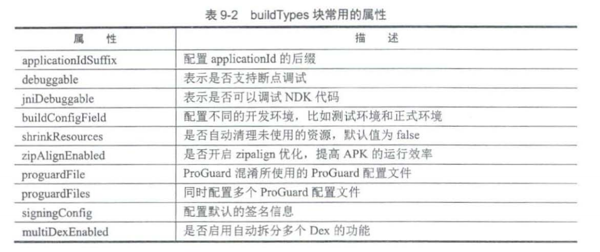

## 7 Groovy基础

### Groovy概述

Apache旗下的一种基于JVM的面向对象的编程语言，既可以用于面向对象编程，又可以用作纯粹的脚本语言。语言设计上西拿了Python、Ruby、和Smalltalk优秀特性，如动态类型转换、闭包和元编程支持。

Groovy与Java可以互相调用并结合编程，比如在写Groovy的时候忘了语法可以直接按Java语法写，也可以在Java中调用Groovy脚本。与Java相比，Groovy语法更加灵活简洁，可以用更少的代码来实现与Java实现相同的功能


### 编写和调试

Groovy的代码可以在Android Studio和IntelliJ IDEA等IDE中进行编写和调试，这种方式的缺点是需要配置环境，这里推荐在文本中编写代码并结合命令行调试（文本推荐Sublime Text）。

具体步骤：在一个目录中新建build.gradle文件，在build.gradle文件中新建一个task，在task中编写Groovy代码，用命令行进入这个build.gradle文件所在的目录，运行gradle task名称等命令行进行调试。


### 变量

用def关键字来定义变量，可以不指定变量的类型，默认访问修饰符是public。

```groovy
def a = 1;
def int b = 1;
def c = "hello world";
```


### 方法

使用返回类型或def关键字定义，方法可以接受任意数量的参数，这些参数可以不声明类型，如果不提供可见性修饰符，则该方法为public

```groovy
// 用def关键字定义方法
task method << {
    add (1,2)
    minus 1,2 //1
}
def add(int a, int b) {
    println a+b //2
}
def minus(a,b) {//3
    println a-b
}

// 如果指定了方法返回类型，则可以不需要def关键字来定义方法
task method << {
    def number = minus 1,2
    println number
}
int minus(a,b) {
    return a-b
}

// 如果不使用return，则方法的返回值为最后一行代码的执行结果
int minus(a,b) {
    a-b //4
}
```

从上面两段代码中可以知道Groovy中有很多省略的部分：

（1）语句后面的分号可以省略

（2）方法的括号可以省略，比如注释1处和注释2处

（3）参数类型可以省略，比如注释3处

（4）return可以省略，比如注释4处


### 类

Groovy类与Java类非常类似

```groovy
task method << {
    def p = new Person()
    p.increaseAge 5
    println p.age
}
class Person {
    String name
    Integer age = 10
    def increaseAge(Integer years) {
        this.age += years
    }
}
```

运行gradle method的打印结果为：15

Groovy类与Java类有以下区别：

（1）默认类的修饰符为public

（2）没有可见性修饰符的字段会自动生成对应的setter方法和getter方法

（3）类不需要与它的源文件有相同的名称，但还是建议采用相同的名称


### 语句

#### 断言

Groovy断言和Java断言不同，Groovy断言一直处于开启状态，是进行单元测试的首选方式。

```groovy
task method << {
    assert 1+2 == 6
}
```

输出结果为：

```
Execution failed for task ':method'.
> assert 1+2 == 6
        |  |
        3  false
```

当断言的条件为false时，程序会抛出异常，不再执行下面的代码，从输出可以清晰地看到发生错误的地方


#### for循环

Groovy支持Java的for(int i=0;i<N;i++)和for(int i:array)形式的循环语句，另外还支持for in loop形式，支持遍历范围、列表、Map、数组和字符串等多种类型。

```groovy
//遍历范围
def x = 0
for (i in 0..3) {
    x += i
}
assert x == 6
//遍历列表
def x = 0
for (i in [0,1,2,3]) {
    x += i
}
assert x == 6
//遍历Map中的值
def map = ['a':1, 'b':2, 'c':3]
x = 0
for (v in map.values()) {
    x += v
}
assert x == 6
```


#### switch语句

Groovy中的switch语句不仅能够兼容Java代码，还可以处理更多类型的case表达式

```groovy
task method << {
    def x =16
    def result = ""
    
    switch (x) {
        case "ok":
        	result = "found ok"
        case [1,2,4,'list']:
        	result = "list"
        	break
        case Integer:
            result = "integer"
        	break
        default:
            result = "default"
    }
    assert result == "range"
}
```

case表达式可以是字符串、列表、范围和Integer等，由于篇幅原因，这里只列举出了一小部分。


### 数据类型

主要有以下几种：

+ Java中的基本数据类型
+ Groovy中的容器类
+ 闭包


#### 字符串

Groovy的基本数据类型和Java大同小异，这里主要介绍字符串类型。在Groovy中有两种字符串，即普通字符串String（java.lang.GString）。其中普通字符串包含单引号字符串、双引号字符串、三引号字符串。

#### 单引号字符串

在Groovy中单引号字符串和双引号字符串都可以定义一个字符串常量，只不过单引号字符串不支持插值。

```groovy
'Android进阶解密'
```

#### 双引号字符串

想要插值可以使用双引号字符串，插值指的是替换字符串中的占位符，占位符表达式为${}，或者以$为前缀。

```groovy
def name = 'Android进阶之光'
println "hello ${name}"
println "hello $name"
```

#### 三引号字符串

三引号字符串可以保留文本的换行和缩进格式，不支持插值。

```groovy
task method << {
    def name = '''Android进阶之光
    	Android进阶解密
    Android进阶？'''
    println name
}
```

其打印结果为：

```
Android进阶之光
	Android进阶解密
Android进阶？
```

String是不可变的，GString却是可变的，GString和String即使有相同的字面量，他们的hashCode的值也可能不同，因此应该避免使用GString作为Map的key。


```groovy
assert "one:${1}".hashCode()!="one:1".hashCode()
```

当双引号字符串中包含插值表达式时，字符串类型为GString，因此上面的断言为true。


#### List

Groovy没有定义自己集合类，他在Java集合类的基础上进行了增强和简化。Groovy的List对应Java中的List接口，默认实现类为Java中的ArrayList。

```groovy
def number = [1,2,3]
assert number instanceof List
def linkedList = [1,2,3] as LinkedList
assert linedList instanceof java.util.LinkedList
```

可以使用as操作符来显示指定List的实现类为java.util.LinkedList

Groovy获取元素比Java要简洁些，使用[]来获取List具有正索引或负索引的元素。

```groovy
task method << {
    def number = [1,2,3,4]
    assert number[1] == 2
    assert number[-1] == 4 //1
    
    number << 5 //2
    assert number [4] == 5
    assert number [-1] == 5
}
```

在注释1处的索引-1是列表末尾的第一个元素。注释2处使用<<运算符在列表末尾追加一个元素


#### Map

创建Map同样使用[]，需要同时指定键和值，默认的实现类为java.util.LinkedHashMap。

```groovy
def name = [one:'魏无羡', two:'杨影枫', three:'张无忌']
assert name['one'] == '魏无羡'
assert name.two == '杨影枫'
```


Map还有一个键关联的问题：

```groovy
def key = 'name'
def person = [key:'魏无羡'] //1
assert person.containsKey('key')
person = [(key):'魏无羡'] //2
assert person.containsKey('name')
```

注释1处魏无羡的键值是key这个字符串而不是key变量变量的值name。如果想要以key变量的值键值，则需要像注释2处一样使用（key），用来告诉解析器我们传递的是一个变量，而不是定义一个字符串键值。


#### 闭包

Groovy中的闭包是一个开放的、匿名的、可以接受参数和返回值的代码块。

**1、定义闭包**

闭包的定义遵循以下语法。

```groovy
{ [closureParameters -> ] statements }
// 闭包分为两个部分，分别是参数列表部分[closureParamters ->]和语句部分statements。
```

参数列表部分是可选的，如果闭包只有一个参数，则参数名是可选的，Groovy会隐式指定it作为参数名，如下所示。

```groovy
{println it} // 使用隐式参数it的闭包
```

当需要指定参数列表时，需要用 -> 将参数列表和闭包体相分离，如下所示。

```groovy
{ it -> println it } //it是一个显示参数
{ String a, String b ->
    println "${a} is a ${b}"
}
```

闭包是groovy.lang.Cloush类的一个实例，可以将闭包赋值给变量或字段，如下所示。

```groovy
// 将闭包赋值给一个变量
def println = { it -> println it}
assert println instanceof Closure
// 将闭包赋值给Closure类型变量
Closure do = { println 'do!'}
```

**2、调用闭包**

闭包既可以当作方法来调用，又可以显示调用call方法

```groovy
def code = { 123 }
assert code() == 123		//闭包当作方法调用
assert code.call() == 123	//显示调用call方法
def isOddNumber = {int i -> i%2 != 0 }
assert isOddNumber(3) == true//调用带参数的闭包
```


### I/O操作

Groovy的I/O操作比Java更简洁

#### 文件读取

我们再PC上新建一个name.txt，在其中输入一些内容，然后用Groovy来读取该文件的内容。

```groovy
def filePath = "D:/Android/name.txt"
def file = new File(filePath);
file.eachLine {
    println it
}
```

可以看出Groovy文件读取很简洁，还可以更简洁些

```groovy
def filePath = "D:/Android/name.txt"
def file = new File(filePath);
println file.text
```

#### 文件写入

文件写入同样十分简洁

```groovy
def filePath = "D:/Android/name.txt"
def file = new File(filePath);

file.withPrintWriter {
    it.println("三井寿")
    it.println("仙道彰")
}
```


### 其他

#### asType

asType可以用于数据类型转换

```groovy
String a = '23'
int b = a as int
def c = a.asType(Integer)
assert c instance of java.lang.Integer
```

#### 判断是否为真

```groovy
if (name != null && name.length > 0) {}
```

可以替换为

```groovy
if (name) {}
```

#### 安全取值

在Java中，要安全获取某个对象的值可能需要大量的if语句来进行非空判断。

```groovy
if (school != null) {
    if (school.getStudent() != null) {
        if (school.getStudent().getName() != null) {
            System.out.println(school.getStudent.getName());
        }
    }
}
```

Groovy中可以使用`?.`来进行安全取值。

```groovy
println school?.student?.name
```

#### with操作符

对同一对象的属性进行赋值时，可以这样做。

```groovy
task method << {
    Person p = new Person()
    p.name = "杨影枫"
    p.age = 19
    p.sex = "男"
    println p.name
}
class Person {
    String name
    Integer age
    String sex
}
```

使用with来进行简化

```groovy
Person p = new Person()
p.with {
    name = "杨影枫"
    age = 19
    sex = "男"
}
println p.name
```


## 8 Gradle核心

### 8.1 Gradle概述

#### 项目自动化

Gradle是一个构建工具，为什么要用构建工具？这就需要从项目自动化开始讲起。

在开发软件，会临时相似的情况，我们需要用IDE来进行编码，当完成一些功能时会进行编译、单元测试和打包工作，这些都需要开发人员手动实现。而一般的软件都是迭代式开发，一个版本接着一个版本，每个版本又可能有很多功能，如果开发每次实现功能时都需要手动进行编译、单元测试和打包等工作，那么显然会非常耗时而且也容易出现问题，因此项目自动化应运而生，它有以下优点：

（1）项目自动化可以尽量防止开发手动接入从而节省了开发的时间并减少错误的发生

（2）项目自动化可以自定义有序的步骤来完成代码的编译、测试和打包工作，使重复的步骤变得简单

（3）IDE可能受到不同操作系统的限制，而自动化构建是不会依赖于特定的操作系统和IDE的，它具有平台无关性。

#### 构建工具

构建工具用于项目自动化，是一种可编程的工具，我们可以用代码来控制构建流程，最终生成可交付的软件。构建工具可以帮助我们创建一个重复的、可靠的、无需手动介入的、不依赖于特定操作系统和IDE的构建。这里以APK的构建过程来举例。

##### 1、APK的构建过程

APK的构建过程主要分为以下几个步骤

（1）通过AAPT（Android Asset Packaging Tool）打包res资源文件，比如AndroidManifest.xml和xml布局文件等，将这些xml文件编译为二进制，其中assets文件夹和raw文件夹的文件不会被编译为二进制，最终会生成R.java文件和resources.arsc文件。

（2）AIDL工具会将所有aidl接口转化为对应的Java接口。

（3）所有Java代码，包括R.java文件和Java接口都会被Java编译器编译成.class文件。

（4）Dex工具会将第（3）步生成的.class文件、第三方库和其他.class文件都编译成.dex文件

（5）第（4）步编译生成的.dex文件、编译过的资源、无需编译的资源都（如图片等）会被ApkBuilder工具打包成apk文件。

（6）使用Debug Keystore或者Release Keystore对第（5）步生成的apk文件进行签名。

（7）如果是对APK正式签名，那么还需要使用zipalign工具对APK进行对齐操作，这样应用运行时会减少内存的开销。

从以上步骤看出APK的构建过程是比较繁琐的，而且这个构建过程又是时常重复的，如果没有构建工具，手动完成构建工作，那么毫无疑问对于开发人员是个折磨，也会产生诸多问题，导致项目开发周期变长。

在Gradle出现之前，有三个基于Java的构建工具：Ant、Gant和Maven，他们被应用在Java或者Android开发中，我们来看看他们的特点。

##### 2、Apache Ant

Ant指的是Another Neat Tool。最初是用来构建Tomcat的，在2000年Ant成为一个独立的项目并被发布出来。Ant是由Java编写的构建工具，它的核心代码是由Java编写的，因此具有平台无关性，构建脚本是XML格式的（默认为build.xml）。

Ant构建脚本的样式如下所示：

build.xml

```xml
<?xml version="1.0" encoding="UTF-8"?>
<project name="test" default="hello">
    <echo message="running build.xml which is equivalent to build.gant"/>
    <property file="build.properties" />
    <target name="init" description="init target">
        <echo message="Executing init target" />
    </target>
    <tartget name="hello" depends="init" description="say hello target">
        <echo message="${echo.msg}" />
    </tartget>
</project>
```

Ant的构建脚本由三个基本元素组成：一个project（工程）、多个target（目标）和可用的task（任务）。

Apache Ant有以下缺点：

（1）Ant无法获取运行时的信息

（2）XML作为构建脚本的语言，如果构建逻辑复杂，那么构建脚本就会很长且难以维护

（3）Ant需要配合Ivy（一种管理项目依赖工具），否则Ant很难管理依赖

（4）Ant在如何组织项目结构方面没有给出任何指导，这导致Ant虽然灵活性高，但这样的灵活性导致每个构建脚本都是唯一的而且很难被理解。

##### 3、Gant

Gant是一个基于Ant的构建工具，它在Ant的基础上用Groovy写的DSL（领域特定语言）。如果用Ant实现构建，但是不喜欢用XML来编写构建脚本或者现有的XML构建脚本很难维护和管理，那么Gant是个不错的选择。

Gant构建文件的演示如下所示：

build.gant

```groovy
Ant.echo(message:'running build.gant')
Ant.property(file:'build.properties')
def antProperty = Ant.project.properties
target(init : 'init target') {
	echo(message : 'Executing init target')
}
target(hello : 'say hello target') {
    depends(init)
    echo(message : antProperty.'echo.msg')
}
setDefaultTarget(hello)
```

##### 4、Apache Maven

Maven于2004年发布，它的目标是改进开发人员在使用Ant时面临的一些问题。Maven最初是为了简化Jakarta Turbine项目的构建的，他经历了从Maven到Maven3的发展，Maven作为后来者，继承了Ant的项目构建功能，同样采用了XML作为构建脚本的格式。Maven具有依赖管理和项目管理的功能，并提供了中央仓库，能够帮助我们自动下载库文件。

Maven的构建脚本的样式如下所示。

pom.xml

```xml
<project xmlns="http://maven.apache.……" xmlns:xsi="http://www.w3.……"
         xsi:schemaLocation="http://maven.apache……http://maven.apache……">
    <modelVersion>4.0.0</modelVersion>
    <groupId>com.mycompany.app</groupId>
    <artifactId>my-app</artifactId>
    <version>1.0-SNAPSHOT</version>
    <packaging>jar</packaging>
    <name>Maven Quick Start Archetype</name>
    <url>http://maven.apache···</url>
    <dependencies>
        <dependency>
            <groupId>junit</groupId>
            <artifactId>junit</artifactId>
            <version>4.11</version>
            <scope>test</scope>
        </dependency>
    </dependencies>
</project>
```

Maven相比Ant有以下优点。

（1）Ant是过程式的，开发这需要显示的指定每个目标，以及完成该目标所需要执行的任务。开发者需要重新编写每一个项目的过程，这样会产生大量的重复。而Maven是声明式的，项目的构建过程和过程中的各个阶段都由插件实现，开发者只需要声明项目的基本元素就可以了，这很大程度消除了重复。

（2）Ant本身是没有依赖管理的，续传配合Ivy来进行依赖管理，而Maven本身就提供了依赖管理。

（3）Maven使用的是约定而不是配置，它为工程提供了合理的默认行为，项目会知道去哪个目录寻找源码及构建运行时有哪些任务去执行，如果我们项目遵从默认值，那么只需要写几行XML配置脚本就可以了，而Ant是使用配置且没有默认行为的。

Maven也有一下缺点：

（1）Maven提供了默认的结构和生命周期，这些可能不适合我们的项目需求

（2）为Maven定制的扩展过于烦琐

（3）Maven的中央仓库比较混乱，当无法从中央仓库中得到需要的类库时，我们可以手工下载并复制到本地仓库中，也可以建立组织内部的仓库服务器。

（4）国内连接Maven的中央仓库比较慢，需要连接国内的Maven镜像仓库

（5）Maven缺乏相关的技术文档，不便于使用和理解


#### Gradle的特性

Gradle基于JVM，是一款专注于灵活性和性能的开源构建工具，它的特性包含了：


从图8-2可以看出，Gradle结合Ant和Maven等构建工具的最佳特性。它有约定优于配置的方法、强大的依赖管理，它的构建脚本使用Groovy或Kotlin编写，Gradle是Android的官方构建工具。Gradle的构建脚本的样式如下所示：

build.gradle

```groovy
apply plugin:'java'
group='com.mycompany.app'
archivesBaseName='my-app'
version='1.0-SNAPSHOT'

repositories {
    mavenCentral{}
}

dependencies {
    testCompile 'junit:4.11'
}
```

这个build.gradle等同于此前Maven的pom.xml。由此可以看出Groovy编写构建脚本代码量更少，可读性更强。

下面列出Gradle与竞争对手不同的特性。

1. 轻松的可拓展性
   Gradle有非常良好的拓展性。如果我们想要在多个构建或者项目中分享可重用代码，Gradle的插件会帮助我们实现。将Gradle插件应用在项目中，它会在项目构建过程中提供很多帮助：为我们添加项目的依赖的第三方库、添加有用的默认设置的约定（源码位置、单元测试代码位置）。其中AndroidGradle插件继承Java插件，在本章8.5节会介绍插件的内容。

2. 采用了Groovy

   Ant和Maven的构建脚本是由XML来编写的，如果XML逻辑复杂且内容太多就不容易维护。Gradle可以使用Groovy来构建脚本，Groovy是一种基于JVM的动态语言，它的语法和Java非常相似并兼容Java，因此我们不用担心学习Groovy

3. 强大的依赖管理

   Gradle提供了可配置的、可靠的依赖管理方案。一旦依赖的库被下载并存储到本地缓存中，我们的项目就可以使用了。依赖管理很好地实现了在不同的平台和机器上产生相同的构建结果。

4. 灵活的约定

   Gradle可以为构建项目提供引导和默认值，如果使用这种约定，那么Gradle构建脚本代码量比较少。相比Ant、Gradle不仅提供了约定，还可以轻松打破约定。

5. Gradle Wrapper

   Gradle Wrapper是对Gradle的包装，它的作用是简化Gradle本身的下载、安装和构建，比如它会在我们没有安装Gradle的情况下，去下载指定版本的Gradle并进行构建。Gradle的版本很多，所以有可能出现版本兼容的问题，去下载指定版本的Gradle并进行构建。Gradle的版本很多，所以有可能出现版本兼容的问题，这就需要Gradle Wrapper去统一Gradle的版本，避开开发团队因为Gradle版本不一致而产生的问题。

6. 可以和其他构建工具集成

   Gradle可以和Ant、Maven和Ivy进行集成，比如我们可以把Ant的构建脚本导入Gradle的构建中。

7. 底层API

   Gradle显然无法满足所有企业级构建的要求，但是可以通过Hook Gradle的生命周期来监控和配置构建脚本。

8. 社区的支持和推动

   Gradle是一个开源的项目，它遵循了Apache License 2.0协议。Gradle的优良特性吸引了很多开发者并形成了Gradle社区，很多开源软件的开发者为Gradle的核心代码做出了共享。


### 8.2 Gradle基础知识

本节继续学习Gradle入门需要掌握的基础知识，包括配置环境、实现Hello World、Gradle的任务、Gradle日志和Gradle命令行，掌握这些能够更好地理解Gradle。

#### 配置Gradle环境

安装Gradle前要确保系统已经配置好JDK的环境，要求JDK的版本在1.7或更高的版本。

Gradle的安装有以下两种形式。

（1）通过包管理安装，比如Windows平台的Chocolatey和Scoop，macOS平台的MacPortsl和Homebrew等。

（2）手动安装。见《Android进阶指北》P255

#### 实现Hello World

配置完成Gradle环境后，按照惯例要实现Gradle的Hello World，这里以Windows平台为例。

build.gradle为Gralde默认的构建脚本文件，运行Gradle命令时，会从当前目录下寻找build.gradle文件来执行构建。

我们首先新建一个目录，比如D:\Android\gradle_demo，在这个目录中新建一个build.gradle文件，输入以下内容：

```groovy
task hello {
    doLast {
        println 'Hello world!'
    }
}
```

然后在该文件的所在目录下运行gradle -q hello构建脚本，就会在控制台打印出'Hello World!'。

项目构建比较复杂，为了使用各种开发语言的开发者都能够快速构建项目，专家们开发出了Gradle这个基于Groovy的DSL(Domain Specific Language)，DSL意为领域特定语言，只用于某个特定的领域。我们只要按照Groovy的DSL语法来写，就可以轻松构建项目了。

task（任务）和action（动作）是Gradle的重要元素。上述代码中，task代表一个独立的原子性操作，比如复制一个文件，编译一次Java代码，这里我们简单地将其定义一个名为hello的任务。doLast代表task执行的最后一个action，通俗来讲就是task执行完毕后会回调doLast中的代码，在上面这个示例中就会打印'Hello world!'

上面的示例还可以写的更简洁一些，操作符<<是doLast方法的快捷版本，他们有相同的作用：

```groovy
task hello << {
    println 'Hello world!'
}
```

> 注意：操作符 `<<` 在Gradle 4.x 中被弃用（deprecated），并且在Gradle 5.0 被移除（removed）

#### 8.2.3 Gradle的任务

为了讲解后面的Gradle命令行，这里简单介绍下Gradle的任务，包括创建任务、任务依赖、动态定义任务和任务的分组和描述。

##### **1.创建任务**

除了以上实现Hello World的示例采用的创建任务方式，还有以下3种创建任务方式。

（1）直接用任务名称创建
```groovy
def Task hello = task(hello)
hello.doLast{
    println "hello world"
}
```

（2）任务名称+任务配置创建

```groovy
def Task hello = task(hello,group:BasePlugin.BUILD_GROUP)
hello.doLast {
    println "hello world"
}
```

其中group为任务配置项，它代表了分组。

（3）TaskContainer的create方法创建

```groovy
tasks.create(name:'hello') << {
    println "hello world"
}
```

此前创建任务的方式最终都会调用tasks的create方法，其中tasks类型为TaskContainer。

##### **2.任务依赖**

任务依赖会决定任务运行的先后顺序，被依赖的任务会在定义依赖的任务以前执行。

```groovy
task hello << {
    println 'Hello world!'
}
task go(dependsOn: hello) << {
    println "go for it"
}
```

在hello任务的基础上增加了一个名为go的任务，通过dependsOn来指定依赖的任务为hello，因此go任务在hello之后运行。

运行gradle -q go构建脚本，打印结果如下：

```
Hello world!
go for it
```

##### **3.动态定义任务**

动态定义任务指的是在运行时来定义任务的名称：

```groovy
3.times { number ->
    task "task$number" << {
        println "task $number"
    }
}
```

这里用到了Groovy语法，times是Groovy在java.lang.Number中拓展的方法，是一个定时器。3.times中循环创建了三个新任务，隐式变量number的值为0、1、2，任务的名称由task加上number的值组成，达到了动态定义任务的目的。

运行gradle -q task0构建脚本，打印结果如下。

```
task 0
```

##### **4.任务的分组和描述**

Gradle有任务组的概念，可以为任务配置分组和描述，以便于管理任务，拥有良好的可读性。改造上述示例，为hello任务添加分组和描述：

```groovy
task hello {
    group = 'build'
    description = 'hello world'
    doLast {
        println "任务分组；${group}"
        println "任务描述：${description}"
    }
}

task go(dependsOn: hello) << {
    println "go for it"
}
```

也可以采用之前其他的创建任务方式来为任务添加分组和描述：

```groovy
def Task hello = task(hello)
hello.description = 'hello world'
hello.group = BasePlugin.BUILD_GROUP
hello.doLast {
    println "任务分组：${group}"
    println "任务描述：${description}"
}
task go(dependsOn: hello) << {
    println "go for it"
}
```


#### Gradle日志级别

和Andorid一样，Gradle也定义了日志级别，如表所示：

| 级别      | 用于       |
| --------- | ---------- |
| ERROR     | 错误消息   |
| QUIET     | 重要的消息 |
| WARNING   | 警告消息   |
| LIFECYCLE | 进度消息   |
| INFO      | 信息性消息 |
| DEBUG     | 调试消息   |

前面章节我们通过`gradle -q +任务名称`来运行一个指定的task，这个q是命令行开关选项，通过开关选项可以控制输出的日志级别：

| 开关选项        | 输出日志级别        |
| --------------- | ------------------- |
| 无日志选项      | LIFECYCLE及更高级别 |
| -q 或者 --quiet | QUIET及更高级别     |
| -i 或者 --info  | INFO及更高级别      |
| -d 或者 --debug | DEBUG及更高级别     |


#### Gradle命令行

从命令行角度来看，Gradle和Git类似，命令都可以用一些IDE或图形工具来代替，但是如果我们对Gradle命令行熟悉，会帮助我们更好地理解Gradle，高效地运用Gradle。

##### **1.获取所有任务信息**

本节的命令行以8.2.3节的代码为例，此前我们通过`gradle -q +任务名称`来运行一个指定的任务，如果不知道任务名称，则可以通过运行`gradle -q tasks`命令来获取所有任务信息，这样就不需要打开源码了：

```
Build tasks
-----------
hello-helloworld

Build Setup tasks
-----------------
init - Initializesanew Gradle build.
wrapper - Generates Gradle wrapper files.

Help tasks
----------
buildEnvironment - Displays all buildscript dependencies declared in root project'gradle demo'.
components - Displays the components produced by root project 'gradle demo'.[incubatingldependencies - Displays all dependencies declared in root project 'gradle demo'.

dependencyInsight - Displays the insight into a specific dependency in root proiectigradle demo'.
dependentComponents - Displays the dependent components of components in root project gradle demo'.[incubating]
help - Displays a help message.
model - Displays the configuration model of root project 'gradle demo',[incubating]
projects - Displays the sub-projects of root project 'gradle demo'.
properties - Displays the properties of root project 'gradle demo'.
tasks - Displays the tasks runnable from root project 'gradle demo'.

To see all tasks and more detail,run gradle tasks--all
To see more detail about a task,run gradle help --task <task>
```

在默认情况下，只会显示那些被分组的任务和描述。比如Build tasks（Build任务组）中有我们定义的hello任务，Build Setup tasks中有init和wrapper，Help tasks中有buildEnvironment和components等。

##### **2.排除任务**

如果我们不想运行go任务，则可以运行`gradle hello -x go`命令，如下所示：

```
> Task : hello
任务分组：build
任务描述：hello world

Deprecated Gradle feature were used in this build, making it incompatible with Gradle 5.0.
Use '--warning-mode all' to show the individual deprecation warnings.
See https://docs.gradle……
mand_line_warnings

BUILD SUCCESSFUL in 2s
1 actionable task: 1 executed
```

由上述代码可以看出，并没有运行go任务。

##### **3.获取任务帮助信息**

通过运行`gradle -q help --task hello`命令来显示hello任务的帮助信息：

```
Detailed task information for hello

Path
	:hello
	
Type
	Task (org.gradle.api.Task)
	
Description
	hello world
	
Group
	build
```

由上述代码可以看到hello任务的路径、类型、描述和分组。

##### **4.多任务调用**

如果想要多任务调用，则可以使用如下代码。

```groovy
task helloWorld << {
    println 'Hello world!'
}
task goForit << {
    println "go for it"
}
```

通过命令行一次执行多个任务，每个任务通常只会执行一次，无论是在命令行中指定任务还是任务依赖，上面的示例中，我们在运行gradle helloWorld goFoit时，会先执行helloWorld任务后再执行goForit任务。

##### **5.任务名称缩写**

可以对使用驼峰命名的任务进行缩写，对于名称特别长的任务，这个特性非常有用，比如多任务调用中的示例只需要执行`gradle hW gF`就可以了，不过需要注意的是，任务名称的缩写必须是唯一的，如果多任务调用示例中第二个任务的名称helloWangshu，那么就会报错。


### 8.3 被忽视的Gradle Wrapper

我们已经学习了为什么要用Gradle、Gradle的基础、Groovy的基础，这一节我们接着学习Gradle Wrapper。了解Gradle Wrapper可以更好地理解Gradle，GradleWrapper在日常开发中看似“不起眼”，实则非常重要。

#### 为什么需要Gradle Wrapper

Gradle Wrapper被称为Gradle包装器，是对Gradle的一层包装。为什么需要Gradle Wrapper？比如在一个开发团队中，如果没进来一个成员都需要在计算机中安装Gradle，那么这是运行Gradle的环境和版本就会给构建结果带来不确定性。针对这个问题，Gradle提供了一个解决方案，即Gradle Wrapper，它是一个脚本，可以在计算机没有安装Gradle的情况下运行Gradle构建，并且能够指定Gradle的版本，开发人员可以快速启动并运行Gradle项目，而不必手动安装，这样就标准化了项目，从而提高了开发效率。Android Studio在新建项目时会自带Gradle Wrapper，这也是我们很少单独去下载安装Gradle的原因。Gradle Wrapper的工作流程如图：


当使用Gradle Wrapper启动Gradle时，如果指定版本的Gradle没有被下载关联，那么会先从Gradle官方仓库将该版本的Gradle下载到用户本地，进行解包并执行批处理文件。后续的构建运行都会重用这个解包的运行时安装程序。

#### 构建Gradle Wrapper

首先要确保计算机中配置了Gradle的环境，Gradle已经内置了Wrapper Task，执行Wrapper Task就可以在项目目录中生成Gradle Wrapper的目录文件。在项目根目录中执行gradle wrapper就可以了：

```shell
$ gradle wrapper
> Task:wrapper

BUILD SUCCESSFUL in 0s
1 actionable task: 1 executed
```

这时会在项目根目录中生成如下文件：

```
|————gradle
|    |————wrapper
|       |————gradle-wrapper.jar
|       |————gradle-wrapper.properties
|————gradlew
|————gradlew.bat
```

每个文件的含义如下。

+ gradle-wrapper.jar：包含Gradle运行时的逻辑代码
+ gradle-wrapper.properties：负责配置包装器运行时行为的属性文件，用来配置使用哪个版本的Gradle等属性。
+ gradlew：在Linux平台下，用于执行Gradle命令的包装器脚本。
+ gradlew.bat：在Windows平台下，用于执行Gradle命令的包装器脚本。

当生成了这些目录与文件后，用户就可以将工程push到远程，当其他用户clone下来后就可以直接进行项目的构建，节省了用户单独下载Gradle的时间，并且可以确保Gradle版本的一致。

也可以用gradle命令行选项来生成gradle wrapper。

--gradle-version：用于下载和执行指定的gradle版本。

--distribution-type：指定下载Gradle发行版的类型，可用选项有bin和all，默认值是bin，-bin发行版只包含运行时，但不包含源码和文档。

--gradle-distribution-url：指定下载Gradle发行版的完整URL地址。

--gradle-distribution-sha256-sum：使用的SHA 256散列和验证下载的Gradle的发行版。

比如使用命令行：gradle wrapper --gradle-version 4.2.1 --distribution-type all，就可以生成版本为4.2.1的包装器，并使用-all发行版。


#### 配置的Gradle Wrapper

gradle-wrapper.properties是Gradle Wrapper的属性文件，用来配置Gradle Wrapper，Gradle 4.2.1版本对应的gradle-wrapper.properties如下所示：

```groovy
distributionBase=GRADLE_USER_HOME
distributionPath=wrapper/dists
zipStoreBase=GRADLE_USER_HOME
zipStorePath=wrapper/dists
distributionUrl=https\://services.gradle……
```

字段含义如下：

+ distributionBase：Gradle解包后存储的主目录。
+ distributionPath：distributionBase指定目录的子目录。distributionBase+distributionPath就是Gradle解包后的存放位置。
+ distributionUrl：Gradle发行版压缩包的下载地址。
+ zipStoreBase：Gradle压缩包存储主目录。
+ zipStorePath：zipStore指定目录的子目录。zipStoreBase+zipStorePath就是Gradle压缩包的存放位置。

这里我们需要关注的是distributionUrl字段，如果官方的地址下载不了或者下载缓慢，则可以将这个地址换为其他镜像地址，或者把Gradle发行版压缩包放在服务器上以供下载。


#### 使用Gradle Wrapper

使用Gradle Wrapper不是用Gradle命令，而是用gradlew和gradlew.bat脚本。在build.gradle中加入如下语句。

```groovy
task.test {
    doLast {
        println 'Hello world!'
    }
}
```

以Windows平台为例，我们进入项目所在的根目录执行`gradlew test`。

```shell
f:\app>gradlew.bat test
Downloading https://services.gradle……
·································································
Starting a Gradle Daemon (subsequent builds will be faster)

> Task: test
Hello world!
```

> 可将gradle-wrapper.properties中的distributionUrl改为本地的Gradle压缩包

如果计算机中没有Gradle发行版，则Gradle包装器会将Gradle发行版压缩包下载到本地中进行解压，比如计算机中的存储路径为：C:\Users\52501.gradle\wrapper\dists\gradle-4.2.1-bin\dajvke9o8kmaxbu0kc5gcgeju\gradle-4.2.1。

如果此后Gradle属性文件的distributionUrl属性不变，就会一致使用本地的Gradle发行版。如果我们再次执行`gradlew.bat test`，就会和调用Gradle命令一样。

```shell
f:\app>gradlew.bat test
Starting a Gradle Daemon (subsequent builds will be faster)

> Task: test
Hello world!
```


#### 升级Gradle Wrapper

升级Gradle Wrapper有两种方式，第一种方式是设置Gradle属性文件的distributionUrl属性，第二种方式是运行wrapper任务，推荐使用第二种方式。当前本地的Gradle版本为4.2.1，如果想升级为5.1.1，则只需要运行gradlew wrapper --gradle-version 5.1.1命令即可。

```shell
f:\app>gradlew wrapper --gradle-version 5.1.1

BUILD SUCCESSFUL in 1s
1 actionable task: 1 executed
```

运行gradlew -v命令来检查Gradle的版本

```

```

由于本地的版本不是Gradle 5.1.1，那么会将下载下来的Gradle压缩包存储起来并进行解包，具体内容见上述打印日志。


#### 自定义Gradle Wrapper

Gradle已经内置了Wrapper Task，因此构建Gradle Wrapper会生成Gradle Wrapper的属性文件，这个属性文件可以通过自定义Wrapper Task来设置。比如我们想要将下载的Gradle版本修改为4.2.1，可以设置成如下形式。

```groovy
task wrapper(type:Wrapper) {
    gradleVersion = '4.2.1'
    distributionUrl = '../../gradle-4.2.1-bin.zip'
    distributionPath = wrapper/dists
}
```

distributionUrl属性可以设置为本地的项目目录，也可以设置为网络地址。


### 8.4 Gradle插件基础

#### Gradle插件概述

提到Gradle插件之前，我们首先了解什么是插件。在《Android进阶解密》中（第15章插件化原理），讲解了插件化的原理，并讲解了什么是插件。

Gradle本身和初始的机器人一样，知识提供了基本的核心功能，其它特性比如编译Java源码的能力、编译Android工程的能力等就需要通过插件来实现了。这里主要讲的是Gradle插件，而不是Android Gradle插件。

#### 应用Gradle插件

应用Gradle插件主要有两个步骤，第一步是解析插件，第二步是把插件应用到项目中，应用插件通过Project.apply方法来完成。

在Gradle中一般有两种类型的插件，分别为脚本插件和对象插件。脚本插件是额外的构建脚本，它会进一步配置构建，可以把它理解为一个普通的build.gradle。对象插件又叫二进制插件，是实现了Plugin接口的类，下面分别介绍如何使用脚本插件和对象插件。

##### 脚本插件

在8.3节示例的基础上定义一个other.gradle，该示例的脚本目录结构如图：


other.gradle的代码如下所示：

```groovy
ext {
    version='1.0'
    url = 'http://liuwangshu……'
}
```

这实际上不算是一个真正的脚本插件，就是一个简单的脚本插件，主要是用于演示脚本插件是如何被应用的。我们在build.gradle中应用这个脚本插件，如下所示：

build.gradle

```groovy
apply from: 'other.gradle'
task test {
    doLast {
        println "版本为：${version},地址为：${url}"
    }
}
```

apply是Gradle project中提供的方法，用于配置项目中的插件。执行`gradlew.bat test`，会打印出想要的结果。

##### 对象插件

我们知道对象插件就是实现了`org.gradle.api.plugins<Project>`接口的插件，对象插件可以分为内部插件和第三方插件。

**1.内部插件**

如果我们想要应用Java插件可以这样写。

build.gradle

```groovy
apply plugin:org.gradle.api.plugins.JavaPlugin
```

Gradle默认导入了`org.gradle.api.plugins`包，因此我们也可以去掉包名。

```groovy
apply plugin:JavaPlugin
```

实现了`org.gradle.api.plugins`接口的插件还有pulginid，使用pulginid是十分简洁且常用的方式：

```groovy
apply plugin:'java'
```

Gradle的发行包中有大量的插件，这些插件有很多类型，比如语言插件、集成插件、软件开发插件等，如果我们向项目添加C++源码编译功能，那么可以这样写。

```groovy
apply plugin:'cpp'
```

**2.第三方插件**

第三方的对象插件通常是jar文件，要想让构建脚本知道第三方插件的存在，需要使用buildscript来设置依赖。

```groovy
buildscript {
    repositories {
        maven {
            url "https://plugins.gradle……"
        }
    }
    dependencies {
        classpath "com.jfrog.bintray.gradle:gradle-bintary-plugin:1.8.4"
    }
}
apply plugin: "com.android.application"
```

这样我们就可以使用Android Gradle插件通过apply方法来使用App工程插件，这样项目会编译成为一个APK，这里设计了Android相关的知识，脱离了本章的讨论范围，具体内容请见后续章节。


#### 插件DSL

Gradle的特性有四种状态，分别是Internal、Incubating、Public、Deprecated，插件DSL属于Incubating状态（即孵化状态）。这也导致插件DSL的特性在将来的Gradle版本中可能会发生变化，直到它不在孵化为止。

使用Java插件可以这样写。

build.gradle

```groovy
plugins {
    id 'java'
}
```

这种代码很简洁，当然这是使用内部插件，如果外部插件被托管在gradle plugin上，那么也可以这样写。

build.gradle

```groovy
plugins {
    id "com.jfrog.bintray" version "1.8.4"
}
```

这样就不需要配置buildscript了，直接配置plugins来使用插件。


#### 自定义对象插件

对象插件是实现了`org.gradle.api.plugins<Project>`接口的插件，这个接口中之定义了一个简单的apply方法，想要自定义插件就需要实现`org.gradle.api.plugins<Project>`接口。

实现一个简单的自定义插件，为了方便测试，不再采用文本编辑，而是使用IntelliJ来编辑（AndroidStudio也可以），用IntelliJ来打开8.4.2.1节的示例，改写build.gradle文件，如下所示：

build.gradle

```groovy
apply plugin:CustomPlugin
class CustomPlugin implements Plugin<Project> {
    @Override
    void apply(Project project) {
        project.task('CustomPluginTask') {
            doLast {
                println "自定义插件"
            }
        }
    }
}
```

在build.gradle中自定义一个插件CustomPlugin，在apply方法中创建一个名称为CustomPluginTask的任务。在IntelliJ的Terminal中输入`gradlew.bat CustomPluginTask`来执行CustomPluginTask任务，运行结果如下：

``` 
F:\app>gradlew.bat CustomPluginTask

>Task:CustomPluginTask
自定义插件

... in 1s
1 actionable task:1 executed
```

这个示例只能在自己的项目中使用，而且比较简单，复杂的插件会在8.5节中进行介绍。


#### Gradle插件的作用和优点

Gradle插件的作用主要有以下几点：

+ 为项目配置依赖
+ 为项目配置约定，比如约定源码的存放位置
+ 为项目添加任务，完成测试、编译和打包的工作
+ 为项目中的核心对象和其他插件的对象添加拓展类型

使用Gradle插件主要有以下优点：

+ 重用和减少维护在多个项目类似的逻辑和开销
+ 更高程度的模块化
+ 封装必要的逻辑，并允许构建脚本尽可能是声明性的


### 8.5 自定义Gradle插件

自定义Gradle插件（自定义Gradle对象插件）主要有三种方式。分别是在build.gradle中编写、在buildSrc工程项目中编写、在独立项目中编写。

#### 在build.gradle中编写

Groovy、Java、Kotlin都可以作为实现插件的语言，在本节的示例中，使用Groovy作为实现语言。

在实际工作中我们很少会在build.gradle中编写自定义插件，这里是为了学习写简单的示例，先来了解自定义插件。

**1.简单的自定义插件**

用IntelliJ新建一个Groovy工程。

定义项目的GroupId和ArtifactId。

build.gradle文件和运行结果见8.4.4。

**2.自定义插件扩展**

再举一个简单的插件拓展示例，通过插件拓展来配置CustomPluginTask的输出字符串，如下所示：

build.gradle

```groovy
class CustomPluginPluginExtension {
    String message = 'from CustomPlugin'
}
class CustomPlugin implements Plugin<Project> {
    @Override
    void apply(Project project) {
        def extension = project.extensions.create('custom', CustomPluginPluginExtension)//1
        project.task('CustomPluginTask') {
            doLast {
                println extension.message
            }
        }
    }
}
apply plugin:CustomPlugin
custom.message = "自定义插件拓展"//2
```

CustomPluginPluginExtension类中定义了message变量，CustomPluginPluginExtension是一个Groovy Bean（类似于JavaBean）。注释1处用于将拓展插件CustomPluginPluginExtension添加到插件列表中，其名称为custom。注释2处设置CustomPluginPluginExtension的message值。

在Terminal中输入gradlew.bat CustomPluginTask来执行CustomPluginTask任务，运行结果如下所示：

```
F:\workspace\CustomPlugin gradlew.bat CustomPluginTask

> Task:CustomPluginTask
自定义插件拓展

···1s
1 actionable task:1 executed
```


#### 在buildSrc工程项目中编写

除了在build.gradle中编写的自定义插件，还可以将插件的源码放在rootProjectDir/buildSrc/src/main/groovy目录中，Gradle会自动识别来完成编译和测试。

在工程根目录下建立/buildSrc/src/main/groovy目录，如图所示：


在groovy目录中创建一个groovy文件，如下所示：

buildSrc/src/main/groovy/CustomPlugin.groovy

```groovy
import org.gradle.api.Plugin;
import org.gradle.api.Project;
class CustomPlugin implements Plugin<Project> {
    @Override
    void apply(Project project) {
        project.task('CustomPluginTask') {
            doLast {
                println "自定义插件"
            }
        }
    }
}
```

修改build.gradle为如下内容：

build.gradle

```groovy
apply plugin:CustomPlugin
```

在Terminal中输入gradlew.bat CustomPluginTask任务，会打印处我们想要的结果。


#### 在独立项目中编写

无论是build.gradle中编写自定义插件，还是在buildSrc项目中编写自定义插件，都只能在自己的项目中使用。如果想分享给其他人使用，那么可以在一个独立的项目中编写插件，这个项目会生成一个包含插件类的JAR文件，有了JAR文件就可以进行分享了。

##### 自定义插件

为了和前两种方式区分，这里用IntelliJ新建一个Groovy工程，工程名为CustomPluginShare，后面代码会用到。

**1.配置build.gradle**

```groovy
apply plugin:'groovy'

dependencies {
    compile gradleApi()
    compile localGroovy()
}
```

应用Groovy插件，并将Gradle API添加为编译时依赖项，build工程会在External Libraries中生成三个jar文件，如图所示：


这样我们就可以在非buildSrc工程项目中使用groovy语法和Gradle的API了。

**2.创建自定义插件**

在src/main/groovy/ 目录中创建一个包，在com.example.plugins创建一个groovy文件，如下所示：

src/main/groovy/com/example/plugins/CustomPlugin.groovy

```groovy
package com.example.plugins
import org.gradle.api.Plugin
import org.gradle.api.Project
class CustomPlugin implements Plugin<Project> {
    @Override
    void apply(Project project) {
        doLast {
            println "自定义插件"
        }
    }
}
```

**3.配置properties文件**

在buildSrc工程项目中，Gradle可以自动识别插件，独立项目中的插件是如何被Gradle识别的呢？答案是需要在生成的jar文件中提供一个属性文件，这个属性文件名要与插件id相匹配。在resources中创建`src/main/resources/META-INF/gradle-plugins/com.example.plugins.customplugin.properties`，这个属性文件的名称实际就是插件的id，将properties文件的内容修改如下：

src/main/resources/META-INF/gradle-plugins/com.example.plugins.customplugin.properties

```groovy
implementation-class=com.example.plugins.CustomPlugin
```

implementation-class属性为自定义插件的名称。

**4.上传插件**

这里为了方便举例直接将插件上传到本地，如果想要发布到Maven、ivy等仓库或者想要发布到Gradle插件门户，那么可以查看相关的文档。

在build.gradle文件中添加如下内容。

```groovy
apply plugin:'maven'
group = 'com.example.plugins'
version = '1.0.0'
uploadArchives {
    repositories {
        mavenDeployer {
            repository(url:uri('../repo'))
        }
    }
}
```

这段代码会将生成的插件上传到项目的平级目录repo下。这段代码定义了group和version的名称，这些值会在其他项目依赖该插件时用到。我们Build后会在Gradle窗口中看到uploadArchives，如图所示：


单击uploadArchives会在本地生成插件相关的文件，如图所示：


图8-16中的CustomPluginShare-1.0.0.rar就是我们需要的插件jar包。

##### 在另一个项目中使用插件

新建一个Groovy项目，将其命名为Project，build.gradle的代码如下：

```groovy
apply plugin:'com.example.plugins.customplugin'
buildscript {
    repositories {
        url uri('../repo')
    }
    dependencies {
        classpath 'com.example.plugins:CustomPluginShare:1.0.0'
    }
}
```

其中com.example.plugins是group，CustomPluginShare是自定义插件的名称，1.0.0是版本号，也可以这样写：

```groovy
dependencies {
    classpath group:'com.example.plugins',name:'CustomPluginShare',version:'1.0.0'
}
```

在Terminal中输入gradlew.bat CustomPluginTask来执行CustomPluginTask任务，就大功告成。

如果我们将自定义插件发布到Gradle插件门户上，就可以使用插件DSL了。

build.gradle

```groovy
plugins {
    id 'com.example.plugins.customplugin' version '1.0.0'
}
```


## 9 Gradle的Android插件

### 9.1 什么是Gradle的Android插件

Gradle有很多插件，为了支持Android项目的构建，Google为Gradle编写了Android插件，新的Android构建系统就是由Gradle 的Android插件组成的，Gradle是一个高级构建工具包，它管理依赖项并允许开发者自定义构建逻辑。Android Studio使用Gradle wrapper来集成Gradle的Android插件。需要注意的是，Gradle的Android插件也可以独立于Android Studio运行。

新的Android构建系统主要有以下几个特点。

+ 代码和资源易于重用
+ 无论是针对多个APK发行版还是针对不同风格的应用程序，都可以很容易创建应用程序的多个不同版本
+ 易于配置、扩展和自定义构建过程
+ 良好的IDE集成

Gradle的Android插件结合Android Studio成为目前十分流行的Android构建系统


### 9.2 Android Studio的模块类型和项目视图

Android Studio中每个项目包含一个或多个含有源码文件和资源文件的模块，这些模块可以独立构建、测试或调试，一个Android Studio的模块类型可以有以下几种：

1、Android应用程序模块

Android应用程序模块可能依赖于库模块，尽管许多Android应用程序只包含一个应用程序模块，构建系统会将其生成一个APK

2、Android库模块

Android库模块包含可冲用的特定于Android的代码和资源，构建系统会将其生成一个AAR。

3、App引擎模块

App引擎模块包含应用程序引擎集成的代码和资源

4、Java库模块

Java库模块包含可重用的代码，构建系统会将其生成一个JAR包。


+ 项目build.gradle：配置项目的整体属性，比如指定使用的代码仓库、依赖的Gradle插件版本等
+ 模块build.gradle：配置当前Module的编译参数
+ gradle-wrapper.properties：用于配置Gradle Wrapper，详见8.3节。
+ gradle.properties：配置Gradle的编译参数。
+ settings.gradle：配置Gradle的多项目管理
+ local.properties：一般用来存放该Android项目的私有属性配置，比如Android项目的SDK路径。

本章主要介绍项目build.gradle和模块build.gradle


### 9.3 项目build.gradle

新建一个Android项目，它的项目build.gradle内容如下：

```groovy
buildscript {
    repositories {
        google()
        jcenter()
    }
    
    dependencies {
        classpath 'com.android.tools.build:gradle:3.3.2'//1
    }
}

allprojects {
    repositories {
        google()
        jcenter()
    }
}

task clean(type:Delete) {
    delete rootProject.buildDir
}
```

注释1处配置依赖的是Gradle插件版本，`Gradle`插件属于第三方插件，因此这里在`buildscript`块中配置Google的`Maven`库和`JCenter`库，这样Gradle系统才能找到对应的Gradle插件。

如果使用google报not found:'google()'错误，则可以用如下 代码代替：

```groovy
maven (url 'https://maven.google……')
```


### 9.4 模块build.gradle

新建一个Android项目，它的模块build.gradle内容如下

```groovy
apply plugin:'com.android.application'

android {
    compileSdkVersion 28
    defaultConfig {
        applicationId "com.example.myapplication"
        minSdkVersion 15
        targetSdkVersion 28
        versionCode 1
        versionName "1.0"
        testInstrumentationRunner "android.support.test.runner.AndroidJUnitRunner"
    }
    buildTypes {
        release {
            minifyEnabled false
            proguardFiles getDefaultProguardFile('proguard-android-optimize.txt'), 'proguard-rules.pro'
        }
    }
}

dependencies {
    implementation fileTree(dir:'libs',include:['*.jar'])
    implementation 'com.android.support:appcompat-v7:28.0.0'
    implementation 'com.android.support.constraint:constraint-layout:1.1.3'
    testImplementation 'junit:junit:4.12'
    androidTestImplementation 'com.android.support.test:runner:1.0.2'
    androidTestImplementation 'com.android.support.tes.espresso:espresso-core:3.0.2'
}
```

#### Gradle的Android插件类型

apply引入的插件id为com.android.application，说明当前模块是一个应用程序模块，Gradle的Android插件以下多个类型：

+ 应用程序插件：插件id为com.android.application，会生成一个APK
+ 库插件：插件id为com.android.library，会生成一个AAR，用于提供给其他应用程序模块使用。
+ 测试插件：插件id为com.android.test，用于测试其他模块
+ feature插件：插件id为com.android.feature，是创建Android Instant App时需要用到的插件
+ Instant App插件：插件id为com.android.instantapp，是Android Instant App的入口


#### Android块

Android块用于描述该Module构建过程中用到的所有参数

+ compileSdkVersion：配置编译该模块的SDK版本
+ buildToolsVersion：Android构建工具的版本

##### defaultConfig块

Android块中的defaultConfig块用于默认配置，常用的属性如表所示：


##### buildTypes块

buildTypes块用于配置构建不同类型的APK

当我们新建一个项目时，在Android块中已经默认配置了buildTypes块。

```groovy
buildTypes {
    release {
        minifyEnabled false
        proguardFiles getDefaultProguardFile('proguard-android-optimize.txt'),'proguard-rules.pro'
    }
}
```

在Android Studio的Terminal中执行`gradlew.bat build`命令，会在该模块的`build/outputs/apk`目录中生成release的debug的APK，虽然只配置了release，但release和debug是默认配置，即使我们不配置也会生成。我们也可以修改默认的release和debug，甚至可以自定义构件类型，代码如下所示：

```groovy
buildTypes {
    release {
        minifyEnabled false
        proguardFiles getDefaultProguardFile('proguard-android-optimize.txt'),'proguard-rule.pro'
    }
    debug {
        debuggable true
    }
    privitedebug {
        applicationIdSuffix ""
    }
}
```

这时会在`build/output/apk`目录中生成release、debug、privitedebug的APK。

buildTypes块还可以配置很多属性，常用的属性如表所示：



##### signingConfigs块

signingConfigs块用于配置签名设置，一般用来配置release模式，signingConfigs块常用的属性如表所示：


signingConfigs块的配置如下所示：

```groovy
signingConfigs {
    release {
        storeFile file('C:/Users/liuwangshu/.android/release.keystore')
        storePassword 'android'
        keyAlias 'androidreleasekey'
        keyPassword 'android'
    }
}
```

##### 其他配置块

android块中除了defaultConfig块、buildTypes块、signingConfigs块还有其他配置块，这里列举一些其他配置块：


##### 全局配置

如果多个module的配置是一样的，可以将这些配置提取出来，也就是使用全局配置。全局配置有多种方式，这里介绍其中的两种。

**1、使用ext块配置**

在项目build.gradle中使用ext块，如下所示：

```groovy
ext{
    compileSdkVersion = 28
    buildToolsVersion = "28.0.3"
    minSdkVersion = 15
    targetSdkVersion = 28
}
```

在某个module的build.gradle中使用配置，如下所示：

```groovy
apply plugin:'com.android.application'
android {
    compileSdkVersion rootProject.ext.compileSdkVersion
    buildToolsVersion rootProject.ext.buildToolsVersion
    defaultConfig {
        applicationId "com.example.liuwangshu.hookinstrumentation"
        minSdkVersion rootproject.ext.minSdkVersion
        targetSdkVersion rootproject.ext.targetSdkVersion
        versionCode 1
        versionName "1.0"
        testInstrumentationRunner "android.support.test.runner.AndroidJUnitRunner"
    }
    ···
}
···
```

**2、使用config.gradle配置**

首先在根目录下创建config.gradle文件来进行配置，如下所示：

config.gradle

```groovy
ext {
    android = {
        applicationId:"com.example.liuwangshu.hookinstrumentation",
            compileSdkVersion:28,
            buildToolsVersion:"28.0.3",
            minSdkVersion:15,
            targetSdkVersion:28,
    }
    
    dependencies=[
        "appcompat-v7" : "com.android.support:appcompat-v7:28.0.0",
            "constraint":"com.android.support.constraint:constraint-layout:1.1.3",
    ]
}
```

然后在项目build.gradle中添加`apply from: "config.gradle"`，这样项目的所有module都能用config.gradle中定义的参数。

最后在module的build.gradle中使用配置，如下所示：

```groovy
apply plugin:'com.android.application'
android {
    compileSdkVersion rootProject.ext.android.compileSdkVersion
    buildToolsVersion rootProject.ext.android.buildToolsVersion
    defaultConfig {
        applicationId rootProject.ext.android.applicationId
        minSdkVersion rootproject.ext.android.minSdkVersion
        targetSdkVersion rootproject.ext.android.targetSdkVersion
        versionCode 1
        versionName "1.0"
        testInstrumentationRunner "android.support.test.runner.AndroidJUnitRunner"
    }
    ···
    
    dependencies {
        implementation rootProject.ext.dependencies["constraint"]
        implementation rootProject.ext.dependencies["appcompat-v7"]
        ···
    }
}
```

#### dependencies块

dependencies块用于配置该module构建过程中所依赖的所有库。Gradle插件3.4版本新增了API和implementation来代替compile配置依赖，其中API与compille是一样的。dependencies和API主要有以下区别：

+ implementation可以让module在编译时隐藏自己使用的依赖，但是在运行时这个依赖对所有模块是可见的，而API与compile一样，无法隐藏自己使用的依赖。
+ 使用API，如果一个module发生变化，那么这条依赖链上的所有module都需要重新编译，而使用implementation，只有直接依赖这个module需要重新编译。


### 9.5 Android签名文件配置

在一般公司中，当团队比较小的时候，App的签名信息都是放在项目中的，可能还会上传到GitHub上，这样做很方便。但随着团队人数增多，这样做的风险会越来越大，因为签名信息是重要的资源，这样就不能将签名上传到GitHub上了，也就不应该在build.gradle中直接配置签名。

针对这个问题，主要有一下两种解决办法。

（1）自定义一个签名配置签名。

（2）在本地~/.gradle/gradle.properties文件中配置签名信息

#### 自定义签名信息文件


#### 本地添加签名信息文件


### 9.6 Gradle的库依赖

现在一个Android项目都需要引入其他库，比如jar、aar和Module等，现在分别对其进行介绍。如果不特意说明，则下面示例的代码均是写在模块build.gradle中的。

**1.Gradle的本地库依赖**

关于jar依赖可以按照如下这种形式写，可以指定一个jar也可以指定多个jar。

```groovy
//依赖引入libs下的所有jar
implementation fileTree(dir:'libs',include:['*.jar'])

//指定依赖某一个或几个jar
implementation files('libs/XXX.jar','libs/XXX.jar')
```

arr依赖需要额外增加一些语句，如下所示：

```groovy
android {
    ···
    repositories {
        flatDir {
            dirs "libs"
        }
    }
}
dependencies {
    implementation fileTree(dir:'libs',include:['*.arr'])
}
```

**2.Gradle的本地Module依赖**

当项目中有多个Module时，我们需要现在setting.gradle中引入Module，如下所示：

```groovy
include ':app'
include ':library1',':library2'
```

然后在模块build.gradle中引入

```groovy
implementation project(':library1')
```

**3.Gradle的远程库依赖**

当在AndroidStudio中新建一个项目时，会在项目build.gradle中有如下代码。

```groovy
buildscript {
    repositories {
        google()
        jcenter()
    }
    dependencies {
        classpath 'com.android.tools.build:gradle:3.4.0'
    }
}
allprojects {
    repositories {
        google()
        jcenter()
    }
}
```

这些代码都是默认的，在buildscript块和allprojects块中，通过repository来引入Google的Maven库和JCenter库中去寻找，然后在模块build.gradle中加入如下代码，就可以引入远程库。

```groovy
implementation group:'com.android.support',name:'appcompat-v7',version:'28.0.0'
//简写
implementation 'com.android.support:appcompat-v7:28.0.0'
```


### 9.7 Gradle的库依赖

随着Gradle依赖的库越来越多，就会产生一些问题，比如依赖冲突，为了解决依赖冲突，我们首先需要了解Gradle的库依赖管理的几个技术点。

#### 9.7.1 Gradle的依赖传递

Gradle默认是支持依赖传递的，所以当用到Gradle依赖时一定会涉及依赖传递，这是必须要知道的一个知识点。

那么什么是依赖传递呢？这里举一个简单的示例。

projectC依赖projectB，projectB依赖projectA，那么projectC就依赖projectA

以来传递会产生一些问题，比如重复依赖、依赖错误等，我们可以通过transitive来禁止依赖传递，如下所示：

```groovy
implementation('com.xxx.xxx:xxx:3.6.3') {
    trasitive false
}
```

上述代码禁止了com.xxx.xxx:xxx:3.6.3库的依赖传递，还可以使用如下语句来关闭当前模块的所有库的依赖传递

```groovy
configuration.all {
    transitive = false
}
```

只是这样就需要手动添加当前模块的每个库的依赖项，一般不会这么做


#### 9.7.2 Gradle的依赖传递

有了依赖检查，我们可以解决依赖产生的问题。依赖检查有很多种方式，下面分别来介绍这几种方式。

**1.使用Gradle的命令行**

可以直接使用Gradle的命令行来进行依赖检查，以Windows 平台为例，使用cmd进人项目的根目录，执行gradle:app:dependencies即可，其中app是我们新建工程时默认的模块的名称。

……

**2.使用Gradle面板**

……

**3.使用Gradle View插件**

……


#### 9.7.3 Gradle的依赖冲突

依赖冲突产生的原因大多是库的版本问题，比如，在build.gradle中这样写

```groovy
implementation 'com.squareup.retrofit2:retrofit:2.6.0'
implementation 'com.squareup.okio:okio:1.14.0'
```

在9.7.2中，我们知道retrofit:2.6.0依赖的okio的版本是1.15.0，而这里引入的okio的版本为1.14.0，引入的版本不同就会产生依赖冲突。依赖冲突的解决关键有两点，一个是Gradle的依赖检查；另一个是利用Gradle的关键字，合理利用它们是解决依赖冲突的关键，在9.7.1中已经介绍了transitive，现在介绍其余的关键字。

##### force

有时候我们不是想要排除某个库，而是需要强制使用统一的版本，force可以强制设置模块的库的版本，在模块build.gradle中加入如下代码。

```groovy
configurations.all {
    resolutionStrategy {
        force 'com.squareup.okio:okio:2.1.0'
    }
}
dependencies {
    ···
}
```

强制当前模块的okio的版本为2.1.0，一用依赖项检查来查看retrofit的依赖如下所示。

```
+--- com.squareup.retrofit2:retrofit:2.6.0
|	\--- com.squareup.okhttp3:okhttp:3.12.0
|		\--- com.squareup.okio:okio:1.15.0 -> 2.1.0
\--- com.squaureup.okio:okio:1.14.0 -> 2.1.0
```

可以看到okio的版本都被强制升级到了2.1.0，这样就可以解决一些依赖冲突的问题。

##### exclude

有时候需要排除库依赖传递中涉及的库，此时不能靠关闭依赖传递来解决问题，这是可以使用exclude。。

我们知道com.android.support:appcompat-v7:28.0.0依赖于com.android.support:support-annotations:28.0.0、com.android.support:support-compat:28.0.0和com.android.support:cursoradapter:28.0.0等库，这时我们不想再依赖support-annotations库，如下所示：

```groovy
configurations {
    all*.exclude group: 'com.android.support',module:'support-annotations'
}
dependencies {
    ···
}
```

使用依赖检查来查看com.android.support:appcompat-v7:28.0.0的依赖，如下所示：

```
+--- com.android.support:appcompat-v7:28.0.0
|	+--- com.android.support:supportcompat:28.0.0
|	|	+----com.android.support:collections:28.0.0
|	|	+---android.arch.lifecycle:runtime:1.1.1
|	|	|	+--- android.arch.lifecycle:common:1.1.1
|	|	|	\--- android.arch.core:common:1.1.1
|	|	\--- com.android.support:versionedparcelable:28.0.0
|	|		\--- com.android.support;collections:28.0.0
|	+--- com,android.support:collections:28.0.0
|	+--- com.android.support:cursoradapter:28.0.0
```

和9.7.2节日志对比，可以发现com.android.support:appcompat-v7:28.0.0不再依赖com.android.support:support-annotations:28.0

