## 14 Hook技术

### 14.1 Hook技术概述

我们知道Android系统的代码调用和回调都是按照一定顺序执行的，这里举一个简单的例子，如图14-1所示、

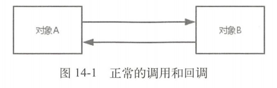

对象A调用类对象，对象B处理后将数据回调给对象A，接着来看采用Hook的调用流程，如图14-2所示。

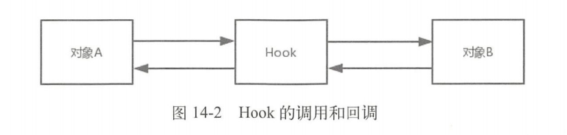

图14-2中的Hook可以是一个方法或者一个对象，它像一个钩子一样挂在对象A和对象B之间，当对象A调用对象B之前做一些处理（比如修改方法的参数和返回值），起到了“欺上瞒下”的作用，与其说Hook是钩子，不如说是劫持来的更贴切些。我们知道应用程序进程之间是彼此独立的，应用程序进程和系统进程之间也是如此，想要在应用程序进程更改系统进程的某些行为很难直接实现，有了Hook技术，我们就可以在进程间进行行为更改，如图14-3所示。

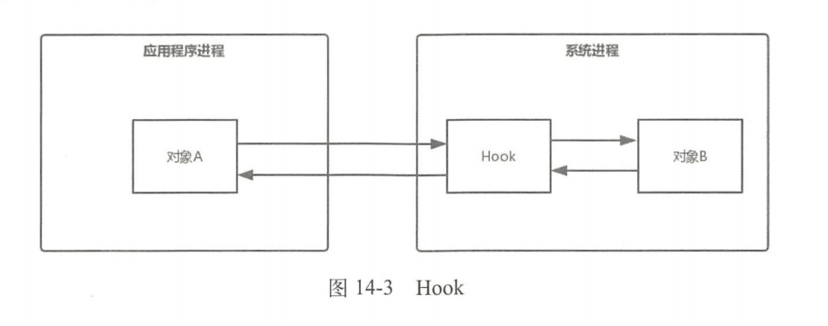

可以看到Hook可以将自己融入到它所要劫持的对象（对象B）所在的进程中，成为系统进程的一部分，这样我们就可以通过Hook来更改对象B的行为。被劫持的对象（对象B），称作Hook点，为了保证Hook的稳定性，Hook点一般选择容易找到并且不易变化的对象，静态变量和单例就符合这一条件。


### 14.2 Hook技术分类

Hook技术知识点比较多，Hook技术根据不同的角度有很多分类，这里介绍其中三种分类。

根据Hook的API语言划分，分为Hook Java和Hook Native。

+ Hook Java主要通过反射和代理来实现，应用于在SDK开发环境中修改Java代码。
+ Hook Native则应用于NDK开发环境和系统开发中修改Native代码。

根据Hook的进程划分，分为应用程序进程Hook和全局Hook。

+ 应用程序进程Hook只能Hook当前所在的应用程序进程。
+ 应用程序进程是Zygotefock出来的，如果对Zygote进行Hook，就可以实现Hook系统所有的应用程序进程，这就是全局Hook。

根据Hook的实现方式划分，分为如下两种。

+ 通过反射和代码实现，只能Hook当前的应用程序进程。
+ 通过Hook框架来实现，比如Xposed，可以实现全局Hook，但是需要root。

Hook Native、全局Hook和通过Hook框架实现这些分类和插件化技术关联不大，本章主要需要学习的HookJava，想要更好学习Hook Java，首先了解代理模式。


### 14.3 代理模式


### 14.4 Hook startActivity方法

我们知道Hook可以用来劫持对象，被劫持的对象叫做Hook点，用代理对象来替代Hook点，这样我们就可以在代理上实现自己想做的操作。这里以Hook常用startActivity方法来举例，startActivity方法分为两个，如下所示：

```java
startActivity(intent);
getApplicationContext().startActivity(intent);
```

第一个是Activity的startActivity方法，第二个是Context的startActivity方法，这两个方法的调用链是不同的，这里分开进行讲解。

#### 14.4.1 Hook Activity的startActivity方法

Activity的startActivity方法在4.1.1中提到过，代码如下：

frameworks/base/core/java/android/app/Activity.java

```java
@Override
public void startActivity(Intent intent,@Nullable Bundle options) {
    if (options!=null){
        startActivityForResult(intent,-1,options);
    } else {
        startActivityForResult(intent,-1);
    }
}
```

接着查看startActivityForResult方法，如下所示：

frameworks/base/core/java/android/app/Activity.java

```java
@Override
public void startActivityForResult(String who, Intent intent, int requestCode, @Nullable Bundle options) {
    Uri referrer = onProvideReferrer();
    if(referrer != null) {
        intent.putExtra(Intent.EXTRA_REFERRER,referrer);
    }
    options = transferSpringboardActivityOptions(options);
    Instrumentation.ActivityResult ar = mInstrumentation.execStartActivity(this,mMainThread,getApplicationThread(),mToken,who,intent,requestCode,options);//1
    if (ar != null) {
        mMainThread.sendActivityResult(mToken,who,requestCode,ar.getResultCode(),ar.getResultData());
    }
    cancelInputAndStartExitTransition(options);
}
```

在注释1处调用了mInstrumentation的execStartActivity方法来启动Activity，剩余的调用代码已经在4.1节介绍了，这里不在赘述。这个**mInstrumentation是Activity的成员变量**，**我们就选择Instrumentation为Hook点**，**用代理Instrumentation来替代原始的Instrumentation来完成Hook**。首先我们先写出代理Instrumentation类，如下所示：

InstrumentationProxy.java

```java
public class InstrumentationProxy extends Instrumentation {
    private static final String TAG = "InstrumentationProxy";
    Instrumentation mInstrumentation;
    public InstrumentationProxy(Instrumentation instrumentation) {
        mInstrumentation = instrumenation;
    }
    public ActivityResult execStartActivity(Context who, IBinder contextThread, IBinder token, Activity target, Intent intent, int requestCode, Bundle options) {
        Log.d(TAG, "Hook成功" + "---who:"+who);
        try {
            // 通过反射找到Instrumentation的execStartActivity方法
            Method execStartActivity = Instrumentation.class.getDeclaredMethod("execStartActivity",Context.class,IBinder.class,Activity.class,Intent.class,Bundle.class);
            return (ActivityResult) execStartActivity.invoke(mInstrumentation,who,contextThread,token,target,intent,requestCode,options);
        } catch (Exception e) {
            throw new RuntimeException(e);
        }
    }
}
```

InstrumentationProvy继承了Instrumentation，并包含Instrumentation的引用。InstrumentationProxy实现了execStartActivity方法，其内部会通过反射找到并调用Instrumentation的execStartActivity方法。接下来我们用InstrumentationProxy来替换Instrumentation，代码如下所示：

MainActivity.java

```java
public void replaceActivityInstrumentation(Activity activity) {
    try {
        //得到Activity的mInstrumentation字段
        Field field = Activity.class.getDeclaredField("mInstrumentation");//1
        //取消Java的权限控制检查
        field.setAccessible(true);//2
        Instrumentation instrumentation = (Instrumentation) field.get(activity);//3
        Instrumentation instrumentationProxy = new InstrumentationProxy(instrumentation);//4
        field.set(activity,instrumentationProxy);
    } catch (Exception e) {
        e.printStackTrace();
    }
}
```

在注释1处得到Activity的成员变量mInstrumentation，这个成员变量是私有的，因此在注释2处**取消Java的权限控制检查**，这样就可以**访问mInstrumentation字段**。在注释3处得到Activity中的Instrumentation对象，在注释4处创建InstrumentationProxy并传入注释3处得到的Instrumentation对象，最后**用InstrumentationProxy来替换Instrumentation（通过反射）**，这样就实现了代理Instrumentation替换Instrumentation的目的。最后在MainActivity的onCreate方法中使用replaceActivityInstrumentation方法，如下所示：

MainActivity.java

```java
public class MainActivity extends Activity {
    @Override
    protected void onCreate(Bundle savedInstanceState) {
        super.onCreate(savedInstanceState);
        setContentView(R.layout.activity_mian);
        replaceActivityInstrumentation(this);
        Intent intent = new Intent(Intent.ACTION_VIEW);
        intent.setData(Uri.parse("http://liuwangshu.cn"));
        startActivity(intent);
    }
    ···
}
```

在onCreate方法中访问了liuwangshu独立博客，打印的Log如下：

```
D/InstrumentationProxy: Hook成功---who:com.example.liuwangshu.hookinstrumentation.MainActivity@47fcd35
```


#### 14.4.2 Hook Context的startActivity方法

在第5章讲过，Context的实现类为ContextImpl，ContextImpl的startActivity方法如下所示：

frameworks/base/core/java/android/app/ContextImpl.java

```java
@Override
public void startActivity(Intent intent, Bundle options) {
    warnIfCallingFromSystemProcess();
    if((intent.getFlags()&Intent.FLAG_ACTIVITY_NEW_TASK)==0 
       && options != null && ActivityOptions.fromBundle(options).getLaunchTaskId() == -1) {
        throw new AndroidRuntimeException("Calling startActivity() from outside of an Activity "+ "context requires the FLAG_ACTIVITY_NEW_TASK flag."+ "Is this really what you want?");
    }
    mMainThread.getInstrumentation().execStartActivity(getOuterContext(),mMainThread.getApplicationThread(),null,(Activity) null, intent,-1,options);
}
```

最后一行调用了ActivityThread的getInstrumentation方法获取Instrumentation。**ActivityThread是主线程的管理类**，**Instrumentation是ActivityThread的成员变量**，**一个进程中只有一个ActivityThread，因此仍旧选择Instrumentation作为Hook点**，用代理Instrumentation来替换Instrumentation。代理Instrumentation和14.3.1节给出的InstrumentationProxy代码是一样的，接下来我们用InstrumentationProxy来替换Instrumentation，代码如下所示：

MainActivity.java

```java
public void replaceContextInstrumentation() {
    try {
        //获取ActivityThread类
        Class<?> activityThreadClazz = Clazz.forName("android.app.ActivityThread");
        Field activityThreadField = activityThreadClazz.getDeclaredField("sCurrentActivityThread");//1
        activityThreadField.setAccessible(true);
        Object currentActivityThread = activityThreadField.get(null);//2
        //获取ActivityThread中的mInstrumentation字段
        Field mInstrumentationField = activityThreadClazz.getDeclaredField("mInstrumentation");
        mInstrumentationField.setAccessible(true);
        Instrumentation mInstrumentation = (Instrumentation) mInstrumentation;
        Field.get(currentActivityThread);
        Instrumentation mInstrumentationProxy = new InstrumentationProxy(mInstrumentation);//3
        mInstrumentation.set(currentActivityThread, mInstrumentationProxy);
    } catch (Exception e) {
        e.printStackTrace();
    }
}
```

首先我们**通过反射获取ActivityThread类**，**ActivityThread类中有一个静态变量`sCurrentActivityThread`**，**用于表示当前的ActivityThread对象**，因此在注释1处获取ActivityThread中定义的sCurrentActivityThread字段，在注释2处获取Field类型的activityThreadField对象的值，这个值就是sCurrentActivityThread对象。同理获取当前ActivityThread的mInstrumentation对象。在注释3处创建InstrumentationProxy并传入此前得到的mInstrumentation对象，最后用InstrumentationProxy来替换mInstrumentation。在MainActivity中使用replaceContextInstrumentation方法，如下所示：

MainActivity.java

```java
public class MainActivity extends Activity {
    @Override
    protected void onCreate(Bundle savedInstanceState) {
        super.onCreate(savedInstanceState);
        setContextView(R.layout.activity_main);
        replaceContextInstrumentation();
        Intent intent = new Intent(Intent.ACTION_VIEW);
        intent.setData(Uri.parse("http://liuwangshu.cn"));
        intent.addFlags(Intent.FLAG_ACTIVITY_NEW_TASK);
        getApplicationContext().startActivity(intent);
    }
}
```

在onCreate方法中人就访问了liuwangshu的独立博客，打印的Log为：

```
D/InstrumentationProxy: Hook成功---who:android.app.Applicayion@2f21e30
```


#### 14.4.3 Hook startActivity总结

Hook Context的startActivity方法和Hook Activity的startActivity方法最大的区别就是替换的Instrumentation不同，前者是ActivityThread中的Instrumentation，后者是Activity中的Instrumentation。另外有一点需要注意的是，这里举的例子都是MainActivity的onCreate方法中进行Instrumentation替换的，这里未必是最佳的替换时间点，只是为了方便举例。可以尝试在Activity的attachBaseContext方法中进行Instrumentation替换，因为这个方法要先于Activity的onCreate方法被调用。讲到这里，我们知道了如何使用代理来Hook startActivity方法，简单说就是找到Hook点，再用代理对象来替换Hook点。


### 14.5 本章小结

本章原本是下一章的内容，但是为了讲解得更清晰，所以单拿出来作为一章。本章简单地介绍了Hook技术概述、Hook技术分类和Hook startActivity方法，这些内容主要是为了下一章讲解插件化做铺垫，因此并没有讲解Hook技术的全部内容，想要更多地了解Hook技术请查阅相关专业书籍。


## 15 插件化原理

随着应用开发的规模和复杂度越来越高，插件化技术被广泛地应用在各个较大规模的应用开发中。插件化技术和热修复技术都属于动态加载技术，从普及率的角度来看，插件化技术没有热修复的普及率高，主要原因是占大多数的中小型应用很少也没有必要去采用插件化技术。虽然插件化技术普及率现在不算高，但是插件化的原理对于应用开发的技术提升有很大的帮助，可以使你更好地理解系统的源码，并将系统源码和应用开发相结合。插件化是一个很庞大的知识体系，用一章的内容只能介绍部分的插件化原理，本章更多的是起一个抛砖引玉的作用。在本书截稿之前，Android P preview 开始限制调用隐藏API，很快也出现了一些绕过限制的方案，但无论采用什么方案，插件化的基本原理还是需要去了解的。阅读本竟前请先阅读开头列出的关联章节，以达到最好的阅读理解效果。

### 15.1 动态加载技术

在讲插件化原理之前，需要先了解它的前身：动态加载技术。动态加载技术不知应用在Android开发领域，在很多开发领域都应用过，这里我们讨论的只是动态加载技术在Android开发领域的应用。在Android传统开发中，一旦应用的代码被打包成APL并被上传到各个渠道市场，我们就不能修改应用的源码了，只能通过服务器来控制应用中预留的分支代码。但是很多时候我们无法提前预知需求和突然发生的情况，也就不能在应用代码中预留分支代码，这时就需要采用动态加载技术。在应用程序运行时，动态加载一些程序中原本不存在的可执行文件并运行这些文件里的代码逻辑。可执行文件总的来说分为两种，一种是动态链接库so，另一种是dex相关文件（dex以及包含dex的jar/apk文件）。看到这里很多读者可能发现了，在第13章我们讲解热修复原理时也提到了上述的可执行文件的加载，这时因为热修复技术本身就是动态加载技术流派派生出来的。随着应用开发技术和业务的逐步发展，动态加载技术派生出两个技术，分别是热修复技术和插件化技术，如图15-1所示。

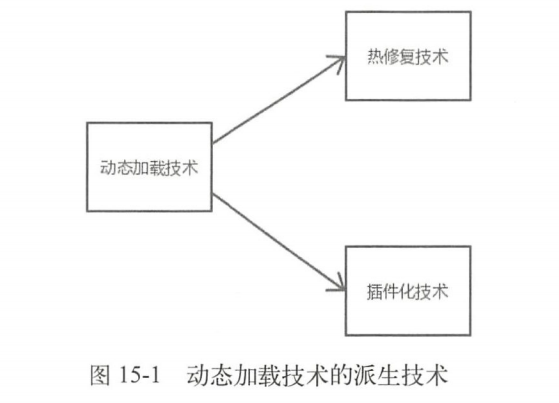

其中热修复技术主要用来修复Bug，插件化技术则主要用于解决应用越来越庞大以及功能模块的解耦，围绕着两个技术出现了很多的热修复框架和插件化框架，在第13章我们了解了很多热修复框架，这一章我们将了解一些插件化框架。需要注意的是，动态加载技术本身并没有被官方认可，而且是一个非常规的技术，在国外这门技术关注度并不高，它的产生更多的是国内的业务需求和产品的驱动。


### 15.2 插件化的产生

在讲解插件化原理之前，我们十分有必要了解插件化是如何产生的。

#### 15.2.1 应用开发的痛点和瓶颈

在Android开发早期很少用到动态加载技术，因为这个时候业务需求和应用开发的复杂度都不是很高，但随着互联网的极速发展，会出现一下几种情况。

**1.业务复杂，模块耦合**

随着业务越来越复杂也越来越多，导致应用程序体积越来越大，应用程序的工程和功能模块数量越来越多，一个应用可能是由几十、几百人协同开发的，很多工程和功能模块都是由一个小组进行开发维护的，如果功能模块间的耦合度比较高，修改一个功能模块会影响其他功能模块，势必会极大地增加沟通成本。

**2.应用间的接入**

一个应用不再是单独的应用，它可能需要接入其他的应用。拿手机淘宝来说，它的流量非常大，其他他的淘宝应用或者业务比如：聚划算、淘宝书城、飞猪旅游、淘宝拍卖、淘宝外卖等都希望接入到淘宝客户端，这样既能获取到流量，同时也可以将用户引流到自己的应用中，如果使用常规的技术手段，会产生两个问题。

+ 比如淘宝外卖需要接入到淘宝客户端，那么淘宝外卖团队可能需要维护两个版本，一个自身版本，另一个是淘宝客户端版本，这样维护成本和沟通成本会比较高。况且淘宝外卖不只是接入淘宝客户端，它还可以接入到其他应用中，比如支付宝应用，那么淘宝外卖团队维护的就不仅仅是两个版本了。
+ 比如淘宝客户端接入了很多其他的应用，势必会使应用的体积急剧变大，编译时间会变得非常长，一个Bug和功能就会由组内的开发协作变为了组合组之间甚至部门间的开发协作，极大地增加了开发测试成本和沟通成本，新功能的添加牵扯得越多，版本发布的时间变得越不可控。

**3.65536限制，内存占用大**

在13.4.1节中我们知道了65536限制，随着应用的代码量不断增大，引入的苦也越来越多，特别是应用需要接入其他应用，那么方法书很容易超过65536个。应用代码量的增加同时也导致了应用占用大量的内存。

#### 15.2.2 插件化思想

Android系统本身并没有提供太多的功能，内置的应用数量和整体功能也很有限，它像是一个为人类服务的机器人，只能满足人类基本的需求。初始的机器人只有照相、地图、浏览器、计算机等功能，这显然是有些乏味的，我们可以给这个机器人安装很多其他的应用，使它提供更多的功能。

我们给这个机器人安装了很多应用，这些应用不仅覆盖了人的衣食住行，还提供了娱乐功能，我们可以玩游戏、听音乐和购物等，机器人的功能也得到了极大提升，能够为人类提供更多的服务。这些安装的应用可以理解为插件，这些插件可以自由地进行插拔，比如我们需要玩游戏时可以安装“王者荣耀”，如果不好玩就把它卸载掉。这么说来其实Android、iOS、Mac 等操作系统采用的都是这种思想，也就是插件化思想。

#### 15.2.3 插件化定义

15.2.1节所提出的问题就可以用插件化的思想来解决，如果没有采用插件化，那么手机淘宝客户端的框架可以缩略地理解为如图15-4所示的样子。

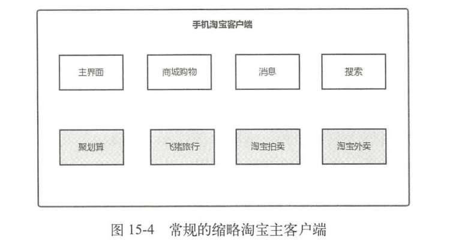

图15-4中采用常规技术的淘宝客户端会分为两大部分，一个是自身的业务模块，比如商城购物、消息和搜索等，另一个是要外接的其他的应用业务，比如聚划算、飞猪履行和淘宝外卖等。如果采用这种常规的技术方案，那么有会产生15.2.1节中提出的各种问题，为了解决这些问题，我们可以采用插件化思想来对淘宝主客户端进行改造，如图15-5所示。

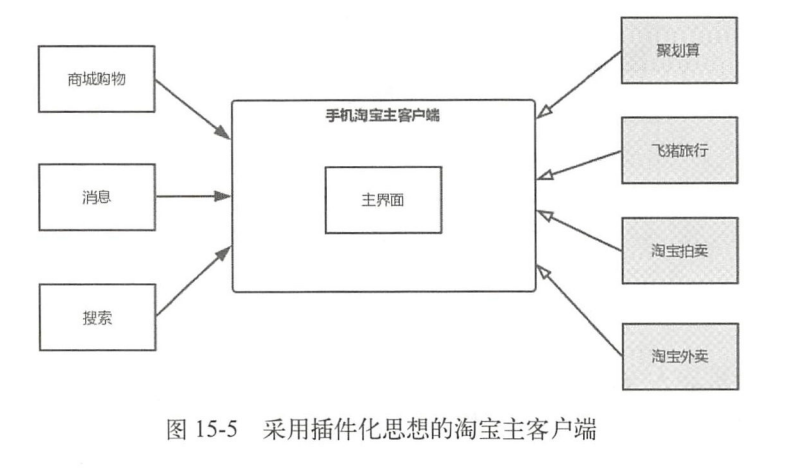

插件化的客户端由宿主和插件两个部分组成，宿主是指先被安装到手机中的APK，就是平常我们加载的普通APK。插件一般是指经过处理的APK、so和dex等文件，插件可以被宿主进行加载，有的插件也可以作为APK独立运行。可以看出曾云插件化的淘宝客户端，其内部包含了主界面模块；另一部分是插件部分，不仅包括了外接的其他应用业务，比如聚划算和飞猪旅行，同时也包括了淘宝自身的业务模块，比如消息和搜索。需要注意的是，这里的举例更多是为了便于理解，只是淘宝客户端演进过程中的一个非常缩略的框架，和真实的淘宝客户端由非常大的区别。讲到这里就可以引入插件化的定义：将一个应用按照插件的方式进行改造的过程就叫作插件化。采用了插件化的淘宝主客户端就避免了15.2.1节提出的各种问题，在协作方面插件可以由一个人或者一个小组来进行开发，这样各个插件之间，以及插件和宿主之间的耦合度会降低。应用间的接入和维护也变得便捷，每个应用团队只需要负责自己的那一部分就可以了。应用以及主dex的体积也会相应变小，间接地避免了65536限制。第一次加载到内存的只有淘宝主客户端，当使用到其他其他插件时才会加载相应插件到内存，这样就减少了内存的占用。


### 15.3 插件化框架对比

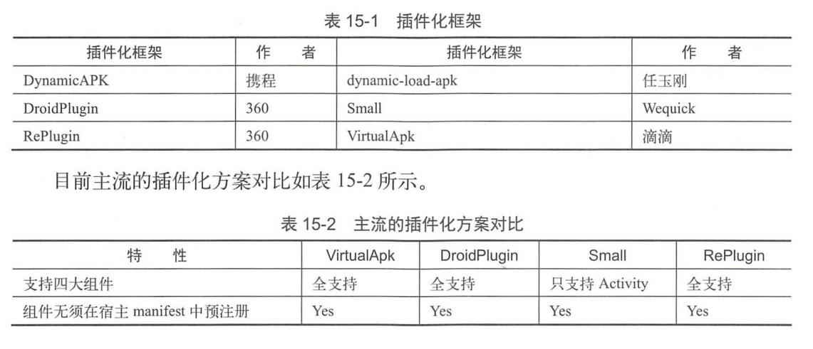


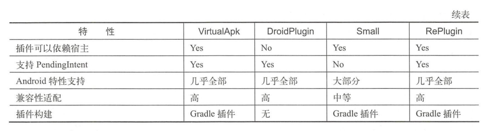

如果加载的插件不需要和宿主有任何耦合，也无须和宿主进行通信，比如加载第三方App，那么推荐RePlugin，其他的情况推荐使用VirtualApk。由于VirtualApk在加载耦合插件方面是插件化框架的首选，具有普遍适用性，本章会结合VirtualApk来讲解插件化的原理。首先编写简单的例子实现Activity、Service插件化，起一个知识储备和过度的作用，然后在广播、ContentProvider、资源和so插件化中讲解VirtualApl是如何实现的，这样更有助于理解插件化的原理。

### 15.4 Activity插件化

四大组件的插件化是插件化的核心知识点，而Activity插件化更是重中之重，Activity插件化主要是3种实现方式，分别是**反射实现**，**接口实现**和**Hook技术实现**。反射实现会对性能有所影响，主流的插件化框架没有采用此方式，关于接口实现可以阅读dynamic-load-apk的源码，这里不做介绍，目前**Hook技术实现是主流**，因此本章主要介绍Hook技术实现。

Hook技术实现主要有两种解决方案，一种是通过Hook IActivityManager来实现，另一种是Hook Instrumentation实现。在讲到这两个解决方案前，我们需要从整体上了解Activity的启动流程。

#### 15.4.1 Activity的启动过程回顾

Activity的启动过程主要分为两种，一种是根Activity的启动过程，另一种是普通Activity的启动过程。关于根Activity的启动过程在4.1节介绍过，这里简单回顾一下，如图15-6所示。

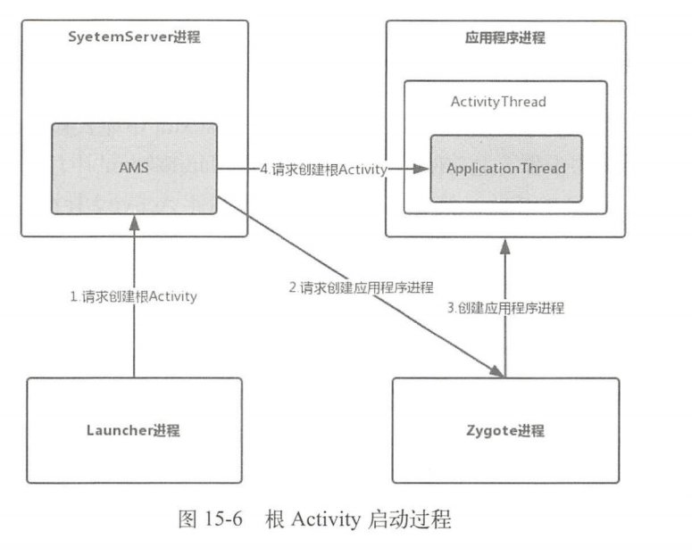

首先Launcher进程向AMS请求创建根Activity，AMS会判断根Activity所需的应用程序进程是否存在并启动，如果不存在就会请求Zygote进程创建应用程序进程。应用程序进程启动后，AMS会请求应用程序进程创建并启动根Activity。普通Activity和根Activity的启动过程大同小异，但是没有这么复杂，因为不涉及应用程序进程的创建，与Launcher也没关系，如图15-7所示。

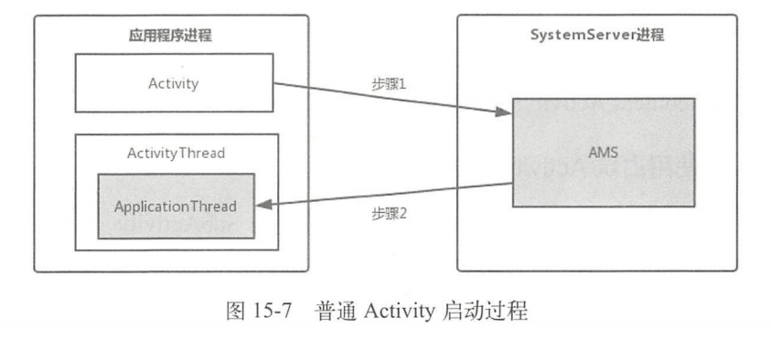

图15-7抽象地给出了普通Activity的启动过程。在应用程序进程中的Activity向AMS请求创建普通Activity（步骤1），AMS会对这个Activity的生命周期和栈进行管理，校验Activity等，关于栈管理请查看6.5节。如果Activity满足AMS的校验，AMS就会请求应用程序进程中的ActivityThread去创建并启动普通Activity（步骤2）。

#### 15.4.2 HookIActivityManager方案实现

AMS存在于SystemServer进程中，我们无法直接修改，只能在应用程序进程中做文章。可以采用预先占坑的方式来解决没有在AndroidManifest.xml中显示声明的问题，具体做法就是在图15-7所示的步骤1之前**使用一个在AndroidManifest.xml中注册的Activity来进行占坑，用来通过AMS的校验**。接着在步骤2之后**用插件Activity替换占坑的Activity**，接下来根据这个解决方案我们来实践一下。

##### 15.4.2.1 注册Activity进行占坑

为了更好地讲解启动插件Activity的原理，这里省略了插件Activity的加载逻辑，直接创建一个TargetActivity来代表已经加载进来的插件Activity，接着我们在创建一个SubActivity用来占坑。在AndroidManifest.xml中注册SubActivity用来占坑。在AndroidManifest.xml中注册SubActivity，如下所示：

AndroidManifest.xml

```xml
<?xml version="1.0" encoding="utf-8"?>
<manifest xmlns:android="http://schemas.android.com/apk/res/android"
          package="com.example.liuwangshu.pluginactivity">
    <application
        ···
        <activity android:name=".StubActivity"/>
    </application>
</manifest>
```

TargetActivity用来代表已经加载进来的插件Activity，因此不需要在AndroidManifest.xml中进行注册。如果我们直接在MainActivity中启动TargetActivity肯定会报错（android.content.ActivityNotFoundException异常）。

##### 15.4.2.2 使用占坑Activity通过AMS验证

为了防止报错，**需要将启动的TargetActivity替换为SubActivity**，用SubActivity来通过AMS的验证。在第6章中讲过Android 8.0与Android 7.0的AMS家族有一些差别，主要是Android 8.0去掉了AMS的代理ActivityManagerProxy，代替它的是IActivityManager，直接采用AIDL来进行进程间通信。**Android7.0**的Activity的启动会调用`ActivityManagerNative`的`getDefault`方法，如下所示：

frameworks/base/core/java/android/app/ActivityManagerNative.java

```java
static public IActivityManager getDefault() {
    return gDefault.get();
}
private static final Singleton<IActivityManager> gDefault = new Singleton<IActivityManager>() {
    protected IActivityManager create() {
        IBinder b = ServiceManager.getService("activity");
        if (false) {
            Log.v("ActivityManager","default service binder ="+b);
        }
        IActivityManager am = asInterface(b);
        if (false) {
            Log.v("ActivityManager","defaultservice = " + am);
        }
        return am;
    }
}
```

getDefault方法返回了IActivityManager类型的对象，**IActivityManager借助了Singleton类来实现单例**，而且**gDefault又是静态的**，因此IActivityManager是一个比较好的Hook点。**Android 8.0**的Activity的启动会调用`ActivityManager`的`getService`方法，如下所示：

frameworks/base/core/java/android/app/ActivityManager.java

```java
public static IActivityManager getService() {
    return IActivityManagerSingleton.get();
}

private static final Singleton<IActivityManager> IActivityManagerSingleton = new Singleton<IActivityManager>() {
    @Override
    protected IActivityManager create() {
        final IBinder b = ServiceManager.getService(Context.ACTIVITY_SERVICE);
        final IActivityManager am = IActivityManager.Stub.asInterface(b);
        return am;
    }
};
```

同样地，getService方法返回了IActivityManager类型的对象，并且IActivityManager借助了Singleton类来实现单例，再结合图6-1和6-3，确定了无论是Android7.0还是Android8.0，**IActivityManager都是比较好的Hook点**。Singleton类如下所示，后面会用到：

frameworks/base/core/java/android/util/Singleton.java

```java
public abstract class Singleton<T> {
    private T instance;
    protect abstract T create();
    public final T get() {
        synchronized (this) {
            if (mInstance == null) {
                mInstance = create();
            }
            return mInstance;
        }
    }
}
```

由于Hook需要多次对字段进行反射操作，先写一个字段工具类FieldUtil：

FieldUtil.java

```java
public class FieldUtil {
    public static Object getField(Class clazz, Object target, String name) throwsException {
        Field field=clazz.getDeclaredField(name);//获取字段属性
        field.setAccessible(true);
        return field.get(target);//get()获取字段属性的值，target为实例
    }
    public static Field getField(Class clazz， String name) throws Exception {
        Field field = clazz.getDeclaredField(name);
        field.setAccessible(true);
        return field;
    }
    public static void setField(Class clazz, Object target, String name, Object value) throws Exception {
        Field field= clazz.getDeclaredField(name);
        field.setAccessible(true);
        field.set(target, value);//target为实例，value为字段设置的值
    }

```

其中setField方法不会马上用到，接着定义替换IActivityManager的代理类IActivityManagerProxy，如下所示：

```java
public class IActivityManagerProxy implements InvocationHandler {
    private Object mActivityManager;
    private static final String TAG = "IActivityManagerProxy";
    public IActivityManagerProxy(Object activityManager) {
        this.mActivityManager = activityManager;
    }
    @Override
    public Object invoke(Object o, Method method, Objectp[] args) throw Throwable {
        if ("startActivity".equals(method.getName())) {//1       
            Intent intent = null;
            int index = 0;
            for (int i = 0; i<args.length; i++) {
                if (args[i] instanceof Intent) {
                    index = i;
                    break;
                }
            }
            intent = (Intent) args[index];
            Intent subIntent = new Intent();//2
            String packageName = "com.example.liuwangshu.pluginactivity";
            subIntent.setClassName(packageName,packageName+".StubActivity");//3
            subIntent.putExtra(HookHelper.TARGET_INTENT,intent);//4
            args[index] = subIntent;//5
        }
        return method.invoke(mActivityManager, args);
    }
}
```

Hook点IActivityManager是一个接口，建议采用动态代理。在注释1处**拦截startActivity方法，接着获取参数args中第一个Intent对象，它原本要启动插件TargetActivity的Intent**。在注释2、注释3处新建一个`subIntent`用来启动StubActivity，在注释4处**将这个TargetActivity的Intent保存到`subIntent`中**，便于以后还原TargetActivity。在注释5处**用subIntent赋值给参数args**，这样**启动的目标就变为了StubActivity，用来通过AMS的校验**。最后用代理类IActivityManagerProxy来替换IActivityManager，如下所示：

HookHelper.java

```java
public class HookHelper {
    public static final String TARGET INTENT = "target intent";
    public static void hookAMS() throws Exception {
        Object defaultSingleton=null;
        if (Build.VERSION.SDK INT >= 26) {//1
            Class<?> activityManageClazz = Class,forName("android.app,ActivityManager");
            //获取 activityManager 中的 IActivityManagerSingleton 字段
            defaultSingleton= FieldUtil.getField(activityManageClazz, null,"IActivityManagerSingleton");
        } else {
            Class<?> activityManagerNativeClazz = Class.forName("android.app.ActivityManagerNative");
            //获取 ActivityManagerNative 中的 gDefault 字段
            defaultSingleton = FieldUtil.getField(activityManagerNativeClazz,null,"gDefault");
        }
        Class<?> singletonClazz = Class.forName("android.util.Singleton");
        Field mInstanceField= Fieldutil.getField(singletonClazz ,"mInstance");//2
        //获取 iActivityManager
        Object iActivityManager = mInstanceField.get(defaultSingleton);//3
        Class<?> iActivityManagerClazz = Class,forName("android.app,IActivityManager");
        Object proxy = Proxy.newProxyInstance(Thread.currentThread().getContextClassLoader(),new Class<?>[] iActivityManagerClazz},new IActivityManagerProxy (iActivityManager));
        mInstanceField.set(defaultSingleton,proxy);
    }
}
```

首先在注释1处对系统版本进行区分，最终获取的**是 Singleton\<IActivityManager\>类型的IActivityManagerSingleton 或者 gDefault字段**。在注释2处获取 Singleton类中的mInstance字段，从前面 Singleton 类的代码可以得知 mInstance 字段的类型为 T，在注释3处得到IActivityManagerSingleton 或者 gDefault 字段中的T的类型，T的类型为IActivityManager。最后动态**创建代理类IActivityManagerProxy，用 IActivityManagerProxy 来替换IActivityManager（通过反射）**。自定义一个 Application，在其中调用 HookHelper 的 `hookAMS` 方法，如下所示：

MyApplication.java

```java
public class MyApplication extends Application {
    @Override
    public void attachBaseContext(Context base) {
        super.attachBaseContext(base);
        try {
            HookHelper.hookAMS();
        } catch (Exception e) {
            e.printStackTrace();
        }
    }
}
```

在MainActivity中启动TargetActivity，如下所示：

MainActivity.java

```java
public class MainActivity extends Activity {
    private Button bt_hook;
    @Override
    protected void onCreate(Bundle savedInstanceState) {
        super.onCreate(savedInstanceState);
        setContentView(R.layout.activity_main);
        bt_hook = (Button) this.findViewById(R.id.bt_hook);
        bt_hook.setOnClickListener(new View.OnClickListener() {
            @Override
            public void onClick(View view) {
                Intent intent = new Intent(MainActivity.this, TargetActivity.class);
                startActivity(intent);
            }
        });
    }
}
```

点击Button时，启动的并不是TargetActivity而是SubActivity，同时Log中打印了"hook成功"，说明我们已经成功用SubActivity通过了AMS的校验。

##### 15.4.2.3 还原插件Activity

前面用占坑Activity通过了AMS的校验，但是我们要启动的是插件TargetActivity，**还需要用插件TargetActivity来替换占坑的SubActivity**，这一替换的时机就在图15-7所示的步骤2之后。在4.1.3节中讲到了ActivityThread启动Activity的过程，如图15-8所示。

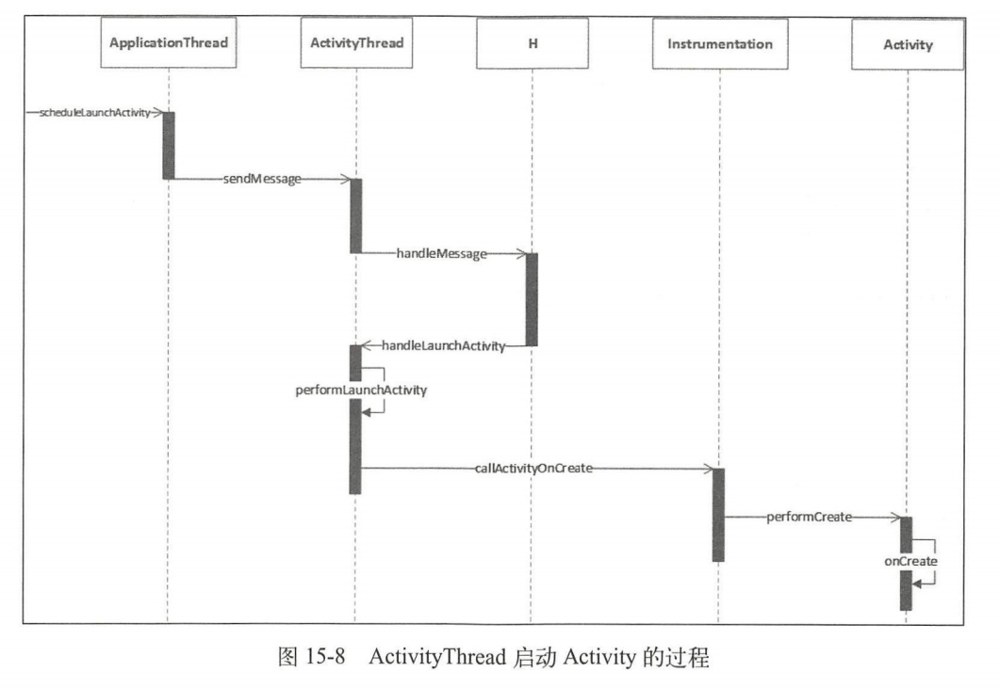

ActivityThread会通过H类将代码的逻辑切换到主线程中，H类是ActivityThread的内部类并继承自Handler，如下所示：

frameworks/base/core/java/android/app/ActivityThread.java

```java
private class H extends Handler {
    public static final int LAUNCH ACTIVITY=100;
    public static final int PAUSE ACTIVITY = 101;
    ···
	public void handleMessage(Message msg) {
        if (DEBUG MESSAGES) Slg.V(TAG,">>> handling:" + codeToString(msq.what));
        switch (msq.what) {
            case LAUNCH ACTIVITY: {
                Trace.traceBegin(Trace.TRACE TAG ACTIVITY MANAGER，"activityStart");
                final ActivityClientRecord r = (ActivityClientRecord) msq.obi;
                r.packageInfo = getPackageInfoNoCheck(r.activityInfo.applicationInfo, r.compatInfo);
                handleLaunchActivity(r,null,"LAUNCH ACTIVITY");
                Trace.traceEnd(Trace.TRACE TAG ACTIVITY MANAGER);
            } break;
            ···
        }
···
}
```

H类中重写的handleMessage方法会对LAUNCH_ACTIVITY类型的消息进行处理，最终会调用Activity的onCreate方法。那么在哪进行替换呢？接着来看Handler的dispatchMessage方法：

frameworks/base/core/java/android/os/Handler.java

```java
public void dispatchMessage(Message msg) {
    if (msg.callback!= null) {
        handleCallback(msg);
    } else {
        if (mCallback!=null) {
            if(mCallback.handleMessage(msg)) {
                return;
            }
        }
        handleMessage(msg);
    }
}
```

Handler的dispatchMessage用于处理消息，看到如果Handler的Callback类型的mCallback不为null，就会执行mCallback的handleMessage方法。因此，**mCallback可以作为Hook点**，我们可以用自定义的Callback来替换mCallback，自定义的Callback如下所示：

HCallback.java

```java
public class HCalback implements Handler.Callback{
    public static final int LAUNCH ACTIVITY=100;
    Handler mHandler;
    public HCallback(Handler handler) {
        mHandler=handler;
    }
    @Override
    public boolean handleMessage(Message msg) {
        if (msg.what == LAUNCH ACTIVITY) {
            Object r=msg.obi;
            try {
                //得到消息中的Intent(启动 SubActivity的 Intent)
                Intent intent = (Intent) FieldUtil.getField(r.getClass()，r，"intent");
                //得到此前保存起来的Intent(启动TargetActivity的Intent)
                Intent target = intent.getParcelableExtra(HookHelper.TARGET_INTENT);
                //将启动SubActivity的Intent替换为启动TargetActivity的Intent
                intent.setComponent(target.getComponent());
            } catch (Exception e) {
                e.printStackTrace();
            }
        }
        mHandler.handleMessage(msg);
        return true;
    }
}       
```

HCallback实现了Handler.Callback，并重写了handleMessage方法，当收到消息的类型为LAUNCH_ACTIVITY时，将启动SubActivity的Intent替换为启动TargetActivity的Intent。接着我们在HookHelper中定义一个`hookHandler`方法，如下所示：

HookHelper.java

```java
public static void hookHandler() throws Exception {
    Class<?> activityThreadClass = Class.forName("android.app,ActivityThread");
    Object currentActivityThread= FieldUtil.getField(activityThreadClass ,null,"sCurrentActivityThread");//1
    Field mHField= FieldUtil.getField(activityThread,"mH");//2
    Handler mH= (Handler) mHField.get(currentActivityThread);//3
    FieldUtil.setField(Handler.class,mH,"mCallback",new HCallback(mH));
}
```

ActivityThread类中有一个**静态变量`sCurrentActivityThread`**，用于**表示当前的ActivityThread对象**，因此在注释1处获取ActivityThread定义的sCurrentActivityThread对象。注释2处获取ActivityThread类的`mH`字段，接着在注释3处获取当前ActivityThread对象中的mH对象，最后用HCallback来替换mH中的mCallback。在MyApplication的attachBaseContext方法中调用HookHelper的hookHandler方法，运行程序，当我们单击“启动插件”按钮时，发现启动的插件TargetActivity。

##### 15.4.2.4 插件Activity的生命周期

插件TargetActivity确实启动了，但是它有生命周期吗？这里从源码角度来进行分析，Activity的finish方法可以出发Activity生命周期变化，和Activity的启动过程类似，finish方法如下所示：

frameworks/base/core/java/android/app/Activity.java

```java
public void finish() {
    finish(DONT_FINISH_TASK_WITH_ACTIVITY);
}
private void finsh(int finishTask) {
    if (mParent == null) {
        int resultCode;
        Intent resultData;
        synchronized(this) {
            resultCode = mResultCode;
            resultData = mResultData;
        }
        if (false) Log.v(TAG,"Finishing self: token= " + mToken);
        try {
            if (resultData != null) {
                resultData.prepareToLeaveProcess(this);
            }
            if (ActivityManager.getService().finishActivity(mToken,resultCode,resultData,finishTask)) {//1
                mFinished = true;
            }
        } catch (RemoteException e) {
            // Empty
        }
    } else {
        mParent.finishFromChild(this);
    }
}
```

finish方法的调用链和Activity的启动过程是类似的，在注释1处调用AMS的finishActivity方法，接着是AMS通过ApplicationThread调用ActivityThread，ActivityThread向H类发送DESTROY_ACTIVITY类型的消息，H类接收到这个消息会执行handleDestroyActivity方法，handleDestroyActivity方法又调用了performDestroyActivity方法，如下所示：

frameworks/base/core/java/android/app/ActivityThread.java

```java
private ActivityClientRecord performDestroyActivity(IBindertoken,booleanfinishing，int configChanges，boolean getNonConfigInstance) {
    ActivityClientRecord r = mActivities.get(token);//1
    try {
        r.activity.mCalled = false;
        mInstrumentation.callActivityOnDestroy(r.activity);//2
        ..
    } catch (SuperNotCalledException e)  {
        ...
    }
    mActivities.remove(token);
    StrictMode.decrementExpectedActivityCount(activityClass);
    return r;
```

在注释1处通过IBinder类型的token来获取ActivityClientRecord，ActivityClientRecord用于描述应用进程中的Activity。在注释2处调用Instrumentation的callActivityOnDestroy方法来调用Activity的OnDestroy方法，并传入了r.activity。前面的例子我们用SubActivity替换了TargetActivity通过了AMS的校验，这样AMS只知道SubActivity的存在，那么AMS是如何能控制TargetActivity生命周期的回调的呢？我们接着往下看，启动Activity时会调用ActivityThread的performLaunchActivity方法，如下所示：

frameworks/base/core/java/android/app/ActivityThread.java

```java
private Activity performlaunchActivity(ActivityClientRecord r, Intent customIntent) {
    ···
    java.lang.ClassLoader cl = appContext.getClassLoader();
    activity = mInstrumentation.newActivity(cl，component.getClassName()，r.intent);//1
    ···
    activity.attach(appContext, this，getInstrumentation()，r,token,r.ident,app， r.intent，r.activityInfo, title，r.parent， r,embeddedID,r.lastNonConfiquration Instances， config, r.referrer,r.voiceInteractor, window，r.configCallback);
    mActivities.put(r.token,r);//2
    ···
    return activity;
}
```

在注释1处根据Activity的类名用ClassLoader加载Activity，接着调用Activity的attach方法，将r.token赋值给Activity的成员变量mToken。在注释2处将ActivityClientRecord根据r.token保存在mActivities中（mActivities类型为ArrayMap\<IBinder,ActivityClientRecord\>），再结合Activity的finish方法的注释1处，可以得出结论：AMS和ActivityThread之间的通信采用了token来对Activity进行标识，并且此后的Activity的生命周期处理也是根据token来对Activity进行标识的。回到这个例子来，我们在Activity启动时用插件TargetActivity替换占坑SubActivity，这一过程在performLaunchActivity方法调用之前，因此注释2处的r.token指向的是TargetActivity，在performDestroyActivity的注释1处获取的就是代表TargetActivity的ActivityClientRecord，可见TargetActivity是具有生命周期的。