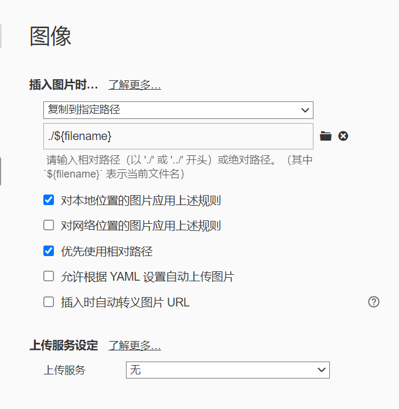
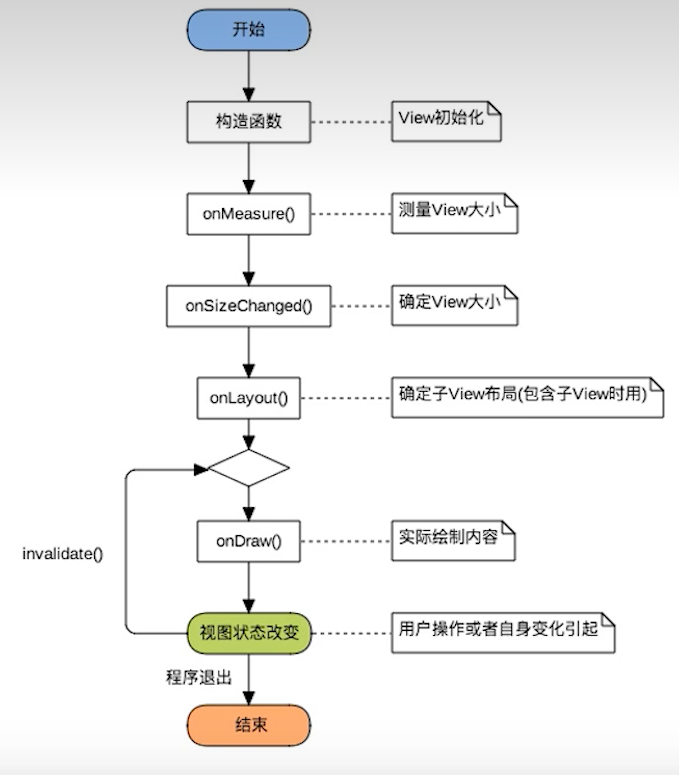
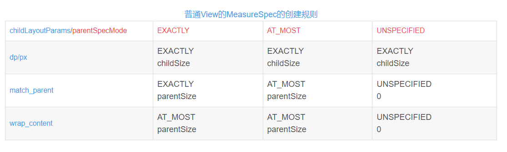
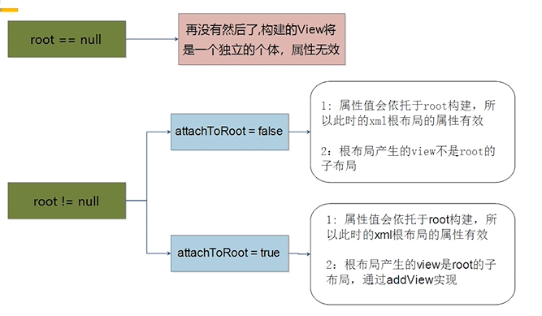
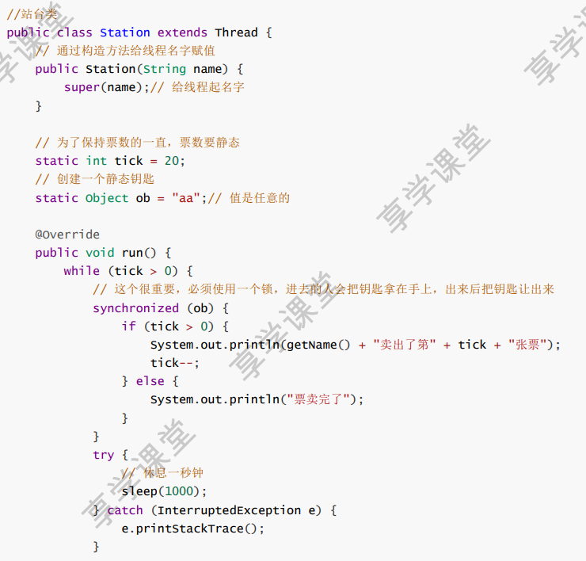
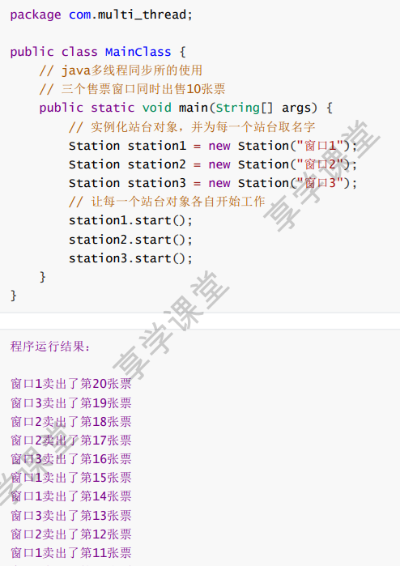
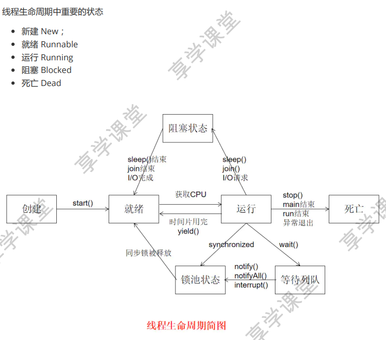

[TOC]


# 2023-5-15

## Typora

### 插入图片

复制到指定路径



## 安卓

### 约束布局

#### 12个约束（略）

```java
app:layout_constraintBaseline_toBaselineof="parent"
```


#### 约束布局的辅助控件（Guideline、Barrier）

Guideline

```java
orientation
layout_constraintGuide_begin	xxdp
layout_constraintGuide_end		xxdp
layout_constraintGuide_percent	百分比布局
```

Barrier

```java
app:barrierDirection="end"
app:constraint_referenced_ids="username1,password1"
```


#### 偏移bias

```java
app:layout_constaintHorizontal_bias="0.5"
```

> 注：锚点相同bias无效，如start和end约束到同一位置


#### Group

```java
app:constraint_referenced_ids="tv1,tv4,tv5"
```

解决嵌套问题

统一管理几个控件，显示、隐藏


#### margin

某个方向的margin加了约束才起作用

当约束的控件不可见时设置一个margin
```java
android:goneMarginLeft="10dp"
```


#### 约束布局 当成线性布局

链 均匀分布

链首部有一个`layout_constrainHorizontal_chainStyle`

`spread`：均匀分布，默认值
`spread_inside`：两端对齐
`packed`：合在一块

`layout_constraintHorizontal_weight`设置权重


#### 角度布局


#### 约束布局 当成表格布局

Flow


#### 设置宽高比

`app:layout_constraintDimensionRatio="16:9"`


#### 其他

width="wrap_content"时超出约束长度加强制约束`layout_constraintWidth="true"`。

width=0dp时有个`layout_constraintWidth_default`属性
默认值为`spread`，会使`maxWidth`无效，使用`app:layout_constraintWidth_max`
`wrap`和wrap_content一个效果，超出和加强制约束效果一样

可以做到左边文本控件过长时不会挤压到右边控件


ConstraintHelper	1.x	guidline group barrier placeHolder
									2.x	自定义辅助控件


# 2023/5/16

## 安卓

### Room数据库迁移（Migration）

[CSDN——Room数据库的迁移](https://blog.csdn.net/u013762572/article/details/106315045)

#### Room 都干了些啥

Room 提供了一个抽象层来来缓解 SQLite 的迁移，展现形式是以 `Migration` 类 来实现的。Migration 类定义了从指定版本迁移到另外一个版本的动作。Room 使用了它自己的 SQLiteOpenHelper 的实现，在 onUpgrade 方法中，将会触发你定义的迁移动作。
这里展示了当第一次进入数据将会发生的事情：

1. Room 数据将会被建立
2. SQLiteOpenHelper.onUpgrade 被调用，Room触发迁移动作
3. 数据库被打开

如果你没有提供迁移策略，但是你却增加了数据库版本，你的app可能会被崩溃或者你的数据将会被丢失，至于产生的结果，基于我们将会谈到的情形。

在迁移中，一个很重要的点就是 `identity hash String`. Room 就是通过唯一这个 `identity String` 区分数据库的版本。当前的数据库中有个 `configuration table` 保存了 identity String. 如果不要太惊讶你查看数据库时会有一张 `room_maste_table` 表。


#### 使用

+ 版本更新`version=2`
+ 提供迁移策略databaseBuilder.addMigrations(MIGRATION_1_2)，如果使用.fallbackToDestructiveMigration则表示破坏性迁移，清空数据。定义Migration类变量MIGRATION_1_2重写migrate()
+ 


### RecyclerView

#### LinearlayManager

getChildCount返回的是当前可见范围内一共有几个子View，

getItemCount返回当前RecyclerView一共会有多少个子View。


# 2023/5/17

## 安卓

### 下拉刷新、上拉加载

下拉刷新上拉加载封装布局[supereasyrefreshlayout](https://github.com/guozhengXia/SuperEasyRefreshLayout)

### AsyncTask

[Thread与AsyncTask](https://www.cnblogs.com/BobGo/p/5598270.html)

异步任务

必须要明白的一点是，Thread是Java语言下的一个底层类，而Android是使用并封装了Java语言的系统，所以Android中的AsyncTask只是使用了Java的多线程概念并优化封装之后的一个抽象类。所以Thread和AsyncTask完全是两个不同层次的概念，而不是简单的替换。

AsyncTask是作为异步任务，执行除了UI界面更新的任务之外的其他耗时操作的。UI界面的更新是在主线程，也就是UI线程中执行的，而在这个异步任务中，开启了一个工作线程来执行耗时操作。而这个工作线程和UI线程的执行顺序是不同步的，也就是说只有执行完工作线程中的下载之后，才会调用UI线程中的onPostExecute()执行后续UI操作，这样就实现了异步下载。如果UI线程销毁之后工作线程再发送下载结束的信息，由于工作线程再使用过程中是与AsyncTask绑定的，所以他也会随着当前AsyncTask的销毁而销毁，不会执行后续的下载操作，自然也不会执行发送下载结束的信息。

```
Android异步网络请求可以使用AsyncTask类来实现，AsyncTask是Android提供的一个用于处理异步任务的工具类，它使用三个泛型参数Params、Progress和Result来指定任务的输入、进度和结果类型。

使用AsyncTask实现异步网络请求的步骤如下：

1. 创建一个AsyncTask子类，指定三个泛型参数，其中Params参数指定发起网络请求时所需要的参数类型，Progress参数指定进度更新时的参数类型，Result参数指定返回结果的参数类型。

2. 在AsyncTask子类中实现doInBackground方法，在此方法中完成网络请求任务。

3. 在doInBackground方法中调用publishProgress方法更新任务的进度，该方法会触发onProgressUpdate回调方法，在onProgressUpdate方法中更新UI界面显示任务的进度。

4. 在doInBackground方法执行完成后，会将执行的结果作为参数传递给onPostExecute方法，在onPostExecute方法中更新UI界面显示任务的执行结果。

5. 在需要发起网络请求时，创建AsyncTask子类的实例，并调用execute方法来执行任务。
```

每个Task的doInBackground都是顺序执行的，**由此可以证明，在Android Q上，AsyncTask默认是串行执行异步任务的。**


# 2023/5/18

## 安卓

### 自定义View

[自定义View](https://www.bilibili.com/video/BV1Wh411f7ud/?p=3&spm_id_from=pageDriver&vd_source=bf286743c0f79ff4e4df2222645065d3)

分类

+ 自定义View，没有现成的View需要自己实现，一般继承自View，SurfaceView或其他View

+ 自定义ViewGroup，利用现有组件根据特定布局方式组成新的组件，大多继承自ViewGroup或各种Layout


绘制流程

onMeasure()→onLayout()→onDraw()



自定义View主要实现onMeasure和onDraw

自定义ViewGroup主要实现onMeasure和onLayout


自定义view三个构造函数
//上下文
//反射（xml中使用）
//主题style（白天/黑夜模式）


LayoutParams是ViewGroup中的类
有两个参数int width，int height，对应xml中layout_width和layout_height
两个值MATCH_PARENT：-1，WRAP_CONTENT：-2

 

MeasureSpec是View中内部类，二进制计算，由于int32位，高两位表示mode，低30位表示size，MODE_SHIFT = 30作用是移位

> UNSPECIFIED（00）：不对View大小做限制
> EXACTLY（01）：确切的大小，如100dp
> AT_MOST（10）：大小不可超过某数值，如matchParent




onMeasure 用来计算精准的数值

performTraversals


### 自定义View Layout内部布局

[Android自定义View之Layout内部布局自定义](https://blog.csdn.net/weixin_51065489/article/details/126465781)

onMeasure()的重写

+ 调用每个子View的measure()，让子View自我测量
+ 根据子View的尺寸得出子View的位置，并保存它们的位置
+ 根据子View的位置和尺寸计算出自己的尺寸，并用setMeasuredDimension()保存


LayoutInflater.inflate()用于解析xml文件

```java
public View inflate(XmlPullParse parser, ViewGroup root, boolean attachToRoot) {
    ···
    //如果root为null就不解析
    if(root!=null) {
        params.root.generateLayoutParams(attrs);
        if(!attachToRoot) {
            temp.setLayoutParams(params);
        }
    }
    
    ···
}

```




### @SuppressLint

抑制警告


# 2023/5/19

## Java

### 正则表达式

https://www.runoob.com/java/java-regular-expressions.html

java.util.regex主要包括三个类

+ Pattern类
+ Matcher类
+ PatternSyntaxException

```java
/** 判断content是否包含pattern */
boolean isMatch = Pattern.matches(pattern,content);
```

#### 捕获组

捕获组是把多个字符当一个单独单元进行处理的方法，它通过对括号内的字符分组来创建。

例如，正则表达式 (dog) 创建了单一分组，组里包含"d"，"o"，和"g"。

捕获组是通过从左至右计算其开括号来编号。例如，在表达式（（A）（B（C））），有四个这样的组：

- ((A)(B(C)))
- (A)
- (B(C))
- (C)

可以通过调用 matcher 对象的 groupCount 方法来查看表达式有多少个分组。groupCount 方法返回一个 int 值，表示matcher对象当前有多个捕获组。

还有一个特殊的组（group(0)），它总是代表整个表达式。该组不包括在 groupCount 的返回值中。

```java
/** 按指定模式在字符串查找 */
//创建Pattern对象
Pattern r = Pattern.compile(pattern);
//创建matcher对象
Matcher m = r.mathcer(line);
if (m.find()) {
    System.out.println(m.group(0));
    m.group(1);
    ···
}
```

#### Matcher类方法

**查找**

**public boolean find()**
尝试查找与该模式匹配的输入序列的下一个子序列。（跳过已查找的）

**public boolean lookingAt()**

 尝试将从区域开头开始的输入序列与该模式匹配。

**索引**

**public int start()**
返回以前匹配的初始索引。可选参数int group（指定捕获组）

**public int end()** 

返回最后匹配字符之后的偏移量。可选参数int group（指定捕获组）

**替换**

**public String replaceAll(String replacement)**
 替换模式与给定替换字符串相匹配的输入序列的每个子序列。


邮箱的正则

String regex = "[a-zA-Z0-9_]+@[a-zA-Z0-9_]+\\.[a-z]{3,5}";


### View的滑动

**MotionEvent**提供的方法，onTouchEvent(MotionEvent event)

提供了很多事件常量，ACTION_DOWN，ACTION_UP，ACTION_MOVE


获取手指触摸点的横坐标和纵坐标
计算移动的距离
调用layout方法来重新放置它的位置
layout(getLeft()+offsetX，getTop()+offsetY，getRight+offsetX，getBottom+offsetY);

这两种方法和layout()方法效果差不多

offsetLeftAndRight(offsetX)和offsetTopAndBottom(offsetY)


**LayoutParams**

LayoutParams保存了一个View的布局参数

setLayoutParams(layoutParams)方法改变View位置


**scrollTo与scrollBy**

scrollTo(x，y)表示移动到一个具体的坐标点，而scrollBy(dx，dy)则表示移动的增量为dx、dy。其中，scollBy最终也是要调用scollTo的。

scrollBy方法偏移量设置负值，因为移动的是手机屏幕


### [RecylcerView 适配器的dataList直接赋值问题](https://blog.csdn.net/u010074743/article/details/78658772)

使用***addAll()***代替直接赋值！！！

[List.addAll()和=赋值的区别](https://blog.csdn.net/weixin_30549657/article/details/96732348)


# 2023/5/21

## 安卓

[关于Room数据库，拼写模糊查找语句遇到的问题](https://blog.csdn.net/xianrenli38/article/details/109291450)

字符串拼接不用+，用||


### 快捷键

快捷解决办法`alt+enter`

快捷重写方法`ctrl+o`


### Toast使用

```cpp
错误的写法：toast.setText("");   //android 4.2及以上系统会报错
正确的写法：Toast mToast = Toast.makeText(context, msg, Toast.LENGTH_LONG);
```


# 2023/5/24

## 安卓

### WebView简单使用（主线程中）

### Jsoup简单使用（子线程中）

JSoup 并不支持XPath，而是使用自己的选择器语法。

您可以尝试使用 JSoup 的选择器来获取您要的元素。例如，如果要获取 `<a>` 标签元素的链接，可以使用如下的代码：

```java
 String url = "https://www.example.com";
        String cssQuery = "div:nth-child(5) > div:nth-child(2) > div:nth-child(1) > div:nth-child(1) > div:nth-child(2) > div > a";

        try {
            Document doc = Jsoup.connect(url).get();
            Element link = doc.select(cssQuery).first();

            if (link != null) {
                System.out.println(link.attr("href"));
            } else {
                System.out.println("Link not found");
            }
        } catch (IOException e) {
            e.printStackTrace();
        }
```

这段代码将使用CSS选择器语法来匹配您的XPath表达式，以便更好地解析文档。请注意，在此示例中，我们使用了 `first()` 方法来获取第一个匹配到的元素，因为在CSS选择器中，我们只需要的是单个链接。如果您需要多个元素，请使用 `select()` 方法来选择多个匹配的元素。

#### 非UI线程更新UI

```java
public class MainActivity extends AppCompatActivity {
    private TextView mTextView;

    @Override
    protected void onCreate(Bundle savedInstanceState) {
        super.onCreate(savedInstanceState);
        setContentView(R.layout.activity_main);

        mTextView = (TextView) findViewById(R.id.textview);

        // 在新线程中更新 TextView 内容（错误示范）
        new Thread(new Runnable() {
            @Override
            public void run() {
                // 这里的代码将触发 CalledFromWrongThreadException 错误
                mTextView.setText("Hello, world!");
            }
        }).start();

        // 在 UI 线程中更新 TextView 内容
        runOnUiThread(new Runnable() {
            @Override
            public void run() {
                mTextView.setText("Hello, world!");
            }
        });
    }
}
```

在这个示例中，我们在新线程中尝试更新 TextView 的文本内容，这将触发错误。然后，我们使用 `runOnUiThread()` 方法在 UI 线程中更新 TextView 的文本内容。

请注意，在调用 `runOnUiThread()` 方法时，应该将需要更新 UI 组件的代码放到 `run()` 方法中。所有 UI 更新逻辑都应该在这个方法中执行。


# 2023/5/29

## Java

### HashMap，SparseArray

数据结构：hashmap用的链表；sparsearray用的双数组

hashmap默认16个长度，自动装箱。如果key是int的话，hashmap要先封装成Integer

sparseArray的话会直接转成int。所以sparseArray用的限制是key是int。数据量小于1k。大于1000可以用Arraymap

#### HashMap基本原理

16的数组存储数据，数组每个元素是一个链表的头结点。所以准确来说HashMap内部存储结构是使用哈希表的拉链结构（数组+链表）。

默认容量为16，不断向HashMap里put数据时，当达到一定容量限制是，HashMap就会自动扩容。

#### SparseArray基本原理

比HashMap更省内存，避免对key自动装箱，通过两个数组一个存放key，另一个存储value，优化性能采取压缩方式来表示稀疏数组的数据，节省内存空间。

存储和查找数据，使用二分查找法，比HashMap快得多，HashMap遍历Entry[]数组


### Equals、==、hashCode()

[知乎](https://zhuanlan.zhihu.com/p/548962621)

### Integer和int （==号比较）

1）Integer是对象的引用，new两个相同value的integer变量其指向不同地址，引用数据类型比较实际上是比较地址，会返回false

2）非new生成的Integer变量指向的是java常量池中的对象（-128到127，不在这个范围的话会new），而new Integer()生成的变量指向堆中新建的对象，两者在内存中的地址不同

```java
public static Integer valueOf(int i) {
    if (i >= IntegerCache.low && i <= IntegerCache.high)
        return IntegerCache.cache[i + (-IntegerCache.low)];
    return new Integer(i);
}
```


3）Integer变量（无论是否new生成）与int变量比较，只要两个变量值相等结果都为true，这涉及到自动拆箱的过程，此时就是两个数值的比较

> 自动拆箱：将包装类自动转换成对应的基本数据类型
>
> 自动装箱：将基本数据类型自动转换成对应的包装类

4）非new生成的Integer对象比较，如果两个变量的值在[-128,127]之间，比较结果为true，因为java在编译Integer i = 127;时，会翻译为Integer i = Integer.valueOf(127)，而java API中对Integer类型的valueOf的定义中，对于-128到127之间的数会进行缓存（默认缓存池 ）。


[深入理解原码反码补码](https://blog.csdn.net/anlian523/article/details/121412871)

简单判断跨越

- 已知`char`的bit长度为8bit，我们再假设一个新的数据类型为`halfchar`，其bit长度为4bit。
- 那么执行如下代码即可：

```c
char sum = 0; halfchar a; halfchar b;//假设a和b都已经有值了
sum += a;
sum += b;//此时sum的高4bit可能变成了0001，因为产生了一次跨越
sum = (sum>>4) + (sum&0xf);
```


一个方法的局部变量存储在栈中，方法执行是出栈和入栈的过程。

Integer对象存放在堆中


## 计网

### TCP四次挥手

**可能有些人会有疑惑：为什么中间的ACK和FIN不可以像三次握手那样合为一个报文段呢？**

在socket网络编程中，执行close()方法会触发内核发送FIN报文。什么时候调用close()方法，这是由**用户态**决定的，假如服务器仍有大量数据等待处理，那么服务器会等数据处理完后，才调用close()方法，这个时间可能会很久，而ACK报文则是由**系统内核**来完成的，这个过程会很快。所以中间的ACK和FIN不能合为一个包。


### UDP用户数据报协议

+ 无连接
+ 单播、多播、广播
+ 面向报文
+ 不可靠性，无拥塞控制易丢包，实时性
+ 头部开销小，传输高效


### TCP传输控制协议

+ 面向连接
+ 单播，点对点通信
+ 面向字节流
+ 可靠传输（判断丢包、误码靠段编号和确认号）
+ 拥塞控制
+ 全双工通信


### Http与Https

HTTP超文本传输协议，发布和接收HTML页面的方法，默认工作在TCP协议80端口，以明文方式发送内容，不提供任何方式数据加密

HTTPS超文本传输安全协议，经由HTTP通信，但利用SSL/TLS来加密数据包，默认工作在TCP协议443端口

HTTPS工作流程一般如以下方式 ：

+ 1、TCP 三次同步握手 
+ 2、客户端验证服务器数字证书 
+ 3、DH 算法协商对称加密算法的密钥、hash 算法的密钥 
+ 4、SSL 安全加密隧道协商完成 
+ 5、网页以加密的方式传输，用协商的对称加密算法和密钥加密，保证数据机密性；用协商的hash算法进行数据完整性保护，保证数据不被篡改。


### SSL/TLS

1. 如何保证公钥不被篡改？ 

   解决方法：将公钥放在数字证书中。只要证书是可信的，公钥就是可信的。 

2.  公钥加密计算量太大，如何减少耗用的时间？ 

   解决方法：每一次对话（session），客户端和服务器端都生成一个"对话密钥"（session key）， 用它来加密信息。由于"对话密钥"是对称加密，所以运算速度非常快，而服务器公钥只用于加密"对 话密钥"本身，这样就减少了加密运算的消耗时间。


因此，SSL/TLS协议的基本过程是这样的：

1. 客户端向服务器端索要并验证公钥。
2. 双方协商生成"对话密钥"。
3. 双方采用"对话密钥"进行加密通信 上面过程的前两步，又称为"握手阶段"（handshake）。


### GET和POST

HTTP请求的两种常用的基本方法

+ GET在浏览器回退时是无害的，而POST会再次提交请求
+ GET产生的url可以被bookmark，而POST不可以
+ GET请求会被浏览器主动cache，POST不会除非手动设置
+ GET请求只能进行url编码，POST支持多种编码方式
+ GET请求参数会被完整保留在浏览器历史记录里，POST中不会保留
+ GET请求在url中传送的参数有长度限制，POST没有
+ 对参数的数据类型，GET只接受ASCII字符，POST没有限制
+ GET比POST更不安全，因为参数直接暴露在URL上

站在TCP角度上看二者本质没有区别，都是TCP连接


### 断点续传原理

利用HTTP请求中Range字段

Range：bytes=x-

```java
HttpURLConnection httpConnection = (HttpURLConnection)url.openConnection();
httpConnection.setRequestProperty("RANGE","bytes=200");
```

Range表示需要服务器返回的文件字节数据从第x字节开始，指定需要传输的文件数据范围。

当需要对服务端传输的文件数据进行保存（下载）。在Java中也可以借助RandomAccessFile的seek方法访问记录并读取指定位置的数据。

```java
RandomAccess rafile = new RandomAccessFile("down.zip","rw");
// 定位文件指针到 200 位置
rafile.seek(200);
// 前200字节不改动，从200字节开始写入数据到文件
rafile.write(...)
```


### 下载文件的完整性

文件校验码（MD5,SHA1,CRC32）

以MD5为例，服务器响应数据中新增：md5字段

每个文件都可以用MD5验证程序算出一个固定的MD5码。当客户端下载了文件后，可以计算下载的文件的MD5码，和服务端响应的MD5码比较。如果计算出来的和服务端相应的不匹配，那么下载的APK文件不完整或是被别人动过手脚。


# 2023/5/30

## Java并发

### synchronized

原子性、可见性、有序性

+ 修饰方法：
  1. 实例方法，作用于当前实例加锁，进入方法前需要获取当前实例的锁
  2. 静态方法，作用于当前类对象加锁，进入方法前需要获取类对象的锁

+ 修饰代码块，指定加锁对象，对给定对象加锁，进入代码块前要获得给定对象的锁

使用synchronized修饰普通方法和静态方法，其实也等价于synchronizeid(this){}与synchronizeid(class){}


synchronized在JDK1.6之后的优化

monitorenter与monitorexit指令。这就代表了同步代码块的入口与 出口。 这里的monitor是：对象监视器。

jdk1.6以后为了减少获得锁和释放锁带来的性能消耗，对synchronized 锁进行了优化，包含偏向锁、轻量级锁、重量级锁


### Java对象头

对象在虚拟机内存中的布局分为三块区域：对象头、实例数据和对齐填充；Java对象头是实现synchronized的锁对象的基础，一般而言，synchronized使用的锁是存储在Java对象头里。

1. 偏向锁
   首先之所以会引入偏向锁是因为：大多数情况下锁不仅不存在多线程竞争，而且总是由同一线程多次获 得，为了让线程获得锁的代价更低而引入了偏向锁，减少不必要的操作
   程序进入同步代码块时，会访问Mark Word中偏向锁的标识是否设置成1，锁标志位是否为01，若为 偏向锁状态，则查看偏向锁状态下线程ID是否指向当前线程。如果是则直接执行同步代码。但是mark word中记录的线程ID如果不是当前线程，则通过CAS比较与交换尝试修改对象头获得锁。CAS操作成功 则可以直接执行同步代码，否则表示有其他线程竞争，此时获得偏向锁的线程被挂起，偏向锁升级为轻 量级锁 ，然后被阻塞的线程继续往下执行同步代码。
2. 轻量级锁
   否则说明锁对象被其他线程获 取，当前线程是竞争者，那么当前线程会自旋等待锁，也就是不断重试，当重试一定次数后，总不能一 直重试下去吧，太耗CPU了。所以这时候就要升级为重量级锁。

3. 重量级锁
   重量级锁就是通过对象监视器（monitor）实现，其中monitor的本质是依赖于底层操作系统的Mutex Lock实现，操作系统实现线程之间的切换需要从用户态到内核态的切换，切换成本非常高。主要是，当 系统检查到锁是重量级锁之后，会把等待想要获得锁的线程进行阻塞，被阻塞的线程不会消耗cpu。但 是阻塞或者唤醒一个线程时，都需要操作系统来帮忙，这就需要从用户态转换到内核态，而转换状态是 需要消耗很多时间的，有可能比用户执行代码的时间还要长。


### CAS无锁编程的原理

CAS（比较与交换，Compare and swap）

无锁算法，非阻塞同步

CAS机制当中使用了3个基本操作数：内存地址V，旧的预期值A，要修改的新值B。更新一个变量的时候，只有当变量的预期值A和内存地址V当中的实际值相同时，才会将内存地址V对应的值修改为B。

从思想上来说，Synchronized属于悲观锁，悲观地认为程序中的并发情况严重，所以严防死守。CAS属于乐观锁，乐观地认为程序中的并发情况不那么严重，所以让线程不断去尝试更新。

CAS缺点

+ ABA问题
+ 循环时间开销大
+ 只能保证一个共享变量的原子操作（JDK1.5开始提供了AtomicReference类来保证引用对象之间的原子性，可以吧多个变量放在一个对象里来进行CAS操作）


### AQS原理

AbstractQueuedSynchronizer，用于构建锁和同步器的框架，降低构建锁和同步器的工作量。

AQS核心思想是，如果被请求的共享资源空闲，那么就将当前请求资源的线程设置为有效的工作线程， 将共享资源设置为锁定状态；如果共享资源被占用，就需要一定的阻塞等待唤醒机制来保证锁分配。这个机制主要用的是CLH队列的变体实现的，将暂时获取不到锁的线程加入到队列中。

CLH队列


AQS支持独占锁（只能被一个线程获取）和共享锁（可以被多个线程同时获取）

> 无论是独占锁还是共享锁，本质上都是对AQS内部的一个变量state的获取。state是一个原子的int 变量，用来表示锁状态、资源数等。

同步队列的作用是：当线程获取资源失败之后，就进入同步队列的尾部保持自旋等待，不断判断自己是 否是链表的头节点，如果是头节点，就不断参试获取资源，获取成功后则退出同步队列。

条件队列是为Lock实现的一个基础同步器，并且一个线程可能会有多个条件队列，只有在使用了 Condition才会存在条件队列。


AQS中包含一个内部类:Node。该内部类是一个双向链表，保存前后节点，然后每个节点存储了当前的 状态waitStatus、当前线程thread。同步队列和条件队列都是由一个个Node组成的


### volatile和synchronized有什么区别

+ volatile只用作于变量，synchronized可以用于变量、方法、对象

+ volatile只保证可见性和有序性，无法保证原子性，synchronized可以保证线程间的有序性、原子性和可见性。
+ volatile线程不阻塞，synchronized线程阻塞
+ volatile 本质是告诉 jvm 当前变量在寄存器中的值是不安全的需要从内存中读取；sychronized 则 是锁定当前变量，只有当前线程可以访问到该变量其他线程被阻塞。
+ volatile标记的变量不会被编译器优化，synchronized标记的变量可以被编译器优化。


### ThreadLocal

ThreadLocal提供了线程本地变量，它可以保证访问到的变量属于当前线程，每个线程都保存有一个变 量副本，每个线程的变量都不同

```java
ThreadLocal<String> threadLocal = new ThreadLocal<>();
threadLocal.set("享学");
System.out.println("主线程获取变量："+threadLocal.get());
Thread thread = new Thread() {
    @Override
    public void run() {
        super.run();
        System.out.println("子线程获取变量："+ threadLocal.get());
        threadLocal.set("教育");
        System.out.println("子线程获取变量："+ threadLocal.get());
    }
};
```

在上述代码中，主线程输出：享学，子线程第一次输出：null，第二次输出教育。ThreadLocal相当于提供了一种线程隔离，将变量与线程相绑定。


### Java多线程对同一个对象进行操作

在多线程环境下，多个线程操作同一对象，本质上就是线程安全问题。因此为了应对线程安全需要对多 线程操作的对象加锁。

例如当我们遇到需求：实现三个窗口同时出售20张票。
程序分析： 1、票数要使用一个静态的值。 2、为保证不会出现卖出同一张票，要使用同步锁。 3、设计思路：创建一个站台类Station，继承Thread，重写run方法，在run方法内部执行售票操作。

售票要使用同步锁：即有一个站台卖这张票时，其他站台要等待这张票卖完才能继续卖票！






### 线程生命周期，线程可以多次调用start吗？会出现什么问题？为什么不能多次调用start？




Java线程是不允许启动多次的，第二次调用必然会抛出IllegalThreadStateException。 根据线程生命周 期可知，线程初始状态为NEW，此状态不能由其他状态转变而来。


#### 阻塞 Blocked 

阻塞状态是线程因为某种原因放弃CPU使用权，暂时停止运行。直到线程进入就绪状态，才有机会转到 运行状态。阻塞的情况大概三种： 

1. 等待阻塞：运行的线程执行wait()方法，JVM会把该线程放入等待池中。(wait会释放持有的锁)
2.  同步阻塞：运行的线程在获取对象的同步锁时，若该同步锁被别的线程占用，则JVM会把该线程放入 锁池中。 
3. 其他阻塞：运行的线程执行sleep()或join()方法，或者发出了I/O请求时，JVM会把该线程置为阻塞状 态。当sleep()状态超时、join()等待线程终止或者超时、或者I/O处理完毕时，线程重新转入就绪状态。 （注意,sleep是不会释放持有的锁）。

**线程睡眠：**Thread.sleep(long millis)方法，使线程转到阻塞状态。millis参数设定睡眠的时间，以毫秒 为单位。当睡眠结束后，就转为就绪（Runnable）状态。sleep()平台移植性好。 

**线程等待：**Object类中的wait()方法，导致当前的线程等待，直到其他线程调用此对象的 notify() 方法或 notifyAll() 唤醒方法。这个两个唤醒方法也是Object类中的方法，行为等价于调用 wait(0) 一样。唤醒线 程后，就转为就绪（Runnable）状态。 

> abc.wait() 是 Object 类中的一个方法，用于让当前线程暂停执行，进入等待状态，并且释放当前线程所持有的锁，直到其他线程调用该对象的 notify() 或 notifyAll() 方法才能唤醒它。

**线程让步：**Thread.yield() 方法，暂停当前正在执行的线程对象，把执行机会让给相同或者更高优先级的 线程。 

**线程加入：**join()方法，等待其他线程终止。在当前线程中调用另一个线程的join()方法，则当前线程转 入阻塞状态，直到另一个进程运行结束，当前线程再由阻塞转为就绪状态。 

**线程I/O：**线程执行某些IO操作，因为等待相关的资源而进入了阻塞状态。比如说监听system.in，但是 尚且没有收到键盘的输入，则进入阻塞状态。 

**线程唤醒：**Object类中的notify()方法，唤醒在此对象监视器上等待的单个线程。如果所有线程都在此对 象上等待，则会选择唤醒其中一个线程，选择是任意性的，并在对实现做出决定时发生。类似的方法还 有一个notifyAll()，唤醒在此对象监视器上等待的所有线程。


### 守护线程

在开发过程中，直接创建的普通线程为用户线程，而另一种线程，也就是守护线程，setDaemon(true)将一个普通用户线程设置为守护线程

一种支持型、服务型线程，主要被用作程序中后台调度以及支持性工作，跟上层业务逻辑基本不挂钩。Java中垃圾回收线程就是一个典型的Daemon线程。

其中需要注意的是设置为守护线程，必须在线 程启动start()方法之前设置，否则会抛出IllegalThreadStateException异常，意思就是运行中的线程不 能设置成守护线程的。

……

上面的日志来看，两个线程都只是输出了3次，然后就执行结束，这其实就是守护线程的特点，用一句话概括就是，当守护线程所守护的线程结束时，守护线程自身也会自动关闭。


守护线程不能持有任何需要关闭的资源，例如打开文件等，因为虚拟机退出时，守护线程没有任何机会来关闭文件，这会导致数据丢失。


#### 线程退出

stop()强制关闭线程，不建议使用

1. 使用标志位退出线程
   当run方法执行完后，线程就会退出。但有时run方法是永远不会结束的。如在服务端程序中使用线程进行监听客户端请求，或是其他的需要循环处理的任务。在这种情况下，一般是将这些任务放在一个循环中，如while循环。如果想让循环永远运行下去，可以使用while（true）{……}来处理。但要想使while循环在某一特定条件下退出，最直接的方法就是设一个boolean类型的标志，并通过设置这个标志为true或false来控制while循环是否退出。

2. 使用interrupt方法中断线程
   [java 带有循环以及等待的线程中断 interrupt()后的情况总结](https://blog.csdn.net/qq_35989000/article/details/124634682)

   + 线程处于阻塞状态，如使用了sleep,同步锁的wait,socket中的receiver,accept等方法时，会使线程处于阻塞状态。当调用线程的interrupt()方法时，会抛出InterruptException异常。阻塞中的那个方法抛出这个异常，通过代码捕获该异常，然后重新在catch代码块中将中断标志位置为true。通常很多人认为只要调用interrupt方法线程就会结束，实际上是错的， 一定要先捕获InterruptedException异常之后通过重新设置标志位跳出循环，才能正常结束run方法。

     > 为什么要区分进入阻塞状态和和非阻塞状态两种情况了，是因为当阻塞状态时，如果有interrupt()发生，系统除了会抛出InterruptedException异常外，还会调用interrupted()函数，调用时能获取到中断状态是true的状态，调用完之后会复位中断状态为false，所以异常抛出之后通过isInterrupted()是获取不到中断状态是true的状态，从而不能退出循环，需要在catch代码块interrupt()

     > **synchronized是不可中断锁**，即使isInterrupt为true，也无法终止。
     >
     > 解决的方法是***将锁改为Lock，并且使用lockInterruptibly()方法来上锁***。

   + 线程未处于阻塞状态，使用isInterrupted()判断线程的中断标志来退出循环。其他线程通过调用某个线程的interrupt()方法对其进行中断操作，中断标志就会置true，和使用自定义的标志来控制循环是一样的道理。

   > interrupt()：表示可以中断线程，实际上只是给线程设置一个中断标志，但是线程依旧会执行。
   >
   > interruped() ：检查中断状态，并清除中断状态，设置为false
   >
   > isInterrupted()：检查中断状态，不进行处理


### sleep 、wait、yield与join的区别，wait 的线程如何唤醒它？

sleep 、wait、yield与join的区别

sleep、yield与join是线程方法，而wait则是Object方法：

+ sleep ，释放cpu资源，不释放锁资源，如果线程进入sleep的话，释放cpu资源，如果外层包有 Synchronize，那么此锁并没有释放掉。
+ wait，释放cpu资源，也释放锁资源，一般用于锁机制中 肯定是要释放掉锁的，因为notify并不会 立即调起此线程，因此cpu是不会为其分配时间片的，也就是说wait 线程进入等待池，cpu不分时 间片给它，锁释放掉。
+ yield：让出CPU调度，Thread类的方法，类似sleep只是不能由用户指定暂停多长时间 ，并且 yield()方法只能让同优先级的线程有执行的机会。 yield()只是使当前线程重新回到可执行状态，所 以执行yield()的线程有可能在进入到可执行状态后马上又被执行。调用yield方法只是一个建议，告 诉线程调度器我的工作已经做的差不多了，可以让别的相同优先级的线程使用CPU了，没有任何机 制保证采纳。
+ join：一种特殊的wait，当前运行线程调用另一个线程的join方法，当前线程进入阻塞状态直到另 一个线程运行结束等待该线程终止。 注意该方法也需要捕捉异常。


## 安卓

### handler分析部分

子线程发送消息到主线程进行更新UI，除了handler和AsyncTask，还有什么？

android给我们提供了一些接口用于在异步线程中更新UI，比如 AsyncTask(),runOnUiThread(),View.post()方法等等,但是这些方法的底层都是调用handler来完成。具 体的细节如下：

方式一：子线程中runOnUiThread，其原理是Handler的post方法

```java
public final void runOnUiThread(Runnable action) {
    if (Thread.currentThread() != mUiThread) {
        mHandler.post(action);
    } else {
        action.run();
    }
}
```

方式二：用View.post()方法更新

```java
imageView.post(new Runnable(){
    @Override
    public void run(){
        // 更新UI
    }
});
```


# 2023/5/31

## Java并发

### sleep可中断么

可中断

```java
public static void sleep(long millis) throws InterruptedException {
	sleep(millis,0);
}
```


### 怎么保证线程按顺序执行，线程排队

Q：假设A、B两个线程，B线程在A线程执行完成之后执行

A：可以在启动B之前，调用A的join方法


Q：假设A，B两个线程，A线程分3步，需要A线程执行第二步之后继续执行B线程代码

A：在B中wait，A线程执行完第二步之后执行notify通知B线程继续执行。

```java
Object lock = new Object();

//线程A第二步之后加入
synchronized (lock) {
    lock.notify();
}

//线程B中加入
synchronized (lock) {
    lock.wait();
}

//注意先启动B，否则可能B在notify之后才wait
```


Q：假如有A、B、C三个线程，其中A、B线程执行分为三步，C线程需要在A线程执行完第二步之后执行一部分代码然后继续等待B线程执行完第二步时才能执行

A：借助CountDownLatch闭锁

```java
CountDownLatch countDownLatch = new CountDownLatch(2);

//线程A执行完第二步后加入
countDownLatch.countDown();

//线程B执行完第二步后加入
countDownLatch.countDown();

//线程C中加入
try {
    countDownLatch.await();
} catch (InterruptedException e) {
    e.printStackTrace();
}

//和题意有出入
```


### AsyncTask


弃用原因(学习RxJava、Kotlin)

- 不同版本AsyncTask的兼容问题；

- 吞掉了来自doInBackground的异常；

- 不能提供比直接使用Executor更多的功能；

- Thread和Handler的辅助类，并非线程框架，主要用于执行一些时间不太长的异步

  任务；

- 用法复杂，三个通用参数(Params、Progress、Result) + 四个回调方法；


## 安卓

### Android中操作多线程的方式

+ Thread、Runnable
+ HandlerThread
+ AsyncTask
+ Executor
+ IntentService


#### Thread与Runnable

一般跟Handler一起使用，用于线程通信，为了方便这种通信方式，就生成了一个HandlerThread类。

#### HandlerThread

一般用于Android中需要新建子线程进行多个任务处理，并且需要和主线程通信。后面要说的 IntentService 内部其实就是用了HandlerThread实现的。

```java
HandlerThread mHandlerThread=new HandlerThread("");
mHandlerThread.start();

Handler mHandler =new Handler(mHandlerThread.getLooper()){
    @Override
    public void handleMessage(@NonNull Message msg) {
        super.handleMessage(msg);
    }
};

mHandler.sendEmptyMessage(0);
```

#### AsyncTask

AsyncTask是轻量级的异步任务类，可以在线程池中执行后台任务，然后把执行的进度和最终结果传递给主线程用于更新UI。

```java
new AsyncTask<Void, Void, String>() {
    @Override
    protected void onPreExecute() {
        //请求接口之前，初始化操作
        super.onPreExecute();
    }
    
    @Override
    protected String doInBackground(Void... parameters) {
        //请求接口
        return "";
    }
    
    @Override
    protected void onProgressUpdate(Void... values) {
        //在主线程显示线程任务执行的进度
        super.onProgressUpdate(values);
    }
    
    @Override
    protected void onPostExecute(String responseString) {
        //接收线程任务执行结果
    }
}.execute();
```

#### Executor

Executor即线程池，可以管理多个线程并行执行，线程池的优点就在于可以线程复用，并且合理管理所 有线程。线程池具体使用与实现：


#### IntentService

IntentService是一个Service，自带工作线程，并且线程任务结束后自动销毁的一个类。IntentService其实封装了HandlerThread，同时又具备Service的特性。其中onHandlerIntent方法即为异步执行的方法。


### 判断当前线程是否是主线程

```java
Looper.getMainLooper() == Looper.myLooper();
Looper.getMainLooper().getThread() == Thread.currentThread();
Looper.getMainLooper().getThread().getId() == Thread.currentThread().getId();
```


#### 线程间通信

如果只是为了完成线程间**同步**，使用锁如synchronized即可；

如果需要完成线程之间的协作，也可以wait/notify、CountDownLatch或者Cyclicbarrier等方式；

Handler通信

