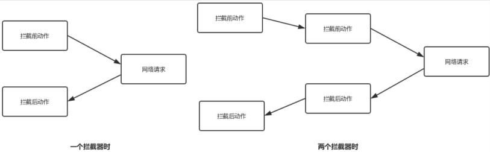
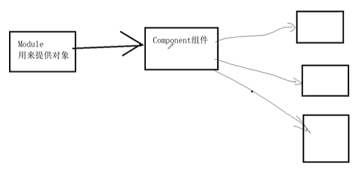

[TOC]


# 2023/6/1

## 安卓

封装里的函数

toString()：方便输出对象信息


### JSON

[Json字符串和对象（泛型）互转以及和XML区别](https://blog.csdn.net/u012060033/article/details/85999897)

#### JSON字符串

```java
// 将 Java 对象转换成 JSON 字符串        
User user = new User(1, "Tom", "123456", "tom@demo.com", "13800138000");        
String jsonString = JSONObject.toJSONString(user);
System.out.println(jsonString);//{"email":"tom@demo.com","id":1,"mobile":"13800138000","password":"123456","username":"Tom"}

// 将 JSON 字符串转换成 Java 对象
User user2 = JSON.parseObject(jsonString, User.class);
System.out.println(user2.getUsername()); // Tom
```

#### JSON对象

```java
// JSON 字符串
String jsonString = "{\"name\": \"Tom\", \"age\": 20}";

// 将 JSON 字符串解析成 JSON 对象
JSONObject json = JSONObject.fromObject(jsonString);
// 或者使用parseObject()-alibaba
JSONObject json = JSONObject.parseObject(jsonString);


// 从 JSON 对象中获取值
String name = json.getString("name");
int age = json.getInt("age");

System.out.println(name); // Tom
System.out.println(age);  // 20
```

#### JSON数组

```java
// 将 JSON 数组转换成 JSON 字符串
String jsonString = jsonArray.toString();
System.out.println(jsonString); // ["apple","banana","orange"]

// JSON 数组
String jsonString = "[\"apple\",\"banana\",\"orange\"]";

// 将 JSON 字符串解析成 JSON 数组
JSONArray jsonArray = JSONArray.fromObject(jsonString);

// 将 JSON 数组转换成 Java 数组
String[] fruits = new String[jsonArray.size()];
for (int i = 0; i < jsonArray.size(); i++) {
    fruits[i] = jsonArray.getString(i);
}

System.out.println(Arrays.toString(fruits)); // [apple, banana, orange]
```

HashMap转JSON

```java
JSONObject jsonObject = new JSONObject(map);
```


### GSON

String toJson(Object obj)

T fromJSON(String json,Type/Class type)


### 请求网络（URLConnection、OkHttp等）

Java 和 Android 都可以使用类似的方式来进行网络请求，包括使用原生的 URLConnection 或者第三方库（如 Apache 的 HttpClient、OkHttp、Retrofit 等）。

1. Android 中使用 HttpURLConnection 进行网络请求，它是 Android 对 Java 中 URLConnection 的封装，并能够支持在网络请求过程中更新 UI。HttpURLConnection 在 Android SDK 中提供了完整的 API，使用起来较为方便。
2. Android 中的网络请求必须放在独立的线程或者 AsyncTask 中进行，不能在主 UI 线程中执行，否则会抛出 NetworkOnMainThreadException 异常。这是因为 Android 系统默认禁止在主线程中执行网络请求，原因在于网络请求是一个比较耗时的操作，可能会阻塞主 UI 线程，导致应用程序变得非常卡顿，降低用户体验。所以 Android 中的网络请求通常都是在后台线程中执行的。
3. Android 11 以后，使用非加密的 HTTP 协议就会出现 Cleartext HTTP traffic to XXX not permitted 错误。需要将 HTTP 请求改为 HTTPS 或者设置网络安全配置文件支持 HTTP。而在 Java 中则没有这个限制。
4. Android 中的网络请求需要请求权限，即使是在 Android 10 以上的版本中，请求网络权限依然是必须的。而在 Java 中则不需要这个限制。
5. 在 Android 中使用 AsyncTask 进行网络请求的话，在 Android 11 以后，需要在 AsyncTask 的 doInBackground() 方法中使用 HttpURLConnection 或 OkHttp 进行网络请求。如果在 AsyncTask 中使用了 HttpClient，就会出现错误。因为 Android 11 已经禁止了 HttpClient。


## Java

### 接口和抽象类

继承接口implement

继承抽象类extends


### 实体类一定要用包装类型，不能使用基本类型

包装类型默认值为null，方便进行限制

基本类型默认值为0，容易产生bug


### 指令重排序

为了使处理器内部的运算单元能尽量被充分利用，处理器可能会对输入的代码进行乱序执行优化，处理器会在计算之后将乱序执行的结果重组。

使用volatile可以防止指令重排序，无法保证原子性，有可见性和有序性。

原子性指的是一个或者多个操作在 CPU 执行的过程中不被中断的特性。

***


### 时间类


### DO、BO、DTO、VO、PO


### 遍历Map的方法

1. forEach+Map.EntrySet

···

7. forEach+lambda

   ```java
   map.forEach(k,v) -> System.out.println(k+v));
   ```

   


## MySQL

count(*)、count(1)和count(列名)，谁的速度最快


### 三大范式

第一范式：每一列属性是不可分解的原子值

第二范式：第一范式基础上，消除非主属性对主属性的部分函数依赖

第三范式：第二范式基础上，消除了非主属性对主属性的传递函数依赖


### 树形结构存储

基于索引链的存储结构

添加字段Index_link、level，适用于查询多、结构变更少的数据库


# 2023/6/2

## MySQL

### 左连接中on和where


## 安卓

### 哪些情况子线程更新UI？

开启一个子线程并在该子线程的run方法中更新TextView文本控件，你会发现根本没有任何问题。如果你让子线程休眠2秒钟，程序直接挂掉了，log日志提示程序不允许在非UI线程中更新UI线程

```
android.view.ViewRootImpl$CalledFromWrongThreadException: Only the original thread that created a view hierarchy can touch its views.
```

为什么我们在不让子线程休眠的情况下去更新TextView文本可以，而让线程休眠两秒后就出抛异常呢？根本原因就是ViewRootImpl到底是在哪里被初始化的！ViewRootImpl是在onResume中初始化的，而我们开启的子线程是在onCreat方法中，这个时候程序没有去检测当前线程是不是主线程，所以没有抛异常！


### 接口进行数据更新

1. 定义一个接口：我们先定义一个接口，接口中包含一个方法用于更新数据，例如：

   ```java
   public interface OnDataChangeListener {
       void onDataChanged(List<String> newData);
   }
   ```

2. 在需要更新数据的类中声明该接口：例如我们在 `DataRepository` 类中声明该接口。

   ```java
   public class DataRepository {
       private OnDataChangeListener mOnDataChangeListener;
       
       public void setOnDataChangeListener(OnDataChangeListener listener) {
           mOnDataChangeListener = listener;
       }
   
       public void updateData(List<String> newData) {
           // 更新数据
           if (mOnDataChangeListener != null) {
               mOnDataChangeListener.onDataChanged(newData);
           }
       }
   }
   ```

3. 接口注册：在使用该类的时候，我们可以在调用 `DataRepository` 类的时候，注册该接口实例，例如：

   ```java
   DataRepository repository = new DataRepository();
   repository.setOnDataChangeListener(new OnDataChangeListener() {
       @Override
       public void onDataChanged(List<String> newData) {
           // 数据更新后的处理逻辑
       }
   });
   ```

这样，在 `updateData` 方法中，我们判断接口是否为 null，并调用其 `onDataChanged` 方法实现数据更新后通知调用者进行相应的处理。

在实际的开发中，我们还可以通过实现接口来自定义回调函数，实现数据更新后的 UI 刷新、网络请求等复杂业务的处理。

总的来说，利用接口更新数据的原理就是接口的多态和回调机制。通过在类中声明接口和注册接口实例，可以让不同的调用者实现不同的回调处理方法，实现灵活的数据更新和应用逻辑。


# 2023/6/5

## 安卓

### HttpURLConnection

#### HttpURLConnection相关说明

- HttpURLConnection对象不能直接构造，需要通过URL类中的openConnection()方法来获得。
- 对HttpURLConnection对象的配置都需要在connect()方法执行之前完成，因为connect()会根据HttpURLConnection对象的配置值生成HTTP头部信息。
- HttpURLConnection的connect()函数，实际上只是建立了一个与服务器的TCP连接，并没有实际发送HTTP请求。HTTP请求实际上直到我们获取服务器响应数据（如调用getInputStream()、getResponseCode()等方法）时才正式发送出去。
- HttpURLConnection是基于HTTP协议的，其底层通过socket通信实现。如果不设置超时（timeout），在网络异常的情况下，可能会导致程序僵死而不继续往下执行。
- HTTP正文的内容是通过OutputStream流写入的， 向流中写入的数据不会立即发送到网络，而是存在于内存缓冲区中，待流关闭时，根据写入的内容生成HTTP正文。
- 调用getInputStream()方法时，返回一个输入流，用于从中读取服务器对于HTTP请求的返回信息。
- 我们可以使用HttpURLConnection.connect()方法手动的发送一个HTTP请求，但是如果要获取HTTP响应的时候，请求就会自动的发起，比如我们使用HttpURLConnection.getInputStream()方法的时候，所以完全没有必要调用connect()方法。


#### Content-Type

[Content_Type详解](https://blog.csdn.net/qq_14869093/article/details/86307084?spm=1001.2101.3001.6650.3&utm_medium=distribute.pc_relevant.none-task-blog-2%7Edefault%7ECTRLIST%7ERate-3-86307084-blog-88224587.235%5Ev36%5Epc_relevant_default_base3&depth_1-utm_source=distribute.pc_relevant.none-task-blog-2%7Edefault%7ECTRLIST%7ERate-3-86307084-blog-88224587.235%5Ev36%5Epc_relevant_default_base3&utm_relevant_index=6)

在HTTP协议消息头中，使用Content-Type来表示请求和响应中的媒体类型信息。它用来告诉服务端如何处理请求的数据，以及告诉客户端（一般是浏览器）如何解析响应的数据，比如显示图片，解析并展示html等等。

**Content-Type的格式**：
Content-Type：type/subtype ;parameter

- type：主类型，任意的字符串，如text，如果是*号代表所有；
- subtype：子类型，任意的字符串，如html，如果是*号代表所有，用“/”与主类型隔开；
- parameter：可选参数，如charset，boundary等。

例如：
Content-Type: text/html;
Content-Type: application/json;charset:utf-8;


### 图片压缩

[Android图片压缩](https://www.jianshu.com/p/e10563e85ade?utm_campaign=maleskine&utm_content=note&utm_medium=seo_notes)

质量压缩：改变位深、透明度从而降低图片文件大小（存储大小），但没有改变长宽、单位像素所占字节数，所以加载bitmap的内存大小不变。

尺寸压缩：通过改变尺寸来改变像素，比如缩小4倍的话相邻4块红色的像素点变成1块红色像素点。


# 2023/6/6

## 安卓

### 图片内存

我们在电脑上看到的 png 格式或者 jpg 格式的图片，png(jpg) 只是这张图片的容器，它们是经过相对应的压缩算法将原图每个像素点信息转换用另一种数据格式表示，以此达到压缩目的，减少图片文件大小。

当我们通过代码，将这张图片加载进内存时，会先解析图片文件本身的数据格式，然后还原为位图，也就是 Bitmap 对象，Bitmap 的大小取决于像素点的数据格式以及分辨率两者了。所以，一张的图片文件的大小与文件格式（png 或者 jpg 格式），跟这张图片加载进内存所占用的大小完全是两回事。

一般的，计算一张图片占用的内存大小公式：分辨率 * 每个像素点的大小。


> 但是需要注意的是：使用 Android BitmapFactory 加载 Bitmap时，如果加载res目录下的图片，图片被 加载进内存时的分辨率会经过一层转换，所以，虽然最终图片大小的计算公式仍旧是分辨率*像素点大 小，但此时的分辨率已不是图片本身的分辨率了，系统会根据设备当前的 dpi 值以及资源目录所对应的 dpi 值，做一次分辨率转换，规则如下：
>
>  转换后高度 = 原图高度 * (设备的 dpi / 目录对应的 dpi )
>
>  转换后宽度 = 原图宽度 * (设备的 dpi / 目录对应的 dpi 


### Java内存分配


### HTTP

#### 请求行

请求行由请求方法、URL字段和HTTP协议的版本组成，格式如下： Method Request-URI HTTP-Version CRLF 其中 Method表示请求方法；Request-URI是一个统一资源标识符；HTTP-Version表示请求的HTTP协议 版本；CRLF表示回车和换行（除了作为结尾的CRLF外，不允许出现单独的CR或LF字符）。

HTTP请求方法有8种，分别是GET、POST、HEAD、PUT、DELETE、TRACE、CONNECT、 OPTIONS。对于移动开发最常用的就是GET和POST了。

+ GET：请求获取Request-URI所标识的资源。
+ POST：在Request-URI所标识的资源后附加新的数据。
+ HEAD：请求获取由Request-URI所标识的资源的响应消息报头。
+ PUT：请求服务器存储一个资源，并用Request-URI作为其标识。
+ DELETE：请求服务器删除Request-URI所标识的资源。
+ TRACE：请求服务器回送收到的请求信息，主要用于测试或诊断。
+ CONNECT：HTTP 1.1协议中预留给能够将连接改为管道方式的代理服务器。
+ OPTIONS：请求查询服务器的性能，或者查询与资源相关的选项和需求。


#### HTTP的消息报头

消息报头分为通用报头、请求报头、响应报头、实体报头等。

**实体报头**

实体报头用来定义被传送资源的信息，其既可用于请求也可用于响应。请求和响应消息都可以传送一 个实体。常见的实体报头如下所示。

+ Content-Type：发送给接收者的实体正文的媒体类型。
+ Content-Lenght：实体正文的长度。
+ Content-Language：描述资源所用的自然语言。
+ Content-Encoding：实体报头被用作媒体类型的修饰符。它的值指示了已经被应用到实体正文的附加 内容的编码，因而要获得Content-Type报头域中所引用的媒体类型，必须采用相应的解码机制。
+ Last-Modified：实体报头用于指示资源的最后修改日期和时间。
+ Expires：实体报头给出响应过期的日期和时间。


### OkHttp

#### 使用流程


使用OkHttp发起一次请求时，对于使用者最少存在 OkHttpClient 、 Request 与 Call 三个角色。其中 OkHttpClient 和 Request 的创建可以使用它为我们提供的 Builder （建造者模式）。而 Call 则是把 Request 交给 OkHttpClient 之后返回的一个已准备好执行的请求。

> 建造者模式：将一个复杂的构建与其表示相分离，使得同样的构建过程可以创建不同的表示。实例化OKHttpClient和Request的时候，因为有太多的属性需要设置，而且开发者的需求组合千变万化，使用建造者模式可以让用户不需要关心这个类的内部细节，配置好后，建造者会帮助我们按部就班的初始化表示对象

OkHttpClient 中全是一些配置，比如代理的配置、ssl证书的配置等。而 Call 本身是一个接口，我们获得的实现为: RealCall

```java
@Override
public Call newCall(Request request) {
    return new RealCall(this,request);
}
```

```java
static RealCall newRealCall(OkHttpClient client, Request originalRequest,
boolean forWebSocket) {
    // Safely publish the Call instance to the EventListener.
    RealCall call = new RealCall(client, originalRequest, forWebSocket);
    call.eventListener = client.eventListenerFactory().create(call);
    return call;
}
```

Call 的 execute 代表了同步请求，而 enqueue 则代表异步请求。两者唯一区别在于一个会直接发起网络请求，而另一个使用OkHttp内置的线程池来进行（子线程）。这就涉及到OkHttp的任务分发器。


无论是同步还是异步请求实际上真正执行请求的工作都在 getResponseWithInterceptorChain() 中。这个方法就是整个OkHttp的核心：拦截器责任链。


责任链模式：为了避免请求发送者与多个请求处理耦合在一起，于是将所有请求的处理者通过前一对象记住其下一个对象的引用而连成一条链，当有请求发生时，可将请求沿着这条链传递，直到有对象处理它为止。


#### OkHttp拦截器总结

整个OkHttp功能的实现就在这五个默认的拦截器中，所以先理解拦截器模式的工作机制是先决条件。这 五个拦截器分别为: 重试拦截器、桥接拦截器、缓存拦截器、连接拦截器、请求服务拦截器。每一个拦截 器负责的工作不一样，就好像工厂流水线，最终经过这五道工序，就完成了最终的产品。 

但是与流水线不同的是，OkHttp中的拦截器每次发起请求都会在交给下一个拦截器之前干一些事情，在 获得了结果之后又干一些事情。整个过程在请求向是顺序的，而响应向则是逆序。 

当用户发起一个请求后，会由任务分发起 Dispatcher 将请求包装并交给重试拦截器处理。 

1. 重试拦截器在交出(交给下一个拦截器)之前，负责判断用户是否取消了请求；在获得了结果之后，会 根据响应码判断是否需要重定向，如果满足条件那么就会重启执行所有拦截器。
2. 桥接拦截器在交出之前，负责将HTTP协议必备的请求头加入其中(如：Host)并添加一些默认的行为 (如：GZIP压缩)；在获得了结果后，调用保存cookie接口并解析GZIP数据。
3. 缓存拦截器顾名思义，交出之前读取并判断是否使用缓存；获得结果后判断是否缓存。
4. 连接拦截器在交出之前，负责找到或者新建一个连接，并获得对应的socket流；在获得结果后不进行 额外的处理。
5. 请求服务器拦截器进行真正的与服务器的通信，向服务器发送数据，解析读取的响应数据。 在经过了这一系列的流程后，就完成了一次HTTP请求。


OkHttp是一个Java框架，并不是专用于Android。而且OkHttp的定位应该是一个网络基础功能库，它不需要考虑我们的业务场景是否需要嵌套调用，是否需要切换线程。如果考虑到业务我们应该在功能库的 基础上自行完成封装，比如Retrofit就完成了对OkHttp的封装。


# 2023/6/12

## 安卓

### 多线程

线程创建两种方法：

1. 继承Thread类，重写run()方法
2. （**推荐**）实现Runnable接口，并实现该接口的run()f方法
3. 实现Callable接口，重写call()方法

> Runnable更容易实现资源共享
>
> 因为一个线程只能启动一次，通过Thread实现线程时，线程和线程所要执行的任务是捆绑在一起的。也就使得一个任务只能启动一个线程，不同的线程执行的任务是不相同的，所以没有必要，也不能让两个线程共享彼此任务中的资源。
>
> 一个任务可以启动多个线程，通过Runnable方式实现的线程，实际是开辟一个线程，将任务传递进去，由此线程执行。可以实例化多个 Thread对象，将同一任务传递进去，也就是一个任务可以启动多个线程来执行它。这些线程执行的是同一个任务，所以他们的资源是共享。
>
> **并非线程安全！**如果判断完成后数据修改前产生延迟会对结果产生影响，仍然需要使用同步。


volatile不保证原子性解决办法：

synchronized直接修饰方法

二次检查比直接用独占锁效率高

### 同步

重入锁ReentrantLock

```java
Lock mLock = new ReentrantLock();
mLock.lock();
try {
    ···
}
finally {
    mLock.unlock;
}
```


condition.await()

下面总结一下await()方法的大致流程：

（1）新建一个节点加入到条件队列中去；

（2）完全释放当前线程占有的锁；

（3）阻塞当前线程，并等待条件的出现；

（4）条件已出现（此时节点已经移到AQS的队列中），尝试获取锁


#### 同步方法

Lock和 Condition接口为程序设计人员提供了高度的锁定控制，然而大多数情况下，并不需要那样的控制，并且可以使用一种嵌入到Java语言内部的机制。从Java 1.0版开始，Java中的每一个对象都有一个内部锁。如果一个方法用 **synchronized** 关键字声明，那么对象的锁将保护整个方法。也就是说，要调用该方法，线程必须获得内部的对象锁。


## Java

### 集合框架图


UML集合类图


# 2023/6/13

## 安卓

### 在子线程中调用Toast

```java
//解决在子线程中调用Toast的异常情况处理
Looper.prepare();
Toast.makeText(context, text,Toast.LENGTH_SHORT).show();
Looper.loop()
```


### [Okhttp & Retrofit](https://www.bilibili.com/video/BV1Kr4y1b7Kw/?p=5&spm_id_from=pageDriver&vd_source=bf286743c0f79ff4e4df2222645065d3)

#### Content-Type

1. Get请求
2. 普通POST form请求
   Content-Type：application/x-www-form-urlencoded

2. 支持文件上传的POST form请求
   Content-Type：multipart/form-data：boundary

3. POST json字符串


#### Android网络请求注意事项

1. 使用HTTPS协议的URL
   如果是CA签发的，一般情况下直接访问即可、
   如果是自签的，访问前需要设置SSL相关配置
2. 使用HTTP协议的URL
   从Andorid P开始，默认不在允许直接访问HTTP请求
   通过设置Network Security Configuration支持


#### okhttp使用流程

1. 创建请求：Request.Builder() ->Request对象
2. 通过Request对象得到Call对象：client.newCall(request) ->Call对象
3. 执行Call：同步call.execute()，异步call.enqueue()
4. 得到Response对象


#### okhttp拦截器


官方拦截器

```java
//日志拦截器
HttpLoggingInterceptor httpLoggingInterceptor = new HttpLoggingInterceptor();
httpLoggingInterceptor.setLevel(HttpLoggingInterceptor.Level.BODY);
client = new OkHttpClient.Builder()
    .addInterceptor(httpLoggingInterceptor)
    .build();
```

自定义拦截器


#### okhttp的简单封装


### OkHttp源码解析

#### OkHttp请求网络流程

1. 请求处理
   使用OkHttpClient.newCall(request)进行execute或者enqueue操作;newCall返回RealCall类，调用enqueue异步请求网络实际上是调用了RealCall的enqueue方法。

   ```java
   void enqueue(Callback responseCallback, boolean forWebSocket) {
       synchronized (this) {
           if (executed) throw new IllegalStateException("Already Executed");
           executed = true;
       }
       client.dispatch().enqueue(new AsyncCall(responseCallback, forWebSocket));
   }
   ```

   可以看到最终的请求是dispatcher来完成的。

2. Dispatcher任务调度
   Dispatcher用于控制并发的请求，主要维护以下变量：

   ```java
   /** 最大并发请求数 */
   private int maxRequests = 64;
   /** 每个主机的最大请求数 */
   private int maxRequestPerHost = 5;
   /** 消费者线程池 */
   private ExecutorService executorService;
   /** 将要运行的异步请求队列 */
   private final Deque<AsyncCall> readyAsyncCalls = new ArrayDeque<>();
   /** 正在运行的异步请求队列 */
   private final Deque<AsyncCall> runningAsyncCalls = new ArrayDeque<>();
   /** 正在运行的同步请求队列 */
   private final Deque<RealCall> runningSyncCalls = new ArrayDeque<>();
   ```

   Dispatcher的构造方法

   ```java
   public Dispatcher(ExecutorService executorService) {
       this.executorService = executorService;
   }
   public Dispatcher() {
   }
   public synchronized ExecutorService executorService() {
       if (executorService == null) {
           executorService = new ThreadPoolExecutor(0, Integer.MAX_VALUE, 60, TimeUnit.SECONDS, new SynchronousQueue<Runnable>(), Util.threadFactory("OkHttp Dispatcher", false));
       }
       return executorService;
   }
   ```

   Dispatcher有两个构造方法，可以使用自己设定的线程，如果没有设定线程池，则会在请求网络前自己创建默认线程池。这个线程池类似于CachedThreadPool，比较适合执行大量的耗时比较少的任务。

   Dispatcher的enqueue方法代码如下：

   ```java
   synchronized void enqueue(AsyncCall call) {
       if (runningAsyncCalls.size() < maxRequests && runningCallsForHost(call) < maxRequestsPerHost) {
           runningAsyncCalls.add(call);
           executorService().execute(call);
       } else {
           readyAsyncCalls.add(call);
       }
   }
   ```

   当正在运行的异步请求队列中的数量小于64并且正在运行的请求主机数小于5时，把请求加载到 runningAsyncCalls中并在线程池中执行，否则就加入到readyAsyncCalls中进行缓存等待。线程池中传进来的参数是AsyncCall，它是RealCall的内部类，其内部也实现了execute方法，如下所示：
   ```java
   protected void execute() {
       boolean signalledCallback = false;
       try {
       ···
       } catch (IOException e) {
       ···
       } finally {
           client.dispatcher().finished(this);//1
       }
   }
   ```

   在上面代码注释1处，无论这个请求的结果如何，都会执行client.dispatcher().finished(this)，finished方法如下所示：

   ···

   最关键的一点就是会从readyAsyncCalls取出下一个请求，加入runningAsyncCalls中并交由线程池处理。 好了，让我们再回到上面AsyncCall的execute方法

   ···
   在上面代码注释1处，getResponseWithInterceptorChain方法返回了Response，很明显这是在请求网络。

3. Interceptor拦截器
   接下来查看getResponseWithInterceptorChain方法，如下所示：

   ```java
   private Response getResponseWithInterceptorChain(boolean forWebSocket) throws IOException {
       Intercept.Chain chain = new ApplicationInterceptorChain(0, originalRequest, forWebSocket);
       return chain.proceed(originalRequest);
   }
   ```

   getResponseWithInterceptorChain 方法中创建了 ApplicationInterceptorChain，它是一个拦截器链。这个 类也是RealCall的内部类，接下来执行了它的proceed方法：

   ```java
   public Response proceed(Request request) throws IOException {
       if (index < client.interceptors().size()) {
           Interceptor.Chain chain = new ApplicationInterceptorChain(index + 1, request, forWebSocket);
           //从拦截器列表中取出拦截器
           Interceptor interceptor = client.interceptors().get(index);
           Response interceptedResponse = interceptor.intercept(chain);//1
           if (interceptedResponse == null) {
               throw new NullPointerException("application interceptor" + interceptor + "return null");
           }
           return interceptedResponse;
       }
       return getResponse(request, forWebSocket);
   }
   ```

   当一个拦截器的 `intercept()` 方法执行完毕并返回响应结果后，会调用 `proceed()` 方法来传递给下一个拦截器处理。这样，每个拦截器会按照链中的顺序依次调用 `proceed()` 方法，直到达到最后一个拦截器或者没有更多的拦截器为止。

   proceed方法每次从拦截器列表中取出拦截器。当存在多个拦截器时都会在上面代码注释1处阻塞，并等待下一个拦截器的调用返回。下面分别以拦截器链中有一个、两个拦截器的场景加以模拟，如图所示。
   
   拦截器是一种能够监控、重写、重试调用的机制。通常情况下，拦截器用来添加、移除、转换请求和 响应的头部信息。比如将域名替换为IP地址，在请求头中添加host属性；也可以添加我们应用中的一些公共 参数，比如设备id、版本号，等等。回到代码上来，查看最后一行 return getResponse（request， forWebSocket），如果没有更多拦截器的话，就会执行网络请求。现在查看getResponse方法做了什么，代码如下所示：
   ···

   getResponse方法比较长，这里省略了一些代码，在此可以看到创建了HttpEngine类并且调用了HttpEngine的sendRequest方法和readResponse方法。

4. 

   

   

#### 自定义拦截器

重写intercept()方法

```java
.addInterceptor(new Interceptor() {
                    @Override
                    public Response intercept(Chain chain) throws IOException {
                        boolean isLogin = SPUtils.getInstance().getBoolean("is_login", false);
                        Request request = chain.request();
                        if (isLogin) {
                            //设置请求头
//                            setOkHttpHeaders();
//                            getHeaderParams();
                            Request.Builder requestBuilder = request.newBuilder();
                            Headers.Builder headerBuilder = request.headers().newBuilder();

                            headerBuilder.add("t", SPUtils.getInstance().getString("token", ""));//用户token
                            headerBuilder.add("userId", SPUtils.getInstance().getString("userId", ""));//用户Id
                            headerBuilder.add("y", System.currentTimeMillis() + "");//当前接口的访问时间戳以参数
                            headerBuilder.add("sr", "2");//渠道标识
                            headerBuilder.add("h", SPUtils.getInstance().getString("id_cert", ""));//加密后的密文进行完整性运算获得到的值
                            //  lizhen    h5请求
                            if (SPUtils.getInstance().getBoolean("isHtmlPost", false)) {
                                headerBuilder.add("methodUrl", SPUtils.getInstance().getString("methodUrl", " "));
                                headerBuilder.add("methodType", SPUtils.getInstance().getString("methodType", ""));
                                SPUtils.getInstance().put("isHtmlPost", false);
                            }
                            /*if (null != headerParams && !headerParams.isEmpty()) {
                                for (Map.Entry<String, String> entry : headerParams.entrySet()) {
                                    if (entry.getValue() != null) {
                                        headerBuilder.add(entry.getKey(), entry.getValue() + "");
                                    }
                                }
                            }*/
                            requestBuilder.headers(headerBuilder.build());
                            request = requestBuilder.build();
                        }
                        return chain.proceed(request);
                    }
                })
```

当自定义多个拦截器并添加到 OkHttp 的拦截器链中时，它们的执行顺序将按照添加的顺序依次执行。换句话说，第一个添加的拦截器会首先执行，然后是第二个拦截器，以此类推，直到最后一个拦截器。

需要注意的是，如果某个拦截器在其 `intercept()` 方法中没有调用 `chain.proceed(request)` 来传递请求给下一个拦截器或执行实际的网络请求，那么剩余的拦截器将不会被执行。因此，拦截器的执行顺序以及是否继续执行链中的其他拦截器将由你在实现每个拦截器时决定。

### 匿名内部类不能访问外部局部变量，使用final常量转存

java8中String前面省略了final


### 哈希表转Json

```java
//哈希表转json
new JSONObject(map)
```


# 2023/6/15、26

## 安卓

### RequestBody的MediaType

MediaType 类的主要作用是提供了一种方便的方式来创建和解析媒体类型。它包含了两个重要的属性：MIME 类型（type/subtype）和字符集编码。

在使用 OkHttp 发起 HTTP 请求时，你可以通过 MediaType 来明确指定请求或响应的媒体类型。例如，如果你发送一个带有 JSON 内容的 POST 请求，你可以使用以下方式设置请求的媒体类型：

```java
RequestBody requestBody = RequestBody.create(MediaType.parse("application/json"), jsonBody);
```

在上述示例中，`MediaType.parse("application/json")` 创建了一个代表 JSON 内容类型的 MediaType 对象，然后在创建 RequestBody 时使用该媒体类型。


FormBody对应的Content-Type是`application/x-www-form-urlencoded`


### Retrofit

Proxy.newProxyInstance 动态代理

运行期间产生一个类，实现传入的接口，返回这个类的对象


ClassLoader类加载器


#### [基本使用](https://www.bilibili.com/video/BV1uQ4y1Z7gA?p=13&vd_source=bf286743c0f79ff4e4df2222645065d3)

1. 根据HTTP接口创建Java接口

   ```java
   public interface HttpbinService {
       @POST("token")
       Call<String> test(@Query("grant_type") String grantType, @Query("client_id") String apiKey, @Query("client_secret") String secretKey);
       
       @POST("token")
       @FormUrlEncoded
       Call<String> test1(@Field("grant_type") String grantType, @Field("client_id") String apiKey, @Field("client_secret") String secretKey);
   
       @GET
       Call<ResponseBody> get(@Query("username") String userName, @Query("password") String pwd);
   }
   ```

   > 1. 使用@Field要加上@FormUrlEncoded；
   >    @Field可以换成@FieldMap，后面变量为Map类型，如`@FieldMap Map<String,String> map`。
   > 2. 使用@Body，后面变量为具体类型和实例，如`@Body User user`；这时要把.addConvertFactory中参数改为`GsonConvertFactory.create()`

   > **GsonConvertFactory解析实体类**
   >
   > 定义一个ResponseData\<T>类
   >
   > Call\<String> 改为 Call<ResponseData\<String>> 
   >
   > Response\<String> response 改为 Response<ResponseData\<String>> response

2. 创建Retrofit对象，并生成接口实现对象

   ```java
   //日志拦截器
   HttpLoggingInterceptor interceptor = new HttpLoggingInterceptor().setLevel(HttpLoggingInterceptor.Level.BODY);
   //OkHttpClient对象
   client = new OkHttpClient().newBuilder()
           .addInterceptor(interceptor)
           .build();
   //Retrofit对象
   retrofit = new Retrofit.Builder()
           .baseUrl("https://aip.baidubce.com/oauth/2.0/")
           .client(client)
           .addConverterFactory(ScalarsConverterFactory.create())
           .build();
   //动态代理产生的类的对象
   httpbinService = retrofit.create(HttpbinService.class);
   ```

3. 接口实现类对象调用对应方法获得响应
   ```java
   //同步（放入子线程中）
   retrofit2.Response<String> response = httpbinService.test1("client_credentials",API_KEY,SECRET_KEY).execute();
   //异步
   httpbinService.test1("client_credentials",API_KEY,SECRET_KEY).enqueue(new Callback<String>() {
               @Override
               public void onResponse(Call<String> call, retrofit2.Response<String> response) {
                   Log.i("TAG","response"+response.body());
               }
   
               @Override
               public void onFailure(Call<String> call, Throwable t) {
   
               }
           });
   ```


#### Retrofit注解分类

三大类：**HTTP请求方法注解**、**标记类注解**、**参数类注解**

##### HTTP请求方法注解（8种）：

GET、POST、PUT、DELETE、HEAD、PATCH、OPTIONS和HTTP。

前7种分别对应HTTP的请求方法；HTTP则可以替换以上7种，也可以扩展请求方法

##### 标记类注解（3种）：

FormUrlEncoded、Multipart、Streaming。

FormUrlEncoded代表这是一个表单请求，在方法中使用@Field注解来标示所对应的String类型的数据的键，从而组成一组键值对进行传递。

Multipart表示允许多个@Part。

Streaming代表响应的数据以流的形式返回，如果不使用它，则默认会把全部数据加载到内存，所以下载大文件时需要加上这个注解。

##### 参数类注解：

Header、Headers、Body、Path、Field、FieldMap、Part、PartMap、Query和QueryMap等。

@Query：动态指定查询条件

```java
public interface IpServiceForQuery {
    @GET("getIpInfo.php")
    Call<IpModel> getIpMsg(@Query("ip")String ip);
}
```

@QueryMap：动态指定查询条件组

```java
public interface IpServiceForQuery {
    @GET("getIpInfo.php")
    Call<IpModel> getIpMsg(@QueryMap Map<String,String> options);
}
```

@Field：传输类型为键值对

```java
public interface IpServiceForPost {
    @FormUrlEncoded
    @POST("getIpInfo.php")
    Call<IpModel> getIpMsg(@Field("ip") String first);
}
```

@Body：传输数据类型JSON字符串

```java
public interface IpServiceForPostBody {
    @POST("getIpInfo.php")
    Call<IpModel> getIpMsg(@Body Ip ip);
}
// 用@Body这个注解标识参数对象即可，Retrofit会将Ip对象转换为字符串
```

@Part：单个文件上传

```java
public interface UploadFileForPart {
    @Multipart
    @POST("user/photo")
    Call<User> updateUser(@Part MultipartBody.Part photo, @Part("description") RequestBody description);
}
// Multipart注解表示允许多个@Part。updateUser方法的第一个参数是准备上传的图片文件，使用了MultipartBody.Part类型；另一个参数是RequestBody类型，它用来传递简单键值对
```

请求代码如下所示：

```java
···
File file = new File(Environment.getExternalStorageDirectory(),"wangshu.png");
RequestBody photoRequestBody = RequestBody.create(MediaType.parse("image/png"),file);
MultipartBody.Part photo = MultipartBody.Part.createFormData("photos","wangshu.png",photoRequestBody);
UploadFileForPart uploadFile = retrofit.create(UploadFileForPart.class);
Call<User>call = uploadFile.updateUser(photo,RequestBody.create(null,"wangshu"));
···
```

@PartMap：多个文件上传

```java
@Multipart
@POST("user.photo")
Call<User> updateUser(@PartMap Map<String, RequestBody> photos, @Part("description") RequestBody description);
```

@Headers：消息报头

在HTTP请求中，为了防止攻击或过滤掉不安全的访问，或者添加特殊加密的访问等，以便减轻服务器的压力和保证请求的安全，通常都会在消息报头中携带一些特殊的消息头处理。添加报头有两种，分为静态、动态。

静态：

```java
interface SomeService {
    @Get("some/endpoint")
    @Headers("Accept-Encoding:application/json")
    Call<ResponseBody> getCarType();
}

//如果添加多个消息报头，使用{}包含起来
interface SomeService {
    @Get("some/endpoint")
    @Headers({
        "Accept-Encoding:application/json"，
    	"User-Agent:MoonRetrofit"
    })
    Call<ResponseBody> getCarType();
}
```

动态：

```java
interface SomeService {
    @Get("some/endpoint")
    Call<ResponseBody> getCarType(@Header("Location") String location);
}
```


### 网络模块搭建

Retrofit高度封装导致扩展性稍差。由于解析数据使用统一的Converter，如果服务器不能给出同一的API形式，将很难进行处理。

配合**使用Hilt进行依赖注入**，使得Retrofit的灵活性提高。

RxJava支持了线程切换，**Retrofit对于RxJava的无缝支持**，几乎可以满足所有网络请求业务的实现，可以利用这点搭建一个完善的网络访问模块。


### RESTful

#### RESTful API

```java
// GET/POST/PUT/DELETE
@GET("/user/{userId}/info")
Call<UserInfo> getUserInfo(@Path("userId") String userId)
```

#### RESTful对资源操作

+ POST：在服务器中新建一个资源，对应资源擦走是INSERT，非幂等且不安全
+ DELETE：用于从服务器删除资源，对应资源操作是DELETE，幂等且不安全
+ PUT：用于在服务器中更新资源，客户端提供改变后的完整资源，对应资源操作是UPDATE，幂等且不安全
+ GET：用于从服务器中取出资源，对应资源操作是查询SELECT，幂等且安全


```java
private Handler handler = new Handler(Looper.getMainLooper());

//子线程Toast
handler.post(new Runnable() {
    @Override
    public void run() {
        callback.onSuccess(finalResult);
    }
});
```


# 2023/6/19

## 安卓

### Retrofit上传文件


### 插件

#### gsonformat

将字符串格式的json数据转换为变量定义


不覆盖安装

发布新的签名

即apk1用keystore1，apk2用keystore2


### Android获取根视图

- decorView 与 rootView 是一个东西，都是页面的最顶层根布局，它有且仅有一个子视图
- `android.R.id.content` 是一个 FrameLayout，里面才是我们在 layout 里面写的 xml 布局


### [Android权限判断](https://www.jianshu.com/p/8a12f270ee74)

`ActivityCompat.shouldShowRequestPermissionRationale(activity, permission)`，此方法也只返回true和false。以下是每种情况返回值

- 未请求权限，返回false
- 请求了权限，用户选择了拒绝权限，但不是永久拒绝，下次申请权限还会弹窗，这时候返回值为true
- 请求了权限，用户决绝了权限，并且是永久拒绝（选择了拒绝且不在提示），此时返回值为false
- 用户同意了权限，此时返回值为false


## Java

### Class<?>

`Class<?>` 中的 `?` 是通配符，其实就是表示任意符合泛类定义条件的类，和直接使用 `Class` 效果基本一致，但是这样写更加规范，在某些[类型转换](https://so.csdn.net/so/search?q=类型转换&spm=1001.2101.3001.7020)时可以避免不必要的 `unchecked` 错误。


| ArithmeticException                                          | int a=0; int b= 3/a;                                      |
| ------------------------------------------------------------ | --------------------------------------------------------- |
| ClassCastException：                                         | Object x = new Integer(0); System.out.println((String)x); |
| IndexOutOfBoundsException   ArrayIndexOutOfBoundsException,   StringIndexOutOfBoundsException | int [] numbers = { 1, 2, 3 }; int sum = numbers[3];       |
| IllegalArgumentException   NumberFormatException             | int a = Interger.parseInt("test");                        |
| NullPointerExceptionextends                                  |                                                           |


### Comparable

```java
class Student implements Comparable<Student>{
	int sno;
	int score;
	Student(int sno,int score){
		this.sno = sno;
		this.score = score;
	}
	@Override
	public int compareTo(Student o) {
		if(this.score<o.score) return -1;
		else if(this.score>o.score) return 1;
		else return 0;
	}
}
```


# 2023/6/20-21

## Java

### 注解

**元注解**（用于注解的注解）

+ @Documented-注解是否将包含在JavaDoc中

+ **@Retention**-什么时候使用该注解
  RetentionPolicy.SOURCE：源文件保留（ide使用，编译完就没了）
  RetentionPolicy.CLASS（默认）：class保留（butterknife，ARoute）
  RetentionPolicy.RUNTIME：运行时保留（反射的方式获取信息）

  > SOURCE<CLASS<**RUNTIME**
  >
  > 使用CLASS性能优于RUNTIME，但不能扫描arr包的CLASS注解

+ **@Target**-注解用于什么地方

+ @Inherited-是否允许子类**继承**该注解


**内置注解**

+ @Override-重写
+ @Deprecated-不推荐使用，但可以使用
+ @SuppressWarning(value:"xxx")-镇压警告


自定义注解

```java
@Target({ElementType.TYPE,ElementType.METHOD})
@Retention(RetentionPolicy.RUNTIME)
@interface MyAnnotation {
    //注解的参数：参数类型+参数名();
    String name();
    int id() default -1;//如果默认值为-1，代表不存在
}
```

> 注解可以显示赋值，如果没有默认值，我们必须给注解赋值
>
> 只有一个参数且参数名为value，使用时可以省略value=


注解的用处

+ 生成文档，如@param @return
+ 跟踪代码依赖性
+ 格式检查
+ 简化重复性工作
+ 做一些配置参数的业务

缺点

+ 分散在各个Java文件中，不好维护


### 反射机制Java.Reflection

动态语言：Object-C、C#、JavaScript、PHP、Python

静态语言：Java、C、C++


Java“准动态语言“-借助反射机制


#### 获取Class类的几种方式

+ 通过对象获得

  ```java
  Class c1 = person.getClass();
  ```

+ forname获得
  ```java
  Class c2 = Class.forName("com.kuang.reflection.student");
  ```

+ 通过类名.class获得
  ```java
  Class c3 = Student.class;
  ```

+ 基本内置类型的包装类都有一个Type属性
  ```java
  Class c4 = Integer.TYPE;
  System.out.println(c4);//输出int
  ```

+ 获得父类类型

  ```java
  Class c5 = c1.getSuperclass();
  ```


#### Java类加载内存分析

[类加载内存分析](https://www.bilibili.com/video/BV1p4411P7V3?p=9&spm_id_from=pageDriver&vd_source=bf286743c0f79ff4e4df2222645065d3)


> 方法区是特殊的堆

程序主动使用某个类时，如果该类还未被加载到内存中，则通过以下步骤初始化：

+ 类的加载（将类的class文件读入内存，并为之创建一个java.lang.Class对象。此过程由类加载器完成）

+ 类的链接（将类的二进制数据合并到JRE中）

  > 验证：确保加载的类信息符合JVM规范，没有安全方面的问题
  >
  > 准备：正式为类变量（static）分配内存并设置类变量默认初始值的阶段
  >
  > 解析：虚拟机常量池内的符号引用（常量名）替换为直接引用（地址）的过程

+ 类的初始化（JVM负责对类进行初始化）

  > 执行类构造器\<clinit>()方法


1. 加载到内存，会在堆中产生一个类对应的Class对象，作为方法区中类数据的入口
2. 链接，链接结束后m=0
3. 初始化
       \<clinit>() {
                        System.out.println("A类静态代码块初始化");
                        m = 300;
                        m = 100;
       }
       m=100


#### 类初始化

+ 类的主动引用（一定会发生类的初始化）
  + 当虚拟机启动，先初始化main方法所在的类
  + new一个类的对象
  + 调用类的静态成员（除了final常量）和静态方法
  + 使用java.lang.reflect包的方法对类进行反射调用
  + 当初始化一个类，如果其父类没有被初始化，则会初始化它的父类
+ 类的被动引用（不会发生类的初始化）
  + 当访问一个静态域时，只有真正声明这个域的类才会被初始化。如：当通过子类引用父类的静态变量，不会导致子类初始化
  + 通过数组定义类引用，不会触发此类的初始化
  + 引用常量不会触发此类的初始化（常量在链接阶段就存入调用类的常量池中了）


#### 类加载器

类加载：将class文件字节码内容加载到内存中，并将这些静态数据转换成方法区的运行时数据结构，然后在堆中生成一个Class对象，作为方法区中类数据的入口

类缓存：标准的JavaSE类加载器可以按要求查找类，但一旦某个类被加载到类加载器中，它将维持加载（缓存）一段时间，不过JVM垃圾回收机制可以回收这些Class对象


类加载器

引导类加载器（负责Java平台核心库，如jre/lib/rt.jar）,无法直接获取

扩展类加载器*ExtClassLoader*（负责jre/lib/ext目录下的jar包或D java.ext.dirs指定目录下的jar包装入工作库）

系统类加载器*AppClassLoader*（最常用，path下的jar包）


双亲委派机制

双亲委派机制，的确是防止同名包、类与 jdk 中的相冲突，实际上加载类的时候，先通知 appLoader，看 appLoader 是否已经缓存，没有的话，appLoader 又委派给他的父类加载器(extLoader)询问，看他是不是能已经缓存加载,没有的话，extLoader 又委派他的父类加载器(bootstrapLoader)询问，BootstrapLoader看是不是自己已缓存或者能加载的，有就加载，没有再返回 extLoader，extLoader 能加载就加载，不能的话再返回给 appLoader 加载，再返回的路中，谁能加载，加载的同时也加缓存里。正是由于不停的找自己父级，所以才有 Parents 加载机制，翻译过来叫 双亲委派机制。

> 以上不完全对，详情请见java.lang.ClassLoader下的loadClass()方法。
> 该方法显示：
> 1-Class<?> c = findLoadedClass(name);   首先判断该类是否已经被加载
> 2-如果没有，判断父类是否为空，
> 非空则--调用parent.loadClass(name, false); 
> 为空则--调用c = findBootstrapClassOrNull(name); //Extension Class Loader 获取父类加载器时直接返回的是null，所以会直接判断Bootstrap Class Loader是否能加载需要的类。(这里是和你解释不一样的地方)
> 3-如果父类或启动类加载器不能加载，即判断：c == null 为空时调用c = findClass(name);由当前类加载器进行加载，加载失败则抛出异常。


#### 获取类运行时结构

```java
public static void main(String[] args) throws ClassNotFoundException, NoSuchFieldException, NoSuchMethodException {
        Class c1 = Class.forName("com.ncosn.reflection.User");

        User user = new User();
        c1 = user.getClass();

        //获得类的名字
        System.out.println(c1.getName());//获得包名+类名
        System.out.println(c1.getSimpleName());//获取类型

        //获得类的属性
        System.out.println("==============================");


        Field[] fields = c1.getFields();//只能找到public属性
        fields = c1.getDeclaredFields();
        for (Field field : fields) {
            System.out.println(field);
        }

        //获得指定属性的值
        Field name = c1.getDeclaredField("name");
        System.out.println(name);

        //获得类的方法
        System.out.println("==============================");
        Method[] methods = c1.getMethods();//获得本类及其父类的全部public方法
        for (Method method : methods) {
            System.out.println("正常的:"+method);
        }
        methods = c1.getDeclaredMethods();//获得本类的所有方法
        for (Method method : methods) {
            System.out.println("getDeclaredMethods:"+method);
        }

        //获得指定方法
        //重载（所以需要传递参数）
        Method getName = c1.getMethod("getName",null);
        Method setName = c1.getMethod("setName",String.class);
        System.out.println(getName);
        System.out.println(setName);

        //获得类的构造器
        System.out.println("==============================");
        Constructor[] constructors = c1.getConstructors();//public方法
        for (Constructor constructor : constructors) {
            System.out.println(constructor);
        }
        constructors = c1.getDeclaredConstructors();//本类全部方法
        for (Constructor constructor : constructors) {
            System.out.println("#"+constructor);
        }

        //获得指定构造器
        Constructor declaredConstructor = c1.getDeclaredConstructor(String.class, int.class, int.class);
        System.out.println(declaredConstructor);

    }
```


#### 动态创建对象执行方法

有了Class对象能做什么

创建类的对象：调用Class的newInstance()方法

+ 类必须有一个无参构造器
+ 类的构造器的访问权限需要足够

如果没有无参构造器，操作的时候明确调用类中的构造器，并将参数传递进去之后才可以实例化操作。

```java
public static void main(String[] args) throws ClassNotFoundException, IllegalAccessException, InstantiationException, NoSuchMethodException, InvocationTargetException, NoSuchFieldException {
        //获得Class对象
        Class c1 = Class.forName("com.ncosn.reflection.User");

        //构造一个对象
        User user = (User) c1.newInstance();//本质上是调用无参构造器
        System.out.println(user);

        //通过构造器创建对象
        System.out.println("==============================");
        Constructor constructor = c1.getDeclaredConstructor(String.class, int.class, int.class);
        User user2 = (User) constructor.newInstance("cc", 001, 18);
        System.out.println(user2.toString());

        //通过反射调用普通方法
        System.out.println("==============================");
        User user3 = (User) c1.newInstance();
        //通过反射获取一个方法
        Method setName = c1.getDeclaredMethod("setName", String.class);
        //invoke:激活
        //（对象，"方法的值"）
        setName.invoke(user3,"ese");
        System.out.println(user3.toString());

        //通过反射操作属性
        System.out.println("==============================");
        User user4 = (User) c1.newInstance();
        Field name = c1.getDeclaredField("name");

        //不能直接操作私有属性，我们需要关闭程序的安全检测，属性或者方法的setAccessible(true)
        name.setAccessible(true);
        name.set(user4,"esqq1");
        System.out.println(user4.getName());

    }
```

调用指定的方法

**Object invoke(Object obj, Object ... args)**

+ Object对应的原方法的返回值，若原方法无返回值，此时返回null
+ 若原方法为静态方法，此时形参Object obj可为null
+ 若原方法形参列表为空，则Object[] args为null
+ 若原方法声明为private，则需要在调用此invoke()方法前，显示调用方法对象的setAccessible(true)方法，将可访问private对象


性能检测

```
普通方式执行10亿次6ms
反射方式执行10亿次1579ms
关闭检测方式执行10亿次1367ms
```


#### 反射操作泛型

Java采用泛型擦除机制来引入泛型，Java中的泛型仅仅是给编译器javac使用的，确保数据的安全性和免去强制类型转换问题，但是一旦编译完成，所有和泛型有关的类型全部擦除。

为了通过反射操作这些类型，Java新增了ParameterizedType，GenericArrayType，TypeVariable和WildcardType几种类型来代表不能被归一到Class类中的类型但是又和原始类型齐名的类型。


### [代理](https://www.bilibili.com/video/BV1LK4y1e7R2?p=4&vd_source=bf286743c0f79ff4e4df2222645065d3)


#### 静态代理

```java
/**
 * 1.抽象主题
 * 2.定义了真实主题类（被委托类，被代理类）与代理类（委托类）的共同业务接口
 *
 */
public interface IPlayer {
    void film();//拍电影的业务
}

//为什么使用接口不使用抽象类？
```

```java
/**
 * 1.真实主题类
 * 2.实现我们地具体业务
 */
public class Actor implements IPlayer {
    private String name;
    
    public Actor(String name) {
        this.name = name;
    }
    
    @Override
    public void film() {
        System.out.println(name+"正在拍电影");
    }
}
```

```java
/**
 * 1.代理类（委托类）
 * 2.实现共同的业务接口，让我们的客户端能够通过这个代理类的业务接口间接地访问真实主体的业务
 * 3.持有一个真实主题类的引用
 */
public class Manager implements IPlayer {
    
    private String name;
    private Actor actor;
    
    public Manager(String name,Actor actor) {
        this.name = name;
        this.actor =  actor;
    }
    
    @Override
    public void film() {
         System.out.println(name+"洽谈业务，约定拍电影的时间地点价格");
        actor.film();
    }
}
```

```java
/**
 * 代理模式的客户端
 */
public class Client {
    public void main(String... atgs) {
        Actor qiangge = new Actor("强哥");
        
        //构造一个代理类
        Manager mrSong = new Manager("宋先生",qiangge);
        
        //访问真实业务
        mrSong.film();   
    }
}
```


#### 动态代理

```java
//动态代理
//客户端动态生成代理对象
/**
 *ClassLoader：加载类文件，与加载真实主题类的classloader是同一个
 *Class<?>[]：需要实现的共同的业务接口
 *InvocationHandler:调用真实主题类的具体业务
 */
IPlayer xiaozhang = (IPlayer) Proxy.newProxyInstance(qiangge.getClass().
                     getClassLoader(),new Class[]{IPayer.class},new InvocationHandler() {
	/**
	 *
	 * @param proxy  代理对象
	 * @param method 代理对象调用的方法
     * @param args   代理对象调用方法时实际的参数
     * @return
     * @throws Throwable
     */
    @Override
    public @Nullable Object invoke(Object proxy, Method method, @Nullable Object[] args) throws Throwable {
        // 可以加个method的判断
        // 例如：if (method.getName.equals("film"))
        System.out.println("小张在洽谈业务。。。");
        qiangge.film();
        return null;
    }
});
// 利用ProxyGenerator.generateProxyClass 生成相应指定类的代理类，这里指定类为qiangge.getClass()
      // 实际上Proxy.newProxyInstance底层也是调用该方法来生成的代理类字节码文件
generyProxyFile("xiaozhang",qiangge.getClass());
xiaozhang.film();


/**
 *生成代理文件
 *
 */
public static void generyProxyFile(String fileName,Class<?> clazz) {
    byte[] classFile = ProxyGenerator.generateProxyClass(fileName, clazz.getInterfaces());
    String path = "./"+filename+".class";
    try {
        FileOutputStream fos = new FileOutputStream(path);
        fos.write();
        fos.flush();
        System.out.println("代理类class文件写入成功");
    } catch (Exception e) {
        e.printStackTrace();
        System.out.println("写入出错类");
    }
    
}
```

> Proxy.newProxyInstance 方法返回一个包含业务接口的对象
>
> ```java
> //newProxyInstance部分源码
> Class<?> cl = getProxyClass0(loader, interfaces);
> try {
>  final Constructor<?> cons = cl.getConstructor(constructorParams);
>  //h为invocationHanlder
>  return newInstance(cons,h);//生成一个实例，h为传入的InvocationHandler
> } catch (NoSuchMethodException e) {
>  throw new InternalError(e.toStirng);
> }
> ```
>
> 调xiaozhang.film()时，会调用实例的h.invoke()


动态代理利用了JDK API，动态地在内存中构建代理对象，从而实现对目标对象的代理功能，动态代理又被称为JDK代理或接口代理。


### 继承

子类调用父类方法

**java子类调用父类的方法：**

+ 当一个类继承于另一个类，子类中没有父类的方法时。用子类的对象调用方法时，会首先在子类中查找，如果子类中没有改方法，再到父类中查找。当一个方法只在父类中定义时，调用该方法时会使用父类中的属性。
+ 如果该方法中又调用了其他方法，那么还是按照之前的顺序，先在子类中查找，再在父类中查找。


# 2023/6/21

## 安卓

### 注解详情

**资源限制类**

- @AnimatorRes ：animator资源类型
- @AnimRes：anim资源类型
- @AnyRes：任意资源类型
- @ArrayRes：array资源类型
- @AttrRes：attr资源类型
- @BoolRes：boolean资源类型
- @ColorRes：color资源类型
- @DimenRes：dimen资源类型。
- @DrawableRes：drawable资源类型。
- @FractionRes：fraction资源类型
- @IdRes：id资源类型
- @IntegerRes：integer资源类型
- @InterpolatorRes：interpolator资源类型
- @LayoutRes：layout资源类型
- @MenuRes：menu资源类型
- @PluralsRes：plurals资源类型
- @RawRes：raw资源类型
- @StringRes：string资源类型
- @StyleableRes：styleable资源类型
- @StyleRes：style资源类型
- @TransitionRes：transition资源类型
- @XmlRes：xml资源类型

**线程限制类**

Thread annotations 线程执行限制类：用于限制方法或者类必须在指定的线程执行。如果方法代码运行线程和标注的线程不一致，则会导致警告。

- @AnyThread
- @BinderThread
- @MainThread
- @UiThread
- @WorkerThread

**数值限制类**

Value Constraint Annotations 类型范围限制类：用于限制标注值的值范围

- @FloatRang
- @IntRange
- @LayoutRes


# 2023/6/23

## 安卓

### HTTP双任务队列

实现**异步请求**时，采用双任务队列机制，通过Dispatcher来调度任务。

新加入的异步任务AsyncCall进入等待队列readyAsyncCalls。

遍历readyAsyncCalls判断当前情况：是否超过最大并发数？是否超过同个主机最大请求数？

满足条件直接把AsyncCall加入到正在执行的RunningAsyncCalls，并且使用线程池执行新加入的异步任务AsyncCalls。

AsyncCalls执行结束，再次回到Dispatcher的promoteAndException()。


> newCall返回的是realCall，realCall中的enqueue方法调用了dispatcher的enqueue方法，传入一个参数AsyncCall，AsyncCall继承了NamedRunnable，这些任务会放到一个等待队列当中，即dispatcher的enqueue方法会将参数（asyncCall）添加到readyAsyncCalls队列中去，然后会执行promoteAndExecute()。
>
> promoteAndExecute进行两个判断：
>
> 1. 正在运行的任务数是否大于64，超过则停止遍历
> 2. 同一个url对应的主机的请求数有没有大于5，超过则直接进行下一个
>
> 如果满足条件则加入到executableCalls（可执行队列）和runningAsyncCalls（正在执行队列）两个任务队列当中去。
>
> 然后从executableCalls中依次取出AsyncCall执行其executeOn方法，传入一个参数ExecutorService线程池，executeOn方法中线程池执行其execute方法。


### Socket连接池复用

Http协议中KeepAlive机制，可以在传输数据后仍然保持连接状态。

OkHttp默认支持5个并发KeepAlive，链路默认的存活时间为5分钟。


# 2023/6/25

## 安卓

### Handler（尚硅谷）

[bilibili](https://www.bilibili.com/video/BV1VE411Z7Ay/?spm_id_from=333.337.search-card.all.click&vd_source=bf286743c0f79ff4e4df2222645065d3)

#### 原理

原理图一


+ 发送Message——sendMessage(Message)或者post()，加入到消息队列
+ 取Message——Looper.loop()中for(;;)中queue.next()
+ 调用Handler——Looper调用target(处理消息的handler对象)的dispatchMessage，查找使用哪种方式进行处理
+ 清理Message——remove...（onDestroy中）
+ 创建Message——Message.obtain()或者Handler.obtainMessage()

原理图二


#### Message定义

```java 
Message {//数据载体
    public int what;//标识(id)
	public int arg1;//保存int数据
	public int arg2;//保存int数据
	public Object obj;//保存任意数据
	long when;//记录应该被处理的时间值
	Handler target;//用来处理消息的Handler对象，就是发送消息的handler
	Runnable callback;//用来处理消息的回调器（一般不用）
	Message next;//指向下一个message 用来形成一个链表
	private static Message sPool;//用来缓存处理过的Message，以便复用
}
```


#### Handler内部方法

```java
Handler {//发送消息，处理消息，移除消息
    post(Runnable r) {
        sendMessageDelayed(getPostMessage(r), 0);
    }
    postDelayed(Runnable r, long delayMillis) {
        sendMessageDelayed(getPostMessage(r), delayMillis);
    }
    getPostMesaage(Runnable r) {
        Message m = Message.obtain();//从缓存获取Message
        m.callback = r;
        return m;
    }
    
    
    sendMessage(Message) {
        sendMessageDelayed(msg,0);
	}
    sendEmptyMessage(int what) {
        sendEmptyMessageDelayed(what,0);
    }
    sendEmptyMessageDelayed(int what, long delayMillis){//发送不带数据的消息
        Message msg = Message.obtain();
        msg.what = what;
        return sendMessageDelayed(msg,delayMillis);
    }
    sendMessageDelayed(Message msg, long delayMillis) {
        sendMessageAtTime(msg, SystemClock.uptimeMillis()+delayMillis);
    }
    sendMessageAtTime(Message msg, long uptimeMills) {
        enqueueMessage(queue, msg, uptimeMillis);//将消息添加到消息队列中
    }
    enqueueMessage(queue, msg, uptimeMillis) {
        msg.target = this;//保存发送本消息handler对象
        return queue.enqueueMessage(msg, uptimeMillis);//调用消息队列queue保存消息对象
    }
    
    removeMessage(int what) {//移除指定what的未处理消息message
        mQueue.removeMessages(this, what, null);//调用消息队列移除它内部的指定what消息（可能没有或有多个）
    }
    removeCallbacksAndMessages(null)//移除所有未处理的消息
    
    handleMessage(Message msg) //处理消息的回调方法（一般在主线程中重写）
    
        
    public void dispatchMessage(Message msg) {
        if(msg.callback != null) {//①如果消息自己可以处理，让消息自己处理
            handleCallback(msg);//调用msg的callback的run()
        } else {
            if(mCallback != null) {//②如果handler对象中有回调监听器，则调用回调器来处理消息（通过handler构造方法传入的）
                if (mCallback.handleMessage(msg)) {//回调方法返回值Boolean类型
                    return;
                }
            }
            handleMessage(msg);//③让Handler的handleMessage()来处理，执行的是我们重写的handleMessage方法（多态，执行子类）
        }
    }
    //②③两种处理方式有一种关系，就是如果第②种处理方式返回了false，那么第③种处理方式还要执行。即有可能两种处理都会执行，这在某些降级处理场景，可能会被用到。但其实呢，谷歌提示我们尽量避免创建子类，进而避免调用子类的消息处理方法，而优先用前两种处理Message的方式。
    
    //直接run并不会启动新线程，所以这就是post的runnable里面可以直接更新UI的原因
    private static void handleCallback(Message msg){
        msg.callback.run();
    }
}
```

> postDelayed调用路径：
>
> 1. Handler.postDelayed(Runnable r, long delayMillis)
> 2. Handler.sendMessageDelayed(getPostMessage(r), delayMillis)
> 3. Handler.sendMessageAtTime(msg, SystemClock.uptimeMillis() + delayMillis)
> 4. Handler.enqueueMessage(queue, msg, uptimeMillis)
> 5. MessageQueue.enqueueMessage(msg, uptimeMillis)
>


#### MessageQueue

```java
MessageQueue {//存储消息的以Message的when排序的优先级队列
    Message mMessages;//链表头结点
    
    boolean enqueueMessage(Message msg,long when) {//将message添加到队列中
    	msg.when = when;
        Message p = mMessages;
        boolean needWake;
        if (p==null||when==0||when<p.when) {
            //把传入的message，作为新的头结点
            msg.next = p;
            mMessages = msg;
            needWake = mBlocked;//如果之前是阻塞状态，则唤醒
        } else {
            // 只有队列的头节点为同步屏障消息，并且当前message，是最早加进来的异步消息时，才有可能需要唤醒
            needWake = mBlocked && p.target ==null && msg.isAsynchronous();
            Message prev;
            for(;;) {//将当前消息对象按when来排序插入到消息队列中
                prev = p;
                p = p.next;
                if (p==null || when<p.when) {
                    break;
                }if (needWake && p.isAsynchronous()) {
                    needWake = false;
            	}
        	}
            //把传进来的message插入了队列中
        	msg.next = p;
        	prev.next = msg;
        }
        if (needWake) {
            nativeWake(mPtr);//通过本地方法实现对处理等待状态的底层线程
        }
        return true;
    }
    
    
    Message next() { //取出一个合适的Message对象，可能不会立即返回
        for(;;) {
            ···
            nativePollOnce(mPtr，nextPollTimeoutMillis);//本地方法，会导致可能处于等待状态，不会阻塞主线程；用于“等待”, 直到下一条消息可用为止，如果在此调用期间花费的时间很长, 表明对应线程没有实际工作要做，不会因此会出现ANR
            Message msg = mMessges; //取出消息队列中第一个消息
            	···
            	return msg；//返回
        }
    }
    
}
```


##### 同步屏障消息和异步消息

同步屏障消息，即Message的`target`属性为null；

异步消息，即Message的`isAsynchronous`返回true。


##### 两者如何运转？

在没有遇到同步屏障消息时，同步消息和异步消息都是正常在MessageQueue上面根据`when`属性排列，依次取出，执行。然而，当遇到同步屏障消息时，就会向后遍历，**找到第一个异步消息**，然后根据`when`是否满足要求，决定如何处理。

这种机制，一般会用在优先级比较高的，需要尽快执行的任务，比如绘制UI（`draw、invalidate、requestLayout`等方法）


##### 添加异步消息有两种办法：

- 使用异步类型的Handler发送的全部Message都是异步的
- 给Message标志异步（setAsynchronous）


> 注意点：
>
> Handler的同步屏蔽消息会让队列中的异步消息优先处理，同步消息被屏蔽。
>
> [非UI线程更新UI导致插入多个同步屏障](https://juejin.cn/post/7313048188138356746?searchId=20231226141644F09A36EEFAEAC735CFC9)
>
> [[源码分析]Android View绘制流程--从同步屏障说起](https://juejin.cn/post/7116808036135469093?searchId=20231226141644F09A36EEFAEAC735CFC9)


#### Looper

```java
Looper {//从MessageQueue中获取当前需要处理的消息，并交给Handler处理
    
    loop() {//核心方法
    	final Looper me = myLooper();//得到looper对象
        final MessageQueue queue = me.mQueue;//得到MessageQueue对象
        for(;;) {//无限循环
            if (!loopOnce(me,ident,thresholdOverride)) {
                return;
            }
        }
    }
    
    boolean loopOnce(Looper me, long ident, int thresholdOverride) {
        Message msg = queue.next();//从消息队列中取出消息，这里有可能阻塞
       	if (msg==null) {return false}
        ···
        msg.target.dispatchMessage(msg);//调用Handler去分发并处理消息
        ···
        msg.recycle();//回收利用Message
        ···
        return true;
    }
}
```

##### Looper怎么调度的消息

Looper.loop()中实现，开启消息循环，拿到Message


> Runnable对象的run()方法什么时候在分线程执行？
> 将Runnable传给Thread的构造方法：
>
> ```java
> new Thread(new Runnable() {
>     
>     public void run() {//在分线程中执行
>         
>     }
> }).start();
> ```


[obtain流程](https://blog.csdn.net/chenbaige/article/details/79473475)

[obtain和recycle](https://zhuanlan.zhihu.com/p/360371189)

Message类本身就组织了一个栈结构的缓冲池。并使用`obtain()`方法和`recycle()`方法来取出和放入。

而Handler中obtainMessage与new Message的区别：

- obtainmessage（）是从消息池中拿来一个msg 不需要另开辟空间
- new需要重新申请，效率低，obtianmessage可以循环利用

在看下面代码：

```java
Message msg = handler.obtainMessage();
msg.arg1 = i;
msg.sendToTarget();

Message msg = new Message();
msg.arg1=i;
handler.sendMessage(msg);

//第一种写法是 message 从 handler 类获取，从而可以直接向该 handler 对象发送消息
//第二种写法是直接调用 handler 的发送消息方法发送消息。
```


#### Handler用于什么工作？

1. 线程间通信（子线程切换到主线程）
2. 延迟的工作
3. 定时循环的工作


#### [Handler那些事](https://juejin.cn/post/7297114994881642548#heading-24)

##### 在MessageQueue中，哪些地方进行了阻塞

在`next`方法中，总共有两个地方，对`mBlocked`进行了赋值。

- 一是消息正常取出时，将`mBlocked`赋值为`false`，表示不阻塞。
- 二是当没有可取出的消息，且也没有可以处理的IdleHandler时，赋值为`true`，表示阻塞。

##### 消息循环如何退出

退出，是通过调用Looper的`quit`或者`quitSafely`来实现的。

##### HandlerThread是什么

它是一个封装了Handler机制的线程。

在run()方法里，有一个注意点就是给`mLooper`赋值后，调用了`notifyAll`方法进行唤醒，因为当调用getLooper方法获取Looper的时候如果发现mLooper为null则阻塞，直到它被成功赋值才会唤醒阻塞在这的线程。

##### IntentSerivce是什么

它是一个可以在子线程执行耗时任务，同时只能执行一个任务，并且在所有任务执行完后，可以自动停止的Service。

##### Handler内存泄漏

Handler（长生命周期对象）持有了Activity（短生命周期对象）的引用，同时Handler向上能够被主线程（GC Root）引用着，导致Activity无法再合适时机进行回收。那么这个引用链是这样的：

主线程——ThreadLocal——Looper——MessageQueue——Message——Handler——Activity

所以有可能发生内存泄漏。


如何解决？

解决方案有三个。

（1）不要用非静态内部类来使用Handler，不然Handler就会持有Activity的引用。

可以用静态内部类或者独立的外部类的方式，创建Handler，这样创建的Handler就不会自带Activity的引用。

（2）如果非要持有Activity引用，那么可以用弱引用来包裹Activity。

因为弱引用在垃圾回收时是一定会被回收的，所以可以解决内存泄露的问题

（3）在短生命周期对象（比如Activity）结束时，释放Handler。

```java
@Override
protected void onDestroy() {
  if(mHanlder != null){
      mHandler.removeCallbacksAndMessages(null)
  }
  super.onDestroy();
}
```

这种方式虽然可以解决，但是不太推荐，因为难以维护，容易忘记。


##### 为什么死循环不会导致ANR？

死循环是为了能够保证线程能持续运行下去，而不是执行完就退出了。

为什么这个死循环没有导致ANR？

这里的死循环并不满足ANR的条件。Android的ANR机制，它会检测主线程是否在一定时间内无法响应用户输入。而在消息循环这里，用户在屏幕上操作后，都会通过立即发送一个消息或者其他方式，响应用户的输入。所以这里并不满足Android认定的符合ANR的标准。所以不会ANR。

所以，**这是两个维度，死循环只是为了能够让程序一直运行下去。和ANR没有关系**。

所以真正触发ANR的并非Looper的死循环，而是某一次消息执行时阻塞了很久，即`run`方法或者`handleMessage`方法停滞了很久，比如在`run`方法或者`handleMessage`方法里面有一个死循环，导致主线程无法在一定时间内响应用户输入。

死循环，不会很耗费资源吗？

在这里也不会很消耗资源，因为在空闲时间会进行阻塞，在需要的时候会进行唤醒。就算有阻塞，用户做了什么操作，也是可以立刻向线程的MessageQueue发送消息，并唤醒线程的。


### AsyncTask

理解

+ 没有它之前使用Handler+Thread实现一个异步任务的功能
+ AsyncTask是对Handler和Thread的封装，编码简洁
+ AsyncTask封装了ThreadPool，比直接使用Thread效率要高

使用

+ execute(Params... params)    启动任务
+ onPreExecute()    子线程工作开始前在UIThread中执行，一般用于显示提示视图
+ doInBackground(Params... params)    在workerThread中执行，完成任务的主要工作，通常需要较长时间
+ onPostExecute(Result result)    在doInBackground()执行结束后在UIThread中执行，一般用来更新界面
+ onProgressUpdate(Params... params)


### EventBus

一个Android端优化的publish/subscribe消息总线，简化了应用程序内各组件间、组件与后台线程间的通信，比如请求网络，等网络返回时通过Handler或Broadcast通知UI、两个Fragment之间需要通过Listener通信，这些需求都可以通过EventBus实现。

> 简化了应用程序内各个组件之间进行通信的复杂度，尤其是碎片之间进行通信的问题，可以避免由于使用广播通信而带来的诸多不便。

使用步骤

1. 添加jar包
2. 注册    EventBus.getDefault.register(this)
3. 解注册（防止内存泄漏）    EventBus.getDefault.unregister(this)
4. 构造发送消息类
5. 发布消息    EventBus.getDefault().post(new MessageEvent("dahaige","123456"))
6. **接收消息**
   + ThreadMode.MAIN    表示这个方法在主线程中执行
   + ThreadMode.BACKGROUND    表示该方法在后台执行，不能并发处理
   + ThreadMode.ASYNC    也表示在后台执行，可以异步并发处理
   + ThreadMode.POSTING    表示该方法和消息发送方在同一个线程中执行


粘性事件

之前说的使用方法都需要先注册register，再post，才能接收到事件；如果你使用postSticky发送事件，那么可以不需要先注册，也能接受到事件。

1. 构造发送消息类
2. 发布消息    EventBus.getDefault.postSticky(new StickyEvent("我是粘性事件"))
3. 接受消息
4. 注册    EventBus.getDefault.register(CActivity.this)
5. 解注册


主消息发送线程例子

```java
//接受广播的Activity中
//1 注册广播
EventBus.getDefault().register(EventBusActivity.this);

//2 解注册，在onDestroy()中
EventBus.getDefault().unregister(EventBusActivity.this);

//3 创建发送消息类
public class MessageEvent { public String name;}

//5 接受消息
@Subscribe(thread = ThreadMode.MAIN)
public void MessageEventBus(MessageEvent event) {
    //显示接受的消息
    tv_eventbus_send_main.setText(event.name);
}


//发送广播的Activity中
//4 发送消息
EventBus.getDefault().post(new MessageEvent("主线程发送过来的数据"))
```


**通过控制台所打印出来的线程名，[总结一下输出数据](https://baike.baidu.com/item/EventBus/20461274?fr=aladdin)：**

|            | 在主线程发送事件 | 在子线程发送事件 |
| :--------: | :--------------: | :--------------: |
|    main    |      主线程      |      主线程      |
|  posting   |      主线程      |      子线程      |
| background |   新开一个线程   |      子线程      |
|   async    |   新开一个线程   |   新开一个线程   |


发送黏性事件例子

```java
// 1构造发送消息类


// 2发送粘性事件
EventBus.getDefault().postSticky(new StickyEvent("我是粘性事件"));

// 3接收消息
@Subscribe(threadMode = ThreadMode.MAIN, sticky = true)
public void StickyEventBus(StickyEvent event) {
    // 显示接收的数据
    tv_eventbus_send_result.setText(event.msg);
}

// 4注册（接受粘性事件数据按钮的点击事件处理中注册）
if (isFirstFlag) {//只注册一次
    isFirstFlag = false;
    EventBus.getDefault().register(EventBusSendActivity.this);
}

// 5解注册，onDestroy()中
EventBus.getDefault().removeAllStickyEvents();
EventBus.getDefault().unregister(EventBusSendActivity.this);

```


## Java

### this

类中的this指向实例化对象，静态this指向类

子类对象调用父类方法，方法中this指向子类实例。方法内部的 `this` 关键字指向当前调用该方法的对象


## GPT

Q：同一个应用程序中有这样的活动跳转：MainActivity中启动SecondActivity，SecondActivity中启动ThirdActivity，MainActivity的taskAffinity为默认，修改SecondActivity的taskAffinity与MainActivity不同，ThirdActivity的taskAffinity为默认，执行完成后，MainActivity、SecondActivity与ThirdActivity分别处于什么任务栈，可以用task1，task2表示

> A：根据您的描述，假设 MainActivity 的 taskAffinity 为默认（与应用程序包名相同），SecondActivity 的 taskAffinity 与 MainActivity 不同，ThirdActivity 的 taskAffinity 为默认。
>
> 在这种情况下，启动应用程序后的任务栈情况可能如下：
>
> MainActivity -> SecondActivity -> ThirdActivity
>
> - MainActivity：作为应用程序的启动活动，它使用默认的任务栈，让我们称之为 “task1”。
> - SecondActivity：由 MainActivity 启动，并且它的 taskAffinity 与 MainActivity 不同，所以它将在一个新的任务栈中运行，让我们称之为 “task2”。
> - ThirdActivity：由 SecondActivity 启动，并且它的 taskAffinity 为默认，所以它将在与启动它的 SecondActivity 相同的任务栈中运行，即 “task2”。
>
> 请注意，这里的任务栈命名 “task1” 和 “task2” 仅为示意，实际的任务栈 ID 是由系统分配的唯一标识符。上述命名仅用于说明 MainActivity、SecondActivity 和 ThirdActivity 在不同的任务栈中。
>
> 还需要注意的是，任务栈的创建和管理是由 Android 系统控制的，并且具体的行为可能因设备、Android 版本或制造商的定制而有所不同。因此，在进行活动之间的任务和任务栈管理时，需要仔细考虑和测试不同情况下的行为。


# 2023/6/26

## Java

### [泛型](https://www.bilibili.com/video/BV1fi4y1b7NM?p=9&spm_id_from=pageDriver&vd_source=bf286743c0f79ff4e4df2222645065d3)

把元素的类型设计成一个参数，这个类型参数叫泛型。

这个类型参数在使用时（例如，继承或实现这个接口，用这个类型声明变量、创建对象时）确定（即传入实际的类型参数，也称为类型实参）


#### 集合中使用泛型

```java
/**
 * 1.集合接口或集合类在jdk5.0时都修改为带泛型的接口
 * 2.在实例化集合时，可以指明具体的泛型类型
 * 3.指明完之后，在集合类或接口中凡是定义类或接口时，内部结构（比如：方法，构造器，属性等）使用到类的泛型的位置，都指定为实例化时的类型。比如：add(E e) --->实例化以后：add(Integer e)
 * 4.注意点：泛型的类型必须是类，不能是基本数据类型，需要用到基本数据类型的位置，拿包装类替换
 * 5.如果实例化时，没有指明泛型的类型，默认类型为java.lang.Object类型
 */

ArrayList<Integer> list = new ArrayList<Integer>();
list.add(84);
//编译时就会进行类型检查，保证数据安全
//list.add("Tom");

for(Integer score : list) {
    //避免强转
    int stuScore = score;
}


Map<String,Integer> map = new HashMap<String,Integer>();
map.put("Tom",87);

//泛型的嵌套
Set<Map.Entry<String,Integer>> entry = map.entrySet();
```


#### 自定义泛型类泛型接口

> 1. 静态方法中不能使用类的泛型，泛型在类的实例化时才确定
> 2. 异常类不能使泛型
> 3. 不能使用new T[]
>    // T[] arr = new T[10]    编译不通过
> 4. 父类有泛型，子类可以保留或不保留

```java
/**
 * 自定义泛型类
 */
public class Order<T> {
    String orderName;
    int orderId;
    
    //类的内部结构就可以使用类的泛型
    
    T orderT;
    
    public Order() {}
    
    public Order(String orderName,int orderId,T orderT) {
        this.orderName = orderName;
        this.orderId = orderId;
        this.orderT = orderT;
    }
    
    ...
    getter and setter
    ...
}

GenericTest1.class
public class GenericTest1 {
    public void test1(){
        //如果定义了泛型类，实例化没有指明类的泛型，则认为此泛型类型为Object类型。建议实例化时指明泛型类型。
        Order<String> order1 = new Order<String>("orderAA",1001,"order:AA");
        order1.setOrderT("AA:hello");
    }
}
```

```java
public class SubOrder extends Order<Integer>{//SubOrder不是泛型
}

public class SubOrder1<T> extends Order<T> {//SubOrder1<T>仍然是泛型
}
```

#### 自定义泛型方法

```java
//泛型方法
//可以生命为静态的，原因：泛型参数是在调用方法时确定的，并非在实例化类时确定的
public <E> List<E> copyFromArrayToList(E[] arr) {
    ArrayList<E> list = new ArrayList<>();
    for(E e: arr) {
        list.add(e);
    }
    return list;
}

//测试泛型方法
public void test4() {
    //泛型方法在调用时，指明泛型参数的类型
    List<Intger> list = order.copyFromArrayToList(arr);
}
```


#### 类型通配符


## 安卓

### 设计模式


UML图


```java
/**
 * 顶层的回调接口
 */
public interface ICallback {
    //使用String
    void onSuccess(String result);
    void onFailure(String e);
}
```

```java
/**
 * 回调接口的一种实现方式 json版本
 */
public abstract class HttpCallback<Result> implements ICallback {
    @Override
    public void onSuccess(String result) {
        //在这里result就是网络上回来的数据
        //在这个方法中，需要把数据转成用户需要的对象类型
        //1.得到调用者用什么样的javaBean来接收数据
        Class<?> clz = analysisClassInfo(this);
        //2.把String result转成javaBean对象
        Gson gson = new Gson();
        Result objResult = (Result) gson.fromJson(result, clz);
       
        //3.交给用户
        onSuccess(objResult);
        
    }
    public abstract void onSuccess(Result objResult);
    
    @Override
    public void onFailure(String e) {
        
	}
    
    
    /**
     * 通过该功能得到输入参数的实现类型
     */
    private Class<?> analysisClassInfo(Object object) {
        //getGenericSuperclass
        //可以得到包含原始类型，参数化，数组，类型变量，基本数据类型
        Type getType = object.getClass().getGenericSuperclass();
        Type[] params = ((ParameterizedType) getType).getActualTypeArguments();
        return (Class<?>) params[0];
        
    }
    
}
```

```java
/**
 * 房产公司
 */
public interface IHttpProcessor {
    //有卖房的能力
    //网络访问的能力
    void post(String url,Map<String,Object> params,ICallback callback);
    void get(String url,Map<String,Object> params,ICallback callback);
}
```

```java
/**
 *业务员
 */
public class HttpHelper implements IHttpProcessor {
    //单例
    private static HttpHelper instance;
    public static HttpHelper obtain() {
        synchronized (HttpHelper.class) {
            if(instance == null) {
                instance = new HttpHelper();
            }
        }
        return instance;
    } 
    private HttpHelper(){}
    
    //定义一个业主，卖房的人
    private static IHttpProcessor mIHttpProcessor = null;
    //通过一个API来设置哪一个业主卖出自己的房子，（谁来完成网络访问）,可以接收不同的业主类，只要继承了IHttpProcessor
    public static void init(IHttpProcessor httpProcessor) {
        mIHttpProcessor = httpProcessor;
    }
    
    
    @Override
    void post(String url,Map<String,Object> params,ICallback callback) {
        //http://www.aaa.bbb/index?&user=jett&pwd=123
        //http://www.aaa.bbb/index
        //&user=jett&pwd=123
        String finalUrl = appendParams(url,params);
        //业主卖房，业务员不需要自己卖房，执行业主的post方法 
        mIHttpProcessor.post(url,params,callback);
    }
    
    @Override
    void get(String url,Map<String,Object> params,ICallback callback) {
        
    }
}
```

```java
/**
 * 业主
 */
public class OkHttpProcessor implements IHttpProcessor {
    private OkHttpClient mOkHttpClient;
    private Handler myHandler;
    
    public OkHttpProcessor() {
        mOkHttpClient = new OkHttpClient();
        myHandler = new Handler();
    }
    
    @Override
    public void post(String url,Map<String,Object> params,final ICallback callback) {
        final RequestBody requestBody = appendBody(params);
        Request request = new Request.Builder()
            .url(url)
            .post(requestBody)
            .build();
        mOkHttpClient.newCall(request).enqueue(new Callback() {
            @Override
            public void onResponse(Call call,Response response) throws IOException {
                final String result = response.body().string();
                if(response.isSuccessful()) {
                    myHandler.post(new Runnable() {
                        @Override
                        public void run() { callback.onSuccess(result); }
                    });
                } else {
                    myHandler.post(new Runnable() {
                        @Override
                        public void run() { callback.onFailure(result); }
                    });
                }
            }
            @Override
            public void onFailure(Call call, IOException e) {
                myHandler.post(new Runnable() {
                    @Override
                    public void run() { callback.onFailure("onFailure"); }
                });
            }
        });
    }
}
```


## GPT

Q：不能直接在gson.fromJson中传Result泛型吗

> A：在 fromJson 方法中，是无法直接传递泛型类型参数 Result 的。这是因为 Java 的泛型类型信息在运行时会被擦除，导致无法在运行时获取泛型类型的具体信息。
> 当使用 gson.fromJson(result, clz) 方法时，fromJson 方法只能接受一个 Class 类型的参数，表示要将 JSON 数据转换成的目标类型。因此，在 fromJson 方法中，只能传递一个具体的类对象，而无法直接传递泛型类型参数 Result。
> 在该代码中，为了获得泛型类型参数 Result 的具体类型，通过 analysisClassInfo 方法，借助反射技术获取到泛型类型参数的实际类型，并将其作为 fromJson 方法的参数进行转换操作。
> 总结起来，通过将 this 传递给 analysisClassInfo 方法来获取泛型类型参数 Result 的具体类型，然后再将该具体类型作为参数传递给 fromJson 方法来完成数据转换的操作。


# 2023/6/27

## 安卓

### Gson踩坑

```java
Result objResult = (Result) gson.fromJson(result, clz);
```

clz类的变量名必须和result转成的json格式数据的key保持一致。尤其使用GsonFormatPlus时要注意


### Hilt

对dagger2的封装（类比retrofit对okhttp的封装）




### 应用架构设计

#### MVC

M：Model	V：View（xml）	C：Controller（activity）

优点：完成了模型的解耦

缺点：Activity包含了很多视图的代码；静态

应用场景：设置 阅读历史 历史订单


#### MVP

M：Model	V：View（xml + activity/fragment/自定义view + View的interface）	P：Presenter

优点：角色清晰-》好维护-》需求复杂多变的页面

缺点：view-》增加代码复杂度 加一个功能需要 修改多个文件

应用场景：主页（主业）、详情页


#### MVVM

双向数据绑定 android google databinding

M：Model	V：View	VM：ViewModel

优点：角色、没有了interface

缺点：xml包含了代码，调试不方便


#### Compose

没有了xml，天生数据驱动

M：Model	V：View	VM：ViewModel

compose-》view 耗性能


## Java

### 子类调用父类方法

子类对象通过super()函数调用父类的run函数，然后直接调用了子类的demo函数，而没有调用父类的函数；猜想通过super调用父类，但self仍然代表是子类本身； 再看一例： 从这里说明self代表是子类本身；super的直接将run代码copy到子类中来；  还看一例：  从这里就说明了一切，通过super函数调用父类函数，等同于将父类中的函数copy到子类中.


# 2023/6/28-29

## 安卓

### MVP示意图

note1：

```java
//View层交互，Model层交互共同的需求（契约，合同）
public interface DownloaderContract {
    interface M {
        //P层告知M层，需要做什么事情
        void requestDownloader(ImageBean imageBean) throws Exception;
    }
    
    interface PV {
        //V层告知P层，需要做什么事情
        void requestDownloader(ImageBean imageBean);
        
        //P层得到M层的结果返回，再通知V层
        void responseDownloaderResult(boolean isSuccess, ImageBean imageBean);
        
    }
    
}
```


note2：


### Jetpack

#### LifeCycle

+ 使用Lifecycle解耦页面与组件
+ 使用LifecycleService解耦Service与组件
+ 使用ProcessLifecycleOwner监听应用程序生命周期

Lifecycle是一个定义Android生命周期的类

LifecycleOwner是持有Lifecycle类的interface

LifecycleObserver是可以观察LifecycleOwner的interface


ProcessLifecycleOwner

+ 针对整个应用程序的监听，与Activity数量无关。
+ Lifecycle.Event.ON_CREATE只会被调用一次，Lifecycle.Event.ON_DESTROY永远不会被调用


#### ViewModel

**原因**：

+ 瞬态数据丢失
+ 异步调用的内存泄漏
+ 类膨胀提高维护难度和测试难度

**应用**

屏幕旋转之后用户操作数据仍然存在，维护数据稳定性

共享ViewModel取代eventBus


**生命周期独立于配置变化**


+ 不要向ViewModel中传入Context，会导致内存泄漏
+ 如果要使用Context，请使用AndroidViewModel中的Application


LiveData和ViewModel的关系

在ViewModel中的数据发生变化时通知页面


LiveData应用

ViewModel+LiveData实现Fragment间通信


#### DataBinding

让布局文件承担了部分原本属于页面的工作，使页面与布局耦合度进一步降低

不再需要findViewById


二级页面的绑定

一级页面中使用\<include>标签引用二级页面

```xml
<include
    layout="@layout/sub"
    app:idol="@{idol}"
    ... />
```


双向绑定

BaseObservable与ObservableField


解析DataBinding

1.基础使用

```
android {
	//7.0以下
	dataBinding {
		enabled = true
	}

	//7.0及以上
	buildFeatures {
    	dataBinding true
	}
}
```

布局文件根节点由某一个容器(如LinearLayout)变为layout，layout中包含了data节点和传统的视图，在data中定义了variable节点。name表示变量名称，type表示这个变量类型，也就是Swordsman这个实体类的位置。**variable节点的每一个变量都会在Binding辅助类中生成对应的getters和setters。（如setSwordsman）**接着将@{swordsman.name}和@{swordsman.level}赋值给TextView的text属性。最后在Activity中将实体类和布局文件进行了绑定。

```xml
<?xml version="1.0" encoding="utf-8"?>
<layout 
    xmlns:android="http://schemas.android.com/apk/res/android">
    <data>
        <variable
        	name="swordsman"
            type="com.example.liuwangshu.moondatabinding.model.Swordsman" />
    </data>
    <LinearLayout
    	android:layout_width="match_parent"
        android:layout_height="match_parent"
        android:orientation="vertical">
        <TextView
        	android:layout_width="wrap_content"
            android:layout_height="wrap_content"
            android:text="@{swordsman.name}"/>
        <TextView
            android:layout_width="wrap_content"
            android:layout_width="wrap_content"
            android:text="@{swordsman.level}" />
    </LinearLayout>
</layout>

```

```java
public class MainActivity extends AppCompatActivity {
    @Override
    protected void onCreate(Bundle savedInstanceState) {
        super.onCreate(savedInstanceState);
        ActivityMainBinding binding = DataBindingUtil.setContentView(this,R.layout.activity_main);//替换setContentView()
        Swordsman swordsman = new Swordsman {"张无忌"，"S"};
        binding.setSwordsman(swordsman);//给布局中的控件进行赋值
    }
}
```


2.事件处理

+ 控件定义id，java代码中引用它
+ 布局文件中定义事件变量，在控件中通过@{}设置自己的点击事件，并在java代码中引用它

3.布局属性

+ import用法和别名
+ 变量定义
+ 自定义Binding名
+ 静态方法调用，如定义一个class，Utils.getname...
+ 支持表达式
+ Converter

4.动态更新和双向绑定

动态更新三种方式，对应于类（Observable）、字段（ObservableField）、集合类型（Observable容器类）

+ 使用Observable
  ```java
  //在getter上使用@Bindable注解，在setter中通知更新。BR是编译时生成的类，与R.java类似，用@Bindable标记过的getter方法会在BR中生成一个相应的字段。
  public class ObSwordsman extends BaseObservable {
      private String name;
      private String level;
      public Observable(String name, String level) {
          this.name = name;
          this.level = level;
      }
      @Bindable
      public String getName() {
          return name;
      }
      public void setName(String name) {
          this.name = name;
          notifyPropertyChanged(BR.name);
      }
      @Bindable
      public String getLevel() {
          return level;
      }
      public void setLevel(String level) {
          this.level = level;
          notifyPropertyChanged(BR.level);
      }
  }
  ```

  ```java
  //Activity中使用ObSwordsman
  	@Override
  	protected void onCreate(Bundle savedInstanceState) {
          super.onCreate(savedInstanceState);
          binding = DataBindingUtil.setContentView(this,R.layout.activity_update);
          obSwordsman = new ObSwordsman("任我行","A");
          binding.setObSwordsman(obSwordsman);
          binding.btUpdataObswordsman.setOnClickListener(new View.OnClickListener() {
              @Override
              public void onClick(View veiw) {
                  obSwordsman.setName("石破天");
              }
          });
      }
  ```

  ```xml
  <!--布局文件中进行绑定-->
  <Button
  	android:id="@+id/bt_updata_obswordsman"
      android:layout_width="wrap_content"
      android:layout_height="wrap_content" />
  ```

  

+ 使用ObservableField

+ 使用Observable容器类
  ```java
  //无需创建符合动态更新机制的Model实体类，应用ObservableArrayList就可以
  	@Override
  	protected void onCreate(Bundle saveInstanceState) {
          super.onCreate(saveInstanceState);
          binding = DataBindingUtil.setContentView(this,R.layout.activity_update);
          list = new ObservableArrayList<>();
          swordsman1 = new Swordsman("张无忌","S");
          swordsman2 = new Swordsman("周芷若","B");
          list.add(swordsman1);
          list.add(swordsman2);
          binding.setList(list);
          binding.btUpdataObmap.setOnClickListener(new View.OnClickListener() {
              @Override
              public void onClick(View veiw) {
                  swordsman1.setName("杨过");
                  swordsman2.setName("小龙女");
                  list.add(swordsman1);
              }
          });
      }
  ```


双向绑定

在布局文件中定义 EditText 来改变 ObSwordsman 的 name 字段，关键就是将"@{obswordsman.name}"改 为"@={obswordsman.name}"。


RecyclerView使用binding


> DataBinding是工具，MVVM是架构


### MVVM

```java
//ViewModel
public void LoginViewModel {
    public User user;
    
    public Text
}
```


### APT预编译方式

annotation processing tool注解处理器

编译时绑定对象与布局，生成一个class和activity_main-layout


```java
//databinding需要使用Activity获取根布局，window的根布局，用来更新布局中控件
DataBindingUtil.setContentView(this,R.layout.activity_main);
```

扫描整个项目所有module的layout下的xml布局文件，只要有\<data>就会生成binding的class文件


内存开销

+ 额外的对象数组
+ 静态块全局监听，runnable
+ invalidate的有个handler的looper在等


## Java

```java
//ArrayList的remove源码
public boolean remove(Object o) {  
    if(o == null) {  
        for(int index = 0; index < size; index++)  
        if(elementData[index] == null) {  
            fastRemove(index);  
            return true;  
        }  
    }else{  
        for(int index = 0; index < size; index++)  
        if(o.equals(elementData[index])) {  
            fastRemove(index);  
            return true;  
        }  
    }  
    return false;  
}
```

```java
//在Object 类中，equals 方法判断两个对象是否具有相同的引用。如果两个对象具有相同的引用，则返回true，否者返回false。
//重写Person()对象的equals()方法和hashCode()方法
 @Override
    public boolean equals(Object o) {
        if (this == o) return true;
        if (o == null || getClass() != o.getClass()) return false;
 
        Person person = (Person) o;
 
        if (!id.equals(person.id)) return false;
        return name.equals(person.name);
 
    }
 
    @Override
    public int hashCode() {
        int result = id.hashCode();
        result = 31 * result + name.hashCode();
        return result;
    }
```

## GPT

Q：反射访问私有属性

> A：在上述示例中，通过使用`getDeclaredField()`方法，可以获取`User`类的私有字段`name`。然后，通过调用`setAccessible(true)`方法，将私有字段设置为可访问。最后，使用`get()`方法获取私有字段的值。
>
> 需要注意的是，反射机制可以绕过访问修饰符的限制，但同时也会降低代码的可读性和可维护性。因此，应该谨慎使用反射，并且只在必要的情况下使用。


## TODO

livedata使用和观察者模式


# 2023/6/30

## 安卓

### 行为型设计模式

#### 观察者模式

被称为发布-订阅模式，属于行为型设计模式的一种。

定义：定义对象间一种一对多的依赖关系，每当一个对象改变状态时，则所有依赖于它的对象都会得到通知并自动更新。

在观察者模式有如下角色：

+ Subject：抽象主题（抽象被观察者）
+ ConcreteSubject：具体主题（具体被观察者）。该角色将有关状态存入具体观察者对象，在具体主题的内部状态发生改变时，给所有注册过的观察者发送通知。
+ Observer：抽象观察者，是观察者的抽象类。它定义了一个更新接口，使得在得到主题更改通知时更新自己。
+ ConcrereObserver：具体观察者，实现抽象观察者定义的更新接口，以便在得到主题更改通知时更新自身的状态。


优点

观察者和被观察者之间抽象耦合，容易扩展

缺点

多个观察者效率问题，消息通知一般顺序执行，一个观察者卡顿影响整体执行效率，一般采用异步方式


### 创建型设计模式

#### 单例模式

一个类仅有一个实例，并提供一个它的全局访问点

1. 饿汉模式
   ```java
   public class Singleton {
       private static Singleton instance = new Singleton();
       private Singleton {
       }
       public static Singleton getInstance() {
           return instance;
       }
   }
   ```

   基于类加载机制（JVM会自动加锁），避免了多线程的同步问题。类加载时就完成实例化，没有达到懒加载效果

2. 懒汉模式（线程不安全）
   ```java
   public class Singleton {
       private static Singleton instance;
       private Singleton {
       }
       public static Singleton getInstance() {
           if (instance == null) {
            instance = new Singleton();   
           }
           return instance;
       }
   }
   ```

3. 懒汉模式（线程安全）
   ```java
   public class Singleton {
       private static Singleton instance;
       private Singleton {
       }
       public static synchronized Singleton getInstance() {
           if (instance == null) {
            instance = new Singleton();   
           }
           return instance;
       }
   }
   ```

   这种写法能够在多线程中很好地工作，但是每次调用getInstance方法时都需要进行同步。这会造成不必 要的同步开销，而且大部分时候我们是用不到同步的。所以，不建议用这种模式。

4. [双重检查模式（DCL）](https://blog.csdn.net/Rex_WUST/article/details/90143902)
   
   ```java
   public class Singleton {
       private volatile static Singleton instance;
       private Singleton() {
       }
       public static Singleton getInstance {
           if (instance == null) {
               synchronized (Singleton.class) {
                   if (instance == null) {
                       instance = new Singleton();
                   }
               }
           }
           retunr instance;
       }
   }
   ```
   
   > ​		如上代码段中的注释：假设线程一执行到 **instance = new Singleton()** 这句，这里**看起来是一句话**，但实际上其被编译后在JVM执行的对应会变代码就发现，**这句话被编译成8条汇编指令**，大致做了三件事情：
   >
   > 　　1）给instance实例分配内存；
   >
   > 　　2）初始化instance的构造器；
   >
   > 　　3）将instance对象指向分配的内存空间（注意到这步时instance就非null了）
   >
   > 　　**如果指令按照顺序执行倒也无妨，但JVM为了优化指令，提高程序运行效率，允许指令重排序**。如此，在程序真正运行时以上指令执行顺序可能是这样的：
   >
   > 　　a）给instance实例分配内存；
   >
   > 　　b）将instance对象指向分配的内存空间；
   >
   > 　　c）初始化instance的构造器；
   >
   > 　　这时候，当线程一执行b）完毕，在执行c）之前，被切换到线程二上，这时候instance判断为非空，此时线程二直接来到return instance语句，拿走instance然后使用，接着就顺理成章地报错（**对象尚未初始化**）。
   >
   > 　　**具体来说就是synchronized虽然保证了线程的原子性（即synchronized块中的语句要么全部执行，要么一条也不执行），但单条语句编译后形成的指令并不是一个原子操作（即可能该条语句的部分指令未得到执行，就被切换到另一个线程了）**。
   >
   > 　　根据以上分析可知，**解决这个问题的方法是：禁止指令重排序优化，即使用volatile变量**。
   
   这种写法在getSingleton方法中对Singleton进行了两次判空：第一次是为了不必要的同步，第二次是在 Singleton等于null的情况下才创建实例。在这里使用volatile会或多或少地影响性能，但考虑到程序的正确性，牺牲这点性能还是值得的。DCL的优点是资源利用率高。第一次执行getInstance时单例对象才被实例 化，效率高。其缺点是第一次加载时反应稍慢一些，在高并发环境下也有一定的缺陷。DCL虽然在一定程 度上解决了资源的消耗和多余的同步、线程安全等问题，但其还是在某些情况会出现失效的问题，也就是 DCL失效。这里建议用静态内部类单例模式来替代DCL。
   
5. 静态内部类单例模式
   ```java
   public class Singleton {
       private Singleton() {
       }
       public static Singleton getInstance() {
           return SingletonHolder.sInstance;
       }
       private static class  SingletonHolder {
           private static final Singleton sInstance = new Singleton();
       }
   }
   ```

   第一次加载Singleton类时并不会初始化sInstance，只有第一次调用getInstance方法时虚拟机加载 SingletonHolder 并初始化 sInstance。这样不仅能确保线程安全，也能保证 Singleton 类的唯一性。所以，推荐使用静态内部类单例模式。

6. 枚举单例
   ```java
   public enum Singleton {
       INSTANCE;
       public void doSomeThing() {
       }
   }
   ```

   默认枚举实例的创建是线程安全的，并且在任何情况下都是单例。在上面讲的集中单例模式实现中，有一种情况下会重新创建对象，那就是反序列化：将一个单例实例对象写到磁盘再读回来，从而获得了一个实例。反序列化操作提供了readResolve方法，这个方法可以让开发人员控制对象的反序列化。在上述几个方法事例中，如果要杜绝单例对象被反序列化时重新生成对象，就必须加入如下方法：

   ```java
   private Object readResolve() throws ObjectStreamException {
   	return singleton;
   }
   ```


#### 简单工厂模式

又叫静态工厂方法模式，有如下角色：

+ **Factory**：工厂类，负责实现创建所有实例的内部逻辑。工厂类的创建产品类的方法可以直接被外部调用，创建所需要的产品对象。
+ **IProduct**：抽象产品类，简单工厂模式所创建的所有对象的父类，负责描述公共接口。
+ **Product**：具体产品类，这是简单工厂模式的创建目标。

```java
public abstract class Computer {
    public abstract void start();
}
```

```java
public class LenovoComputer extends Computer {
    @Override
    public void start() {···}
}
public class AsusComputer extends Computer {
    @Override
    public void start() {···}
}
```

```java
public class ComputerFactory {
    public static Computer createComputer(String type) {
        Computer mComputer = null;
        switch (type) {
            case "lenovo":
                mComputer = new LenovoComputer();
                break;
            case "asus":
                mComputer = new AsusComputer();
                break;
        }
        return mComputer;
    }
}

// 客户端调用工厂类
ComputerFactory.createComputer("asus").start();
```

#### 工厂方法模式

定义一个用于创建对象的接口，让子类决定实例化哪个类。工厂方法使一个类的实例化延迟到其子类。

+ **Product**：抽象产品类
+ **ConcreteProduct**：具体产品类，实现Product类型的对象。
+ **Factory**：抽象工厂类，该方法返回一个Product类型的对象。
+ **ConcreteFactory**：具体工厂类，返回ConcreteProduct实例。

```java
// 抽象工厂
public abstract class ComputerFactory {
    public abstract <T extends Computer> T createComputer(Class<T> claz);
}
```

```java
// 具体工厂
public class GDComputerFactory extends ComputerFactory {
    @Override
    public <T extends Computer> T createComputer(Class<T> clz) {
        Computer computer = null;
        String classname = clz.getName();
        try {
            // 通过反射生产不同厂家的计算机
            computer = (Computer) Class.forName(classname).newInstance();
        } catch (Exception e) {
            e.printStackTrace();
        }
        return (T) computer;
    }
}
```

工厂方法与简单工厂：

对于简单工厂，我们都知道其在工厂类中包含了必要的逻辑判断，根据不同的条件来动态实例化相关的类，对于客户端来说这去除了与具体产品的依赖，但同时带来一个问题：如果我们要增加产品，比如我们要生产苹果计算机，就需要在工厂类中添加了一个Case分支条件，这违背了开放封闭原则，对修改也开放了。而工厂模式没有违背这个开放封闭原则，如果我们需要生产苹果计算机，无需修改工厂类，直接创建产品即可。


#### 建造者模式

也被称为生成器模式，它是创建一个复杂对象的创建性模式，其将构建复杂对象的过程和它的部件解耦，使得构建过程和部件的表示分离开来。例如我们要DIY一台台式计算机，我们找到DIY商家，要求这台计算机的CPU、主板或者其他部件都是什么牌子的、什么配置的，这些部件使我们可以根据自己的需求来变化的。但是这些部件组装成计算机的过程是一样的，我们无需知道这些部件如何组装成计算机。对于这种情况我们可以采用建造者模式，将部件和组装过程分离，使得构建过程和部件都可以自由拓展，两者之间的耦合降到最低。

建造者模式有如下角色：

+ **Director**：导演类，负责安排已有模块的顺序，然后通知Builder开始建造。
+ **Builder**：抽象Builder类，规范产品的组建，一般由子类实现。
+ **ConcreteBuilder**：具体建造者，实现抽象Builder类定义的所有方法，并且返回一个组建好的对象。
+ **Product**：产品类。

```java
public class Computer {
    private String mCpu;
    private String mMainboard;
    private String mRam;
    // setter()
}
```

```java
// 商家组装计算机有一套组装方法的模板，就是一个抽象的 Builder 类，其里面提供了安装CPU、主板和内存的方法，以及组装成计算机的create方法
public abstract class Builder {
    public abstract void buildCpu(String cpu);
    public abstract void buildMainboard(String mainboard);
    public abstract void buildRam(String ram);
    public abstract Computer create();
}
```

```java
// 商家实现了抽象的Builder类，MoonComputerBuilder类用于组装计算机
public class MoonComputerBuilder extends Builder {
    private Computer mComputer = new Computer();
    @Override
    public void buildCpu(String cpu) {
        mComputer.setmCpu(cpu);
	}
    @Override
    public void buildMainboard(String mainboard) {
        mComputer.setmMainboard(mainboard);
	}
    @Override
    public void buildRam(String ram) {
        mComputer.setmRam(ram);
	}
    @Override
    public Computer create() {
        return mComputer;
    }
}
```

```java
// 商家的导演类用来规范组装计算机的流程规范，先装主板，再装CPU，最后装内存并组装成计算机
public class Director {
    Builder mBuild = null;
    public Director(Builder build) {
        this.mBuild = build;
    }
    public Computer CreateComputer(String cpu, String mainboard, String ram) {
        this.mBuild.buildMainboard(mainboard);
        this.mBuild.buildCpu(cpu);
        this.mBuild.buildRam(Ram);
        return mBuild.create();
    }
}
```

```java
// 商家用导演类组装计算机
Builder mBuilder = new MoonComputerBuilder();
Director mDirector = new Director(mBuilder);
//组装计算机
mDirector.CreateComputer("i7-6700","华擎玩家至尊","三星DDR4");
```


### 结构型设计模式

#### 代理模式

也被称为委托模式，代理模式有如下角色：

+ **Subject**：抽象主题类，声明真实主题类与代理的共同接口方法。
+ **RealSubject**：真实主题类，代理类所代表的真实主题。客户端通过代理类间接地调用真实主题类的方法。
+ **Proxy**：代理类，持有对真实主题类的引用，在其所实现的接口方法中调用真实主题类中相应的接口方法执行。
+ **Client**：客户端类。

##### 1、代理模式的简单实现

```java
// 抽象主题类
// 具有真实主题类和代理和共同接口方法——购买
public interface IShop {
    void buy();
}
```

```java
// 真实主题类
// 购买者——LiuWangShu，实现了IShop接口提供的buy()方法
public class LiuWangShu implements IShop {
    @Override void buy() {
        System.out.println("购买");
    }
}
```

```java
// 代理类
// 要实现IShop接口，并且要持有被代理者，在buy()方法中调用了被代理者的buy()方法
public class Purchasing implements IShop {
    private IShop mShop;
    public Purchasing(IShop shop) {
        mShop = shop;
    }
    @Override
    public void buy() {
        mShop.buy();
    }
} 
```

```java
// 客户端
IShop liuwangshu = new LiuWangShu();
IShop purchasing = new Purchasing(liuwangshu);
purchasing.buy();
```

##### 2、动态代理的简单实现

通过反射来动态生成代理类的对象，并确定来代理谁。

```java
// 动态代理类
public class DynamicPurchasing implements InvocationHandler {
    private Object obj;//被代理对象
    public DynamicPurchasing(Object obj) {
        this.obj = obj;// 构造方法传入
    }
    @Override
    public Object invoke(Object proxy, Method method, Object[] args) throws Throwable {
        // doSomethingBefore();
        Object result = method.invoke(obj,args);//通过反射调用
        // doSomethingAfter();
        if(method.getName.equals("buy")) {
            System.out.println("Liuwangshu在买买买");
        }
        return result;
    }
}
```

```java
// 客户端类
public class Client {
    public static void main(String[] args) {
        // 创建刘望舒
        Ishop liuwangshu = new LiuWangShu();
        // 创建动态代理
        DynamicPurchasing mDynamicPurchasing = new DynamicPurchasing(liuwangshu);
        // 创建LiuWangShu的ClassLoader
        ClassLoader loader = liuwangshu.getClass().getClassLoader();
        // 动态创建代理类
        IShop purchasing = (IShop) Proxy.newProxyInstance(loader,new Class[]{IShop.class},mDynamicPurchasing);
        purchasing.buy();
    }
}
```

调用 Proxy.newProxyInstance() 来生成动态代理类，调用 purchasing 的 buy 方法会调用DynamicPurchasing的invoke方法。在5.7.2节Call的创建过程中也使用了动态代理。

[掘金](https://juejin.cn/post/7304182487662870579?searchId=2023112414083488696CAF032AD0837981#heading-0)

##### **newProxyInstance底层分析**

假设我们有一个名为`UserMapper`的接口类，里面包含一些自定义的查询方法，我们知道，在Mybatis中调用SqlSession的getMapper方法实际上底层就是利用Proxy.newProxyInstance方法生成了相应Mapper接口的代理类。代码如下：

UserMapper映射接口类包含一下一些方法：

```java
public interface UserMapper {
    User selectUserById(@Param("id") int id);
    
    User selectUserByIdAndName(@Param("id") int id, @Param("username") String username);
    
    void update(User user);
}
```

Main方法：

```java
public class ProxyDemo {
    public static void main(String[] args) throws IOException {
        // 利用ProxyGenerator.generateProxyClass 生成相应指定类的代理类，这里指定类为UserMapper.class
        // 实际上Proxy.newProxyInstance底层也是调用该方法来生成的代理类字节码文件
        byte[] userMapper$proxies = ProxyGenerator.generateProxyClass("UserMapper$proxy", new Class[]{UserMapper.class});
        
        // 写入本地文件中
        File file = new File("~/code/demo/src/main/java/com/example/demo/data/test/UserMapper$proxy.class");
        FileOutputStram fos = new FileOutputStream(file);
        fos.write(userMapper$proxis);
        fos.flush();
        fos.close();
    }
}
```

写入到本地文件后，我们将该文件拖入idea中，或直接用idea打开，即可看到该代理类字节码文件的反编译后的Java源代码结果，如下所示：

```java
public final class UserMapper$proxy extends Proxy implements UserMapper {
    private static Method m1;
    private static Method m2;
    private static Method m5;
    private static Method m4;
    private static Method m3;
    private static Method m0;
    
    public UserMapper$proxy(InvocationHandler var1) throws {
        super(var1);
    }
    
    public final boolean equals(Object var1) throws {
        try {
            return (Boolean)super.h.invoke(this,m1,new Object[]{var1});
        } catch (RuntimeException | Error var3) {
            throw var3;
        } catch (Throwable var4) {
            throw new UndeclaredThrowableException(var4);
        }
    }
    
    public final String toString() throws  {
        try {
            return (String)super.h.invoke(this, m2, (Object[])null);
        } catch (RuntimeException | Error var2) {
            throw var2;
        } catch (Throwable var3) {
            throw new UndeclaredThrowableException(var3);
        }
    }

    public final User selectUserByIdAndName(int var1, String var2) throws  {
        try {
            return (User)super.h.invoke(this, m5, new Object[]{var1, var2});
        } catch (RuntimeException | Error var4) {
            throw var4;
        } catch (Throwable var5) {
            throw new UndeclaredThrowableException(var5);
        }
    }

    public final User selectUserById(int var1) throws  {
        try {
            return (User)super.h.invoke(this, m4, new Object[]{var1});
        } catch (RuntimeException | Error var3) {
            throw var3;
        } catch (Throwable var4) {
            throw new UndeclaredThrowableException(var4);
        }
    }

    public final void update(User var1) throws  {
        try {
            super.h.invoke(this, m3, new Object[]{var1});
        } catch (RuntimeException | Error var3) {
            throw var3;
        } catch (Throwable var4) {
            throw new UndeclaredThrowableException(var4);
        }
    }

    public final int hashCode() throws  {
        try {
            return (Integer)super.h.invoke(this, m0, (Object[])null);
        } catch (RuntimeException | Error var2) {
            throw var2;
        } catch (Throwable var3) {
            throw new UndeclaredThrowableException(var3);
        }
    }

    static {
        try {
            m1 = Class.forName("java.lang.Object").getMethod("equals", Class.forName("java.lang.Object"));
            m2 = Class.forName("java.lang.Object").getMethod("toString");
            m5 = Class.forName("com.netease.mail.data.dao.UserMapper").getMethod("selectUserByIdAndName", Integer.TYPE, Class.forName("java.lang.String"));
            m4 = Class.forName("com.netease.mail.data.dao.UserMapper").getMethod("selectUserById", Integer.TYPE);
            m3 = Class.forName("com.netease.mail.data.dao.UserMapper").getMethod("update", Class.forName("com.netease.mail.data.pojo.User"));
            m0 = Class.forName("java.lang.Object").getMethod("hashCode");
        } catch (NoSuchMethodException var2) {
            throw new NoSuchMethodError(var2.getMessage());
        } catch (ClassNotFoundException var3) {
            throw new NoClassDefFoundError(var3.getMessage());
        }
    }
}
```

代理类继承了Proxy父类，实现了传入的接口类，并实现了最基本的equals、toString、hashCode方法。**在这些方法中，可以看到都是调用了super.h.invoke方法，这也就是我们常说的，为什么代理类调用方法时，实际上都会去执行绑定的InvocationHandler的invoke方法。**

同时，为了在调用super.h.invoke方法时传入实际被调用的方法，代理类中定义了若干Method类型的属性，并在static静态代码块中利用反射进行初始化。这些Method类型的变量实际上也就是对应了代理类中需要实现的代理接口方法，以及Object类基础的equlas、toString、hashCode方法。

**这样，在调用代理类的方法时，实际上就会执行super.h.invoke方法，在invoke方法中利用反射来执行相应的方法，并实现在不改变原方法的前提下，新增额外的处理逻辑**。

##### 总结(自己理解)

> 通过调用`Proxy.newProxyInstance(ClassLoader loader, @NotNull Class<?>[] interfaces, @NotNull java.lang.reflect.InvocationHandler h)`来生成动态代理类对象。
>
> 这里的`loader`为被代理类.getClass().getLoader()；
>
> `interfaces`为业务接口(抽象主题类)；
>
> `h`为调用真实主题类的具体业务，InvocationHandler接口的实现（匿名内部类），需要实现invoke方法。
>
> 再通过调用动态代理类对象的业务方法，业务方法会调用super.h.invoke(Object proxy, Method method, Object[] args)，在invoke方法中会调用method.invoke(Object obj, Object[] args)利用反射调用被代理对象的方法。


#### 装饰模式

装饰模式有如下角色：

+ Component：抽象组件，可能是接口或是抽象类，被装饰的最原始的对象。

+ ConcreteComponent：组件的具体实现，被装饰的具体对象。

+ Decorator：抽象装饰者，从外类来拓展Component类的功能，但对于Component来说无须知道Decorator的存在。在它的属性中必然有一个private变量指向Component抽象组件。(**本身要实现接口，而且还要能装下一个接口。自己可以作为装饰器类，也可以作为被装饰类，实现更灵活，符合“基于接口而非实现”的规范。**)

  > 然后顾客如果既想加糖，又想加牛奶，就可以这样实现：
  >
  > ```java
  > Coffee simpleCoffee = new SimpleCoffee();
  > Coffee coffeeWithMilk = new MilkDecorator(simpleCoffee);
  > Coffee coffeeWithSuger = new SugerDecorator(coffeeWithMilk);
  > ```
  >
  > 可以看到，MilkDecorator本身既是装饰器类，也是被装饰类，使得原有对象的功能，可以定制化地增强。而能够实现这些的原因，就是装饰器类和被装饰类，**实现了同一个接口**
  >
  > 
  >
  > 在`drink`方法里面，没有更改`drinkable`的`drink`方法内部的逻辑，而且还对这个方法进行了功能的增强。这就是装饰器模式的核心理念。

+ ConcreteDecorator：装饰者的具体实现类。

```java
// 抽象组件
public abstract class Swordsman {
    // Swordsman武侠有使用武功的抽象方法
    public abstract void attackMagic();
}
```

```java
// 组件具体实现类
public class YangGuo extends Swordsman {
    @Override
    public void attackMagic() {
        System.out.println("杨过使用全真剑法");
    }
}
```

```java
// 抽象装饰者
// 继承了抽象组件，并且保持了一个抽象组件的引用，方便调用被装饰对象中的方法。
public abstract class Master extends Swordsman {
    private Swordsman mSwordsman;
    public Master(Swordsman mSwordsman) {
        this.mSwordsman = mSwordsman;
    }
    @Override
    public void attackMagic() {
        mSwordsman.attackMagic();
    }
}
```


### Binder


## GPT

Q：解释代码

```java
private void hideSoftInput(IBinder token) {
if (token != null) {
InputMethodManager manager = (InputMethodManager) getSystemService(Context.INPUT_METHOD_SERVICE);
manager.hideSoftInputFromWindow(token, InputMethodManager.HIDE_NOT_ALWAYS);
}
}
```

> A：这段代码是一个用于隐藏软键盘的方法。让我们逐行解释代码的功能：
>
> 1. `private void hideSoftInput(IBinder token) {`：这是一个私有方法，用于隐藏软键盘。它接受一个`IBinder`类型的参数`token`，该参数通常是用于标识当前窗口或视图的标识符。
> 2. `if (token != null) {`：检查传入的`token`是否为非空。确保我们有有效的标识符来隐藏软键盘。
> 3. `InputMethodManager manager = (InputMethodManager) getSystemService(Context.INPUT_METHOD_SERVICE);`：获取输入法管理器（`InputMethodManager`）的实例。`getSystemService()`是一个上下文（`Context`）的方法，用于获取各种系统服务的实例。我们通过传入`Context.INPUT_METHOD_SERVICE`作为参数，获取到输入法管理器的实例。
> 4. `manager.hideSoftInputFromWindow(token, InputMethodManager.HIDE_NOT_ALWAYS);`：调用输入法管理器的`hideSoftInputFromWindow()`方法来隐藏软键盘。该方法接受两个参数：第一个参数是`token`，标识要隐藏软键盘的窗口或视图；第二个参数是一个标志位，指定隐藏软键盘的方式。`InputMethodManager.HIDE_NOT_ALWAYS`表示隐藏软键盘，除非用户明确要求显示。
>
> 总结起来，这段代码通过获取输入法管理器的实例，并调用其方法来隐藏软键盘。通过传入窗口或视图的标识符（`token`），软键盘将被隐藏，除非用户明确要求显示


Q：

```java
ActivityManager am = (ActivityManager) context.getSystemService(context.ACTIVITY_SERVICE);
```

> A：该代码片段中，`context` 是一个上下文对象。以下是对每个部分的解释：
>
> 1. `context.getSystemService(context.ACTIVITY_SERVICE)`：
>    - `context.getSystemService()` 是上下文对象的方法，用于获取系统服务的实例。
>    - `context.ACTIVITY_SERVICE` 是指定要获取的系统服务的常量，该常量代表活动管理器服务。
>    - 综合起来，这行代码的作用是获取活动管理器服务的实例。
> 2. `(ActivityManager)`：这是将获取的系统服务实例强制类型转换为 `ActivityManager` 类型。这样，我们可以使用 `ActivityManager` 类提供的方法与活动管理器交互。
>
> 综上所述，该代码片段用于在给定的上下文对象中获取活动管理器服务的实例，并将其强制类型转换为 `ActivityManager` 类型。接下来，我们可以使用 `ActivityManager` 提供的方法来执行与活动管理相关的操作，例如获取正在运行的活动列表、杀死进程等。


Q：am.getRunningTasks(1).get(0)作用

> A：`am.getRunningTasks(1).get(0)` 是用于获取正在运行的任务列表中的第一个任务的作用。让我们逐步解释这段代码的功能：
>
> 1. `am` 是一个 `ActivityManager` 对象，通过前面的代码获取到了活动管理器服务的实例。
> 2. `getRunningTasks(1)` 是 `ActivityManager` 类的方法，用于获取正在运行的任务列表。它接受一个整数参数，指定要返回的任务数目。
> 3. `.get(0)` 是用于获取列表中指定索引位置的元素的方法。由于我们传递了参数 `1` 给 `getRunningTasks` 方法，返回的是一个任务列表。通过调用 `.get(0)`，我们获取列表中的第一个任务（索引位置为 0）。
>
> 综上所述，`am.getRunningTasks(1).get(0)` 这段代码的作用是获取正在运行的任务列表中的第一个任务。通过这个任务对象，我们可以获取关于该任务的信息，例如活动、包名、进程 ID 等。请注意，但自 Android 5.0（API 级别 21）起，此方法已被弃用，因为最近使用 API 更加推荐了新的任务管理方式。
