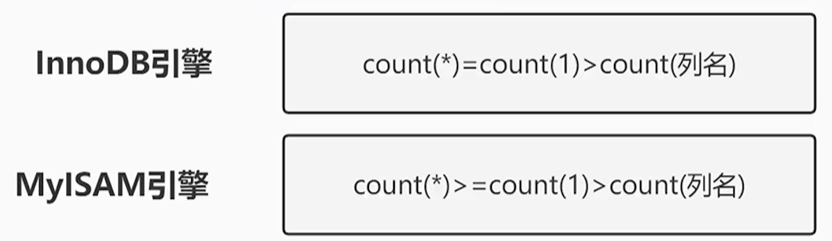

# 2023/6/1

## 安卓

封装里的函数

toString()：方便输出对象信息


### JSON

#### JSON字符串

```java
// 将 Java 对象转换成 JSON 字符串        
User user = new User(1, "Tom", "123456", "tom@demo.com", "13800138000");        
String jsonString = JSONObject.toJSONString(user);
System.out.println(jsonString);//{"email":"tom@demo.com","id":1,"mobile":"13800138000","password":"123456","username":"Tom"}

// 将 JSON 字符串转换成 Java 对象
User user2 = JSON.parseObject(jsonString, User.class);
System.out.println(user2.getUsername()); // Tom
```

#### JSON对象

```java
// JSON 字符串
String jsonString = "{\"name\": \"Tom\", \"age\": 20}";

// 将 JSON 字符串解析成 JSON 对象
JSONObject json = JSONObject.fromObject(jsonString);

// 从 JSON 对象中获取值
String name = json.getString("name");
int age = json.getInt("age");

System.out.println(name); // Tom
System.out.println(age);  // 20
```

#### JSON数组

```java
// 将 JSON 数组转换成 JSON 字符串
String jsonString = jsonArray.toString();
System.out.println(jsonString); // ["apple","banana","orange"]

// JSON 数组
String jsonString = "[\"apple\",\"banana\",\"orange\"]";

// 将 JSON 字符串解析成 JSON 数组
JSONArray jsonArray = JSONArray.fromObject(jsonString);

// 将 JSON 数组转换成 Java 数组
String[] fruits = new String[jsonArray.size()];
for (int i = 0; i < jsonArray.size(); i++) {
    fruits[i] = jsonArray.getString(i);
}

System.out.println(Arrays.toString(fruits)); // [apple, banana, orange]
```

### GSON


### 请求网络

Java 和 Android 都可以使用类似的方式来进行网络请求，包括使用原生的 URLConnection 或者第三方库（如 Apache 的 HttpClient、OkHttp、Retrofit 等）。

1. Android 中使用 HttpURLConnection 进行网络请求，它是 Android 对 Java 中 URLConnection 的封装，并能够支持在网络请求过程中更新 UI。HttpURLConnection 在 Android SDK 中提供了完整的 API，使用起来较为方便。
2. Android 中的网络请求必须放在独立的线程或者 AsyncTask 中进行，不能在主 UI 线程中执行，否则会抛出 NetworkOnMainThreadException 异常。这是因为 Android 系统默认禁止在主线程中执行网络请求，原因在于网络请求是一个比较耗时的操作，可能会阻塞主 UI 线程，导致应用程序变得非常卡顿，降低用户体验。所以 Android 中的网络请求通常都是在后台线程中执行的。
3. Android 11 以后，使用非加密的 HTTP 协议就会出现 Cleartext HTTP traffic to XXX not permitted 错误。需要将 HTTP 请求改为 HTTPS 或者设置网络安全配置文件支持 HTTP。而在 Java 中则没有这个限制。
4. Android 中的网络请求需要请求权限，即使是在 Android 10 以上的版本中，请求网络权限依然是必须的。而在 Java 中则不需要这个限制。
5. 在 Android 中使用 AsyncTask 进行网络请求的话，在 Android 11 以后，需要在 AsyncTask 的 doInBackground() 方法中使用 HttpURLConnection 或 OkHttp 进行网络请求。如果在 AsyncTask 中使用了 HttpClient，就会出现错误。因为 Android 11 已经禁止了 HttpClient。


## Java

### 接口和抽象类

继承接口implement

继承抽象类extends


### 实体类一定要用包装类型，不能使用基本类型

包装类型默认值为null，方便进行限制

基本类型默认值为0，容易产生bug


### 指令重排序

为了使处理器内部的运算单元能尽量被充分利用，处理器可能会对输入的代码进行乱序执行优化，处理器会在计算之后将乱序执行的结果重组。

使用volatile可以防止指令重排序，无法保证原子性，有可见性和有序性。

原子性指的是一个或者多个操作在 CPU 执行的过程中不被中断的特性。

***


### 时间类


### DO、BO、DTO、VO、PO


### 遍历Map的方法

1. forEach+Map.EntrySet

···

7. forEach+lambda

   ```java
   map.forEach(k,v) -> System.out.println(k+v));
   ```

   


## MySQL

count(*)、count(1)和count(列名)，谁的速度最快




### 三大范式

第一范式：每一列属性是不可分解的原子值

第二范式：第一范式基础上，消除非主属性对主属性的部分函数依赖

第三范式：第二范式基础上，消除了非主属性对主属性的传递函数依赖


### 树形结构存储

基于索引链的存储结构

添加字段Index_link、level，适用于查询多、结构变更少的数据库


