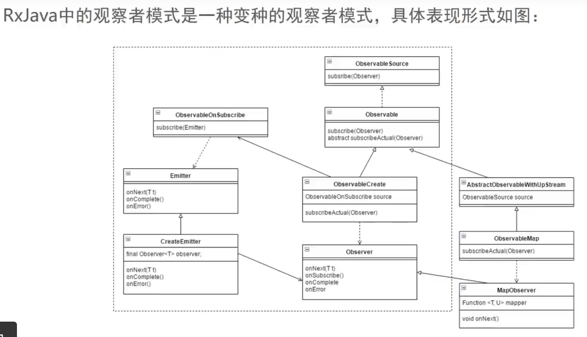
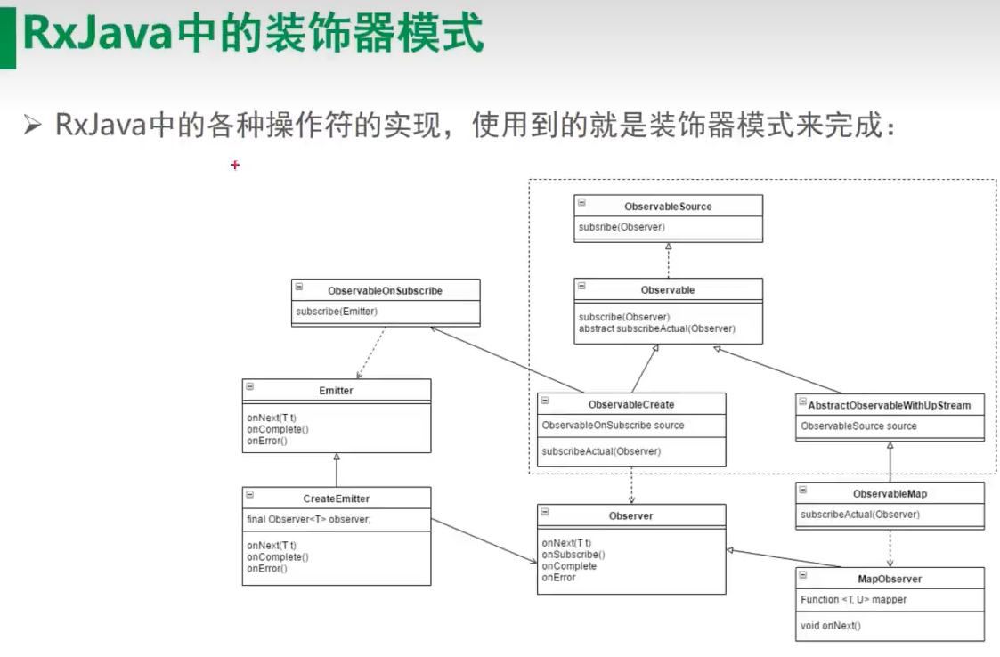
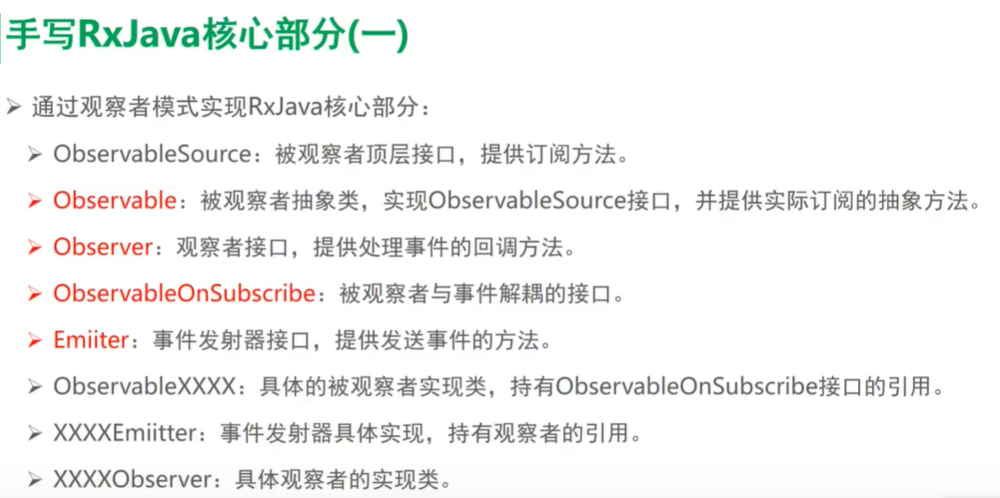
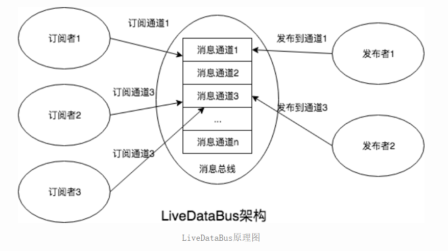
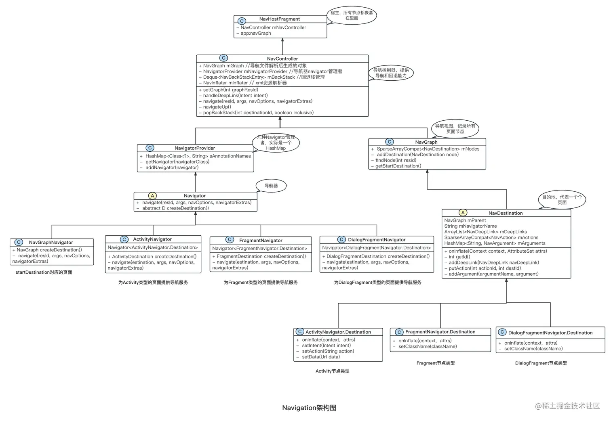
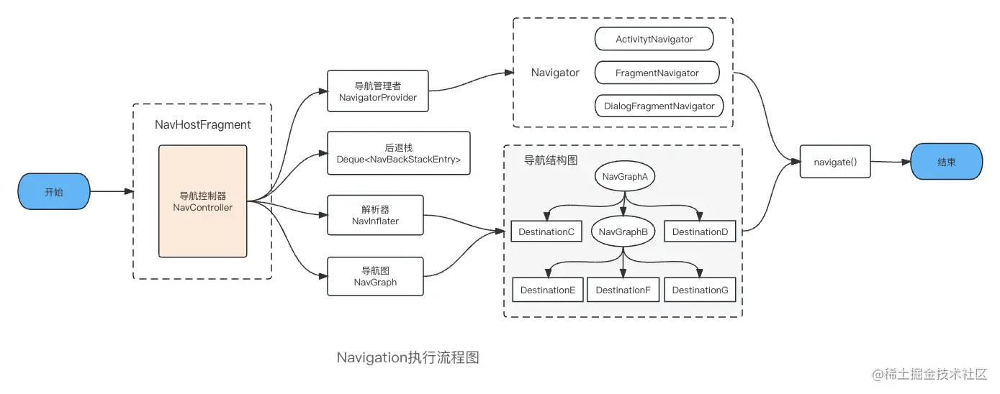
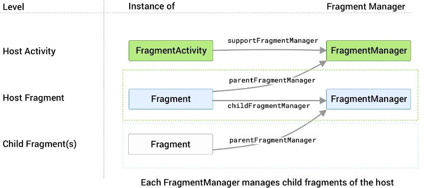
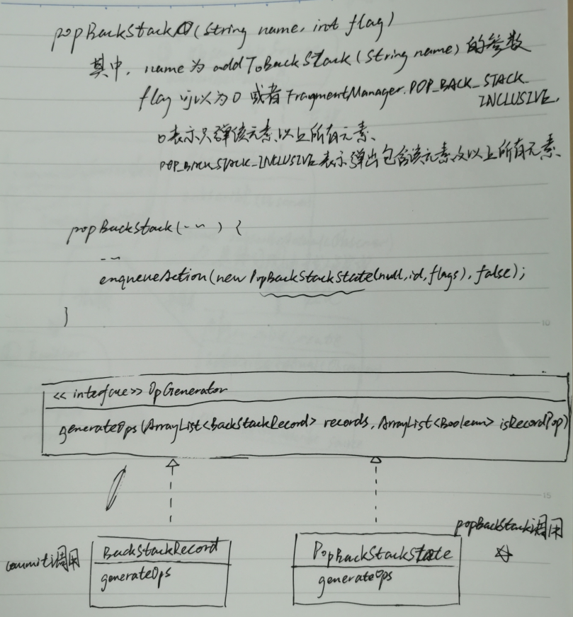

[TOC]

# 2023/7/3-7/6

## 安卓

### RxJava+Retrofit

把原来的Call改为Observable

```java
// subscribeOn在io线程执行
// observeOn切换回主线程
// subscribe订阅
httpbinService.test3("client_credentials",API_KEY,SECRET_KEY)
        .subscribeOn(Schedulers.io())
        .observeOn(AndroidSchedulers.mainThread())
        .subscribe(new Consumer<String>() {
    @Override
    public void accept(String s) throws Exception {
        JsonObject returnData = new JsonParser().parse(s).getAsJsonObject();
        Log.i("TAG", "accept: " + returnData.get("access_token"));
    }
}, new Consumer<Throwable>() {
    @Override
    public void accept(Throwable throwable) throws Exception {

    }
});
```

```java
// .addCallAdapterFactory适配转换，原本拿到的是Call<String>，使用rxjava的calladapter转换成Observable<String>。
retrofit = new Retrofit.Builder()
        .baseUrl("https://aip.baidubce.com/oauth/2.0/")
        .client(client)
        .addConverterFactory(ScalarsConverterFactory.create())
        .addCallAdapterFactory(RxJava2CallAdapterFactory.create())
        .build();
```


#### OkHttpClient.Builder()

在 OkHttp 中，`OkHttpClient.Builder()` 是用于构建 `OkHttpClient` 实例的建造者模式。其中的 `cookieJar()` 方法是用于设置处理 cookie 的策略。

Cookie 是一种服务器在客户端存储数据并在每次请求中将其发送回服务器的机制，用于在不同的请求之间保持状态。`cookieJar()` 方法允许你配置 OkHttp 客户端使用自定义的 `CookieJar` 实现来处理 cookie。

`cookieJar()` 方法接受一个 `CookieJar` 实例作为参数，用于设置用于处理 cookie 的策略。你可以使用 OkHttp 提供的 `CookieJar` 实现，也可以自定义实现。


#### Retrofit.Builder().addConverterFactory()

在 Retrofit 中，`Retrofit.Builder()` 是用于创建 `Retrofit` 实例的建造者模式。其中的 `addConverterFactory()` 方法用于添加请求和响应的转换器工厂。

转换器工厂是一种将请求和响应中的数据进行转换的组件。`addConverterFactory()` 方法允许你添加自定义的转换器工厂，用于将请求和响应的数据转换为所需的类型，例如将 JSON 数据转换为 Java 对象。

Retrofit 提供了多个内置的转换器工厂，包括 `GsonConverterFactory`、`MoshiConverterFactory`、`JacksonConverterFactory` 等，它们用于处理各种不同类型的数据。


### RxJava（Android进阶之光）

观察者：Observer观察事件变化并处理的主要角色。消费者Consumer可以理解为特殊的观察者。

被观察者：触发事件并决定什么时候发送事件的主要角色。

订阅：观察者和被观察者建立关联的操作。


subscribe()中通常使用Consumer，因为Observer要重写四个方法

Consumer抛出异常采用new Consumer\<Throwable>(){}，简化了异常的处理

subscribe中发送消息，观察者中接收

```java
Observable observable = Observable.create(new Observable.OnSubscribe<String>() {
    @Override
    public void call(Subscribe<? super String> subscriber) {
        // 事件产生的地方
    }
});
```

```java
/**
 * Observer，重写四个方法
 *
 */
Observable.create(new ObservableOnSubscribe<Object>() {
    @Override
    public void subscribe(ObservableEmitter<Object> emitter) throws Exception {
        // 发送事件，事件产生的地方
        emitter.onNext("1");
    }
}).subscribe(new Observer<Object>() {
    @Override
    public void onSubscribe(Disposable d) {
        // 建立订阅后立即执行的回调方法
        // 在此处进行订阅时的操作，例如显示进度条
    }
    @Override
    public void onNext(Object o) {
        
    }
    @Override
    public void onError(Throwable e) {
        
    }
    @Override
    public void onComplete() {
        
    }
    
})
```

```java
/**
 * Consumer，只重写accept方法。处理发送的事件（onNext）或者处理异常。
 *
 */
Observable.create(new ObservableOnSubscribe<Object>() {
    @Override
    public void subscribe(ObservableEmitter<Object> emitter) throws Exception {
        // 发射事件，事件产生的地方
        // emitter.onNext("1");
        
        // 耗时操作
        // 网络请求
        // 异步操作放在这里
    }
}).subscribe(new Consumer<Object>() {
    @Override
    public void accept(Object) throws Exception {
    }
}, new Consumer<Throwable>() {
    @Override
    public void accept(Throwable throwable) throws Exception {
    }
})
```


#### 创建操作符

create()——创建Observable

just()——快速创建被观察者（最多十个，重载了十个fromArray）

```java
Observable.just("1","AAA","2").subscribe(observer);
// 相当于创建Observable并传入三个事件
// 对应subscribe()方法中emitter.onNext("1");emitter.onNext("AAA");emitter.onNext("2");
    
```

fromArray（个数无限制）

fromIterable

```java
ArrayList<String> list = new ArrayList<>();
list.add("111");
list.add("222");
Observable.fromArray(list).subscribe(observer);
```

fromFuture

fromCallable


interval——每隔一段时间会发送一个事件，这个事件是从0开始的，不断增1的数字。如创建固定时间间隔发送整数序列的Observable，相当于定时器。

range——同时发送一定范围的时间序列。如创建发射指定范围的整数序列的Observable，可以拿来替代for循环。

repeat——如创建一个N次重复发射特定数据的Observable。


#### 转换操作符

map()——直接对发射出来的事件进行处理并且产生新的事件，再次创建被观察者，发射事件

> Function<T,U>——T类型转换为U类型

```java
// map处理的是事件，在apply方法中处理"aaa"，并返回"BBB"，可以改变被观察者发送的数据类型
Observable observable = Observable.just("aaa")
    .map(new Function<String, Object>() {
        @Override
        public Object apply(String s) throws Exception {
            return "BBB";
        }
    }).subscribe(observable)
```

flatmap()

```java
// 网络请求场景当中常用的操作符
// 可以将事件序列中的元素进行整合加工，返回一个新的被观察者
Observable observable = Observable.just("register")
    .flatmap(new Function<String, ObservableSource<?>>() {
        @Override
        public ObservableSource<?> apply(String s) throws Exception {
            System.out.println(s + "成功");
            return Observable.just("请求登录");
        }
    }).subscribe(observable)
```

concatmap()

```java
// 和flatMap()基本上一样，concatMap()转发出来的事件是有序的，而flatMap()是无序的（通常也是有序的）
```

buffer()

```java
// 从需要发送的事件当中获取一定数量的时间，并将这些事件房嫂缓冲区当中一并发出
Observable.just("111","222","333","444","555","666","777","888","999","AAAAA")
    .buffer(3)
    .subscribe(observer);

// 输出
// onNext···[111,222,333]
// onNext···[444,555,666]
// onNext···[777,888,999]
// onNext···[AAAAA]
```


#### 组合操作符

concat()

```java
// Observable的静态方法
// 将多个 Obserbavle 发射的数据进行合并发射。concat 严格按照顺序发射数据，前一个Observable没发射 完成是不会发射后一个Observable的数据的。
Observable.concat(Observable.just("1111"),
                 Observable.just("222"))
    			  .subscribe(observer);

// 输出
// 只订阅一次，所有被观察者打包到一个新的被观察者
onSubscribe...
onNext...1111
onNext...222
onComplete...
```

concatArray()——（同concat，没有个数限制）


#### 功能操作符

subscribeOn()——用于指定Observable自身在哪个线程上运行（执行subscribe方法所处的线程）。如果Observable需要执行耗时操作，一 般可以让其在新开的一个子线程上运行。

> 注：多次调用只有第一次有效

observerOn()——用来指定Observer所运行的线程，也就是发射出的数据 在哪个线程上使用。一般情况下会指定在主线程中运行，这样就可以修改UI。

> 注：影响下游事件被处理所处的线程

```java
// 不做线程切换，事件发射和处理默认则在主线程中执行，线程切换后只有subscribe在主线程
// 

Observable.create(new ObservableOnSubscribe<Object>() {
    @Override
    public void subscribe(ObservableEmitter<Object> emitter) throws Exception {
        // 创建事件 发射事件
        
        // 模拟网络请求
        Thread.sleep(2000);
        emitter.onNext("aaa");
        emitter.onNext("bbb");
        emitter.onComplete();
    }
}).subscribeOn(Schedulers.newThread())
    .subscribe(new Observer<Object>() {
    @Override
    public void onSubscribe(Disposable d) {
        // 建立订阅后立即执行的方法
        // 在此处进行订阅时的操作，例如显示进度条
    }
    @Override
    public void onNext(Object o) {
        
    }
    @Override
    public void onError(Throwable e) {
        
    }
    @Override
    public void onComplete() {
        
    }
    
})
```

doOnNext()——在调用onNext之前调用


#### 过滤操作符

filter()

```java
// 过滤
Observable.range(1,10)
    .filter(new Predicate<Integer>() {
        @Override
        public boolean test(Integer integer) throws Exception {
            return integer<5;
        }
    })
    .subscribe(observer);
    
```


#### map&flatmap详解

```java
Observable.fromIterable(StudentModel.getStudent())
    .map(NEW )
```


#### RxJava观察者模式




> ObservableSource是顶层接口类，有一个subscribe(Observer)方法
>
> Observable抽象类实现ObservableSource，实现subscribe方法，提供抽象方法subscribeActual(Observer)
>
> (create操作符的具体实现)ObservableCreate类泛化（继承）Observable类，实现subscribeActual()方法，依赖于Observer类；关联了ObservableOnSubscribe类，定义source变量；
>
> ObservableOnSubscribe类有一个subscribe(Emitter)方法，依赖于Emitter类
>
> Emitter接口有三个方法onNext，onComplete，onError
>
> CreatEmitter类关联了Observer类；泛化（继承）Emitter接口，实现了Emitter三个方法
>
> Observer类有四个方法
>
> 

[手写observable](https://www.bilibili.com/video/BV1H54y1j7uN?p=23&spm_id_from=pageDriver&vd_source=bf286743c0f79ff4e4df2222645065d3)


#### RxJava装饰器模式



不改变现有对象结构的情况下，动态地给对象增加一些职责（即增加其额外功能）的模式，它属于对象结构型模式

减少类继承层次

> AbstractObservableWithUpStream 抽象装饰类，拥有一个顶层接口的实例ObservableSource source
>
> ObservableMap 继承抽象装饰类，实现了一个Function function（构造方法中传入），内部类MapObserver
>
> Function 转换类型的接口，有一个apply方法
>
> MapObserver 实现了Observer，创建了


### Retrofit

网络请求时会进行响应数据和对象（如ResponseData）的转换

```java
.addConverterFactory(···)//添加转换方法
```


### Okhttp

#### RequestBody

在网络编程中，`RequestBody` 是用于封装请求主体数据的类。它用于将数据作为请求的主体内容发送到服务器。在不同的网络库或编程语言中，`RequestBody` 可以有不同的实现和使用方式。下面是一些常见的 `RequestBody` 类型：

1. `RequestBody.create(MediaType, String)`：通过指定媒体类型（`MediaType`）和字符串创建请求体。
2. `RequestBody.create(MediaType, byte[])`：通过指定媒体类型（`MediaType`）和字节数组创建请求体。
3. `FormBody`：用于创建表单编码的请求体，其中包含键值对形式的数据。常见于 `application/x-www-form-urlencoded` 类型的表单请求。
4. `MultipartBody`：用于创建多部分请求体，用于上传文件或包含二进制数据的请求。可以包含多个部分（`Part`），每个部分可以具有不同的媒体类型和内容。
5. `TypedInput`：在某些网络库中，用于封装请求体数据的接口，允许以更灵活的方式处理不同类型的内容。


#### 异步上传文件

```java
//定义上传文件类型
public static final MediaType MeEDIA_TYPE_MARKDOWN 
    = MediaType.parse("text/x-markdown; charset=utf-8");
```

```java
//在SD卡根目录创建一个wangshu.txt文件，里面的内容为"OKHttp"
String filepath = "";
if (Environment.getExternalStoragrState()
    .equals(Environment.MEDIA_MOUNTED)) {
    filepath = Environment.getExternalStorageDirectory().getAbsolutePath();
} else {
    return;
}
File file = new File(filepath,"wangshu.txt");
Request request = new Request.Builder()
    .url("https://api/github.com/markdown/raw")
    .post(RequestBody.create(MEDIA_TYPE_MARKDOWN,file))
    .build();
mOkHttpClient.newCall(request).enqueue(new Callback() {
    @Override
    public void onFailure(Call call, IOException e) {
    }
    @Override
    public void onResponse(Call call, Response response) throws IOException {
        Log.d(TAG,response.body().string());
    }
});
```

#### 异步下载文件

```java
//下载一张图片，得到Response后将流写进我们指定的图片文件中，代码如下所示
String url = "http://img.my.csdn.net/uploads/201603/26/1458988468_5804.jpg";
Request request = new Request.Builder().url(url).build();
mOkHttpClient.newCall(request).enqueue(new Callback() {
    @Override
    public void onFailure(Call call,IOException e) {
    }
    @Override
    public void onResponse(Call call,Response response) {
        InputStream inputStream = response.body().byteStream(); // 获取输入流
        FileOutputStream fileOutputStream = null;
        String filepath = "";
        try {
            if (Environment.getExternalStorage()
                .equals(Environment.MEDIA_MOUNTED)) {
                // 外部存储目录的绝对路径
                filepath = Environment.getExternalStorageDirectory().getAbsolutePath();
            } else {
                // 内部存储目录的绝对路径，通常是 /data/data/<package_name>/files
                filepath = getFileDir().getAbsolutePath();
            }
            File file = new File(filepath,"wangshu.jpg");
            if (null != file) {
                fileOutputStream = new FileOutputStream(file);
                byte[] buffer = new byte[2048]; // 创建缓冲区
                int len = 0; // 用于存储已读取的字节数
                // 用于从输入流（InputStream）中读取数据并存储到缓冲区（buffer）中
                while ((len = inputStream.read(buffer)) != -1) {
                    fileOutputStream.write(buffer, 0, len);
                }
                fileOutputStream.flush();
            } catch (IOException e) {
                Log.d(TAG,"IOException");
                e.printStackTrace();
            }
        }
    }
});
```


#### 异步上传Multipart文件

```java
//有时上传文件，同时还需要传其他类型的字段。OkHttp 3实现起来很简单。需要注意的是没有服务器接收我这个Multipart文件，所以这里只是举个例子，具体的应用还要结合实际工作中对应的服务器。
private static final MediaType MEDIA_TYPE_PNG = MediaType.parse("image/png");
private void sendMultipart() {
    mOkHttpClient = new OkHttpClient();
    RequestBody requestBody = new MultipartBody.Builder()
        .setType(MultipartBody.FORM)
        .addFormDataPart("title","wangshu")
        .addFormDataPart("image","wangshu.jpg",
                        RequestBody.create(MEDIA_TYPE_PNG,new File("/sdcard/wangshu.jpg")))
        .build();
    
    Request request = new Request.Builder()
        .header("Authorization","Client-ID"+"...")
        .url("https://api.img.com/3/image")
        .post(requestBody);
    
    mOkHttpClient.newCall(request).enqueue(new Callback() {
        @Override
        public void onFailure(Call call, IOException e) {
        }
        @Override
        public void onResponse(Call call,Response response) throws IOException {
            Log.d(TAG, response.body().string());
        }
    });
}

```


#### 设置超时时间和缓存

```java
File sdcache = getExternalCacheDir();
int cacheSize = 10 * 1024 * 1024;
OkHttopClient.Builder builder = new OkHttpClient,Builder()
    .connectTimeout(15, TimeUnit.SECONDS)
    .writeTimeout(20, TimeUnit.SECONDS)
    .readTimeout(20, TimeUnit.SECONDS)
    .cache(new Cache(sdcache.getAbsoluteFile(),cacheSize));
mOkHttpClient = builder.build();
```


#### 取消请求

使用call.cancel()可以立即停止一个正在执行的call。当用户离开一个应用时，或者跳到其他界面时，使用call.cancel()可以节约网络资源；不管同步还是异步的call都可以取消，也可以通过tag来同时取消多个请求。当构建一个请求时，使用Request.Builder.tag(Object tag)来分配一个标签，之后可以使用OkHttoClient.cancel(Object tag)来取消所有带有这个tag的call。

```java
private ScheduleExecuteorService executor = Executors.newScheduledThreadPool(1);
private void cancel() {
    final Request request = new Request.Builder()
        .url("https://www.baidu.com")
        .cacheControl(CacheControl.FORCE_NETWORK)//1
        .build();
    Call call = null;
    call = mOkHttpClient.newCall(request);
    final Call finalCall = call;
    // 100ms后取消call
    executor.schedule(new Runnable() {
        @Override
        public void run() {
            finalCall.cancel();
        }
    },100,TimeUnit.MILLISECONDS);
    call.enqeue(new Callback() {
        @Override
        public void onFailure(Call call, IOException e) {
        }
        @Override
        public void onResponse(Call call,Response response) throws IOException {
            if (null != response.cacheResponse()) {
                String str = reponse,cacheResponse().toString();
                Log.d(TAG, "cache---"+str);
            } else {
                String str = response.networkResponse().toString();
                Log.d(TAG, "network---"+str);
            }
        }
    });
}
```

创建定时线程池，100 ms后调用call.cancel（）来取消请求。为了能让请求耗时，在上面代码注释1处设 置每次请求都要请求网络，运行程序并且不断地调用cancel方法。Log打印结果如图5-13所示。

很明显每次cancel（）都失败了，也就是仍旧成功地访问了网络。每隔100 ms来调用call.cancel（）显然 时间间隔太长，我们设置为1 ms，再运行程序并且不断地调用cancel方法，这时就会发现没有Log打印出 来，那是因为每个请求都被取消了。


## GPT

Q：使用rxjava和retrofit进行网络访问，网络访问是在什么时候进行

> A：当你创建一个Retrofit的Service接口并定义了网络请求方法时，这些方法只是描述了网络请求的行为，而不会立即执行。当你在代码中调用`subscribe()`方法订阅这些网络请求的Observable时，才会触发执行网络请求。
>
> 在 `onNext()` 方法中，你可以处理网络请求成功的结果，并将响应数据发送给订阅者。


Q：Environment.getExternalStoragrState()方法的返回值

> A：`Environment.getExternalStorageState()` 是一个方法用于获取外部存储（例如SD卡）的状态。它会返回一个表示外部存储状态的字符串。
>
> 以下是可能的返回值及其含义：
>
> - `Environment.MEDIA_UNKNOWN`：外部存储状态未知。
> - `Environment.MEDIA_REMOVED`：外部存储未插入或已被移除。
> - `Environment.MEDIA_UNMOUNTED`：外部存储已插入，但未被挂载。
> - `Environment.MEDIA_CHECKING`：正在检查外部存储的状态。
> - `Environment.MEDIA_NOFS`：外部存储上没有文件系统。
> - `Environment.MEDIA_MOUNTED`：外部存储已插入且已被挂载，可读写。
> - `Environment.MEDIA_MOUNTED_READ_ONLY`：外部存储已插入且已被挂载为只读。
>
> 需要注意的是，在 Android 10（API级别29）及更高版本中，对外部存储的访问权限发生了变化，因此 `getExternalStorageState()` 返回的值可能与之前的版本有所不同，具体取决于应用的访问权限和设备的配置。
>
> 为了确保正确的外部存储状态，请确保在调用 `getExternalStorageState()` 之前已经获取了外部存储的读写权限，并且考虑处理各种返回值以适应不同的状态情况


# 2023/7/5

## 安卓


[android studio运行main](https://blog.csdn.net/m0_37849939/article/details/124979656)

在Project模式下：.idea下找到文件[gradle](https://so.csdn.net/so/search?q=gradle&spm=1001.2101.3001.7020).xml，在里面加入：`<option name="delegatedBuild" value="false" />`


## GPT

Q：类加载机制如何避免多线程问题？

> A：类加载机制本身并没有直接避免多线程问题的能力，但可以通过一些机制来减少多线程问题的发生。下面介绍两种常用的类加载机制来处理多线程问题：
>
> 1.**加锁机制**：通过在类加载过程中使用锁来确保只有一个线程可以进行类加载操作。Java中的类加载器在加载类时会使用锁来保证线程安全。每个类加载器都有一个与之关联的锁，当某个类加载器开始加载类时，会尝试获取该锁。如果其他线程已经占用了锁，那么当前线程将等待，直到锁释放后再重新尝试获取。这样可以确保在任何时刻只有一个线程在加载某个类，从而避免了多线程竞争的问题。
> 2.类加载的原子性：类加载过程具有原子性，即整个类加载过程中的各个步骤是不可分割的，要么全部完成，要么全部失败。这种原子性可以避免多线程环境下的竞争问题。当多个线程同时尝试加载同一个类时，只有一个线程可以成功加载，其他线程会因为获取不到锁而等待或者抛出异常。这确保了每个类只会被加载一次，避免了多个线程同时加载同一个类的问题。
>
> 需要注意的是，尽管类加载机制可以在一定程度上避免多线程问题，但并不能完全解决所有的多线程并发访问问题。其他代码中的同步机制、并发控制等技术仍然是处理多线程问题的主要手段。在编写多线程代码时，仍然需要小心处理同步和线程安全等问题，以保证代码的正确性和稳定性。


Q：类加载和类初始化是一个概念吗？

> A：不，类加载和类初始化是两个不同的概念。
> 类加载（Class Loading）是指将类的字节码文件加载到内存，并在内存中创建一个代表该类的Class对象的过程。类加载是Java虚拟机的核心功能之一，负责将编译后的字节码文件加载到内存中，并进行诸如验证、准备（为静态变量分配内存并设置默认值）、解析（将符号引用转换为直接引用）等操作。类加载的目的是为了在程序运行时使用这些类。
> 类初始化（Class Initialization）是类加载的最后阶段，负责对类进行初始化。类初始化是类加载过程的一部分，它主要执行静态变量的赋值和静态代码块的执行以及执行静态方法。类初始化在类第一次被使用时触发，例如创建实例对象、访问静态变量、调用静态方法等。
> 类加载和类初始化虽然相关，但并不是完全相同的概念。**类加载是将类的字节码加载到内存中的过程，而类初始化是类加载的最后阶段，用于执行类的初始化操作。**注意，类可以被加载但尚未进行初始化，只有在需要时，才会立即初始化类。


​	Q：rxjava中diposable用法？

> A：在 RxJava 中，Disposable 是一个用于表示可取消订阅的接口。它提供了一种机制，允许您在不再需要执行操作时取消订阅 Observable 或 Flowable。通过 Disposable，您可以手动取消订阅以释放资源、停止操作或避免内存泄漏。
> 使用 Disposable 主要涉及以下几个方面：
>
> 1.创建 Disposable：
>
> + 通过调用 subscribe() 方法返回的 Disposable 对象，您可以获取到订阅的引用。例如：
>
>  ```java
>  Disposable disposable = Observable.just("Hello, RxJava!")
>      .subscribe(value -&gt; System.out.println(value));
>  ```
>
> 
>
> 2.取消订阅：
>
> + 调用 dispose() 方法可以手动取消订阅并释放相关资源。例如：
>
>  ```java
>  disposable.dispose();
>  ```
>
> 
>
> 3.检查订阅状态：
>
> + 您可以使用 isDisposed() 方法检查 Disposable 的订阅状态，以判断是否已经取消订阅。例如：
>
> ``` java
>  if (disposable.isDisposed()) {
>      // 已取消订阅
>  } else {
>      // 仍在订阅中
>  }
> ```
>
> 
>
> 4.自动取消订阅：
>
> + 在某些情况下，例如使用 CompositeDisposable 进行多个订阅管理时，可以通过将 Disposable 添加到 CompositeDisposable 中来实现自动取消订阅。当 CompositeDisposable 被清理时，它会自动取消包含的所有订阅。例如：
>
>  ```java
>  CompositeDisposable compositeDisposable = new CompositeDisposable();
>  Disposable disposable1 = ...
>  Disposable disposable2 = ...
>  // 将 Disposable 添加到 CompositeDisposable
>  compositeDisposable.add(disposable1);
>  compositeDisposable.add(disposable2);
>  // 清理 CompositeDisposable 时，会自动取消订阅所有 Disposable
>  compositeDisposable.clear();
>  ```
>
> 
>
> 5.控制订阅生命周期：
>
> + 使用 Disposable，您可以控制订阅的生命周期，手动取消订阅以适应不同的场景，避免资源浪费和潜在的内存泄漏。当不需要订阅时，应主动取消订阅以确保资源释放。
>
> 请注意，RxJava 还提供了各种操作符和组合器，可以进一步处理和管理订阅的生命周期。通过正确使用 Disposable，您可以优雅地管理异步流操作，确保资源的正确释放和应用程序的可靠运行。


Q：CompositeDisposable用法

> CompositeDisposable 是 RxJava 中提供的一个 Disposable 容器，用于管理多个 Disposable 对象，并在需要时进行集中处理和取消订阅。它可以方便地管理和控制多个订阅的生命周期。
> 使用 CompositeDisposable 的常见用法如下：
>
> 1.创建 CompositeDisposable 对象：
>
> ```java
> CompositeDisposable compositeDisposable = new CompositeDisposable();
> ```
>
>
> 2.将 Disposable 对象添加到 CompositeDisposable：
>
>    ```java
>    Disposable disposable1 = observable1.subscribe();
>    Disposable disposable2 = observable2.subscribe();
>    compositeDisposable.add(disposable1);
>    compositeDisposable.add(disposable2);
>    ```
>
> 3.执行操作和观察结果：
>
>    // 执行操作，观察结果
>
>
> 4.取消订阅：
>
>  ```java
>  compositeDisposable.dispose();
>  ```
>
> 这将自动取消 CompositeDisposable 中包含的所有 Disposable 对象的订阅。
> 您也可以使用 remove() 方法从 CompositeDisposable 中移除单个 Disposable：
> compositeDisposable.remove(disposable);
>
> 这样可以选择性地取消订阅某个 Disposable，而不是一次性取消所有订阅。
> 通过使用 CompositeDisposable，您可以更方便地管理多个 Disposable 对象的订阅和取消订阅。它特别适用于需要批量处理和取消多个订阅的场景，例如在 Activity 或 Fragment 销毁时取消所有订阅。
>
> ```java
> public class MyActivity extends AppCompatActivity {
>     private CompositeDisposable compositeDisposable = new CompositeDisposable();
>     @Override
>     protected void onCreate(Bundle savedInstanceState) {
>         super.onCreate(savedInstanceState);
>         setContentView(R.layout.activity_main);
> 
>         // 创建 Disposable
>         Disposable disposable1 = ...
>     	Disposable disposable2 = ...
> 
>         // 将 Disposable 添加到 CompositeDisposable
>         compositeDisposable.add(disposable1);
>     	compositeDisposable.add(disposable2);
>     }
> 
>     @Override
>     protected void onDestroy() {
>         super.onDestroy();
>         // 在 Activity 销毁时取消所有订阅
>         compositeDisposable.dispose();
>     }
> }
> ```
> 这样，在 Activity 销毁时，CompositeDisposable 会自动取消所有订阅，避免潜在的内存泄漏和无效的操作。
> 总之，CompositeDisposable 提供了一种简单而强大的方式来管理多个 Disposable 对象的订阅和取消订阅。它可以帮助您有效地处理复杂的异步操作和资源释放，确保您的 RxJava 代码具有良好的可维护性和可靠性。


# 2023/7/7

## Java

### UML图

[CSDN](https://www.cnblogs.com/zrecord/p/15146543.html)

#### 实现Realize

关系：用来表示类与接口、抽象类与接口之间的关系

箭头：空心三角形+虚线，箭头指向接口

#### 泛化Generalize

关系：是一种继承关系，用来表示类与类、类与抽象类、抽象类与抽象类、接口与接口之间的关系

箭头：空心三角+实现，箭头指向父类或父接口

#### 关联Associate

关系：是一种拥有关系，关联可以是双向的；关联关系可以进一步划分为聚合及组合关系

箭头：用实线箭头表示，双向的关联可以有两个箭头或者没有箭头，单向的关联有一个箭头

比如：人和车

#### 聚合Aggregate

关系：表示整体与部分的关系，且部分可以离开整体而单独存在。是一种较强的关联关系

箭头：用空心的菱形+实线箭头表示，菱形指向整体

比如：电脑和键盘

#### 组合Composition

关系：是一种整体与部分的关系，但部分不能离开整体而单独存在。是一种强的关联关系

箭头：用实心的菱形+实线箭头表示，菱形指向整体

#### 依赖Dependency

关系：是一种使用关系，即一个类的实现需要另一个类的协助。

箭线：用虚线箭头表示，箭头指向被依赖的对象。


## GPT

在RxJava中，Observable对象和Subscriber对象之间可以通过方法链进行连接和配置。

在这里，我们可以看到以下方法链的用法：

1. `Observable.create(...)` 创建了一个Observable对象，并定义了`subscribe(...)`方法中的事件发射逻辑。这个`create(...)`方法返回的Observable对象被用作方法链的起点。
2. `.subscribeOn(Schedulers.newThread())` 方法链将Observable对象的执行线程指定为新的线程。这表示Observable的事件发射和处理将在新的线程中执行。
3. `.observeOn(AndroidSchedulers.mainThread())` 方法链指定Observer（Subscriber）对象的回调方法应该在Android主线程上执行。这样做是为了确保UI操作在主线程上执行，避免在子线程操作UI带来的问题。
4. `.subscribe(...)` 方法链将Observer对象订阅到Observable对象上。在这里，我们通过实现Observer接口的匿名内部类来定义相关的回调方法，包括`onSubscribe(...)`, `onNext(...)`, `onError(...)`, `onComplete(...)`。

通过这种方法链的方式，我们可以将多个操作以连贯的方式组装在一起，实现复杂的异步处理逻辑。每个方法调用都返回调用该方法的对象本身，使得我们能够在后续方法上继续链式调用。


Q：但是为什么他们的返回值不是this？

> A：对于RxJava中的方法链，每个方法通常返回一个新的对象，而不是返回调用该方法的对象本身（即this）。
>
> 这是因为RxJava的设计目标是实现响应式编程，允许通过方法链来组装和配置异步操作的各个环节，而不是在原始对象上修改状态。
>
> 方法链中的每个方法都会创建一个新的对象，该对象封装了前一个对象的状态和配置，并根据方法的调用进行相应的操作。这种设计带来了许多的优点，包括：
>
> 1. 链式调用的可读性：每个方法都是对前一个对象的操作，并且可以根据需求自由组合和排序方法调用，使得代码更加清晰易读。
> 2. 不可变性：由于每个方法创建了一个新的对象，原始对象的状态是不可变的。这对于多线程和并发操作是非常重要的，可以避免潜在的竞态条件和线程安全问题。
> 3. 灵活的组合和重用：通过方法链，可以方便地组合和重用不同的操作，根据需要创建出更复杂的异步处理逻辑。
>
> 因此在RxJava中，方法链通常返回一个新的对象，以便保持不可变性和灵活性，同时实现可读性和可维护性


# 2023/7/10-12

## 安卓

### RxJava补充

### 

Observable.create(···).map(···).subscribe(···)

create中返回一个被观察者ObservableCreate

map中产生一个观察者MapObserver并订阅ObservableCreate，返回一个被观察者ObservableMap

subscribe中observer订阅ObservableMap


#### **防止内存泄漏，取消订阅**(compose、RxLifecycle)

+ 在onDestroy中disposable.dispose()

  > Observable.subscribe（Consumer）——返回值 Disposable

+ 在Application中，捕获异常
  ```java
  // 取消订阅后，抛出的异常无法捕获，导致程序崩溃
  RxJavaPlugins.setErrorHandler(new Consumer<Throwable>() {
      @Override
      public void accept(Throwable throwable) throws Exception {
          Log.i("TAG","setErrorHanlder accept:throwable="+throwable.toString());
      }
  });
  ```

多个disposable使用compositeDisposable统一取消

```java
CompositeDisposable compositeDisposable;
compositeDisposable.add(disposable);

// onDestroy()
compositeDisposable.dispose();
```


**compose()**

使用compose()代替subscribeOn和observeOn，代码复用

```java
public class SchedulerTransformer<T> implements ObservableTransformer<T,T> {
    @Override
    public ObservableSource<T> apply(Observable<T> upstream) {
        return upstream.subscribe(Schedulers.io())
            .observeOn(AndroidSchedulers.mainThread());
    }
}

// 使用compose
.compose(new SchedulerTransformer<>())
```


**优化**

RxLifecyle rxLiftcycle = new RxLifecycle();

 ```java
 // RxLifecycle.class
 public class RxLifecycle<T> implements LifecycleObserver, ObservableTransformer<T,T> {
 
     final CompositeDisposable compositeDisposable = new CompositeDisposable();
 
     @OnLifecycleEvent(Lifecycle.Event.ON_DESTROY)
     void onDestory() {
         Log.i("TAG", "onDestory: ");
         if (!compositeDisposable.isDisposed()) {
             compositeDisposable.dispose();
         }
     }
 
 
     @Override
     public ObservableSource<T> apply(Observable<T> upstream) {
         // 调用 subscribe 方法时，会触发订阅操作，然后 doOnSubscribe 方法就会被执行
         return upstream.doOnSubscribe(new Consumer<Disposable>() {
             @Override
             public void accept(Disposable disposable) throws Exception {
                 compositeDisposable.add(disposable);
             }
         });
     }
 
     public static <T> RxLifecycle<T> bindRxLifecycle(LifecycleOwner lifecycleOwner) {
         RxLifecycle<T> lifecycle = new RxLifecycle();
         lifecycleOwner.getLifecycle().addObserver(lifecycle);
         return lifecycle;
     }
 }
 ```

```java
// SecondActivity.class
RxLifecycle rxLifecycle = new RxLifecycle();
getLifecycle().addObserver(rxLifecycle);

Observable.create(new ObservableOnSubscribe<Object>() {
    @Override
    public void subscribe(ObservableEmitter<Object> emitter) throws Exception {
        Log.i("TAG", "subscribe: 开始请求数据");
        Thread.sleep(5000);
        Log.i("TAG", "subscribe: 数据请求结束");
        emitter.onNext("Success");
        emitter.onComplete();
    }
}).compose(new SchedulerTransformer<>())
    .compose(RxLifecycle.bindRxLifecycle(this))
    .subscribe(new Consumer<Object>() {
        @Override
        public void accept(Object o) throws Exception {
            Log.i("TAG", "accept: " + o);
        }
    });
```


#### Subject

同时代表一个观察者和被观察者，允许将事件从单个源多播到多个子观察者

RxJava提供四种Subject：

+ AsyncSubject：无论发送多少条数据，无论在订阅前发射还是订阅后发射，都只会受到最后一条发射的数据。
+ BehaviorSubject：只会接收到订阅前最后一条发送的数据以及订阅之后所有的数据。
+ ReplaySubject：会接收到全部数据，无论订阅前后。
+ PublishSubject：只会接受到订阅之后的所有数据。

```java
AsyncSubject<Object> objectAsyncSubject = AsyncSubject.create();
objectAsyncSubject.onNext("A");
objectAsyncSubject.onNext("B");
objectAsyncSubject.subscribe(new Consumer<Object>() {
    @Override
    public void accept(Object o) throws Exception {
        System.out.println("accept:"+o);
    }
});
objectAsyncSubject.onNext("C");
objectAsyncSubject.onNext("D");
objectAsyncSubject.onComplete();
```


#### RxBus

基于RxJava实现活动间通信

```java
public class RxBus {
    // 使用一个Subject
    private final Subject<Object> mBus;

    // 静态内部类实现单例模式
    private static class Holder {
        private static final RxBus BUS = new RxBus();
    }

    private RxBus() {

        // 使用toSerialized，除了onSubscribe,onNext,onError,onComplete，都支持线程安全
        // 使用pulishsubject接受订阅后所有数据
        mBus = PublishSubject.create().toSerialized();
    }

    public static RxBus get() {
        return Holder.BUS;
    }

    public void post(Object event) {
        mBus.onNext(event);
    }

    // 转换为某种类型的被观察者
    public <T> Observable<T> toObservable(Class<T> tClass) {
        return mBus.ofType(tClass);
    }
}
```

#### RxPermission开源库

```java
private void applyPermission() {
    new RxPermission(this).request("android.permission.CAMERA")
        .compose(RxLifecycle.bindRxLifecycle(this))
        .subscribe(new Consumer<Boolean>() {
            @Override
            public void accept(Boolean aBoolean) throws Exception {
                if (aBoolean) {
                    Log.i("TAG","accept:开启了权限");
                }
            } 
        });
}
```


#### 防止快速点击

```java
TextView textView = findViewById(R.id.textView);
RxView.clicks(textView)
    .throttlrFirst(1,TimeUnit.SECONDS)
    .subscribe(new io.reactive,rxjava3.function.Consumer<Unit>() {
        @Override
        public void accept(Unit unit) throws Throwable {
            Log.i("TAG","accept:点击事件")
        }
    });
```


### Android消息总线的演进之路：用LiveDataBus替代RxBus、EventBus

[美团博客](https://tech.meituan.com/2018/07/26/android-livedatabus.html)

LiveDataBus原理图




## GPT

Q：RxBus和LiveDataBus哪个好？

> A：RxBus和LiveDataBus（或者通常称为LiveEventBus）都是Android平台上常用的事件总线库，用于实现组件间的通信。它们各自有其特点和适用场景，没有绝对的"更好"之说，选择哪一个取决于你的项目需求和个人偏好。
>
> 下面我会提供一些比较和说明，帮助你理解它们的特点和区别：
>
> 1. RxBus:
>    - RxBus基于RxJava库，使用RxJava的观察者模式和发布/订阅模式实现事件通信。
>    - RxBus提供了强大的操作符和线程调度支持，可以方便地进行事件处理和线程切换。
>    - RxBus通常适用于需要更复杂的事件传递和处理逻辑的场景，或者需要跨线程进行通信的情况。
>    - RxBus可以用于任何组件之间的通信，不仅局限于ViewModel或Activity/Fragment。
>    - 它是一个自定义实现的事件总线，没有被Android官方框架提供和支持。
> 2. LiveDataBus (LiveEventBus):
>    - LiveDataBus基于Google官方的LiveData库，它可以在生命周期感知的组件（如ViewModel、Activity、Fragment等）之间传递事件。
>    - LiveDataBus为组件间的通信提供了更简单、更安全的方式，并具有生命周期感知能力，能够自动处理订阅者的生命周期管理，防止内存泄漏。
>    - LiveDataBus适用于组件间的通信，特别是ViewModel与Activity/Fragment之间的通信。
>    - LiveDataBus的事件传递是基于观察者模式，但相比RxBus，它的事件处理功能较简单，不提供丰富的操作符和线程调度支持。
>
> 综上所述，如果你对RxJava比较熟悉，需要处理更复杂的事件逻辑、线程切换和高级操作符，或者希望自由地在任何组件间进行通信，那么RxBus可能更适合你的需求。
>
> 如果你更喜欢使用官方支持的库，并且主要在ViewModel与Activity/Fragment之间进行通信，同时希望享受LiveData的生命周期感知和安全性，那么LiveDataBus就是一个不错的选择。
>
> 最终的选择取决于你的具体情况和个人偏好，你可以评估项目需求，权衡其优劣点，选择最适合你的事件总线库。


# 2023/7/13

## Java

### [弱引用](https://juejin.cn/post/6844903665241686029)

Java中的弱引用具体指的是java.lang.ref.WeakReference<T>类，我们首先来看一下官方文档对它做的说明：

弱引用对象的存在不会阻止它所指向的对象被垃圾回收器回收。弱引用最常见的用途是实现规范映射(canonicalizing mappings，比如哈希表）。

假设垃圾收集器在某个时间点决定一个对象是**弱可达的(weakly reachable)**（也就是说当前指向它的全都是弱引用），这时垃圾收集器会清除所有指向该对象的弱引用，然后把这个弱可达对象标记为可终结(finalizable)的，这样它随后就会被回收。与此同时或稍后，垃圾收集器会把那些刚清除的弱引用放入创建弱引用对象时所指定的**引用队列(Reference Queue)**中。

实际上，Java中存在四种引用，它们由强到弱依次是：强引用、软引用、弱引用、虚引用。下面我们简单介绍下除弱引用外的其他三种引用：

+ 强引用（Strong Reference）：通常我们通过new来创建一个新对象时返回的引用就是一个强引用，若一个对象通过一系列强引用可到达，它就是强可达的(strongly reachable)，那么它就不被回收
+ 软引用（Soft Reference）：软引用和弱引用的区别在于，若一个对象是弱引用可达，无论当前内存是否充足它都会被回收，而软引用可达的对象在内存不充足时才会被回收，因此软引用要比弱引用“强”一些
+ 虚引用（Phantom Reference）：虚引用是Java中最弱的引用，那么它弱到什么程度呢？它是如此脆弱以至于我们通过虚引用甚至无法获取到被引用的对象，虚引用存在的唯一作用就是当它指向的对象被回收后，虚引用本身会被加入到引用队列中，用作记录它指向的对象已被回收。

| 引用类型 | 被垃圾回收时间 |        用途        |     生存时间      |
| :------: | :------------: | :----------------: | :---------------: |
|  强引用  |    从来不会    |   对象的一般状态   | JVM停止运行时终止 |
|  软引用  |  当内存不足时  |      对象缓存      |  内存不足时终止   |
|  弱引用  | 正常垃圾回收时 |      对象缓存      |  垃圾回收后终止   |
|  虚引用  | 正常垃圾回收时 | 跟踪对象的垃圾回收 |  垃圾回收后终止   |


# 2023/7/14

## 安卓

### Lifecycle应用

[bilibili](https://www.bilibili.com/video/BV1Ry4y1t7Tj?p=2&vd_source=bf286743c0f79ff4e4df2222645065d3)

LiveData会持有可被观察的数据。 并且同时它也是一种可感知生命周期的组件，意味着该组件重视其他 app组件的生命周期，如Activity、Fragment，该组件能确保，仅仅在Activity\Fragment等组件都处于 活跃的生命周期状态的时候，才去更新app组件。


#### 解耦页面与组件

计时器案例

```java
public class MyChronometer extends Chronometer implements LifecycleObserver {
    private long elapsedTime;
    public MyChronometer(Context context, AttributeSet attrs) {
        super(context, attrs);
    }
    @OnLifecycleEvent(Lifecycle.Event.ON_RESUME)
    private void startMeter() {
        setBase(SystemClock.elapsedRealtime() - elapsedTime);
        start();
    }
    @OnLifecycleEvent(Lifecycle.Event.ON_PAUSE)
    private void stopMeter() {
        elapsedTime = SystemClock.elapsedRealtime() - getBase();
        stop();
    }
}
```

添加监听

```java
@Override
protected void onCreate(Bundle savedInstanceState) {
    super.onCreate(savedInstanceState);
    setContentView(R.layout.activity_main);
    initView();
    getLifecycle().addObserver(chronometer);

}
```


#### 解耦Service与组件

Service gps案例

添加依赖androidx.lifecycle_extensions

```java
public class MyLocationService extends LifecycleService {

    public MyLocationService() {
        System.out.println("MyLocationService");
        MyLocationObserver observer = new MyLocationObserver(this);
        getLifecycle().addObserver(observer);
    }
}
```

```java
public class MyLocationObserver implements LifecycleObserver {
    private Context context;
    private LocationManager locationManager;
    private MyLocationListener locationListener;

    public MyLocationObserver(Context context) {
        this.context = context;
    }

    @OnLifecycleEvent(Lifecycle.Event.ON_CREATE)
    private void startGetLocation() {
        locationManager = (LocationManager) context.getSystemService(Context.LOCATION_SERVICE);
        locationListener = new MyLocationListener();
        if (ActivityCompat.checkSelfPermission(context, Manifest.permission.ACCESS_FINE_LOCATION) != PackageManager.PERMISSION_GRANTED && ActivityCompat.checkSelfPermission(context, Manifest.permission.ACCESS_COARSE_LOCATION) != PackageManager.PERMISSION_GRANTED) {
            return;
        }
        locationManager.requestLocationUpdates(LocationManager.GPS_PROVIDER, 3000, 1, locationListener);
    }

    @OnLifecycleEvent(Lifecycle.Event.ON_DESTROY)
    private void stopGetLocation() {
        locationManager.removeUpdates(locationListener);
    }

    private class MyLocationListener implements LocationListener {
        @Override
        public void onLocationChanged(@NonNull Location location) {
            System.out.println("LocationChanged"+location.toString());
        }
        @Override
        public void onLocationChanged(@NonNull List<Location> locations) {             
            System.out.println("LocationChanged"+locations.toString());
        }
        @Override
        public void onProviderEnabled(@NonNull String provider) {
        }
        @Override
        public void onProviderDisabled(@NonNull String provider) {
        }
    }
```


```shel
// adb 修改 gps 定位
adb -s emulator-5554 emu geo fix 122.4961236714487 31.24010934431376
```

#### ProcessLifecycleOwner监听应用程序生命周期

```java
// Application中添加
ProcessLifecycleOwner.get().getLifecycle().addObserver(new ApplicationObserver());
```

```java
public class ApplicationObserver implements LifecycleObserver {
    private String TAG = "";
    
    @OnLifecycleEvent(Lifecycle.Event.ON_CREATE)
    public void onCreate() {Log.d(TAG,"Lifecycle.Event.ON_CREATE");}
    
    @OnLifecycleEvent(Lifecycle.Event.ON_START)
    public void onStart() {Log.d(TAG,"Lifecycle.Event.ON_START");}
    
    @OnLifecycleEvent(Lifecycle.Event.ON_RESUME)
    public void onResume() {Log.d(TAG,"Lifecycle.Event.ON_RESUME");}
    
    @OnLifecycleEvent(Lifecycle.Event.ON_PAUSE)
    public void onPause() {Log.d(TAG,"Lifecycle.Event.ON_PAUSE");}
    
    @OnLifecycleEvent(Lifecycle.Event.ON_STOP)
    public void onStop() {Log.d(TAG,"Lifecycle.Event.ON_STOP");}
    
    @OnLifecycleEvent(Lifecycle.Event.ON_DESTROY)
    public void onDestroy() {Log.d(TAG,"Lifecycle.Event.ON_DESTROY");}
}
```


LiveData

```java
private MutableLiveData<Integer> currentSecond
```


```java
// 非UI线程 postValue
// UI线程 setValue
viewModel.getCurrentSecond().postValue(viewModel.getCurrentSecond().getValue()+1);
```


### LiveData

#### 应用

1.在ViewModel类里面创建LiveData

2.在Activity里面添加处理 `使用 LiveData 对象的 observe 或 observeForever 方法将对应的 Activity 或 Fragment 等添加为该 LiveData 对象的观察者`

3.使用LiveData的setValue或postValue更新数据，然后在Activity/Fragment中会自动刷新界面了

#### 原理

LiveData核心其实主要就是observer方法，注册观察者，用于监听数据变化；还有就是setValue方法用于通知数据变更；为什么LiveData比较好用呢，因为它可以监听界面生命周期用于刷新数据，也不需要用户自行切换线程。

[LiveData使用](https://www.jianshu.com/p/c69a7db3299a)


### 快捷键

设置为全局变量 `ctrl+alt+F`


# 2023/7/17

## 安卓

### Lifecycle源码分析

[掘金](https://juejin.cn/post/6844904061515333639#heading-4)

#### Event & State

7种Event

+ ON_CREATE
+ ON_START
+ ON_RESUME
+ ON_PAUSE
+ ON_STOP
+ ON_DESTROY
+ ON_ANY

5种State

+ DESTROY
+ INITIALIZED
+ CREATE
+ STARTED
+ RESUME

State是当前Lifecycle的状态值，Event是Lifecycle接下去的动作值


#### 注册 & 发送

观察者队列数据结构FastSafeIterableMap

```java
@Override
public void addObserver(@NonNull LifecycleObserver observer){...}
```

发送，以resume为例

```java
 @Override
protected void onResume() {
    super.onResume();
    
    //'1.直接发送State,告诉要跳到这个State状态'
    registry.markState(Lifecycle.State.CREATED);
    
    //'2.直接的是Event，然后跳到相应的Event对应的State状态'
    registry.handleLifecycleEvent(Lifecycle.Event.ON_RESUME);
 
}
```


### 广播动态注册和静态注册

动态注册的广播接收器可以自由实现注册和取消，有很大的灵活性，只有在程序启动后才能接收到广播。在onDestroy中unregisterReceiver注销，广播接收器的生命周期和当前Activity的生命周期一样。

静态注册的广播不受程序是否启动的约束，当应用程序关闭后，还是可以接受到广播。

标准广播和有序广播的接收和发送都是全局性的，这样会使得其他应用程序有几率接收到广播，会造成一定的安全问题。为了解决这个问题，Android系统中有一套本地广播机制，让所有广播事件在程序内部完成，采用localBroadcastReceiver对广播管理。


# 2023/7/18

## 安卓

### layout-land

`layout`:一般布局

`layout-port`:必须更改为纵向的小部件的布局

`layout-land`:必须为横向而改变的小部件的布局

> 1. 将res/layout-land/main.xml这个文件重命名为activity_main.xml，或者将竖向布局文件res/layout/activity_main.xml改为main.xml，总之，两个文件名要一样，这是重点！
> 2. 这样，Activity每次横竖屏切换才能正确调用函数，屏幕切换成横向的时候res/layout-land/main.xml会被自动加载。


```java
private void initLandScapeView() {
    //自检计数
    selfRl = findViewById(R.id.relative_selfCheck);        
    middleTitle = findViewById(R.id.tv_middle_title);
    
    //网络连接
    landTvInterNetStatus = findViewById(R.id.tv_interNetStatus_land);    
    landPbInterNet = findViewById(R.id.processBar_intenNet_land);

        
    //辅助背景灯
    landTvCameraLightStatus = findViewById(R.id.tv_cameraLightStatus_land);
    landPbCameraLight = findViewById(R.id.processBar_cameraLight_land);
    
    ...
}
```


[TypeToken](https://blog.csdn.net/qq_43842093/article/details/128140951)

Gson解析时`TypeToken`的泛型参数只能使用时传入**确切的类型**才能获取正确的Type，这也是`TypeToken`设计成抽象类的巧妙之处和原因（改为只有protected构造方法的普通类原理一样）。一旦将`TypeToken`改成普通类，根据上面的分析，一切类型信息都被擦除，Gson解析将得不到预期的类型。


### Lifecycle指南

[官方文档](https://developer.android.google.cn/topic/libraries/architecture/lifecycle?hl=zh-cn#implementing-lco)

对于位置跟踪示例，我们可以让 `MyLocationListener` 类实现 [`DefaultLifecycleObserver`](https://developer.android.google.cn/reference/androidx/lifecycle/DefaultLifecycleObserver?hl=zh-cn)，然后在 `onCreate()` 方法中使用 activity 的 [`Lifecycle`](https://developer.android.google.cn/reference/androidx/lifecycle/Lifecycle?hl=zh-cn) 对其进行初始化。这样，`MyLocationListener` 类便可以“自给自足”，这意味着，**对生命周期状态的变化做出响应的逻辑会在 `MyLocationListener`（而不是在 activity）中进行声明**。让各个组件存储自己的逻辑可使 activity 和 fragment 逻辑更易于管理。

> 在给出的示例中，MyLocationListener 类实现了 DefaultLifecycleObserver 接口。在 Activity 的 onCreate() 方法中，会使用 Activity 的 Lifecycle 对 MyLocationListener 进行初始化。这样，MyLocationListener 类就能够独立处理其自身相关的生命周期状态变化，而不需要依赖于外部的 Activity。这种方式可以使各个组件将自己的逻辑存储在自己内部，使得 Activity 和 Fragment 的逻辑更易于管理。


处理 ON_STOP 事件

如果 [`Lifecycle`](https://developer.android.google.cn/reference/androidx/lifecycle/Lifecycle?hl=zh-cn) 属于 `AppCompatActivity` 或 `Fragment`，那么调用 `AppCompatActivity` 或 `Fragment` 的 `onSaveInstanceState()` 时，[`Lifecycle`](https://developer.android.google.cn/reference/androidx/lifecycle/Lifecycle?hl=zh-cn) 的状态会更改为 [`CREATED`](https://developer.android.google.cn/reference/androidx/lifecycle/Lifecycle.State?hl=zh-cn#CREATED) 并且会分派 [`ON_STOP`](https://developer.android.google.cn/reference/androidx/lifecycle/Lifecycle.Event?hl=zh-cn#ON_STOP) 事件。

通过 `onSaveInstanceState()` 保存 `Fragment` 或 `AppCompatActivity` 的状态后，其界面被视为不可变，直到调用 [`ON_START`](https://developer.android.google.cn/reference/androidx/lifecycle/Lifecycle.Event?hl=zh-cn#ON_START)。如果在保存状态后尝试修改界面，很可能会导致应用的导航状态不一致，因此如果应用在保存状态后运行 `FragmentTransaction`，`FragmentManager` 会抛出异常。如需了解详情，请参阅 `commit()`。

[`LiveData`](https://developer.android.google.cn/reference/androidx/lifecycle/LiveData?hl=zh-cn) 本身可防止出现这种极端情况，方法是在其观察者的关联 [`Lifecycle`](https://developer.android.google.cn/reference/androidx/lifecycle/Lifecycle?hl=zh-cn) 还没有至少处于 [`STARTED`](https://developer.android.google.cn/reference/androidx/lifecycle/Lifecycle.State?hl=zh-cn#STARTED) 状态（没到STARTED或RESUMED）时避免调用其观察者。在后台，它会在决定调用其观察者之前调用 [`isAtLeast()`](https://developer.android.google.cn/reference/androidx/lifecycle/Lifecycle.State?hl=zh-cn#isAtLeast(androidx.lifecycle.Lifecycle.State))。

遗憾的是，`AppCompatActivity` 的 `onStop()` 方法会在 `onSaveInstanceState()` 之后调用，这样就会留下一个缺口，即不允许界面状态发生变化，但 [`Lifecycle`](https://developer.android.google.cn/reference/androidx/lifecycle/Lifecycle?hl=zh-cn) 尚未移至 [`CREATED`](https://developer.android.google.cn/reference/androidx/lifecycle/Lifecycle.State?hl=zh-cn#CREATED) 状态。

为防止出现这个问题，`beta2` 及更低版本中的 [`Lifecycle`](https://developer.android.google.cn/reference/androidx/lifecycle/Lifecycle?hl=zh-cn) 类会将状态标记为 [`CREATED`](https://developer.android.google.cn/reference/androidx/lifecycle/Lifecycle.State?hl=zh-cn#CREATED) 而不分派事件，这样一来，即使未分派事件（直到系统调用 `onStop()`），检查当前状态的代码也会获得真实值。

遗憾的是，此解决方案有两个主要问题：

- 在 API 23 及更低级别，Android 系统实际上会保存 activity 的状态，即使它的一部分被另一个 activity 覆盖。换句话说，Android 系统会调用 `onSaveInstanceState()`，但不一定会调用 `onStop()`。这样可能会产生很长的时间间隔，在此时间间隔内，观察者仍认为生命周期处于活动状态，虽然无法修改其界面状态。
- 任何要向 [`LiveData`](https://developer.android.google.cn/reference/androidx/lifecycle/LiveData?hl=zh-cn) 类公开类似行为的类都必须实现由 [`Lifecycle`](https://developer.android.google.cn/reference/androidx/lifecycle/Lifecycle?hl=zh-cn) 版本 `beta 2` 及更低版本提供的解决方法。

[ComponentActivity/Fragment是如何在生命周期方法发生改变时触发了LifecycleObserver中使用OnLifecycleEvent注解的方法?](https://blog.csdn.net/meijing11/article/details/121372541)


## GPT

### Q：判断某个布局id不为0

> A：在Android中，判断某个布局的id是否为0是指检查给定的布局资源标识符（ID）是否为0。布局的ID是在XML布局文件中定义的，用于在Java代码中引用该布局。通常，布局的ID用于在运行时找到并操作该布局。当我们判断某个布局的ID是否为0时，我们是在检查该布局是否已被正确定义和初始化。
> 如果某个布局的ID为0，意味着该布局的ID未被正确赋值或者没有找到对应的布局资源文件。这可能发生在以下情况下：
>
> 1.布局资源文件中未正确定义该布局的ID。
> 2.在Java代码中引用布局时，错误地使用了无效的ID。
> 3.在运行时，没有找到匹配的布局资源文件。
>
> 因此，判断某个布局的ID是否不为0，可以作为一种验证的手段，确保我们在使用布局资源之前，先正确初始化和定义了相应的布局ID


### Q：inflater.inflate()作用

> A：inflater.inflate 是在Android中用于将布局资源文件实例化为具体的视图对象的方法。它的主要作用是将定义在XML布局文件中的视图层次结构转换为对应的实际视图对象。
> 当我们需要在代码中使用一个XML布局文件时，我们可以使用LayoutInflater类的inflate方法来实现。这个方法接收三个参数：
>
> 1.布局资源文件的ID：指定要实例化的布局文件的ID。
> 2.父级容器：指定要将布局文件添加到的父级容器，通常是一个ViewGroup对象。
> 3.是否将实例化的视图添加到父级容器中：一个布尔值，指示是否将实例化的视图对象添加到父级容器中。
>
> 该方法会返回一个指向实例化的视图对象的引用。通过这个方法，我们可以将一个布局文件转换为在代码中操作的具体视图对象，然后可以对这个实例化的视图对象进行操作、设置属性或者作为布局的一部分添加到父容器中。
> 以下是一个示例代码，演示了如何使用inflater.inflate方法实例化一个布局文件：
> LayoutInflater inflater = LayoutInflater.from(context);
> View rootView = inflater.inflate(R.layout.my_layout, parentContainer, false);
>
> 在这个代码示例中，我们使用LayoutInflater.from方法获取一个LayoutInflater实例，并调用它的inflate方法来实例化R.layout.my_layout布局文件。我们指定了parentContainer作为父级容器，并且设置最后一个参数为false，表示不将实例化的视图添加到父级容器中。最后，我们将得到的视图对象赋值给变量rootView，以便后续的操作和使用。
> 这样，我们就可以通过rootView对象访问布局中的各个视图，并对其进行操作和设置属性。


### Q：什么情况下ViewModel存在的时间比activity长，不会在activity执行onDestroy时被销毁吗

> A：在某些情况下，ViewModel 的生命周期可能会比关联的 Activity 更长，导致在 Activity 执行 onDestroy() 方法时仍然存在。
>
> 这种情况通常发生在以下情况下：
>
> 1. 配置变化：当发生配置变化，例如屏幕旋转、语言切换或夜间模式切换时，Activity 会被销毁并重新创建。然而，ViewModel 实例会被保留下来并重新关联到新创建的 Activity，以便在配置变化后继续使用之前保存的数据状态。因此，ViewModel 的生命周期会比 Activity 更长。
> 2. 内存不足时的进程终止恢复：在 Android 系统面临内存不足的情况下，为了回收内存资源，系统可能会终止进程。当进程重新启动时，之前创建的 ViewModel 实例会通过 ViewModelProviders 类或 ViewModelProvider 构造函数被重新创建，并且会与新创建的 Activity 关联，从而使 ViewModel 的生命周期比 Activity 更长。
>
> 在这些情况下，如果 ViewModel 中持有对 Activity 的引用，就会出现内存泄漏的问题。因为即使 Activity 已经执行 onDestroy() 方法并准备销毁时，由于 ViewModel 仍然存在并持有对 Activity 的引用，导致 Activity 无法被垃圾回收器正确处理。
>
> 为了避免这种泄漏，建议在编写 ViewModel 时避免直接引用 View 或 Activity 上下文。相反，ViewModel 应该专注于管理数据和业务逻辑，不应该包含与 View 或 Activity 直接相关的引用。如果需要执行某些与 View 相关的操作，可以使用 LiveData 或观察者模式，在界面上观察 ViewModel 中的数据变化并做出相应的响应。
>
> 总结而言，ViewModel 应该是独立于 Activity 或 Fragment 的，避免直接引用 View 或 Activity 上下文，以避免潜在的内存泄漏问题。


Q：哪些情况下会调用onSaveInstanceState()

> A：onSaveInstanceState() 方法是在 Activity 或 Fragment 即将被销毁之前调用的生命周期方法，用于保存当前状态的数据。以下是几种情况下会调用 onSaveInstanceState() 方法：
>
> 1.配置变化：当发生配置变化时，例如屏幕旋转、语言切换或夜间模式切换，系统会销毁并重新创建 Activity 或 Fragment。在销毁之前，系统会调用 onSaveInstanceState() 方法，允许开发者保存当前状态的数据。接着，在重新创建的实例中，开发者可以通过 onCreate() 方法中的 savedInstanceState 参数恢复之前保存的状态数据。
> 2.后台进程被终止：在 Android 系统面临内存不足的情况下，为了回收系统资源，系统可能会终止后台进程。在这种情况下，当前可见的 Activity 或 Fragment 实例通常会被保留下来，以便在进程重新启动时恢复其状态。在进程终止之前，系统会调用 onSaveInstanceState() 方法，用于保存当前状态的数据，以便在进程重新启动后恢复。
>
> + *3.用户按下后退键：当用户按下设备的后退键，导致当前 Activity 或 Fragment 即将被销毁时，系统会调用 onSaveInstanceState() 方法，以便保存当前状态的数据。这样，在用户返回到该界面时，开发者可以通过 onCreate() 方法中的 savedInstanceState 参数恢复之前保存的状态数据。*
>
> > ⚠️ **警告：**如果 Activity 位于前台，并且用户点按了**返回**按钮，Activity 将依次经历 `onPause()`、`onStop()` 和 `onDestroy()` 回调。活动不仅会被销毁，还会从返回堆栈中移除。
> >
> > 需要注意的是，在这种情况下，默认不会触发 `onSaveInstanceState()` 回调。此行为基于的假设是，用户点按**返回**按钮时不期望返回 Activity 的同一实例。
>
> 需要注意的是，onSaveInstanceState() 方法仅适用于保存一小段关键性质的数据，例如用于恢复用户界面的信息。不应该将大量数据存储在 savedInstanceState 中，以免影响性能和内存消耗。对于大型数据集或需要持久化存储的数据，应该考虑使用其他机制，如持久化到数据库或使用 SharedPreferences 等。
> 总结而言，onSaveInstanceState() 方法会在配置变化、后台进程终止和用户按下后退键等情况下被调用，用于保存当前状态的数据。通过合理使用该方法，开发者可以在应用程序发生变化或重新创建后恢复之前保存的状态数据


# 2023/7/20-21

## 安卓

[onNewIntent与启动模式](https://juejin.cn/post/6844904007085850631?searchId=202307200909302BD8DECAA57F1ED65C1C)


### Navigation(1)

+ 导航图（Navigation Graph）：新的xml资源文件，包含应用程序所有页面，以及页面之间的关系。
+ NavHost：显示导航图中目标的空白容器。导航组件包含一个默认 `NavHost` 实现 ([`NavHostFragment`](https://developer.android.google.cn/reference/androidx/navigation/fragment/NavHostFragment?hl=zh-cn))，可显示 Fragment 目标。
+ NavController：在 `NavHost` 中管理应用导航的对象。当用户在整个应用中移动时，`NavController` 会安排 `NavHost` 中目标内容的交换。

三者关系：

当你想切换Fragment时，使用NavController对象，告诉它你想要的去Navigation Graph中的哪个Fragment，NavController会将你想去的Fragment展示NavHostFragment中



+ NavigationProvider：导航器Navigator管理者，实际上是一个HashMap
+ Navigator：导航器，能实例化对应的NavDestination，能指定导航，能回退导航
+ NavGraph：导航视图，它里面存储了所有的导航节点，也就是存储了所有的页面信息
+ NavDestination：目的地，表示导航节点，一个个页面。目的地是指您可在应用中导航到的任何位置，通常是fragment或activity
+ mBackStack：回退栈管理，每次打开一个页面都会添加一个NacBackStackEntry

`NavHostFragment` 表示所有节点的宿主，`app:navGraph` 允许在 xml 文件中定义导航视图，导航视图里面就定义了一个个的导航节点。

导航时，可以通过页面的 ID 在 `NavGraph` 查找到目标页的节点，使用 `NavController` 对象，在**导航图中向该对象指示您要去的地方或要使用的路径**。`NavController` 随后会在 `NavHostFragment` 中**显示相应的目的地**




## GPT

### Q：android:name作用

> A：在 Android 的布局文件中，控件的 `android:name` 属性用于指定控件所对应的类名。
>
> 该属性的作用包括：
>
> 1. 与自定义控件的关联：当你创建一个自定义的控件时，需要在布局文件中使用 `android:name` 属性来指定该控件对应的类名。这样，Android 系统在解析布局文件时能够正确地识别和实例化自定义控件。
> 2. 与 Fragment 的关联：在使用 Fragment 布局时，需要在布局文件中使用 `android:name` 属性指定 Fragment 对应的类名。这样，FragmentManager 在解析布局文件时能够正确地实例化 Fragment，并将其与相应的布局关联起来。
> 3. 与 ViewStub 的关联：ViewStub 是一种轻量级的控件，用于延迟加载复杂或昂贵的布局。在 ViewStub 的布局文件中，需要使用 `android:name` 属性指定要延迟加载的布局所对应的类名。这样，当 ViewStub 被实例化和填充时，系统能够正确加载并替换对应的布局。
>
> 需要注意的是，`android:name` 属性的使用场景与不同的控件类型相关。对于大多数内置的 Android 控件，`android:name` 属性通常不需要手动添加，因为系统已经知道该控件的类名。但是，在自定义控件、Fragment、ViewStub 等情况下，`android:name` 属性则起到关键作用，以确保正确的类被实例化和加载


# 2023/7/24-26

## 安卓

### Navigation(2)

#### 使用

[官方文档](https://developer.android.google.cn/guide/navigation/navigation-getting-started?hl=zh-cn#anatomy)

[博客园](https://www.cnblogs.com/guanxinjing/p/11555217.html)

+ 创建导航图(my_nav_graph)：用于存放目的地
+ 添加NavHost：在XML布局文件中添加 NavHostFragment
  `android:name` 属性包含 `NavHost` 实现的类名称。
  `app:navGraph` 属性将 `NavHostFragment` 与导航图相关联。导航图会在此 `NavHostFragment` 中指定用户可以导航到的所有目的地。
  `app:defaultNavHost="true"` 属性确保您的 `NavHostFragment` 会拦截系统返回按钮。请注意，只能有一个默认 `NavHost`。如果同一布局（例如，双窗格布局）中有多个宿主，请务必仅指定一个默认 `NavHost`。
+ 添加目的地


#### Safe Args实现类型安全的导航

顶层`build.gradle`文件

```groovy
buildscript {
    repositories {
        google()
    }
    dependencies {
        def nav_version = "2.5.3"
        classpath "androidx.navigation:navigation-safe-args-gradle-plugin:$nav_version"
    }
}
```

应用或模块的`build.gradle`文件

```groovy
plugins {
  id 'androidx.navigation.safeargs'
}
```

启用Safe Args后，生成的代码会为每个操作包含以下类型安全的类和方法，以及每个发送和接收目的地：

+ 为生成操作的每一个目的地创建一个类，该类的名称是在源目的地的名称后面加上"Directions"。例如，源目的地名为`SpecifyAmountFragment`，则生成的类的名称为`SpecifyAmountFragmentDirections`。
  该类会为源目的地中定义的每个操作提供一个方法。
+ 对于用于传递参数的每个action，都会创建一个inner类，该类的名称根据action的名称确定。例如，操作名称为`confirmationAction`，则类名称为`ConfirmationAction`。如果您的action包含不带`defaultValue`的参数，则您可以使用关联的action类来设置参数值。
+ 为接收目的地创建一个类。该类的名称是在目的地的名称后面加上"Args"。例如，目的地Fragment的名称为`ConfirmationFragment`，则生成的类的名称为`ConfirmationFragmentArgs`。可以使用该类的`fromBundle()`方法检索参数。


#### 检索Fragment、Activity或视图的NavController

**Java：**

- fragment中获取：NavHostFragment.findNavController(Fragment)
- activity中获取：Navigation.findNavController(Activity, @IdRes int viewId)//navhost的id
- 通常fragment点击事件中获取：Navigation.findNavController(View)


#### navigateUp() 向上导航

```java
Navigation.findNavController(getView()).navigateUp();
```

navigateUp也是执行返回上一级Fragment的功能。popBackStack和navigateUp()的区别是什么呢？

navigateUp向上返回的功能其实也是调用popBackStack的。 但是，navigateUp的源码里多了一层判断，源码如下：就是判断这个Navigation是否是最后一个Fragment，并且这个Navigation与里面的Fragment是不是有可能是其他Navigation跳转过来的。如果是其他Navigation跳转过来的就会回到之前的Navigation上。并且销毁当前Navigation的Activity。


#### 切换不同的Navigation

在Activity根据业务需要使用setGraph切换不同的Navigation

xml中可以把`app:navGraph=` 这个属性去除


#### popBackStack

请重视 public boolean popBackStack(@IdRes int destinationId, boolean inclusive) 这个方法。因为此方法可以实现清空中间导航栈堆的需求，举例假如 现在有 A -> B -> C -> D 这四个导航Fragment，如果我们现在当前导航到D并且想回到A，如果使用navigate()方法回到A，你就会发现用A Fragment里按返回键，不是直接退出而是直接到D Fragment。 如果是使用popBackStack(@IdRes int destinationId, boolean inclusive)方法，就不会回到D Fragment。


popBackStack(String name, int flag)

name 为 addToBackStack(String name) 的参数，通过 name 能找到回退栈的特定元素，flag可以为 0 或者`FragmentManager.POP_BACK_STACK_INCLUSIVE`，0 表示只弹出该元素以上的所有元素，`POP_BACK_STACK_INCLUSIVE` 表示弹出包含该元素及以上的所有元素。


#### [Navigation findNavController报错](https://blog.csdn.net/linminghuo/article/details/119000601)

使用 `FragmentContainerView` 创建 `NavHostFragment`，或通过 `FragmentTransaction` 手动将 `NavHostFragment` 添加到您的 Activity 时，尝试通过 `Navigation.findNavController(Activity, @IdRes int)` 检索 Activity 的 `onCreate()` 中的 `NavController` 将失败。您应改为直接从 `NavHostFragment` 检索 `NavController`。

```java
NavHostFragment navHostFragment =
        (NavHostFragment) getSupportFragmentManager().findFragmentById(R.id.nav_host_fragment);
NavController navController = navHostFragment.getNavController();
```


### Fragment




**动态添加fagment**

1）创建一个待处理的fragment

2）获取FragmentManager，一般都是通过getSupportFragmentManager()

3）开启一个事务transaction，一般调用fragmentManager的beginTransaction()

4）使用transaction进行fragment的替换

5）提交事务

```java
FragmentManager supportFragmentManager = getSupportFragmentManager();
FragmentTransaction transaction = supportFragmentManager.beginTransaction();
transaction.replace(R.id.framelayout, fragment);
transaction.addToBackStack(null);
transaction.commit();
```

> 事务具有原子性，一个事务中的多个add会一起回退。

**与activity通信**

1）A->F：Bundle存值并使用setArguments()绑定

2）F->A：activity注册接口并传给fragment（setFragmentCallback）、第三方组件eventBus、LiveData

3）F->F：通过activity传值


**生命周期**

1.打开界面

onCreate()->onCreateView()->onActivityCreate()->onStart()->onResume()

2.按下主屏键

onPause()->onStop()

3.重新打开界面

onStart()->onResume()

4.按后退键

onPause()->onStop()->onDestroyView()->onDestroy()->onDetach()


## GPT

### Q：NavHostFragment.findNavController与Navigation.findNavController区别

> A：NavHostFragment.findNavController() 和 Navigation.findNavController() 都是用于获取 NavController 实例的方法，但它们的使用场景略有不同。
>
> 1.NavHostFragment.findNavController():
>
> + NavHostFragment.findNavController() 是一个扩展函数，用于从包含 NavHostFragment 的 Fragment 中获取 NavController。
> + 通常用于在 NavHostFragment 所在的 Fragment 中进行导航操作。
> + 用法示例：val navController = findNavController()
>
> 2.Navigation.findNavController():
>
> + Navigation.findNavController() 是一个静态方法，用于从任何给定的 View 中获取 NavController。
> + 可以在不直接承载 NavHostFragment 的组件中使用，例如在 RecyclerView 的 ViewHolder 中或在自定义 View 中。
> + 通常用于非 NavHostFragment 的组件中执行导航操作。
> + 用法示例：val navController = Navigation.findNavController(view)
>
> 综上所述，NavHostFragment.findNavController() 主要用于从 NavHostFragment 直接获取 NavController 的实例，而 Navigation.findNavController() 可以从任意 View 中获取。根据你的使用场景和当前上下文，选择适合的方法以获取正确的 NavController 实例。


# 2023/7/27-31

## 安卓

### 依赖项注入

手动注入、自动注入


### Fragment踩坑

1.FragmentB调用add和addToBackStack跳转到FragmentC，C中调用remove回到B，点击系统返回键，仍然显示B的页面

每次addToBackStack要对应一次popBackStack（系统返回键使用onBackPressed，会执行popBackStack），否则Fragment仍然与Activity相关联，无法调用onDetach


2.三个Fragment分别为A、B、C，A调用add和addToBackStack方法跳转到B，B调用add方法跳转到C，C调用popBackStack方法跳转到A的时候，C的界面没有消失

popBackStack是回退commit中添加到返回栈的事务，B跳转到C的事务没有存入返回栈，所以回退的是A跳转到B的事务


[掘金](https://juejin.cn/post/7198625977210404923?searchId=20230801142902A312C6BF1D7F9874E640#heading-13)

3.创建Fragment时，没有检查savedStateInstance。导致activity被系统杀死并恢复的时候，一个重复的新的Fragment被创建。


### Fragment返回栈

[掘金](https://juejin.cn/post/6844904090921779214#heading-10)

`FragmentTransaction` 的实现类为 `BackStackRecord` ，所以 **fragment 的返回栈其实存放的就是 BackStackRecord**

从 `BackStackRecord` 的定义我们可以发现 `BackStackRecord` 有三种身份

- 继承了 `FragmentTransaction`，即是事务，保存了整个事务的全部操作
- 实现了 `FragmentManager.BackStackEntry` ，作为回退栈的元素
- 实现了`OpGenerator` ，可以生成 `BackStackRecord` 列表，后文详细介绍


`FragmentManager` 用于管理 fragment ，所以 **fragment 返回栈也应该由 FragmentManager 管理**

```java
//FragmentManager.java
ArrayList<BackStackRecord> mBackStack;
```


#### popBackStack()源码逻辑

★调用`PopBackStackState`——`generateOps(ArrayList<BackStackRecord> records,ArrayList<Boolean> isRecordPop`)（实现OpGenerate接口generateOps方法，用于生成事务列表以及对应的该事务是否是弹出）



```java
//BackStackRecord
//向 records list 中添加数据, isRecordPop list 全部传入 false
records.add(this);
isRecordPop.add(false);
if (mAddToBackStack) {        
    mManager.addBackStackState(this);
}

//PopBackStackState
//将 FragmentManager 的返回栈列表（mBackStack）的栈顶移除， isRecordPop list 全部传入 true
// int last = mBackStack.size() - 1;
// records.add(mBackStack.remove(last));
// isRecordPop.add(true);
return popBackStackState(records, isRecordPop, mName, mId, mFlags);
```

> popBackStackState方法
>
> ```java
> boolean popBackStackState(ArrayList<BackStackRecord> records, ArrayList<Boolean> isRecordPop,
>                               String name, int id, int flags) {
>         if (mBackStack == null) {
>             return false;
>         }
>         if (name == null && id < 0 && (flags & POP_BACK_STACK_INCLUSIVE) == 0) {
>             int last = mBackStack.size() - 1;
>             if (last < 0) {
>                 return false;
>             }
>             records.add(mBackStack.remove(last));
>             isRecordPop.add(true);
>         } else {
>             int index = -1;
>             if (name != null || id >= 0) {
>                 // If a name or ID is specified, look for that place in
>                 // the stack.
>                 index = mBackStack.size()-1;
>                 while (index >= 0) {
>                     BackStackRecord bss = mBackStack.get(index);
>                     if (name != null && name.equals(bss.getName())) {
>                         break;
>                     }
>                     if (id >= 0 && id == bss.mIndex) {
>                         break;
>                     }
>                     index--;
>                 }
>                 if (index < 0) {
>                     return false;
>                 }
>                 if ((flags&POP_BACK_STACK_INCLUSIVE) != 0) {
>                     index--;
>                     // Consume all following entries that match.
>                     while (index >= 0) {
>                         BackStackRecord bss = mBackStack.get(index);
>                         if ((name != null && name.equals(bss.getName()))
>                                 || (id >= 0 && id == bss.mIndex)) {
>                             index--;
>                             continue;
>                         }
>                         break;
>                     }
>                 }
>             }
>             if (index == mBackStack.size()-1) {
>                 return false;
>             }
>             for (int i = mBackStack.size() - 1; i > index; i--) {
>                 records.add(mBackStack.remove(i));
>                 isRecordPop.add(true);
>             }
>         }
>         return true;
>     }
> ```
>
> 

#### Fragment怎样拦截activity的返回逻辑

activity 的 `onBackPressed` 的逻辑主要分为两部分，判断所有注册的 `OnBackPressedCallback` 是否有 enabled 的，如果有则拦截，不执行后续逻辑；

否则着执行 mFallbackOnBackPressed.run() ，其内部逻辑为调用 ComponentActivity 父类的 `onBackPressed` 方法

···

而 `mOnBackPressedCallback` 在初始化时 enabled 赋值为 false

`isEnadbled` 会在返回栈数量大于 0 且其 mParent 为 `PrimaryNavigation` 时赋值为true

> 我们来总结一下，fragment 拦截 activity 返回栈是通过 `OnBackPressedDispatcher` 实现的，如果开启事务调用了 `addToBackStack` 方法，则 `mOnBackPressedCallback` 的 `isEnabled` 属性会赋值为 true，进而起到拦截 activity 返回逻辑的作用。拦截后执行 `popBackStackImmediate` 方法
>
> 而 popBackStack系列方法会调用 popBackStackState 构造 `records` 和 `isRecordPop` 列表，`isRecordPop` 的内部元素的值均为true 后续流程和提交事务是一样的，根据 `isRecordPop` 值的不同选择执行 `executePopOps` 或 `executeOps` 方法


#### 那么以现有的 api 如何实现多返回栈呢？

首先我要弄清楚怎样才会有多返回栈，根据上文我们知道 `FragmentManager` 内部持有`mBackStack` list，这对应着一个返回栈，**如果想要实现多返回栈，则需要多个 FragmentManager**，而多 `FragmentManager` 则对应多个 fragment

因此我们可以创建多个宿主 frament 作为导航 fragment 这样就可以用不同的宿主 fragment 的 独立的`FragmentManager` 分别管理各自的返回栈

## GPT

### Q：lifedata注册的observer的onchange方法什么时候会执行？

> A：`LiveData` 注册的观察者的 `onChanged()` 方法会在以下情况下被执行：
>
> 1. 当 `LiveData` 对象的值**发生变化**时：
>    - 如果 `LiveData` 的值在注册观察者之前已经被设置，那么观察者的 `onChanged()` 方法会在注册后立即被调用，以向观察者传递当前的值。
>    - 如果在注册观察者之后，`LiveData` 的值发生改变，那么观察者的 `onChanged()` 方法会立即被调用，以向观察者传递新的值。
> 2. 当观察者**首次注册**时（即使 `LiveData` 的值是 null）：
>    - 如果 `LiveData` 的值在注册观察者之前已经被设置，那么注册观察者时，观察者的 `onChanged()` 方法会被立即调用，以向观察者传递当前的值（即使它是 null）。
>    - 如果在注册观察者之后，`LiveData` 的值发生改变，那么观察者的 `onChanged()` 方法会立即被调用，以向观察者传递新的值。
>
> 总之，`LiveData` 的 `onChanged()` 方法会在注册观察者时，以及每当 `LiveData` 的值改变时被调用。这确保了观察者可以接收最新的数据，并在数据发生变化时进行相应的处理。
>
> 需要注意的是，`onChanged()` 方法会在主线程上执行。如果数据更新的过程需要执行耗时操作，以避免阻塞主线程，您可以考虑使用 `postValue()` 方法来在后台线程中更新 `LiveData` 的值。


### Q：NavigatorProvider的主要方法和功能介绍

> A：`Navigator` 是 Android Jetpack Navigation 组件中的一个关键接口，用于实现导航目标之间的跳转和导航逻辑。它定义了一组方法，用于处理导航的不同方面。
>
> 以下是 `Navigator` 接口的主要方法和功能介绍：
>
> 1. `void navigate(NavDestination destination, Bundle args, NavOptions navOptions, Navigator.Extras navigatorExtras)`
>    - 该方法用于执行导航到给定目的地的操作。
>    - 参数 `destination` 是要导航到的目的地，它是一个表示导航目标的 `NavDestination` 对象。
>    - 参数 `args` 是可选的目标参数，可以传递给目的地。
>    - 参数 `navOptions` 是导航选项，如动画、弹出栈策略等。
>    - 参数 `navigatorExtras` 是一些额外的导航参数，如共享元素过渡等。
> 2. `NavDestination createDestination()`
>    - 该方法用于创建具体的 `NavDestination` 实例，表示与该导航器关联的目的地类型。
>    - 每个导航器需要根据目的地类型创建相应的 `NavDestination` 实例。
> 3. `boolean popBackStack()`
>    - 该方法用于执行导航回退操作。
>    - 返回一个布尔值，表示导航器是否成功执行了回退操作。
> 4. `Bundle onSaveState()`
>    - 该方法用于保存导航器的状态。
>    - 返回一个包含导航器状态信息的 Bundle 对象。
> 5. `void onRestoreState(Bundle savedState)`
>    - 该方法用于还原先前保存的导航器状态。
>    - 参数 `savedState` 是一个 Bundle 对象，包含了之前通过 `onSaveState()` 方法保存的导航器状态信息。
>
> 通过实现 `Navigator` 接口，您可以创建自定义的导航器，以满足特定的导航需求。您可以处理导航目标之间的跳转逻辑、动画过渡、传递参数等。导航器是 Navigation 组件的核心部分，它提供了灵活的导航控制和个性化的导航体验。
>
> 除了上述列举的方法外，`Navigator` 接口还有一些其他的方法，可以根据具体需求来实现和使用。在自定义导航器时，您可以根据导航目标的类型和导航行为，选择要实现的方法，以实现自定义导航逻辑的完整控制。


### Q：@SerializedName注解作用

> A：`@SerializedName` 是一个用于 Gson 库的注解，它用于指定字段或方法在序列化和反序列化过程中对应的 JSON 键名。使用 `@SerializedName` 注解可以解决 **Java 对象字段名与 JSON 键名不一致**的问题。
>
> 在使用 Gson 库将 Java 对象转换为 JSON 字符串时，字段名默认会用作 JSON 键名。但有时，JSON 字符串中的键名与 Java 对象的字段名不一致，这时就可以使用 `@SerializedName` 注解来指定对应的 JSON 键名。
>
> 以下是 `@SerializedName` 注解的用法示例：
>
> ```java
> public class MyObject {
>     @SerializedName("jsonKey")
>     private String field;
>     
>     // Getter and setter methods
> }
> ```
>
> 在上面的示例中，`@SerializedName("jsonKey")` 注解指定了 `field` 字段在 JSON 中对应的键名为 “jsonKey”。当使用 Gson 库进行反序列化时，会将 “jsonKey” 的值赋给 `field` 字段。
>
> 这样，无论 JSON 中的键名是否与 Java 对象的字段名一致，都可以通过 `@SerializedName` 注解来建立对应关系，实现准确的序列化和反序列化。
>
> 需要注意的是，`@SerializedName` 注解可以用于字段上，也可以用于方法（如 getter 或 setter 方法）上，以便对应 JSON 键名的嵌套结构。
>
> 请注意，`@SerializedName` 注解是 Gson 库的特定注解，并非 Java 标准注解。它是在您引入 Gson 库后，通过 `com.google.gson.annotations.SerializedName` 类来使用的。


### Q：fragment控件初始绑定的fragment能hide隐藏吗

> A：在 Android 中，通过布局文件将一个 Fragment 绑定到一个 Fragment 控件（比如 FrameLayout）上时，你不能直接使用 `hide()` 方法隐藏这个初始绑定的 Fragment。因为在这种情况下，该 Fragment 是通过布局文件自动添加到 FragmentManager 中的。
>
> 通常，通过 `hide()` 和 `show()` 方法隐藏和显示 Fragment 是在使用 `add()` 或 `replace()` 方法将 Fragment 添加到 FragmentManager 中时使用的，而不是通过布局文件绑定的。
>
> 如果你想要在初始绑定的 Fragment 控件上实现隐藏功能，你可以尝试以下方法：
>
> 1. 使用一个初始的空白 Fragment：在布局文件中将一个空白的 Fragment 绑定到 Fragment 控件上。然后，在适当的时机（比如在 Activity 的 `onCreate()` 或 `onResume()` 方法中），通过代码使用 `hide()` 方法将该初始 Fragment 隐藏起来。此后，你可以使用 `add()` 或 `replace()` 方法添加其他 Fragment，并使用 `hide()` 和 `show()` 方法来控制它们的显示和隐藏。
> 2. 使用动态添加的 Fragment：不在布局文件中绑定初始 Fragment，而是在需要时通过代码动态添加 Fragment 到 Fragment 控件上。使用 `add()` 或 `replace()` 方法将初始 Fragment 添加到 Fragment 控件上，并在适当的时机通过 `hide()` 方法将其隐藏起来。然后，你可以继续添加其他 Fragment，并使用 `hide()` 和 `show()` 方法来控制它们的显示和隐藏。
>
> 无论哪种方法，你都需要通过代码控制 Fragment 的隐藏和显示，并避免直接使用 `hide()` 方法处理初始绑定的 Fragment。

