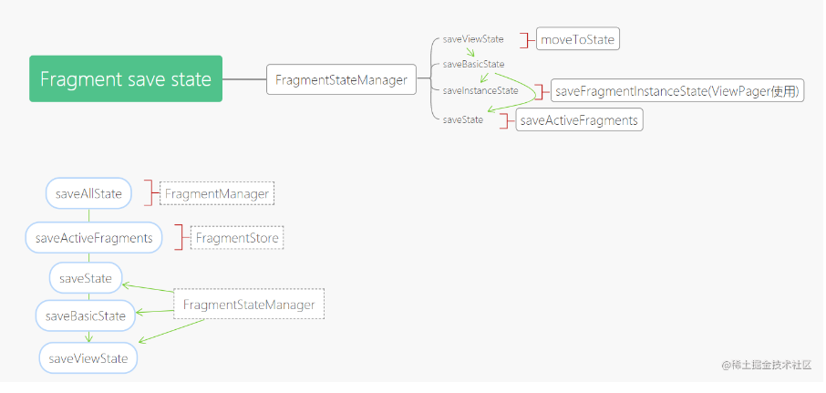

# 2023/8/1-2

## 安卓

### 保存界面状态

|                                        | ViewModel | 保存的实例状态 | 永久性存储空间 |
| -------------------------------------- | --------- | -------------- | -------------- |
| 存储位置                               | 在内存中  | 在内存中       | 在磁盘或网络上 |
| 在配置更改后继续存在                   | 是        | 是             | 是             |
| 在系统发起的进程终止后继续存在         | 否        | 是             | 是             |
| 在用户完全关闭activity或触发onFinish() | 否        | 否             | 是             |

> 保存的实例状态包括：`onSaveInstanceState()`和`rememberSaveable API`，以及 `SavedStateHandle`（作为 ViewModel 的一部分）。


#### 使用 onSaveInstanceState() 保存简单轻量的界面状态

当您的 Activity 开始停止时，系统会调用 [`onSaveInstanceState()`](https://developer.android.google.cn/reference/android/app/Activity?hl=zh-cn#onSaveInstanceState(android.os.Bundle)) 方法，以便您的 Activity 可以将状态信息保存到实例状态 Bundle 中。此方法的默认实现保存有关 Activity 视图层次结构状态的瞬时信息，例如 EditText 微件中的文本或  ListView 微件的滚动位置。

```java
static final String STATE_SCORE = "playerScore";
static final String STATE_LEVEL = "playerLevel";
// ...

@Override
public void onSaveInstanceState(Bundle savedInstanceState) {
    // Save the user's current game state
    savedInstanceState.putInt(STATE_SCORE, currentScore);
    savedInstanceState.putInt(STATE_LEVEL, currentLevel);

    // Always call the superclass so it can save the view hierarchy state
    super.onSaveInstanceState(savedInstanceState);
}
```

> 当用户显示关闭Activity时，或者在其他情况下调用finish()时，系统不会调用onSaveInstanceState()。


#### 使用保存的实例状态恢复 Activity 界面状态

重建先前被销毁的 Activity 后，您可以从系统传递给 Activity 的 Bundle 中恢复保存的实例状态。onCreate() 和 onRestoreInstanceState() 回调方法均会收到包含实例状态信息的相同 Bundle。

因为无论系统是新建 Activity 实例还是重新创建之前的实例，都会调用 onCreate() 方法，所以在尝试读取之前，您必须检查状态 Bundle 是否为 null。如果为 null，系统将新建 Activity 实例，而不会恢复之前销毁的实例。

例如，以下代码段显示如何在 onCreate() 中恢复某些状态数据：

```java
@Override
protected void onCreate(Bundle savedInstanceState) {
    super.onCreate(savedInstanceState); // Always call the superclass first

    // Check whether we're recreating a previously destroyed instance
    if (savedInstanceState != null) {
        // Restore value of members from saved state
        currentScore = savedInstanceState.getInt(STATE_SCORE);
        currentLevel = savedInstanceState.getInt(STATE_LEVEL);
    } else {
        // Probably initialize members with default values for a new instance
    }
    // ...
}
```

您可以选择实现系统在 onStart() 方法之后调用的 onRestoreInstanceState()，而不是在 onCreate() 期间恢复状态。仅当存在要恢复的已保存状态时，系统才会调用 onRestoreInstanceState()，因此您无需检查 Bundle 是否为 null：

```java
public void onRestoreInstanceState(Bundle savedInstanceState) {
    // Always call the superclass so it can restore the view hierarchy
    super.onRestoreInstanceState(savedInstanceState);

    // Restore state members from saved instance
    currentScore = savedInstanceState.getInt(STATE_SCORE);
    currentLevel = savedInstanceState.getInt(STATE_LEVEL);
}
```


### androidx SaveState

[掘金](https://juejin.cn/post/6844904097351467015#heading-8)

`SavedStateProvider`——保存状态的组件，此状态将在以后恢复并使用

`SavedStateRegistry`——管理 SaveStateProvider 列表的组件，此注册表绑定了其所有者的生命周期（即activity或fragment）。每次创建生命周期所有者都会创建一个新的实例

`SavedStateRegistryController`——一个包装 SavedStateRegistry 并允许通过其2个主要方法对其进行控制的组件：performRestore(savedState) 和 performSave(outBundle )。 这两个方法将内部通过 SavedStateRegistry 中的方法处理 。

`★SavedStateRegistryOwner`——持有 SavedStateRegistry 的组件。 默认情况下，androidx 包中的 ComponentActivity 和 Fragment 都实现此接口。


#### Activity状态保存

view状态、成员状态，此外还负责保存其内部的fragment的状态（FragmentActivity的onSaveInstanceState）

默认情况下，系统使用 Bundle 实例状态来保存有关 activity 布局中每个 View 对象的信息（例如，输入到 EditText 中的文本值或 recyclerview 的滚动位置）。 因此，如果 activity 实例被销毁并重新创建，则布局状态将恢复为之前的状态，而无需您执行任何代码。（**注意，需要恢复状态的 view 需要配置 id** ）

这部分逻辑在 activity 中的 `onSaveInstanceState` 方法内实现

> 关于 saveInstanceState() 的调用时机
>
> - targetSdkVersion 为 **28 及以后**：在 **onStop()后** 执行
> - targetSdkVersion **高于 11 且低于28**：在 **onStop()前** 执行
> - targetSdkVersion **低于 11**：在 **onPause() 前** 执行

**除了 view 状态和成员状态，activity 还负责保存其内部的 fragment 的状态**。`FragmentActivity` 的 `onSaveInstanceState` 方法有对其内部 fragment 的状态进行保存，并在 onCreate 方法中对已保存的 fragment 进行恢复。这解释了如果操作不当会导致 fragment 重叠的问题


#### Fragment状态保存

使用`FragmentStateManager`来处理fragment的状态保存

+ saveState

+ saveBasicState

+ saveViewState

+ saveInstanceState

  

其调用链为 activity 通过 `FragmentController` 间接 调用 `FragmentManager` 的 `saveAllState`，接着依次调用后面的save 方法。

Fragment 的状态保存可分为 view 状态，成员状态，child fragment 状态

关于 view 状态 , `FragmentStateManager` 提供了 `saveViewSate` 方法，它的调用有两处：

1. 在 activity 或父 fragment 触发状态保存时调用，即上述流程
2. 在 fragment 即将进入 `onDestroyView` 生命周期时调用，其位置在 `FragmentManager` moveToState 方法内部，这解释了为什么加入返回栈的 replace 操作在返回时 view 状态可以自动恢复

> ❝
>
> FragmentManager 的 moveToState 方法在触发 fragment 的 onDestroyView 前根据条件会执行 fragmentStateManager.saveViewState() 方法来保存 view 状态（1.2.2，旧版本该处方法方法名略有不同）
>
> 而由于 fragment 本身没有销毁，其成员也不会被销毁
>
> 所以当返回后 view 的状态会被恢复，而成员状态没有改变，所以 replace 后 fragment 能恢复到之前的状态
>
> ❞

关于成员状态，由 activity 中的状态机制处理，即上节内容

关于 child fragment 状态，fragment 的 `onCreate` 方法会调用 `restoreChildFragmentState` 来恢复 child fragment 的状态，并在 `FragmentStateManager` 中的 `saveBasicState` 方法中 调用 `performSaveInstanceState` 来保存 child fragment 的状态


#### ViewModel-SavedState

`Jetpack MVVM` 下 UI State 通常被 `ViewModel` 持有并存储，因此该模块出现了，配置该模块后，`ViewModel` 对象将通过其构造函数接收 `SavedStateHandle` 对象（键值映射），可让您保存状态并查询已保存的状态。 这些值将在系统终止进程后继续存在，并可以通过同一对象使用。


工作流程


```ko
ViewModelProvider(this).get(MyViewModel::class.java)
```

在 activity 中创建 ViewModel 实例，传入 this （`SavedStateRegistryOwner`）作为参数，该参数可以访问其 `SavedStateRegistry`，如果没有传入 factory 会通过 activity 重写的 `getDefaultViewModelProviderFactory` 方法来获取默认的 factory 。然后 factory 将使用保存的状态， 将其包装在 `SavedStateHandle` 中，并将其传递给 ViewModel。 ViewModel 可以读取和写入该 handle

当 activity 的 `onSaveInstanceState(outState)` 方法被调用，其 `SavedStateRegistry` 的 `performSave(outState)` 方法将被执行，其内部的所有 `SavedStateProvider` 的 `saveState` 方法均被执行，一旦执行完毕，`outState` 就包含了已保存的状态

当 app 被重启后，activity 和新的 registry 将被创建，activity 的 `onCreate(savedInstanceState)` 方法会被调用，然后 registry 的 `performRestore(savedInstanceState)` 将被调用以便恢复之前保存的状态


### ViewModel职责——Fragment之间共享数据

[掘金](https://juejin.cn/post/6844904100493017095)

由于 两个 fragment 使用的都是 activity 范围的 `ViewModel` （`ViewModelProvider` 构造器传入的 activity ），因此它们获得了相同的 ViewModel 实例，自然其持有的数据也是相同的，这也 **保证了数据的一致性**


ViewModel源码分析

首先我们要先了解一下 `ViewModel` 的结构

- `ViewModel`：抽象类，主要有 clear 方法，它是 final 级，不可修改，clear 方法中包含 onClear 钩子，开发者可重写 onClear 方法来自定义数据的清空
- `ViewModelStore`：内部维护一个 HashMap 以管理 `ViewModel`
- `ViewModelStoreOwner`：接口，`ViewModelStore` 的作用域，实现类为 `ComponentActivity` 和 `Fragment`，此外还有 `FragmentActivity.HostCallbacks`
- `ViewModelProvider`：用于创建 `ViewModel`，其构造方法有两个参数，第一个参数传入 `ViewModelStoreOwner` ，确定了 `ViewModelStore` 的作用域，第二个参数为 `ViewModelProvider.Factory`，用于初始化 `ViewModel` 对象，默认为 `getDefaultViewModelProviderFactory()` 方法获取的 factory

简单来说 **ViewModelStoreOwner 持有 ViewModelStore 持有 ViewModel**


# 2023/8/3

## 安卓

### Lifecycle补充

[掘金](https://juejin.cn/post/6844904111108800519#heading-8)

#### 源码结构


这是 [Lifecycle](https://link.juejin.cn/?target=https%3A%2F%2Fdeveloper.android.com%2Freference%2Fandroidx%2Flifecycle%2FLifecycle) 的结构，抽象类，其内部有两个枚举，分别代表着「事件」和「状态」，此外还有三个方法，添加/移除观察者，获取当前状态。


其内部持有当前的状态 mState ，LifecycleOwner 以及观察者的自定义列表，同时重写了父类的添加/删除观察者的方法。


[LifecycleOwner](https://link.juejin.cn/?target=https%3A%2F%2Fdeveloper.android.com%2Freference%2Fandroidx%2Flifecycle%2FLifecycleOwner) ，具有 Android 的生命周期，定制组件可以使用这些事件来处理生命周期更改，而无需在 Activity 或 Fragment 中实现任何代码

[LifecycleObserver](https://link.juejin.cn/?target=https%3A%2F%2Fdeveloper.android.com%2Freference%2Fandroidx%2Flifecycle%2FLifecycleObserver) ，将一个类标记为 `LifecycleObserver`。 它没有任何方法，而是依赖于 OnLifecycleEvent 注解的方法

[LifecycleEventObserver](https://link.juejin.cn/?target=https%3A%2F%2Fdeveloper.android.com%2Freference%2Fandroidx%2Flifecycle%2FLifecycleEventObserver) ，可以接收任何生命周期更改并将其分派给接收方。

**如果一个类实现此接口并同时使用 OnLifecycleEvent，则注解将被忽略**

[DefaultLifecycleObserver](https://link.juejin.cn/?target=https%3A%2F%2Fdeveloper.android.com%2Freference%2Fandroidx%2Flifecycle%2FDefaultLifecycleObserver) ，用于监听 [LifecycleOwner](https://link.juejin.cn/?target=https%3A%2F%2Fdeveloper.android.com%2Freference%2Fandroidx%2Flifecycle%2FLifecycleOwner) 状态更改的回调接口。

如果一个类同时实现了此接口和 [LifecycleEventObserver](https://link.juejin.cn/?target=https%3A%2F%2Fdeveloper.android.com%2Freference%2Fandroidx%2Flifecycle%2FLifecycleEventObserver)，则将首先调用`DefaultLifecycleObserver` 的方法，然后再调用LifecycleEventObserver.onStateChanged（LifecycleOwner，Lifecycle.Event）

> 注意：使用 [DefaultLifecycleObserver](https://link.juejin.cn/?target=https%3A%2F%2Fdeveloper.android.com%2Freference%2Fandroidx%2Flifecycle%2FDefaultLifecycleObserver) 需引入
>
> implementation "androidx.lifecycle:lifecycle-common-java8:$lifecycle_version"


#### activity生命周期处理

在 activity 的 onCreate 方法中，调用了 `ReportFragment` 中的静态方法 `injectIfNeededIn()` 。而其内部，**如果 api 29 及以上的设备上直接注册正确的生命周期回调，低版本通过启动 ReportFragment ，借助 fragment 各个生命周期来处理生命周期回调**


#### fragment 生命周期处理

在 fragment 内部，每个生命周期节点调用 `handleLifecycleEvent` 方法


### LiveData补充

理想的数据模型

LiveData 可以三个关键词概括

- lifecycle-aware
- observable
- data holder


**observable**

通常我们会在 `Activity` 中持有 `ViewModel` 的引用，那么如何进行二者间的通信，如何向 `Activity` 发送 `ViewModel` 中的数据？

答案是让 `Activity` 观察 `ViewModel`

**lifecycle-aware**

当观察者观察着某个数据时，该数据必须保留对观察者的引用才能调用它，为了解决这个问题，`LiveData` 被设计成可感知生命周期

当 activity / fragment 被销毁后，它会自动的取消订阅

**data holder**

`LiveData` 仅持有 **单个且最新** 的数据


上图中，最右侧是在 `ViewModel` 中的 `LiveData`，左侧为观察这个 `LiveData` 的 activity / fragment 。一旦我们为 `LiveData` 设值，该值会传递到 activity。简而言之，`LiveData` 值改变，activity 收到最新的值的变化。但是当观察者不再处于活动状态（STARTED 到 RESUMED ），数据 C 不会被发送到 activity 。当 activity 回到前台，它将收到最新的值，数据 D。**LiveData 仅持有单个且最新的数据**。当 activity 执行销毁流程时，此时的数据 E 也不会产生任何影响


#### Transformations

`LiveData` 提供 两种 transformation ，`map` 和 `switch map`。开发者也可以创建自定义的 `MediatorLiveData`


#### 问题

Fragment 作为 LifecycleOwner 的问题

[掘金](https://juejin.cn/post/6991637169001463838?searchId=202308040847058A1070BF8AFAA764D7EB#heading-2)

> LiveData 之所以能够防止泄露，是当 LifecycleOwner 生命周期走到 `DESTROYED` 的时候会 remove 调其关联的 `Observer`
>
> 解决：在 `onCreate()` 中订阅


### ViewBinding

最近在 Android Studio 3.6 中引入的 ViewBinding 是 DataBinding 库的子集。 由于不需要注解处理，因此可以缩短构建时间。详细的使用可以参见 [这篇文章](https://juejin.cn/post/6844904065655111693)

|            | findViewById | Butterknife | Kotlin Synthetics | DataBinding | ViewBinding |
| ---------- | ------------ | ----------- | ----------------- | ----------- | ----------- |
| 一直空安全 | ❌            | 部分        | 部分              | ✔️           | ✔️           |
| 类型安全   | ❌            | ❌           | ✔️                 | ✔️           | ✔️           |
| 样板代码   | 多           | 少          | 少                | 中等        | 少          |
| 构建时间   | ✔️            | ❌           | ✔️                 | ❌           | ✔️           |
| 支持语音   | java/kotlin  | java/kotlin | kotlin            | java/kotlin | java/kotlin |

```java
// 使用ViewBinding绑定布局
ActivityMainBinding binding = ActivityMainBinding.inflate(getLayoutInflater());
setContentView(binding.getRoot());

// 使用binding.tvResult的形式获取控件
binding.tvResult.setText("translation");
```


### Fragment补充

[掘金](https://juejin.cn/post/6900739309826441224?searchId=20230728094616D0B8CB14447CCC84A90B#heading-29)

转场动画

设置animation

设置transition

使用共享元素过渡

延迟过渡

在RecycleView中使用共享元素过渡


#### 生命周期

将 fragment 添加到 FragmentManager 并将其 attach 到其宿主 activity 时，将调用 `onAttach()` 回调，fragment 处于活跃状态，并且 FragmentManager 正在管理其生命周期状态。 此时，FragmentManager 方法（如 `findFragmentById()`）将返回此 fragment。

`OnAttach()` 方法永远在任何生命周期状态改变前调用。

当 fragment 已从 FragmentManager 中移除并与其宿主 activity detach 时，将调用 `onDetach()` 回调。 该 fragment 不再活跃，无法再使用 `findFragmentById()` 进行检索。

`OnDetach()` 方法永远在任何生命周期状态改变后调用。


**State和回调**

在确定 fragment 的生命周期状态时，FragmentManager 考虑以下因素：

- fragment 的最大状态由其 FragmentManager 决定。 fragment 无法超出其 FragmentManager 的状态
- 作为 FragmentTransaction 的一部分，您可以使用 setMaxLifecycle() 在 fragment 上设置最大生命周期状态
- fragment 的生命周期状态永远不能大于其宿主。 例如，父 fragment 或 activity 必须在其子 fragment 之前 start。 同样，子 fragment 必须在其父 fragment 或 activity 之前 stop

> ⚠️ **警告**：**避免在 XML 中使用 `<fragment>` 标签添加 fragment**。因为 `<fragment>` 标签允许 fragment 移出其 FragmentManager 的状态。 请始终使用 `FragmentContainerView` 通过 XML 添加 fragment。


状态向上转换

1.Fragment CREATED

当您的 fragment 达到 `CREATED` 状态时，已将其添加到 FragmentManager 中并且已经调用了 `onAttach()` 方法。

这将是通过 fragment 的 `SavedStateRegistry` 恢复与 fragment 本身关联的所有保存状态的合适位置。 请注意，此时尚未创建 fragment 的 view，并且只有在创建 view 之后，才应还原与 fragment 的 view 关联的任何状态。

这个过程将 **调用 `onCreate()` 回调**。 回调还将接收一个 `saveInstanceStateState` 的 `Bundle` 参数，其中包含先前由 onSaveInstanceState() 保存的状态。 请注意，第一次创建该 fragment 时，`savedInstanceState` 的值为 null，但 **对于之后的重新创建，即使未重写 `onSaveInstanceState`，它也始终为非 null**。 有关更多详细信息，请参见使状态保存一节。

2.Fragment CREATED 和 View INITIALIZED

仅当您的 fragment 提供有效的 View 实例时，才创建 fragment 的 view 生命周期。 在大多数情况下，您可以使用带有 `@LayoutId` 的 fragment 构造器，该构造器会在适当的时间自动 inflate view。 您还可以重写 `onCreateView()` 以编程方式 inflate 或创建 fragment 的 view。

当且仅当使用非 null view 实例化 fragment 的视图时，该视图才设置在 fragment 上，并且可以使用 `getView()` 进行检索。 然后，使用与 fragment 视图相对应的新的 `INITIALIZED` `LifecycleOwner` 更新 `getViewLifecycleOwnerLiveData()`。 此时也会 **调用 `onViewCreated()` 生命周期回调**。

这里是设置视图初始状态位置，开始观察其回调更新 fragment 视图的 LiveData 实例以及在 fragment 视图中的任何 `RecyclerView` 或 `ViewPager2` 实例上设置 adapter 的适当位置。

3.Fragment 和 View CREATED

创建 fragment 的视图之后，将还原先前的视图状态（如果有），然后将视图的生命周期移至 `CREATED` 状态。 视图生命周期所有者还向其观察者发出 `ON_CREATE` 事件。 在这里，您应该还原与 fragment 视图关联的所有其他状态。

此过程还将 **调用 `onViewStateRestored()` 回调**。

4.Fragment 和 View STARTED

强烈建议将支持生命周期的组件绑定到 fragment 的 `STARTED` 状态，因为这种状态可以确保该 fragment 的视图可用（如果已创建），并且可以安全地对该 fragment 的子 `FragmentManager` 执行 `FragmentTransaction` 。 如果 fragment 的视图为非 null，则在 fragment 的生命周期移至 `STARTED` 后立即将 fragment 的视图 `Lifecycle` 移至 `STARTED`。

当 fragment 变为 `STARTED` 状态时，将 **调用 `onStart()` 回调**。

> 🌟 **注意**：诸如 `ViewPager2` 之类的组件将屏幕外 fragment 的最大生命周期设置为 `STARTED`

5.Fragment 和 View RESUMED

当 fragment 可见时，所有 `Animator` 和 `Transition` 效果均已完成，并且该 fragment 已准备就绪，可以与用户进行交互。 fragment 的生命周期移至 `RESUMED` 状态，并**调用 `onResume()` 回调**。

切换到 `RESUMED` 状态是指示用户现在可以与您的 fragment 进行交互的状态。 未 `RESUMED` 的 fragment 不应手动设置 view 的焦点或尝试 [处理输入法的可见性](https://link.juejin.cn/?target=https%3A%2F%2Fdeveloper.android.com%2Ftraining%2Fkeyboard-input%2Fvisibility)。


#### 状态保存

下表罗列了导致 fragment 丢失状态的操作，以及各种状态是否被保存。表中提到的状态类型如下：

- Variables：fragment 的本地变量
- View State：fragment 中 **一个或多个 view 拥有** 的所有数据
- SavedState：该 fragment 实例固有的数据，应保存在 `onSaveInstanceState()` 中
- NonConfig：从外部源（例如服务器或本地存储库）提取的数据，或由用户创建一旦提交就发送到服务器的数据。

通常，*Variables* 与 *SavedState* 的处理方式相同，但下表将两者进行了区分，以展示各种操作对它们的影响：


#### **|SavedState**

您的 fragment 负责管理少量动态状态，这些动态状态对于 fragment 的功能至关重要。 您可以使用 `Fragment.onSaveInstanceState(Bundle)` 保存便于序列化的数据。与 `Activity.onSaveInstanceState(Bundle)` 相似，Bundle 中的数据将在 **配置发生变化和系统资源回收** 时保存，并且该 Bundle 在 fragment 的 `onCreate(Bundle)`，`onCreateView(LayoutInflater, ViewGroup, Bundle)` 和 `onViewCreated(View, Bundle)` 方法中可用。

> ⚠️ **注意**：fragment 的 `onSaveInstanceState(Bundle)` 仅在其宿主 activity 的 `onSaveInstanceState(Bundle)` 调用时调用。


#### 通信

1.ViewModel共享数据

2.使用Fragment Result API获得结果


#### DialogFragment

`DialogFragment` 是专门用于创建和托管 dialog 的特殊 fragment 子类。严格来说，您不需要在 fragment 中托管 dialog，但是这样做可以使 `FragmentManager` 管理 dialog 的状态并在配置发生变化时自动还原 dialog 。

## GPT

#### Q：activity创建的viewmodel在什么时候销毁，viewmodel中的livedata什么时候销毁

> A：当涉及到 ViewModel 和 LiveData 的销毁时，了解它们的生命周期是很重要的。
>
> 1. ViewModel 的销毁：
>    ViewModel 对象的生命周期从创建到与相关的 **Activity 或 Fragment 解除关联**的时刻开始，**而不是在 Activity 或 Fragment 销毁时结束**。当相关的 Activity 或 Fragment 完全销毁时，ViewModel 可能会在稍后被系统回收，这通常发生在系统需要回收资源的情况下，例如内存不足时。ViewModel 的销毁时机是由 Android 系统自动处理的，并且您不需要手动进行销毁。
> 2. LiveData 的销毁：
>    LiveData 对象的生命周期与其观察者相关联。当 LiveData 没有任何活跃的观察者时，它会被认为是非活跃的，并且可能会在稍后被系统回收。活跃观察者是指通过 `observe()` 或 `observeForever()` 方法注册的观察者。非活跃观察者是指已注册但不再处于活跃状态的观察者，例如 Activity 或 Fragment 已经处于后台的情况。当 LiveData 变为非活跃状态时，它会停止分发更新，并在稍后重新变为活跃状态时继续分发更新。**LiveData 的销毁时机是由 LiveData 类自动处理的**。
>
> 需要注意的是，如果您手动注册非常长寿的观察者（如 Application Context），这可能导致内存泄漏，因为观察者无法被释放。因此，建议在需要观察 LiveData 对象的组件（如 Activity 或 Fragment）的生命周期中注册观察者，以便在相关组件销毁时自动解除观察。
>
> 总结：
>
> - ViewModel 的生命周期从创建到与相关的 Activity 或 Fragment 解除关联的时刻开始，并在系统需要回收资源时可能被回收。
> - LiveData 的生命周期与其观察者相关联，在没有活跃观察者时可能被回收，并在重新变为活跃状态时继续分发更新。


# 2023/8/4

## 安卓

### Navigation补充

#### NavController


#### 同一graph中共享ViewModel

我们都知道 fragment 可以使用 activity 级别共享 ViewModel，但是对于单 activity 项目，这就意味着所有的 fragment 都能拿到这个共享的 ViewModel。本着最少知道原则，这不是一个好的设计

Navigation 2.1.0，官方引入了 navigation graph 内共享的 ViewModel，这使得 ViewModel 的作用域得到了细化，业务之间可以很好地被隔离

使用起来非常简单

```java
// java
NavBackStackEntry backStackEntry = navController.getBackStackEntry(R.id.my_graph);
MyViewModel viewModel = new ViewModelProvider(backStackEntry).get(MyViewModel.class);
```


#### 原理剖析

##### 导航文件解析

（从 `NavHostFragment` 开始看是如何将 `mobile_navigation` 这个资源文件是如何被解析生成 `navGraph` 这个对象）

这里主要做了四件事：

1. 首先构建了 `NavHostController` 对象；（注册了两个`Navigator`，ActivityNavgator 和 NavGraphNavigator ）
2. 设置返回键的Dispatcher;
3. 通过 `NavigatorProvider` 创建 `Navigator`；（ FragmentNavigator 和 DialogFragmentNavigator ）
4. 设置从 `onInflate()` 解析得到的 `mGraphId`；


#### popUpTo

需要提前说明的时候，`popUpTo`本质上不是一种跳转方式，它依赖于action跳转。它所表示的含义是，在action跳转过程中所做一些事情。

popUpTo主要分为两种情况：

> 1. 配置了popUpTo属性，且在跳转过程中，返回栈已有对应页面的实例。此时会清空此页面之上的所有实例，而是否清空自己由`popUpToInclusive`控制。然后创建此页面的新实例放入返回栈。
> 2. 配置了popUpTo属性，且在跳转过程中，返回栈没有对应页面的实例，那就跟正常跳转是一样的。

这里需要特别说明的第一点，是否创建一个新实例是不完全正确的，还得看action的配置，如果我们这么配置，就会直接返回，不会创建新实例：

```ini
<action
	android:id="@+id/action_child_b_to_a_by_popUp"
    app:popUpTo="@id/fragment_nav_child_a"
    app:popUpToInclusive="false" />
```

相比于其他的action，此action少了一个`destination`属性。这块代码实现在上面action已经特别说明了。就是如下：

```java
public void navigate(@IdRes int resId, @Nullable Bundle args, @Nullable NavOptions navOptions,
            @Nullable Navigator.Extras navigatorExtras) {
        // ......
        if (destId == 0 && navOptions != null && navOptions.getPopUpTo() != -1) {
            popBackStack(navOptions.getPopUpTo(), navOptions.isPopUpToInclusive());
            return;
        }
        // ......
    }
```

  如果配置了popUpTo属性，且没有设置destination，这里就会直接返回到对应页面。同时需要注意的是，如果这时候返回栈中没有对应页面的实例，那么就会直接返回到graph对应的初始化页面。


# 2023/8/10

## 安卓

### 属性动画

[官方文档](https://developer.android.google.cn/guide/topics/resources/animation-resource?hl=zh-cn#Tween)

**`<set>`**

容纳其他动画元素（<`objectAnimator`>、`<valueAnimator>` 或其他 `<set>` 元素）的容器。代表 `AnimatorSet`。

您可以指定嵌套的 `<set>` 标记，进一步对动画进行分组。每个 `<set>` 都可以定义自己的 `ordering` 属性。

**`<objectAnimator>`**

在特定的一段时间内为对象的特定属性创建动画。代表 `ObjectAnimator`。

**`<animator>`**

在指定的时间段内执行动画。 代表 `ValueAnimator`。

```xml
<set android:ordering="sequentially">
    <set>
        <objectAnimator
            android:propertyName="x"
            android:duration="500"
            android:valueTo="400"
            android:valueType="intType"/>
        <objectAnimator
            android:propertyName="y"
            android:duration="500"
            android:valueTo="300"
            android:valueType="intType"/>
    </set>
    <objectAnimator
        android:propertyName="alpha"
        android:duration="500"
        android:valueTo="1f"/>
</set>
```

```java
AnimatorSet set = (AnimatorSet) AnimatorInflater.loadAnimator(myContext,
    R.animator.property_animator);
set.setTarget(myObject);
set.start();
```


### 视图动画——补间动画

**`<set>`**

**`<alpha>`**

淡入或淡出动画。代表 `AlphaAnimation`。

**`<scale>`**

调整大小的动画。您可以通过指定 `pivotX` 和 `pivotY`，来指定图片向外或向内扩展的中心点。例如，如果这两个值为 0,0（即左上角），则所有扩展都是向下和向右进行的。代表 `ScaleAnimation`。

**`<translate>`**

竖直和/或水平移动。代表 `TranslateAnimation`。 支持这三种格式中任何一种的以下属性：

- 从 -100 到 100 的以“%”结尾的值，表示相对于自身的百分比。
- 从 -100 到 100 的以“%p”结尾的值，表示相对于其父项的百分比。
- 不带后缀的浮点值，表示绝对值。

**`<rotate>`**

旋转动画。代表 `RotateAnimation`。

```xml
<set xmlns:android="http://schemas.android.com/apk/res/android"
    android:shareInterpolator="false">
    <scale
        android:interpolator="@android:anim/accelerate_decelerate_interpolator"
        android:fromXScale="1.0"
        android:toXScale="1.4"
        android:fromYScale="1.0"
        android:toYScale="0.6"
        android:pivotX="50%"
        android:pivotY="50%"
        android:fillAfter="false"
        android:duration="700" />
    <set
        android:interpolator="@android:anim/accelerate_interpolator"
        android:startOffset="700">
        <scale
            android:fromXScale="1.4"
            android:toXScale="0.0"
            android:fromYScale="0.6"
            android:toYScale="0.0"
            android:pivotX="50%"
            android:pivotY="50%"
            android:duration="400" />
        <rotate
            android:fromDegrees="0"
            android:toDegrees="-45"
            android:toYScale="0.0"
            android:pivotX="50%"
            android:pivotY="50%"
            android:duration="400" />
    </set>
</set>
```

```java
ImageView image = (ImageView) findViewById(R.id.image);
Animation hyperspaceJump = AnimationUtils.loadAnimation(this, R.anim.hyperspace_jump);
image.startAnimation(hyperspaceJump);
```

### 视图动画——帧动画

**`<animation-list>`**

**必需**。该元素必须是根元素。包含一个或多个 `<item>` 元素。

**`<item>`**

单帧动画。必须为 `<animation-list>` 元素的子项。

```xml
<?xml version="1.0" encoding="utf-8"?>
<animation-list xmlns:android="http://schemas.android.com/apk/res/android"
    android:oneshot="false">
    <item android:drawable="@drawable/rocket_thrust1" android:duration="200" />
    <item android:drawable="@drawable/rocket_thrust2" android:duration="200" />
    <item android:drawable="@drawable/rocket_thrust3" android:duration="200" />
</animation-list>
```

```java
ImageView rocketImage = (ImageView) findViewById(R.id.rocket_image);
rocketImage.setBackgroundResource(R.drawable.rocket_thrust);

rocketAnimation = rocketImage.getBackground();
if (rocketAnimation instanceof Animatable) {
    ((Animatable)rocketAnimation).start();
}
```


### AAPT

[掘金](https://juejin.cn/post/7147458316103811108?searchId=2023081116431464664921C172EB0075CA#heading-0)

AAPT即**Android Asset Packaging Tool**，是用于构建*.apk文件的Android资源打包工具，默认存放在`Android SDK`的`build-tools`目录下。

流程里，AAPT工具最重要的功能，就是**获取并编译我们应用的资源文件**，例如`AndroidManifest.xml`清单文件和`Activity`的XML布局文件。 还有就是**生成了一个R.java，以便我们从 Java 代码中根据id索引到对应的资源**。

而常规用法下的点9图之所以能正常工作，也离不开打包时，AAPT**对于包含点9图在内的PNG格式图片的预处理**。


### 图层列表

`LayerDrawable` 是管理其他可绘制对象数组的可绘制对象。列表中的每个可绘制对象均按照列表顺序绘制。列表中的最后一个可绘制对象绘于顶部。

每个可绘制对象均由单个 `<layer-list>` 元素内的 `<item>` 元素表示。

**`<layer-list>`**

**必需**。该元素必须是根元素。包含一个或多个 `<item>` 元素。

**`<item>`**

定义放于图层可绘制对象中的可绘制对象，位置由其属性定义。必须为 `<layer-list>` 元素的子项。接受子级 `<bitmap>` 元素。

### 状态列表

`StateListDrawable` 是在 XML 文件中定义的可绘制对象，它会根据对象状态，使用多个图像来表示同一个图形。例如，`Button` widget 的状态可以是按下、聚焦或既不按下也不聚焦；而使用状态列表可绘制对象，您可以为每种状态提供不同的背景图像。

您可以在 XML 文件中描述状态列表。每个图形均由单个 `<selector>` 元素内的 `<item>` 元素表示。每个 `<item>` 使用各种属性来描述其用作可绘制对象图形的状态。

在每次状态更改期间，系统将从上到下遍历状态列表，并且将使用与当前状态匹配的第一项。系统的选择并非基于“最佳匹配”，而是基于符合状态的最低标准的第一项。

**`<selector>`**

**必需。**该元素是根元素。包含一个或多个 `<item>` 元素。

**`<item>`**

定义在某些状态下使用的颜色，状态通过其属性来描述。该元素是 `<selector>` 元素的子元素。


## GPT

#### Q：android:elevation和app:cardElevation的区别

> A：在 Android 中，“android:elevation” 和 “app:cardElevation” 是用于设置视图（如 CardView）阴影效果的属性。它们有以下区别：
>
> 1. “android:elevation” 是 View 类的属性，可适用于各种视图，如按钮、文本框等。它定义了视图相对于其父容器的 Z 轴高度，即视图在 Z 轴上的垂直位置。设置较高的 elevation 值会使视图在 Z 轴上离用户更近，从而产生阴影效果。
> 2. “app:cardElevation” 是 CardView 类的特定属性，用于设置 CardView 自身的阴影高度。CardView 是一个用于呈现卡片样式的视图容器，它将 “app:cardElevation” 作为其属性之一，用于设置卡片的阴影高度。
>
> 虽然这两个属性都用于设置阴影高度，但是它们设置的是不同类型的视图。你可以根据你的需求选择使用合适的属性。
>
> 要注意的是，在使用 elevation 或 cardElevation 属性时，需要确保你的视图处于支持阴影效果的容器中，例如 FrameLayout 或 CardView 容器。否则，阴影效果可能不会显示。


#### Q：android:outlineAmbientShadowColor和android:outlineSpotShadowColor的区别

> A： “android:outlineAmbientShadowColor” 和 “android:outlineSpotShadowColor” 是用于设置视图轮廓（outline）的环境阴影和聚焦阴影颜色的属性。它们有以下区别：
>
> 1. “android:outlineAmbientShadowColor”：这个属性用于设置视图轮廓的环境阴影颜色。环境阴影是指在视图周围的整个轮廓区域中投射的柔和阴影。例如，当一个视图处于另一个视图的上方时，会在下方的视图周围产生环境阴影效果。
> 2. “android:outlineSpotShadowColor”：这个属性用于设置视图轮廓的聚焦阴影颜色。聚焦阴影是指在视图轮廓区域中，作为焦点（如用户交互或聚焦状态）的标记而投射的更加强烈的阴影。例如，当用户点击一个按钮时，会在按钮上产生聚焦阴影效果。
>
> 这两个属性都是用于定义视图轮廓阴影的颜色，以增强视图的深度和层次感。你可以通过设置相应的颜色值（如 “#FF0000”）或者颜色资源（如 “@color/red”）来设置这些属性的值。
>
> 请注意，这些属性主要适用于支持视图轮廓功能的视图，如文本框（EditText）和按钮（Button）。在其他类型的视图上设置这些属性可能没有效果。


# 2023/8/14-15

## 安卓

### 应用栏

[官方文档](https://developer.android.google.cn/training/appbar?hl=zh-cn)

从 Android 3.0（API 级别 11）开始，所有使用默认主题背景的 Activity 均使用 `ActionBar` 作为应用栏。不过，经过不同 Android 版本的演化，应用栏功能已逐渐添加到原生 `ActionBar` 中。因此，原生 `ActionBar` 的行为会有所不同，具体取决于设备使用的是哪个版本的 Android 系统。相比之下，最新功能已添加到支持库版本的 `Toolbar` 中，并且这些功能可以在任何能够使用支持库的设备上使用。

因此，您应使用支持库的 `Toolbar` 类实现 Activity 的应用栏。使用支持库的工具栏有助于确保您的应用在最大范围的设备上保持一致的行为。例如，`Toolbar` 小部件能够在搭载 Android 2.1（API 级别 7）或更高版本的设备上提供 [Material Design](https://developer.android.google.cn/design/material?hl=zh-cn) 体验，但除非设备搭载的是 Android 5.0（API 级别 21）或更高版本，否则原生操作栏不会支持 Material Design。


### 菜单资源

菜单资源用于定义可通过 `MenuInflater` 进行扩充的应用菜单，包括选项菜单、上下文菜单或子菜单。

有关使用菜单的指南，请参阅[添加菜单](https://developer.android.google.cn/guide/topics/ui/menus?hl=zh-cn)。

- 文件位置：

  `res/menu/*filename*.xml` 文件名用作资源 ID

元素：

- `<menu>`

  **必需。**该元素必须是根节点。包含 `<item>` 和/或 `<group>` 元素。

- `<item>`

  菜单项。可能包含 `<menu>` 元素（用于子菜单）。必须为 `<menu>` 或 `<group>` 元素的子项。


### Fragment与app bar(activity拥有的)

[掘金](https://juejin.cn/post/6901453354463920135#heading-22)

#### 注册activity

fragment：在 fragment 的 `onCreate(Bundle)` 方法中调用 `setHasOptionsMenu(true)`

#### 加载menu

重写`onCreateOptionsMenu()`

#### 处理点击事件

重写`onOptionsItemSelected()`

#### 动态修改菜单

隐藏/显示按钮或更改图标的逻辑应放在 `onPrepareOptionsMenu()` 中

更新菜单时调用`invalidateOptionsMenu()`


### Fragment与app bar(fragment拥有的)

#### 加载 menu

`Toolbar` 有一个便捷方法 `inflateMenu(int)`，它需要菜单资源的 ID 作为参数。要将 XML 菜单资源加载到 toolbar 中，请将 `resId` 传递给此方法

```java
@Override
public void onViewCreated(@NonNull View view, @Nullable Bundle savedInstanceState) {
    ...
    viewBinding.myToolbar.inflateMenu(R.menu.sample_menu);
}
```

要加载另一个 XML 菜单资源，请使用新菜单的 `resId` 再次调用该方法。新菜单 item 将添加到菜单，并且现有菜单 item 不会被修改或删除。

如果要替换现有菜单集，请在使用新菜单 ID 调用 `inflateMenu(int)` 之前清除菜单。

```java
public void clearToolbarMenu() {
    viewBinding.myToolbar.getMenu().clear();
}
```

#### 处理点击事件

`setOnMenuItemClickListener()`

```java
viewBinding.myToolbar.setOnMenuItemClickListener(item -> {
    switch (item.getItemId()) {
        case R.id.action_settings:
            // 跳转设置界面
            return true;
        case R.id.action_done:
            // 保存配置更改
            return true;
        default:
            return false;
    }
});
```

#### 动态修改菜单

当 fragment 拥有 app bar 时，您可以在运行时像操作其他 view 一样修改 `Toolbar`。


### 缓存和存储库模式

[官方文档](https://developer.android.google.cn/codelabs/basic-android-kotlin-training-repository-pattern?hl=zh-cn#3)

#### 存储库

存储库模式是一种将数据层与应用的其余部分隔离开来的设计模式。数据层是指独立于界面的那部分应用，用于处理应用的数据和业务逻辑，从而为应用的其余部分访问该数据提供一致的 API。界面负责向用户显示信息，数据层负责包含网络代码、Room 数据库、错误处理，以及任何会读取或操纵数据的代码等等。

存储库可以解决数据源（例如持久性模型、网络服务和缓存）之间的冲突，和集中管理对这些数据做出的更改。

如需实现存储库，请使用单独的类，例如您在下一个任务中创建的 `VideosRepository` 类。仓库类会将数据源与应用的其余部分隔离开来，并提供一个干净的 API 来访问应用其余部分中的数据。使用仓库类可确保此代码与 `ViewModel` 类是分开的，是推荐为代码分离和架构采用的最佳实践。

#### 使用存储库的优势

存储库模块可以处理数据操作，并且允许您使用多个后端。在典型的实际应用中，存储库可实现对以下任务做出决定时所需的逻辑：是从网络中提取数据，还是使用缓存在本地数据库中的结果。您可以使用存储库来更换实现细节（例如迁移到其他持久性库），而不会影响发起调用的代码（如视图模型）。它还有助于模块化您的代码，使其易于测试。您可以轻松模块化存储库并测试其余代码。

存储库应作为特定应用数据的单一可信来源。在使用多个数据源（例如联网资源和离线缓存）时，仓库可确保应用的数据尽可能准确并保持最新状态，即使应用处于离线状态，也会尽量提供最佳体验。

#### 缓存

[缓存](https://searchstorage.techtarget.com/definition/cache)是指用于存储应用所用数据的存储空间。例如，您可能希望暂时保存来自网络的数据，以防用户的互联网连接中断。即使网络不再可用，应用仍然可以依靠缓存的数据。缓存还有助于为不再位于屏幕上的 activity 存储临时数据，甚至在两次应用启动之间保留数据。

缓存可以采用多种形式，有些较简单，有些较复杂，视具体任务而定。下表列出了在 Android 中实现网络缓存的几种方式。

| **缓存方法**                                                 | **用途**                                                     |
| ------------------------------------------------------------ | ------------------------------------------------------------ |
| [Retrofit](http://square.github.io/retrofit/) 是一个网络库，用于为 Android 实现类型安全的 REST 客户端。您可以配置 Retrofit，以为每个网络结果在本地存储一个副本。 | 对于简单的请求和响应、低频率网络调用或小型数据集，这是个不错的选择。 |
| 您可以使用 [`DataStore`](https://developer.android.google.cn/topic/libraries/architecture/datastore?gclid=CjwKCAiAo4OQBhBBEiwA5KWu_ycTffFKG5WREVR823MtLnXULsZ7GMJJ-mlFljeziSYPCx2jQdmIIBoCd5AQAvD_BwE&gclsrc=aw.ds&hl=zh-cn) 来存储键值对。 | 如果键很少并且值较简单（例如应用设置），这是个不错的选择。您无法使用此方法来存储大量结构化数据。 |
| 您可以[访问应用的内部存储空间目录](https://developer.android.google.cn/training/data-storage/app-specific?hl=zh-cn)，然后在其中保存数据文件。应用的软件包名称会指定该应用的内部存储空间目录（即 Android 文件系统中的一个特定位置）。此目录供您的应用专用，并且会在应用卸载后被清除。 | 如果您有文件系统可以满足的特定需求（例如，您需要保存媒体文件或数据文件，并且必须自行管理这些文件），这是个不错的选择。您无法使用此方法来存储应用需要查询的复杂结构化数据。 |
| 您可以使用 [Room](https://developer.android.google.cn/topic/libraries/architecture/room?hl=zh-cn) 缓存数据。Room 是一个 SQLite 对象映射库，它会在 SQLite 的基础上提供一个抽象层。 | 对于复杂的结构化可查询数据，这是个不错的选择，因为在设备文件系统上存储结构化数据的最佳方法就是存储在本地 SQLite 数据库中。 |

在本 Codelab 中，您将使用 Room，因为它是在设备文件系统上存储结构化数据的推荐方法。DevBytes 应用已配置为使用 Room。您的任务是，使用存储库模式实现离线缓存，以将数据层与界面代码分开。


## GPT

#### Q：onMenuItemClick和onOptionsItemSelected不能同时调用

> A：是的，你是正确的。`onMenuItemClick` 和 `onOptionsItemSelected` 是用来处理菜单项点击事件的两个回调方法，它们是在不同的情境下使用的，并且不能同时调用。
>
> `onMenuItemClick` 方法是用于处理 `MenuItem` 对象的点击事件，通常在使用 `Toolbar` 或 `ActionMode` 进行菜单项处理时使用。你需要为每个菜单项设置相应的点击事件监听器，在监听器的 `onMenuItemClick` 方法中完成对菜单项的处理逻辑。
>
> 注意，在调用 `onMenuItemClick` 方法之前，你需要先设置相应的菜单项点击事件监听器，以便将点击事件传递给该回调方法。
>
> 而 `onOptionsItemSelected` 方法是用于处理 `OptionsMenu` 或 `PopupMenu` 中菜单项的点击事件。在使用 `OptionsMenu` 创建菜单项时，你需要在 `onCreateOptionsMenu` 方法中创建菜单，并在 `onOptionsItemSelected` 方法中处理菜单项的点击事件。类似地，在使用 `PopupMenu` 创建菜单项时，你需要在 `PopupMenu.OnMenuItemClickListener` 回调方法中处理菜单项的点击事件。
>
> 总之，要根据你使用的菜单类型选择相应的回调方法，并正确设置菜单项的点击事件监听器。不要同时调用 `onMenuItemClick` 和 `onOptionsItemSelected` 方法


#### Q：ViewModelProvider.NewInstanceFactory和AndroidViewModelFactory用法区别

> A：`ViewModelProvider.NewInstanceFactory`和`AndroidViewModelFactory`都是用于创建`ViewModel`实例的工厂类，但它们在使用上有一些区别。
>
> 1. `ViewModelProvider.NewInstanceFactory`：
>
>    - 该工厂类是`ViewModelProvider`的默认工厂类，用于创建不带参数的 ViewModel 实例。
>
>    - 当你的 ViewModel 没有需要传递参数的构造函数时，可以直接使用`ViewModelProvider.NewInstanceFactory`。
>
>    - 例如，假设你的 MainActivity 需要使用名为 MainViewModel 的 ViewModel ，而该 ViewModel 没有任何需要传递的参数，你可以使用以下代码来创建：
>
>      ```java
>      MainViewModel mainViewModel = ViewModelProviders.of(this, new ViewModelProvider.NewInstanceFactory()).get(MainViewModel.class);
>      ```
>
> 2. `AndroidViewModelFactory`：
>
>    - AndroidViewModelFactory 继承自`ViewModelProvider.NewInstanceFactory`，用于创建带有`Application`参数的 ViewModel 实例。
>
>    - 当你的 ViewModel 需要在构造函数中使用 Application 实例时，应该使用 AndroidViewModelFactory
>
>    - 例如，假设你需要在 ViewModel 的构造函数中使用 Application 实例来获取系统服务或应用程序级别的数据时，可以使用以下代码来创建：
>
>      ```java
>      MyViewModel myViewModel = new ViewModelProvider(this, new AndroidViewModelFactory(getApplication())).get(MyViewModel.class);
>      ```
>
> 总结来说，`ViewModelProvider.NewInstanceFactory`适用于不需要传递参数的`ViewModel`实例的创建，而`AndroidViewModelFactory`用于需要在构造函数中使用`Application`实例的`ViewModel`创建。根据不同的需求，你可以选择使用适合的工厂类来创建`ViewModel`实例。


# 2023/08/28-29

## 安卓

### 动态修改DrawableStart图片

```java
Drawable drawable = getResources().getDrawable(R.mipmap.ic_blue_arrow_right);
drawable.setBounds(0,0, XDensityUtils.dp2px(6),XDensityUtils.dp2px(9));
tvOtherCertificate.setCompoundDrawables(null,null,drawable,null);
```


### 模块化

原本一个App模块承载了所有的功能，而**模块化**是拆分多个模块放在不同的Module里面，每个功能的代码都在自己所属的module中添加。

另外通常还会有一个通用基础模块modulec_common，提供BaseActivity/BaseFragment、图片加载、网络请求等基础能力，然后每个业务模块都会依赖这个基础模块。

**模块之间存在复杂的依赖关系**，多个模块中有页面跳转、数据传递、方法调用等情况，即**模块间有着高耦合度**。

为了解决模块间的高耦合度问题，就要进行**组件化**。

### 组件化

[掘金](https://juejin.cn/post/6881116198889586701)

组件化，去除模块间的耦合，使得每个业务模块可以独立当做App存在，对于其他模块没有直接的依赖关系。 此时业务模块就成为了**业务组件**。

而除了业务组件，还有抽离出来的业务基础组件，是提供给业务组件使用，但不是独立的业务，例如分享组件、广告组件；还有基础组件，即单独的基础功能，与业务无关，例如 图片加载、网络请求等。这些后面会详细说明。


### 组件独立调试

#### 单工程方案

整个项目只有一个工程，它包含：App module加上各个业务组件module，就是所有的代码

Android Gradle提供三种插件，在开发中可以通过不同的插件来构建不同的工程。

```java
build.gradle(module)

//构建后输出一个 APK 安装包
apply plugin: 'com.android.application'
//构建后输出 ARR 包
apply plugin: 'com.android.library'
//配置一个 Android Test 工程
apply plugin: 'com.android.test'
```

**独立调试**：设置为Application插件

**集成调试**：设置为Library插件


```java
gradle.properties
//组件独立调试开关，每次更改后要同步工程
isDebug = true
    

build.gradle
//注意gradle.properties中的数据类型都是String类型，使用其他数据类型需要自行转换
if(isDebug.toBoolean()){
    //构建后输出一个 APK 安装包
    apply plugin: 'com.android.application'
}else{
    //构建后输出 ARR 包
    apply plugin: 'com.android.library'
}
```


动态配置组件的ApplicationId和AndroidManifest文件

- 一个 APP 是只有一个 **ApplicationId** ，所以在**独立调试**和**集成调试**组件的 ApplicationId 应该是不同的。
- **独立调试**时也是需要有一个启动页，当集成调试时主工程和组件的AndroidManifest文件合并会产生多个启动页。

根据上面动态配制插件的经验，我们也需要在build.gradle中动态配制ApplicationId 和 AndroidManifest 文件。

```java
defaultConfig {
        if(isDebug.toBoolean()){
            //独立调试的时候才能设置applicationId
            applicationId "com.scc.module.collect"
        }
    }
    sourceSets {
        main {
            if (isDebug.toBoolean()) {
                //独立调试
                manifest.srcFile 'src/main/debug/AndroidManifest.xml'
            } else {
                //集成调试
                manifest.srcFile 'src/main/AndroidManifest.xml'
            }
        }
    }
```


#### 多工程方案

业务组件以libraray module形式存在于独立的工程，且只有这一个library module


### Gradle配置统一管理

[掘金](https://juejin.cn/post/7033954652315975688?searchId=202309011500300390DE372D85D0B87D6B#heading-38)

#### 1.config.gradle

当我们需要进行插件版本、依赖库版本升级时，项目多的话改起来很麻烦，这时就需要我们对Gradle配置统一管理。如下：

```java
config.gradle

ext{
    //组件独立调试开关, 每次更改值后要同步工程
    isDebug = true
    android = [
            // 编译 SDK 版本
            compileSdkVersion: 31,
            // 最低兼容 Android 版本
            minSdkVersion    : 21,
            // 最高兼容 Android 版本
            targetSdkVersion : 31,
            // 当前版本编号
            versionCode      : 1,
            // 当前版本信息
            versionName      : "1.0.0"
    ]
    applicationid = [
            app:"com.scc.sccmall",
            main:"com.scc.module.main",
            webview:"com.scc.module.webview",
            login:"com.scc.module.login",
            collect:"com.scc.module.collect"
    ]
    dependencies = [
            "appcompat"         :'androidx.appcompat:appcompat:1.2.0',
            "material"          :'com.google.android.material:material:1.3.0',
            "constraintlayout"  :'androidx.constraintlayout:constraintlayout:2.0.1',
            "livedata"          :'androidx.lifecycle:lifecycle-livedata:2.4.0',
            "viewmodel"         :'androidx.lifecycle:lifecycle-viewmodel:2.4.0',
            "legacyv4"          :'androidx.legacy:legacy-support-v4:1.0.0',
            "splashscreen"      :'androidx.core:core-splashscreen:1.0.0-alpha01'
    ]
    libARouter= 'com.alibaba:arouter-api:1.5.2'
    libARouterCompiler = 'com.alibaba:arouter-compiler:1.5.2'
    libGson = 'com.google.code.gson:gson:2.8.9'
}
```

#### 2.添加配置文件

```java
apply from:"config.gradle"
```

#### 3.其他组件使用

```java
//build.gradle
//注意gradle.properties中的数据类型都是String类型，使用其他数据类型需要自行转换
if(isDebug.toBoolean()){
    //构建后输出一个 APK 安装包
    apply plugin: 'com.android.application'
}else{
    //构建后输出 ARR 包
    apply plugin: 'com.android.library'
}
android {
    compileSdkVersion 31

    defaultConfig {
        if(isDebug.toBoolean()){
            //独立调试的时候才能设置applicationId
            applicationId "com.scc.module.collect"
        }
        minSdkVersion 21
        targetSdkVersion 31
        versionCode 1
        versionName "1.0"

        testInstrumentationRunner "androidx.test.runner.AndroidJUnitRunner"
    }

    buildTypes {
        release {
            minifyEnabled false
            proguardFiles getDefaultProguardFile('proguard-android-optimize.txt'), 'proguard-rules.pro'
        }
    }
    sourceSets {
        main {
            if (isDebug.toBoolean()) {
                //独立调试
                manifest.srcFile 'src/main/debug/AndroidManifest.xml'
            } else {
                //集成调试
                manifest.srcFile 'src/main/AndroidManifest.xml'
            }
        }
    }
    compileOptions {
        sourceCompatibility JavaVersion.VERSION_1_8
        targetCompatibility JavaVersion.VERSION_1_8
    }
}

dependencies {
//    implementation root.dependencies.appcompat
//    implementation root.dependencies.material
//    implementation root.dependencies.constraintlayout
//    implementation root.dependencies.livedata
//    implementation root.dependencies.viewmodel
//    implementation root.dependencies.legacyv4
//    implementation root.dependencies.splashscreen
//    implementation root.libARouter
    //上面内容在lib_common中已经添加咱们直接依赖lib_common
    implementation project(':lib_common')

    testImplementation 'junit:junit:4.+'
    androidTestImplementation 'androidx.test.ext:junit:1.1.2'
    androidTestImplementation 'androidx.test.espresso:espresso-core:3.3.0'
}
```

