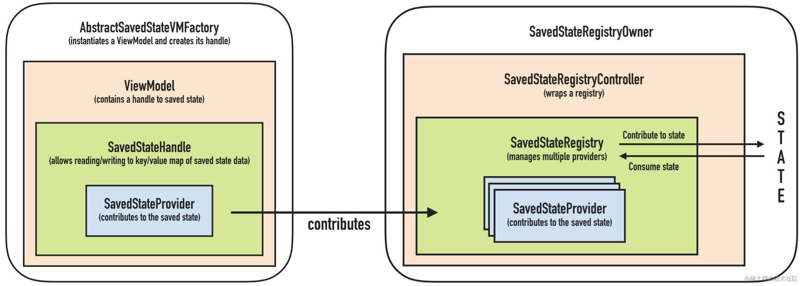

# 2023/8/1

## 安卓

### 保存界面状态

|                                        | ViewModel | 保存的实例状态 | 永久性存储空间 |
| -------------------------------------- | --------- | -------------- | -------------- |
| 存储位置                               | 在内存中  | 在内存中       | 在磁盘或网络上 |
| 在配置更改后继续存在                   | 是        | 是             | 是             |
| 在系统发起的进程终止后继续存在         | 否        | 是             | 是             |
| 在用户完全关闭activity或触发onFinish() | 否        | 否             | 是             |

> 保存的实例状态包括：`onSaveInstanceState()`和`rememberSaveable API`，以及 `SavedStateHandle`（作为 ViewModel 的一部分）。


#### 使用 onSaveInstanceState() 保存简单轻量的界面状态

当您的 Activity 开始停止时，系统会调用 [`onSaveInstanceState()`](https://developer.android.google.cn/reference/android/app/Activity?hl=zh-cn#onSaveInstanceState(android.os.Bundle)) 方法，以便您的 Activity 可以将状态信息保存到实例状态 Bundle 中。此方法的默认实现保存有关 Activity 视图层次结构状态的瞬时信息，例如 EditText 微件中的文本或  ListView 微件的滚动位置。

```java
static final String STATE_SCORE = "playerScore";
static final String STATE_LEVEL = "playerLevel";
// ...

@Override
public void onSaveInstanceState(Bundle savedInstanceState) {
    // Save the user's current game state
    savedInstanceState.putInt(STATE_SCORE, currentScore);
    savedInstanceState.putInt(STATE_LEVEL, currentLevel);

    // Always call the superclass so it can save the view hierarchy state
    super.onSaveInstanceState(savedInstanceState);
}
```

> 当用户显示关闭Activity时，或者在其他情况下调用finish()时，系统不会调用onSaveInstanceState()。


#### 使用保存的实例状态恢复 Activity 界面状态

重建先前被销毁的 Activity 后，您可以从系统传递给 Activity 的 Bundle 中恢复保存的实例状态。onCreate() 和 onRestoreInstanceState() 回调方法均会收到包含实例状态信息的相同 Bundle。

因为无论系统是新建 Activity 实例还是重新创建之前的实例，都会调用 onCreate() 方法，所以在尝试读取之前，您必须检查状态 Bundle 是否为 null。如果为 null，系统将新建 Activity 实例，而不会恢复之前销毁的实例。

例如，以下代码段显示如何在 onCreate() 中恢复某些状态数据：

```java
@Override
protected void onCreate(Bundle savedInstanceState) {
    super.onCreate(savedInstanceState); // Always call the superclass first

    // Check whether we're recreating a previously destroyed instance
    if (savedInstanceState != null) {
        // Restore value of members from saved state
        currentScore = savedInstanceState.getInt(STATE_SCORE);
        currentLevel = savedInstanceState.getInt(STATE_LEVEL);
    } else {
        // Probably initialize members with default values for a new instance
    }
    // ...
}
```

您可以选择实现系统在 onStart() 方法之后调用的 onRestoreInstanceState()，而不是在 onCreate() 期间恢复状态。仅当存在要恢复的已保存状态时，系统才会调用 onRestoreInstanceState()，因此您无需检查 Bundle 是否为 null：

```java
public void onRestoreInstanceState(Bundle savedInstanceState) {
    // Always call the superclass so it can restore the view hierarchy
    super.onRestoreInstanceState(savedInstanceState);

    // Restore state members from saved instance
    currentScore = savedInstanceState.getInt(STATE_SCORE);
    currentLevel = savedInstanceState.getInt(STATE_LEVEL);
}
```


### androidx SaveState

[掘金](https://juejin.cn/post/6844904097351467015#heading-8)

`SavedStateProvider`——保存状态的组件，此状态将在以后恢复并使用

`SavedStateRegistry`——管理 SaveStateProvider 列表的组件，此注册表绑定了其所有者的生命周期（即activity或fragment）。每次创建生命周期所有者都会创建一个新的实例

`SavedStateRegistryController`——一个包装 SavedStateRegistry 并允许通过其2个主要方法对其进行控制的组件：performRestore(savedState) 和 performSave(outBundle )。 这两个方法将内部通过 SavedStateRegistry 中的方法处理 。

`★SavedStateRegistryOwner`——持有 SavedStateRegistry 的组件。 默认情况下，androidx 包中的 ComponentActivity 和 Fragment 都实现此接口。


#### Activity状态保存

view状态、成员状态，此外还负责保存其内部的fragment的状态（FragmentActivity的onSaveInstanceState）


#### Fragment状态保存

使用`FragmentStateManager`来处理fragment的状态保存

+ saveState

+ saveBasicState

+ saveViewState

+ saveInstanceState

  

其调用链为 activity 通过 `FragmentController` 间接 调用 `FragmentManager` 的 `saveAllState`，接着依次调用后面的save 方法。

Fragment 的状态保存可分为 view 状态，成员状态，child fragment 状态

关于 view 状态 , `FragmentStateManager` 提供了 `saveViewSate` 方法，它的调用有两处：

1. 在 activity 或父 fragment 触发状态保存时调用，即上述流程
2. 在 fragment 即将进入 `onDestroyView` 生命周期时调用，其位置在 `FragmentManager` moveToState 方法内部，这解释了为什么加入返回栈的 replace 操作在返回时 view 状态可以自动恢复

关于成员状态，由 activity 中的状态机制处理，即上节内容

关于 child fragment 状态，fragment 的 `onCreate` 方法会调用 `restoreChildFragmentState` 来恢复 child fragment 的状态，并在 `FragmentStateManager` 中的 `saveBasicState` 方法中 调用 `performSaveInstanceState` 来保存 child fragment 的状态


#### ViewModel-SavedState

`Jetpack MVVM` 下 UI State 通常被 `ViewModel` 持有并存储，因此该模块出现了，配置该模块后，`ViewModel` 对象将通过其构造函数接收 `SavedStateHandle` 对象（键值映射），可让您保存状态并查询已保存的状态。 这些值将在系统终止进程后继续存在，并可以通过同一对象使用。


工作流程




```ko
ViewModelProvider(this).get(MyViewModel::class.java)
```

在 activity 中创建 ViewModel 实例，传入 this （`SavedStateRegistryOwner`）作为参数，该参数可以访问其 `SavedStateRegistry`，如果没有传入 factory 会通过 activity 重写的 `getDefaultViewModelProviderFactory` 方法来获取默认的 factory 。然后 factory 将使用保存的状态， 将其包装在 `SavedStateHandle` 中，并将其传递给 ViewModel。 ViewModel 可以读取和写入该 handle

当 activity 的 `onSaveInstanceState(outState)` 方法被调用，其 `SavedStateRegistry` 的 `performSave(outState)` 方法将被执行，其内部的所有 `SavedStateProvider` 的 `saveState` 方法均被执行，一旦执行完毕，`outState` 就包含了已保存的状态

当 app 被重启后，activity 和新的 registry 将被创建，activity 的 `onCreate(savedInstanceState)` 方法会被调用，然后 registry 的 `performRestore(savedInstanceState)` 将被调用以便恢复之前保存的状态


### ViewModel职责——Fragment之间共享数据

[掘金](https://juejin.cn/post/6844904100493017095)

由于 两个 fragment 使用的都是 activity 范围的 `ViewModel` （`ViewModelProvider` 构造器传入的 activity ），因此它们获得了相同的 ViewModel 实例，自然其持有的数据也是相同的，这也 **保证了数据的一致性**


ViewModel源码分析

首先我们要先了解一下 `ViewModel` 的结构

- `ViewModel`：抽象类，主要有 clear 方法，它是 final 级，不可修改，clear 方法中包含 onClear 钩子，开发者可重写 onClear 方法来自定义数据的清空
- `ViewModelStore`：内部维护一个 HashMap 以管理 `ViewModel`
- `ViewModelStoreOwner`：接口，`ViewModelStore` 的作用域，实现类为 `ComponentActivity` 和 `Fragment`，此外还有 `FragmentActivity.HostCallbacks`
- `ViewModelProvider`：用于创建 `ViewModel`，其构造方法有两个参数，第一个参数传入 `ViewModelStoreOwner` ，确定了 `ViewModelStore` 的作用域，第二个参数为 `ViewModelProvider.Factory`，用于初始化 `ViewModel` 对象，默认为 `getDefaultViewModelProviderFactory()` 方法获取的 factory

简单来说 **ViewModelStoreOwner 持有 ViewModelStore 持有 ViewModel**

