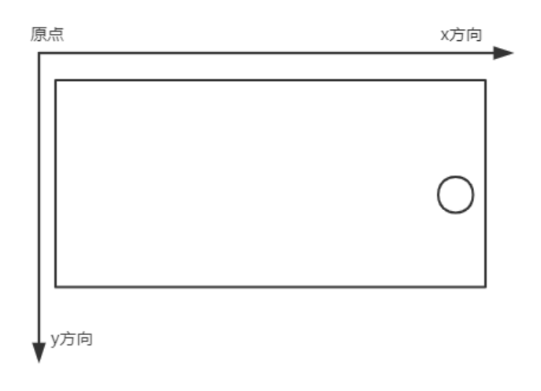
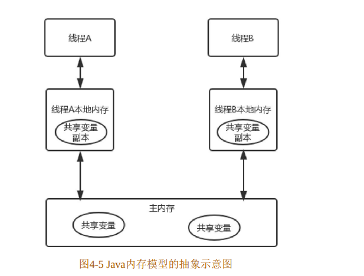

# 2023/09/04

## 安卓

### Camera

[掘金](https://juejin.cn/post/6844903966556291079?searchId=202309040943067C5EF25F54E4A3D3201D#heading-7)

orientation

首先先知道四个方向：**屏幕坐标方向**，**自然方向**，**图像传感器方向**，**相机预览方向**。

屏幕坐标方向：

在Android系统中，以屏幕左上角为坐标系统的原点(0,0)坐标，向右延伸是X轴的正方向，向下延伸是y轴的正方向，如上图所示。

自然方向：

`android:screenOrientation`来控制`activity`启动时的方向，默认值`unspecified`即为自然方向，当然可以取值为：

- unspecified，默认值，自然方向
- landscape，强制横屏显示，正常拿设备的时候，宽比高长，这是平板的自然方向
- portrait，正常拿着设备的时候，宽比高短，这是手机的自然方向
- behind：和前一个Activity方向相同
- sensor：根据物理传感器方向转动，用户90度，180度，270度旋转手机方向
- sensorLandScape：横屏选择，一般横屏游戏会这样设置
- sensorPortait:竖屏旋转
- nosensor:旋转设备的时候，界面不会跟着旋转，初始化界面方向由系统控制
- user：用户当前设置的方向

图像传感器方向：

手机相机的图像数据都是来自于摄像头硬件的图像传感器，这个传感器在被固定到手机上后有一个默认的取景方向，方向一般是和手机横屏方向一致，如下图：



和竖屏应用方向呈90度。

相机预览方向：

将图像传感器捕获的图像，显示在屏幕上的方向。在默认情况下，和**图像传感器方向**一致，在相机API中可以通过`setDisplayOrientation(int degrees)`设置预览方向(顺时针设置，不是逆时针)。默认情况下，这个值是0。


### android基础

[掘金](https://juejin.cn/post/6844903891625050119?searchId=202309011500300390DE372D85D0B87D6B#heading-2)

#### Service

+ IntentService
+ startService生命周期
+ bindService生命周期

#### Fragment

##### transaction add

一种是add方式来进行show和add，这种方式你切换fragment不会让fragment重新刷新，只会调用**onHiddenChanged(boolean isHidden)**。


#### 横版运行

设置宽度

AndroidManifest.xml加上

```
<meta-data
    android:name="design_width_in_dp"
    android:value="640"/>
```

竖版用360或者不填


#### fragment懒加载

[CSDN](https://blog.csdn.net/u011315960/article/details/71404177)

重写Fragment的setUserVisibleHint()

当Fragment没有直接显示给用户（如滚动出了屏幕），会返回false，值得注意的是这个方法可能在Fragment的生命周期以外调用。


#### setUserVisibleHint和onHiddenChanged方法区别说明

[源码分析](https://www.freesion.com/article/8911606164/)

**onHiddenChanged**

isHidden字段发生变化时触发，用FragmentTransaction来控制fragment的hide和show时，那么这个方法就会被调用。

（ps：第一次add时是不会调用onHiddenChanged的，只有当一个Fragment之前的状态是hidden，然后show，这时候才会调用onHiddenChanged，或者之前的状态是show，然后置为hidden时，也会回调onHiddenChanged）

> 使用情况：你自己去管理Fragment，而不是用viewpager管理的时候

**setUserVisibleHint**

isVisible字段发生变化时触发，多用于ViewPager管理fragment时触发。使用viewpager的时候，viewpager内部有个提前缓存的机制，但此时的状态是不可见的。但个时候Fragment不会去调用上面说的onHiddenChanged方法，只会调用setUserVisibleHint这个方法

> 使用情况：多用于ViewPager控制fragment显隐时触发此方法


### 内存

[每日笔记-2023-06:3011    Java类加载内存分析](每日笔记-2023-06)

[掘金](https://juejin.cn/post/7236903196148334629?searchId=2023091110443770F2C257EE3063B83933#heading-7)

#### DVM

Dalvik 本质上也是一个Java虚拟机 文件格式-dex

DVM的堆结构与JVM的堆结构有所区别，主要体现在**将堆分成了Active堆和Zygote堆**

#### JIT 和 AOT 区别

- Just In Time

  DVM 使用 JIT 编译器，每次应用运行时，它实时的将一部分 dex 字节码翻译成机器码。在程序的执行过程中，更多的代码被编译缓存，由于 JIT 只翻译一部分代码，它消耗更少的内存，占用更少的物理内存空间

- Ahead Of Time

  ART 内置了一个 AOT 编译器，在应用安装期间，她将 dex 字节码编译成机器码存储在设备的存储器上，这个过程旨在应用安装到设备的时候发生，由于不在需要 JIT 编译，代码的执行速度回快很多


[51博客](https://blog.51cto.com/u_14153136/3150535)

[掘金](https://juejin.cn/post/7057538798686568461?searchId=20231024145524BDA07908B05A17FFEC59)

#### Java运行时数据区

**1.程序计数器**(JVM 中唯一不会发生OOM的内存区域)

主要是作为当前线程执行时的字节码行号指示器来使用的，当线程执行一个 Java 方法时，记录线程正在执行的字节码指令地址，当执行引擎处理完某个指令后，程序计数器需要进行对应更新，将指针改向下一条要执行的指令地址，执行引擎会根据 PC 计数器中记录的地址进行对应的指令执行。当线程在执行一些由`C/C++`编写的`Native`方法时，PC 计数器中则为空（`Undefined`）。除此作用之外，也可以保证线程发生 CPU 时间片切换后能恢复到正确的位置执行。

**2.虚拟机栈**(可能抛出 StackOverFlowError 和 OutOfMemoryError)
栈帧：栈帧存储方法的相关信息，包含**局部变量表、返回值、操作数栈、动态链接**。
*一个栈帧对应一个方法调用*
（a）局部变量表：包含了方法执行过程中的所有变量。局部变量数组所需要的空间在编译期间完成分配，在方法运行期间不会改变局部变量数组的大小。

> 局部变量表中存储的数据只对于当前方法中有效，虚拟机在执行时，依靠于操作数栈与局部变量表中存储的数据完成执行操作。方法执行结束后，局部变量表会随着栈帧的的出栈/销毁而随之销毁。一般而言，如果当前方法属于构造方法或实例方法，那么这些方法的局部变量表中下标为`0`的槽位必然存储的是`this`引用，也就是局部变量表中的第一个位置会被用来放当前方法所属的对象引用，其他的局部变量会按照顺序在局部变量表中进行存储。如下图：
>
> 

（b）返回值：如果有返回值的话，压入调用者栈帧中的操作数栈中，并且把PC的值指向方法调用指令后面的一条指令地址。

> 一个方法当开始被执行引擎执行时，只有两种情况会导致方法退出，一种是在执行过程中遇到了正常返回的字节码指令，如：`ireturn、lreturn、dreturn、areturn、return`，释义如下：
>
> - `ireturn`：返回值为`int、byte、char、short、boolean`类型时使用该指令返回
> - `lreturn`：返回值为`long`类型时使用该指令返回
> - `dreturn`：返回值为`double`类型时使用该指令返回
> - `areturn`：返回值为引用类型时使用该指令返回
> - `return`：无返回`void`、类或接口初始化方法时使用该指令返回
>
> 方法正常执行完成后退出的情况被称为**正常完成出口**，一般执行返回的字节码指令时，调用者的程序计数器会被作为返回的地址。
>
> 除开正常执行完成后退出的情况外，还有一种情况也会导致方法的退出，那就是方法执行过程中出现了异常，并且在方法体中没有处理该异常（没有`try/catch`），此时也会导致方法退出，这种情况下被称为**异常完成出口**，返回地址则需要通过异常处理器表来确定。
>
> 当一个方法执行结束退出时，会执行如下步骤：
>
> - ①复原上层方法的局部变量表以及操作数栈。
> - ②如果当前方法有返回值的情况下，把返回值压入调用者方法栈帧的操作数栈中。
> - ③将PC计数器的地址指向改为方法下一条指令的位置，从而使得调用者正常工作。
> - PS：异常退出的情况下，是不会给上层调用者返回任何值的。

（c）操作数栈：操作变量的内存模型。操作数栈的最大深度在编译的时候已经确定（写入方法区`code`属性的`max_stacks`项中）。操作数栈的元素可以是任意Java类型，包括long和double，32位数据占用栈空间为1,64位数据占用2。方法刚开始执行的时候，栈是空的，当方法执行过程中，各种字节码指令往栈中存取数据。
（d）动态链接：每个栈帧中都持有在运行时常量池中该栈帧所属方法的引用，持有这个引用是为了支持方法中的动态链接（比如`invokedynamic`指令的调用）

> 在Java源文件被编译成Class文件时，类中所有的变量、方法调用都会化为符号引用，然后保存在`class`文件的常量池中，在`class`文件中描述一个方法调用另一个方法时，就使用常量池中指向方法的符号引用来表示的。动态链接的作用就是为了将这些符号引用转换为调用方法的直接引用。

> 常量池：位于编译后生成的`class`字节码文件中。
> 运行时常量池：位于运行期间的元数据空间/方法区中。

[虚拟机栈的特点与运行原理](https://juejin.cn/post/7057538798686568461?searchId=20231024145524BDA07908B05A17FFEC59#heading-4)


**3.本地方法栈**(可能抛出 StackOverFlowError 和 OutOfMemoryError)

存储Java程序 native 方法的调用栈

**4.方法区**(可能抛出 OutOfMemoryError)

用于存储已被虚拟机加载的类信息、常量、静态变量、即时编译后的代码等数据

**5.堆**(可能抛出 OutOfMemoryError)

大部分 JVM 调优手段是基于堆空间进行展开
（a）Java堆是虚拟机管理的内存中最大的一块
（b）在虚拟机启动时创建
（c）此内存区域的唯一目的就是存放对象事例，几乎所有对象实例都在这里分配内存。存放new生成的对象和数组
（d）Java堆是垃圾收集器管理的内存区域，因此很多时候称为GC堆

[Java 堆空间](https://juejin.cn/post/7057538798686568461?searchId=20231024145524BDA07908B05A17FFEC59#heading-13)

Java堆同时也是变化比较频繁的区域，在不同Java版本中，堆空间也发生了不同的改变：

- JDK7及之前：堆空间包含新生代、年老代以及永久代。
- JDK8：堆空间包含新生代和年老代，永久代被改为元数据空间，位于堆之外。
- JDK9：堆空间从逻辑上保留了分代的概念，但物理上本身不分代。
- JDK11：堆空间从此以后逻辑和物理上都不分代。

本质上来说，影响堆空间结构的并不是Java版本的不同，Java堆结构是跟JVM运行时所使用的垃圾回收器息息相关的，由GC器决定了运行时的堆空间会被划分为何种结构。

> 在JDK1.8及之前的Java版本中，几乎所有的GC器都会把堆空间划分为至少两个区域：新生代和年老代，但在JDK1.9到之后的GC器中，大多数的GC器开始了不分代的路子（具体原因稍后分析）。


前三个是线程私有的，方法区和堆是所有线程共享的


#### Java内存模型——JMM

1.Java并发采用共享内存模型，线程之间通过读写内存的公共状态进行通讯。多个线程之间不能通过直接传递数据交互的，他们之间交互只能通过共享变量实现

2.主要目的是定义程序中各个变量的访问规则

3.Java内存模型规定所有变量都存储在主内存中，每个线程还有自己的工作内存。
（a）线程的工作内存中保存了被该线程使用到的变量的拷贝（从主内存中拷贝过来），线程对变量的所有操作都必须在工作内存中执行，而不能直接访问主内存中的变量。
（b）不同线程之间无法直接访问对方工作内存的变量，线程间变量值的传递都要通过主内存来完成
（c）主内存主要对应Java堆中实例数据部分。工作内存对应于虚拟机栈中部分区域。

4.Java线程之间的通信由内存模型JMM控制。
（a）JMM决定一个线程对变量的写入何时对另一线程可见。
（b）线程之间共享变量存储在主内存中。
（c）每个线程有一个私有的本地内存，里面存储了读/写共享变量的副本。
（d）JMM通过控制每个线程的本地内存的交互，来为程序员提供内存可见性保证。

5.可见性、有序性
（a）当一个共享变量在多个本地内存中有副本时，如果一个本地内存修改了该变量的副本，其他变量应该能够看到修改后的值，此为可见性。
（b）保证线程的有序执行，这个为有效性（保证线程安全）。

6.内存间交互操作
（a）lock（锁定）：作用于主内存的变量，把一个变量标识为一条线程独占状态。
（b）unlock（解锁）：作用于主内存的变量，把一个处于锁定状态的变量释放出来，释放后的变量才可以被其他线程锁定。
（c）read（读取）：作用于主内存变量，把主内存的一个变量读取到工作内存中。
（d）load（载入）：作用于工作内存，把read操作读取到工作内存的变量载入到工作内存的变量副本中。
（e）use（使用）：作用于工作内存的变量，把工作内存中的变量值传递给一个执行引擎。
（f）assign（赋值）：作用于工作内存的变量，把执行引擎收到的值赋值给工作内存的变量。
（g）store（存储）：把工作内存的变量的值传递给主内存。
（h）write（写入）：把store操作的值写入到主内存中

>  注意：
>
> 1. 不允许read、load、store、write操作之一单独出现
> 2. 不允许一个线程丢弃assign操作
> 3. 不允许一个线程不经过assign操作，就把工作内存中的值同步到主内存中
> 4. 一个新的变量只能在主内存中生成
> 5. 一个变量同一时刻只允许一条线程对其进行lock操作，但lock操作可以被同一条线程执行多次，只有执行相同次数的unlock操作，变量才会解锁
> 6. 如果对一个变量进行lock操作，将会清空工作内存中次变量的值，在执行引擎使用这个变量前，需要重新执行load或者assign操作初始化变量的值
> 7. 如果一个变量没有被锁定，不允许对其执行unlock操作，也不允许unlock一个被其他线程锁定的变量
> 8. 对一个变量执行unlock操作之前，需要将该变量同步回主内存中


### 垃圾收集算法

Java语言会自动分配和回收内存，其中内存回收是由 JVM 中的垃圾回收器来提供支持的。在 JVM 中，内存分配的 基本单位是对象，所以内存回收也是以对象为单位来回收的。

垃圾收集过程分成两步：

0. 标记哪些对象需要回收；
1. 怎么回收这些对象。

标记内存中哪些对象需要回收的算法由两种，分别是引用计数器法和可达性分析法。

**引用计数器法**

引用计数器法指的是在每个对象中维护一个计数器，当有一个地方引用它时计数器就加一，当一个引用失效时计数器就减一，当计数器为 0 的时候判定对象是垃圾内存，需要回收。

引用计数器法需要解决循环引用的问题，即两个对象互相引用，其他再没有地方引用它们，这时它们应该算是需要被回收对象才对，但是它们的引用计数器却不是 0。

**可达性分析法**

可达性分析法指通过一系列被称为 “GC Roots” 的根对象作为起始节点集，从这些节点开始根据引用关系向下搜索，在搜索过程中能够遍历到的对象就是存活的对象，没有遍历到的对象就是垃圾对象，需要回收。

> 值得注意的是，所有的垃圾收集器使用的判断对象是否可回收的算法都是**可达性分析法**。因为可达性分析法没有循环引用的问题，而要解决引用计数器法的循环引用问题，带来的复杂性和性能消耗可能会得不偿失。


确定了哪些内存可以回收之后我们需要确定怎么回收，在 Java 虚拟机发展过程中出现了许多垃圾收集算法。

**标记-清理算法**

分为标记和清理两个步骤，其中标记是使用前面介绍的可达性分析法将可回收对象标记出来，标记结束后，统一回收掉所有的被标记对象。

标记-清理算法会造成大量不连续的内存碎片，因为给对象分配内存需要连续的内存空间，如果空间碎片太多的话会出现当前总的内存可用空间大于需要分配的空间，但是连续的内存可用空间都小于需要分配的内存，从而导致 JVM 需要提前触发垃圾收集动作。

**标记-复制算法**

标记-复制算法将内存按容量划分为大小相等的两块，每次只使用其中一块，当这一块内存用完了之后就将存活的对象复制到另外一块内存中，然后吧一块的内存一次清理掉。

因为每次垃圾收集之后都会将存活对象复制到另外一块内存区域，这里的复制和后续的新对象分配都是从内存区域的开头开始分配的，所以不会存在空间碎片的问题，但是这种算法的缺点也明显，只能使用可用内存空间的一半，空间浪费非常严重。

**标记-整理算法**

标记-整理算法的标记阶段和标记-清理算法一样，先标记出所有可回收对象，然后让所有存活对象向内存空间的一端移动，最后直接清理掉最后一个存活对象之后的所有内存控件，移动存活对象时就像整理一个个货物，所以它被称为标记-整理算法。

标记-整理算法看似比前两种算法都优秀，因为它既没有空间碎片的问题也没有空间浪费的问题，但是在整理过程中需要移动存活对象，移动之后需要更新所有引用这些对象的地方，这是一项非常中的操作。


## GPT

### Q：fragment创建时会调用onhiddenchanged吗？

> A：在 Fragment 创建时，`onHiddenChanged` 方法不会被调用。`onHiddenChanged` 方法是在 Fragment 的可见性发生变化时被调用的，并不是在 Fragment 创建时被调用的。
>
> 当 Fragment 所属的 Activity 第一次创建时，会依次调用 `onAttach()`、`onCreate()`、`onCreateView()`、`onActivityCreated()` 等方法，此时并不会触发 `onHiddenChanged` 方法。
>
> `onHiddenChanged` 方法通常在 Fragment 已经创建并添加到 Activity 中后，通过切换 Fragment 的显示状态来调用。例如，当某个 Fragment 通过 `show()` 或 `hide()` 方法显示或隐藏时，`onHiddenChanged` 方法会被调用。
>
> 如果你需要在 Fragment 创建时执行某些操作，可以考虑重写其他适合的生命周期方法，例如 `onCreate()`, `onViewCreated()`, `onActivityCreated()`, 或者在 `Fragment` 类的构造函数中执行初始化的操作。


### Q：fragment创建时会调用setUserVisibleHint吗

> A：在最新的 AndroidX 版本中，`setUserVisibleHint()` 方法已被废弃，并不会在 Fragment 的创建时调用。该方法在 Fragment 生命周期中的使用已经不推荐。
>
> 之前，`setUserVisibleHint()` 方法用于指示 Fragment 的可见性状态。然而，从 AndroidX 版本开始，为了更好地支持 ViewPager2 等新的界面元素，引入了 `FragmentTransaction.commitNowAllowingStateLoss()` 方法，这种方式忽略了 `setUserVisibleHint()` 的调用。
>
> 取而代之的是，开发者应该在 Fragment 的生命周期方法中使用 `onHiddenChanged()` 方法来监听和处理 Fragment 的可见状态变化。当 Fragment 的可见性发生变化时，系统会调用 `onHiddenChanged()` 方法，并传递一个表示新的可见性状态的参数。
>
> 如果你使用 `setUserVisibleHint()` 方法来控制 Fragment 的可见性，请考虑迁移到使用 `onHiddenChanged()` 方法。这样可以更好地适应新的 AndroidX 版本，并确保代码的兼容性。


Q：同一个观察者被调用多次注册观察，被观察者发生改变时，观察者会响应多次吗？

> A：当同一个观察者多次注册观察同一个被观察者时，在被观察者发生改变时，观察者只会收到一次响应。
>
> 在 Android 的观察者模式中，当你通过调用 `observe()` 方法注册观察者时，如果多次注册同一个观察者，后续的注册将覆盖之前的注册。也就是说，同一个观察者只会绑定到最新的注册位置，并且只有最新的注册位置才会接收到被观察者的通知。
>
> 因此，无论有多少次重复的注册操作，当被观察者发生改变时，观察者只会收到一次通知。这种机制确保了观察者对于被观察者状态的响应是一致的，避免了重复的通知和逻辑冗余。
>
> 需要注意的是，如果在注册观察者之前已经有先前的注册观察者操作，那么需要确保在不需要观察时及时移除观察者，以避免潜在的内存泄漏问题。可以使用 `removeObserver()` 方法来移除观察者。


# 2023/09/14

## 安卓

### 重入锁与条件对象

重入锁ReentrantLock支持一个线程对资源的重复加锁

ReentrantLock保护代码块的结构如下：

```java
Lock mLock = new ReetrantLock();
mLock.lock();
try{
    ···
}
finally {
    mLock.unlock();
}
```

这一结构确保任何时刻只有一个线程进入临界区，临界区就是在同一时刻只能有一个任务访问的代码区。一旦一个线程封锁了锁对象，其他任何线程都无法进入Lock语句。把解锁的操作放在finally中是十分必要的。如果在临界区发生了异常，锁是必须要释放的，否则其他线程将会永远被阻塞。进入临界区时，却发现在某一个条件满足之后，它才能执行。这时可以使用一个条件对象来管理那些已经获得了一个锁但是却不能做有用工作的线程，条件对象又被称作条件变量。


一个锁对象有多个相关的条件对象，可以用newCondition方法获得一个条件对，得到条件对象后调用await方法，当前线程就被阻塞了并放弃了锁（自动调用，区别于finally中的unlock）。


一旦一个线程调用 await 方法，它就会进入该条件的等待集并处于阻塞状态，直到另一个线程调用了同 一个条件的signalAll方法时为止。当另一个线程转账给我们此前的转账方时，只要调用 condition.signalAll（），就会重新激活因为这一条件而等待的所有线程。


当调用signalAll方法时并不是立即激活一个等待线程，它仅仅解除了等待线程的阻塞，以便这些线程能 够在当前线程退出同步方法后，通过竞争实现对对象的访问。还有一个方法是signal，它则是随机解除某个 线程的阻塞。如果该线程仍然不能运行，则再次被阻塞。如果没有其他线程再次调用signal，那么系统就死锁了。


### 同步方法

Lock和 Condition接口为程序设计人员提供了高度的锁定控制，然而大多数情况下，并不需要那样的控制，并且可以使用一种嵌入到Java语言内部的机制。从Java 1.0版开始，Java中的每一个对象都有一个内部 锁。如果一个方法用 synchronized 关键字声明，那么对象的锁将保护整个方法。也就是说，要调用该方 法，线程必须获得内部的对象锁。

> 具体来说，当一个线程调用`synchronized`修饰的方法时，它会先尝试获取**该方法所属对象**的锁。如果锁可用，即没有其他线程持有该锁，那么该线程将获取到该对象的锁，并进入方法的执行。在方法执行期间，其他试图获取该对象锁的线程将被阻塞，直到当前线程释放锁。
>
> 这意味着同一个对象的其他`synchronized`方法在同一时间只能由一个线程执行，其他线程需要等待锁的释放。如果有**多个对象实例**，那么它们之间的锁是**相互独立**的，互不影响。

```java
public synchronized void method() {
    ···
}

//等价于
    
Lock mLock = new ReetrantLock();
public void method(){
    mLock.lock();
    try {
    ···
    } finally {
        mLock.unlock();
    }
}
```

对于上面支付宝转账的例子，我们可以将Alipay类的transfer方法声明为synchronized，而不是使用一个显式的锁。内部对象锁只有一个相关条件，wait方法将一个线程添加到等待集中，notifyAll或者notify方法解除等待线程的阻塞状态。也就是说wait相当于调用condition.await()，notifyAll等价于condition.signalAll()

> `synchronized`修饰的方法或代码块。这意味着，在一个线程获取到对象锁并执行`synchronized`方法时，其他线程必须等待对象锁的释放，才能获取到锁并执行相应的`synchronized`方法。
>
> 非`synchronized`方法（如`method3()`）与`synchronized`方法之间的同时执行不会产生互斥


### Java内存模型



原子性
简单的读取和赋值（将数字赋值给某个变量）才是原子性操作

可见性
线程之间的可见性，一个线程修改的状态对另一个线程是可见的。当一个共享变量被volatile修饰时，它会保证修改的值立即被更新到主存，所以对其他线程是可见的。而普通的共享变量不能保证可见性，因为普通共享变量被修改之后，并不会立即写入主存，何时被写入主存也是不确定的，当其他线程去读取该值时，主存中可能还是原来的旧值。

有序性
JMM允许编译器和处理器对指令重排序，重排序不影响单线程执行的正确性，但影响多线程并发的正确性。这时可以通过volatile来保证有序性，除了volatile也可以通过synchronized和Lock来保证有序性。


### volatile

volatile不保证原子性

> 尽管volatile保证可见，但如果自增操作中，线程1读取了变量inc的原始值后被阻塞，线程2对inc又进行了自增操作，线程2结束后线程1再执行加一操作，不会再去主存读最新的数值。

volatile保证有序性

禁止指令重排序：1、程序执行到volatile变量的操作时，其前面的操作已经全部执行完毕，并且结果会对后面的操作可见，在其后面的操作还没有进行；2、在进行指令优化时，在volatile变量之前的语句不能再volatile变量后面执行；同样，在volatile变量之后的语句也不能在volatile变量前面执行。


使用volatile必须具备以下两个条件：

+ 对变量的写操作不会依赖当前值
+ 该变量没有包含在其他变量的不变式中

第一个条件就是不能是自增自减等操作，第二个条件指不参与其他变量的约束条件、不被其他变量所依赖或不影响其他变量的状态。


volatile使用场景

1.状态标志

```java
volatile boolean shutdownRequested;
···
public void shutdown() {
    shutdownRequested = true;
}
public void doWork() {
    while (!shutdownRequested) {
        ···
    }
}
```

如果在另一个线程中调用shutdown方法，就需要执行某种同步来确保正确实现shutdownRequested变量的可见性。


2.双重检查模式（DCL）

```java
public class Singleton { 
    private volatile static Singleton instance = null;
    public static Singleton getInstance() {
        if (instance == null) {
            synchronized(this) {
                if (instance == null) {
                    instance = new Singleton();
                }
            }
        }
        return instance;
    }
}
```


小结 

与锁相比，volatile变量是一种非常简单但同时又非常脆弱的同步机制，它在某些情况下将提供优于锁 的性能和伸缩性。如果严格遵循volatile的使用条件，即变量真正独立于其他变量和自己以前的值，在某些 情况下可以使用volatile代替synchronized来简化代码。然而，使用volatile的代码往往比使用锁的代码更加容 易出错。在前面的小节中介绍了可以使用 volatile 代替synchronized的最常见的两种用例，在其他情况 下我们最好还是使用synchronized。 


### 阻塞队列

常见阻塞场景：

1、队列中没有数据，消费者端的所有线程都会被自动阻塞，直到有数据放入队列。

2、队列中填满数据，生产者端的所有线程都会被自动阻塞，直到队列中有空的位置，线程被自动唤醒。


BlockingQueue的核心方法

放入数据：

+ offer(anObject)：将anObject加到BlockingQueue，如果可以容纳返回true，否则返回false。
+ offer(E o, long timeout, TimeUnit unit) ：可以设定等待的时间。如果在指定的时间内还不能往队列中加入BlockingQueue，则返回失败。
+ put(anObject)：将anObject加到BlockingQueue里，如果没有空间，则调用此方法的线程被阻断，直到BlockingQueue里面有空间再继续。

获取数据：

+ poll(time)：取走BlockingQueue里排在首位的对象。若不能立即取出，则可以等time参数规定的时间。取不到时返回null。
+ poll(long timeout, TimeUnit unit)：取出队首的对象，如果在指定时间内，队列一旦有数据可取，则立即返回队列中的数据，否则直到时间超时还没有数据可取，返回失败。
+ take()：取走BlockingQueue里排在首位的对象。若BlockingQueue为空，则阻断进入等待状态，直到BlockingQueue有新的数据被加入。
+ drainTo()：一次性从BlockingQueue获取所有可用的数据对象（还可以指定获取数据的个数）。


**Java中阻塞队列**

+ ArrayBlockingQueue：由数组结构组成的有界阻塞队列
+ LinkedBlockingQueue：由链表结构组成的有界阻塞队列
+ PriorityBlockingQueue：支持优先级排序的无界阻塞队列
+ DelayQueue：使用的优先级队列实现的无界阻塞队列
+ SynchronousQueue：不存储元素的阻塞队列
+ LinkedTransferQueue：由链表结构组成的无界阻塞队列
+ LinkedBlockingDeque：由链表结构组成的双向阻塞队列


