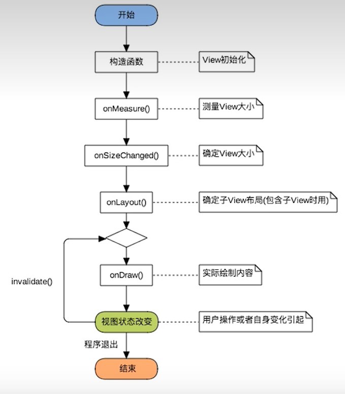
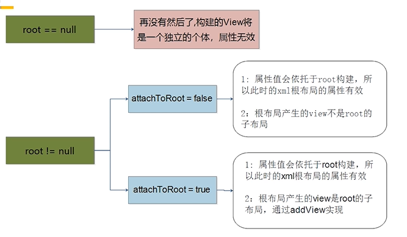

# 2023-5-15

## Typora

### 插入图片

复制到指定路径


## 安卓

### 约束布局

#### 12个约束（略）

```java
app:layout_constraintBaseline_toBaselineof="parent"
```


#### 约束布局的辅助控件（Guideline、Barrier）

Guideline

```java
orientation
layout_constraintGuide_begin	xxdp
layout_constraintGuide_end		xxdp
layout_constraintGuide_percent	百分比布局
```

Barrier

```java
app:barrierDirection="end"
app:constraint_referenced_ids="username1,password1"
```


#### 偏移bias

```java
app:layout_constaintHorizontal_bias="0.5"
```

> 注：锚点相同bias无效，如start和end约束到同一位置


#### Group

```java
app:constraint_referenced_ids="tv1,tv4,tv5"
```

解决嵌套问题

统一管理几个控件，显示、隐藏


#### margin

某个方向的margin加了约束才起作用

当约束的控件不可见时设置一个margin
```java
android:goneMarginLeft="10dp"
```


#### 约束布局 当成线性布局

链 均匀分布

链首部有一个`layout_constrainHorizontal_chainStyle`

`spread`：均匀分布，默认值
`spread_inside`：两端对齐
`packed`：合在一块

`layout_constraintHorizontal_weight`设置权重


#### 角度布局


#### 约束布局 当成表格布局

Flow


#### 设置宽高比

`app:layout_constraintDimensionRatio="16:9"`


#### 其他

width="wrap_content"时超出约束长度加强制约束`layout_constraintWidth="true"`。

width=0dp时有个`layout_constraintWidth_default`属性
默认值为`spread`，会使`maxWidth`无效，使用`app:layout_constraintWidth_max`
`wrap`和wrap_content一个效果，超出和加强制约束效果一样

可以做到左边文本控件过长时不会挤压到右边控件


ConstraintHelper	1.x	guidline group barrier placeHolder
									2.x	自定义辅助控件


# 2023/5/16

## 安卓

## Room数据库迁移（Migration）

[CSDN——Room数据库的迁移](https://blog.csdn.net/u013762572/article/details/106315045)

#### Room 都干了些啥

Room 提供了一个抽象层来来缓解 SQLite 的迁移，展现形式是以 `Migration` 类 来实现的。Migration 类定义了从指定版本迁移到另外一个版本的动作。Room 使用了它自己的 SQLiteOpenHelper 的实现，在 onUpgrade 方法中，将会触发你定义的迁移动作。
这里展示了当第一次进入数据将会发生的事情：

1. Room 数据将会被建立
2. SQLiteOpenHelper.onUpgrade 被调用，Room触发迁移动作
3. 数据库被打开

如果你没有提供迁移策略，但是你却增加了数据库版本，你的app可能会被崩溃或者你的数据将会被丢失，至于产生的结果，基于我们将会谈到的情形。

在迁移中，一个很重要的点就是 `identity hash String`. Room 就是通过唯一这个 `identity String` 区分数据库的版本。当前的数据库中有个 `configuration table` 保存了 identity String. 如果不要太惊讶你查看数据库时会有一张 `room_maste_table` 表。


#### 使用

+ 版本更新`version=2`
+ 提供迁移策略databaseBuilder.addMigrations(MIGRATION_1_2)，如果使用.fallbackToDestructiveMigration则表示破坏性迁移，清空数据。定义Migration类变量MIGRATION_1_2重写migrate()
+ 


### RecyclerView

#### LinearlayManager

getChildCount返回的是当前可见范围内一共有几个子View，

getItemCount返回当前RecyclerView一共会有多少个子View。


# 2023/5/17

## 安卓

### 下拉刷新、上拉加载

下拉刷新上拉加载封装布局[supereasyrefreshlayout](https://github.com/guozhengXia/SuperEasyRefreshLayout)

### AsyncTask

[Thread与AsyncTask](https://www.cnblogs.com/BobGo/p/5598270.html)

异步任务

必须要明白的一点是，Thread是Java语言下的一个底层类，而Android是使用并封装了Java语言的系统，所以Android中的AsyncTask只是使用了Java的多线程概念并优化封装之后的一个抽象类。所以Thread和AsyncTask完全是两个不同层次的概念，而不是简单的替换。

AsyncTask是作为异步任务，执行除了UI界面更新的任务之外的其他耗时操作的。UI界面的更新是在主线程，也就是UI线程中执行的，而在这个异步任务中，开启了一个工作线程来执行耗时操作。而这个工作线程和UI线程的执行顺序是不同步的，也就是说只有执行完工作线程中的下载之后，才会调用UI线程中的onPostExecute()执行后续UI操作，这样就实现了异步下载。如果UI线程销毁之后工作线程再发送下载结束的信息，由于工作线程再使用过程中是与AsyncTask绑定的，所以他也会随着当前AsyncTask的销毁而销毁，不会执行后续的下载操作，自然也不会执行发送下载结束的信息。

```
Android异步网络请求可以使用AsyncTask类来实现，AsyncTask是Android提供的一个用于处理异步任务的工具类，它使用三个泛型参数Params、Progress和Result来指定任务的输入、进度和结果类型。

使用AsyncTask实现异步网络请求的步骤如下：

1. 创建一个AsyncTask子类，指定三个泛型参数，其中Params参数指定发起网络请求时所需要的参数类型，Progress参数指定进度更新时的参数类型，Result参数指定返回结果的参数类型。

2. 在AsyncTask子类中实现doInBackground方法，在此方法中完成网络请求任务。

3. 在doInBackground方法中调用publishProgress方法更新任务的进度，该方法会触发onProgressUpdate回调方法，在onProgressUpdate方法中更新UI界面显示任务的进度。

4. 在doInBackground方法执行完成后，会将执行的结果作为参数传递给onPostExecute方法，在onPostExecute方法中更新UI界面显示任务的执行结果。

5. 在需要发起网络请求时，创建AsyncTask子类的实例，并调用execute方法来执行任务。
```

每个Task的doInBackground都是顺序执行的，**由此可以证明，在Android Q上，AsyncTask默认是串行执行异步任务的。**


# 2023/5/18

## 安卓

### 自定义View

[自定义View](https://www.bilibili.com/video/BV1Wh411f7ud/?p=3&spm_id_from=pageDriver&vd_source=bf286743c0f79ff4e4df2222645065d3)

分类

+ 自定义View，没有现成的View需要自己实现，一般继承自View，SurfaceView或其他View

+ 自定义ViewGroup，利用现有组件根据特定布局方式组成新的组件，大多继承自ViewGroup或各种Layout


绘制流程

onMeasure()→onLayout()→onDraw()



自定义View主要实现onMeasure和onDraw

自定义ViewGroup主要实现onMeasure和onLayout


自定义view三个构造函数
//上下文
//反射（xml中使用）
//主题style（白天/黑夜模式）


LayoutParams是ViewGroup中的类
有两个参数int width，int height，对应xml中layout_width和layout_height
两个值MATCH_PARENT：-1，WRAP_CONTENT：-2

 

MeasureSpec是View中内部类，二进制计算，由于int32位，高两位表示mode，低30位表示size，MODE_SHIFT = 30作用是移位

> UNSPECIFIED（00）：不对View大小做限制
> EXACTLY（01）：确切的大小，如100dp
> AT_MOST（10）：大小不可超过某数值，如matchParent


onMeasure 用来计算精准的数值

performTraversals


### 自定义View Layout内部布局

[Android自定义View之Layout内部布局自定义](https://blog.csdn.net/weixin_51065489/article/details/126465781)

onMeasure()的重写

+ 调用每个子View的measure()，让子View自我测量
+ 根据子View的尺寸得出子View的位置，并保存它们的位置
+ 根据子View的位置和尺寸计算出自己的尺寸，并用setMeasuredDimension()保存


LayoutInflater.inflate()用于解析xml文件

```java
public View inflate(XmlPullParse parser, ViewGroup root, boolean attachToRoot) {
    ···
    //如果root为null就不解析
    if(root!=null) {
        params.root.generateLayoutParams(attrs);
        if(!attachToRoot) {
            temp.setLayoutParams(params);
        }
    }
    
    ···
}

```




### @SuppressLint

抑制警告

