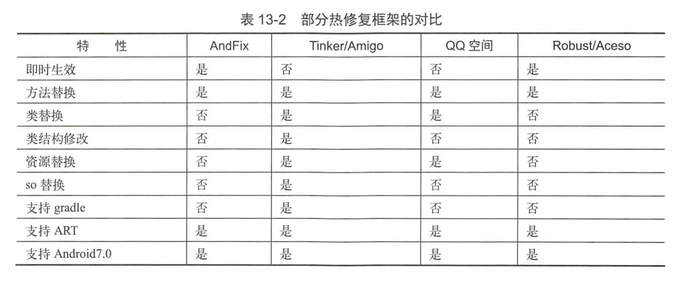
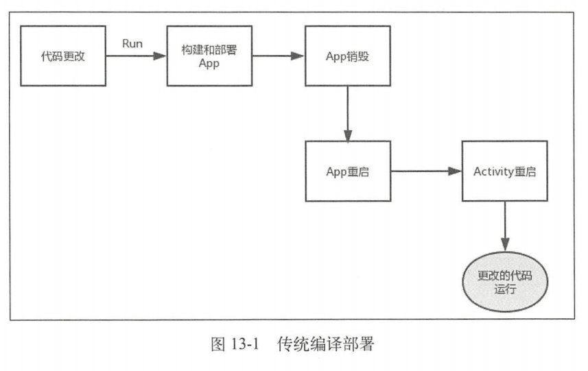
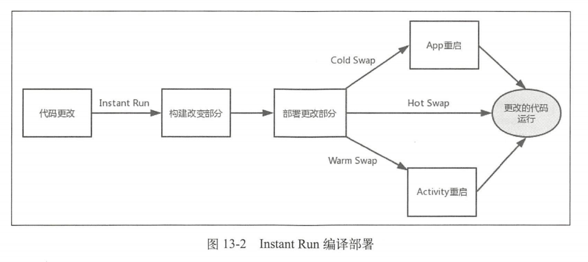
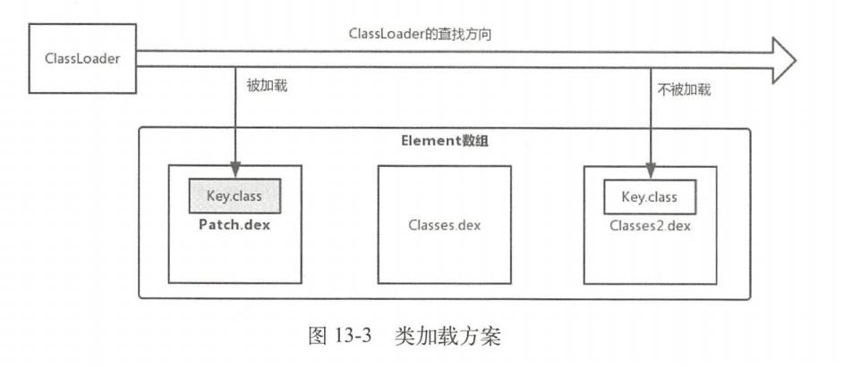

## 热修复

### 13.1 热修复的产生

在开发过程中可能遇到如下情况：

+ 刚发布的版本出现了严重的Bug，这就需要去解决Bug、测试并打包在各个应用市场上重新发布，这会消耗大量的人力和物力，代价会较大
+ 已经改正了此前发布版本的Bug，如果下一个版本是一个大版本，那么两个版本的间隔时间会很长，这样要等到下个大版本发布在修复Bug，此前版本的Bug会长期地影响用户
+ 版本升级效率不高，并且需要很长时间来完成版本覆盖，此前版本的Bug就会一致影响不升级版本的用户
+ 有一个小而重要的功能，需要短时间内完成版本覆盖，比如节日活动

为了解决上面问题，热修复框架就产生了。


### 13.2 热修复框架的种类和对比

热修复框架的种类繁多，按照公司团队划分主要有如表13-1所示的几种。


虽然热修复框架很多，但热修复框架的核心技术主要有三类，分别是**代码修复**、**资源修复**和**动态链接库修复**，其中每个核心技术又有很多不同的技术方案，每个技术方案又有不同的实现，另外这些热修复框架仍在不断地更新迭代中，可见热修复框架的技术实现是繁多可变的。

部分热修复框架的对比如表13-2所示。



对于即时生效，AndFix、Robust和Aceso都满足这一点，这是因为AndFix的代码修复采用了底层替换方案，而Robust和Aceso的代码修复借鉴了Instant Run原理，这些原理后文会进行介绍。


### 13.3 资源修复

很多热修复的框架的资源修复参考了Instant Run的资源修复的原理，因此我们首先要了解Instant Run是什么。

#### 13.3.1 Instant Run概述

Instant Run是Android Studio 2.0以后新增的一个运行机制，能够显著减少开发人员第二次及以后地构建和部署时间。在没有使用Instant Run前，我们编译部署应用程序的流程如图13-1所示。



传统的编译部署需要重新安装App和重启App，这显然会很耗时，Instant Run会避免这一情况，如图13-2所示。



从图13-2可以看出Instant Run的构建和部署都是基于更改的部分的。Instant Run部署有三种方式，Instant Run会根据代码的情况来决定采用哪种部署方式，无论哪种方式都不需要重新安装App，这一点就已经提高了不少的效率。

+ Hot Swap：从名称也可以看出Hot Swap是效率最高的部署方式，代码的增量改变不需要重启App，甚至不需要重启当前的Activity。修改一个现有方法中的代码时会采用Hot Swap。
+ Warm Swap：App不需要重启，但是Activity需要重启。修改或删除一个现有的资源文件时会采用Warm Swap。
+ Cold Swap：App需要重启，但是不需要重新安装。采用Cold Swap的情况很多，比如添加、删除或修改一个字段和方法、添加一个类等。


#### 13.3.2 Instant Run的资源修复

既然很多热修复的框架资源修复参考了Instant Run的资源修复原理，那么我们了解Instant Run的资源修复原理就可以了。Instant Run并不是Android的源码，需要通过反编译获取。

Instant Run资源修复的核心逻辑在MonkeyPatcher的monkeyPatchExistingResources方法中，如下所示：

com/android/tools/fd/runtime/MonkeyPatcher.java

```java
public static void monkeyPatchExistingResources(Context context, String externalResourceFile, Collection<Activity> activities) {
    if (externalResourceFile == null) {
        return;
    }
    try {
        //创建一个新的 AssetManager
        AssetManager newAssetManager = (AssetManager)AssetManager.class.getConstructor(new Class[0]).newInstance(newObject[0]);//1
        Method mAddAssetPath = AssetManager.class.getDeclaredMethod(
            "addAssetPath",new Class[]{String.class});//2
        mAddAssetPath.setAccessible(true);
        //通过反射调用 addAssetPath 方法加载外部的资源(SD 卡)
        if (((Integer) mAddAssetPath.invokenewAssetManager,new Object[] {externalResourceFile })).intValue() == 0) {//3
            throw new IllegalStateException("Could not create new AssetManager");
        }
        Method mEnsureStringBlocks = AssetManager.class.getDeclaredMethod("ensureStringBlocks",new Class[0]);
        mEnsureStringBlocks.setAccessible(true);
        mEnsureStringBlocks.invoke(newAssetManager,new Object[0]);
        if (activities!=null) {
            for (Activity activity :activities) {
                Resources resources = activity.getResources();//4
                try {
                    //反射得到 Resources 的 AssetManager 类型的 mAssets 字段
                    Field mAssets = Resources.class.getDeclaredField("mAssets");//5
                    mAssets.setAccessible(true);
                    //将mAssets 字段的引用替换为新创建的AssetManager
                    mAssets.set(resources, newAssetManager);//6
                } catch (Throwable ignore) {
                    ...
                }
                //得到Activity的Resources.Theme
                Resources.Theme theme = activity.getTheme();
                try {
                    try {
                        //反射得到 Resources.Theme 的 mAssets 字段
                        Field ma = Resources.Theme.class.getDeclaredField("mAssets");
                        ma.setAccessible(true);
                        //将Resources.Theme 的mAssets 字段替换为newAssetManager
                        ma.set(theme，newAssetManager);//7
                    } catch (NoSuchFileException ignore) {
                        ···
                    }
                    ···
                } catch (Throwable e) {
                    Log.e("InstantRun","Failed to update existing theme for activity " + activity,e);
                }
                pruneResourceCaches(resources);
            }
        }
        /**
         * 根据SDK版本的不同，用不同的方式得到Resources的弱引用集合
         */
        Collection<WeakReference<Resource>> references;
        if(Build.VERSION.SDK_INT>=19) {
            Class<?> resourcesManagerClass = Class.forName("android.app.ResourceManager");
            Method mGetInstance = resourcesManagerClass.getDeclaredMethod("getInstance", new Class[0]);
            mGetInstance.setAccessible(true);
            Object resourcesManager = mGetInstance.invoke(null,new Object[0]);
            try {
                Field fMActiveResources =resourcesManagerClass.getDeclaredField("mActiveResources");
                fMActiveResources.setAccessible(true);
                ArrayMap<?,WeakReference<Resources>> arrayMap=(ArrayMap)fMActiveResources.get(resourcesManager);
                references = arrayMap.values();
            } catch (NoSuchFieldException ignore) {
                Field mResourceReferences = resourcesManagerClass.getDeclaredField("mResourceReferences");
                mResourceReferences.setAccessible(true);
                references = (Collection) mResourceReferences.get(resourcesManager);
            }
        } else {
            Class<?> activityThread = Class.forName("android.app.ActivityThread");
            Field fMActivityResources = activityThread.getDeclaredField("mActiveResources");
            fMActiveResources.setAccessible(true);
            Object thread = getActivityThread(context,activityThread);
            HashMap<?，WeakReference<Resources>> map = (HashMap) fMActiveResources.get(thread);
            references = map.values();
        }
        //遍历并得到弱引用集合中的Resources，将 Resources 的 mAssets 字段引用替换成新的AssetManager
        for (WeakReference<Resources> wr : references) {
            Resources resources = (Resources) wr.get();
            if (resources !=null) {
                try {
                    Field mAssets = Resources.class.getDeclaredField("mAssets");
                    mAssets.setAccessible(true);
                    mAssets.set(resources,newAssetManager);
                } catch (Throwable ignore) {
                    ···
                }
                resources.updateConfiquration(resources,getConfiguration(),
                                              resources.getDisplayMetrics());   
            }
        }
    } catch (Throwable e) {
        throw new IlleqalStateException(e);
    }
}
```

在注释1处创建一个新的 **`AssetManager`**，在注释2和注释3处通过反射调用addAssetPath方法加载外部(SD卡)的资源。在注释4处遍历Activity列表，得到每个Activity的 Resources，在注释5处通过反射得到 **Resources 的 AssetManager 类型的 mAssets 字段**并在注释6处**改写 mAssets 字段的引用为新的AssetManage**r。采用同样的方式，在注释7处**将 Resources.Theme 的 mAssets 字段的引用替换为新创建的 AssetManager**。紧接着根据 SDK 版本的不同，用不同的方式得到 Resources 的弱引用集合，再遍历这个弱引用集合将**弱引用集合中的 Resources的 mAssets 字段引用都替换成新创建的AssetManager。**
可以看出 Instant Run 中的资源热修复可以简单地总结为两个步骤：

**(1)创建新的AssetManager，通过反射调用 addAssetPath 方法加载外部的资源，这样新创建的AssetManager 就含有了外部资源。**

**(2)将 AssetManager 类型的 mAssets 字段的引用全部替换为新创建的AssetManager。**


### 13.4 代码修复

代码修复主要有3个方案，分别是底层替换方案、类加载方案和Instant Run方案。

#### 13.4.1 类加载方案

类加载方案**基于Dex分包方案**，什么是Dex分包方案？这个得先从65536限制和LinearAlloc限制说起。

**1.65536限制**

随着功能越来越复杂，代码量不断地增大，引入的库越来越多，可能会在编译时提示如下异常：

```
com.android.dex.DexIndexOverflowException:method ID not in [0,0xffff]:65536
```

这说明应用中引用的方法数超过了最大数65536个。产生这一问题的原因就是系统的65536限制，65536限制的主要原因是DVM Bytecode的限制，**DVM的指令集的方法调用指令invoke-kind索引为16bits，最多能引用65536个方法**。

**2.LinearAlloc限制**

在安装应用时可能会提示`INSTALL_FAILED_DEXOPT`，产生的原因就是LinearAlloc限制，DVM中的**LinearAlloc是一个固定的缓存区，当方法数超出了缓存区的大小时会报错**。


为了解决65536限制和LinearAlloc限制，从而产生了Dex分包方案。Dex分包方案主要做的是打包时将**应用代码分成多个Dex**，将**应用启动时必须用到的类和这些类的直接引用类放到主Dex中**，**其它代码放到次Dex中**。当应用启动时先加载主Dex，等到应用启动后再动态地加载次Dex，从而缓解了主Dex的65536限制和LinearAlloc限制

Dex分包方案主要有两种，分别是Google官方方案、Dex自动拆包和动态加载方案。因为Dex分包方案不是本章的重点，这里不过多介绍，我们接着来学习类加载方案。在12.2.3节中学习了ClassLoader的加载过程，其中一个环节就是调用DexPathList的findClass的方法，如下所示：

libcore/dalvik/src/main/java/dalvik/system/DexPathList.java

```java
public Class<?> findClass(String name, List<Throwable> suppressed) {
    for (Element element : dexElements) {//1
        Class<?> clazz = element,findClass(name,definingContext,suppressed);//2
        if (clazz!=null){
            return clazz;
        }
    }
    if(dexElementsSuppressedExceptions != null) {
        suppressed.addAll(Arrays.asList(dexElementsSuppressedExceptions));
    }
    return null;
}
```

Element内部封装了DexFile，DexFile用于加载dex文件，因此**每个dex文件对应一个Element**。多个Element组成了有序的Element数组dexElements。当要查找类时，会在注释1处遍历Element数组dexElements（相当于遍历dex文件数组），注释2处调用Element的findClass方法，其方法内部会调用DexFile的loadClassBinaryName方法查找类。如果在Element中（dex文件）找到了该类就返回，如果没有找到就接着在下一个Element中进行查找。根据上面的查找流程，**我们将有Bug的类Key.class进行修改，再将Key.class打包成包含dex的补丁包Patch.jar，放在Element数组dexElements的第一个元素**，这样会首先找到Patch.dex中的Key.class去替换之前存在Bug的Key.class，排在数组后面的dex文件中存在Bug的Key.class，排在数组后面的dex文件中存在Bug的Key.class根据ClassLoader的双亲委托模式就不会被加载，这就是类加载方案，如图13-3所示。



类加载方案需要重启App后让ClassLoader重新加载新的类，为什么需要重启呢？这是因为类是无法被卸载的，要想重新加载新的类就需要重启App，因此采用类加载方案的热修复框架不能是即时生效的。虽然很多热修复框架采用了类加载方案，但具体的实现细节和步骤还是有一些区别的，比如QQ空间的超级补丁和Nuwa是按照上面说的将补丁包放在Element数组的第一个元素得到优先加载。微信Tinker**将新旧APK做了diff，得到patch.dex，再将patch.dex与手机中APK的classes.dex做合并，生成新的classes.dex，然后在运行时通过反射将classes.dex放在Element数组的第一个元素**。饿了么的Amigo则是**将补丁包中每个dex对应的Elements取出来，之后组成新的Element数组，在运行时通过反射用新的Element数组替换掉现有的Element数组**。

采用类加载方案的主要是以腾讯系为主，包括微信的Tinker、QQ空间的超级补丁、手机QQ的QFix、饿了么的Amigo和Nuwa等。

#### 13.4.2 底层替换方案

与类加载方案不同的是，底层替换方案不会再次加载新类，而是**直接在Native层修改原有类**，由于在原有类进行修改限制会比较多，**且不能增减原有类的方法和字段**，**如果我们增加了方法数，那么方法索引数也会增加**，这样访问方法时会**无法通过索引找到正确的方法**，同样的字段也是类似的情况。底层替换方案和反射的原理有些关联，就拿方法替换来说，方法反射我们可以调用java.lang.Class.getDeclaredMethod，假设我们要反射Key的show方法，会调用如下所示的代码：

```
Key.class.getDeclaredMethod("show").invoke(Key.class.newInstance());
```

Android 8.0 的invoke方法，如下所示：

libcore/ojluni/src/main/java/java/lang/reflect/Method.java

```java
@FastNative
public native Object invoke(Object obj, Object... args)
    throw IllegalAccessException,IllegalArgumentException,Invocation TargetException;
```

invoke方法是一个native方法，对于Jni层的代码为：

art/runtime/native/java_lang_reflect_Method.cc

```cpp
static jobject Method_invoke(JNIEnv* env, jobject javaMethod,jobject javaReceiver,jobject javaArgs) {
    ScopedFastNativeObjectAccess soa(env);
    return InvokeMethod(soa, javaMethod, javaReceiver, javaArgs);
}
```

在Method_invoke函数中又调用了InvokeMethod函数：

art/runtime/reflection.cc

```cpp
jobject InvokeMethod(const ScopeObjectAccessAlreadyRunnable& soa, jobject javaMethod, jobject javaReceiver,jobject javaArgs,size_t num_frames) {
    ···
    ObjPtr<mirror::Executable> executable = soa.Decode<mirror::Executable>(javaMethod);
    const bool accessible = executable->IsAccessible();
    ArtMethod* m = executable->GetArtMethod();//1
    ···
}
```

注释1处**获取传入的`javaMethod`（Key的show方法）在ART虚拟机中对应的一个`ArtMethod`指针**，ArtMethod结构体中包含了Java方法的所有信息，包括执行入口、访问权限、所属类和代码执行地址等，ArtMethod结构如下所示：

art/runtime/art_method.h

```c++
class ArtMethod FINAL {
    ···
    protect:
    GcRoot<mirror::Class> declaring_class_;
    std::atomic<std::uint32_t> access_flags_;
    uint32_t dex_code_item_offset_;
    uint32_t dex_method_index_;
    uint16_t method_idnex_;
    uint16_t hotness_count_;
    struct PtrSizedFields {
        ArtMethod** dex_cache_resolved_methods_;//1
        void* data_;
        void* entry_point_from_quick_compiled_code_;//2
    } ptr_sized_fields_;
}
```

在ArtMethod结构中比较重要的字段是注释1处的`dex_cache_resolved_methods`和注释2处的`entry_point_from_quick_compiled_code`，它们是方法的执行入口，当我们调用某一个方法时（比如Key的show方法），就会取得show方法的执行入口，通过执行入口就可以跳过去执行show方法。**替换ArtMethod结构体中的字段或者替换整个ArtMethod结构体，这就是底层替换方案**。AndFix采用的是替换ArtMethod结构体中的字段，这样会有兼容问题，因为厂商可能会修改ArtMethod结构体，导致方法替换失败。Sophix采用的是替换整个ArtMethod结构体，这样不会存在兼容问题。底层替换方案直接替换了方法，可以立即生效不需要重启。采用底层替换方案主要是阿里系为主，包括AndFix、Dexposed、阿里百川、Sophix。


#### 13.4.3 Instant Run方案

除了资源修复，代码修复同样可以借鉴Instant Run的原理，可以说Instant Run的出现推动了热修复框架的发展。**Instant Run在第一次构建APK时，使用ASM在每一个方法中注入了类似如下的代码**：

```c++
IncrementalChange localIncrementalChange = $change;//1
if (localIncrementalChange != null) {//2
    localIncrementalChange.access$dispatch("onCreate.(Landroid/os/Bundle;)V",new Object[] {this, paramBundle});
    return;
}
```

其中注释1处是一个成员变量localIncrementalChange，它的值为`$change`，$change实现了`IncrementalChange`这个抽象接口。当我们点击InstantRun时，如果方法没有变化则$change为null，就调用return，不做任何处理。**如果方法有变化，就生成替换类**，这里我们假设MainActivity的onCreate方法做了修改，就会**生成替换类`MainActivity$override`**，**这个类实现了IncrementalChange接口**，同时也会生成一个AppPatchesLoaderImpl类，这个类的getPatchedClasses方法会返回被修改的类的列表（里面包含了MainActivity），根据列表会将MainActivity的$change设置为MainActivity$override，因此满足了注释2处的条件，会执行`MainActivity$override`的`access$dispatch`方法，在access$dispatch方法中会根据参数"onCreate.(Landroid/os/Bundle;)V"执行"MainActivity$override"的onCreate方法，从而实现了onCreate方法的修改。借鉴Instant Run的原理的热修复框架有Robust和Aceso。

什么是ASM？

ASM是一个Java字节码操控框架，它能够动态生成类或者增强现有类的功能。ASM可以直接产生class文件，也可以在类被加载到虚拟机之前动态改变类的行为。


### 13.5 动态链接库的修复

Android平台的动态链接库主要指的是so库，为了更好理解，本章动态链接库简称为so。热修复框架的so的修复主要是更新so，换句话说就是重新加载so，因此so的修复的基础原理就是加载so。

#### 13.5.1 System的load和loadLibrary方法

加载so主要用到了System类的load和loadLibrary方法，如下所示：

libcore/ojluni/src/main/java/lang/System.java

```java
public final class System {
    ···
    @CallerSensitive
    public static void load(String filename) {
        Runtime.getRuntime().load0(VMStack.getStackClass1(), filename);//1
    }
    @CallerSensitive
    public static void loadLibrary(String libname) {
        Runtime.getRuntime().loadLibrary0(VMStack.getCallingClassLoader(), libname);//2
    }
    ···
}
```

System的load方法传入的参数是**so在磁盘的完整路径**，用于加载指定路径的so。System的loadLibrary方法传入的参数是**so的名称**，**用于加载App安装后自动从apk包中复制到/data/data/packagename/lib下的so**。目前so的修复都是基于这两个方法，这里分别对这两个方法进行讲解。

**1.System的load方法**

注释1处的Runtime.getRuntime()会得到当前Java应用程序的运行环境Runtime，Runtime的load0方法如下所示：

libcore/ojlun/src/main/java/java/lang/Runtime.java

```java
synchronized void load0(Class<?> fromClass, String filename) {
    if (!(new File(filename).isAbsolute())) {
        throw new UnsatisfieldLinkError("Excepting an absolute path of the library: "+filename);
    }
    if (filename == null) {
        throw new NullPointerException("filename==null");
    }
    String error = doLoad(filename,fromClass.getClassLoader());//1
    if (error!=null) {
        throw new UnsatisfieldLinkError(error);
    }
}
```

在注释1处调用了doLoad方法，并将加载该类的类加载器作为参数传入进去：

libcore/ojluni/src/main/java/java/lang/Runtime.java

```java
private String doLoad(String name, ClassLoader loader) {
    String librarySearchPath = null;
    if (loader != null && loader instanceof BaseDexClassLoader) {
        BaseDexClassLoader dexClassLoader = (BaseDexClassLoader) loader;
        librarySearchPath = dexClassLoader.getLdLibraryPath();
    }
    synchronized(this) {
        return nativeLoad(name,loader,librarySearchPath);
    }
}
```

doLoad方法会调用native方法nativeLoad，关于nativeLoad方法后面会讲到。

**2.System的loadLibrary方法**

我们接着来查看System的loadLibrary方法，其中会调用Runtime的loadLibrary0方法：

libcore/ojluni/src/main/java/java/lang/Runtime.java

```java
synchronized void loadLibrary0(ClassLoader loader, String libname) {
    if (libname.indexOf((int)File.separatorChar) != -1) {
        throw new UnsatisfiedLinkError("Directory separator should not appear in library name: " + libname);
    }
    String libraryName = libname;
    if (loader!=null) {
        String filename = loader.findLibrary(libraryName);//1
        if (filename == null) {
            throw new UnsatisfiedLinkError(loader + " couldn't find \"" + System.mapLibraryName(libraryName) + "\"");
        }
        String error = doLoad(filename,loader);//2
        if (error!=null) {
            throw new UnsatisfiedLinkError(error);
        }
        return;
    }
    
    String filename = System.mapLibraryName(libraryName);
    List<String> candidates = new ArrayList<String>();
    String lastError = null;
    for (String directory : getLibPath()) {//3
        String candidate = directory + filename;//4
        if (error == null) {
            return; // We successfully loaded the library. Job done.
        }
        lastError = error;
    }
    if (lastError != null) {
        throw new UnsatisfiedLinkError(lastError);
    }
    throw new UnsatisfiedLinkError("Library"+libraryName+ " not found; tried " + candidates);
}
```

loadLibrary0方法分为两部分，一个是**传入的ClassLoader不为null的部分**，另一个是**ClassLoader为null的部分**，我们先来看ClassLoader为null的部分。在注释3处遍历getLibPaths方法，这个方法会**返回java.library.path选项配置的路径数组**。在注释4处拼接处so路径并传入注释5处调用的doLoad方法。当ClassLoader不为null时，在注释2处同样调用了doLoad方法，其中第一个参数是通过**注释1处的ClassLoader的findLibrary方法来得到的**，findLibrary方法在ClassLoader的实现类BaseDexClassLoader中实现。

libcore/dalvik/src/main/java/dalvik/system/BaseDexClassLoader.java

```java
@Override
public String findLibrary(String name) {
    return pathList.findLibrary(name);
}
```

在findLibrary方法中调用了DexPathList的findLibrary方法：

libcore/dalvik/src/main/java/dalvik/system/DexPathList.java

```java
public String findLibrary(String libraryName) {
    String filename =  System.mapLibrary(libraryName);
    for (NativeLibraryElement element : nativeLibraryPathElements) {
        String path = element.findNativeLibrary(filename);//1
        if (path!=null) {
            return path;
        }
    }
    return null;
}
```

这和13.3.1节中讲到的DexPathList的findClass方法类似，在NativeLibraryElement数组中的每一个NativeLibraryElement对应一个so库，在注释1处调用NativeLibraryElement的findNativeLibrary方法就可以返回so的路径。上面的代码结合13.3.1节的类加载方案，就可以得到so的修复的一种方案，就是将so补丁插入到NativeLibraryElement数组的前部，让so补丁的路径优先被返回，并调用Runtime的doLoad方法进行加载，在doLoad方法中会调用native方法nativeLoad。看来**System的load方法和loadLibrary方法在Java FrameWork层最终调用的都是nativeLoad方法**。我们接着来分析nativeLoad方法。

#### 13.5.2 nativeLoad方法分析

nativeLoad方法对应的JNI层函数如下所示：

libcore/ojluni/src/main/native/Runtime.c

```cpp
JNIEXPORT jstring JNICALL
Runtime_nativeLoad(JNIEnv* env, jclass ignored, jstring javaFilename, jobject javaLoader, jstring javaLibrarySearchPath) {
    return JVM_NativeLoad(env, javaFilename, javaFilename, javaLoader, javaLibrarySearchPath);
}
```

在Runtime_nativeLoad函数中调用了JVM_NativeLoad函数：

art/runtime/openjdkjvm/OpenjdkJvm.cc

```cpp
JNIEXPORT jstring JVM_NativeLoad(JNIEnv* env, jstring javaFilename, jobject javaLoader, jstring javaLibrarySearchPath) {
    // 将so的文件名转换为ScopedUtfChars 类型
    ScopedUtfChars filename(env, javaFilename);
    if (filename.c_str() == NULL) {
        return NULL;
    }
    std::string error_msg;
    {
        // 获取当前运行时的虚拟机
        art::JavaVMExt* vm = art::Runtime::Current()->GetJavaVM();//1
        // 虚拟机加载so
        bool success = vm -> LoadNativeLibrary(env,filename.c_str(),javaLoader,javaLibrarySearchPath,&error_msg);
        if (success) {
            return nullptr;
        }
    }
    env->ExceptionClear();
    return env->NewStringUTF(error_msg.c_str());
}
```

在注释1处获取当前运行时的JavaVMExt类型指针，JavaVMExt用于代表一个虚拟机实例，紧接着调用JavaVMExt的LoadNativeLibrary函数来加载so。LoadNativeLoadLibrary函数代码有些多，这里分为3个部分来讲解。


