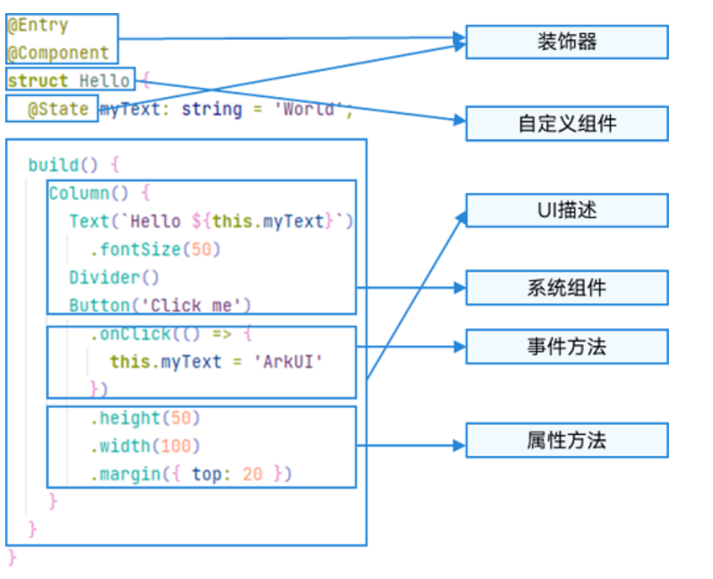
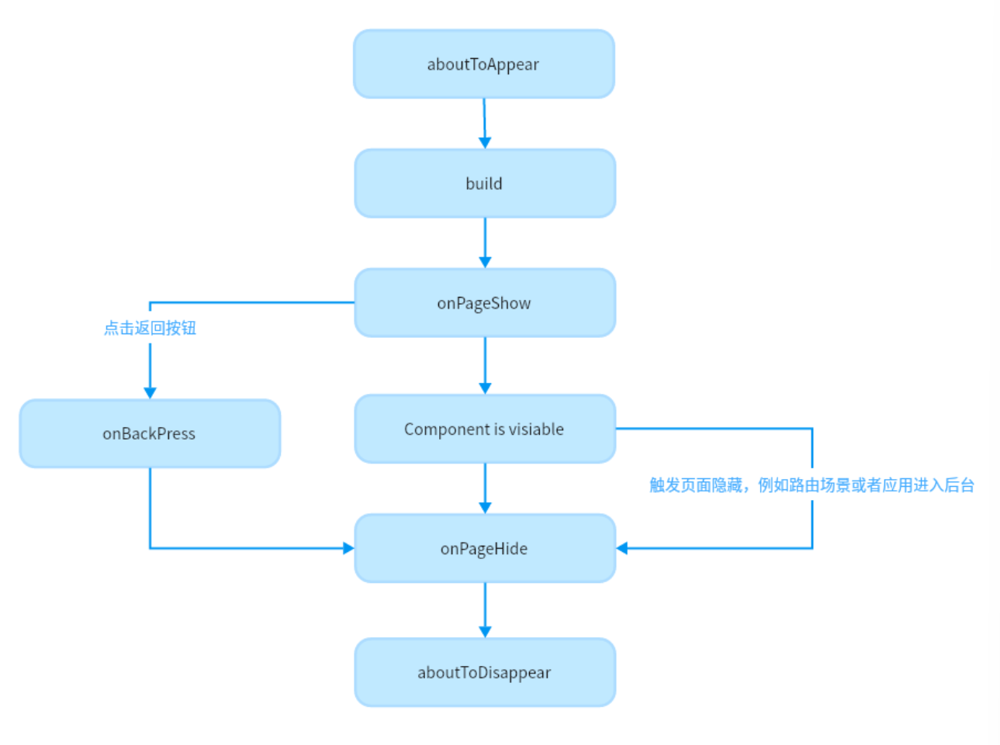
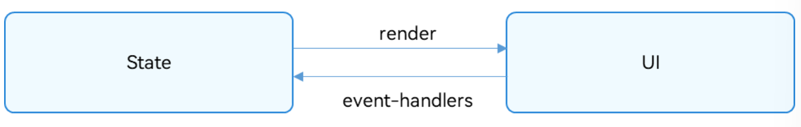
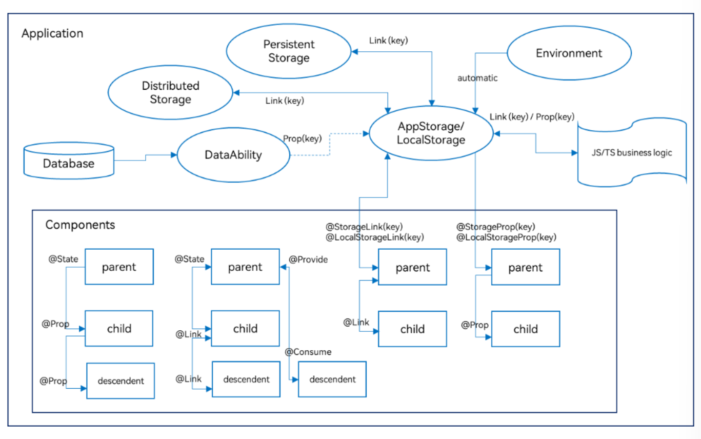
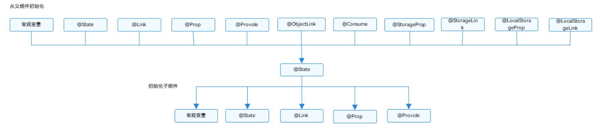
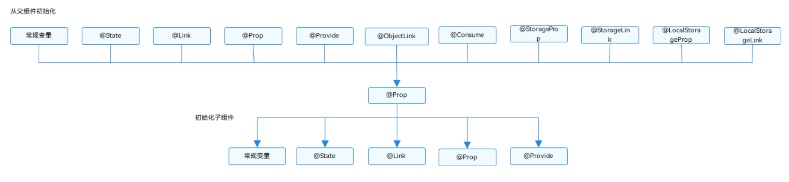

##　基本语法概述

在初步了解了ArkTS语言之后，我们以一个具体的示例来说明ArkTS的基本组成。如下图所示，当开发者点击按钮时，文本内容从“Hello World”变为“Hello ArkUI”。

ArkTS的基本组成



>  **说明**：
>
> 自定义变量不能与基础通用属性/事件名重复

+ 装饰器：用于装饰类、结构、方法以及变量，并赋予其特殊的含义。如上述示例中`@Entry`、`@Component`和`@State`都是装饰器，[@Component](https://docs.openharmony.cn/pages/v4.0/zh-cn/application-dev/quick-start/arkts-create-custom-components.md/#自定义组件的基本结构)表示**自定义组件**，[@Entry](https://docs.openharmony.cn/pages/v4.0/zh-cn/application-dev/quick-start/arkts-create-custom-components.md/#自定义组件的基本结构)表示该自定义组件为**入口组件**，[@State](https://docs.openharmony.cn/pages/v4.0/zh-cn/application-dev/quick-start/arkts-state.md/)表示组件中的**状态变量**，状态变量变化会触发UI刷新。
+ [UI描述](https://docs.openharmony.cn/pages/v4.0/zh-cn/application-dev/quick-start/arkts-declarative-ui-description.md/)：以声明式的方式来描述UI的结构，例如build()方法中的代码块。
+ [自定义组件](https://docs.openharmony.cn/pages/v4.0/zh-cn/application-dev/quick-start/arkts-create-custom-components.md/)：可复用的UI单元，可组合其他组件，如上述被@Component装饰的struct Hello。
+ 系统组件：ArkUI框架中默认内置的基础和容器组件，可直接被开发者调用，比如示例中的Column、Text、Divider、Button。

- 属性方法：组件可以通过链式调用配置多项属性，如fontSize()、width()、height()、backgroundColor()等。

- 事件方法：组件可以通过链式调用设置多个事件的响应逻辑，如跟随在Button后面的onClick()。

- 系统组件、属性方法、事件方法具体使用可参考[基于ArkTS的声明式开发范式](https://docs.openharmony.cn/pages/v4.0/zh-cn/application-dev/reference/arkui-ts/ts-universal-events-click.md/)。


##  创建自定义组件

在ArkUI中，UI显示的内容均为组件，由框架直接提供的称为系统组件，由开发者定义的称为自定义组件。在进行 UI 界面开发时，通常不是简单的将系统组件进行组合使用，而是需要考虑代码可复用性、业务逻辑与UI分离，后续版本演进等因素。因此，将UI和部分业务逻辑封装成自定义组件是不可或缺的能力。

自定义组件具有以下特点：

- 可组合：允许开发者组合使用系统组件、及其属性和方法。
- 可重用：自定义组件可以被其他组件重用，并作为不同的实例在不同的父组件或容器中使用。
- 数据驱动UI更新：**通过状态变量的改变，来驱动UI的刷新**。

### 自定义组件的基本用法

以下示例展示了自定义组件的基本用法。

```ts
@Component
struct HelloComponent {
  @State message: string = 'Hello, World!';

  build() {
    // HelloComponent自定义组件组合系统组件Row和Text
    Row() {
      Text(this.message)
        .onClick(() => {
          // 状态变量message的改变驱动UI刷新，UI从'Hello, World!'刷新为'Hello, ArkUI!'
          this.message = 'Hello, ArkUI!';
        })
    }
  }
}
```

> **注意：**
>
> 如果在另外的文件中引用该自定义组件，需要使用export关键字导出，并在使用的页面import该自定义组件。

HelloComponent可以在其他自定义组件中的build()函数中多次创建，实现自定义组件的重用。

```ts
class HelloComponentParam {
  message: string = ""
}

@Entry
@Component
struct ParentComponent {
  param: HelloComponentParam = {
    message: 'Hello, World!'
  }

  build() {
    Column() {
      Text('ArkUI message')
      HelloComponent(this.param);
      Divider()
      HelloComponent(this.param);
    }
  }
}
```


### 自定义组件的基本结构

- struct：**自定义组件基于struct实现**，`struct + 自定义组件名 + {…}`的组合构成自定义组件，**不能有继承关系**。对于struct的实例化，可以省略new。

  > **说明：**
  >
  > 自定义组件名、类名、函数名不能和系统组件名相同。

- @Component：@Component装饰器仅能装饰struct关键字声明的数据结构。**struct被@Component装饰后具备组件化的能力**，需要实现build方法描述UI，一个struct只能被一个@Component装饰。

  > **说明：**
  >
  > 从API version 9开始，该装饰器支持在ArkTS卡片中使用。

  ```ts
  @Component
  struct MyComponent {
  }
  ```

- build()函数：build()函数用于定义自定义组件的声明式UI描述，**自定义组件必须定义build()函数**。

  ```ts
  @Component
  struct MyComponent {
    build() {
    }
  }
  ```

- @Entry：@Entry装饰的自定义组件将作为UI页面的入口。在单个UI页面中，最多可以使用@Entry装饰一个自定义组件。@Entry可以接受一个可选的[LocalStorage](https://docs.openharmony.cn/pages/v4.0/zh-cn/application-dev/quick-start/arkts-localstorage.md/)的参数。

  > **说明：**
  >
  > 从API version 9开始，该装饰器支持在ArkTS卡片中使用。
  >
  > 从API version 10开始，@Entry可以接受一个可选的[LocalStorage](https://docs.openharmony.cn/pages/v4.0/zh-cn/application-dev/quick-start/arkts-localstorage.md/)的参数或者一个可选的[EntryOptions](https://docs.openharmony.cn/pages/v4.0/zh-cn/application-dev/quick-start/arkts-create-custom-components.md/#entryOptions)参数。

  ```ts
  @Entry
  @Component
  struct MyComponent {
  }
  ```


### EntryOptions10+

命名路由跳转选项。

| 名称      | 类型                                                         | 必填 | 说明                         |
| :-------- | :----------------------------------------------------------- | :--- | :--------------------------- |
| routeName | string                                                       | 否   | 表示作为命名路由页面的名字。 |
| storage   | [LocalStorage](https://docs.openharmony.cn/pages/v4.0/zh-cn/application-dev/quick-start/arkts-localstorage.md/) | 否   | 页面级的UI状态存储。         |

```ts
@Entry({ routeName : 'myPage' })
@Component
struct MyComponent {
}
```

- @Reusable：@Reusable装饰的自定义组件具备可复用能力

  > **说明：**
  >
  > 从API version 10开始，该装饰器支持在ArkTS卡片中使用。

  ```ts
  @Reusable
  @Component
  struct MyComponent {
  }
  ```


### 成员函数/变量

自定义组件除了必须要实现build()函数外，**还可以实现其他成员函数**，成员函数具有以下约束：

- 自定义组件的**成员函数为私有的**，且**不建议声明成静态函数**。

自定义组件可以包含**成员变量**，成员变量具有以下约束：

- 自定义组件的**成员变量为私有的**，且**不建议声明成静态变量**。
- 自定义组件的成员变量本地初始化有些是可选的，有些是必选的。具体是否需要本地初始化，是否需要从父组件通过参数传递初始化子组件的成员变量，请参考[状态管理](https://docs.openharmony.cn/pages/v4.0/zh-cn/application-dev/quick-start/arkts-state-management-overview.md/)。


### 自定义组件的参数规定

从上文的示例中，我们已经了解到，可以在build方法或者[@Builder](https://docs.openharmony.cn/pages/v4.0/zh-cn/application-dev/quick-start/arkts-builder.md/)装饰的函数里创建自定义组件，在创建自定义组件的过程中，根据装饰器的规则来初始化自定义组件的参数。

```ts
@Component
struct MyComponent {
  private countDownFrom: number = 0;
  private color: Color = Color.Blue;

  build() {
  }
}

@Entry
@Component
struct ParentComponent {
  private someColor: Color = Color.Pink;

  build() {
    Column() {
      // 创建MyComponent实例，并将创建MyComponent成员变量countDownFrom初始化为10，将成员变量color初始化为this.someColor
      MyComponent({ countDownFrom: 10, color: this.someColor })
    }
  }
}
```


### build()函数

所有声明在build()函数的语言，我们统称为UI描述，UI描述需要遵循一下规则：

+ `@Entry`装饰的自定义组件，其build()函数下的**根节点唯一且必要，且必须为容器组件**，其中**ForEach禁止作为根节点**。`@Component`装饰的自定义组件，其build()函数下的**根节点唯一且必要，可以为非容器组件**，其中**ForEach禁止作为根节点**。

  ```ts
  @Entry
  @Component
  struct MyComponent {
    build() {
      // 根节点唯一且必要，必须为容器组件
      Row() {
        ChildComponent() 
      }
    }
  }
  
  @Component
  struct ChildComponent {
    build() {
      // 根节点唯一且必要，可为非容器组件
      Image('test.jpg')
    }
  }
  ```

+ 不允许声明本地变量，反例如下。

  ```ts
  build() {
    // 反例：不允许声明本地变量
    let a: number = 1;
  }
  ```

+ 不允许在UI描述里直接只用console.info，但允许在方法或者函数里使用，反例如下。

  ```ts
  build() {
    // 反例：不允许console.info
    console.info('print debug log');
  }
  ```

+ 不允许创建本地的作用域，反例如下。

  ```ts
  build() {
    // 反例：不允许本地作用域
    {
      ...
    }
  }
  ```

+ **不允许调用没有用@Builder装饰的方法**，**允许系统组件的参数是TS方法的返回值**。

  ```ts
  @Component
  struct ParentComponent {
    doSomeCalculations() {
    }
  
    calcTextValue(): string {
      return 'Hello World';
    }
  
    @Builder doSomeRender() {
      Text(`Hello World`)
    }
  
    build() {
      Column() {
        // 反例：不能调用没有用@Builder装饰的方法
        this.doSomeCalculations();
        // 正例：可以调用
        this.doSomeRender();
        // 正例：参数可以为调用TS方法的返回值
        Text(this.calcTextValue())
      }
    }
  }
  ```

+ 不允许switch语法，如果需要使用条件判断，请使用if。反例如下。

  ```ts
  build() {
    Column() {
      // 反例：不允许使用switch语法
      switch (expression) {
        case 1:
          Text('...')
          break;
        case 2:
          Image('...')
          break;
        default:
          Text('...')
          break;
      }
    }
  }
  ```

+ 不允许使用表达式，反例如下。

  ```ts
  build() {
    Column() {
      // 反例：不允许使用表达式
      (this.aVar > 10) ? Text('...') : Image('...')
    }
  }
  ```

+ 不允许直接改变状态变量，反例如下。

  ```ts
  @Component
  struct CompA {
    @State col1: Color = Color.Yellow;
    @State col2: Color = Color.Green;
    @State count: number = 1;
    build() {
      Column() {
        // 应避免直接在Text组件内改变count的值
        Text(`${this.count++}`)
          .width(50)
          .height(50)
          .fontColor(this.col1)
          .onClick(() => {
            this.col2 = Color.Red;
          })
        Button("change col1").onClick(() =>{
          this.col1 = Color.Pink;
        })
      }
      .backgroundColor(this.col2)
    }
  }
  ```

  在ArkUI状态管理中，状态驱动UI更新。

  `UI = f(State)`

  所以，不能在自定义组件的build()或@Builder方法里直接改变状态变量，这可能会造成循环渲染的风险。Text(‘${this.count++}’)在全量更新或最小化更新会产生不同的影响：

  - 全量更新： ArkUI可能会陷入一个无限的重渲染的循环里，因为Text组件的每一次渲染都会改变应用的状态，就会再引起下一轮渲染的开启。 当 this.col2 更改时，都会执行整个build构建函数，因此，Text(`${this.count++}`)绑定的文本也会更改，每次重新渲染Text(`${this.count++}`)，又会使this.count状态变量更新，导致新一轮的build执行，从而陷入无限循环。
  - 最小化更新： 当 this.col2 更改时，只有Column组件会更新，Text组件不会更改。 只当 this.col1 更改时，会去更新整个Text组件，其所有属性函数都会执行，所以会看到Text(`${this.count++}`)自增。因为目前UI以组件为单位进行更新，如果组件上某一个属性发生改变，会更新整体的组件。所以整体的更新链路是：this.col1 = Color.Pink -> Text组件整体更新->this.count++ ->Text组件整体更新。值得注意的是，这种写法在初次渲染时会导致Text组件渲染两次，从而对性能产生影响。

  build函数中更改应用状态的行为可能会比上面的示例更加隐蔽，比如：

  - 在@Builder，@Extend或@Styles方法内改变状态变量 。

  - 在计算参数时调用函数中改变应用状态变量，例如 Text(‘${this.calcLabel()}’)。

  - 对当前数组做出修改，sort()改变了数组this.arr，随后的filter方法会返回一个新的数组。

    ```ts
    // 反例
    @State arr : Array<...> = [ ... ];
    ForEach(this.arr.sort().filter(...), 
      item => { 
      ...
    })
    // 正确的执行方式为：filter返回一个新数组，后面的sort方法才不会改变原数组this.arr
    ForEach(this.arr.filter(...).sort(), 
      item => { 
      ...
    })
    
    ```

    

### 自定义组件通用样式

自定义组件通过“.”链式调用的形式设置通用样式。

```ts
@Component
struct MyComponent2 {
  build() {
    Button(`Hello World`)
  }
}

@Entry
@Component
struct MyComponent {
  build() {
    Row() {
      MyComponent2()
        .width(200)
        .height(300)
        .backgroundColor(Color.Red)
    }
  }
}
```

> **说明：**
>
> ArkUI给自定义组件设置样式时，相当于给MyComponent2套了一个不可见的容器组件，而这些样式是设置在容器组件上的，而非直接设置给MyComponent2的Button组件。通过渲染结果我们可以很清楚的看到，背景颜色红色并没有直接生效在Button上，而是生效在Button所处的开发者不可见的容器组件上。


## 页面和自定义组件生命周期

在开始之前，我们先明确自定义组件和页面的关系：

+ 自定义组件：@Component装饰的UI单元，可以组合多个系统组件实现UI的复用，可以调用组件的生命周期。
+ 页面：即应用的UI页面。可以由一个或者多个自定义组件组成，@Entry装饰的自定义组件为页面的入口组件，即页面的根节点，一个页面有且仅能有一个@Entry。**只有被@Entry装饰的组件才可以调用页面的生命周期**

**页面生命周期**，即被@Entry装饰的组件生命周期，提供以下生命周期接口：

+ `onPageShow`：页面每次显示时触发一次，包括路由过程、应用进入前台等场景。
+ `onPageHide`：页面每次隐藏时触发一次，包括路由过程、应用今不如后台等场景。
+ `onBackPress`：当用户点击返回按钮时触发。

**组件生命周期**，即一般用@Component装饰的自定义组件的生命周期，提供以下生命周期接口：

+ `aboutToAppear`：组件即将出现时回调该接口，具体时机为在创建自定义组件的新实例后，在执行其build()函数之前执行。
+ `aboutToDisappear`：aboutToDisappear函数在自定义组件析构销毁之前执行。不允许在aboutToDisappear函数中改变状态变量，特别是@Link变量的修改可能会导致应用程序行为不稳定。

生命周期流程如下图所示，下图展示的是被@Entry装饰的组件（页面）生命周期。



根据上面的流程，我们从自定义组件的初始创建、重新渲染和删除来详细解释。


### 自定义组件的创建和渲染流程

1. 自定义组件的创建：自定义组件的实例由ArkUI框架创建。

2. 初始化自定义组件的成员变量：通过本地默认值或者构造方法传递参数来初始化自定义组件的成员变量，初始化顺序为成员变量的定义顺序。

3. 如果开发者自定义了aboutToAppear，则执行aboutToAppear方法。

4. 在首次渲染的时候，执行build方法渲染系统组件，如果子组件为自定义组件，则创建自定义组件的实例。在执行build()函数的过程中，框架会观察每个状态变量的读取状态，将保存两个map：

   1. 状态变量 -> UI组件（包括ForEach和if）、

   2. UI组件 -> 此组件的跟新函数，即一个lambda方法，作为build()函数的子集，创建对应的UI组件并执行其属性方法，示例如下。

      ```ts
      build() {
        ...
        this.observeComponentCreation(() => {
          Button.create();
        })
      
        this.observeComponentCreation(() => {
          Text.create();
        })
        ...
      }
      ```

当应用在后台启动时，此时应用进程并没有销毁，所以仅需要执行onPageShow。

### 自定义组件重新渲染

当事件句柄被触发（比如设置了点击事件，即触发点击事件）改变了状态变量时，或者LocalStorage/AppStorage中的属性更改，并导致绑定的状态变量更改其值时：

1. 框架观察到了变化，将启动重新渲染。
2. 根据框架持有的两个map（自定义组件的创建和渲染流程中第4步），框架可以知道该状态变量管理了哪些UI组件，以及这些UI组件对应的更新函数。执行这些UI组件的更新函数，实现最小化更新。


### 自定义组件的删除

如果if组件的分支改变，或者ForEach循环渲染中数组的个数改变，组件将被删除：

1. 在删除组件之前，将调用其aboutToDisappear生命周期函数，标记着该节点将要被销毁。ArkUI的节点删除机制是：后端节点直接从组件树上摘下，后端节点被销毁，对前端节点解引用，前端节点已经没有引用时，将被JS虚拟机垃圾回收。
2. 自定义组件和它的变量将被删除，如果其有同步的变量，比如[@Link](https://docs.openharmony.cn/pages/v4.0/zh-cn/application-dev/quick-start/arkts-link.md)、[@Prop](https://docs.openharmony.cn/pages/v4.0/zh-cn/application-dev/quick-start/arkts-prop.md)、[@StorageLink](https://docs.openharmony.cn/pages/v4.0/zh-cn/application-dev/quick-start/arkts-appstorage.md#storagelink)，将从[同步源](https://docs.openharmony.cn/pages/v4.0/zh-cn/application-dev/quick-start/arkts-state-management-overview.md#基本概念)上取消注册。

不建议在生命周期aboutToDisappear内使用async await，如果在生命周期的aboutToDisappear使用异步操作（Promise或者回调方法），自定义组件将被保留在Promise的闭包中，直到回调方法被执行完，这个行为阻止了自定义组件的垃圾回收。

以下示例展示了生命周期的调用时机：

```ts
// Index.ets
import router from '@ohos.router';

@Entry
@Component
struct MyComponent {
  @State showChild: boolean = true;
  @State btnColor:string = "#FF007DFF"

  // 只有被@Entry装饰的组件才可以调用页面的生命周期
  onPageShow() {
    console.info('Index onPageShow');
  }
  // 只有被@Entry装饰的组件才可以调用页面的生命周期
  onPageHide() {
    console.info('Index onPageHide');
  }

  // 只有被@Entry装饰的组件才可以调用页面的生命周期
  onBackPress() {
    console.info('Index onBackPress');
    this.btnColor ="#FFEE0606"
    return true // 返回true表示页面自己处理返回逻辑，不进行页面路由；返回false表示使用默认的路由返回逻辑，不设置返回值按照false处理
  }

  // 组件生命周期
  aboutToAppear() {
    console.info('MyComponent aboutToAppear');
  }

  // 组件生命周期
  aboutToDisappear() {
    console.info('MyComponent aboutToDisappear');
  }

  build() {
    Column() {
      // this.showChild为true，创建Child子组件，执行Child aboutToAppear
      if (this.showChild) {
        Child()
      }
      // this.showChild为false，删除Child子组件，执行Child aboutToDisappear
      Button('delete Child')
      .margin(20)
      .backgroundColor(this.btnColor)
      .onClick(() => {
        this.showChild = false;
      })
      // push到page页面，执行onPageHide
      Button('push to next page')
        .onClick(() => {
          router.pushUrl({ url: 'pages/page' });
        })
    }

  }
}

@Component
struct Child {
  @State title: string = 'Hello World';
  // 组件生命周期
  aboutToDisappear() {
    console.info('[lifeCycle] Child aboutToDisappear')
  }
  // 组件生命周期
  aboutToAppear() {
    console.info('[lifeCycle] Child aboutToAppear')
  }

  build() {
    Text(this.title).fontSize(50).margin(20).onClick(() => {
      this.title = 'Hello ArkUI';
    })
  }
}
ts
// page.ets
@Entry
@Component
struct page {
  @State textColor: Color = Color.Black;
  @State num: number = 0

  onPageShow() {
    this.num = 5
  }

  onPageHide() {
    console.log("page onPageHide");
  }

  onBackPress() { // 不设置返回值按照false处理
    this.textColor = Color.Grey
    this.num = 0
  }

  aboutToAppear() {
    this.textColor = Color.Blue
  }

  build() {
    Column() {
      Text(`num 的值为：${this.num}`)
        .fontSize(30)
        .fontWeight(FontWeight.Bold)
        .fontColor(this.textColor)
        .margin(20)
        .onClick(() => {
          this.num += 5
        })
    }
    .width('100%')
  }
}
```

以上示例中，Index页面包含两个自定义组件，一个是被@Entry装饰的MyComponent，也是页面的入口组件，即页面的根节点；一个是Child，是MyComponent的子组件。只有@Entry装饰的节点才可以使页面级别的生命周期方法生效，因此在MyComponent中声明当前Index页面的页面生命周期函数（onPageShow / onPageHide / onBackPress）。MyComponent和其子组件Child分别声明了各自的组件级别生命周期函数（aboutToAppear / aboutToDisappear）。

- 应用冷启动的初始化流程为：MyComponent aboutToAppear --> MyComponent build --> Child aboutToAppear --> Child build --> Child build执行完毕 --> MyComponent build执行完毕 --> Index onPageShow。
- 点击“delete Child”，if绑定的this.showChild变成false，删除Child组件，会执行Child aboutToDisappear方法。
- 点击“push to next page”，调用router.pushUrl接口，跳转到另外一个页面，当前Index页面隐藏，执行页面生命周期Index onPageHide。此处调用的是router.pushUrl接口，Index页面被隐藏，并没有销毁，所以只调用onPageHide。跳转到新页面后，执行初始化新页面的生命周期的流程。
- 如果调用的是router.replaceUrl，则当前Index页面被销毁，执行的生命周期流程将变为：Index onPageHide --> MyComponent aboutToDisappear --> Child aboutToDisappear。上文已经提到，组件的销毁是从组件树上直接摘下子树，所以先调用父组件的aboutToDisappear，再调用子组件的aboutToDisappear，然后执行初始化新页面的生命周期流程。
- 点击返回按钮，触发页面生命周期Index onBackPress，且触发返回一个页面后会导致当前Index页面被销毁。
- 最小化应用或者应用进入后台，触发Index onPageHide。当前Index页面没有被销毁，所以并不会执行组件的aboutToDisappear。应用回到前台，执行Index onPageShow。
- 退出应用，执行Index onPageHide --> MyComponent aboutToDisappear --> Child aboutToDisappear。


## @Builder装饰器：自定义构建函数

前面章节介绍了如何创建一个自定义组件。该自定义组件内部UI结构固定，仅与使用方进行数据传递。ArkUI还提供了一种更轻量的UI元素复用机制@Builder，@Builder所装饰的函数遵循build()函数语法规则，开发者可以将重复使用的UI元素抽象成一个方法，在build方法里调用。

为了简化语言，我们将@Builder装饰的函数也称为“自定义构建函数”。

> 说明：
>
> 从API version 9开始，该装饰器支持在ArkTS卡片中使用。

### 装饰器使用说明

#### 自定义组件内自定义构建函数

定义的语法：

```ts
@Builder MyBuilderFunction() {...}
```

使用方法：

```ts
this.MyBuilderFunction()
```

- 允许在自定义组件内定义**一个或多个@Builder方法**，该方法被认为是**该组件的私有、特殊类型的成员函数**。
- 自定义构建函数**可以在所属组件的build方法和其他自定义构建函数中调用，但不允许在组件外调用**。
- 在自定义函数体中，**this指代当前所属组件**，**组件的状态变量可以在自定义构建函数内访问**。建议通过this访问自定义组件的状态变量而不是参数传递。

#### 全局自定义构建函数

定义的语法：

```ts
@Builder function MyGlobalBuilderFunction() { ... }
```

使用方法：

```ts
MyGlobalBuilderFunction()
```

- 全局的自定义构建函数可以被整个应用获取，不允许使用this和bind方法。
- 如果不涉及组件状态变化，建议使用全局的自定义构建方法。


### 参数传递规则

自定义构建函数的参数传递有[按值传递](https://docs.openharmony.cn/pages/v4.0/zh-cn/application-dev/quick-start/arkts-builder.md#按值传递参数)和[按引用传递](https://docs.openharmony.cn/pages/v4.0/zh-cn/application-dev/quick-start/arkts-builder.md#按引用传递参数)两种，均需遵守以下规则：

- 参数的类型必须与参数声明的类型一致，不允许undefined、null和返回undefined、null的表达式。
- 在@Builder修饰的函数内部，**不允许改变参数值**。
- @Builder内UI语法遵循[UI语法规则](https://docs.openharmony.cn/pages/v4.0/zh-cn/application-dev/quick-start/arkts-create-custom-components.md#build函数)。
- 只有**传入一个参数，且参数需要直接传入对象字面量**才会**按引用传递该参数**，其余传递方式均为按值传递。

#### 按引用参数传递

按引用传递参数时，传递的参数可为状态变量，且状态变量的改变会引起@Builder方法内的UI刷新。

```ts
class Tmp {
  paramA1: string = ''
  paramB1: string = ''
}

@Builder function overBuilder(params : Tmp) {...}
```

```ts
class Tmp {
  paramA1: string = ''
}

@Builder function overBuilder(params: Tmp) {
  Row() {
    Text(`UseStateVarByReference: ${params.paramA1} `)
  }
}
@Entry
@Component
struct Parent {
  @State label: string = 'Hello';
  build() {
    Column() {
      // 在Parent组件中调用overBuilder的时候，将this.label引用传递给overBuilder
      overBuilder({ paramA1: this.label })
      Button('Click me').onClick(() => {
        // 点击“Click me”后，UI从“Hello”刷新为“ArkUI”
        this.label = 'ArkUI';
      })
    }
  }
}
```

**按引用传递参数时，如果在@Builder方法内调用自定义组件，ArkUI提供$$作为按引用传递参数的范式。**

```ts
class Tmp {
  paramA1: string = ''
  paramB1: string = ''
}

@Builder function overBuilder($$ : Tmp) {...}
```

```ts
class Tmp {
  paramA1: string = ''
}

@Builder function overBuilder($$: Tmp) {
  Row() {
    Column() {
      Text(`overBuilder===${$$.paramA1}`)
      HelloComponent({message: $$.paramA1})
    }
  }
}

@Component
struct HelloComponent {
  @Link message: string;

  build() {
    Row() {
      Text(`HelloComponent===${this.message}`)
    }
  }
}

@Entry
@Component
struct Parent {
  @State label: string = 'Hello';
  build() {
    Column() {
      // Pass the this.label reference to the overBuilder component when the overBuilder component is called in the Parent component.
      overBuilder({paramA1: this.label})
      Button('Click me').onClick(() => {
        // After Click me is clicked, the UI text changes from Hello to ArkUI.
        this.label = 'ArkUI';
      })
    }
  }
}
```

#### 按值传递参数

调用@Builder装饰的函数默认按值传递。当传递的参数为状态变量时，状态变量的改变不会引起@Builder方法内的UI刷新。所以当使用状态变量的时候，推荐使用[按引用传递](https://docs.openharmony.cn/pages/v4.0/zh-cn/application-dev/quick-start/arkts-builder.md#按引用传递参数)。

```ts
@Builder function overBuilder(paramA1: string) {
  Row() {
    Text(`UseStateVarByValue: ${paramA1} `)
  }
}
@Entry
@Component
struct Parent {
  @State label: string = 'Hello';
  build() {
    Column() {
      overBuilder(this.label)
    }
  }
}
```


## @BuilderParam装饰器：引用@Builder函数

当开发者创建了自定义组件，并想对该组件添加特定功能时，例如在自定义组件中添加一个点击跳转操作。若直接在组件内嵌入事件方法，将会导致所有引入该自定义组件的地方均增加了该功能。为解决此问题，ArkUI引入了@BuilderParam装饰器，@BuilderParam用来装饰指向@Builder方法的变量，开发者可在初始化自定义组件时对此属性进行赋值，为自定义组件增加特定的功能。该装饰器用于声明任意UI描述的一个元素，类似slot占位符。

### 装饰器使用说明

#### 初始化@BuilderParam装饰的方法

@BuilderParam装饰的方法只能被自定义构建函数（@Builder装饰的方法）初始化。

+ 使用所属自定义组件的自定义构建函数或者全局的自定义构建函数，在本地初始化@BuilderParam。

  ```ts
  @Builder function overBuilder() {}
  
  @Component
  struct Child {
    @Builder doNothingBuilder() {};
  
    // 使用自定义组件的自定义构建函数初始化@BuilderParam
    @BuilderParam customBuilderParam: () => void = this.doNothingBuilder;
    // 使用全局自定义构建函数初始化@BuilderParam
    @BuilderParam customOverBuilderParam: () => void = overBuilder;
    build(){}
  }
  ```

+ 用父组件自定义构建函数初始化子组件@BuilderParam装饰的方法。

  ```ts
  @Component
  struct Child {
    @Builder customBuilder() {}
    // 使用父组件@Builder装饰的方法初始化子组件@BuilderParam
    @BuilderParam customBuilderParam: () => void = this.customBuilder;
  
    build() {
      Column() {
        this.customBuilderParam()
      }
    }
  }
  
  @Entry
  @Component
  struct Parent {
    @Builder componentBuilder() {
      Text(`Parent builder `)
    }
  
    build() {
      Column() {
        Child({ customBuilderParam: this.componentBuilder })
      }
    }
  }
  ```

+ 需注意this指向正确。

  以下示例中，Parent组件在调用this.componentBuilder()时，this指向其所属组件，即“Parent”。@Builder componentBuilder()传给子组件@BuilderParam customBuilderParam，在Child组件中调用this.customBuilderParam()时，this指向在Child的label，即“Child”。

  ```ts
  @Component
  struct Child {
    label: string = `Child`
    @Builder customBuilder() {}
    @Builder customChangeThisBuilder() {}
    @BuilderParam customBuilderParam: () => void = this.customBuilder;
    @BuilderParam customChangeThisBuilderParam: () => void = this.customChangeThisBuilder;
  
    build() {
      Column() {
        this.customBuilderParam()
        this.customChangeThisBuilderParam()
      }
    }
  }
  
  @Entry
  @Component
  struct Parent {
    label: string = `Parent`
  
    @Builder componentBuilder() {
      Text(`${this.label}`)
    }
  
    build() {
      Column() {
        this.componentBuilder()
        Child({ customBuilderParam: this.componentBuilder, customChangeThisBuilderParam: ():void=>{this.componentBuilder()} })
      }
    }
  }
  ```

  

### 使用场景

#### 参数初始化组件

@BuilderParam装饰的方法可以是有参数和无参数的两种形式，需与指向的@Builder方法类型匹配。@BuilderParam装饰的方法类型需要和@Builder方法类型一致。

```ts
class Tmp{
  label:string = ''
}
@Builder function overBuilder($$ : Tmp) {
  Text($$.label)
    .width(400)
    .height(50)
    .backgroundColor(Color.Green)
}

@Component
struct Child {
  label: string = 'Child'
  @Builder customBuilder() {}
  // 无参数类型，指向的componentBuilder也是无参数类型
  @BuilderParam customBuilderParam: () => void = this.customBuilder;
  // 有参数类型，指向的overBuilder也是有参数类型的方法
  @BuilderParam customOverBuilderParam: ($$ : Tmp) => void = overBuilder;

  build() {
    Column() {
      this.customBuilderParam()
      this.customOverBuilderParam({label: 'global Builder label' } )
    }
  }
}

@Entry
@Component
struct Parent {
  label: string = 'Parent'

  @Builder componentBuilder() {
    Text(`${this.label}`)
  }

  build() {
    Column() {
      this.componentBuilder()
      Child({ customBuilderParam: this.componentBuilder, customOverBuilderParam: GlobalBuilder1 })
    }
  }
}
```

#### 尾随闭包初始化组件

在自定义组件中使用@BuilderParam装饰的属性时也可通过尾随闭包进行初始化。在初始化自定义组件时，组件后紧跟一个大括号“{}”形成尾随闭包场景。

> **说明：**
>
> - 此场景下自定义组件内有且仅有一个使用@BuilderParam装饰的属性。
> - 此场景下自定义组件不支持使用通用属性。

开发者可以将尾随闭包内的内容看做@Builder装饰的函数传给@BuilderParam。示例如下：

```ts
// xxx.ets
@Component
struct CustomContainer {
  @Prop header: string = '';
  @Builder closerBuilder(){}
  // 使用父组件的尾随闭包{}(@Builder装饰的方法)初始化子组件@BuilderParam
  @BuilderParam closer: () => void = this.closerBuilder

  build() {
    Column() {
      Text(this.header)
        .fontSize(30)
      this.closer()
    }
  }
}

@Builder function specificParam(label1: string, label2: string) {
  Column() {
    Text(label1)
      .fontSize(30)
    Text(label2)
      .fontSize(30)
  }
}

@Entry
@Component
struct CustomContainerUser {
  @State text: string = 'header';

  build() {
    Column() {
      // 创建CustomContainer，在创建CustomContainer时，通过其后紧跟一个大括号“{}”形成尾随闭包
      // 作为传递给子组件CustomContainer @BuilderParam closer: () => void的参数
      CustomContainer({ header: this.text }) {
        Column() {
          specificParam('testA', 'testB')
        }.backgroundColor(Color.Yellow)
        .onClick(() => {
          this.text = 'changeHeader';
        })
      }
    }
  }
}
```


## @Styles装饰器：定义组件重用样式

如果每个组件的样式都需要单独设置，在开发过程中会出现大量代码在进行重复样式设置，虽然可以复制粘贴，单位了代码简洁性和后续方便维护，我们推出了可以提炼公共样式进行服用的装饰器@Styles。

@Styles装饰器可以将多条样式设置提炼成一个方法，直接在组件声明的位置调用。通过@Styles装饰器可以快速定义并服用自定义样式。用于快速定义并服用自定义样式。

### 装饰器使用说明

+ 当前@Styles仅支持[通用属性](https://docs.openharmony.cn/pages/v4.0/zh-cn/application-dev/reference/arkui-ts/ts-universal-attributes-size.md)和[通用事件](https://docs.openharmony.cn/pages/v4.0/zh-cn/application-dev/reference/arkui-ts/ts-universal-events-click.md)。

+ @Styles方法不支持参数，反例如下。

  ```ts
  // 反例： @Styles不支持参数
  @Styles function globalFancy (value: number) {
    .width(value)
  }
  ```

+ @Styles可以定义在组件内或全局，在全局定义时需在方法名前面添加function关键字，组件内定义时则不需要添加function关键字。

> 只能在当前文件内使用，不支持export

```ts
// 全局
@Styles function functionName() { ... }

// 在组件内
@Component
struct FancyUse {
  @Styles fancy() {
    .height(100)
  }
}
```

+ 定义在组件内的@Styles可以通过this访问组件的常量和状态变量，并可以在@Styles里通过事件来改变状态变量的值，示例如下：

  ```ts
  @Component
  struct FancyUse {
    @State heightValue: number = 100
    @Styles fancy() {
      .height(this.heightValue)
      .backgroundColor(Color.Yellow)
      .onClick(() => {
        this.heightValue = 200
      })
    }
  }
  ```

+ 组件内@Styles的优先级高于全局@Styles。框架优先找当前组件内的@Styles，如果找不到，则会全局查找。


### 使用场景

以下示例中演示了组件内@Styles和全局@Styles的用法。

```ts
// 定义在全局的@Styles封装的样式
@Styles function globalFancy  () {
  .width(150)
  .height(100)
  .backgroundColor(Color.Pink)
}

@Entry
@Component
struct FancyUse {
  @State heightValue: number = 100
  // 定义在组件内的@Styles封装的样式
  @Styles fancy() {
    .width(200)
    .height(this.heightValue)
    .backgroundColor(Color.Yellow)
    .onClick(() => {
      this.heightValue = 200
    })
  }

  build() {
    Column({ space: 10 }) {
      // 使用全局的@Styles封装的样式
      Text('FancyA')
        .globalFancy()
        .fontSize(30)
      // 使用组件内的@Styles封装的样式
      Text('FancyB')
        .fancy()
        .fontSize(30)
    }
  }
}
```


## Extend装饰器：定义扩展组件样式

在前文的示例中，可以使用@Styles用于样式的扩展，在@Styles的基础上，我们提供了@Extend，用于扩展原生组件样式。

### 装饰器使用说明

#### 语法

```ts
@Extend(UIComponentName) function functionName { ... }
```

### 使用规则

- 和@Styles不同，@Extend仅支持在全局定义，不支持在组件内部定义。

> **说明：** 只能在当前文件内使用，不支持export

+ 和@Styles不同，@Extend支持封装指定的组件的私有属性和私有事件，以及预定义相同组件的@Extend的方法。

  ```ts
  // @Extend(Text)可以支持Text的私有属性fontColor
  @Extend(Text) function fancy () {
    .fontColor(Color.Red)
  }
  // superFancyText可以调用预定义的fancy
  @Extend(Text) function superFancyText(size:number) {
      .fontSize(size)
      .fancy()
  }
  ```

+ 和@Styles不同，@Extend装饰的方法支持参数，开发者可以在调用时传递参数，调用遵循TS方法传值调用。

  ```ts
  // xxx.ets
  @Extend(Text) function fancy (fontSize: number) {
    .fontColor(Color.Red)
    .fontSize(fontSize)
  }
  
  @Entry
  @Component
  struct FancyUse {
    build() {
      Row({ space: 10 }) {
        Text('Fancy')
          .fancy(16)
        Text('Fancy')
          .fancy(24)
      }
    }
  }
  ```

+ @Extend装饰的方法的参数可以为function，作为Event事件的句柄。

  ```ts
  @Extend(Text) function makeMeClick(onClick: () => void) {
    .backgroundColor(Color.Blue)
    .onClick(onClick)
  }
  
  @Entry
  @Component
  struct FancyUse {
    @State label: string = 'Hello World';
  
    onClickHandler() {
      this.label = 'Hello ArkUI';
    }
  
    build() {
      Row({ space: 10 }) {
        Text(`${this.label}`)
          .makeMeClick(() => {this.onClickHandler()})
      }
    }
  }
  ```

+ @Extend的参数可以为[状态变量](https://docs.openharmony.cn/pages/v4.0/zh-cn/application-dev/quick-start/arkts-state-management-overview.md)，当状态变量改变时，UI可以正常的被刷新渲染。

  ```ts
  @Extend(Text) function fancy (fontSize: number) {
    .fontColor(Color.Red)
    .fontSize(fontSize)
  }
  
  @Entry
  @Component
  struct FancyUse {
    @State fontSizeValue: number = 20
    build() {
      Row({ space: 10 }) {
        Text('Fancy')
          .fancy(this.fontSizeValue)
          .onClick(() => {
            this.fontSizeValue = 30
          })
      }
    }
  }
  ```


### 使用场景

以下示例声明了3个Text组件，每个Text组件均设置了fontStyle、fontWeight和backgroundColor样式。

```ts
@Entry
@Component
struct FancyUse {
  @State label: string = 'Hello World'

  build() {
    Row({ space: 10 }) {
      Text(`${this.label}`)
        .fontStyle(FontStyle.Italic)
        .fontWeight(100)
        .backgroundColor(Color.Blue)
      Text(`${this.label}`)
        .fontStyle(FontStyle.Italic)
        .fontWeight(200)
        .backgroundColor(Color.Pink)
      Text(`${this.label}`)
        .fontStyle(FontStyle.Italic)
        .fontWeight(300)
        .backgroundColor(Color.Orange)
    }.margin('20%')
  }
}
```

@Extend将样式组合复用，示例如下。

```ts
@Extend(Text) function fancyText(weightValue: number, color: Color) {
  .fontStyle(FontStyle.Italic)
  .fontWeight(weightValue)
  .backgroundColor(color)
}
```

通过@Extend组合样式后，使得代码更加简洁，增强可读性。

```ts
@Entry
@Component
struct FancyUse {
  @State label: string = 'Hello World'

  build() {
    Row({ space: 10 }) {
      Text(`${this.label}`)
        .fancyText(100, Color.Blue)
      Text(`${this.label}`)
        .fancyText(200, Color.Pink)
      Text(`${this.label}`)
        .fancyText(300, Color.Orange)
    }.margin('20%')
  }
}
```


## stateStyles：多态样式

@Styles和@Extend仅仅应用于静态页面的样式服用，stateStyles可以依据组件的内部状态的不同，快速设置不同样式。这就是我们本章要介绍的内容stateStyles（又称为：多态样式）。

### 概述

stateStyles是属性方法，可以根据UI内部状态来设置样式，类似于css伪类，但语法不同。ArkUI提供以下五种状态：

- `focused`：获焦态。
- `normal`：正常态。
- `pressed`：按压态。
- `disabled`：不可用态。
- `selected10+`：选中态。

### 使用场景

#### 基础场景

下面的示例展示了stateStyles最基本的使用场景。Button1处于第一个组件，Button2处于第二个组件。按压时显示为pressed态指定的黑色。使用Tab键走焦，先是Button1获焦并显示为focus态指定的粉色。当Button2获焦的时候，Button2显示为focus态指定的粉色，Button1失焦显示normal态指定的红色。

```ts
@Entry
@Component
struct StateStylesSample {
  build() {
    Column() {
      Button('Button1')
        .stateStyles({
          focused: {
            .backgroundColor(Color.Pink)
          },
          pressed: {
            .backgroundColor(Color.Black)
          },
          normal: {
            .backgroundColor(Color.Red)
          }
        })
        .margin(20)
      Button('Button2')
        .stateStyles({
          focused: {
            .backgroundColor(Color.Pink)
          },
          pressed: {
            .backgroundColor(Color.Black)
          },
          normal: {
            .backgroundColor(Color.Red)
          }
        })
    }.margin('30%')
  }
}
```


#### @Styles和stateStyles联合使用

以下示例通过@Styles指定stateStyles的不同状态。

```ts
@Entry
@Component
struct MyComponent {
  @Styles normalStyle() {
    .backgroundColor(Color.Gray)
  }

  @Styles pressedStyle() {
    .backgroundColor(Color.Red)
  }

  build() {
    Column() {
      Text('Text1')
        .fontSize(50)
        .fontColor(Color.White)
        .stateStyles({
          normal: this.normalStyle,
          pressed: this.pressedStyle,
        })
    }
  }
}
```

#### 在stateStyles里使用常规变量和状态变量

stateStyles可以通过this绑定组件内的常规变量和状态变量。

```ts
@Entry
@Component
struct CompWithInlineStateStyles {
  @State focusedColor: Color = Color.Red;
  normalColor: Color = Color.Green

  build() {
    Column() {
      Button('clickMe').height(100).width(100)
        .stateStyles({
          normal: {
            .backgroundColor(this.normalColor)
          },
          focused: {
            .backgroundColor(this.focusedColor)
          }
        })
        .onClick(() => {
          this.focusedColor = Color.Pink
        })
        .margin('30%')
    }
  }
}
```

Button默认normal态显示绿色，第一次按下Tab键让Button获焦显示为focus态的红色，点击事件触发后，在此按下Tab键让Button获焦，focus态变为粉色。


## @AnimatableExtend装饰器：定义可动画属性

### 装饰器使用说明

#### 语法

```ts
@AnimatableExtend(UIComponentName) function functionName(value: typeName) { 
  .propertyName(value)
}
```


#### 使用场景

折线的动画效果


状态


## 状态管理概述

在前文的描述中，我们构建的页面多为静态界面。如果希望构建一个动态的、有交互的界面，就需要引入“状态”的概念。

在声明式UI编程框架中，UI是程序状态的运行结果，用户构建了一个UI模型，其中应用的运行时的状态是参数。当参数改变时，UI作为返回结果，也将进行对应的改变。这些运行时的状态变化所带来的UI的重新渲染，在ArkUI中统称为状态管理机制。

自定义组件拥有变量，变量必须被装饰器装饰才可以成为状态变量，状态变量的改变会引起UI的渲染刷新。如果不使用状态变量，UI只能在初始化时渲染，后续将不会再刷新。 下图展示了State和View（UI）之间的关系。



+ View（UI）：UI渲染，指将build方法内的UI描述和@Builder装饰的方法内的UI描述映射到界面。
+ State：状态，指驱动UI更新的数据。用户通过触发组件的事件方法，改变状态数据。状态数据的改变，引起UI的重新渲染。


### 基本概念

+ 状态变量：被状态装饰器装饰的变量，状态变量值的改变会引起UI的渲染更新。示例：`@State num: number = 1`，其中，@State是状态装饰器，num是状态变量。
+ 常规变量：没有被状态装饰器修饰的变量，通常应用于辅助计算。它的改变永远不会引起UI的刷新。以下示例中increaseBy变量为常规变量。
+ 数据源/同步源：状态变量的原始来源，可以同步给不同的状态数据。通常意义为父组件传给子组件的数据

- 命名参数机制：父组件通过指定参数传递给子组件的状态变量，为父子传递同步参数的主要手段。示例：CompA: ({ aProp: this.aProp })。

- 从父组件初始化：父组件使用命名参数机制，将指定参数传递给子组件。子组件初始化的默认值在有父组件传值的情况下，会被覆盖。示例：

  ```ts
  @Component
  struct MyComponent {
    @State count: number = 0;
    private increaseBy: number = 1;
  
    build() {
    }
  }
  
  @Component
  struct Parent {
    build() {
      Column() {
        // 从父组件初始化，覆盖本地定义的默认值
        MyComponent({ count: 1, increaseBy: 2 })
      }
    }
  }
  ```

- 初始化子节点：父组件中状态变量可以传递给子组件，初始化子组件对应的状态变量。示例同上。

- 本地初始化：在变量声明的时候赋值，作为变量的默认值。示例：@State count: number = 0。


### 装饰器总览

ArkUI提供了多种装饰器，通过使用这些装饰器，状态变量不仅可以观察到在组件内的改变，还可以在不同组件层级间传递，比如父子组件、跨组件层级，也可以观察全局范围内的变化。根据状态变量的影响范围，将所有的装饰器可以大致分为：

+ 管理组件拥有状态的装饰器：组件级别的状态管理，可以观察组件内变化，和不同组件层级的变化，但需要唯一观察同一个组建树上，即同一个页面内。
+ 管理应用拥有状态的装饰器：应用级别的状态管理，可以观察不同页面，甚至不同UIAbility的状态变化，是应用内全局的状态管理。

从数据的传递形式和同步类型层面看，装饰器也可分为：

+ 只读的单向传递：
+ 可变更的双向传递。

图示如下，具体装饰器的介绍，可详见[管理组件拥有的状态](https://docs.openharmony.cn/pages/v4.0/zh-cn/application-dev/quick-start/arkts-state.md)和[管理应用拥有的状态](https://docs.openharmony.cn/pages/v4.0/zh-cn/application-dev/quick-start/arkts-application-state-management-overview.md)。开发者可以灵活地利用这些能力来实现数据和UI的联动。



上图中，Components部分的装饰器为组件级别的状态管理，Application部分为应用的状态管理。开发者可以通过[@StorageLink](https://docs.openharmony.cn/pages/v4.0/zh-cn/application-dev/quick-start/arkts-appstorage.md#storagelink)/[@LocalStorageLink](https://docs.openharmony.cn/pages/v4.0/zh-cn/application-dev/quick-start/arkts-localstorage.md#localstoragelink)实现应用和组件状态的双向同步，通过[@StorageProp](https://docs.openharmony.cn/pages/v4.0/zh-cn/application-dev/quick-start/arkts-appstorage.md#storageprop)/[@LocalStorageProp](https://docs.openharmony.cn/pages/v4.0/zh-cn/application-dev/quick-start/arkts-localstorage.md#localstorageprop)实现应用和组件状态的单向同步。

[管理组件拥有的状态](https://docs.openharmony.cn/pages/v4.0/zh-cn/application-dev/quick-start/arkts-state.md)，即图中Components级别的状态管理：

- [@State](https://docs.openharmony.cn/pages/v4.0/zh-cn/application-dev/quick-start/arkts-state.md)：@State装饰的变量拥有其所属组件的状态，可以作为其子组件单向和双向同步的数据源。当其数值改变时，会引起相关组件的渲染刷新。
- [@Prop](https://docs.openharmony.cn/pages/v4.0/zh-cn/application-dev/quick-start/arkts-prop.md)：`@Prop`装饰的变量可以**和父组件建立单向同步关系**，@Prop装饰的变量是可变的，但修改不会同步回父组件。
- [@Link](https://docs.openharmony.cn/pages/v4.0/zh-cn/application-dev/quick-start/arkts-link.md)：`@Link`装饰的变量**和父组件构建双向同步关系的状态变量**，父组件会接受来自@Link装饰的变量的修改的同步，父组件的更新也会同步给@Link装饰的变量。
- [@Provide/@Consume](https://docs.openharmony.cn/pages/v4.0/zh-cn/application-dev/quick-start/arkts-provide-and-consume.md)：@Provide/@Consume装饰的变量用于跨组件层级（多层组件）同步状态变量，可以不需要通过参数命名机制传递，通过alias（别名）或者属性名绑定。
- [@Observed](https://docs.openharmony.cn/pages/v4.0/zh-cn/application-dev/quick-start/arkts-observed-and-objectlink.md)：@Observed装饰class，需要观察多层嵌套场景的class需要被@Observed装饰。单独使用@Observed没有任何作用，需要和@ObjectLink、@Prop连用。
- [@ObjectLink](https://docs.openharmony.cn/pages/v4.0/zh-cn/application-dev/quick-start/arkts-observed-and-objectlink.md)：@ObjectLink装饰的变量接收@Observed装饰的class的实例，应用于观察多层嵌套场景，和父组件的数据源构建双向同步。

> **说明：**
>
> 仅[@Observed/@ObjectLink](https://docs.openharmony.cn/pages/v4.0/zh-cn/application-dev/quick-start/arkts-observed-and-objectlink.md)可以观察嵌套场景，其他的状态变量仅能观察第一层，详情见各个装饰器章节的“观察变化和行为表现”小节。

[管理应用拥有的状态](https://docs.openharmony.cn/pages/v4.0/zh-cn/application-dev/quick-start/arkts-application-state-management-overview.md)，即图中Application级别的状态管理：

- [AppStorage](https://docs.openharmony.cn/pages/v4.0/zh-cn/application-dev/quick-start/arkts-appstorage.md)是应用程序中的一个特殊的单例[LocalStorage](https://docs.openharmony.cn/pages/v4.0/zh-cn/application-dev/quick-start/arkts-localstorage.md)对象，是应用级的数据库，和进程绑定，通过[@StorageProp](https://docs.openharmony.cn/pages/v4.0/zh-cn/application-dev/quick-start/arkts-appstorage.md#storageprop)和[@StorageLink](https://docs.openharmony.cn/pages/v4.0/zh-cn/application-dev/quick-start/arkts-appstorage.md#storagelink)装饰器可以和组件联动。
- AppStorage是应用状态的“中枢”，将需要与组件（UI）交互的数据存入AppStorage，比如持久化数据[PersistentStorage](https://docs.openharmony.cn/pages/v4.0/zh-cn/application-dev/quick-start/arkts-persiststorage.md)和环境变量[Environment](https://docs.openharmony.cn/pages/v4.0/zh-cn/application-dev/quick-start/arkts-environment.md)。UI再通过AppStorage提供的装饰器或者API接口，访问这些数据。
- 框架还提供了LocalStorage，AppStorage是LocalStorage特殊的单例。LocalStorage是应用程序声明的应用状态的内存“数据库”，通常用于页面级的状态共享，通过[@LocalStorageProp](https://docs.openharmony.cn/pages/v4.0/zh-cn/application-dev/quick-start/arkts-localstorage.md#localstorageprop)和[@LocalStorageLink](https://docs.openharmony.cn/pages/v4.0/zh-cn/application-dev/quick-start/arkts-localstorage.md#localstoragelink)装饰器可以和UI联动。

### 其他状态管理功能

[@Watch](https://docs.openharmony.cn/pages/v4.0/zh-cn/application-dev/quick-start/arkts-watch.md)用于监听状态变量的变化。

[$$运算符](https://docs.openharmony.cn/pages/v4.0/zh-cn/application-dev/quick-start/arkts-two-way-sync.md)：给内置组件提供TS变量的引用，使得TS变量和内置组件的内部状态保持同步。


## @State装饰器：组件内状态

@State装饰的变量，或称为状态变量，一旦变量拥有了状态属性，就和自定义组件的渲染绑定起来。当状态改变时，UI会发生对应的渲染改变。

在状态变量相关装饰器中，@State是最基础的，使变量拥有状态属性的装饰器，它也是大部分状态变量的数据源。

### 概述

@State装饰的变量，与声明式范式中的其他被装饰变量一样，是**私有的**，只能从组件内部访问，**在声明时必须指定其类型和本地初始化**。**初始化也可选择使用命名参数机制从父组件完成初始化**。

@State装饰的变量拥有一下特点：

+ @State装饰的变量与子组件中的@Prop装饰变量之间建立单向数据同步，与@Link、@ObjectLink装饰变量之间建立双向数据同步。
+ @State装饰的变量生命周期与其所属自定义组件的生命周期相同。


### 装饰器使用规则说明

| @State变量装饰器   | 说明                                                         |
| :----------------- | :----------------------------------------------------------- |
| 装饰器参数         | 无                                                           |
| 同步类型           | 不与父组件中任何类型的变量同步。                             |
| 允许装饰的变量类型 | Object、class、string、number、boolean、enum类型，以及这些类型的数组。<br /> 支持Date类型。<br /> 支持类型的场景请参考[观察变化](https://docs.openharmony.cn/pages/v4.0/zh-cn/application-dev/quick-start/arkts-state.md#观察变化)。<br /> 类型必须被指定。 <br />不支持any，不支持简单类型和复杂类型的联合类型，不允许使用undefined和null。<br />**说明：**不支持Length、ResourceStr、ResourceColor类型，Length、ResourceStr、ResourceColor为简单类型和复杂类型的联合类型。 |
| 被装饰变量的初始值 | 必须本地初始化。                                             |


### 变量的传递/访问规则说明

| 传递/访问          | 说明                                                         |
| :----------------- | :----------------------------------------------------------- |
| 从父组件初始化     | 可选，从父组件初始化或者本地初始化。如果从父组件初始化将会覆盖本地初始化。 支持父组件中常规变量（常规变量对@State赋值，只是数值的初始化，常规变量的变化不会触发UI刷新，只有状态变量才能触发UI刷新）、@State、@Link、@Prop、@Provide、@Consume、@ObjectLink、@StorageLink、@StorageProp、@LocalStorageLink和@LocalStorageProp装饰的变量，初始化子组件的@State。 |
| 用于初始化子组件   | @State装饰的变量支持初始化子组件的常规变量、@State、@Link、@Prop、@Provide。 |
| 是否支持组件外访问 | 不支持，只能在组件内访问。                                   |

图1 规则化规则图示




### 观察变化和行为表现：

并不是状态变量的所有更改都会引起UI刷新，只有可以被框架观察到的修改才会引起UI刷新。本小节将介绍什么样的修改才能被观察到，以及观察到变化后，框架的是怎么引起UI刷新的，即框架的行为表现是什么。

#### 1、观察变化

- 当装饰的数据类型为`boolean`、`string`、`number`类型时，可以**观察到数值的变化**。

  ```ts
  // for simple type
  @State count: number = 0;
  // value changing can be observed
  this.count = 1;
  ```

- 当装饰的数据类型为`class`或者`Object`时，可以**观察到自身的赋值的变化，和其属性赋值的变化**，即Object.keys(observedObject)返回的所有属性。例子如下。 声明ClassA和Model类。

  ```ts
    class ClassA {
      public value: string;
    
      constructor(value: string) {
        this.value = value;
      }
    }
    
    class Model {
      public value: string;
      public name: ClassA;
      constructor(value: string, a: ClassA) {
        this.value = value;
        this.name = a;
      }
    }
  ```

  @State装饰的类型是Model

  ```ts
  // class类型
  @State title: Model = new Model('Hello', new ClassA('World'));
  ```

  对@State装饰变量的赋值。

  ```ts
  // class类型赋值
  this.title = new Model('Hi', new ClassA('ArkUI'));
  ```

  对@State装饰变量的属性赋值。

  ```ts
  // class属性的赋值
  this.title.value = 'Hi';
  ```

  嵌套属性的赋值观察不到。

  ```ts
  // 嵌套的属性赋值观察不到
  this.title.name.value = 'ArkUI';
  ```

  >观察不到即不触发UI更新？应该是需要重新渲染。

- 当装饰的对象是`array`时，可以**观察到数组本身的赋值和添加、删除、更新数组的变化**。例子如下。 声明Model类。

  ```ts
  class Model {
    public value: number;
    constructor(value: number) {
      this.value = value;
    }
  }
  ```

  @State装饰的对象为Model类型数组时。

  ```ts
  // 数组类型
  @State title: Model[] = [new Model(11), new Model(1)];
  ```

  数组自身的赋值可以观察到。

  ```ts
  // 数组赋值
  this.title = [new Model(2)];
  ```

  数组项的赋值可以观察到。

  ```ts
  // 数组项赋值
  this.title[0] = new Model(2);
  ```

  删除数组项可以观察到。

  ```ts
  // 数组项更改
  this.title.pop();
  ```

  新增数组项可以观察到。

  ```ts
  // 数组项更改
  this.title.push(new Model(12));
  ```

  数组项中**属性的赋值观察不到**。

  ```ts
  // 嵌套的属性赋值观察不到
  this.title[0].value = 6;
  ```

- 当装饰的对象是`Date`时，可以**观察到Date整体的赋值**，同时可通过调用Date的接口`setFullYear`, `setMonth`, `setDate`, `setHours`, `setMinutes`, `setSeconds`, `setMilliseconds`, `setTime`, `setUTCFullYear`, `setUTCMonth`, `setUTCDate`, `setUTCHours`, `setUTCMinutes`, `setUTCSeconds`, `setUTCMilliseconds` 更新Date的属性。

  ```ts
  @Entry
  @Component
  struct DatePickerExample {
    @State selectedDate: Date = new Date('2021-08-08')
  
    build() {
      Column() {
        Button('set selectedDate to 2023-07-08')
          .margin(10)
          .onClick(() => {
            this.selectedDate = new Date('2023-07-08')
          })
        Button('increase the year by 1')
          .margin(10)
          .onClick(() => {
            this.selectedDate.setFullYear(this.selectedDate.getFullYear() + 1)
          })
        Button('increase the month by 1')
          .margin(10)
          .onClick(() => {
            this.selectedDate.setMonth(this.selectedDate.getMonth() + 1)
          })
        Button('increase the day by 1')
          .margin(10)
          .onClick(() => {
            this.selectedDate.setDate(this.selectedDate.getDate() + 1)
          })
        DatePicker({
          start: new Date('1970-1-1'),
          end: new Date('2100-1-1'),
          selected: this.selectedDate
        })
      }.width('100%')
    }
  }
  ```

#### 2、框架行为

- 当状态变量被改变时，查询依赖该状态变量的组件；
- 执行依赖该状态变量的组件的更新方法，组件更新渲染；
- 和该状态变量不相关的组件或者UI描述不会发生重新渲染，从而实现页面渲染的按需更新。

### 使用场景：

#### 1、装饰简单类型的变量

以下示例为@State装饰的简单类型，count被@State装饰成为状态变量，count的改变引起Button组件的刷新：

- 当状态变量count改变时，查询到只有Button组件关联了它；
- 执行Button组件的更新方法，实现按需刷新。

```ts
@Entry
@Component
struct MyComponent {
  @State count: number = 0;

  build() {
    Button(`click times: ${this.count}`)
      .onClick(() => {
        this.count += 1;
      })
  }
}
```

#### 2、装饰class对象类型的变量

- 自定义组件MyComponent定义了被@State装饰的状态变量count和title，其中title的类型为自定义类Model。如果count或title的值发生变化，则查询MyComponent中使用该状态变量的UI组件，并进行重新渲染。
- EntryComponent中有多个MyComponent组件实例，第一个MyComponent内部状态的更改不会影响第二个MyComponent。

```ts
class Model {
  public value: string;

  constructor(value: string) {
    this.value = value;
  }
}

@Entry
@Component
struct EntryComponent {
  build() {
    Column() {
      // 此处指定的参数都将在初始渲染时覆盖本地定义的默认值，并不是所有的参数都需要从父组件初始化
      MyComponent({ count: 1, increaseBy: 2 })
        .width(300)
      MyComponent({ title: new Model('Hello World 2'), count: 7 })
    }
  }
}

@Component
struct MyComponent {
  @State title: Model = new Model('Hello World');
  @State count: number = 0;
  private increaseBy: number = 1;

  build() {
    Column() {
      Text(`${this.title.value}`)
        .margin(10)
      Button(`Click to change title`)
        .onClick(() => {
          // @State变量的更新将触发上面的Text组件内容更新
          this.title.value = this.title.value === 'Hello ArkUI' ? 'Hello World' : 'Hello ArkUI';
        })
        .width(300)
        .margin(10)

      Button(`Click to increase count = ${this.count}`)
        .onClick(() => {
          // @State变量的更新将触发该Button组件的内容更新
          this.count += this.increaseBy;
        })
        .width(300)
        .margin(10)
    }
  }
}
```

从该示例中，我们可以了解到@State变量首次渲染的初始化流程：

1. 使用默认的本地初始化：

   ```ts
   @State title: Model = new Model('Hello World');
   @State count: number = 0;
   ```

2. 对于@State来说，命名参数机制传递的值并不是必选的，如果没有命名参数传值，则使用本地初始化的默认值：

   ```ts
   class C1 {
      public count:number;
      public increaseBy:number;
      constructor(count: number, increaseBy:number) {
        this.count = count;
        this.increaseBy = increaseBy;
     }
   }
   let obj = new C1(1, 2)
   MyComponent(obj)
   ```

### 常见问题：

#### 1、使用箭头函数改变状态变量未生效

**箭头函数体内的this对象，就是定义该函数时所在的作用域指向的对象**，而不是使用时所在的作用域指向的对象。**所以在该场景下， changeCoverUrl的this指向PlayDetailViewModel，而不是被装饰器@State代理的状态变量**。

反例：

```ts
export default class PlayDetailViewModel {
  coverUrl: string = '#00ff00'

  changeCoverUrl= ()=> {
    this.coverUrl = '#00F5FF'
  }

}

import PlayDetailViewModel from './PlayDetailViewModel'

@Entry
@Component
struct PlayDetailPage {
  @State vm: PlayDetailViewModel = new PlayDetailViewModel()

  build() {
    Stack() {
      Text(this.vm.coverUrl).width(100).height(100).backgroundColor(this.vm.coverUrl)
      Row() {
        Button('点击改变颜色')
          .onClick(() => {
            this.vm.changeCoverUrl()
          })
      }
    }
    .width('100%')
    .height('100%')
    .alignContent(Alignment.Top)
  }
}
```

所以要将当前this.vm传入，调用代理状态变量的属性赋值。

正例：

```ts
export default class PlayDetailViewModel {
  coverUrl: string = '#00ff00'

  changeCoverUrl= (model:PlayDetailViewModel)=> {
    model.coverUrl = '#00F5FF'
  }

}
ts
import PlayDetailViewModel from './PlayDetailViewModel'

@Entry
@Component
struct PlayDetailPage {
  @State vm: PlayDetailViewModel = new PlayDetailViewModel()

  build() {
    Stack() {
      Text(this.vm.coverUrl).width(100).height(100).backgroundColor(this.vm.coverUrl)
      Row() {
        Button('点击改变颜色')
          .onClick(() => {
            let self = this.vm
            this.vm.changeCoverUrl(self)
          })
      }
    }
    .width('100%')
    .height('100%')
    .alignContent(Alignment.Top)
  }
}
```

#### 2、状态变量的修改放在构造函数内未生效

**在状态管理中，类会被一层“代理”进行包装**。**当在组件中改变该类的成员变量时，会被该代理进行拦截，在更改数据源中值的同时，也会将变化通知给绑定的组件，从而实现观测变化与触发刷新**。当开发者把状态变量的修改放在构造函数里时，此修改不会经过代理（因为是直接对数据源中的值进行修改），即使修改成功执行，也无法观测UI的刷新。

【反例】

```ts
@Entry
@Component
struct Index {
  @State viewModel: TestModel = new TestModel();

  build() {
    Row() {
      Column() {
        Text(this.viewModel.isSuccess ? 'success' : 'failed')
          .fontSize(50)
          .fontWeight(FontWeight.Bold)
          .onClick(() => {
            this.viewModel.query()
          })
      }.width('100%')
    }.height('100%')
  }
}

export class TestModel {
  isSuccess: boolean = false
  model: Model

  constructor() {
    this.model = new Model(() => {
      this.isSuccess = true
      console.log(`this.isSuccess: ${this.isSuccess}`)
    })
  }

  query() {
    this.model.query()
  }
}

export class Model {
  callback: () => void

  constructor(cb: () => void) {
    this.callback = cb
  }

  query() {
    this.callback()
  }
}
```

上文示例代码将状态变量的修改放在构造函数内，界面开始时显示“failed”，点击后日志打印“this.isSuccess: true”说明修改成功，但界面依旧显示“failed”，未实现刷新。

【正例】

```ts
@Entry
@Component
struct Index {
  @State viewModel: TestModel = new TestModel();

  build() {
    Row() {
      Column() {
        Text(this.viewModel.isSuccess ? 'success' : 'failed')
          .fontSize(50)
          .fontWeight(FontWeight.Bold)
          .onClick(() => {
            this.viewModel.query()
          })
      }.width('100%')
    }.height('100%')
  }
}

export class TestModel {
  isSuccess: boolean = false
  model: Model = new Model(() => {
  })

  query() {
    this.model = new Model(() => {
      this.isSuccess = true
    })
    this.model.query()
  }
}

export class Model {
  callback: () => void

  constructor(cb: () => void) {
    this.callback = cb
  }

  query() {
    this.callback()
  }
}
ts
```

上文示例代码将状态变量的修改放在类的普通方法中，界面开始时显示“failed”，点击后显示“success”。


## @Prop装饰器：父子单向同步

@Prop装饰的变量可以和父组件建立单向的同步关系。@Prop装饰的变量是可变的，但是变化不会同步回其父组件。

### 概述

@Prop装饰的变量和父组件建立单向的同步关系：

+ @Prop变量允许在本地修改，但修改后的变化不会同步回父组件。
+ 当数据源更改时，@Prop装饰的变量都会更新，并且会覆盖本地所有更改。因此，数值的同步是父组件到子组件（所属组件），子组件数值的变化不会同步到父组件。

### 限制条件

+ @Prop装饰变量时会进行深拷贝，在拷贝的过程中除了基本类型、Map、Set、Date、Array外，都会丢失类型。例如PixelMap等通过NAPI提供的复杂类型，由于有部分实现在Native侧，因此无法在ArkTS侧通过深拷贝获得完整的数据。
+ @Prop装饰器不能在@Entry装饰的自定义组件中使用。

### 装饰器使用规则说明

| @Prop变量装饰器    | 说明                                                         |
| :----------------- | :----------------------------------------------------------- |
| 装饰器参数         | 无                                                           |
| 同步类型           | 单向同步：对父组件状态变量值的修改，将同步给子组件@Prop装饰的变量，子组件@Prop变量的修改不会同步到父组件的状态变量上。嵌套类型的场景请参考[观察变化](https://docs.openharmony.cn/pages/v4.0/zh-cn/application-dev/quick-start/arkts-prop.md#观察变化)。 |
| 允许装饰的变量类型 | Object、class、string、number、boolean、enum类型，以及这些类型的数组。 不支持any，不支持简单类型和复杂类型的联合类型，不允许使用undefined和null。 支持Date类型。 支持类型的场景请参考[观察变化](https://docs.openharmony.cn/pages/v4.0/zh-cn/application-dev/quick-start/arkts-prop.md#观察变化)。 必须指定类型。 **说明** ： 不支持Length、ResourceStr、ResourceColor类型，Length，ResourceStr、ResourceColor为简单类型和复杂类型的联合类型。 在父组件中，传递给@Prop装饰的值不能为undefined或者null，反例如下所示。 CompA ({ aProp: undefined }) CompA ({ aProp: null }) @Prop和[数据源](https://docs.openharmony.cn/pages/v4.0/zh-cn/application-dev/quick-start/arkts-state-management-overview.md#基本概念)类型需要相同，有以下三种情况： - @Prop装饰的变量和@State以及其他装饰器同步时双方的类型必须相同，示例请参考[父组件@State到子组件@Prop简单数据类型同步](https://docs.openharmony.cn/pages/v4.0/zh-cn/application-dev/quick-start/arkts-prop.md#父组件state到子组件prop简单数据类型同步)。 - @Prop装饰的变量和@State以及其他装饰器装饰的数组的项同步时 ，@Prop的类型需要和@State装饰的数组的数组项相同，比如@Prop : T和@State : Array<T>，示例请参考[父组件@State数组中的项到子组件@Prop简单数据类型同步](https://docs.openharmony.cn/pages/v4.0/zh-cn/application-dev/quick-start/arkts-prop.md#父组件state数组项到子组件prop简单数据类型同步)； - 当父组件状态变量为Object或者class时，@Prop装饰的变量和父组件状态变量的属性类型相同，示例请参考[从父组件中的@State类对象属性到@Prop简单类型的同步](https://docs.openharmony.cn/pages/v4.0/zh-cn/application-dev/quick-start/arkts-prop.md#从父组件中的state类对象属性到prop简单类型的同步)。 |
| 嵌套传递层数       | 在组件复用场景，建议@Prop深度嵌套数据不要超过5层，嵌套太多会导致深拷贝占用的空间过大以及GarbageCollection(垃圾回收)，引起性能问题，此时更建议使用[@ObjectLink](https://docs.openharmony.cn/pages/v4.0/zh-cn/application-dev/quick-start/arkts-observed-and-objectlink.md)。 |
| 被装饰变量的初始值 | 允许本地初始化。                                             |

### 变量的传递/访问规则说明

| 传递/访问          | 说明                                                         |
| :----------------- | :----------------------------------------------------------- |
| 从父组件初始化     | 如果本地有初始化，则是可选的。没有的话，则必选，支持父组件中的常规变量（常规变量对@Prop赋值，只是数值的初始化，常规变量的变化不会触发UI刷新。只有状态变量才能触发UI刷新）、@State、@Link、@Prop、@Provide、@Consume、@ObjectLink、@StorageLink、@StorageProp、@LocalStorageLink和@LocalStorageProp去初始化子组件中的@Prop变量。 |
| 用于初始化子组件   | @Prop支持去初始化子组件中的常规变量、@State、@Link、@Prop、@Provide。 |
| 是否支持组件外访问 | @Prop装饰的变量是私有的，只能在组件内访问。                  |

初始化规则图示




### 观察变化和行为表现：

#### 1、观察变化

@Prop装饰的数据可以观察到以下变化。

+ 当装饰的类型是允许的类型，即`Object、class、string、number、boolean、enum`类型都可以观察到赋值的变化。

  ```ts
  // 简单类型
  @Prop count: number;
  // 赋值的变化可以被观察到
  this.count = 1;
  // 复杂类型
  @Prop title: Model;
  // 可以观察到赋值的变化
  this.title = new Model('Hi');
  ```

+ 当装饰的类型是`Object`或者`class`复杂类型时，可以观察到**第一层的属性的变化**，属性即Object.keys(observedObject)返回的所有属性；

对于嵌套场景，如果class是被@Observed装饰的，可以观察到class属性的变化，示例请参考[@Prop嵌套场景](https://docs.openharmony.cn/pages/v4.0/zh-cn/application-dev/quick-start/arkts-prop.md#prop嵌套场景)。

+ 当装饰的类型是**数组**的时候，可以观察到**数组本身的赋值、添加、删除和更新**。

对于@State和@Prop的同步场景：

- 使用父组件中@State变量的值初始化子组件中的@Prop变量。当@State变量变化时，该变量值也会同步更新至@Prop变量（**覆盖本地更改**）。
- @Prop装饰的变量的修改不会影响其数据源@State装饰变量的值。
- 除了@State，数据源也可以用@Link或@Prop装饰，对@Prop的同步机制是相同的。
- 数据源和@Prop变量的类型需要相同，@Prop允许简单类型和class类型。
- 当装饰的对象是Date时，可以观察到Date整体的赋值，同时可通过调用Date的接口`setFullYear`, `setMonth`, `setDate`, `setHours`, `setMinutes`, `setSeconds`, `setMilliseconds`, `setTime`, `setUTCFullYear`, `setUTCMonth`, `setUTCDate`, `setUTCHours`, `setUTCMinutes`, `setUTCSeconds`, `setUTCMilliseconds` 更新Date的属性

#### 2、框架行为

要理解@Prop变量值初始化和更新机制，有必要了解父组件和拥有@Prop变量的子组件初始渲染和更新流程。

1. 初始渲染：
   1. 执行父组件的build()函数将创建子组件的新实例，将数据源传递给子组件；
   2. 初始化子组件@Prop装饰的变量。
2. 更新：
   1. 子组件@Prop更新时，更新仅停留在当前子组件，不会同步回父组件；
   2. 当父组件的数据源更新时，子组件的@Prop装饰的变量将被来自父组件的数据源重置，所有@Prop装饰的本地的修改将被父组件的更新覆盖。

> **说明：**
>
> **`@Prop`装饰的数据更新依赖其所属自定义组件的重新渲染，所以在应用进入后台后，@Prop无法刷新，推荐使用`@Link`代替。**


### 使用场景：

#### 1、父组件@State到子组件@Prop的简单数据类型同步

#### 2、父组件@State数组项到子组件@Prop简单数据类型同步

#### 3、从父组件中的@State类对象属性到@Prop简单类型的同步

如果图书馆有一本图书和两位用户，每位用户都可以将图书标记为已读，此标记行为不会影响其它读者用户。从代码角度讲，对@Prop图书对象的本地更改不会同步给图书馆组件中的@State图书对象。

在此示例中，图书类可以使用@Observed装饰器，但不是必须的，只有在嵌套结构时需要此装饰器。这一点我们会在[从父组件中的@State数组项到@Prop class类型的同步](https://docs.openharmony.cn/pages/v4.0/zh-cn/application-dev/quick-start/arkts-prop.md#从父组件中的state数组项到prop-class类型的同步)说明。

#### 4、从父组件中的@State数组项到@Prop class类型的同步

在下面的示例中，更改了@State 装饰的allBooks数组中Book对象上的属性，但点击“Mark read for everyone”无反应。这是因为该属性是第二层的嵌套属性，@State装饰器只能观察到第一层属性，不会观察到此属性更改，所以框架不会更新ReaderComp。

```ts
let nextId: number = 1;

// @Observed
class Book {
  public id: number;
  public title: string;
  public pages: number;
  public readIt: boolean = false;

  constructor(title: string, pages: number) {
    this.id = nextId++;
    this.title = title;
    this.pages = pages;
  }
}

@Component
struct ReaderComp {
  @Prop book: Book = new Book("", 1);

  build() {
    Row() {
      Text(` ${this.book ? this.book.title : "Book is undefined"}`).fontColor('#e6000000')
      Text(` has ${this.book ? this.book.pages : "Book is undefined"} pages!`).fontColor('#e6000000')
      Text(` ${this.book ? this.book.readIt ? "I have read" : 'I have not read it' : "Book is undefined"}`).fontColor('#e6000000')
        .onClick(() => this.book.readIt = true)
    }
  }
}

@Entry
@Component
struct Library {
  @State allBooks: Book[] = [new Book("C#", 765), new Book("JS", 652), new Book("TS", 765)];

  build() {
    Column() {
      Text('library`s all time favorite')
        .width(312)
        .height(40)
        .backgroundColor('#0d000000')
        .borderRadius(20)
        .margin(12)
        .padding({ left: 20 })
        .fontColor('#e6000000')
      ReaderComp({ book: this.allBooks[2] })
        .backgroundColor('#0d000000')
        .width(312)
        .height(40)
        .padding({ left: 20, top: 10 })
        .borderRadius(20)
        .colorBlend('#e6000000')
      Divider()
      Text('Books on loaan to a reader')
        .width(312)
        .height(40)
        .backgroundColor('#0d000000')
        .borderRadius(20)
        .margin(12)
        .padding({ left: 20 })
        .fontColor('#e6000000')
      ForEach(this.allBooks, (book: Book) => {
        ReaderComp({ book: book })
          .margin(12)
          .width(312)
          .height(40)
          .padding({ left: 20, top: 10 })
          .backgroundColor('#0d000000')
          .borderRadius(20)
      },
        (book: Book) => book.id.toString())
      Button('Add new')
        .width(312)
        .height(40)
        .margin(12)
        .fontColor('#FFFFFF 90%')
        .onClick(() => {
          this.allBooks.push(new Book("JA", 512));
        })
      Button('Remove first book')
        .width(312)
        .height(40)
        .margin(12)
        .fontColor('#FFFFFF 90%')
        .onClick(() => {
          if (this.allBooks.length > 0){
            this.allBooks.shift();
          } else {
            console.log("length <= 0")
          }
        })
      Button("Mark read for everyone")
        .width(312)
        .height(40)
        .margin(12)
        .fontColor('#FFFFFF 90%')
        .onClick(() => {
          this.allBooks.forEach((book) => book.readIt = true)
        })
    }
  }
}
```

需要使用`@Observed`**装饰class Book**，**Book的属性将被观察**。 需要注意的是，@Prop在子组件装饰的状态变量和父组件的数据源是单向同步关系，即ReaderComp中的@Prop book的修改不会同步给父组件Library。而**父组件只会在数值有更新的时候（和上一次状态的对比），才会触发UI的重新渲染**。

```ts
@Observed
class Book {
  public id: number;
  public title: string;
  public pages: number;
  public readIt: boolean = false;

  constructor(title: string, pages: number) {
    this.id = nextId++;
    this.title = title;
    this.pages = pages;
  }
}
```

@Observed装饰的类的实例会被不透明的代理对象包装，此代理可以检测到包装对象内的所有属性更改。如果发生这种情况，此时，代理通知@Prop，@Prop对象值被更新。

#### @Prop本地初始化不和父组件同步

为了支持@Component装饰的组件复用场景，@Prop支持本地初始化，这样可以让@Prop是否与父组件建立同步关系变得可选。当且仅当@Prop有本地初始化时，从父组件向子组件传递@Prop的数据源才是可选的。

#### @Prop嵌套场景

在嵌套场景下，每一层都要用@Observed装饰，且每一层都要被@Prop接收，这样才能观察到嵌套场景。

### 常见问题

#### @Prop装饰状态变量未初始化错误

@Prop需要被初始化，如果没有进行本地初始化的，则必须通过父组件进行初始化。如果进行了本地初始化，那么是可以不通过父组件进行初始化的。