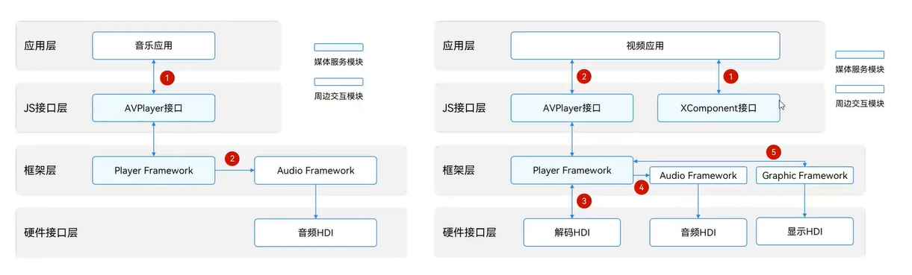
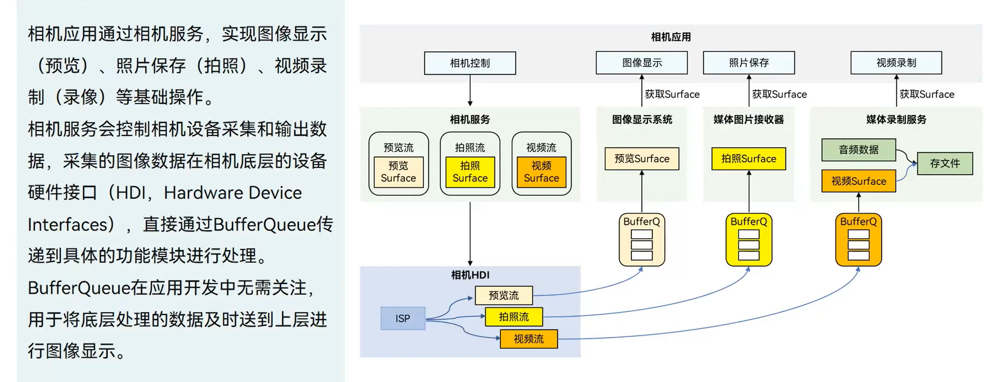
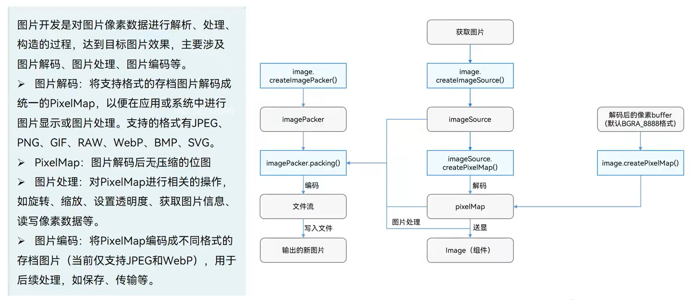
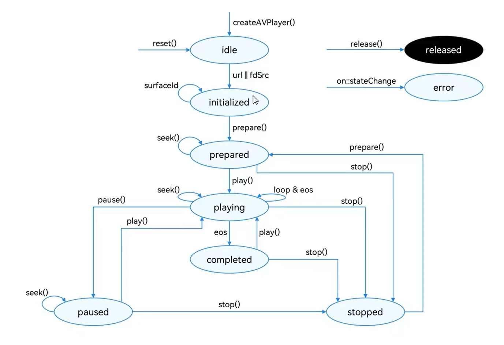

### 媒体应用开发概述

+ 音频（audio）
+ 视频（media）
+ 相机（camera）
+ 图片（image）


### 音视频—AVPlayer

主要工作是将Audio/Video媒体资源（如mp4/mp3/mkv/mpeg-ts等）转码为可供渲染的图像和可听见的音频模拟信号，并通过输出设备进行播放。应用只需提供流媒体来源，不负责数据解析和解码就可达成播放效果。



>  XComponent用于展示视频图像；
>
> arkts中的video组件有一定局限性，图形渲染也有区别。


### 相机开发




### 图片开发




## 音频播放应用开发

### 播放全流程

创建AVPlayer，设置播放资源和窗口，设置播放参数（音量/倍速/缩放模式），播放控制（播放/暂停/跳转/停止），重置，销毁资源。



首先创建AVPlayer，获得它的状态idle；设置url/fdSrc（音频地址），surfaceId只在视频播放中存在；进入到初始化状态，首先调用prepare接口，进入prepared状态；seek可以跳转到某个节点，play开始播放，pause暂停，stop停止。

release释放，退出时使用。

on::stateChange监听状态生命周期


#### 创建AVPlayer

使用createAVPlayer创建AVPlayer，两种调用方式：回调函数、Promise

```ts
let avPlayer: media.AVPlayer;
// createAVPlayer接口传入回调函数
media.createAVPlayer((error,video)=>{
    if (video != null) {
        avPlayer = video;
        console.info('createAVPlayer success');
    } else {
        console.error(`createAVPlayer fail, error message: ${error.message}`)
    }
})

// createAVPlayer使用promise的方式创建
media.createAVPlayer().then((video: media.AVPlayer) => {
    ...
})
```

#### 监听事件

| 事件类型          | 说明                                         |
| ----------------- | -------------------------------------------- |
| stateChange       | 必要事件，监听播放器state属性改变            |
| error             | 必要事件，监听播放器的错误信息               |
| durationUpdate    | 用于进度条，监听进度条长度，刷新资源时长     |
| timeUpdate        | 用于进度条，监听进度条当前位置，刷新当前事件 |
| seekDone          |                                              |
| speedDone         |                                              |
| volumeChange      |                                              |
| bitrateDone       |                                              |
| availableBitrates |                                              |
| bufferingUpdate   |                                              |
| startRenderFrame  |                                              |
| videoSizeChange   |                                              |
| audioInterrupt    |                                              |

#### 设置资源

创建AVPlayer并设置监听事件后，设置属性url，AVPlayer进入initialized状态。url有以下几种：

+ 本地资源，使用应用沙箱路径访问对应资源
+ 网络播放路径，需要申请网络权限
+ Rawfile目录下的资源文件，需使用ResourceManager.getRawFd打开HAP资源文件描述符

#### 设置窗口（视频播放）

在设置url之后设置属性`SurfaceID`，应用需要从XComponent组件获取surfaceID，XComponent组件用于显示视频画面。

```ts
mXComponentController: XComponentController = new XComponentController();
build() {
    XComponent({
        id: 'componentId',
        type: 'surface',
        controller: this.mXComponentController
    })
    .width('100%')
    .height('100%')
    .onLoad(() => {
        let surfaceId = this.mXComponentController.getXComponentSurfaceId();
        avPlayer.surfaceId = surfaceId;
    })
}
```

#### 播放及控制

准备播放：调用prepare()，AVPlayer进入到prepared状态，此时可以获取duration，设置缩放模式、音量等

视频播控：播放play()，暂停pause()，跳转seek()，停止stop()等操作。

更换资源：调用reset()重置资源，AVPlayer重新进入idle状态，允许更换资源url。

退出播放：调用release()销毁实例，AVPlayer进入released状态，退出播放。


