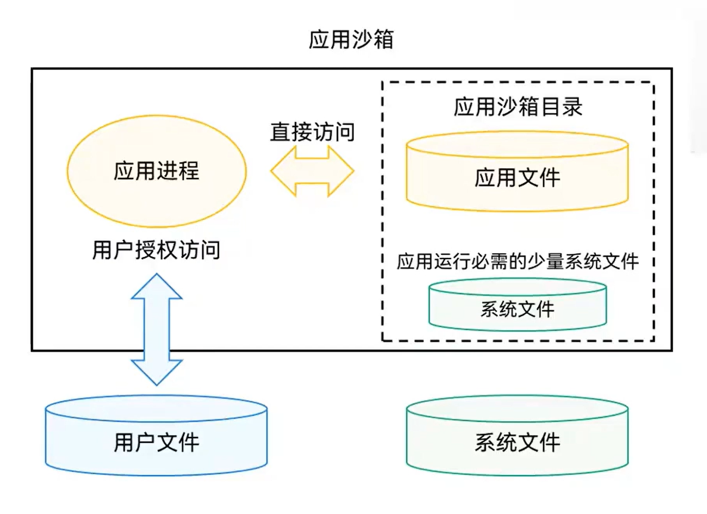
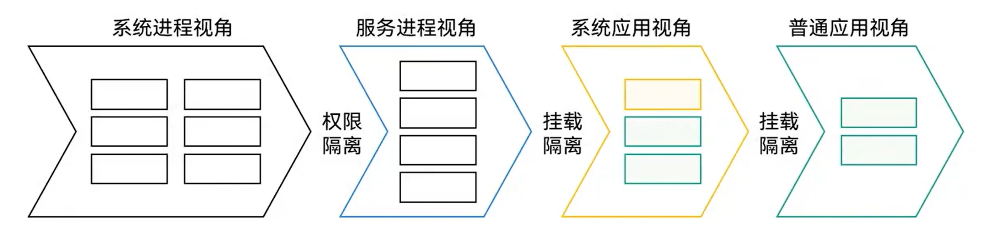
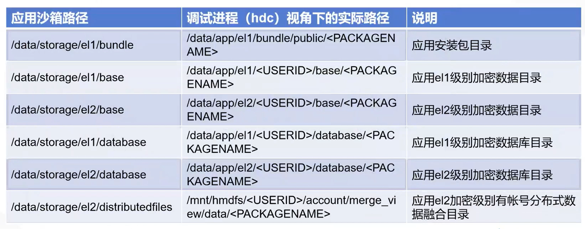
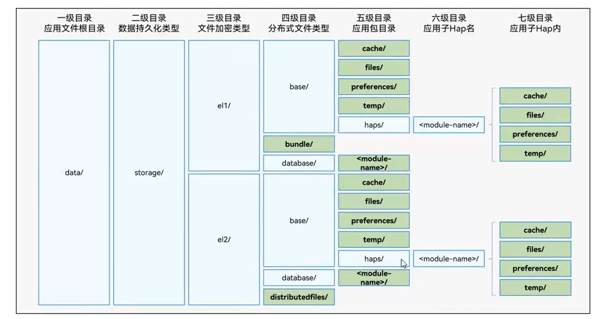
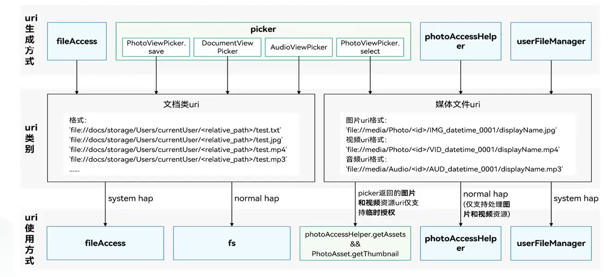

### 文件管理概述

#### 文件分类

+ 应用文件：应用安装文件、应用资源文件、应用缓存文件等
+ 用户文件：用户私有的图片、视频、音频、文档等
+ 系统文件：公共库、设备文件、系统资源文件等

### 应用文件概述

“应用文件目录”与一部分系统文件（应用运行必须使用的系统文件）所在的目录组成了一个集合，该集合成为“应用沙箱目录”，代表应用可见的所有目录范围。

#### 应用沙箱目录

以安全防护为目的的隔离机制，避免数据受到恶意路径穿越访问。在这种沙箱的保护机制下，应用可见的目录范围即为“应用沙箱目录”。

对于每个应用，系统会在内部存储空间映射处一个专属的“应用沙箱目录”，它是“应用文件目录”与一部分系统文件所在的目录组成的集合。

应用沙箱限制了应用可见的数据的最小范围。在“应用沙箱目录”中，应用仅能看到自己的应用文件以及少量的系统文件。因此本应用的文件也不为其他应用可见，从而保护了应用文件的安全。

应用可以在“应用文件目录”下保存和处理自己的应用文件；系统文件及其目录对于应用是只读的；而应用若需访问用户文件，则需要通过特定API同时经过用户的相应授权才能进行。

#### 应用沙箱目录与路径

+ 普通应用视角下，可见的目录与文件路径与系统进程等其他进程看到的不同。我们将普通应用视角下看到的“应用沙箱目录”下某个文件或某个具体目录的路径，称为“应用沙箱路径”。
+ 一般情况下，开发者的hdc shell环境等效于系统进程视角，因此“应用沙箱路径”与开发者使用hdc工具调试时看到的真实物理路径不同。
+ 从实际物理路径推导物理路径与沙箱路径并不是1：1的映射关系，沙箱路径总是少于系统进程视角可见的物理路径。有些调试进程视角下的物理路径在对应的应用沙箱目录是无法找到的，而沙箱路径总是能够找到其对应的物理路径。

 

#### 应用沙箱路径与物理路径

#### 应用文件目录与应用文件路径

“应用沙箱目录”内分为两类：应用文件目录和相同文件目录。

应用文件目录下某个文件或某个具体目录的路径成为应用文件路径。应用文件目录下的各个文件路径，具备不同的属性和特征。

1. 一级目录data/：代表应用文件目录

2. 二级目录storage/：代表本应用持久化文件目录

3. 三级目录el1/、el2/：代表不同文件加密类型

   + el1，设备级加密区：**设备开机后即可访问的数据区**。
   + el2，用户级加密区：设备开机后，需要**至少一次解锁对应用户的锁屏界面**（密码、指纹、人脸等方式或无密码状态）后，才能够访问的加密数据区。应用如无特殊需求，应将数据存放在el2加密目录下，以尽可能保证数据安全。但是对于某些场景，一些应用文件需要在用户解锁前就可被访问，例如式中、闹铃、壁纸等，此时应用需要将这些文件存放到设备级加密区（el1）。

4. 四级、五级目录：通过ApplicationContext可以获取distributefiles目录或base下的files、cache、preferences、temp等目录的应用文件路径，应用全局信息可以存放在这些目录下。

5. 通过UIAbilityContext、AbilityStageContext、ExtensionContext可以获取HAP级别应用文件路径。HAP信息可以存放在这些目录下，存放在此目录的文件会跟随HAP的卸载而删除，不会影响App级别目录下的文件。

   > getContext(this).cacheDir、getContext(this).fileDir、getContext(this).preferencesDir

| 目录名           | Context属性名称     | 类型               | 说明                                                         |
| ---------------- | ------------------- | ------------------ | ------------------------------------------------------------ |
| bundle           | bundleCodeDir       | 安装文件路径       | 应用安装后的App的HAP资源包所在目录；随应用卸载而清理。 不能拼接路径访问资源文件，使用资源管理接口访问资源。 可以用于存储应用代码资源数据，主要包括用于 |
| base             | NA                  | 本设备文件路径     | 应用在找本设备上存放持久化数据的目录，子目录包含files/、cache/、temp/和haps/；随应用卸载而清理 |
| database         | databaseDir         | 数据库路径         | 应用在el1加密条件下存放通过分布式数据库服务操作的文件目录；随应用卸载而清理。 |
| distributedfiles | distributedFilesDir | 分布式文件路径     | 应用在el2加密条件下存放分布式文件的目录，应用将文件放入该目录可分布式跨设备直接访问；随应用卸载而清理 |
| files            | filesDir            | 应用通用文件路径   | 应用在本设备内部存储上通用的存放默认长期保存的文件路径；随应用卸载而清理。 可以用于保存应用分布式场景下的数据，主要包括应用多设备共享文件、应用多设备备份文件、应用多设备群组协助文件。 此路径下存储这些数据，是的应用更加适合多设备使用场景。 可以用于保存应用的任何私有数据，主要赵括用户持久性文件、图片、媒体文件以及日志文件等。此路径下存储这些数据，是的数据保持私有、安全且持久有效。 |
| cache            | cacheDir            | 应用缓存文件路径   | 应用在本设备内部存储上用于缓存下载的文件或可重新生成的缓存文件的路径，应用cache目录大小超过配额或者系统空间达到一定条件，自动触发清理该目录下文件；用户通过系统空间管理类应用也可能出发清理该目录。应用需判断文件是否仍存在，决策是否需重新缓存该文件。 可以用于保存应用的缓存数据，主要包括离线数据、图片缓存、数据库备份以及临时文件等。此路径下存储的数据可能会被系统自动清理，因此不要存储重要数据。 |
| preferences      | preferencesDir      | 应用首选项文件路径 | 应用在本设备内部存储上通过数据库API存储配置类或首选项的目录；应用在本设备内部存储上通过数据库API存储配置类或首选项的目录 |
| temp             | tempDir             | 应用临时文件路径   | 应用在本设备内部存储上仅在应用运行期间产生和需要的文件，应用退出即清理。 可以用于保存应用的临时生成的数据，主要包括数据库缓存、图片缓存、临时日志文件、以及下载的应用安装包文件等。此路径下存储使用后即可删除的数据。 |

### 用户文件概述

用户文件：文件所有者为登录到终端设备的用户，包括用户私有的图片、视频、音频、文档等。

+ 用户文件存放在用户目录下，归属于该设备上登录的用户
+ 用户文件存储位置主要分为内置存储、外置存储
+ 应用对用户文件的创建、访问、删除等行为，需要提前获取用户授权，或由用户操作完成

#### 用户文件访问框架

用户文件访问框架（File Access Framework）是一套提供给开发者访问和管理用户文件的基础框架。

OpenHarmony系统预支了文件选择器应用FilePicker和文件管理器应用FileManager。

+ FilePicker：系统预置应用，提供文件访问客户端选择和保存文件的能力，且不需要配置任何权限。FilePicker的使用指导请参见选择用户文件。
+ FileManager：系统预置应用，终端用户可通过系统文件管理器实现查看文件、修改文件、删除文件（目录）、重命名文件（目录）、创建文件（目录）等操作。

#### 用户文件uri

uri类型可归纳为文档类uri和媒体文件类uri两类

+ **文档类uri**：由picker拉起文件管理器选择或保存返回，以及通过fileAccess模块获取
+ **媒体文件uri**：由picker通过拉起图库选择图片或者视频返回，通过photoAccessHelper模块获取图片或者视频文件uri，以及通过userFileManager模块获取图片、视频或者音频文件的uri。

#### 文档类uri

文档类uri的格式类型为：

​	'file://docs/storage/Users/currentUser/\<relative_path>/test.txt'

​	格式字段说明：
​		file://docs/storage/Users/currentUser/ ---文管的根目录
​		<relative_path> --- 文件在根目录下的相对路径
​		test.txt --- 用户文件系统中存储的文件名

文档类uri获取方式：

+ 通过DocumentViewPicker接口选择或保存文件，返回选择或保存的文件uri。
+ 通过AudioViewPicker接口选择或保存文件，返回选择或保存的文件uri。
+ 通过PhotoViewPicker.save接口保存文件，返回保存的文件uri。
+ 通过fileAccess模块获取文档类目录下的文件得到对应文件的FileInfo对象，此对象中就包含对应文件或者目录的uri属性，此模块中的接口为系统接口，使用此模块需要注意应用是否为系统应用。

#### 媒体类uri

媒体文件uri的格式类型为：

​	图片uri格式：
​		'file://media/Photo/\<id>/IMG_datetime_0001/displayName.jpg'

​	视频uri格式：
​		'file://media/Photo/\<id>/VID_dateTime_0001/displayName.mp4'

​	音频uri格式：
​		'file://media/Photo/\<id>/AUD_dateTime_0001/displayName.mp3'

​	格式字段说明：
​		file://media --- 表示媒体类uri
​		Photo/Audio --- 媒体文件类型
​		\<id> --- 表示在数据库中多个表中处理后的值，并不是值表中的file_id列，注意请不要使用此id去数据库中查询具体文件
​		AUD\_/VID\_/IMG_datetime_0001 --- 文件名去掉后缀剩下的部分
​		displayName.jpg/mp4/mp3 --- 文件名

媒体文件uri获取方式

+ 通过PhotoViewPicker.select接口选择媒体文件，返回选择的媒体文件的uri。
+ 通过photoAccessHelper模块中的getAssets或createAssets接口获取媒体文件对应文件的uri。
+ 通过userFileManager模块中的getPhotoAssets、getAudioAssets、createAudioAsset或createPhotoAssets接口获取媒体文件对应文件的uri。
