## 入门——开发基础知识

### Stage模型应用程序包结构

基于Stage模型开发应用之前，开发者需要熟悉开发态的应用程序结构、以及编译打包后的应用程序包结构。

+ 在开发态，一个应用包含一个或者多个Module，可以在[DevEco Studio](https://developer.harmonyos.com/cn/develop/deveco-studio/)工程中[创建一个或者多个Module](https://developer.harmonyos.com/cn/docs/documentation/doc-guides-V3/add_new_module-0000001053223741-V3)。**`Module`**是应用/服务的基本功能单元，包含了源代码、资源文件、第三方库及应用/服务配置文件，每一个Module都可以独立进行编译和运行。Module分为“**`Ability`**”和“**`Library`**”两种类型，“Ability”类型的Module对应于编译后的HAP（Harmony Ability Package）；“Library”类型的Module对应于[HAR](https://docs.openharmony.cn/pages/v4.0/zh-cn/application-dev/quick-start/har-package.md/)（Harmony Archive），或者[HSP](https://docs.openharmony.cn/pages/v4.0/zh-cn/application-dev/quick-start/shared-guide.md/)（Harmony Shared Package）。 一个Module可以包含一个或多个[UIAbility](https://docs.openharmony.cn/pages/v4.0/zh-cn/application-dev/application-models/uiability-overview.md/)组件，如**Module与UIAbility组件关系示意图**所示。

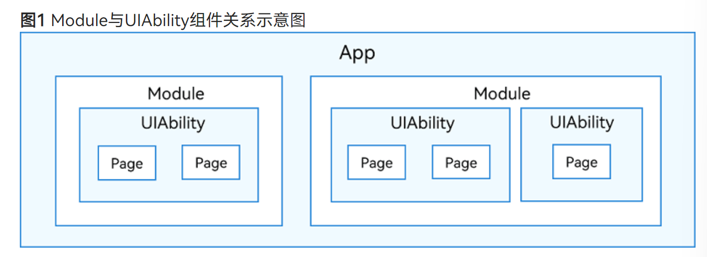


全文中介绍到的Module默认值指的是“Ability”类型的Module

+ 开发者通过DevEco Studio把应用程序编译为一个或者多个.hap后缀的文件，即HAP。HAP是应用安装的基本单位，包含了编译后的代码、资源、三方库及配置文件。HAP可分为`Entry`和`Feature`两种类型。
  + Entry类型的HAP：是应用的**主模块**，在[module.json5配置文件](https://docs.openharmony.cn/pages/v4.0/zh-cn/application-dev/quick-start/module-configuration-file.md/)中的type标签配置为“entry”类型。在同一个应用中，同一设备类型只支持一个Entry类型的HAP，通常用于实现应用的入口界面、入口图标、主特性功能等。
  + Feature类型的HAP：是应用的**动态特性模块**，在[module.json5配置文件](https://docs.openharmony.cn/pages/v4.0/zh-cn/application-dev/quick-start/module-configuration-file.md/)中的type标签配置为“feature”类型。一个应用程序包可以包含一个或多个Feature类型的HAP，也可以不包含；Feature类型的HAP通常用于实现应用的特性功能，可以配置成按需下载安装，也可以配置成随Entry类型的HAP一起下载安装（请参见[module对象内部结构](https://docs.openharmony.cn/pages/v4.0/zh-cn/application-dev/quick-start/module-configuration-file.md/)中的“deliveryWithInstall”）。
+ 每个应用可以包含多个.hap文件，一个应用中的.hap文件合在一起称为一个Bundle，而**`bundleName`**就是**应用的唯一标识**（请参见[app.json5配置文件](https://docs.openharmony.cn/pages/v4.0/zh-cn/application-dev/quick-start/app-configuration-file.md/)中的bundleName标签）。需要特别说明的是：在应用上架到应用市场时，需要***把应用包含的所有.hap文件（即Bundle）打包为一个.app后缀的文件***用于**上架**，这个.app文件称为App Pack（Application Package），其中同时包含了描述App Pack属性的pack.info文件；在云端分发和端侧安装时，都是以HAP为单位进行分发和安装的。
+ 打包后的HAP结构包括ets、libs、resources等文件夹和resources.index、module.json、pack.info等文件。
  + `ets`目录用于存放应用代码编译后的字节码文件
  + `libs`目录用于存放库文件。库文件是应用依赖的第三方代码（.so二进制文件）
  + `resources`目录用于存放应用的资源文件（字符串、图片等），便于开发者使用和维护，详见[资源文件的使用](https://docs.openharmony.cn/pages/v4.0/zh-cn/application-dev/quick-start/resource-categories-and-access.md/)。
  + `resources.index`是资源索引表，由IDE编译工程时生成。
  + `module.json`是HAP的配置文件，是HAP中非常重要的组成部分，内容由工程配置中的module.json5和app.json5组成。IDE会自动生成一部分默认配置，开发者按需修改其中的配置。详细字段请参见[应用配置文件](https://docs.openharmony.cn/pages/v4.0/zh-cn/application-dev/quick-start/application-configuration-file-overview-stage.md/)。
  + `pack.info`是Bundle中用于描述每个HAP属性的文件，例如app中的bundleName和versionCode信息、module中的name、type和abilities等信息，由IDE工具构建Bundle包时自动生成。

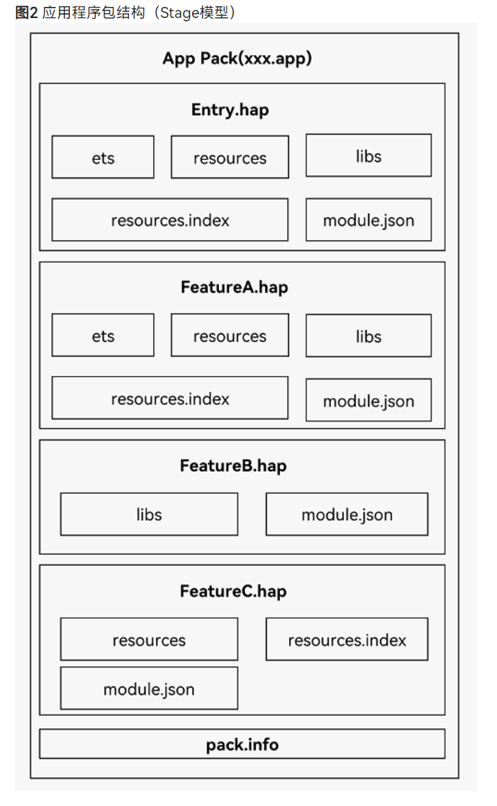


### FA模型应用程序包结构

基于[FA模型](https://docs.openharmony.cn/pages/v4.0/zh-cn/application-dev/quick-start/application-configuration-file-overview-fa.md/)开发的应用，其应用程序包结构如下图**应用程序包结构（FA模型）**所示。开发者需要熟悉应用程序包结构相关的基本概念。

FA模型与Stage模型**不同之处**在于**HAP内部文件存放位置不同**，FA模型将所有的资源文件、库文件和代码文件都放在assets文件夹中，在文件夹内部进一步区分。

- `config.json`是应用配置文件，IDE会自动生成一部分模块代码，开发者按需修改其中的配置。详细字段请参见[应用配置文件](https://docs.openharmony.cn/pages/v4.0/zh-cn/application-dev/quick-start/app-structure.md/)。
- `assets`是HAP所有的资源文件、库文件和代码文件的集合，内部可以分为entry和js文件夹。entry文件夹中存放的是resources目录和resources.index文件。
- `resources`目录用于存放应用的资源文件（字符串、图片等），便于开发者使用和维护，详见[资源文件的使用](https://docs.openharmony.cn/pages/v4.0/zh-cn/application-dev/quick-start/resource-categories-and-access.md/)。
- `resources.index`是资源索引表，由IDE调用SDK工具生成。
- `js`文件夹中存放的是编译后的代码文件。
- `pack.info`是Bundle中用于描述每个HAP属性的文件，例如app中的bundleName和versionCode信息、module中的name、type和abilities等信息，由IDE工具构建Bundle包时自动生成。

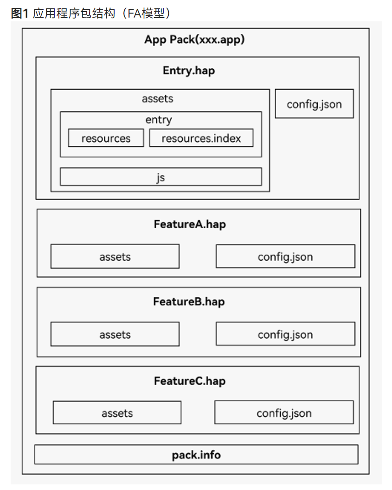


### 多HAP机制设计目标

+ 方便开发者模块化的管理应用，好的应用一般都是模块化管理，模块之间属于松耦合关系。多HAP方便了开发者将业务划分成多个模块，每个模块放到独立的HAP中。例如支付类应用，有统一的主界面，主界面管理“扫一扫”、“收付款”、“理财”等各个模块。其中主界面管理其他模块的逻辑在Entry包中实现，而“扫一扫”、“收付款”、“消息”和“理财”等模块在不同的Feature包中实现。可以同时开发多个Feature包，能否实现Feature包单独的开发测试，最终由Entry包统一集成Feature包的特性。
+ 方便开发者将多HAP合理地自核并部署到不同的设备上。例如应用程序包含一个Entry包和两个Feature包（Feature1和Feature2）。其中Entry包可以部署到设备A和设备B，Feature1只能部署到设备A，组合Entry和Feature2部署到设备B上。
+ 方便开发者按需加载所需模块，减少包大小。开发者可以将一个应用的某些HAP配置成按需加载。应用在启动阶段初始用不到的特性，可以配置在不加载，当用户用到这些特性的时候，可由应用自动下载这些特性HAP，一定程度上减少应用包的大小


### 多HAP构建视图

IDE支持在一个应用工程中进行多个HAP的开发与构建，如下图所示。

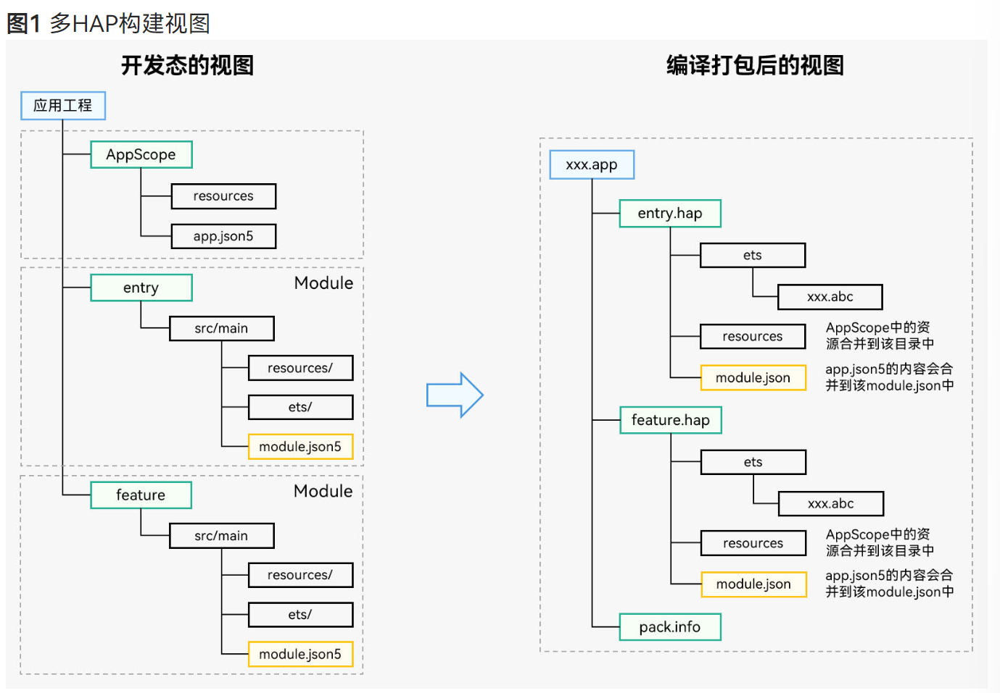

1.IDE开发态视图

+ AppScope目录

  + app.json5：配置应用全局描述信息，例如应用Bundle名称、版本号、应用图标、应用名称和依赖的SDK版本号等。

  + resources目录：防止应用的图标资源和应用名称字符串资源。

    **说明**：

    + 该目录由IDE自动生成，名称不可更改。
    + AppScope目录与Entry、Feature模块目录下如果存在同名文件，打包后只会保留AppScope目录下的文件。

+ entry或者feature目录（名称可由开发者定义）

  + 由IDE引导开发者创建的Module，在该Module中实现应用的业务逻辑；可以创建多个Module，图中entry和feature即是创建的两个Module。
  + resources目录：放置该Module中所使用到的资源。
  + ets目录：开发者的业务逻辑。
  + module.json5：配置该Module的描述信息，如：Module的名称、Module的入口代码路径、包含的组件信息等。

2.编译打包后的视图

+ 一个开发态的Module编译后生成一个部署态的HAP，Module和HAP一一对应。
+ HAP中的module.json由开发视图中的app.json5和module.json5合成。
+ 所有的HAP最终会编译到一个App Pack中（以.app为后缀的包文件），用于发布到应用市场。


### 多HAP的开发调试与发布部署流程

多HAP的开发调试与发布部署流程如下图所示。

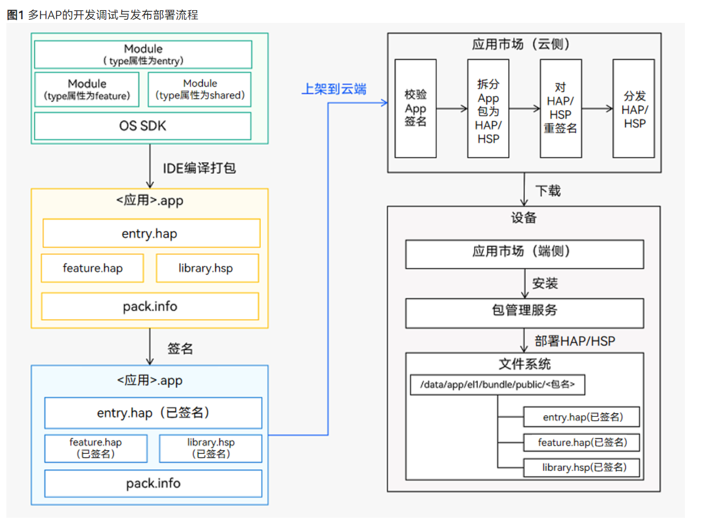

#### 开发

通过DevEco Studio工具按照业务的需求创建多个Module，在相应的Module中完成自身业务的开发。

#### 调试

通过DevEco Studio编译打包，生成单个或者多个HAP，即可基于HAP进行调试。如需根据不同的部署环境、目标人群、运行环境等，将同一个HAP定制编译为不同版本，请参见[定制编译指导](https://developer.harmonyos.com/cn/docs/documentation/doc-guides-V3/customized-multi-targets-and-products-0000001430013853-V3?catalogVersion=V3)。

在调试前，需要先安装或更新HAP，以下介绍具体做法。

**方法一：** 使用DevEco Studio进行调试，详见[应用程序包调试方法](https://developer.harmonyos.com/cn/docs/documentation/doc-guides-V3/ide_debug_device-0000001053822404-V3?catalogVersion=V3#section10491183521520)。

**方法二：** 使用[hdc工具](https://docs.openharmony.cn/pages/v4.0/zh-cn/device-dev/subsystems/subsys-toolchain-hdc-guide.md/)(可通过OpenHarmony SDK获取，在SDK的toolchains目录下)进行调试。

在调试前，需要先安装或更新HAP，此处有两种方式：

- 直接使用hdc安装、更新HAP。

  HAP的路径为开发平台上的文件路径，以Windows开发平台为例，命令参考如下：

  ```
  // 安装、更新，多HAP可以指定多个文件路径
  hdc install C:\entry.hap C:\feature.hap
  // 执行结果
  install bundle successfully.
  // 卸载
  hdc uninstall com.example.myapplication
  // 执行结果
  uninstall bundle successfully.
  ```

- 先执行hdc shell，再使用bm工具安装、更新HAP。

  HAP的文件路径为真机上的文件路径，命令参考如下：

  ```
  // 先执行hdc shell才能使用bm工具
  hdc shell
  // 安装、更新，多HAP可以指定多个文件路径
  bm install -p /data/app/entry.hap /data/app/feature.hap
  // 执行结果
  install bundle successfully.
  // 卸载
  bm uninstall -n com.example.myapplication
  // 执行结果
  uninstall bundle successfully.
  ```

完成HAP安装或更新后，即可参考相关调试命令进行[调试](https://docs.openharmony.cn/pages/v4.0/zh-cn/application-dev/tools/aa-tool.md/)。

#### 发布

当开发的程序包苗族发布要求时，可以在工具中打包编译生成App包。将该App包上架到应用市场云端，应用市场会对上架的App包校验签名，校验签名通过后会将App包中的HAP拆分出来，同时对拆分出的HAP重新添加签名，然后对HAP进行分发。

#### 部署

用户在设备上的应用市场客户端能够看到各种各样的应用，这些应用均有云端分发而来，有些是多HAP应用。用户选择某个应用后，应用市场将下载应用所包含的全部deliveryWithInstall为“true”的HAP。

#### 应用在终端设备上的安装

下载完成后，应用市场客户端再调用系统中包管理服务的安装接口安装下载的HAP，包管理服务以应用为单位将其中所有HAP部署到指定目录下，以完成应用的安装。


### 多HAP使用规则

+ App Pack包不能直接安装到设备上，只是上架应用市场的单元。
+ App Pack包**打包时**会对每个HAP在json文件中的配置进行校验，**确保bundleName、versionCode等标签取值相同**，详见[App打包时的HAP合法性校验](https://docs.openharmony.cn/pages/v4.0/zh-cn/application-dev/tools/packing-tool.md/#app打包指令)。
+ App pack包中同一设备类型的所有HAP中必须有且只有一个Entry类型的HAP，Feature类型的HAP可以有一个或者多个，也可以没有。
+ App Pack包中的每个HAP必须配置moduleName标签，**同一设备类型的所有HAP对应的`moduleName`标签必须唯一**。
+ 同一应用的所有HAP签名证书要保持一致。上架应用市场是以App Pack的形式上架，并对其进行了签名。应用市场分发时会将所有HAP从App Pack中拆分出来，同时对其中的所有HAP进行重签名，这样保证了所有HAP签名证书的一致性。在调试阶段，**开发者通过命令行或者IDE将HAP安装到设备上时要保证`所有HAP签名证书`一致，否则会出现安装失败的问题。**


### 多HAP运行机制及数据通信方式

多HAP机制主要是为方便开发者进行模块化管理。HAP和应用运行时的进程并不是一一对应的，具体运行机制如下：

+ 默认情况下，应用中（同一Bundle名称）的所有UIAbility、ServiceExtensionAbility和DataShareExtensionAbility均是运行在同一个独立进程（主进程）中，而其他相同类型的`ExtensionAbility`则是运行在各自**独立的线程**中。
+ HAP支持在module.json5（Stage模型）或者config.json（FA模型）中通过process标签配置单独的进程（仅支持系统应用，第三方不支持）。配置了process的HAP，其组件运行在单独的process进程中，多个HAP可以配置相同的process，则这些HAP运行在相同进程中，process配置的详细说明请参见[module.json5配置文件](https://docs.openharmony.cn/pages/v4.0/zh-cn/application-dev/quick-start/module-configuration-file.md/)。
+ 应用运行时，同一进程中的UIAbility组件被启动时，才加载对应HAP的资源和代码。

基于上述机制，多HAP数据通信方式如下：

- 同一进程内的数据通信，请参见[线程间通信](https://docs.openharmony.cn/pages/v4.0/zh-cn/application-dev/application-models/thread-model-stage.md/)。
- 跨进程的数据通信，请参见[进程间通信](https://docs.openharmony.cn/pages/v4.0/zh-cn/application-dev/application-models/process-model-stage.md/)。
- 多HAP如果运行在同一进程，则多HAP间组件的通信方式与同一HAP内组件的通信方式相同。


### 共享包

当前系统提供了两种共享包，[HAR（Harmony Archive）](https://docs.openharmony.cn/pages/v4.0/zh-cn/application-dev/quick-start/har-package.md/)静态共享包和[HSP（Harmony Shared Package）](https://docs.openharmony.cn/pages/v4.0/zh-cn/application-dev/quick-start/in-app-hsp.md/)动态共享包。

HAR与HSP都是为了实现代码和资源的共享，都可以包含代码、C++库、资源和配置文件，最大的不同之处在于：HAR中的代码和资源跟随使用方编译，如果有多个使用方，它们的编译产物中会存在多分相同拷贝；而HSP中的代码和资源可以独立编译，运行时在一个进程中代码也只会存在一份。

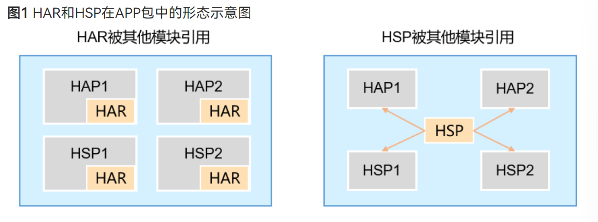

HSP旨在解决多个模块引用相同的HAR，导致APP包大小膨胀的问题。

**使用HSP的约束条件**：

+ HSP及其使用方都必须是Stage模型。
+ HSP及其使用方都必须是esmodule编译模式。
+ HSP不支持在配置文件中声明abilities、extensionAbilities标签。


### HAR

HAR（Harmony Archive）是静态共享包，可以包含代码、C++库、资源和配置文件。通过HAR可以实现多个模块或多个工程共享ArkUI组件、资源等相关代码。HAR不同于HAP，不能独立安装运行在设备上，只能作为应用模块的依赖项被引用。

#### 创建HAR模块

。。。

#### HAR开发约束限制

- HAR不支持UIAbility、ExtensionAbility组件和pages页面。
- HAR不支持在build-profile.json5文件的buildOption中配置worker。
- FA模型与Stage模型的HAR不支持相互引用。
- Stage模型的HAR，不能引用AppScope内的内容。在编译构建时AppScope中的内容不会打包到HAR中，因此会导致HAR资源引用失败。

#### 导出HAR的ArkUI组件、接口、资源

。。。

#### 引用HAR的ArkUI组件、接口、资源

引用HAR前，需要先配置对HAR的依赖，详见[引用HAR文件和资源](https://developer.harmonyos.com/cn/docs/documentation/doc-guides-V3/creating_har_api9-0000001518082393-V3#section611662614153)。

##### 引用HAR的ArkUI组件

HAR的依赖配置成功后，可以引用HAR的ArkUI组件。ArkUI组件的导入方式与ts的导入方式一致，通过`import`引入HAR导出的ArkUI组件，示例如下所示：

```ts
// entry/src/main/ets/pages/IndexSec.ets
import { MainPage } from 'library';

@Entry
@Component
struct IndexSec {
  build() {
    Row() {
      // 引用HAR的ArkUI组件
      MainPage()
    }
    .height('100%')
  }
}
```

##### 引用HAR的ts类和方法

通过`import`引用HAR导出的ts类和方法，示例如下所示：

```ts
// entry/src/main/ets/pages/Index.ets
import { Log } from 'library';
import { func } from 'library';

@Entry
@Component
struct Index {
  @State message: string = 'Hello World';

  build() {
    Column() {
      Text(this.message)
        .fontFamily('HarmonyHeiTi')
        .fontWeight(FontWeight.Bold)
        .fontSize(32)
        .fontWeight(700)
        .fontColor($r('app.color.text_color'))
        .textAlign(TextAlign.Start)
        .margin({ top: '32px' })
        .width('624px')

      //引用HAR的ts类和方法
      Button($r('app.string.button'))
        .id('button')
        .height(48)
        .width('624px')
        .margin({ top: '4%' })
        .type(ButtonType.Capsule)
        .fontFamily('HarmonyHeiTi')
        .borderRadius($r('sys.float.ohos_id_corner_radius_button'))
        .backgroundColor($r('app.color.button_background'))
        .fontColor($r('sys.color.ohos_id_color_foreground_contrary'))
        .fontSize($r('sys.float.ohos_id_text_size_button1'))
        .onClick(() => {
          // 引用HAR的类和方法
          Log.info('har msg');
          this.message = 'func return: ' + func();
        })
    }
    .width('100%')
    .backgroundColor($r('app.color.page_background'))
    .height('100%')
  }
}
```

##### 引用HAR的native方法

通过`import`引用HAR导出的native方法，示例如下所示：

```ts
// entry/src/main/ets/pages/Index.ets
import { nativeAdd } from 'library';

@Entry
@Component
struct Index {
  @State message: string = 'Hello World';

  build() {
    Column() {
      Text(this.message)
        .fontFamily('HarmonyHeiTi')
        .fontWeight(FontWeight.Bold)
        .fontSize(32)
        .fontWeight(700)
        .fontColor($r('app.color.text_color'))
        .textAlign(TextAlign.Start)
        .margin({ top: '32px' })
        .width('624px')

      //引用HAR的native方法
      Button($r('app.string.native_add'))
        .id('nativeAdd')
        .height(48)
        .width('624px')
        .margin({ top: '4%', bottom: '6%' })
        .type(ButtonType.Capsule)
        .fontFamily('HarmonyHeiTi')
        .borderRadius($r('sys.float.ohos_id_corner_radius_button'))
        .backgroundColor($r('app.color.button_background'))
        .fontColor($r('sys.color.ohos_id_color_foreground_contrary'))
        .fontSize($r('sys.float.ohos_id_text_size_button1'))
        .onClick(() => {
          this.message = 'result: ' + nativeAdd(1, 2);
        })
    }
    .width('100%')
    .backgroundColor($r('app.color.page_background'))
    .height('100%')
  }
}
```

##### 引用HAR的资源

通过`$r`引用HAR中的资源，例如在HAR模块的`src/main/resources`里添加字符串资源（在string.json中定义，name：hello_har）和图片资源（icon_har.png），然后在Entry模块中引用该字符串和图片资源的示例如下所示：

```ts
// entry/src/main/ets/pages/Index.ets
@Entry
@Component
struct Index {
  @State message: string = 'Hello World';

  build() {
    Column() {
      // 引用HAR的字符串资源
      Text($r('app.string.hello_har'))
        .id('stringHar')
        .fontFamily('HarmonyHeiTi')
        .fontColor($r('app.color.text_color'))
        .fontSize(24)
        .fontWeight(500)
        .margin({ top: '40%' })

      List() {
        ListItem() {
          // 引用HAR的图片资源
          Image($r('app.media.icon_har'))
            .id('iconHar')
            .borderRadius('48px')
        }
        .margin({ top: '5%' })
        .width('312px')
      }
      .alignListItem(ListItemAlign.Center)
    }
    .width('100%')
    .backgroundColor($r('app.color.page_background'))
    .height('100%')
  }
}
```

#### 发布HAR

详见[发布HAR](https://developer.harmonyos.com/cn/docs/documentation/doc-guides-V3/creating_har_api9-0000001518082393-V3#section1213451811512)。

#### 相关实例

- [购物示例应用](https://gitee.com/openharmony/applications_app_samples/tree/master/code/Solutions/Shopping/OrangeShopping)


### HSP

HSP（Harmony Shared Package）是动态共享包，按照使用场景可以分为应用内HSP和应用间HSP。应用内HSP指的是专门为某一应用开发的HSP，只能被该应用内部其他HAP/HSP使用，用于应用内部代码、资源的共享。应用内HSP跟随其宿主应用的APP包一起发布，与宿主应用同进程，具有相同的包名和生命周期。

> **说明：**
>
> 由于当前暂不支持应用间HSP，提到HSP时特指应用内HSP。

[文档](https://docs.openharmony.cn/pages/v4.0/zh-cn/application-dev/quick-start/in-app-hsp.md/)


### 快速修复

快速修复是系统提供给开发者的一种技术手段，支持开发者以远快于应用升级的方式对应用程序包进行缺陷修复。和全量应用升级软件版本相比，快速修复的主要优势在小、快和用户体验好。在较短的时间内不中断正在运行的应用的情况下（即不需要重启应用），修复应用的缺陷。

#### 快速修复的使用规则

- 仅支持修复应用的ArkTS和C++代码，对应的文件为.abc文件（ArkTS编译后的文件）和.so文件（C++编译后的文件），不支持对资源的修复。
- 不支持新增.abc文件和.so文件。
- 快速修复包部署时要确保对应应用包已安装，如果未安装，则部署失败。
- 快速修复包中配置的包名和应用版本号必须和已安装的包名和版本号应用相同，如果不同则部署失败。
- 如果已经部署过快速修复包，新部署的快速修复包的版本号必须大于之前快速修复包的版本号，否则部署失败。
- 快速修复包的签名信息和待修复的应用的签名信息必须一致，否则会部署失败。
- 新的应用版本发布安装时，会清理掉快速修复包。

#### 快速修复包结构

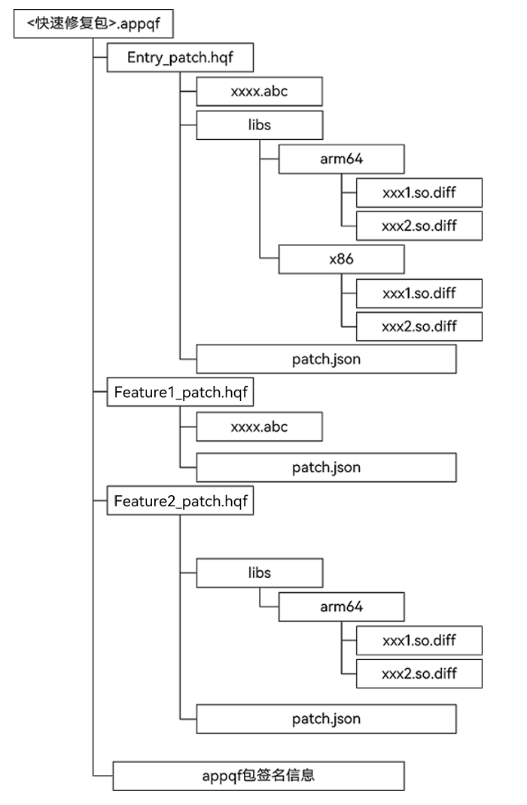

上图是应用程序发布的快速修复的包格式。

从图中可以看出包含两种包格式：

- appqf（Application Quick Fix）

  appqf与应用的app pack包是一一对应关系，具体可参考

  应用程序包结构

  的介绍。

  - appqf包是应用用于发布到应用市场的单元，不能够直接安装到设备上。
  - 它是由一个或多个hqf（Harmony Ability Package Quick Fix）组成，这些hqf包在应用市场会从appqf包中拆分出来，再被分发到具体的设备上。
  - appqf包上架到应用市场前要有开发者的签名信息。签名方式可可参考[Hap包签名工具](https://docs.openharmony.cn/pages/v4.0/zh-cn/application-dev/security/hapsigntool-overview.md/)的介绍。

- hqf（Harmony Ability Package Quick Fix）

  hqf包是修复HAP中问题的快速修复包，用于安装到设备上的快速修复单元。一个hqf可以包含.abc的快速修复文件，.so的快速修复文件和描述该包的配置文件。

  - `.abc`文件：应用中修改后的ArkTS代码，编译后生成的字节码文件。

  - `libs`目录：存放.so库文件的差分文件，以`.so.diff`为后缀。区分的不同的系统cpu架构，例如arm平台、x86平台。

  - `patch.json`：该文件用于描述hqf包版本信息的配置文件，由开发者填写，具体内容如下：

    ```json
    {
        "app" : {
            "bundleName" : "com.ohos.quickfix",
            "versionCode" : 1000000,
            "versionName" : "1.0.0",
            "patchVersionCode" : 1000000,
            "patchVersionName" : "1.0.0"
        },
        "module" : {
            "name" : "entry",
            "type" : "patch",
            "deviceTypes" : [
            "default",
            "tablet"
            ],
            "originalModuleHash" : "11223344556677889900"
        }
    }
    ```

    具体字段说明：

    | 字段               | 类型   | 说明                                                        | 备注              |
    | :----------------- | :----- | :---------------------------------------------------------- | :---------------- |
    | bundleName         | string | 对应应用的包名。                                            | 不可缺省          |
    | versionCode        | int    | 对应应用版本号。                                            | 不可缺省          |
    | versionName        | string | 对应应用的版本名称。                                        | patch类型不可缺省 |
    | patchVersionCode   | int    | 补丁包的版本号。                                            | 不可缺省          |
    | patchVersionName   | string | 补丁包的版本名称。                                          | patch类型不可缺省 |
    | name               | string | 对应应用的moduleName，用来修复该module的。                  | 不可缺省          |
    | type               | string | 对应补丁包的类型，当前可选择为patch。                       | 不可缺省          |
    | deviceTypes        | array  | 补丁包支持的设备类型。                                      | 不可缺省          |
    | originalModuleHash | string | 原始module Name对应包的哈希值，可采用SHA256生成器自行生成。 | 不可缺省          |


#### 快速修复ArkTS编译后的文件

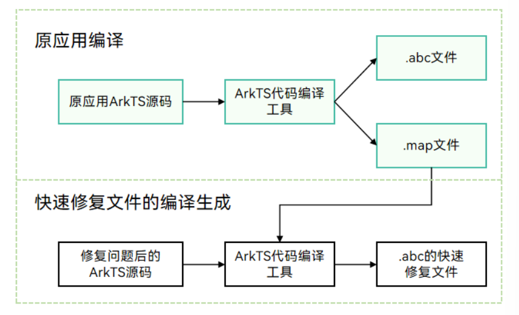

上图是通过ArkTS代码编译工具生成快速修复.abc文件的流程：

- 原始应用编译时，生成.abc文件和.map文件。.abc是ArkTS代码编译后的字节码文件，应用运行时使用该文件。.map文件是通过ArkTS代码编译工具编译ArkTS代码时生成的中间文件，记录有代码中的函数、类等信息。
- 修复问题后的应用编译时，根据上述的.map文件，结合当前的ArkTS代码，得到差异部分，根据差异部分生成快速修复的.abc文件。该.abc文件也既是最终要放到hqf包中的快速修复文件。


#### 快速修复C++编译后的文件

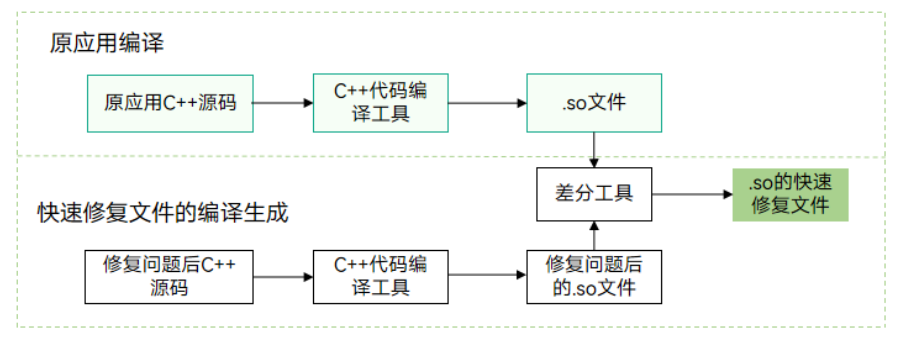

上图是通过差分工具生成快速修复.so文件的流程：

- 原始应用C++源码通过编译工具生成.so文件，该.so文件供应用在运行时使用。
- 修复问题后的C++源码通过编译工具生成.so文件，该.so文件和原应用的.so文件通过差分工具生成.so快速修复文件，该.so快速修复文件也既是最终要放到hqf包中的快速修复文件


#### 快速修复包的发布部署流程

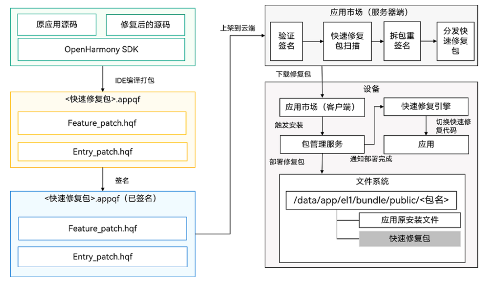

上图涉及到的模块如下：

- DevEco Studio：用于开发代码的项目工程的集成开发环境。在快速修复的工程中能够给予原应用的代码和修复问题后的代码生成快速修复包，并完成快速修复包的签名。
- 应用市场服务器端：开发者将开发完成的快速修复包上架到该平台，平台会对上架的包进行签名验证、风险扫描和拆包重签名等，然后分发到客户端。
- 应用市场客户端：用于接收应用市场服务器端分发的快速修复包，并触发安装快速修复包。
- 包管理服务：设备上用于管理应用包及快速修复包安装和卸载的系统服务程序。
- 快速修复引擎：设备上用于管理应用切换使用快速修复包的系统服务程序。如果应用正在运行，快速修复引擎接收到有快速修复包部署完成会通知应用切换快速修复包，进而使得应用使能快速修复包。
- 文件系统：应用及快速修复包部署在设备上的位置。

上图是快速修复包的端到端发布部署流程：

1. 开发者通过DevEco Studio，基于原应用的源码和修复后的源码编译打包生成快速修复包，并通过DevEco Studio完成快速修复包的签名。
2. 将生成的带有签名的快速修复包上架到应用市场，应用市场通过验证签名、风险扫描和拆包重签名后进行分发。
3. 设备侧的应用市场客户端检测到应用市场服务器端有新上架的快速修复包会下载最新版本的快速修复包，接着通过系统中的包管理服务来安装部署快速修复包。
4. 快速修复包部署完成后，再由快速修复引擎触发应用使用快速修复包，进而保证用户使用到问题修复后的功能。


#### 快速修复包的调试流程

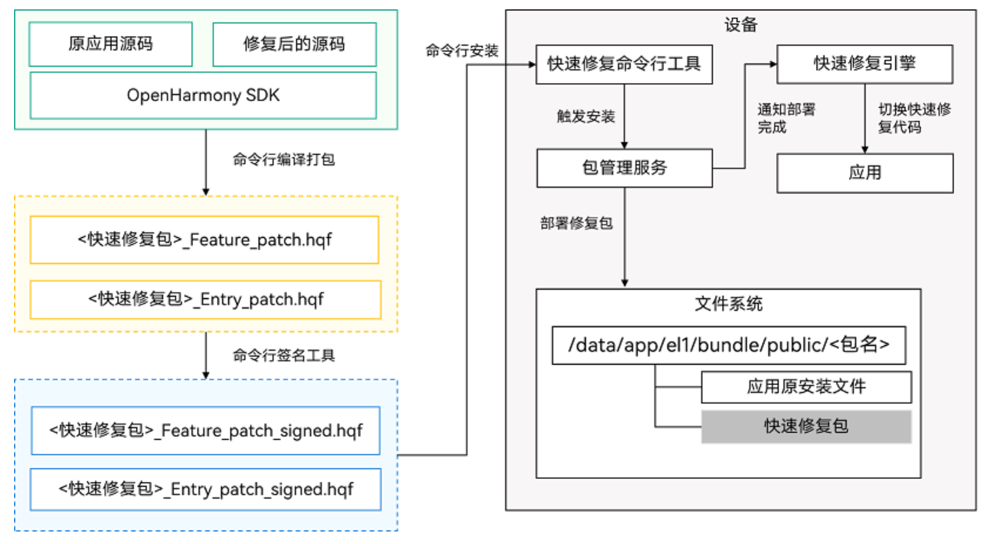

- DevEco Studio中暂时还没有集成快速修复的能力。当前阶段，系统为开发者提供了命令行的调试开发工具可供使用，具体的调试开发流程如下：

1. 基于原应用的源码和修复后的源码，通过命令行工具可以编译生成快速修复包，并通过命令行签名工具完成对快速修复的包的签名。通过命令行调试开发，要对.hqf包签名，并通过命令行工具将.hqf包安装到设备上，.appqf包不能直接安装到设备上。
2. 通过快速修复的命令行工具，将.hqf包安装部署到设备上。
3. .hqf包安装部署完成后，回调通知快速修复引擎触发应用使用快速修复包，进而保证用户使用到问题修复后的功能。


### 快速修复命令行调试开发指导

[文档](https://docs.openharmony.cn/pages/v4.0/zh-cn/application-dev/quick-start/quickfix-debug.md/)


### 应用配置文件概述（Stage模型）

每个应用项目的代码目录下必须包含应用配置文件，这些配置文件会向编译工具、操作系统和应用市场提供应用的基本信息。

在基于Stage模型开发的应用项目代码下，都存在一个`app.json5`配置文件、以及一个或多个`module.json5`配置文件。

[app.json5配置文件](https://docs.openharmony.cn/pages/v4.0/zh-cn/application-dev/quick-start/app-configuration-file.md/)主要包含以下内容：

- 应用的**全局配置信息**，包含应用的**Bundle名称**、**开发厂商**、**版本号**等基本信息。
- 特定设备类型的配置信息。

[module.json5配置文件](https://docs.openharmony.cn/pages/v4.0/zh-cn/application-dev/quick-start/module-configuration-file.md/)主要包含以下内容：

- **Module的基本配置信息**，包含Module名称、类型、描述、支持的设备类型等基本信息。
- [应用组件](https://docs.openharmony.cn/pages/v4.0/zh-cn/application-dev/application-models/stage-model-development-overview.md/)信息，包含**UIAbility组件**和**ExtensionAbility组件**的描述信息。
- 应用运行过程中所需的**权限信息**。

