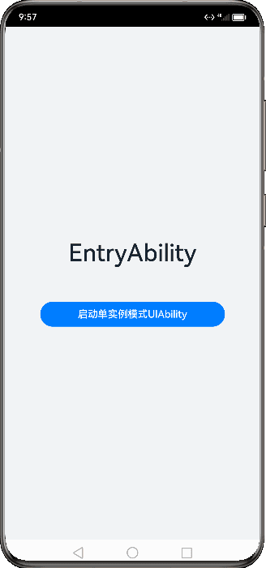
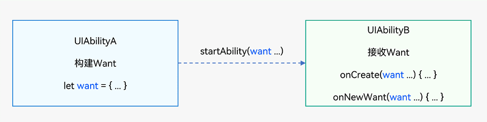
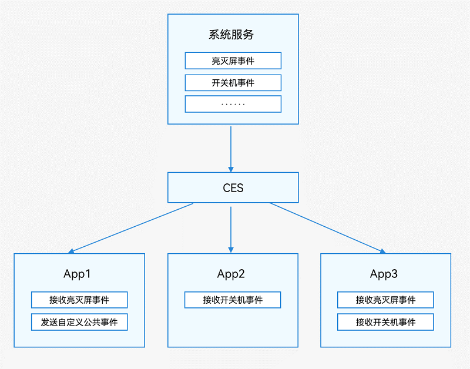

[TOC]


# 应用模型

## 应用模型概述

### 应用模型的构成要素

应用模型是系统为开发者提供的应用程序所需能力的抽象提炼，它提供了应用程序必备的组件和运行机制。有了应用模型，开发者可以基于一套统一的模型进行应用开发，使应用开发更简单、高效。

应用模型的构成要素包括：

1. 应用组件

   应用组件是应用的基本组成单位，是应用的运行入口。用户启动、使用和退出应用过程中，应用组件会在不同的状态间切换，这些状态称为应用组件的生命周期。应用组件提供生命周期的回调函数，开发者通过应用组件的生命周期回调感知应用的[状态变化](https://docs.openharmony.cn/pages/v4.0/zh-cn/application-dev/application-models/uiability-lifecycle.md)。应用开发者在编写应用时，首先需要编写的就是应用组件，同时还需编写应用组件的生命周期回调函数，并在应用配置文件中配置相关信息。这样，操作系统在运行期间通过配置文件创建应用组件的实例，并调度它的生命周期回调函数，从而执行开发者的代码。

2. 应用进程模型

   应用进程模型定义应用进程的创建和销毁方式，以及进程间的通信方式。

3. 应用线程模型

   应用线程模型定义应用进程内线程的创建和销毁方式、主线程和UI线程的创建方式、线程间的通信方式。

4. 应用任务管理模型（仅对系统应用开放）

   应用任务管理模型定义任务（Mission）的创建和销毁方式，以及任务与组件间的关系。所谓任务，即用户使用一个应用组件实例的记录。每次用户启动一个新的应用组件实例，都会生成一个新的任务。例如，用户启动一个视频应用，此时在“最近任务”界面，将会看到视频应用这个任务，当用户点击这个任务时，系统会把该任务切换到前台，如果这个视频应用中的视频编辑功能也是通过应用组件编写的，那么在用户启动视频编辑功能时，会创建视频编辑的应用组件实例，在“最近任务”界面中，将会展示视频应用、视频编辑两个任务。

5. 应用配置文件

   应用配置文件中包含应用配置信息、应用组件信息、权限信息、开发者自定义信息等，这些信息在编译构建、分发和运行阶段分别提供给编译工具、应用市场和操作系统使用。


#### 应用模型解读

##### 应用模型概况

随着系统的演进发展，先后提供了两种应用模型：

- FA（Feature Ability）模型：API 7开始支持的模型，已经不再主推。
- Stage模型：API 9开始新增的模型，是目前主推且会长期演进的模型。在该模型中，由于提供了AbilityStage、WindowStage等类作为应用组件和Window窗口的“舞台”，因此称这种应用模型为Stage模型。

Stage模型之所以成为主推模型，源于其设计思想。Stage模型的设计基于如下出发点。

1. **为复杂应用而设计**

   - 多个应用组件共享同一个ArkTS引擎（运行ArkTS语言的虚拟机）实例，应用组件之间可以方便的共享对象和状态，同时减少复杂应用运行对内存的占用。
   - 采用面向对象的开发方式，使得复杂应用代码可读性高、易维护性好、可扩展性强。

2. **原生支持应用组件级的跨端迁移和多端协同**

   Stage模型实现了应用组件与UI解耦：

   - 在跨端迁移场景下，系统在多设备的应用组件之间迁移数据/状态后，UI便可利用ArkUI的声明式特点，通过应用组件中保存的数据/状态恢复用户界面，便捷实现跨端迁移。
   - 在多端协同场景下，应用组件具备组件间通信的RPC调用能力，天然支持跨设备应用组件的交互。

3. **支持多设备和多窗口形态**

   应用组件管理和窗口管理在架构层面解耦：

   - 便于系统对应用组件进行裁剪（无屏设备可裁剪窗口）。
   - 便于系统扩展窗口形态。
   - 在多设备（如桌面设备和移动设备）上，应用组件可使用同一套生命周期。

4. **平衡应用能力和系统管控成本**

   Stage模型重新定义应用能力的边界，平衡应用能力和系统管控成本。

   - 提供特定场景（如服务卡片、输入法）的应用组件，以便满足更多的使用场景。
   - 规范化后台进程管理：为保障用户体验，Stage模型对后台应用进程进行了有序治理，应用程序不能随意驻留在后台，同时应用后台行为受到严格管理，防止恶意应用行为。


##### 通过对比认识FA模型与Stage模型

**Stage模型与FA模型最大的区别在于**：Stage模型中，多个应用组件共享同一个ArkTS引擎实例；而FA模型中，每个应用组件独享一个ArkTS引擎实例。因此在Stage模型中，应用组件之间可以方便的共享对象和状态，同时减少复杂应用运行对内存的占用。Stage模型作为主推的应用模型，开发者通过它能够更加便利地开发出分布式场景下的复杂应用。

可通过如下对比表格了解两种模型的整体概况。

**表1** FA模型与Stage模型差异概览

| 项目             | FA模型                                                       | Stage模型                                                    |
| :--------------- | :----------------------------------------------------------- | :----------------------------------------------------------- |
| **应用组件**     | 1. 组件分类   - PageAbility组件：包含UI，提供展示UI的能力。详细介绍请参见[PageAbility组件概述](https://docs.openharmony.cn/pages/v4.0/zh-cn/application-dev/application-models/pageability-overview.md)。   <br />- ServiceAbility组件：提供后台服务的能力，无UI。详细介绍请参见[ServiceAbility组件概述](https://docs.openharmony.cn/pages/v4.0/zh-cn/application-dev/application-models/serviceability-overview.md)。   <br />- DataAbility组件：提供数据分享的能力，无UI。详细介绍请参见[DataAbility组件概述](https://docs.openharmony.cn/pages/v4.0/zh-cn/application-dev/application-models/dataability-overview.md)。 2. 开发方式   通过导出匿名对象、固定入口文件的方式指定应用组件。开发者无法进行派生，不利于扩展能力。 | 1. 组件分类   - UIAbility组件：包含UI，提供展示UI的能力，主要用于和用户交互。详细介绍请参见[UIAbility组件概述](https://docs.openharmony.cn/pages/v4.0/zh-cn/application-dev/application-models/uiability-overview.md)。   <br />- ExtensionAbility组件：提供特定场景（如卡片、输入法）的扩展能力，满足更多的使用场景。详细介绍请参见[ExtensionAbility组件概述](https://docs.openharmony.cn/pages/v4.0/zh-cn/application-dev/application-models/extensionability-overview.md)。 <br />2. 开发方式   采用**面向对象**的方式，将**应用组件以类接口的形式开放**给开发者，可以进行派生，利于扩展能力。 |
| **进程模型**     | 有两类进程： 1. 主进程 2. 渲染进程 详细介绍请参见[进程模型](https://docs.openharmony.cn/pages/v4.0/zh-cn/application-dev/application-models/process-model-fa.md)。 | 有**三类进程**： 1. 主进程 2. ExtensionAbility进程 3. 渲染进程 <br />详细介绍请参见[进程模型](https://docs.openharmony.cn/pages/v4.0/zh-cn/application-dev/application-models/process-model-stage.md)。 |
| **线程模型**     | 1. ArkTS引擎实例的创建   一个进程可以运行多个应用组件实例，每个应用组件实例运行在一个单独的ArkTS引擎实例中。 2. 线程模型   每个ArkTS引擎实例都在一个单独线程（非主线程）上创建，主线程没有ArkTS引擎实例。 3. 进程内对象共享：不支持。 详细介绍请参见[线程模型](https://docs.openharmony.cn/pages/v4.0/zh-cn/application-dev/application-models/thread-model-fa.md)。 | 1. ArkTS引擎实例的创建   **一个进程可以运行多个应用组件实例**，所有应用组件实例共享一个ArkTS引擎实例。 <br />2. 线程模型   ArkTS引擎实例在主线程上创建。 <br />3. 进程内对象共享：支持。 详细介绍请参见[线程模型](https://docs.openharmony.cn/pages/v4.0/zh-cn/application-dev/application-models/thread-model-stage.md)。 |
| **任务管理模型** | - 每个PageAbility组件实例创建一个任务。 - 任务会持久化存储，直到超过最大任务个数（根据产品配置自定义）或者用户主动删除任务。 - PageAbility组件之间不会形成栈的结构。 详细介绍请参见[任务管理场景介绍](https://docs.openharmony.cn/pages/v4.0/zh-cn/application-dev/application-models/mission-management-overview.md)。 | - **每个UIAbility组件实例创建一个任务**。 <br />- **任务会持久化存储**，直到超过最大任务个数（根据产品配置自定义）或者用户主动删除任务。 <br />- UIAbility组件之间不会形成栈的结构。 详细介绍请参见[任务管理场景介绍](https://docs.openharmony.cn/pages/v4.0/zh-cn/application-dev/application-models/mission-management-overview.md)。 |
| **应用配置文件** | 使用config.json描述应用信息、HAP信息和应用组件信息。 详细介绍请参见[应用配置文件概述（FA模型）](https://docs.openharmony.cn/pages/v4.0/zh-cn/application-dev/quick-start/application-configuration-file-overview-fa.md)。 | 使用app.json5描述应用信息，module.json5描述HAP信息、应用组件信息。 详细介绍请参见[应用配置文件概述（Stage模型）](https://docs.openharmony.cn/pages/v4.0/zh-cn/application-dev/quick-start/application-configuration-file-overview-stage.md)。 |


## Stage模型开发指导

## Stage模型开发概述

#### 基本概念

下图展示了Stage模型中的基本概念。

**图1** Stage模型概念图


- [UIAbility组件](https://docs.openharmony.cn/pages/v4.0/zh-cn/application-dev/application-models/uiability-overview.md)和[ExtensionAbility组件](https://docs.openharmony.cn/pages/v4.0/zh-cn/application-dev/application-models/extensionability-overview.md)

  Stage模型提供`UIAbility`和`ExtensionAbility`两种类型的组件，这两种组件都有具体的类承载，支持面向对象的开发方式。

  - UIAbility组件是一种**包含UI的应用组件**，主要用于和用户交互。例如，图库类应用可以在UIAbility组件中展示图片瀑布流，在用户选择某个图片后，在新的页面中展示图片的详细内容。同时用户可以通过返回键返回到瀑布流页面。UIAbility组件的生命周期只包含创建/销毁/前台/后台等状态，与显示相关的状态通过WindowStage的事件暴露给开发者。
  - ExtensionAbility组件是一种**面向特定场景的应用组件**。开发者并不直接从ExtensionAbility组件派生，而是需要使用ExtensionAbility组件的派生类。**目前ExtensionAbility组件有用于卡片场景的FormExtensionAbility**，**用于输入法场景的InputMethodExtensionAbility**，**用于闲时任务场景的WorkSchedulerExtensionAbility等多种派生类**，这些派生类都是基于特定场景提供的。例如，用户在桌面创建应用的卡片，需要应用开发者从FormExtensionAbility派生，实现其中的回调函数，并在配置文件中配置该能力。**ExtensionAbility组件的派生类实例由用户触发创建，并由系统管理生命周期**。在Stage模型上，三方应用开发者不能开发自定义服务，而需要根据自身的业务场景通过ExtensionAbility组件的派生类来实现。

- [WindowStage](https://docs.openharmony.cn/pages/v4.0/zh-cn/application-dev/windowmanager/application-window-stage.md)

  每个UIAbility实例都会与一个WindowStage类实例绑定，该类起到了应用进程内窗口管理器的作用。它包含一个**主窗口**。也就是说**UIAbility实例通过WindowStage持有了一个主窗口，该主窗口为ArkUI提供了绘制区域**。

- [Context](https://docs.openharmony.cn/pages/v4.0/zh-cn/application-dev/application-models/application-context-stage.md)

  在Stage模型上，Context及其派生类向开发者提供在运行期可以调用的各种资源和能力。UIAbility组件和各种ExtensionAbility组件的派生类都有各自不同的Context类，他们都继承自基类Context，但是各自又根据所属组件，提供不同的能力。

- [AbilityStage](https://docs.openharmony.cn/pages/v4.0/zh-cn/application-dev/application-models/abilitystage.md)

  每个Entry类型或者Feature类型的HAP在运行期都有一个AbilityStage类实例，当HAP中的代码首次被加载到进程中的时候，系统会先创建AbilityStage实例。


#### 开发流程

基于Stage模型开发应用时，在应用模型部分，涉及如下开发过程。

**表1** Stage模型开发流程

| 任务         | 简介                                                         | 相关指导                                                     |
| :----------- | :----------------------------------------------------------- | :----------------------------------------------------------- |
| 应用组件开发 | 本章节介绍了如何使用Stage模型的UIAbility组件和ExtensionAbility组件开发应用。 | - [应用/组件级配置](https://docs.openharmony.cn/pages/v4.0/zh-cn/application-dev/application-models/application-component-configuration-stage.md) - [UIAbility组件](https://docs.openharmony.cn/pages/v4.0/zh-cn/application-dev/application-models/uiability-overview.md) - [ExtensionAbility组件](https://docs.openharmony.cn/pages/v4.0/zh-cn/application-dev/application-models/extensionability-overview.md) - [AbilityStage组件容器](https://docs.openharmony.cn/pages/v4.0/zh-cn/application-dev/application-models/abilitystage.md) - [应用上下文Context](https://docs.openharmony.cn/pages/v4.0/zh-cn/application-dev/application-models/application-context-stage.md) - [组件启动规则](https://docs.openharmony.cn/pages/v4.0/zh-cn/application-dev/application-models/component-startup-rules.md) |
| 了解进程模型 | 本章节介绍了Stage模型的进程模型以及几种常用的进程间通信方式。 | [进程模型概述](https://docs.openharmony.cn/pages/v4.0/zh-cn/application-dev/application-models/process-model-stage.md) |
| 了解线程模型 | 本章节介绍了Stage模型的线程模型以及几种常用的线程间通信方式。 | [线程模型概述](https://docs.openharmony.cn/pages/v4.0/zh-cn/application-dev/application-models/thread-model-stage.md) |
| 任务管理     | 本章节介绍了Stage模型中任务管理的基本概念和典型场景。        | - [任务管理场景介绍](https://docs.openharmony.cn/pages/v4.0/zh-cn/application-dev/application-models/mission-management-overview.md) - [任务管理与启动模式](https://docs.openharmony.cn/pages/v4.0/zh-cn/application-dev/application-models/mission-management-launch-type.md) - [页面栈和任务链](https://docs.openharmony.cn/pages/v4.0/zh-cn/application-dev/application-models/page-mission-stack.md) |
| 应用配置文件 | 本章节介绍Stage模型中应用配置文件的开发要求。                | [Stage模型应用配置文件](https://docs.openharmony.cn/pages/v4.0/zh-cn/application-dev/application-models/config-file-stage.md) |


## Stage模型应用组件

### 应用/组件级配置

在开发应用时，需要配置应用的一些标签，例如应用的包名、图标等表示特征的属性。本文描述了在开发应用需要配置的一些关键标签。

图标和标签通常一起配置，可以分为应用图标、应用标签和入口图标、入口标签，分别对应[app.json5配置文件](https://docs.openharmony.cn/pages/v4.0/zh-cn/application-dev/quick-start/app-configuration-file.md)和[module.json5配置文件](https://docs.openharmony.cn/pages/v4.0/zh-cn/application-dev/quick-start/module-configuration-file.md)中的icon和label标签。

**应用图标和标签是在设置应用中使用**，例如设置应用中的应用列表。**入口图标是应用安装完成后在设备桌面上显示出来的**。

- **应用包名配置**

  应用需要在工程的AppScope目录下的[app.json5配置文件](https://docs.openharmony.cn/pages/v4.0/zh-cn/application-dev/quick-start/app-configuration-file.md)中配置bundleName标签，该标签用于标识应用的唯一性。推荐采用反域名形式命名（如com.example.demo，建议第一级为域名后缀com，第二级为厂商/个人名，第三级为应用名，也可以多级）。

- **应用图标和标签配置**

  Stage模型的应用需要配置应用图标和应用标签。应用图标和标签是在设置应用中使用，例如设置应用中的应用列表，会显示出对应的图标和标签。

  **应用图标**需要在工程的`AppScope`目录下的[app.json5配置文件](https://docs.openharmony.cn/pages/v4.0/zh-cn/application-dev/quick-start/app-configuration-file.md)中配置icon标签。应用图标**需配置为图片的资源索引**，配置完成后，该图片即为应用的图标。

  **应用标签**需要在工程的`AppScope`模块下的[app.json5配置文件](https://docs.openharmony.cn/pages/v4.0/zh-cn/application-dev/quick-start/app-configuration-file.md)中配置label标签。标识应用对用户显示的名称，**需要配置为字符串资源的索引**。

  ```json
  {
    "app": {
      "icon": "$media:app_icon",
      "label": "$string:app_name"
      ...
    }
  }
  ```

- **入口图标和标签配置**

  Stage模型支持对组件配置入口图标和入口标签。入口图标和入口标签会显示在桌面上。

  **入口图标**需要在[module.json5配置文件](https://docs.openharmony.cn/pages/v4.0/zh-cn/application-dev/quick-start/module-configuration-file.md)中配置，在`abilities`标签下面有`icon`标签。例如**希望在桌面上显示该UIAbility的图标**，则需要在`skills`标签下面的entities中添加"entity.system.home"、actions中添加"ohos.want.action.home"。同**一个应用有多个UIAbility配置上述字段时，桌面上会显示出多个图标，分别对应各自的UIAbility。**

  ```json
  {
    "module": {
      ...
      "abilities": [
        {
          // $开头的为资源值
          "icon": "$media:icon",
          "label": "$string:EntryAbility_label",
          "skills": [
            {
              "entities": [
                "entity.system.home"
              ],
              "actions": [
                "ohos.want.action.home"
              ]
            }
          ],
        }
      ]
    }
  }
  ```

  **系统对无图标应用严格管控，防止一些恶意应用故意配置无入口图标，导致用户找不到软件所在的位置，无法操作卸载应用，在一定程度上保证用户终端设备的安全。**

  如果应用确需隐藏入口图标，需要配置AllowAppDesktopIconHide应用特权，具体配置方式参考[应用特权配置指南](https://docs.openharmony.cn/pages/v4.0/zh-cn/device-dev/subsystems/subsys-app-privilege-config-guide.md)。详细的入口图标及入口标签的显示规则如下。

  1.HAP中包含UIAbility

  - 在module.json5配置文件的abilities标签中设置了入口图标
    - 该应用没有隐藏图标的特权
      - 系统将使用该UIAbility配置的icon作为入口图标，并显示在桌面上。用户点击该图标，页面跳转到该UIAbility首页。
      - 系统将使用该UIAbility配置的label作为入口标签，并显示在桌面上，如果没有配置label，系统将使用app.json5中的label作为入口标签，并显示在桌面上。
    - 该应用具有隐藏图标的特权
      - 桌面应用查询时不返回应用信息，不会在桌面上显示对应的入口图标和标签。
  - 在module.json5配置文件的abilities标签中未设置入口图标
    - 该应用没有隐藏图标的特权
      - 系统将使用app.json5中的icon作为入口图标，并显示在桌面上。用户点击该图标，页面跳转到应用管理中对应的应用详情页面，如下图所示。
      - 系统将使用app.json5中的label作为入口标签，并显示在桌面上。
    - 该应用具有隐藏图标的特权
      - 桌面应用查询时不返回应用信息，不会在桌面上显示对应的入口图标和标签。

  2.HAP中不包含UIAbility

  - 该应用没有隐藏图标的特权
    - 系统将使用app.json5中的icon作为入口图标，并显示在桌面上。用户点击该图标，页面跳转到应用管理中对应的应用详情页面，如下图所示。
    - 系统将使用app.json5中的label作为入口标签，并显示在桌面上。
  - 该应用具有隐藏图标的特权
    - 桌面应用查询时不返回应用信息，不会在桌面上显示对应的入口图标和标签。

- **应用版本声明配置**

  应用版本声明需要在工程的AppScope目录下的[app.json5配置文件](https://docs.openharmony.cn/pages/v4.0/zh-cn/application-dev/quick-start/app-configuration-file.md)中配置versionCode标签和versionName标签。versionCode用于标识应用的版本号，该标签值为32位非负整数。此数字仅用于确定某个版本是否比另一个版本更新，数值越大表示版本越高。versionName标签标识版本号的文字描述。

- **Module支持的设备类型配置**

  Module支持的设备类型需要在[module.json5配置文件](https://docs.openharmony.cn/pages/v4.0/zh-cn/application-dev/quick-start/module-configuration-file.md)中配置[deviceTypes标签](https://docs.openharmony.cn/pages/v4.0/zh-cn/application-dev/quick-start/module-configuration-file.md#devicetypes标签)，如果deviceTypes标签中添加了某种设备，则表明当前的Module支持在该设备上运行。

- **Module权限配置**

  Module访问系统或其他应用受保护部分所需的权限信息需要在[module.json5配置文件](https://docs.openharmony.cn/pages/v4.0/zh-cn/application-dev/quick-start/module-configuration-file.md)中配置[requestPermissions标签](https://docs.openharmony.cn/pages/v4.0/zh-cn/application-dev/quick-start/module-configuration-file.md#requestpermissions标签)。该标签用于声明需要申请权限的名称、申请权限的原因以及权限使用的场景。


### UIAbility组件

### |——UIAbility组件概述

#### 概述

UIAbility组件是一种包含UI的应用组件，主要用于和用户交互。

UIAbility的设计理念：

1. **原生支持应用组件级的跨端迁移和多端协同**。
2. **支持多设备和多窗口形态**。

> **说明：**
>
> 详细请参见[Stage模型的设计理念](https://docs.openharmony.cn/pages/v4.0/zh-cn/application-dev/application-models/application-model-description.md)。

UIAbility划分原则与建议：

UIAbility组件是系统调度的基本单元，为应用提供绘制界面的窗口。一个应用可以包含一个或多个UIAbility组件。例如，在支付应用中，可以将入口功能和收付款功能分别配置为独立的UIAbility。

每一个UIAbility组件实例都会在最近任务列表中显示一个对应的任务。

对于开发者而言，可以根据具体场景选择单个还是多个UIAbility，划分建议如下：

- 如果开发者希望在任务视图中看到一个任务，则建议使用一个UIAbility，多个页面的方式。
- 如果开发者希望在任务视图中看到多个任务，或者需要同时开启多个窗口，则建议使用多个UIAbility开发不同的模块功能。

#### 声明配置

为使应用能够正常使用UIAbility，需要在[module.json5配置文件](https://docs.openharmony.cn/pages/v4.0/zh-cn/application-dev/quick-start/module-configuration-file.md)的[abilities标签](https://docs.openharmony.cn/pages/v4.0/zh-cn/application-dev/quick-start/module-configuration-file.md#abilities标签)中声明UIAbility的名称、入口、标签等相关信息。

```json
{
  "module": {
    ...
    "abilities": [
      {
        "name": "EntryAbility", // UIAbility组件的名称
        "srcEntry": "./ets/entryability/EntryAbility.ts", // UIAbility组件的代码路径
        "description": "$string:EntryAbility_desc", // UIAbility组件的描述信息
        "icon": "$media:icon", // UIAbility组件的图标
        "label": "$string:EntryAbility_label", // UIAbility组件的标签
        "startWindowIcon": "$media:icon", // UIAbility组件启动页面图标资源文件的索引
        "startWindowBackground": "$color:start_window_background", // UIAbility组件启动页面背景颜色资源文件的索引
        ...
      }
    ]
  }
}
```


### |——UIAbility组件生命周期

#### 概述

当用户打开、切换和返回到对应应用时，应用中的UIAbility实例会在其生命周期的不同状态之间转换。UIAbility类提供了一系列回调，通过这些回调可以知道当前UIAbility实例的某个状态发生改变，会经过UIAbility实例的创建和销毁，或者UIAbility实例发生了前后台的状态切换。

UIAbility的生命周期包括Create、Foreground、Background、Destroy四个状态，如下图所示。

**图1** UIAbility生命周期状态


#### 生命周期状态说明

##### Create状态

Create状态为在应用加载过程中，UIAbility实例创建完成时触发，系统会调用`onCreate()`回调。可以在该回调中进行**页面初始化操作**，例如变量定义资源加载等，用于后续的UI展示。

```ts
import UIAbility from '@ohos.app.ability.UIAbility';
import AbilityConstant from '@ohos.app.ability.AbilityConstant';
import Want from '@ohos.app.ability.Want';

export default class EntryAbility extends UIAbility {
  onCreate(want: Want, launchParam: AbilityConstant.LaunchParam) {
    // 页面初始化
  }
  // ...
}
```

> **说明**：
>
> [Want](https://docs.openharmony.cn/pages/v4.0/zh-cn/application-dev/reference/apis/js-apis-app-ability-want.md)是对象间信息传递的载体，可以用于应用组件间的信息传递。Want的详细介绍请参见[信息传递载体Want](https://docs.openharmony.cn/pages/v4.0/zh-cn/application-dev/application-models/want-overview.md)。

##### WindowStageCreate和WindowStageDestroy状态

UIAbility实例创建完成之后，在进入Foreground之前，系统会创建一个WindowStage。WindowStage创建完成后会进入`onWindowStageCreate()`回调，可以**在该回调中设置UI加载、设置WindowStage的事件订阅**。

**图2** WindowStageCreate和WindowStageDestroy状态


在onWindowStageCreate()回调中通过[`loadContent()`](https://docs.openharmony.cn/pages/v4.0/zh-cn/application-dev/reference/apis/js-apis-window.md#loadcontent9-2)方法设置应用要加载的页面，并根据需要调用[`on('windowStageEvent')`](https://docs.openharmony.cn/pages/v4.0/zh-cn/application-dev/reference/apis/js-apis-window.md#onwindowstageevent9)方法订阅WindowStage的[事件](https://docs.openharmony.cn/pages/v4.0/zh-cn/application-dev/reference/apis/js-apis-window.md#windowstageeventtype9)（获焦/失焦、可见/不可见）。

```ts
import UIAbility from '@ohos.app.ability.UIAbility';
import window from '@ohos.window';

export default class EntryAbility extends UIAbility {
  // ...

  onWindowStageCreate(windowStage: window.WindowStage) {
    // 设置WindowStage的事件订阅（获焦/失焦、可见/不可见）
    try {
      windowStage.on('windowStageEvent', (data) => {
        let stageEventType: window.WindowStageEventType = data;
        switch (stageEventType) {
          case window.WindowStageEventType.SHOWN: // 切到前台
            console.info('windowStage foreground.');
            break;
          case window.WindowStageEventType.ACTIVE: // 获焦状态
            console.info('windowStage active.');
            break;
          case window.WindowStageEventType.INACTIVE: // 失焦状态
            console.info('windowStage inactive.');
            break;
          case window.WindowStageEventType.HIDDEN: // 切到后台
            console.info('windowStage background.');
            break;
          default:
            break;
        }
      });
    } catch (exception) {
      console.error('Failed to enable the listener for window stage event changes. Cause:' +
      JSON.stringify(exception));
    }

    // 设置UI加载
    windowStage.loadContent('pages/Index', (err, data) => {
      // ...
    });
  }
}
ts
```

> **说明：**
>
> WindowStage的相关使用请参见[窗口开发指导](https://docs.openharmony.cn/pages/v4.0/zh-cn/application-dev/windowmanager/application-window-stage.md)。

对应于`onWindowStageCreate()`回调。在UIAbility实例销毁之前，则会先进入`onWindowStageDestroy()`回调，可以在该回调中释放UI资源。例如在`onWindowStageDestroy()`中注销获焦/失焦等WindowStage事件。

```ts
import UIAbility from '@ohos.app.ability.UIAbility';
import window from '@ohos.window';
import { BusinessError } from '@ohos.base';

export default class EntryAbility extends UIAbility {
  windowStage: window.WindowStage | undefined = undefined;
  // ...

  onWindowStageCreate(windowStage: window.WindowStage) {
    this.windowStage = windowStage;
    // ...
  }

  onWindowStageDestroy() {
    // 释放UI资源
    // 例如在onWindowStageDestroy()中注销获焦/失焦等WindowStage事件
    try {
      if (this.windowStage) {
        this.windowStage.off('windowStageEvent');
      }
    } catch (err) {
      let code = (err as BusinessError).code;
      let message = (err as BusinessError).message;
      console.error(`Failed to disable the listener for windowStageEvent. Code is ${code}, message is ${message}`);
    };
  }
}
ts
```

##### Foreground和Background状态

Foreground和Background状态分别在UIAbility实例切换至前台和切换至后台时触发，对应于`onForeground()`回调和`onBackground()`回调。

`onForeground()`回调，在UIAbility的UI可见之前，如UIAbility切换至前台时触发。可以在`onForeground()`回调中**申请系统需要的资源**，或者**重新申请在**`onBackground()`**中释放的资源**。

`onBackground()`回调，在UIAbility的UI完全不可见之后，如UIAbility切换至后台时候触发。可以在`onBackground()`回调中**释放UI不可见时无用的资源**，或者在此回调中**执行较为耗时的操作**，例如**状态保存**等。

例如应用在使用过程中需要使用用户定位时，假设应用已获得用户的定位权限授权。在UI显示之前，可以在`onForeground()`回调中开启定位功能，从而获取到当前的位置信息。

当应用切换到后台状态，可以在`onBackground()`回调中停止定位功能，以节省系统的资源消耗。

```ts
import UIAbility from '@ohos.app.ability.UIAbility';

export default class EntryAbility extends UIAbility {
  // ...

  onForeground() {
    // 申请系统需要的资源，或者重新申请在onBackground()中释放的资源
  }

  onBackground() {
    // 释放UI不可见时无用的资源，或者在此回调中执行较为耗时的操作
    // 例如状态保存等
  }
}
ts
```

##### Destroy状态

Destroy状态在UIAbility实例销毁时触发。可以在onDestroy()回调中进行系统资源的释放、数据的保存等操作。

例如调用`terminateSelf()`方法停止当前UIAbility实例，从而完成UIAbility实例的销毁；或者用户使用最近任务列表关闭该UIAbility实例，完成UIAbility的销毁。

```ts
import UIAbility from '@ohos.app.ability.UIAbility';

export default class EntryAbility extends UIAbility {
  // ...

  onDestroy() {
    // 系统资源的释放、数据的保存等
  }
}
ts
```

#### 相关实例

针对UIAbility生命周期，有以下相关实例可供参考：

- [UIAbility和自定义组件生命周期（ArkTS）（API9）](https://gitee.com/openharmony/codelabs/tree/master/Ability/UIAbilityLifeCycle)


### |——UIAbility组件启动模式

UIAbility的启动模式是指UIAbility实例在启动时的不同呈现状态。针对不同的业务场景，系统提供了三种启动模式：

- [singleton（单实例模式）](https://docs.openharmony.cn/pages/v4.0/zh-cn/application-dev/application-models/uiability-launch-type.md#singleton启动模式)
- [multiton（多实例模式）](https://docs.openharmony.cn/pages/v4.0/zh-cn/application-dev/application-models/uiability-launch-type.md#multiton启动模式)
- [specified（指定实例模式）](https://docs.openharmony.cn/pages/v4.0/zh-cn/application-dev/application-models/uiability-launch-type.md#specified启动模式)

#### singleton启动模式

singleton启动模式为单实例模式，也是默认情况下的启动模式。

每次调用[`startAbility()`](https://docs.openharmony.cn/pages/v4.0/zh-cn/application-dev/reference/apis/js-apis-inner-application-uiAbilityContext.md#uiabilitycontextstartability)方法时，如果应用进程中该类型的UIAbility实例**已经存在，则复用**系统中的UIAbility实例。系统中只存在唯一一个该UIAbility实例，即在最近任务列表中只存在一个该类型的UIAbility实例。

**图1** 单实例模式演示效果


> **说明**：
>
> 应用的UIAbility实例已创建，该UIAbility配置为单实例模式，再次调用[`startAbility()`](https://docs.openharmony.cn/pages/v4.0/zh-cn/application-dev/reference/apis/js-apis-inner-application-uiAbilityContext.md#uiabilitycontextstartability)方法启动该UIAbility实例。由于启动的还是原来的UIAbility实例，并未重新创建一个新的UIAbility实例，此时**只会进入该UIAbility的[`onNewWant()`](https://docs.openharmony.cn/pages/v4.0/zh-cn/application-dev/reference/apis/js-apis-app-ability-uiAbility.md#uiabilityonnewwant)回调**，不会进入其[`onCreate()`](https://docs.openharmony.cn/pages/v4.0/zh-cn/application-dev/reference/apis/js-apis-app-ability-uiAbility.md#uiabilityoncreate)和[`onWindowStageCreate()`](https://docs.openharmony.cn/pages/v4.0/zh-cn/application-dev/reference/apis/js-apis-app-ability-uiAbility.md#uiabilityonwindowstagecreate)生命周期回调。

如果需要使用singleton启动模式，在[module.json5配置文件](https://docs.openharmony.cn/pages/v4.0/zh-cn/application-dev/quick-start/module-configuration-file.md)中的`launchType`字段配置为`singleton`即可。

```json
{
  "module": {
    ...
    "abilities": [
      {
        "launchType": "singleton",
        ...
      }
    ]
  }
}
json
```

#### multiton启动模式

multiton启动模式为多实例模式，每次调用[`startAbility()`](https://docs.openharmony.cn/pages/v4.0/zh-cn/application-dev/reference/apis/js-apis-inner-application-uiAbilityContext.md#uiabilitycontextstartability)方法时，都会在应用进程中**创建一个新的**该类型UIAbility实例。即在最近任务列表中可以看到有多个该类型的UIAbility实例。这种情况下可以将UIAbility配置为multiton（多实例模式）。

**图2** 多实例模式演示效果


multiton启动模式的开发使用，在[module.json5配置文件](https://docs.openharmony.cn/pages/v4.0/zh-cn/application-dev/quick-start/module-configuration-file.md)中的`launchType`字段配置为`multiton`即可。

```json
{
  "module": {
    ...
    "abilities": [
      {
        "launchType": "multiton",
        ...
      }
    ]
  }
}
json
```

#### specified启动模式

specified启动模式为**指定实例模式**，针对一些**特殊场景**使用（例如文档应用中每次新建文档希望都能新建一个文档实例，重复打开一个已保存的文档希望打开的都是同一个文档实例）。

**图3** 指定实例模式演示效果


例如有两个UIAbility：EntryAbility和SpecifiedAbility，SpecifiedAbility配置为指定实例模式启动，需要从EntryAbility的页面中启动SpecifiedAbility。

1. 在SpecifiedAbility中，将[module.json5配置文件](https://docs.openharmony.cn/pages/v4.0/zh-cn/application-dev/quick-start/module-configuration-file.md)的`launchType`字段配置为`specified`。

   ```
   {
     "module": {
       ...
       "abilities": [
         {
           "launchType": "specified",
           ...
         }
       ]
     }
   }
   json
   ```

2. 在**创建UIAbility实例之前，开发者可以为该实例指定一个唯一的字符串Key**，这样在调用[`startAbility()`](https://docs.openharmony.cn/pages/v4.0/zh-cn/application-dev/reference/apis/js-apis-inner-application-uiAbilityContext.md#uiabilitycontextstartability)方法时，应用就可以**根据指定的Key**来识别响应请求的UIAbility实例。在EntryAbility中，**调用[`startAbility()`](https://docs.openharmony.cn/pages/v4.0/zh-cn/application-dev/reference/apis/js-apis-inner-application-uiAbilityContext.md#uiabilitycontextstartability)方法时，可以在`want`参数中增加一个自定义参数**，例如`instanceKey`，以此来区分不同的UIAbility实例。

   ```ts
   // 在启动指定实例模式的UIAbility时，给每一个UIAbility实例配置一个独立的Key标识
   // 例如在文档使用场景中，可以用文档路径作为Key标识
   import common from '@ohos.app.ability.common';
   import Want from '@ohos.app.ability.Want';
   import { BusinessError } from '@ohos.base';
   
   function getInstance() {
     return 'key';
   }
   
   let context:common.UIAbilityContext = ...; // context为调用方UIAbility的UIAbilityContext
   let want: Want = {
     deviceId: '', // deviceId为空表示本设备
     bundleName: 'com.example.myapplication',
     abilityName: 'SpecifiedAbility',
     moduleName: 'specified', // moduleName非必选
     parameters: { // 自定义信息
       instanceKey: getInstance(),
     },
   }
   
   context.startAbility(want).then(() => {
     console.info('Succeeded in starting ability.');
   }).catch((err: BusinessError) => {
     console.error(`Failed to start ability. Code is ${err.code}, message is ${err.message}`);
   })
   ts
   ```

3. 由于SpecifiedAbility的启动模式**被配置为指定实例启动模式**，因此在SpecifiedAbility启动之前，**会先进入对应的`AbilityStage`的[`onAcceptWant()`](https://docs.openharmony.cn/pages/v4.0/zh-cn/application-dev/reference/apis/js-apis-app-ability-abilityStage.md#abilitystageonacceptwant)生命周期回调中**，以获取该UIAbility实例的Key值。然后系统会**自动匹配**，如果存在与该UIAbility实例匹配的Key，则会启动与之绑定的UIAbility实例，并进入该UIAbility实例的[`onNewWant()`](https://docs.openharmony.cn/pages/v4.0/zh-cn/application-dev/reference/apis/js-apis-app-ability-uiAbility.md#abilityonnewwant)回调函数；否则会创建一个新的UIAbility实例，并进入该UIAbility实例的[`onCreate()`](https://docs.openharmony.cn/pages/v4.0/zh-cn/application-dev/reference/apis/js-apis-app-ability-uiAbility.md#uiabilityoncreate)回调函数和[`onWindowStageCreate()`](https://docs.openharmony.cn/pages/v4.0/zh-cn/application-dev/reference/apis/js-apis-app-ability-uiAbility.md#uiabilityonwindowstagecreate)回调函数。

   示例代码中，通过实现[`onAcceptWant()`](https://docs.openharmony.cn/pages/v4.0/zh-cn/application-dev/reference/apis/js-apis-app-ability-abilityStage.md#abilitystageonacceptwant)生命周期回调函数，解析传入的`want`参数，获取自定义参数`instanceKey`。业务逻辑会根据这个参数返回一个字符串Key，用于标识当前UIAbility实例。如果返回的Key已经对应一个已启动的UIAbility实例，系统会将该UIAbility实例拉回前台并获焦，而不会创建新的实例。如果返回的Key没有对应已启动的UIAbility实例，则系统会创建新的UIAbility实例并启动。

   ```ts
   import AbilityStage from '@ohos.app.ability.AbilityStage';
   import Want from '@ohos.app.ability.Want';
   
   export default class MyAbilityStage extends AbilityStage {
     onAcceptWant(want: Want): string {
       // 在被调用方的AbilityStage中，针对启动模式为specified的UIAbility返回一个UIAbility实例对应的一个Key值
       // 当前示例指的是module1 Module的SpecifiedAbility
       if (want.abilityName === 'SpecifiedAbility') {
         // 返回的字符串Key标识为自定义拼接的字符串内容
         if (want.parameters) {
           return `SpecifiedAbilityInstance_${want.parameters.instanceKey}`;
         }
       }
   
       return '';
     }
   }
   ts
   ```

   > **说明：**
   >
   > 1. 当应用的UIAbility实例已经被创建，并且配置为指定实例模式时，如果再次调用[`startAbility()`](https://docs.openharmony.cn/pages/v4.0/zh-cn/application-dev/reference/apis/js-apis-inner-application-uiAbilityContext.md#uiabilitycontextstartability)方法启动该UIAbility实例，且[AbilityStage](https://docs.openharmony.cn/pages/v4.0/zh-cn/application-dev/reference/apis/js-apis-app-ability-abilityStage.md)的[`onAcceptWant()`](https://docs.openharmony.cn/pages/v4.0/zh-cn/application-dev/reference/apis/js-apis-app-ability-abilityStage.md#abilitystageonacceptwant)回调匹配到一个已创建的UIAbility实例，则系统会启动原来的UIAbility实例，并且不会重新创建一个新的UIAbility实例。此时，该UIAbility实例的[`onNewWant()`](https://docs.openharmony.cn/pages/v4.0/zh-cn/application-dev/reference/apis/js-apis-app-ability-uiAbility.md#abilityonnewwant)回调会被触发，而不会触发[`onCreate()`](https://docs.openharmony.cn/pages/v4.0/zh-cn/application-dev/reference/apis/js-apis-app-ability-uiAbility.md#uiabilityoncreate)和[`onWindowStageCreate()`](https://docs.openharmony.cn/pages/v4.0/zh-cn/application-dev/reference/apis/js-apis-app-ability-uiAbility.md#uiabilityonwindowstagecreate)生命周期回调。
   > 2. DevEco Studio默认工程中未自动生成AbilityStage，AbilityStage文件的创建请参见[AbilityStage组件容器](https://docs.openharmony.cn/pages/v4.0/zh-cn/application-dev/application-models/abilitystage.md)。

   例如在文档应用中，可以为不同的文档实例内容绑定不同的Key值。每次新建文档时，可以传入一个新的Key值（例如可以将文件的路径作为一个Key标识），此时AbilityStage中启动UIAbility时都会创建一个新的UIAbility实例；当新建的文档保存之后，回到桌面，或者新打开一个已保存的文档，回到桌面，此时再次打开该已保存的文档，此时AbilityStage中再次启动该UIAbility时，打开的仍然是之前原来已保存的文档界面。

   以如下步骤所示进行举例说明。

   1. 打开`文件A`，对应启动一个新的UIAbility实例，例如启动`UIAbility实例1`。
   2. 在最近任务列表中关闭`文件A`的任务进程，此时`UIAbility实例1`被销毁，回到桌面，再次打开`文件A`，此时对应启动一个新的UIAbility实例，例如启动`UIAbility实例2`。
   3. 回到桌面，打开`文件B`，此时对应启动一个新的UIAbility实例，例如启动`UIAbility实例3`。
   4. 回到桌面，再次打开`文件A`，此时仍然启动之前的`UIAbility实例2`，因为系统会自动匹配UIAbility实例的Key值，如果存在与之匹配的Key，则会启动与之绑定的UIAbility实例。在此例中，之前启动的`UIAbility实例2`与`文件A`绑定的Key是相同的，因此系统会拉回`UIAbility实例2`并让其获焦，而不会创建新的实例。

#### 相关实例

针对UIAbility组件启动模式，有以下相关实例可供参考：

- [Ability的启动模式（ArkTS）(API9)](https://gitee.com/openharmony/applications_app_samples/tree/OpenHarmony-4.0-Release/code/BasicFeature/ApplicationModels/AbilityStartMode)


### |——UIAbility组件基本用法

UIAbility组件的基本用法包括：指定UIAbility的启动页面以及获取UIAbility的上下文[UIAbilityContext](https://docs.openharmony.cn/pages/v4.0/zh-cn/application-dev/reference/apis/js-apis-inner-application-uiAbilityContext.md)。

#### 指定UIAbility的启动页面

应用中的UIAbility在启动过程中，需要指定启动页面，否则应用启动后会因为没有默认加载页面而导致白屏。可以在UIAbility的`onWindowStageCreate()`生命周期回调中，通过[WindowStage](https://docs.openharmony.cn/pages/v4.0/zh-cn/application-dev/reference/apis/js-apis-window.md#windowstage9)对象的`loadContent()`方法设置启动页面。

```ts
import UIAbility from '@ohos.app.ability.UIAbility';
import window from '@ohos.window';

export default class EntryAbility extends UIAbility {
  onWindowStageCreate(windowStage: window.WindowStage) {
    // Main window is created, set main page for this ability
    windowStage.loadContent('pages/Index', (err, data) => {
      // ...
    });
  }

  // ...
}
```

> **说明：** 在DevEco Studio中创建的UIAbility中，该UIAbility实例默认会加载Index页面，根据需要将Index页面路径替换为需要的页面路径即可。


#### 获取UIAbility的上下文信息

UIAbility类拥有自身的上下文信息，该信息为[UIAbilityContext](https://docs.openharmony.cn/pages/v4.0/zh-cn/application-dev/reference/apis/js-apis-inner-application-uiAbilityContext.md)类的实例，[UIAbilityContext](https://docs.openharmony.cn/pages/v4.0/zh-cn/application-dev/reference/apis/js-apis-inner-application-uiAbilityContext.md)类拥有abilityInfo、currentHapModuleInfo等属性。通过UIAbilityContext可以获取UIAbility的相关配置信息，如包代码路径、Bundle名称、Ability名称和应用程序需要的环境状态等属性信息，以及可以获取操作UIAbility实例的方法（如`startAbility()`、`connectServiceExtensionAbility()`、`terminateSelf()`等）。 如果需要在页面中获得当前Ability的Context，可调用[getContext](https://docs.openharmony.cn/pages/v4.0/zh-cn/application-dev/reference/apis/js-apis-getContext.md#getcontext)接口获取当前页面关联的UIAbilityContext或ExtensionContext。

- 在UIAbility中可以通过`this.context`获取UIAbility实例的上下文信息。

  ```ts
  import UIAbility from '@ohos.app.ability.UIAbility';
  import AbilityConstant from '@ohos.app.ability.AbilityConstant';
  import Want from '@ohos.app.ability.Want';
  
  export default class EntryAbility extends UIAbility {
    onCreate(want: Want, launchParam: AbilityConstant.LaunchParam) {
      // 获取UIAbility实例的上下文
      let context = this.context;
      ...
    }
  }
  ```

- 在页面中获取UIAbility实例的上下文信息，包括导入依赖资源context模块和在组件中定义一个context变量两个部分。

  ```ts
  import common from '@ohos.app.ability.common';
  import Want from '@ohos.app.ability.Want';
  
  @Entry
  @Component
  struct Index {
    private context = getContext(this) as common.UIAbilityContext;
  
    startAbilityTest() {
      let want: Want = {
        // Want参数信息
      };
      this.context.startAbility(want);
    }
  
    // 页面展示
    build() {
      ...
    }
  }
  ts
  ```

  也可以在导入依赖资源context模块后，在具体使用[UIAbilityContext](https://docs.openharmony.cn/pages/v4.0/zh-cn/application-dev/reference/apis/js-apis-inner-application-uiAbilityContext.md)前进行变量定义。

  ```ts
  import common from '@ohos.app.ability.common';
  import Want from '@ohos.app.ability.Want';
  
  @Entry
  @Component
  struct Index {
  
    startAbilityTest() {
      let context = getContext(this) as common.UIAbilityContext;
      let want: Want = {
        // Want参数信息
      };
      context.startAbility(want);
    }
  
    // 页面展示
    build() {
      ...
    }
  }
  ```


### |——UIAbility组件与UI的数据同步

基于当前的应用模型，可以通过以下几种方式来实现UIAbility组件与UI之间的数据同步。

- [使用EventHub进行数据通信](https://docs.openharmony.cn/pages/v4.0/zh-cn/application-dev/application-models/uiability-data-sync-with-ui.md#使用eventhub进行数据通信)：在**基类Context中提供了`EventHub`对象**，可以**通过发布订阅方式来实现事件的传递**。在事件传递前，订阅者需要先进行订阅，当发布者发布事件时，订阅者将接收到事件并进行相应处理。
- [使用AppStorage/LocalStorage进行数据同步](https://docs.openharmony.cn/pages/v4.0/zh-cn/application-dev/application-models/uiability-data-sync-with-ui.md#使用appstoragelocalstorage进行数据同步)：ArkUI**提供了AppStorage和LocalStorage两种应用级别的状态管理方案**，可用于实现**应用级别和UIAbility级别的数据同步**。

#### 使用EventHub进行数据通信

[EventHub](https://docs.openharmony.cn/pages/v4.0/zh-cn/application-dev/reference/apis/js-apis-inner-application-eventHub.md)为UIAbility组件提供了事件机制，使它们能够进行**订阅、取消订阅和触发事件等数据通信能力**。

在[基类Context](https://docs.openharmony.cn/pages/v4.0/zh-cn/application-dev/application-models/application-context-stage.md)中，**提供了EventHub对象，可用于在UIAbility组件实例内通信**。使用EventHub实现UIAbility与UI之间的数据通信需要先获取EventHub对象，本章节将以此为例进行说明。

1. 在UIAbility中**调用[`eventHub.on()`](https://docs.openharmony.cn/pages/v4.0/zh-cn/application-dev/reference/apis/js-apis-inner-application-eventHub.md#eventhubon)方法注册**一个自定义事件“event1”，[`eventHub.on()`](https://docs.openharmony.cn/pages/v4.0/zh-cn/application-dev/reference/apis/js-apis-inner-application-eventHub.md#eventhubon)有如下两种调用方式，使用其中一种即可。

   ```ts
   import UIAbility from '@ohos.app.ability.UIAbility';
   import AbilityConstant from '@ohos.app.ability.AbilityConstant';
   import Want from '@ohos.app.ability.Want';
   
   const TAG: string = '[Example].[Entry].[EntryAbility]';
   
   export default class EntryAbility extends UIAbility {
     func1(data: string) {
       // 触发事件，完成相应的业务操作
       console.info(TAG, '1. ' + JSON.stringify(data));
     }
   
     onCreate(want: Want, launchParam: AbilityConstant.LaunchParam) {
       // 获取eventHub
       let eventhub = this.context.eventHub;
       // 执行订阅操作
       eventhub.on('event1', this.func1);
       eventhub.on('event1', (data: string) => {
         // 触发事件，完成相应的业务操作
         console.info(TAG, '2. ' + JSON.stringify(data));
       });
     }
   }
   ```

2. 在UI中**通过[eventHub.emit()](https://docs.openharmony.cn/pages/v4.0/zh-cn/application-dev/reference/apis/js-apis-inner-application-eventHub.md#eventhubemit)方法触发该事件**，在触发事件的同时，根据需要传入参数信息。

   ```ts
   import common from '@ohos.app.ability.common';
   
   @Entry
   @Component
   struct Index {
     private context = getContext(this) as common.UIAbilityContext;
   
     eventHubFunc() {
       // 不带参数触发自定义“event1”事件
       this.context.eventHub.emit('event1');
       // 带1个参数触发自定义“event1”事件
       this.context.eventHub.emit('event1', 1);
       // 带2个参数触发自定义“event1”事件
       this.context.eventHub.emit('event1', 2, 'test');
       // 开发者可以根据实际的业务场景设计事件传递的参数
     }
   
     // 页面展示
     build() {
       Column() {
         Button('按钮')
           .onClick(() => {
             this.eventHubFunc();
         })
         Button('关闭')
           .onClick(() => {
             this.context.eventHub.off('event1');
         })
       }
     }
   }
   ```
   
3. 在UIAbility的注册事件回调中可以得到对应的触发事件结果，运行日志结果如下所示。

   ```json
   [Example].[Entry].[EntryAbility] 1. []
   [Example].[Entry].[EntryAbility] 2. []
   [Example].[Entry].[EntryAbility] 1. [1]
   [Example].[Entry].[EntryAbility] 2. [1]
   [Example].[Entry].[EntryAbility] 1. [2,"test"]
   [Example].[Entry].[EntryAbility] 2. [2,"test"]
   ```
   
4. 在自定义事件“event1”使用完成后，可以根据需要**调用[eventHub.off()](https://docs.openharmony.cn/pages/v4.0/zh-cn/application-dev/reference/apis/js-apis-inner-application-eventHub.md#eventhuboff)方法取消该事件的订阅**。

   ```ts
   // context为UIAbility实例的AbilityContext
   this.context.eventHub.off('event1');
   ```

#### 使用AppStorage/LocalStorage进行数据同步

ArkUI提供了AppStorage和LocalStorage两种应用级别的状态管理方案，可用于实现应用级别和UIAbility级别的数据同步。使用这些方案可以方便地管理应用状态，提高应用性能和用户体验。其中，AppStorage是一个全局的状态管理器，适用于多个UIAbility共享同一状态数据的情况；而LocalStorage则是一个局部的状态管理器，适用于单个UIAbility内部使用的状态数据。通过这两种方案，开发者可以更加灵活地控制应用状态，提高应用的可维护性和可扩展性。详细请参见[应用级变量的状态管理](https://docs.openharmony.cn/pages/v4.0/zh-cn/application-dev/quick-start/arkts-application-state-management-overview.md)。


### |——UIAbility组件间交互（设备内）

UIAbility是系统调度的最小单元。在设备内的功能模块之间跳转时，会涉及到启动特定的UIAbility，该UIAbility可以是应用内的其他UIAbility，也可以是其他应用的UIAbility（例如启动三方支付UIAbility）。

本文将从如下场景分别介绍设备内UIAbility间的交互方式。对于跨设备的应用组件交互，请参见[应用组件跨设备交互（流转）](https://docs.openharmony.cn/pages/v4.0/zh-cn/application-dev/application-models/inter-device-interaction-hop-overview.md)。

- [启动应用内的UIAbility](https://docs.openharmony.cn/pages/v4.0/zh-cn/application-dev/application-models/uiability-intra-device-interaction.md#启动应用内的uiability)
- [启动应用内的UIAbility并获取返回结果](https://docs.openharmony.cn/pages/v4.0/zh-cn/application-dev/application-models/uiability-intra-device-interaction.md#启动应用内的uiability并获取返回结果)
- [启动其他应用的UIAbility](https://docs.openharmony.cn/pages/v4.0/zh-cn/application-dev/application-models/uiability-intra-device-interaction.md#启动其他应用的uiability)
- [启动其他应用的UIAbility并获取返回结果](https://docs.openharmony.cn/pages/v4.0/zh-cn/application-dev/application-models/uiability-intra-device-interaction.md#启动其他应用的uiability并获取返回结果)
- [启动UIAbility指定窗口模式（仅对系统应用开放）](https://docs.openharmony.cn/pages/v4.0/zh-cn/application-dev/application-models/uiability-intra-device-interaction.md#启动uiability指定窗口模式仅对系统应用开放)
- [启动UIAbility的指定页面](https://docs.openharmony.cn/pages/v4.0/zh-cn/application-dev/application-models/uiability-intra-device-interaction.md#启动uiability的指定页面)
- [通过Call调用实现UIAbility交互（仅对系统应用开放）](https://docs.openharmony.cn/pages/v4.0/zh-cn/application-dev/application-models/uiability-intra-device-interaction.md#通过call调用实现uiability交互仅对系统应用开放)

#### 启动应用内的UIAbility

当一个应用内包含多个UIAbility时，存在应用内启动UIAbility的场景。例如在支付应用中从入口UIAbility启动收付款UIAbility。

假设应用中有两个UIAbility：EntryAbility和FuncAbility（可以在同一个Module中，也可以在不同的Module中），需要从EntryAbility的页面中启动FuncAbility。

1. 在EntryAbility中，通过调用[`startAbility()`](https://docs.openharmony.cn/pages/v4.0/zh-cn/application-dev/reference/apis/js-apis-inner-application-uiAbilityContext.md#uiabilitycontextstartability)方法启动UIAbility，[want](https://docs.openharmony.cn/pages/v4.0/zh-cn/application-dev/reference/apis/js-apis-app-ability-want.md)为UIAbility实例启动的入口参数，其中bundleName为待启动应用的Bundle名称，abilityName为待启动的Ability名称，moduleName在待启动的UIAbility属于不同的Module时添加，parameters为自定义信息参数。示例中的context的获取方式请参见[获取UIAbility的上下文信息](https://docs.openharmony.cn/pages/v4.0/zh-cn/application-dev/application-models/uiability-usage.md#获取uiability的上下文信息)。

   ```ts
   import common from '@ohos.app.ability.common';
   import Want from '@ohos.app.ability.Want';
   import { BusinessError } from '@ohos.base';
   
   let context: common.UIAbilityContext = ...; // UIAbilityContext
   let want: Want = {
     deviceId: '', // deviceId为空表示本设备
     bundleName: 'com.example.myapplication',
     moduleName: 'func', // moduleName非必选
     abilityName: 'FuncAbility',
     parameters: { // 自定义信息
       info: '来自EntryAbility Index页面',
     },
   }
   // context为调用方UIAbility的UIAbilityContext
   context.startAbility(want).then(() => {
     console.info('Succeeded in starting ability.');
   }).catch((err: BusinessError) => {
     console.error(`Failed to start ability. Code is ${err.code}, message is ${err.message}`);
   })
   ```

2. 在FuncAbility的[`onCreate()`](https://docs.openharmony.cn/pages/v4.0/zh-cn/application-dev/reference/apis/js-apis-app-ability-uiAbility.md#uiabilityoncreate)或者[`onNewWant()`](https://docs.openharmony.cn/pages/v4.0/zh-cn/application-dev/reference/apis/js-apis-app-ability-uiAbility.md#uiabilityonnewwant)生命周期回调文件中接收EntryAbility传递过来的参数。

   ```ts
   import UIAbility from '@ohos.app.ability.UIAbility';
   import AbilityConstant from '@ohos.app.ability.AbilityConstant';
   import Want from '@ohos.app.ability.Want';
   
   export default class FuncAbility extends UIAbility {
     onCreate(want: Want, launchParam: AbilityConstant.LaunchParam) {
       // 接收调用方UIAbility传过来的参数
       let funcAbilityWant = want;
       let info = funcAbilityWant?.parameters?.info;
       // ...
     }
   }
   ts
   ```

   > **说明：**
   >
   > 在**被拉起的FuncAbility中**，可以通过获取传递过来的`want`参数的`parameters`来**获取拉起方UIAbility的PID、Bundle Name等信息**。

3. 在FuncAbility业务完成之后，如需要停止当前UIAbility实例，在FuncAbility中通过调用[`terminateSelf()`](https://docs.openharmony.cn/pages/v4.0/zh-cn/application-dev/reference/apis/js-apis-inner-application-uiAbilityContext.md#uiabilitycontextterminateself)方法实现。

   ```ts
   import common from '@ohos.app.ability.common';
   
   let context: common.UIAbilityContext = ...; // UIAbilityContext
   
   // context为需要停止的UIAbility实例的AbilityContext
   context.terminateSelf((err) => {
     if (err.code) {
       console.error(`Failed to terminate Self. Code is ${err.code}, message is ${err.message}`);
       return;
     }
   });
   ```

   > **说明：**
   >
   > 调用[`terminateSelf()`](https://docs.openharmony.cn/pages/v4.0/zh-cn/application-dev/reference/apis/js-apis-inner-application-uiAbilityContext.md#uiabilitycontextterminateself)方法停止当前UIAbility实例时，**默认会保留该实例的快照**（Snapshot），即在最近任务列表中仍然能查看到该实例对应的任务。**如不需要保留该实例的快照**，可以在其对应UIAbility的[module.json5配置文件](https://docs.openharmony.cn/pages/v4.0/zh-cn/application-dev/quick-start/module-configuration-file.md)中，将[abilities标签](https://docs.openharmony.cn/pages/v4.0/zh-cn/application-dev/quick-start/module-configuration-file.md#abilities标签)的
   >
   > `removeMissionAfterTerminate`字段配置为`true`。

4. 如需要**关闭应用所有的UIAbility实例**，可以调用[ApplicationContext](https://docs.openharmony.cn/pages/v4.0/zh-cn/application-dev/reference/apis/js-apis-inner-application-applicationContext.md)的[`killAllProcesses()`](https://docs.openharmony.cn/pages/v4.0/zh-cn/application-dev/reference/apis/js-apis-inner-application-applicationContext.md#applicationcontextkillallprocesses)方法实现关闭应用所有的进程。

#### 启动应用内的UIAbility并获取返回结果

在一个EntryAbility启动另外一个FuncAbility时，希望在被启动的FuncAbility完成相关业务后，能将结果返回给调用方。例如在应用中将入口功能和帐号登录功能分别设计为两个独立的UIAbility，在帐号登录UIAbility中完成登录操作后，需要将登录的结果返回给入口UIAbility。

1. 在EntryAbility中，调用[`startAbilityForResult()`](https://docs.openharmony.cn/pages/v4.0/zh-cn/application-dev/reference/apis/js-apis-inner-application-uiAbilityContext.md#uiabilitycontextterminateselfwithresult)接口启动FuncAbility，异步回调中的data用于接收FuncAbility停止自身后返回给EntryAbility的信息。示例中的context的获取方式请参见[获取UIAbility的上下文信息](https://docs.openharmony.cn/pages/v4.0/zh-cn/application-dev/application-models/uiability-usage.md#获取uiability的上下文信息)。

   ```ts
   import common from '@ohos.app.ability.common';
   import Want from '@ohos.app.ability.Want';
   import { BusinessError } from '@ohos.base';
   
   let context: common.UIAbilityContext = ...; // UIAbilityContext
   let want: Want = {
     deviceId: '', // deviceId为空表示本设备
     bundleName: 'com.example.myapplication',
     moduleName: 'func', // moduleName非必选
     abilityName: 'FuncAbility',
     parameters: { // 自定义信息
       info: '来自EntryAbility Index页面',
     },
   }
   // context为调用方UIAbility的UIAbilityContext
   context.startAbilityForResult(want).then((data) => {
     // ...
   }).catch((err: BusinessError) => {
     console.error(`Failed to start ability for result. Code is ${err.code}, message is ${err.message}`);
   })
   ```

2. 在FuncAbility停止自身时，需要调用[`terminateSelfWithResult()`](https://docs.openharmony.cn/pages/v4.0/zh-cn/application-dev/reference/apis/js-apis-inner-application-uiAbilityContext.md#uiabilitycontextterminateselfwithresult)方法，入参abilityResult为FuncAbility需要返回给EntryAbility的信息。

   ```ts
   import common from '@ohos.app.ability.common';
   import Want from '@ohos.app.ability.Want';
   
   let context: common.UIAbilityContext = ...; // UIAbilityContext
   const RESULT_CODE: number = 1001;
   let abilityResult: common.AbilityResult = {
     resultCode: RESULT_CODE,
     want: {
       bundleName: 'com.example.myapplication',
       moduleName: 'func', // moduleName非必选
       abilityName: 'FuncAbility',
       parameters: {
         info: '来自FuncAbility Index页面',
       },
     },
   }
   // context为被调用方UIAbility的AbilityContext
   context.terminateSelfWithResult(abilityResult, (err) => {
     if (err.code) {
       console.error(`Failed to terminate self with result. Code is ${err.code}, message is ${err.message}`);
       return;
     }
   });
   ```

3. FuncAbility停止自身后，EntryAbility通过[`startAbilityForResult()`](https://docs.openharmony.cn/pages/v4.0/zh-cn/application-dev/reference/apis/js-apis-inner-application-uiAbilityContext.md#uiabilitycontextterminateselfwithresult)方法回调接收被FuncAbility返回的信息，RESULT_CODE需要与前面的数值保持一致。

   ```ts
   import common from '@ohos.app.ability.common';
   import Want from '@ohos.app.ability.Want';
   import { BusinessError } from '@ohos.base';
   
   let context: common.UIAbilityContext = ...; // UIAbilityContext
   const RESULT_CODE: number = 1001;
   
   let want: Want = {
     deviceId: '', // deviceId为空表示本设备
     bundleName: 'com.example.myapplication',
     moduleName: 'func', // moduleName非必选
     abilityName: 'FuncAbility',
   }
   
   // context为调用方UIAbility的UIAbilityContext
   context.startAbilityForResult(want).then((data) => {
     if (data?.resultCode === RESULT_CODE) {
       // 解析被调用方UIAbility返回的信息
       let info = data.want?.parameters?.info;
       // ...
     }
   }).catch((err: BusinessError) => {
     console.error(`Failed to start ability for result. Code is ${err.code}, message is ${err.message}`);
   })
   ```

#### 启动其他应用的UIAbility

启动其他应用的UIAbility，**通常用户只需要完成一个通用的操作**（例如需要选择一个文档应用来查看某个文档的内容信息），推荐使用[隐式Want启动](https://docs.openharmony.cn/pages/v4.0/zh-cn/application-dev/application-models/want-overview.md#want的类型)。系统会根据调用方的want参数来识别和启动匹配到的应用UIAbility。

启动UIAbility有[显式Want启动和隐式Want启动](https://docs.openharmony.cn/pages/v4.0/zh-cn/application-dev/application-models/want-overview.md)两种方式。

- **显式`Want`启动**：启动一个确定应用的UIAbility，**在want参数中需要设置该应用bundleName和abilityName**，当需要拉起某个明确的UIAbility时，通常使用显式Want启动方式。
- **隐式`Want`启动**：根据匹配条件由用户选择启动哪一个UIAbility，即不明确指出要启动哪一个UIAbility（**abilityName参数未设置**），在调用[`startAbility()`](https://docs.openharmony.cn/pages/v4.0/zh-cn/application-dev/reference/apis/js-apis-inner-application-uiAbilityContext.md#uiabilitycontextstartability)方法时，其**入参want中指定了一系列的`entities`字段**（表示目标UIAbility额外的类别信息，如浏览器、视频播放器）和**`actions`字段**（表示要执行的通用操作，如查看、分享、应用详情等）等参数信息，然后由系统去分析want，并帮助找到合适的UIAbility来启动。当需要拉起其他应用的UIAbility时，开发者通常不知道用户设备中应用的安装情况，也无法确定目标应用的bundleName和abilityName，通常使用隐式Want启动方式。

本文主要讲解如何通过隐式Want启动其他应用的UIAbility。

1. 将多个待匹配的文档应用安装到设备，在其对应UIAbility的[module.json5配置文件](https://docs.openharmony.cn/pages/v4.0/zh-cn/application-dev/quick-start/module-configuration-file.md)中，配置skills标签的entities字段和actions字段。

   ```json
   {
     "module": {
       "abilities": [
         {
           ...
           "skills": [
             {
               "entities": [
                 ...
                 "entity.system.default"
               ],
               "actions": [
                 ...
                 "ohos.want.action.viewData"
               ]
             }
           ]
         }
       ]
     }
   }
   ```

2. 在调用方want参数中的entities和action需要被包含在待匹配UIAbility的skills配置的entities和actions中。系统匹配到符合entities和actions参数条件的UIAbility后，会弹出选择框展示匹配到的UIAbility实例列表供用户选择使用。示例中的context的获取方式请参见[获取UIAbility的上下文信息](https://docs.openharmony.cn/pages/v4.0/zh-cn/application-dev/application-models/uiability-usage.md#获取uiability的上下文信息)。

   ```ts
   import common from '@ohos.app.ability.common';
   import Want from '@ohos.app.ability.Want';
   import { BusinessError } from '@ohos.base';
   
   let context: common.UIAbilityContext = ...; // UIAbilityContext
   let want: Want = {
     deviceId: '', // deviceId为空表示本设备
     // 如果希望隐式仅在特定的捆绑包中进行查询，请取消下面的注释。
     // bundleName: 'com.example.myapplication',
     action: 'ohos.want.action.viewData',
     // entities可以被省略
     entities: ['entity.system.default'],
   }
   
   // context为调用方UIAbility的UIAbilityContext
   context.startAbility(want).then(() => {
     console.info('Succeeded in starting ability.');
   }).catch((err: BusinessError) => {
     console.error(`Failed to start ability. Code is ${err.code}, message is ${err.message}`);
   })
   ```

   效果示意如下图所示，点击“打开PDF文档”时，会弹出选择框供用户选择。
   

3. 在文档应用使用完成之后，如需要停止当前UIAbility实例，通过调用[`terminateSelf()`](https://docs.openharmony.cn/pages/v4.0/zh-cn/application-dev/reference/apis/js-apis-inner-application-uiAbilityContext.md#uiabilitycontextterminateself)方法实现。

   ```ts
   import common from '@ohos.app.ability.common';
   
   let context: common.UIAbilityContext = ...; // UIAbilityContext
   
   // context为需要停止的UIAbility实例的AbilityContext
   context.terminateSelf((err) => {
     if (err.code) {
       console.error(`Failed to terminate self. Code is ${err.code}, message is ${err.message}`);
       return;
     }
   });
   ```

#### 启动其他应用的UIAbility并获取返回结果

当使用隐式Want启动其他应用的UIAbility并希望获取返回结果时，调用方需要使用[`startAbilityForResult()`](https://docs.openharmony.cn/pages/v4.0/zh-cn/application-dev/reference/apis/js-apis-inner-application-uiAbilityContext.md#uiabilitycontextterminateselfwithresult)方法启动目标UIAbility。例如主应用中需要启动三方支付并获取支付结果。

1. 在支付应用对应UIAbility的[module.json5配置文件](https://docs.openharmony.cn/pages/v4.0/zh-cn/application-dev/quick-start/module-configuration-file.md)中，配置skills的entities字段和actions字段。

   ```json
   {
     "module": {
       "abilities": [
         {
           ...
           "skills": [
             {
               "entities": [
                 ...
                 "entity.system.default"
               ],
               "actions": [
                 ...
                 "ohos.want.action.editData"
               ]
             }
           ]
         }
       ]
     }
   }
   ```

2. 调用方使用[`startAbilityForResult()`](https://docs.openharmony.cn/pages/v4.0/zh-cn/application-dev/reference/apis/js-apis-inner-application-uiAbilityContext.md#uiabilitycontextterminateselfwithresult)方法启动支付应用的UIAbility，在调用方want参数中的entities和action需要被包含在待匹配UIAbility的skills标签配置的entities和actions中。异步回调中的data用于后续接收支付UIAbility停止自身后返回给调用方的信息。系统匹配到符合entities和actions参数条件的UIAbility后，会弹出选择框展示匹配到的UIAbility实例列表供用户选择使用。

   ```ts
   import common from '@ohos.app.ability.common';
   import Want from '@ohos.app.ability.Want';
   import { BusinessError } from '@ohos.base';
   
   let context: common.UIAbilityContext = this.context; // UIAbilityContext
   let want: Want = {
     deviceId: '', // deviceId为空表示本设备
     // uncomment line below if wish to implicitly query only in the specific bundle.
     // bundleName: 'com.example.myapplication',
     action: 'ohos.want.action.editData',
     // entities can be omitted.
     entities: ['entity.system.default']
   }
   
   // context为调用方UIAbility的UIAbilityContext
   context.startAbilityForResult(want).then((data) => {
     // ...
   }).catch((err: BusinessError) => {
     console.error(`Failed to start ability for result. Code is ${err.code}, message is ${err.message}`);
   })
   ```

3. 在支付UIAbility完成支付之后，需要调用[`terminateSelfWithResult()`](https://docs.openharmony.cn/pages/v4.0/zh-cn/application-dev/reference/apis/js-apis-inner-application-uiAbilityContext.md#uiabilitycontextterminateselfwithresult)方法实现停止自身，并将abilityResult参数信息返回给调用方。

   ```ts
   import common from '@ohos.app.ability.common';
   import Want from '@ohos.app.ability.Want';
   
   let context: common.UIAbilityContext = ...; // UIAbilityContext
   const RESULT_CODE: number = 1001;
   let abilityResult: common.AbilityResult = {
     resultCode: RESULT_CODE,
     want: {
       bundleName: 'com.example.funcapplication',
       moduleName: 'entry', // moduleName非必选
       abilityName: 'EntryAbility',
       parameters: {
         payResult: 'OKay',
       },
     },
   }
   // context为被调用方UIAbility的AbilityContext
   context.terminateSelfWithResult(abilityResult, (err) => {
     if (err.code) {
       console.error(`Failed to terminate self with result. Code is ${err.code}, message is ${err.message}`);
       return;
     }
   });
   ```

4. 在调用方[`startAbilityForResult()`](https://docs.openharmony.cn/pages/v4.0/zh-cn/application-dev/reference/apis/js-apis-inner-application-uiAbilityContext.md#uiabilitycontextterminateselfwithresult)方法回调中接收支付应用返回的信息，RESULT_CODE需要与前面[`terminateSelfWithResult()`](https://docs.openharmony.cn/pages/v4.0/zh-cn/application-dev/reference/apis/js-apis-inner-application-uiAbilityContext.md#uiabilitycontextterminateselfwithresult)返回的数值保持一致。

   ```ts
   import common from '@ohos.app.ability.common';
   import Want from '@ohos.app.ability.Want';
   import { BusinessError } from '@ohos.base';
   
   let context: common.UIAbilityContext = ...; // UIAbilityContext
   const RESULT_CODE: number = 1001;
   
   let want: Want = {
     // Want参数信息
   };
   
   // context为调用方UIAbility的UIAbilityContext
   context.startAbilityForResult(want).then((data) => {
     if (data?.resultCode === RESULT_CODE) {
       // 解析被调用方UIAbility返回的信息
       let payResult = data.want?.parameters?.payResult;
       // ...
     }
   }).catch((err: BusinessError) => {
     console.error(`Failed to start ability for result. Code is ${err.code}, message is ${err.message}`);
   })
   ```

#### 启动UIAbility指定窗口模式（仅对系统应用开放）

当用户打开应用时，应用程序会以不同的窗口模式进行展示，即启动UIAbility的窗口模式。应用程序可以启动为全屏模式，悬浮窗模式或分屏模式。

全屏模式是指应用程序启动后，占据整个屏幕，用户无法同时查看其他窗口或应用程序。全屏模式通常适用于那些要求用户专注于特定任务或界面的应用程序。

悬浮窗模式是指应用程序启动后，以浮动窗口的形式显示在屏幕上，用户可以轻松切换到其他窗口或应用程序。悬浮窗通常适用于需要用户同时处理多个任务的应用程序。

分屏模式允许用户在同一屏幕上同时运行两个应用程序，其中一个应用程序占据屏幕左侧/上侧的一部分，另一个应用程序占据右侧/下侧的一部分。分屏模式主要用于提高用户的多任务处理效率。

使用[`startAbility()`](https://docs.openharmony.cn/pages/v4.0/zh-cn/application-dev/reference/apis/js-apis-inner-application-uiAbilityContext.md#uiabilitycontextstartability)方法启动UIAbility时，可以通过在入参中增加[StartOptions](https://docs.openharmony.cn/pages/v4.0/zh-cn/application-dev/reference/apis/js-apis-app-ability-startOptions.md)参数的windowMode属性来配置启动UIAbility的窗口模式。

> **说明：**
>
> 1. 如果在使用[`startAbility()`](https://docs.openharmony.cn/pages/v4.0/zh-cn/application-dev/reference/apis/js-apis-inner-application-uiAbilityContext.md#uiabilitycontextstartability)方法启动UIAbility时，入参中未指定[StartOptions](https://docs.openharmony.cn/pages/v4.0/zh-cn/application-dev/reference/apis/js-apis-app-ability-startOptions.md)参数的windowMode属性，那么UIAbility将以系统默认的窗口展示形态启动。
> 2. 为了确保启动的UIAbility展示形态能够被支持，需要在该UIAbility对应的[module.json5配置文件](https://docs.openharmony.cn/pages/v4.0/zh-cn/application-dev/quick-start/module-configuration-file.md)中[abilities标签](https://docs.openharmony.cn/pages/v4.0/zh-cn/application-dev/quick-start/module-configuration-file.md#abilities标签)的supportWindowMode字段确认启动的展示形态被支持。

以下是具体的操作步骤，以悬浮窗模式为例，假设需要从EntryAbility的页面中启动FuncAbility：

1. 在调用[`startAbility()`](https://docs.openharmony.cn/pages/v4.0/zh-cn/application-dev/reference/apis/js-apis-inner-application-uiAbilityContext.md#uiabilitycontextstartability)方法时，增加[StartOptions](https://docs.openharmony.cn/pages/v4.0/zh-cn/application-dev/reference/apis/js-apis-app-ability-startOptions.md)参数。
2. 在[StartOptions](https://docs.openharmony.cn/pages/v4.0/zh-cn/application-dev/reference/apis/js-apis-app-ability-startOptions.md)参数中设置`windowMode`字段为`WINDOW_MODE_FLOATING`，表示启动的UIAbility将以悬浮窗的形式展示。
3. `windowMode`属性仅适用于系统应用，三方应用可以使用`displayId`属性。

示例中的context的获取方式请参见[获取UIAbility的上下文信息](https://docs.openharmony.cn/pages/v4.0/zh-cn/application-dev/application-models/uiability-usage.md#获取uiability的上下文信息)。

```ts
import AbilityConstant from '@ohos.app.ability.AbilityConstant';
import common from '@ohos.app.ability.common';
import Want from '@ohos.app.ability.Want';
import StartOptions from '@ohos.app.ability.StartOptions';
import { BusinessError } from '@ohos.base';

let context: common.UIAbilityContext = ...; // UIAbilityContext
let want: Want = {
  deviceId: '', // deviceId为空表示本设备
  bundleName: 'com.example.myapplication',
  moduleName: 'func', // moduleName非必选
  abilityName: 'FuncAbility',
  parameters: { // 自定义信息
    info: '来自EntryAbility Index页面',
  },
}
let options: StartOptions = {
  windowMode: AbilityConstant.WindowMode.WINDOW_MODE_FLOATING
};
// context为调用方UIAbility的UIAbilityContext
context.startAbility(want, options).then(() => {
  console.info('Succeeded in starting ability.');
}).catch((err: BusinessError) => {
  console.error(`Failed to start ability. Code is ${err.code}, message is ${err.message}`);
})
```

效果示意如下图所示。


#### 启动UIAbility的指定页面

##### 概述

一个UIAbility可以对应多个页面，在不同的场景下启动该UIAbility时需要展示不同的页面，例如从一个UIAbility的页面中跳转到另外一个UIAbility时，希望启动目标UIAbility的指定页面。

UIAbility的启动分为两种情况：UIAbility冷启动和UIAbility热启动。

- UIAbility冷启动：指的是UIAbility实例处于完全关闭状态下被启动，这需要完整地加载和初始化UIAbility实例的代码、资源等。
- UIAbility热启动：指的是UIAbility实例已经启动并在前台运行过，由于某些原因切换到后台，再次启动该UIAbility实例，这种情况下可以快速恢复UIAbility实例的状态。

本文主要讲解[目标UIAbility冷启动](https://docs.openharmony.cn/pages/v4.0/zh-cn/application-dev/application-models/uiability-intra-device-interaction.md#目标uiability冷启动)和[目标UIAbility热启动](https://docs.openharmony.cn/pages/v4.0/zh-cn/application-dev/application-models/uiability-intra-device-interaction.md#目标uiability热启动)两种启动指定页面的场景，以及在讲解启动指定页面之前会讲解到在调用方如何指定启动页面。

##### 调用方UIAbility指定启动页面

调用方UIAbility启动另外一个UIAbility时，通常需要跳转到指定的页面。例如FuncAbility包含两个页面（Index对应首页，Second对应功能A页面），此时需要在传入的want参数中配置指定的页面路径信息，可以通过want中的parameters参数增加一个自定义参数传递页面跳转信息。示例中的context的获取方式请参见[获取UIAbility的上下文信息](https://docs.openharmony.cn/pages/v4.0/zh-cn/application-dev/application-models/uiability-usage.md#获取uiability的上下文信息)。

```ts
import common from '@ohos.app.ability.common';
import Want from '@ohos.app.ability.Want';
import { BusinessError } from '@ohos.base';

let context: common.UIAbilityContext = ...; // UIAbilityContext
let want: Want = {
  deviceId: '', // deviceId为空表示本设备
  bundleName: 'com.example.funcapplication',
  moduleName: 'entry', // moduleName非必选
  abilityName: 'EntryAbility',
  parameters: { // 自定义参数传递页面信息
    router: 'funcA',
  },
}
// context为调用方UIAbility的UIAbilityContext
context.startAbility(want).then(() => {
  console.info('Succeeded in starting ability.');
}).catch((err: BusinessError) => {
  console.error(`Failed to start ability. Code is ${err.code}, message is ${err.message}`);
})
```

##### 目标UIAbility冷启动

目标UIAbility冷启动时，在目标UIAbility的`onCreate()`生命周期回调中，接收调用方传过来的参数。然后在目标UIAbility的`onWindowStageCreate()`生命周期回调中，解析EntryAbility传递过来的want参数，获取到需要加载的页面信息url，传入`windowStage.loadContent()`方法。

```ts
import AbilityConstant from '@ohos.app.ability.AbilityConstant';
import UIAbility from '@ohos.app.ability.UIAbility';
import Want from '@ohos.app.ability.Want';
import window from '@ohos.window';

export default class FuncAbility extends UIAbility {
  funcAbilityWant: Want | undefined = undefined;

  onCreate(want: Want, launchParam: AbilityConstant.LaunchParam) {
    // 接收调用方UIAbility传过来的参数
    this.funcAbilityWant = want;
  }

  onWindowStageCreate(windowStage: window.WindowStage) {
    // Main window is created, set main page for this ability
    let url = 'pages/Index';
    if (this.funcAbilityWant?.parameters?.router && this.funcAbilityWant.parameters.router === 'funcA') {
      url = 'pages/Second';
    }
    windowStage.loadContent(url, (err, data) => {
      // ...
    });
  }
}
```

##### 目标UIAbility热启动

在应用开发中，会遇到目标UIAbility实例之前已经启动过的场景，这时再次启动目标UIAbility时，不会重新走初始化逻辑，只会直接触发`onNewWant()`生命周期方法。为了实现跳转到指定页面，需要在`onNewWant()`中解析参数进行处理。

例如短信应用和联系人应用配合使用的场景。

1. 用户先打开短信应用，短信应用的UIAbility实例启动，显示短信应用的主页。
2. 用户将设备回到桌面界面，短信应用进入后台运行状态。
3. 用户打开联系人应用，找到联系人张三。
4. 用户点击联系人张三的短信按钮，会重新启动短信应用的UIAbility实例。
5. 由于短信应用的UIAbility实例已经启动过了，此时会触发该UIAbility的`onNewWant()`回调，而不会再走`onCreate()`和`onWindowStageCreate()`等初始化逻辑。

图1 目标UIAbility热启动


开发步骤如下所示。

1. 冷启动短信应用的UIAbility实例时，在`onWindowStageCreate()`生命周期回调中，通过调用[`getUIContext()`](https://docs.openharmony.cn/pages/v4.0/zh-cn/application-dev/reference/apis/js-apis-window.md#getuicontext10)接口获取UI上下文实例[`UIContext`](https://docs.openharmony.cn/pages/v4.0/zh-cn/application-dev/reference/apis/js-apis-arkui-UIContext.md)对象。

   ```ts
   import AbilityConstant from '@ohos.app.ability.AbilityConstant';
   import UIAbility from '@ohos.app.ability.UIAbility';
   import Want from '@ohos.app.ability.Want';
   import window from '@ohos.window';
   
   import { UIContext } from '@ohos.arkui.UIContext';
   
   export default class EntryAbility extends UIAbility {
     funcAbilityWant: Want | undefined = undefined;
     uiContext: UIContext | undefined = undefined;
   
     // ...
   
     onWindowStageCreate(windowStage: window.WindowStage) {
       // Main window is created, set main page for this ability
       let url = 'pages/Index';
       if (this.funcAbilityWant?.parameters?.router && this.funcAbilityWant.parameters.router === 'funcA') {
         url = 'pages/Second';
       }
   
       windowStage.loadContent(url, (err, data) => {
         if (err.code) {
           return;
         }
   
         let windowClass: window.Window;
         windowStage.getMainWindow((err, data) => {
           if (err.code) {
             console.error(`Failed to obtain the main window. Code is ${err.code}, message is ${err.message}`);
             return;
           }
           windowClass = data;
           this.uiContext = windowClass.getUIContext();
         })
       });
     }
   }
   ```

2. 在短信应用UIAbility的`onNewWant()`回调中解析调用方传递过来的want参数，通过调用UIContext中的[`getRouter()`](https://docs.openharmony.cn/pages/v4.0/zh-cn/application-dev/reference/apis/js-apis-arkui-UIContext.md#getrouter)方法获取[`Router`](https://docs.openharmony.cn/pages/v4.0/zh-cn/application-dev/reference/apis/js-apis-arkui-UIContext.md#router)对象，并进行指定页面的跳转。此时再次启动该短信应用的UIAbility实例时，即可跳转到该短信应用的UIAbility实例的指定页面。

   ```ts
   import AbilityConstant from '@ohos.app.ability.AbilityConstant';
   import UIAbility from '@ohos.app.ability.UIAbility';
   import Want from '@ohos.app.ability.Want';
   import { Router, UIContext } from '@ohos.arkui.UIContext';
   import { BusinessError } from '@ohos.base';
   
   export default class EntryAbility extends UIAbility {
     funcAbilityWant: Want | undefined = undefined;
     uiContext: UIContext | undefined = undefined;
   
     onNewWant(want: Want, launchParam: AbilityConstant.LaunchParam) {
       if (want?.parameters?.router && want.parameters.router === 'funcA') {
         let funcAUrl = 'pages/Second';
         if (this.uiContext) {
           let router: Router = this.uiContext.getRouter();
           router.pushUrl({
             url: funcAUrl
           }).catch((err: BusinessError) => {
             console.error(`Failed to push url. Code is ${err.code}, message is ${err.message}`);
           })
         }
       }
     }
   
     // ...
   }
   ```

> **说明：**
>
> 当被调用方[UIAbility组件启动模式](https://docs.openharmony.cn/pages/v4.0/zh-cn/application-dev/application-models/uiability-launch-type.md)设置为multiton启动模式时，每次启动都会创建一个新的实例，那么[onNewWant()](https://docs.openharmony.cn/pages/v4.0/zh-cn/application-dev/reference/apis/js-apis-app-ability-uiAbility.md#abilityonnewwant)回调就不会被用到。

#### 通过Call调用实现UIAbility交互（仅对系统应用开放）

Call调用是UIAbility能力的扩展，它为UIAbility提供一种能够被外部调用并与外部进行通信的能力。Call调用支持前台与后台两种启动方式，使UIAbility既能被拉起到前台展示UI，也可以在后台被创建并运行。Call调用在调用方与被调用方间建立了IPC通信，因此应用开发者可通过Call调用实现不同UIAbility之间的数据共享。

Call调用的核心接口是`startAbilityByCall()`方法，与`startAbility()`接口的不同之处在于：

- startAbilityByCall支持前台与后台两种启动方式，而`startAbility()`仅支持前台启动。
- 调用方可使用`startAbilityByCall()`所返回的Caller对象与被调用方进行通信，而`startAbility()`不具备通信能力。

Call调用的使用场景主要包括：

- 需要与被启动的UIAbility进行通信。
- 希望被启动的UIAbility在后台运行。

**表1** Call调用相关名词解释

| 名词          | 描述                                                         |
| :------------ | :----------------------------------------------------------- |
| CallerAbility | 进行Call调用的UIAbility（调用方）。                          |
| CalleeAbility | 被Call调用的UIAbility（被调用方）。                          |
| Caller        | 实际对象，由startAbilityByCall接口返回，CallerAbility可使用Caller与CalleeAbility进行通信。 |
| Callee        | 实际对象，被CalleeAbility持有，可与Caller进行通信。          |

Call调用示意图如下所示。

**图1** Call调用示意图


- CallerAbility调用startAbilityByCall接口获取Caller，并使用Caller对象的call方法向CalleeAbility发送数据。
- CalleeAbility持有一个Callee对象，通过Callee的on方法注册回调函数，当接收到Caller发送的数据时将会调用对应的回调函数。

> **说明：**
>
> 1. 当前仅支持系统应用使用Call调用。
> 2. CalleeAbility的启动模式需要为单实例。
> 3. Call调用既支持本地（设备内）Call调用，也支持跨设备Call调用，下面介绍设备内Call调用方法。跨设备Call调用方法请参见[跨设备Call调用](https://docs.openharmony.cn/pages/v4.0/zh-cn/application-dev/application-models/hop-multi-device-collaboration.md#通过跨设备call调用实现多端协同)。

##### 接口说明

Call功能主要接口如下表所示。具体的API详见[接口文档](https://docs.openharmony.cn/pages/v4.0/zh-cn/application-dev/reference/apis/js-apis-app-ability-uiAbility.md#caller)。

**表2** Call功能主要接口

| 接口名                                                       | 描述                                                         |
| :----------------------------------------------------------- | :----------------------------------------------------------- |
| startAbilityByCall(want: Want): Promise<Caller>              | 启动指定UIAbility并获取其Caller通信接口，默认为后台启动，通过配置want可实现前台启动，详见[接口文档](https://docs.openharmony.cn/pages/v4.0/zh-cn/application-dev/reference/apis/js-apis-inner-application-uiAbilityContext.md#abilitycontextstartabilitybycall)。AbilityContext与ServiceExtensionContext均支持该接口。 |
| on(method: string, callback: CalleeCallBack): void           | 通用组件Callee注册method对应的callback方法。                 |
| off(method: string): void                                    | 通用组件Callee解注册method的callback方法。                   |
| call(method: string, data: rpc.Parcelable): Promise<void>    | 向通用组件Callee发送约定序列化数据。                         |
| callWithResult(method: string, data: rpc.Parcelable): Promise<rpc.MessageSequence> | 向通用组件Callee发送约定序列化数据, 并将Callee返回的约定序列化数据带回。 |
| release(): void                                              | 释放通用组件的Caller通信接口。                               |
| on(type: “release”, callback: OnReleaseCallback): void       | 注册通用组件通信断开监听通知。                               |

设备内通过Call调用实现UIAbility交互，涉及如下两部分开发：

- [创建Callee被调用端](https://docs.openharmony.cn/pages/v4.0/zh-cn/application-dev/application-models/uiability-intra-device-interaction.md#开发步骤创建callee被调用端)
- [访问Callee被调用端](https://docs.openharmony.cn/pages/v4.0/zh-cn/application-dev/application-models/uiability-intra-device-interaction.md#开发步骤访问callee被调用端)

##### 开发步骤（创建Callee被调用端）

在Callee被调用端，需要实现指定方法的数据接收回调函数、数据的序列化及反序列化方法。在需要接收数据期间，通过on接口注册监听，无需接收数据时通过off接口解除监听。

1. 配置UIAbility的启动模式。

   例如将CalleeAbility配置为单实例模式`singleton`，配置方式请参见[UIAbility组件启动模式](https://docs.openharmony.cn/pages/v4.0/zh-cn/application-dev/application-models/uiability-launch-type.md)。

2. 导入UIAbility模块。

   ```
   import UIAbility from '@ohos.app.ability.UIAbility';
   ts
   ```

3. 定义约定的序列化数据。 调用端及被调用端发送接收的数据格式需协商一致，如下示例约定数据由number和string组成。

   ```ts
   import rpc from '@ohos.rpc';
   
   export default class MyParcelable {
     num: number = 0;
     str: string = '';
   
     constructor(num: number, string: string) {
       this.num = num;
       this.str = string;
     }
   
     marshalling(messageSequence: rpc.MessageSequence) {
       messageSequence.writeInt(this.num);
       messageSequence.writeString(this.str);
       return true;
     }
   
     unmarshalling(messageSequence: rpc.MessageSequence) {
       this.num = messageSequence.readInt();
       this.str = messageSequence.readString();
       return true;
     }
   }
   ts
   ```

4. 实现Callee.on监听及Callee.off解除监听。

   被调用端Callee的监听函数注册时机，取决于应用开发者。注册监听之前的数据不会被处理，取消监听之后的数据不会被处理。如下示例在UIAbility的onCreate注册’MSG_SEND_METHOD’监听，在onDestroy取消监听，收到序列化数据后作相应处理并返回，应用开发者根据实际需要做相应处理。具体示例代码如下：

   ```ts
   import AbilityConstant from '@ohos.app.ability.AbilityConstant';
   import UIAbility from '@ohos.app.ability.UIAbility';
   import Want from '@ohos.app.ability.Want';
   import rpc from '@ohos.rpc';
   import { BusinessError } from '@ohos.base';
   import MyParcelable from './MyParcelable';
   
   const MSG_SEND_METHOD: string = 'CallSendMsg';
   
   function sendMsgCallback(data: rpc.MessageSequence) {
     console.info('CalleeSortFunc called');
   
     // 获取Caller发送的序列化数据
     let receivedData: MyParcelable = new MyParcelable(0, '');
     data.readParcelable(receivedData);
     console.info(`receiveData[${receivedData.num}, ${receivedData.str}]`);
     let num: number = receivedData.num;
   
     // 作相应处理
     // 返回序列化数据result给Caller
     return new MyParcelable(num + 1, `send ${receivedData.str} succeed`) as rpc.Parcelable;
   }
   
   export default class CalleeAbility extends UIAbility {
     onCreate(want: Want, launchParam: AbilityConstant.LaunchParam) {
       try {
         this.callee.on(MSG_SEND_METHOD, sendMsgCallback);
       } catch (err) {
         let code = (err as BusinessError).code;
         let message = (err as BusinessError).message;
         console.error(`Failed to register. Code is ${code}, message is ${message}`);
       }
     }
   
     onDestroy() {
       try {
         this.callee.off(MSG_SEND_METHOD);
       } catch (err) {
         let code = (err as BusinessError).code;
         let message = (err as BusinessError).message;
         console.error(`Failed to unregister. Code is ${code}, message is ${message}`);
       }
     }
   }
   ts
   ```

##### 开发步骤（访问Callee被调用端）

1. 导入UIAbility模块。

   ```
   import UIAbility from '@ohos.app.ability.UIAbility';
   ts
   ```

2. 获取Caller通信接口。 UIAbilityContext属性实现了startAbilityByCall方法，用于获取指定通用组件的Caller通信接口。如下示例通过this.context获取UIAbility实例的context属性，使用startAbilityByCall拉起Callee被调用端并获取Caller通信接口，注册Caller的onRelease监听。应用开发者根据实际需要做相应处理。

   ```ts
   import UIAbility from '@ohos.app.ability.UIAbility';
   import { Caller } from '@ohos.app.ability.UIAbility';
   import { BusinessError } from '@ohos.base';
   
   export default class CallerAbility extends UIAbility {
     caller: Caller | undefined = undefined;
   
     // 注册caller的release监听
     private regOnRelease(caller: Caller) {
       try {
         caller.on('release', (msg: string) => {
           console.info(`caller onRelease is called ${msg}`);
         })
         console.info('Succeeded in registering on release.');
       } catch (err) {
         let code = (err as BusinessError).code;
         let message = (err as BusinessError).message;
         console.error(`Failed to caller register on release. Code is ${code}, message is ${message}`);
       }
     }
   
     async onButtonGetCaller() {
       try {
         this.caller = await this.context.startAbilityByCall({
           bundleName: 'com.samples.CallApplication',
           abilityName: 'CalleeAbility'
         });
         if (this.caller === undefined) {
           console.info('get caller failed')
           return;
         }
         console.info('get caller success')
         this.regOnRelease(this.caller)
       } catch (err) {
         let code = (err as BusinessError).code;
         let message = (err as BusinessError).message;
         console.error(`Failed to get caller. Code is ${code}, message is ${message}`);
       }
     }
   }
   ts
   ```

#### 相关实例

针对UIAbility组件间交互开发，有以下相关实例可供参考：

- [UIAbility内和UIAbility间页面的跳转（ArkTS）（API9）](https://gitee.com/openharmony/codelabs/tree/master/Ability/StageAbility)
- [UIAbility内页面间的跳转（ArkTS）（API9）](https://gitee.com/openharmony/codelabs/tree/master/Ability/PagesRouter)


### ExtensionAbility


### 服务卡片开发指导（Stage模型）

#### 服务卡片概述

服务卡片（以下简称“卡片”）是一种界面展示形式，可以将应用的重要信息或操作前置到卡片，以达到服务直达、减少体验层级的目的。卡片常用于嵌入到其他应用（当前卡片使用方只支持系统应用，如桌面）中作为其界面显示的一部分，并支持拉起页面、发送消息等基础的交互功能。

#### 服务卡片架构

**图1** 服务卡片架构


卡片的基本概念：

- 卡片使用方：如上图中的桌面，显示卡片内容的宿主应用，控制卡片在宿主中展示的位置。
  - 应用图标：应用入口图标，点击后可拉起应用进程，图标内容不支持交互。
  - 卡片：具备不同规格大小的界面展示，卡片的内容可以进行交互，如实现按钮进行[界面的刷新](https://docs.openharmony.cn/pages/v4.0/zh-cn/application-dev/application-models/arkts-ui-widget-event-formextensionability.md)、[应用的跳转](https://docs.openharmony.cn/pages/v4.0/zh-cn/application-dev/application-models/arkts-ui-widget-event-router.md)等。
- 卡片提供方：包含卡片的应用，提供卡片的显示内容、控件布局以及控件点击处理逻辑。
  - FormExtensionAbility：卡片业务逻辑模块，提供卡片创建、销毁、刷新等生命周期回调。
  - 卡片页面：卡片UI模块，包含页面控件、布局、事件等显示和交互信息。

卡片的常见使用步骤如下。

**图2** 卡片常见使用步骤


1. 长按“桌面图标”，弹出操作菜单。
2. 点击“服务卡片”选项，进入卡片预览界面。
3. 点击“添加到桌面”按钮，即可在桌面上看到新添加的卡片。

#### 服务卡片UI页面开发方式

在Stage模型下，服务卡片的UI页面支持通过[ArkTS](https://docs.openharmony.cn/pages/v4.0/zh-cn/application-dev/application-models/arkts-ui-widget-working-principles.md)和[JS](https://docs.openharmony.cn/pages/v4.0/zh-cn/application-dev/application-models/js-ui-widget-development.md)两种语言进行开发：

- 基于声明式范式ArkTS UI开发的卡片，简称ArkTS卡片。
- 基于类Web范式JS UI开发的卡片，简称JS卡片。

ArkTS卡片与JS卡片具备不同的实现原理及特征，在场景能力上的差异如下表所示。

| 类别                             | JS卡片    | ArkTS卡片  |
| :------------------------------- | :-------- | :--------- |
| 开发范式                         | 类Web范式 | 声明式范式 |
| 组件能力                         | 支持      | 支持       |
| 布局能力                         | 支持      | 支持       |
| 事件能力                         | 支持      | 支持       |
| 自定义动效                       | 不支持    | 支持       |
| 自定义绘制                       | 不支持    | 支持       |
| 逻辑代码执行（不包含import能力） | 不支持    | 支持       |

推荐在开发需求需要动态能力的卡片时使用ArkTS卡片，因为它拥有更加丰富的能力和适应更多的场景，能够提高效率并实现动态化。但如果只需要静态展示卡片，可以考虑使用JS卡片。

#### 动态卡片和静态卡片

对于ArkTS卡片，为了降低不同业务场景下不必要的内存资源开销，又可分为动态卡片和静态卡片（通过[form_config.json](https://docs.openharmony.cn/pages/v4.0/zh-cn/application-dev/application-models/arkts-ui-widget-configuration.md)配置文件中`isDynamic`字段区分），两者主要区别如下。

- 动态卡片：支持通用事件能力和自定义动效能力，适用于有复杂业务逻辑和交互的场景，功能丰富但内存开销较大。
- 静态卡片：支持UI组件和布局能力，不支持通用事件和自定义动效能力，卡片内容以静态图显示，仅可以通过[FormLink](https://docs.openharmony.cn/pages/v4.0/zh-cn/application-dev/reference/arkui-ts/ts-container-formlink.md)组件跳转到指定的UIAbility，适用于展示类卡片（UI相对固定），功能简单但可以有效控制内存开销。

静态卡片与动态卡片的能力对比如下：

| 卡片能力                         | 静态卡片 | 动态卡片 |
| :------------------------------- | :------- | :------- |
| 组件能力                         | 支持     | 支持     |
| 布局能力                         | 支持     | 支持     |
| 事件能力                         | 受限支持 | 支持     |
| 自定义动效                       | 不支持   | 支持     |
| 自定义绘制                       | 支持     | 支持     |
| 逻辑代码执行（不包含import能力） | 支持     | 支持     |

静态卡片使用上还存在如下约束：

- 不推荐频繁刷新UI的场景使用。
- 不推荐刷新时通过[FormLink](https://docs.openharmony.cn/pages/v4.0/zh-cn/application-dev/reference/arkui-ts/ts-container-formlink.md)传递状态变量。
- 不推荐需要处理复杂业务逻辑的场景使用。
- 不推荐动效场景使用。

#### 相关实例

针对Stage模型卡片提供方的开发，有以下相关实例可供参考：

- [ArkTS音乐卡片（ArkTS卡片）（Full SDK）（API9）](https://gitee.com/openharmony/applications_app_samples/tree/OpenHarmony-4.0-Release/code/SuperFeature/Widget/ArkTSCard/MusicControl)
- [Stage模型卡片（JS卡片）（API9）](https://gitee.com/openharmony/applications_app_samples/tree/OpenHarmony-4.0-Release/code/SuperFeature/Widget/FormExtAbility)
- [Stage模型卡片JS与C++通信（JS卡片）（API9）](https://gitee.com/openharmony/applications_app_samples/tree/OpenHarmony-4.0-Release/code/SuperFeature/Widget/FormGame)
- [ArkTS卡片Canvas小游戏（ArkTS）（API9）](https://gitee.com/openharmony/applications_app_samples/tree/OpenHarmony-4.0-Release/code/SuperFeature/Widget/ArkTSCard/CanvasGame)
- [ArkTS卡片计算器（ArkTS）（API9）](https://gitee.com/openharmony/applications_app_samples/tree/OpenHarmony-4.0-Release/code/SuperFeature/Widget/ArkTSCard/Calculator)


### AbilityStage组件容器

AbilityStage是一个[Module](https://docs.openharmony.cn/pages/v4.0/zh-cn/application-dev/quick-start/application-package-structure-stage.md)级别的组件容器，应用的HAP在首次加载时会创建一个AbilityStage实例，可以对该Module进行初始化等操作。

**AbilityStage与Module一一对应，即一个Module拥有一个AbilityStage。**

DevEco Studio默认工程中**未自动生成AbilityStage，如需要使用AbilityStage的能力，可以手动新建一个AbilityStage文件**，具体步骤如下。

1. 在工程Module对应的ets目录下，右键选择“New > Directory”，新建一个目录并命名为myabilitystage。

2. 在myabilitystage目录，右键选择“New > ArkTS File”，新建一个文件并命名为MyAbilityStage.ets。

3. 打开MyAbilityStage.ets文件，导入AbilityStage的依赖包，**自定义类继承AbilityStage并加上需要的生命周期回调，示例中增加了一个`onCreate()`生命周期回调。**

   ```ts
   import AbilityStage from '@ohos.app.ability.AbilityStage';
   import Want from '@ohos.app.ability.Want';
   
   export default class MyAbilityStage extends AbilityStage {
     onCreate() {
       // 应用的HAP在首次加载的时，为该Module初始化操作
     }
     onAcceptWant(want: Want) {
       // 仅specified模式下触发
       return "MyAbilityStage";
     }
   }
   ```

4. 在[module.json5配置文件](https://docs.openharmony.cn/pages/v4.0/zh-cn/application-dev/quick-start/module-configuration-file.md)中，通过配置 `srcEntry` 参数来指定模块对应的代码路径，以作为HAP加载的入口。

   ```json
   {
     "module": {
       "name": "entry",
       "type": "entry",
       "srcEntry": "./ets/myabilitystage/MyAbilityStage.ets",
       ...
     }
   }
   ```

[AbilityStage](https://docs.openharmony.cn/pages/v4.0/zh-cn/application-dev/reference/apis/js-apis-app-ability-abilityStage.md)拥有[`onCreate()`](https://docs.openharmony.cn/pages/v4.0/zh-cn/application-dev/reference/apis/js-apis-app-ability-abilityStage.md#abilitystageoncreate)生命周期回调和[`onAcceptWant()`](https://docs.openharmony.cn/pages/v4.0/zh-cn/application-dev/reference/apis/js-apis-app-ability-abilityStage.md#abilitystageonacceptwant)、[`onConfigurationUpdated()`](https://docs.openharmony.cn/pages/v4.0/zh-cn/application-dev/reference/apis/js-apis-app-ability-abilityStage.md#abilitystageonconfigurationupdate)、[`onMemoryLevel()`](https://docs.openharmony.cn/pages/v4.0/zh-cn/application-dev/reference/apis/js-apis-app-ability-abilityStage.md#abilitystageonmemorylevel)事件回调。

- [`onCreate()`](https://docs.openharmony.cn/pages/v4.0/zh-cn/application-dev/reference/apis/js-apis-app-ability-abilityStage.md#abilitystageoncreate)生命周期回调：在开始加载对应Module的第一个UIAbility实例之前会先创建AbilityStage，并在AbilityStage创建完成之后执行其`onCreate()`生命周期回调。AbilityStage模块提供在Module加载的时候，通知开发者，可以在此进行该Module的初始化（如资源预加载，线程创建等）能力。
- [`onAcceptWant()`](https://docs.openharmony.cn/pages/v4.0/zh-cn/application-dev/reference/apis/js-apis-app-ability-abilityStage.md#abilitystageonacceptwant)事件回调：UIAbility[指定实例模式（specified）](https://docs.openharmony.cn/pages/v4.0/zh-cn/application-dev/application-models/uiability-launch-type.md#specified启动模式)启动时候触发的事件回调，具体使用请参见[UIAbility启动模式综述](https://docs.openharmony.cn/pages/v4.0/zh-cn/application-dev/application-models/uiability-launch-type.md)。
- [`onConfigurationUpdated()`](https://docs.openharmony.cn/pages/v4.0/zh-cn/application-dev/reference/apis/js-apis-app-ability-abilityStage.md#abilitystageonconfigurationupdate)事件回调：当系统全局配置发生变更时触发的事件，系统语言、深浅色等，配置项目前均定义在[`Configuration`](https://docs.openharmony.cn/pages/v4.0/zh-cn/application-dev/reference/apis/js-apis-app-ability-configuration.md)类中。
- [`onMemoryLevel()`](https://docs.openharmony.cn/pages/v4.0/zh-cn/application-dev/reference/apis/js-apis-app-ability-abilityStage.md#abilitystageonmemorylevel)事件回调：当系统调整内存时触发的事件。

**应用被切换到后台时，系统会将在后台的应用保留在缓存中**。即使应用处于缓存中，也会影响系统整体性能。当系统资源不足时，系统会通过多种方式从应用中回收内存，必要时会完全停止应用，从而释放内存用于执行关键任务。**为了进一步保持系统内存的平衡，避免系统停止用户的应用进程，可以在AbilityStage中的`onMemoryLevel()`生命周期回调中订阅系统内存的变化情况，释放不必要的资源**。

```ts
import AbilityStage from '@ohos.app.ability.AbilityStage';
import AbilityConstant from '@ohos.app.ability.AbilityConstant';

export default class MyAbilityStage extends AbilityStage {
  onMemoryLevel(level: AbilityConstant.MemoryLevel) {
    // 根据系统可用内存的变化情况，释放不必要的内存
  }
}
```


### 应用上下文Context

#### 概述

[Context](https://docs.openharmony.cn/pages/v4.0/zh-cn/application-dev/reference/apis/js-apis-inner-application-context.md)是应用中对象的上下文，其提供了应用的一些基础信息，例如resourceManager（资源管理）、applicationInfo（当前应用信息）、dir（应用文件路径）、area（文件分区）等，以及应用的一些基本方法，例如createBundleContext()、getApplicationContext()等。UIAbility组件和各种ExtensionAbility派生类组件都有各自不同的Context类。分别有基类Context、ApplicationContext、AbilityStageContext、UIAbilityContext、ExtensionContext、ServiceExtensionContext等Context。

- 各类Context的继承关系
  

- 各类Context的持有关系
  

- 各类Context的获取方式

  - 获取[UIAbilityContext](https://docs.openharmony.cn/pages/v4.0/zh-cn/application-dev/reference/apis/js-apis-inner-application-uiAbilityContext.md)。每个UIAbility中都包含了一个Context属性，提供操作应用组件、获取应用组件的配置信息等能力。

    ```ts
    import UIAbility from '@ohos.app.ability.UIAbility';
    import AbilityConstant from '@ohos.app.ability.AbilityConstant';
    import Want from '@ohos.app.ability.Want';
    export default class EntryAbility extends UIAbility {
      onCreate(want: Want, launchParam: AbilityConstant.LaunchParam) {
        let uiAbilityContext = this.context;
        ...
      }
    }
    ts
    ```

    > **说明：**
    >
    > 页面中获取UIAbility实例的上下文信息请参见[获取UIAbility的上下文信息](https://docs.openharmony.cn/pages/v4.0/zh-cn/application-dev/application-models/uiability-usage.md#获取uiability的上下文信息)。

  - 获取特定场景[ExtensionContext](https://docs.openharmony.cn/pages/v4.0/zh-cn/application-dev/reference/apis/js-apis-inner-application-extensionContext.md)。以ServiceExtensionContext为例，表示后台服务的上下文环境，继承自ExtensionContext，提供后台服务相关的接口能力。

    ```ts
    import ServiceExtensionAbility from '@ohos.app.ability.ServiceExtensionAbility';
    import Want from '@ohos.app.ability.Want';
    export default class MyService extends ServiceExtensionAbility {
      onCreate(want: Want) {
        let serviceExtensionContext = this.context;
        ...
      }
    }
    ts
    ```

  - 获取[AbilityStageContext](https://docs.openharmony.cn/pages/v4.0/zh-cn/application-dev/reference/apis/js-apis-inner-application-abilityStageContext.md)。Module级别的Context，和基类Context相比，额外提供HapModuleInfo、Configuration等信息。

    ```ts
    import AbilityStage from '@ohos.app.ability.AbilityStage';
    export default class MyAbilityStage extends AbilityStage {
      onCreate() {
        let abilityStageContext = this.context;
        ...
      }
    }
    ts
    ```

  - 获取[ApplicationContext](https://docs.openharmony.cn/pages/v4.0/zh-cn/application-dev/reference/apis/js-apis-inner-application-applicationContext.md)。应用级别的Context。ApplicationContext在基类Context的基础上提供了订阅应用内应用组件的生命周期的变化、订阅系统内存变化和订阅应用内系统环境的变化的能力，在UIAbility、ExtensionAbility、AbilityStage中均可以获取。

    ```ts
    import UIAbility from '@ohos.app.ability.UIAbility';
    import AbilityConstant from '@ohos.app.ability.AbilityConstant';
    import Want from '@ohos.app.ability.Want';
    export default class EntryAbility extends UIAbility {
      onCreate(want: Want, launchParam: AbilityConstant.LaunchParam) {
        let applicationContext = this.context.getApplicationContext();
        ...
      }
    }
    ts
    ```

#### Context的典型使用场景

本章节通过如下典型场景来介绍Context的用法：

- [获取应用文件路径](https://docs.openharmony.cn/pages/v4.0/zh-cn/application-dev/application-models/application-context-stage.md#获取应用文件路径)
- [获取和修改加密分区](https://docs.openharmony.cn/pages/v4.0/zh-cn/application-dev/application-models/application-context-stage.md#获取和修改加密分区)
- [创建其他应用或其他Module的Context](https://docs.openharmony.cn/pages/v4.0/zh-cn/application-dev/application-models/application-context-stage.md#创建其他应用或其他module的context)
- [订阅进程内UIAbility生命周期变化](https://docs.openharmony.cn/pages/v4.0/zh-cn/application-dev/application-models/application-context-stage.md#订阅进程内uiability生命周期变化)

##### 获取应用文件路径

[基类Context](https://docs.openharmony.cn/pages/v4.0/zh-cn/application-dev/reference/apis/js-apis-inner-application-context.md)提供了获取应用文件路径的能力，ApplicationContext、AbilityStageContext、UIAbilityContext和ExtensionContext均继承该能力。应用文件路径属于应用沙箱路径，具体请参见[应用沙箱目录](https://docs.openharmony.cn/pages/v4.0/zh-cn/application-dev/file-management/app-sandbox-directory.md)。

上述各类Context获取的应用文件路径有所不同。

- 通过ApplicationContext获取应用级别的应用文件路径，此路径是应用全局信息推荐的存放路径，这些文件会跟随应用的卸载而删除。

  | 属性                | 路径                                   |
  | :------------------ | :------------------------------------- |
  | bundleCodeDir       | <路径前缀>/el1/bundle                  |
  | cacheDir            | <路径前缀>/<加密等级>/base/cache       |
  | filesDir            | <路径前缀>/<加密等级>/base/files       |
  | preferencesDir      | <路径前缀>/<加密等级>/base/preferences |
  | tempDir             | <路径前缀>/<加密等级>/base/temp        |
  | databaseDir         | <路径前缀>/<加密等级>/database         |
  | distributedFilesDir | <路径前缀>/el2/distributedFiles        |

  示例代码如下所示。

  ```ts
  import UIAbility from '@ohos.app.ability.UIAbility';
  import AbilityConstant from '@ohos.app.ability.AbilityConstant';
  import Want from '@ohos.app.ability.Want';
  
  export default class EntryAbility extends UIAbility {
    onCreate(want: Want, launchParam: AbilityConstant.LaunchParam) {
      let applicationContext = this.context.getApplicationContext();
      let cacheDir = applicationContext.cacheDir;
      let tempDir = applicationContext.tempDir;
      let filesDir = applicationContext.filesDir;
      let databaseDir = applicationContext.databaseDir;
      let bundleCodeDir = applicationContext.bundleCodeDir;
      let distributedFilesDir = applicationContext.distributedFilesDir;
      let preferencesDir = applicationContext.preferencesDir;
      ...
      // 获取应用文件路径
      let filePath = tempDir + 'test.txt';
      console.info(`filePath: ${filePath}`);
    }
  }
  ```

- 通过AbilityStageContext、UIAbilityContext、ExtensionContext获取HAP级别的应用文件路径。此路径是HAP相关信息推荐的存放路径，这些文件会跟随HAP的卸载而删除，但不会影响应用级别路径的文件，除非该应用的HAP已全部卸载。

  | 属性                | 路径                                                         |
  | :------------------ | :----------------------------------------------------------- |
  | bundleCodeDir       | <路径前缀>/el1/bundle                                        |
  | cacheDir            | <路径前缀>/<加密等级>/base/**haps/<module-name>**/cache      |
  | filesDir            | <路径前缀>/<加密等级>/base/**haps/<module-name>**/files      |
  | preferencesDir      | <路径前缀>/<加密等级>/base/**haps/<module-name>**/preferences |
  | tempDir             | <路径前缀>/<加密等级>/base/**haps/<module-name>**/temp       |
  | databaseDir         | <路径前缀>/<加密等级>/database/**<module-name>**             |
  | distributedFilesDir | <路径前缀>/el2/distributedFiles/**<module-name>**            |

  示例代码如下所示。

  ```
  import UIAbility from '@ohos.app.ability.UIAbility';
  import AbilityConstant from '@ohos.app.ability.AbilityConstant';
  import Want from '@ohos.app.ability.Want';
  
  export default class EntryAbility extends UIAbility {
    onCreate(want: Want, launchParam: AbilityConstant.LaunchParam) {
      let cacheDir = this.context.cacheDir;
      let tempDir = this.context.tempDir;
      let filesDir = this.context.filesDir;
      let databaseDir = this.context.databaseDir;
      let bundleCodeDir = this.context.bundleCodeDir;
      let distributedFilesDir = this.context.distributedFilesDir;
      let preferencesDir = this.context.preferencesDir;
      ...
      // 获取应用文件路径
      let filePath = tempDir + 'test.txt';
      console.info(`filePath: ${filePath}`);
    }
  }
  ts
  ```

##### 获取和修改加密分区

应用文件加密是一种保护数据安全的方法，可以使得文件在未经授权访问的情况下得到保护。在不同的场景下，应用需要不同程度的文件保护。对于私有文件，如闹铃、壁纸等，应用需要将这些文件放到设备级加密分区（EL1）中，以保证在用户输入密码前就可以被访问；对于更敏感的文件，如个人隐私信息等，应用需要将这些文件放到更高级别的加密分区（EL2）中，以保证更高的安全性。

在实际应用中，开发者需要根据不同场景的需求选择合适的加密分区，从而保护应用数据的安全。通过合理使用EL1和EL2加密分区，可以有效提高应用数据的安全性。

> **说明：**
>
> - AreaMode.EL1：设备级加密区，设备开机后可访问的数据区。
> - AreaMode.EL2：用户级加密区，设备开机，首次输入密码后才能够访问的数据区。

要实现获取和设置当前加密分区，可以通过读写[Context](https://docs.openharmony.cn/pages/v4.0/zh-cn/application-dev/reference/apis/js-apis-inner-application-context.md)的`area`属性来实现。

```
import UIAbility from '@ohos.app.ability.UIAbility';
import contextConstant from '@ohos.app.ability.contextConstant';
import AbilityConstant from '@ohos.app.ability.AbilityConstant';
import Want from '@ohos.app.ability.Want';

export default class EntryAbility extends UIAbility {
  onCreate(want: Want, launchParam: AbilityConstant.LaunchParam) {
    // 存储普通信息前，切换到EL1设备级加密
    if (this.context.area === contextConstant.AreaMode.EL2) { // 获取area
      this.context.area = contextConstant.AreaMode.EL1; // 修改area
    }
    // 存储普通信息

    // 存储敏感信息前，切换到EL2用户级加密
    if (this.context.area === contextConstant.AreaMode.EL1) { // 获取area
      this.context.area = contextConstant.AreaMode.EL2; // 修改area
    }
    // 存储敏感信息
  }
}
ts
```

##### 创建其他应用或其他Module的Context

基类Context提供创建其他应用或其他Module的Context的方法有[createBundleContext(bundleName: string)](https://docs.openharmony.cn/pages/v4.0/zh-cn/application-dev/reference/apis/js-apis-inner-application-context.md#contextcreatebundlecontext)、[createModuleContext(moduleName: string)](https://docs.openharmony.cn/pages/v4.0/zh-cn/application-dev/reference/apis/js-apis-inner-application-context.md#contextcreatemodulecontext)和[createModuleContext(bundleName: string, moduleName: string)](https://docs.openharmony.cn/pages/v4.0/zh-cn/application-dev/reference/apis/js-apis-inner-application-context.md#contextcreatemodulecontext-1)接口，创建其他应用或者其他Module的Context，从而通过该Context获取相应的资源信息（例如获取其他Module的[获取应用文件路径](https://docs.openharmony.cn/pages/v4.0/zh-cn/application-dev/application-models/application-context-stage.md#获取应用文件路径)信息）。

- 调用`createBundleContext(bundleName:string)`方法，创建其他应用的Context信息。

  > **说明：**
  >
  > 当获取的是其他应用的Context时：
  >
  > - 申请`ohos.permission.GET_BUNDLE_INFO_PRIVILEGED`权限，配置方式请参见[配置文件权限声明](https://docs.openharmony.cn/pages/v4.0/zh-cn/application-dev/security/accesstoken-guidelines.md#配置文件权限声明)。
  > - 接口为系统接口，三方应用不支持调用。

  例如在桌面上显示的应用信息，包括应用名称和应用图标等，桌面应用可以通过调用上述的方法获取相应应用的Context信息从而获取到相应的应用名称、图标等资源信息。

  ```
  import UIAbility from '@ohos.app.ability.UIAbility';
  import AbilityConstant from '@ohos.app.ability.AbilityConstant';
  import Want from '@ohos.app.ability.Want';
  
  export default class EntryAbility extends UIAbility {
    onCreate(want: Want, launchParam: AbilityConstant.LaunchParam) {
      let bundleName2 = 'com.example.application';
      let context2 = this.context.createBundleContext(bundleName2);
      let label2 = context2.applicationInfo.label;
      ...
    }
  }
  ts
  ```

- 调用`createModuleContext(bundleName:string, moduleName:string)`方法，获取指定应用指定Module的上下文信息。获取到指定应用指定Module的Context之后，即可获取到相应应用Module的资源信息。

  > **说明：**
  >
  > 当获取的是其他应用的指定Module的Context时：
  >
  > - 申请`ohos.permission.GET_BUNDLE_INFO_PRIVILEGED`权限，配置方式请参见[配置文件权限声明](https://docs.openharmony.cn/pages/v4.0/zh-cn/application-dev/security/accesstoken-guidelines.md#配置文件权限声明)。
  > - 接口为系统接口，三方应用不支持调用。

  ```
  import UIAbility from '@ohos.app.ability.UIAbility';
  import AbilityConstant from '@ohos.app.ability.AbilityConstant';
  import Want from '@ohos.app.ability.Want';
  
  export default class EntryAbility extends UIAbility {
    onCreate(want: Want, launchParam: AbilityConstant.LaunchParam) {
      let bundleName2 = 'com.example.application';
      let moduleName2 = 'module1';
      let context2 = this.context.createModuleContext(bundleName2, moduleName2);
      ...
    }
  }
  ts
  ```

- 调用`createModuleContext(moduleName:string)`方法，获取本应用中其他Module的Context。获取到其他Module的Context之后，即可获取到相应Module的资源信息。

  ```
  import UIAbility from '@ohos.app.ability.UIAbility';
  import AbilityConstant from '@ohos.app.ability.AbilityConstant';
  import Want from '@ohos.app.ability.Want';
  
  export default class EntryAbility extends UIAbility {
    onCreate(want: Want, launchParam: AbilityConstant.LaunchParam) {
      let moduleName2 = 'module1';
      let context2 = this.context.createModuleContext(moduleName2);
      ...
    }
  }
  ts
  ```

##### 订阅进程内UIAbility生命周期变化

在应用内的DFX统计场景中，如需要统计对应页面停留时间和访问频率等信息，可以使用订阅进程内UIAbility生命周期变化功能。

通过[ApplicationContext](https://docs.openharmony.cn/pages/v4.0/zh-cn/application-dev/reference/apis/js-apis-inner-application-applicationContext.md)提供的能力，可以订阅进程内UIAbility生命周期变化。当进程内的UIAbility生命周期变化时，如创建、可见/不可见、获焦/失焦、销毁等，会触发相应的回调函数。每次注册回调函数时，都会返回一个监听生命周期的ID，此ID会自增+1。当超过监听上限数量2^63-1时，会返回-1。以[UIAbilityContext](https://docs.openharmony.cn/pages/v4.0/zh-cn/application-dev/reference/apis/js-apis-inner-application-uiAbilityContext.md)中的使用为例进行说明。

```ts
import UIAbility from '@ohos.app.ability.UIAbility';
import AbilityConstant from '@ohos.app.ability.AbilityConstant';
import AbilityLifecycleCallback from '@ohos.app.ability.AbilityLifecycleCallback';
import Want from '@ohos.app.ability.Want';
import window from '@ohos.window';

const TAG: string = '[Example].[Entry].[EntryAbility]';

export default class EntryAbility extends UIAbility {
  // 定义生命周期ID
  lifecycleId: number = -1;

  onCreate(want: Want, launchParam: AbilityConstant.LaunchParam) {
    // 定义生命周期回调对象
    let abilityLifecycleCallback: AbilityLifecycleCallback = {
      // 当UIAbility创建时被调用
      onAbilityCreate(uiAbility) {
        console.info(TAG, `onAbilityCreate uiAbility.launchWant: ${JSON.stringify(uiAbility.launchWant)}`);
      },
      // 当窗口创建时被调用
      onWindowStageCreate(uiAbility, windowStage: window.WindowStage) {
        console.info(TAG, `onWindowStageCreate uiAbility.launchWant: ${JSON.stringify(uiAbility.launchWant)}`);
        console.info(TAG, `onWindowStageCreate windowStage: ${JSON.stringify(windowStage)}`);
      },
      // 当窗口处于活动状态时被调用
      onWindowStageActive(uiAbility, windowStage: window.WindowStage) {
        console.info(TAG, `onWindowStageActive uiAbility.launchWant: ${JSON.stringify(uiAbility.launchWant)}`);
        console.info(TAG, `onWindowStageActive windowStage: ${JSON.stringify(windowStage)}`);
      },
      // 当窗口处于非活动状态时被调用
      onWindowStageInactive(uiAbility, windowStage: window.WindowStage) {
        console.info(TAG, `onWindowStageInactive uiAbility.launchWant: ${JSON.stringify(uiAbility.launchWant)}`);
        console.info(TAG, `onWindowStageInactive windowStage: ${JSON.stringify(windowStage)}`);
      },
      // 当窗口被销毁时被调用
      onWindowStageDestroy(uiAbility, windowStage: window.WindowStage) {
        console.info(TAG, `onWindowStageDestroy uiAbility.launchWant: ${JSON.stringify(uiAbility.launchWant)}`);
        console.info(TAG, `onWindowStageDestroy windowStage: ${JSON.stringify(windowStage)}`);
      },
      // 当UIAbility被销毁时被调用
      onAbilityDestroy(uiAbility) {
        console.info(TAG, `onAbilityDestroy uiAbility.launchWant: ${JSON.stringify(uiAbility.launchWant)}`);
      },
      // 当UIAbility从后台转到前台时触发回调
      onAbilityForeground(uiAbility) {
        console.info(TAG, `onAbilityForeground uiAbility.launchWant: ${JSON.stringify(uiAbility.launchWant)}`);
      },
      // 当UIAbility从前台转到后台时触发回调
      onAbilityBackground(uiAbility) {
        console.info(TAG, `onAbilityBackground uiAbility.launchWant: ${JSON.stringify(uiAbility.launchWant)}`);
      },
      // 当UIAbility迁移时被调用
      onAbilityContinue(uiAbility) {
        console.info(TAG, `onAbilityContinue uiAbility.launchWant: ${JSON.stringify(uiAbility.launchWant)}`);
      }
    }
    // 获取应用上下文
    let applicationContext = this.context.getApplicationContext();
    // 注册应用内生命周期回调
    this.lifecycleId = applicationContext.on('abilityLifecycle', abilityLifecycleCallback);
    console.info(TAG, `register callback number: ${this.lifecycleId}`);
  }

  ...

  onDestroy() {
    // 获取应用上下文
    let applicationContext = this.context.getApplicationContext();
    // 取消应用内生命周期回调
    applicationContext.off('abilityLifecycle', this.lifecycleId);
  }
}
```


### 信息传递载体Want

### |——Want概述

#### Want的定义与用途

[Want](https://docs.openharmony.cn/pages/v4.0/zh-cn/application-dev/reference/apis/js-apis-app-ability-want.md)是一种对象，用于在应用组件之间传递信息。

其中，一种常见的使用场景是作为[`startAbility()`](https://docs.openharmony.cn/pages/v4.0/zh-cn/application-dev/reference/apis/js-apis-inner-application-uiAbilityContext.md#uiabilitycontextstartability)方法的参数。例如，当UIAbilityA需要启动UIAbilityB并向UIAbilityB传递一些数据时，可以使用Want作为一个载体，将数据传递给UIAbilityB。

**图1** Want用法示意


#### Want的类型

- **显式Want**：在启动目标应用组件时，调用方传入的want参数中指定了abilityName和bundleName，称为显式Want。

  显式Want通常用于在当前应用中启动已知的目标应用组件，通过提供目标应用组件所在应用的Bundle名称信息（bundleName）并在Want对象内指定abilityName来启动目标应用组件。当有明确处理请求的对象时，显式Want是一种简单有效的启动目标应用组件的方式。

  ```ts
  import Want from '@ohos.app.ability.Want';
  
  let wantInfo: Want = {
    deviceId: '', // deviceId为空表示本设备
    bundleName: 'com.example.myapplication',
    abilityName: 'FuncAbility',
  }
  ```

- **隐式Want**：在启动目标应用组件时，调用方传入的want参数中**未指定abilityName**，称为隐式Want。

  当需要处理的对象不明确时，可以使用隐式Want，在当前应用中使用其他应用提供的某个能力，而不关心提供该能力的具体应用。隐式Want使用[skills标签](https://docs.openharmony.cn/pages/v4.0/zh-cn/application-dev/quick-start/module-configuration-file.md#skills标签)来定义需要使用的能力，并由系统匹配声明支持该请求的所有应用来处理请求。例如，需要打开一个链接的请求，系统将匹配所有声明支持该请求的应用，然后让用户选择使用哪个应用打开链接。

  ```ts
  import Want from '@ohos.app.ability.Want';
  
  let wantInfo: Want = {
    // uncomment line below if wish to implicitly query only in the specific bundle.
    // bundleName: 'com.example.myapplication',
    action: 'ohos.want.action.search',
    // entities can be omitted
    entities: [ 'entity.system.browsable' ],
    uri: 'https://www.test.com:8080/query/student',
    type: 'text/plain',
  };
  ```

  > **说明：**
  >
  > - 根据系统中待匹配应用组件的匹配情况不同，使用隐式Want启动应用组件时会出现以下三种情况。
  >   - 未匹配到满足条件的应用组件：启动失败。
  >   - 匹配到一个满足条件的应用组件：直接启动该应用组件。
  >   - 匹配到多个满足条件的应用组件（UIAbility）：弹出选择框让用户选择。
  > - 对于启动ServiceExtensionAbility的场景：
  >   - 调用方传入的want参数中带有abilityName，则不允许通过隐式Want启动ServiceExtensionAbility。
  >   - 调用方传入的want参数中带有bundleName，则允许使用startServiceExtensionAbility()方法隐式Want启动ServiceExtensionAbility，默认返回优先级最高的ServiceExtensionAbility，如果优先级相同，返回第一个。


### |——显示Want与隐式Want匹配规则

在启动目标应用组件时，会通过显式[Want](https://docs.openharmony.cn/pages/v4.0/zh-cn/application-dev/reference/apis/js-apis-app-ability-want.md)或者隐式[Want](https://docs.openharmony.cn/pages/v4.0/zh-cn/application-dev/reference/apis/js-apis-app-ability-want.md)进行目标应用组件的匹配，这里说的匹配规则就是调用方传入的[want](https://docs.openharmony.cn/pages/v4.0/zh-cn/application-dev/reference/apis/js-apis-app-ability-want.md)参数中设置的参数如何与目标应用组件声明的配置文件进行匹配。

#### 显示Want匹配原理

显式[Want](https://docs.openharmony.cn/pages/v4.0/zh-cn/application-dev/reference/apis/js-apis-app-ability-want.md)匹配原理如下表所示。

| 名称        | 类型                    | 匹配项 | 必选 | 规则                                                         |
| :---------- | :---------------------- | :----- | :--- | :----------------------------------------------------------- |
| deviceId    | string                  | 是     | 否   | 留空将仅匹配本设备内的应用组件。                             |
| bundleName  | string                  | 是     | 是   | 如果指定abilityName，而不指定bundleName，则匹配失败。        |
| moduleName  | string                  | 是     | 否   | 留空时当同一个应用内存在多个模块且模块间存在重名应用组件，将默认匹配第一个。 |
| abilityName | string                  | 是     | 是   | 该字段必须设置表示显式匹配。                                 |
| uri         | string                  | 否     | 否   | 系统匹配时将忽略该参数，但仍可作为参数传递给目标应用组件。   |
| type        | string                  | 否     | 否   | 系统匹配时将忽略该参数，但仍可作为参数传递给目标应用组件。   |
| action      | string                  | 否     | 否   | 系统匹配时将忽略该参数，但仍可作为参数传递给目标应用组件。   |
| entities    | Array<string>           | 否     | 否   | 系统匹配时将忽略该参数，但仍可作为参数传递给目标应用组件。   |
| flags       | number                  | 否     | 否   | 不参与匹配，直接传递给系统处理，一般用来设置运行态信息，例如URI数据授权等。 |
| parameters  | {[key: string]: Object} | 否     | 否   | 不参与匹配，应用自定义数据将直接传递给目标应用组件。         |

#### 隐式Want匹配原理

隐式[Want](https://docs.openharmony.cn/pages/v4.0/zh-cn/application-dev/reference/apis/js-apis-app-ability-want.md)匹配原理如下表所示。

| 名称        | 类型                    | 匹配项 | 必选 | 规则                                                         |
| :---------- | :---------------------- | :----- | :--- | :----------------------------------------------------------- |
| deviceId    | string                  | 是     | 否   | 跨设备目前不支持隐式调用。                                   |
| abilityName | string                  | 否     | 否   | 该字段必须留空表示隐式匹配。                                 |
| bundleName  | string                  | 是     | 否   | 匹配对应应用包内的目标应用组件。                             |
| moduleName  | string                  | 是     | 否   | 匹配对应Module内的目标应用组件。                             |
| uri         | string                  | 是     | 否   | 参见[want参数的uri和type匹配规则](https://docs.openharmony.cn/pages/v4.0/zh-cn/application-dev/application-models/explicit-implicit-want-mappings.md#want参数的uri和type匹配规则)。 |
| type        | string                  | 是     | 否   | 参见[want参数的uri和type匹配规则](https://docs.openharmony.cn/pages/v4.0/zh-cn/application-dev/application-models/explicit-implicit-want-mappings.md#want参数的uri和type匹配规则)。 |
| action      | string                  | 是     | 否   | 参见[want参数的action匹配规则](https://docs.openharmony.cn/pages/v4.0/zh-cn/application-dev/application-models/explicit-implicit-want-mappings.md#want参数的action匹配规则)。 |
| entities    | Array<string>           | 是     | 否   | 参见[want参数的entities匹配规则](https://docs.openharmony.cn/pages/v4.0/zh-cn/application-dev/application-models/explicit-implicit-want-mappings.md#want参数的entities匹配规则)。 |
| flags       | number                  | 否     | 否   | 不参与匹配，直接传递给系统处理，一般用来设置运行态信息，例如URI数据授权等。 |
| parameters  | {[key: string]: Object} | 否     | 否   | 不参与匹配，应用自定义数据将直接传递给目标应用组件。         |

从隐式Want的定义，可得知：

- 调用方传入的want参数，表明调用方需要执行的操作，并提供相关数据以及其他应用类型限制。
- **待匹配应用组件的skills配置，声明其具备的能力**（[module.json5配置文件](https://docs.openharmony.cn/pages/v4.0/zh-cn/application-dev/quick-start/module-configuration-file.md)中的[skills标签](https://docs.openharmony.cn/pages/v4.0/zh-cn/application-dev/quick-start/module-configuration-file.md#skills标签)参数）。

系统将调用方传入的want参数（包含action、entities、uri和type属性）与已安装待匹配应用组件的skills配置（包含actions、entities、uris和type属性）依次进行匹配。当四个属性匹配均通过，则此应用才会被应用选择器展示给用户进行选择。

##### want参数的action匹配规则

将调用方传入的want参数的action与待匹配应用组件的skills配置中的actions进行匹配。

- 调用方传入的want参数的action为空，待匹配Ability的skills配置中的actions为空，则action匹配失败。

- 调用方传入的want参数的action不为空，待匹配应用组件的skills配置中的actions为空，则action匹配失败。

- 调用方传入的want参数的action为空，待匹配应用组件的skills配置中的actions不为空，则action匹配成功。

- 调用方传入的want参数的action不为空，待匹配应用组件的skills配置中的actions不为空且包含调用方传入的want参数的action，则action匹配成功。

- 调用方传入的want参数的action不为空，待匹配应用组件的skills配置中的actions不为空且不包含调用方传入的want参数的action，则action匹配失败。

  **图1** want参数的action匹配规则 

##### want参数的entities匹配规则

将调用方传入的want参数的entities与待匹配应用组件的skills配置中的entities进行匹配。

- 调用方传入的want参数的entities为空，待匹配应用组件的skills配置中的entities不为空，则entities匹配成功。

- 调用方传入的want参数的entities为空，待匹配应用组件的skills配置中的entities为空，则entities匹配成功。

- 调用方传入的want参数的entities不为空，待匹配应用组件的skills配置中的entities为空，则entities匹配失败。

- 调用方传入的want参数的entities不为空，待匹配应用组件的skills配置中的entities不为空且包含调用方传入的want参数的entities，则entities匹配成功。

- 调用方传入的want参数的entities不为空，待匹配应用组件的skills配置中的entities不为空且不完全包含调用方传入的want参数的entities，则entities匹配失败。

  **图2** want参数的entities匹配规则 

##### want参数的uri和type匹配规则

调用方传入的want参数中设置uri和type参数发起启动应用组件的请求，系统会遍历当前系统已安装的组件列表，并逐个匹配待匹配应用组件的skills配置中的uris数组，如果待匹配应用组件的skills配置中的uris数组中只要有一个可以匹配调用方传入的want参数中设置的uri和type即为匹配成功。

实际应用中，uri和type共存在四种情况，下面将讲解四种情况的具体匹配规则：

- 调用方传入的want参数的uri和type都为空。
  1. 如果待匹配应用组件的skills配置中的uris数组为空，匹配成功。
  2. 如果待匹配应用组件的skills配置中的uris数组中存在uri的scheme和type都为空的元素，匹配成功。
  3. 除以上两种情况，其他情况均为匹配失败。
- 调用方传入的want参数的uri不为空，type为空。
  1. 如果待匹配应用组件的skills配置中的uris数组为空，匹配失败。
  2. 如果待匹配应用组件的skills配置中的uris数组存在一条数据[uri匹配](https://docs.openharmony.cn/pages/v4.0/zh-cn/application-dev/application-models/explicit-implicit-want-mappings.md#uri匹配规则)成功且type为空，则匹配成功，否则匹配失败。
  3. 如果前两条均匹配失败，并且传入的uri为文件路径uri，则根据文件后缀获取文件的MIME类型，如果该类型与skills文件中配置的type相匹配，则匹配成功。
- 调用方传入的want参数的uri为空，type不为空。
  1. 如果待匹配应用组件的skills配置中的uris数组为空，匹配失败。
  2. 如果待匹配应用组件的skills配置中的uris数组存在一条数据uri的scheme为空且[type匹配](https://docs.openharmony.cn/pages/v4.0/zh-cn/application-dev/application-models/explicit-implicit-want-mappings.md#type匹配规则)成功，则匹配成功，否则匹配失败。
- 调用方传入的want参数的uri和type都不为空，如下图所示。
  1. 如果待匹配应用组件的skills配置中的uris数组为空，匹配失败。
  2. 如果待匹配应用组件的skills配置中的uris数组存在一条数据[uri匹配](https://docs.openharmony.cn/pages/v4.0/zh-cn/application-dev/application-models/explicit-implicit-want-mappings.md#uri匹配规则)和[type匹配](https://docs.openharmony.cn/pages/v4.0/zh-cn/application-dev/application-models/explicit-implicit-want-mappings.md#type匹配规则)需要均匹配成功，则匹配成功，否则匹配失败。

最左uri匹配：当配置文件待匹配应用组件的skills配置中的uris数组中只配置scheme；或者只配置scheme和host；或者只配置scheme、host和port时。传入want参数的uri的最左边依次需要和scheme，或者scheme和host，或者scheme、host和port都匹配，才满足最左uri匹配。

**图3** want参数中uri和type皆不为空时的匹配规则 

为了简化描述：

- 称调用方传入的want参数中的uri参数为w_uri；待匹配应用组件的skills配置中uri为s_uri，其中每个元素为s_uri。
- 称调用方传入的want参数的type参数为w_type，待匹配应用组件的skills数组中uris的type数据为s_type。

**图4** want参数中uri和type的具体匹配规则 

##### uri匹配规则

具体的匹配规则如下：

- 如果s_uri的scheme为空，当w_uri为空时匹配成功，否则匹配失败。
- 如果s_uri的host为空，当w_uri和s_uri的scheme相同时匹配成功，否则匹配失败。
- 如果s_uri的port为空，当w_uri和s_uri中的scheme和host相同时匹配成功，否则匹配失败。
- 如果s_uri的path、pathStartWith和pathRegex都为空，当w_uri和s_uri中的scheme，host和port相同时匹配成功，否则匹配失败。
- 如果s_uri的path不为空，当w_uri和s_uri**全路径表达式**相同时匹配成功，否则继续进行pathStartWith的匹配。
- 如果s_uri的pathStartWith不为空，当w_uri包含s_uri**前缀表达式**时匹配成功，否则继续进行pathRegex的匹配。
- 如果s_uri的pathRegex不为空，当w_uri满足s_uri**正则表达式**时匹配成功，否则匹配失败。

> **说明：**
>
> 待匹配应用组件的skills配置的uris中scheme、host、port、path、pathStartWith和pathRegex属性拼接，如果依次声明了path、pathStartWith和pathRegex属性时，uris将分别拼接为如下三种表达式：
>
> - 前缀uri表达式
>
>   ：当配置文件只配置scheme，或者只配置scheme和host，或者只配置scheme，host和port时，参数传入以配置文件为前缀的Uri
>
>   - `scheme://`
>   - `scheme://host`
>   - `scheme://host:port`
>
> - **全路径表达式**：`scheme://host:port/path`
>
> - **前缀表达式**：`scheme://host:port/pathStartWith`
>
> - **正则表达式**：`scheme://host:port/pathRegex`

##### type匹配规则

> **说明：**
>
> 本章节所述的type匹配规则的适用性需建立在want参数内type不为空的基础上。当want参数内type为空时请参见[want参数的uri和type匹配规则](https://docs.openharmony.cn/pages/v4.0/zh-cn/application-dev/application-models/explicit-implicit-want-mappings.md#want参数的uri和type匹配规则)。

具体的匹配规则如下：

- 如果s_type为空，则匹配失败。
- 如果s_type或者w_type为通配符`*/*`，则匹配成功。
- 如果s_type最后一个字符为通配符`*`，如`prefixType/*`，则当w_type包含`prefixType/`时匹配成功，否则匹配失败。
- 如果w_type最后一个字符为通配符`*`，如`prefixType/*`，则当s_type包含`prefixType/`时匹配成功，否则匹配失败。


### |——常见action与entities

**action**：表示调用方要执行的通用操作（如查看、分享、应用详情）。在隐式[Want](https://docs.openharmony.cn/pages/v4.0/zh-cn/application-dev/reference/apis/js-apis-app-ability-want.md)中，您可定义该字段，配合uri或parameters来表示对数据要执行的操作。如打开，查看该uri数据。例如，当uri为一段网址，action为`ohos.want.action.viewData`则表示匹配可查看该网址的应用组件。在[Want](https://docs.openharmony.cn/pages/v4.0/zh-cn/application-dev/reference/apis/js-apis-app-ability-want.md)内声明action字段表示希望被调用方应用支持声明的操作。在被调用方应用配置文件skills字段内声明actions表示该应用支持声明操作。

**常见action**

- ACTION_HOME：启动应用入口组件的动作，需要和ENTITY_HOME配合使用；系统桌面应用图标就是显式的入口组件，点击也是启动入口组件；入口组件可以配置多个。
- ACTION_CHOOSE：选择本地资源数据，例如联系人、相册等；系统一般对不同类型的数据有对应的Picker应用，例如联系人和图库。
- ACTION_VIEW_DATA：查看数据，当使用网址uri时，则表示显示该网址对应的内容。
- ACTION_VIEW_MULTIPLE_DATA：发送多个数据记录的操作。

**entities**：表示目标应用组件的类别信息（如浏览器、视频播放器），在隐式Want中是对action的补充。在隐式Want中，开发者可定义该字段，来过滤匹配应用的类别，例如必须是浏览器。在Want内声明entities字段表示希望被调用方应用属于声明的类别。在被调用方应用配置文件skills字段内声明entites表示该应用支持的类别。

**常见entities**

- ENTITY_DEFAULT：默认类别无实际意义。
- ENTITY_HOME：主屏幕有图标点击入口类别。
- ENTITY_BROWSABLE：指示浏览器类别。


### 订阅系统环境变量的变化

系统环境变量是指：在应用程序运行期间，终端设备的系统设置（例如系统的语言环境、屏幕方向等）发生变化。

开发者通过订阅系统环境变化，可以使应用程序及时感知这种变化，并作出相应处理，从而提供更好的用户体验。例如，用户更改系统语言设置时，应用程序可以自动根据新的语言设置更新用户界面的语言；当用户将设备旋转到横屏或者竖屏时，应用程序可以重新布局用户界面，以适应屏幕方向和尺寸。

系统配置的变化通常由“设置”中的选项或“控制中心”中的图标触发。订阅系统环境变量变化，可以使应用程序更加智能地响应系统环境变化，从而提供更好的用户体验。查看当前支持订阅变化的系统环境变量，请参见[Configuration](https://docs.openharmony.cn/pages/v4.0/zh-cn/application-dev/reference/apis/js-apis-app-ability-configuration.md)。

基于当前的应用模型，可以通过以下几种方式来实现订阅系统环境变量的变化。

- [使用ApplicationContext订阅回调](https://docs.openharmony.cn/pages/v4.0/zh-cn/application-dev/application-models/subscribe-system-environment-variable-changes.md#使用applicationcontext订阅回调)
- [在AbilityStage组件容器中订阅回调](https://docs.openharmony.cn/pages/v4.0/zh-cn/application-dev/application-models/subscribe-system-environment-variable-changes.md#在abilitystage组件容器中订阅回调)
- [在UIAbility组件中订阅回调](https://docs.openharmony.cn/pages/v4.0/zh-cn/application-dev/application-models/subscribe-system-environment-variable-changes.md#在uiability组件中订阅回调)
- [在ExtensionAbility组件中订阅回调](https://docs.openharmony.cn/pages/v4.0/zh-cn/application-dev/application-models/subscribe-system-environment-variable-changes.md#在extensionability组件中订阅回调)

#### 使用ApplicationContext订阅回调

[ApplicationContext](https://docs.openharmony.cn/pages/v4.0/zh-cn/application-dev/reference/apis/js-apis-inner-application-applicationContext.md)提供了注册回调函数以订阅系统环境变量的变化，并且可以通过调用相应的方法来撤销该回调。这有助于在资源不再需要时释放相关资源，从而提高系统的可靠性和性能。

1. 使用`ApplicationContext.on(type: 'environment', callback: EnvironmentCallback)`方法，应用程序可以通过在非应用组件模块中订阅系统环境变量的变化来动态响应这些变化。例如，使用该方法在页面中监测系统语言的变化。

   ```
   import common from '@ohos.app.ability.common';
   import { Configuration } from '@ohos.app.ability.Configuration';
   import EnvironmentCallback from '@ohos.app.ability.EnvironmentCallback';
   
   @Entry
   @Component
   struct Index {
     private context = getContext(this) as common.UIAbilityContext;
     private callbackId: number = 0; // 注册订阅系统环境变化的ID
   
     subscribeConfigurationUpdate() {
       let systemLanguage: string | undefined = this.context.config.language; // 获取系统当前语言
   
       // 1.获取ApplicationContext
       let applicationContext = this.context.getApplicationContext();
   
       // 2.通过applicationContext订阅环境变量变化
       let environmentCallback: EnvironmentCallback = {
         onConfigurationUpdated(newConfig: Configuration) {
           console.info(`onConfigurationUpdated systemLanguage is ${systemLanguage}, newConfig: ${JSON.stringify(newConfig)}`);
   
           if (this.systemLanguage !== newConfig.language) {
             console.info(`systemLanguage from ${systemLanguage} changed to ${newConfig.language}`);
             systemLanguage = newConfig.language; // 将变化之后的系统语言保存，作为下一次变化前的系统语言
           }
         },
         onMemoryLevel(level) {
           console.info(`onMemoryLevel level: ${level}`);
         }
       }
   
       this.callbackId = applicationContext.on('environment', environmentCallback);
     }
   
     // 页面展示
     build() {
       ...
     }
   }
   ts
   ```

2. 在资源使用完成之后，可以通过调用`ApplicationContext.off(type: 'environment', callbackId: number)`方法释放相关资源。

   ```
   import common from '@ohos.app.ability.common';
   
   @Entry
   @Component
   struct Index {
     private context = getContext(this) as common.UIAbilityContext;
     private callbackId: number = 0; // 注册订阅系统环境变化的ID
   
     unsubscribeConfigurationUpdate() {
       let applicationContext = this.context.getApplicationContext();
       applicationContext.off('environment', this.callbackId);
     }
   
     // 页面展示
     build() {
       ...
     }
   }
   ts
   ```

#### 在AbilityStage组件容器中订阅回调

使用[AbilityStage.onConfigurationUpdate()](https://docs.openharmony.cn/pages/v4.0/zh-cn/application-dev/reference/apis/js-apis-app-ability-abilityStage.md#abilitystageonconfigurationupdate)回调方法订阅系统环境变量的变化。当系统环境变量发生变化时，会调用该回调方法。在该方法中，通过[Configuration](https://docs.openharmony.cn/pages/v4.0/zh-cn/application-dev/reference/apis/js-apis-app-ability-configuration.md)对象获取最新的系统环境配置信息。可以进行相应的界面适配等操作，从而提高系统的灵活性和可维护性。

> **说明：**
>
> - DevEco Studio默认工程中未自动生成AbilityStage，AbilityStage文件的创建请参见[AbilityStage组件容器](https://docs.openharmony.cn/pages/v4.0/zh-cn/application-dev/application-models/abilitystage.md)。
> - 当使用回调方法订阅系统环境变量的变化时，该回调方法会随着[AbilityStage](https://docs.openharmony.cn/pages/v4.0/zh-cn/application-dev/reference/apis/js-apis-app-ability-abilityStage.md)的生命周期而存在，在Module销毁时一并销毁。

例如，在[AbilityStage.onConfigurationUpdate()](https://docs.openharmony.cn/pages/v4.0/zh-cn/application-dev/reference/apis/js-apis-app-ability-abilityStage.md#abilitystageonconfigurationupdate)回调方法中实现监测系统语言的变化。

```
import AbilityStage from '@ohos.app.ability.AbilityStage';
import { Configuration } from '@ohos.app.ability.Configuration';

let systemLanguage: string | undefined; // 系统当前语言

export default class MyAbilityStage extends AbilityStage {
  onCreate() {
    systemLanguage = this.context.config.language; // Module首次加载时，获取系统当前语言
    console.info(`systemLanguage is ${systemLanguage} `);
  }

  onConfigurationUpdate(newConfig: Configuration) {
    console.info(`onConfigurationUpdated systemLanguage is ${systemLanguage}, newConfig: ${JSON.stringify(newConfig)}`);

    if (systemLanguage !== newConfig.language) {
      console.info(`systemLanguage from ${systemLanguage} changed to ${newConfig.language}`);
      systemLanguage = newConfig.language; // 将变化之后的系统语言保存，作为下一次变化前的系统语言
    }
  }
}
ts
```

#### 在UIAbility组件中订阅回调

UIAbility组件提供了`UIAbility.onConfigurationUpdate()`回调方法用于订阅系统环境变量的变化。当系统环境变量发生变化时，会调用该回调方法。在该方法中，通过[Configuration](https://docs.openharmony.cn/pages/v4.0/zh-cn/application-dev/reference/apis/js-apis-app-ability-configuration.md)对象获取最新的系统环境配置信息，而无需重启UIAbility。

> **说明：**
>
> 当使用回调方法订阅系统环境变量的变化时，该回调方法会随着UIAbility的生命周期而存在，在UIAbility销毁时一并销毁。

例如，在`onConfigurationUpdate()`回调方法中实现监测系统语言的变化。

```
import UIAbility from '@ohos.app.ability.UIAbility';
import AbilityConstant from '@ohos.app.ability.AbilityConstant';
import Want from '@ohos.app.ability.Want';
import { Configuration } from '@ohos.app.ability.Configuration';

let systemLanguage: string | undefined; // 系统当前语言

export default class EntryAbility extends UIAbility {
  onCreate(want: Want, launchParam: AbilityConstant.LaunchParam) {
    systemLanguage = this.context.config.language; // UIAbility实例首次加载时，获取系统当前语言
    console.info(`systemLanguage is ${systemLanguage} `);
  }

  onConfigurationUpdate(newConfig: Configuration) {
    console.info(`onConfigurationUpdated systemLanguage is ${systemLanguage}, newConfig: ${JSON.stringify(newConfig)}`);

    if (systemLanguage !== newConfig.language) {
      console.info(`systemLanguage from ${systemLanguage} changed to ${newConfig.language}`);
      systemLanguage = newConfig.language; // 将变化之后的系统语言保存，作为下一次变化前的系统语言
    }
  }

  // ...
}
ts
```

#### 在ExtensionAbility组件中订阅回调

ExtensionAbility组件提供了`onConfigurationUpdate()`回调方法用于订阅系统环境变量的变化。当系统环境变量发生变化时，会调用该回调方法。在该方法中，通过[Configuration](https://docs.openharmony.cn/pages/v4.0/zh-cn/application-dev/reference/apis/js-apis-app-ability-configuration.md)对象获取最新的系统环境配置信息。

> **说明：**
>
> 当使用回调方法订阅系统环境变量的变化时，该回调方法会随着ExtensionAbility的生命周期而存在，在ExtensionAbility销毁时一并销毁。

以FormExtensionAbility为例说明。例如，在`onConfigurationUpdate()`回调方法中实现系统环境变量的变化。

```
import FormExtensionAbility from '@ohos.app.form.FormExtensionAbility';
import { Configuration } from '@ohos.app.ability.Configuration';

export default class EntryFormAbility extends FormExtensionAbility {
  onConfigurationUpdate(newConfig: Configuration) {
    console.info(`newConfig is ${JSON.stringify(newConfig)}`);
  }

  // ...
}
```


## 了解进程模型

### 进程模型概述

当前的进程模型如下图所示。

+ 应用中（同一Bundle名称）的所有UIAbility、ServiceExtensionAbility和DataShareExtensionAbility均是运行在同一个独立进程（主进程）中，如下图绿色部分的“Main Process”。
+ 应用中（同一Bundle名称）的所有同一类型ExtensionAbility（除ServiceExtensionAbility和DataShareExtensionAbility外）均是运行在一个独立进程中，如下图蓝色部分的“FormExtensionAbility Process”、“InputMethodExtensionAbility Process”、其他ExtensionAbility Process。
+ WebView拥有独立的渲染进程，如下图黄色部分的“Render Process”。

**图1** 进程模型示意图


> 说明：
>
> - 仅系统应用支持构建ServiceExtensionAbility和DataShareExtensionAbility。
> - 执行`hdc shell`命令，进入设备的shell命令行。在shell命令行中，执行`ps -ef`命令，可以查看所有正在运行的进程信息。

在上述模型基础上，对于系统应用可以通过申请多进程权限（如下图所示），为指定HAP配置一个自定义进程名，该HAP中的UIAbility、DataShareExtensionAbility、ServiceExtensionAbility就会运行在自定义进程中。不同的HAP可以通过配置不同的进程名运行在不同进程中。

**图2** 多进程示意图


基于当前的进程模型，系统中应用间和应用内都会存在多个进程的情况，因此系统提供了如下两种进程间通信机制：

- [公共事件机制](https://docs.openharmony.cn/pages/v4.0/zh-cn/application-dev/application-models/common-event-overview.md)：多用于一对多的通信场景，公共事件发布者可能存在多个订阅者同时接收事件。
- [后台服务机制](https://docs.openharmony.cn/pages/v4.0/zh-cn/application-dev/application-models/background-services.md)：通过[ServiceExtensionAbility](https://docs.openharmony.cn/pages/v4.0/zh-cn/application-dev/application-models/serviceextensionability.md)的能力实现。


### 公共事件

### 公共事件简介

CES（Common Event Service，公共事件服务）为应用程序提供**订阅、发布、退订公共事件的能力**。

公共事件从系统角度可分为：**系统公共事件**和**自定义公共事件**。

- 系统公共事件：CES内部定义的公共事件，当前仅支持系统应用和系统服务发布，例如HAP安装，更新，卸载等公共事件。目前支持的系统公共事件请参见[系统公共事件列表](https://docs.openharmony.cn/pages/v4.0/zh-cn/application-dev/reference/apis/commonEventManager-definitions.md)。
- 自定义公共事件：应用定义的公共事件，可用于实现跨进程的事件通信能力。

公共事件按发送方式可分为：无序公共事件、有序公共事件和粘性公共事件。

- 无序公共事件：CES在转发公共事件时，不考虑订阅者是否接收到该事件，也不保证订阅者接收到该事件的顺序与其订阅顺序一致。
- 有序公共事件：CES在转发公共事件时，根据订阅者设置的优先级等级，优先将公共事件发送给优先级较高的订阅者，等待其成功接收该公共事件之后再将事件发送给优先级较低的订阅者。如果有多个订阅者具有相同的优先级，则他们将随机接收到公共事件。
- 粘性公共事件：能够让订阅者收到在订阅前已经发送的公共事件就是粘性公共事件。普通的公共事件只能在订阅后发送才能收到，而粘性公共事件的特殊性就是可以先发送后订阅，同时也支持先订阅后发送。发送粘性事件必须是系统应用或系统服务，粘性事件发送后会一直存在系统中，且发送者需要申请`ohos.permission.COMMONEVENT_STICKY`权限，配置方式请参见[配置文件权限声明](https://docs.openharmony.cn/pages/v4.0/zh-cn/application-dev/security/accesstoken-guidelines.md#配置文件权限声明)。

每个应用都可以按需订阅公共事件，订阅成功，当公共事件发布时，系统会将其发送给对应的应用。这些公共事件可能来自系统、其他应用和应用自身。

**图1** 公共事件示意图



### 公共事件订阅

### |——公共事件订阅概述

公共事件服务提供了动态订阅和静态订阅两种订阅方式。动态订阅与静态订阅最大的区别在于，动态订阅是应用运行时行为，而静态订阅是后台服务无需处于运行状态。

- 动态订阅：指订阅方在运行时调用公共事件订阅的API实现对公共事件的订阅，详细请参见[动态订阅公共事件](https://docs.openharmony.cn/pages/v4.0/zh-cn/application-dev/application-models/common-event-subscription.md)。
- 静态订阅：订阅方通过配置文件声明和实现继承自StaticSubscriberExtensionAbility的类实现对公共事件的订阅，详细请参见[静态订阅公共事件](https://docs.openharmony.cn/pages/v4.0/zh-cn/application-dev/application-models/common-event-static-subscription.md)。


### |——动态订阅公共事件

#### 场景介绍

动态订阅是指当应用在运行状态时对某个公共事件进行订阅，在运行期间如果有订阅的事件发布那么订阅了这个事件的应用将会收到该事件及其传递的参数。例如，某应用希望在其运行期间收到电量过低的事件，并根据该事件降低其运行功耗，那么该应用便可动态订阅电量过低事件，收到该事件后关闭一些非必要的任务来降低功耗。订阅部分系统公共事件需要先[申请权限](https://docs.openharmony.cn/pages/v4.0/zh-cn/application-dev/security/accesstoken-guidelines.md)，订阅这些事件所需要的权限请见[公共事件权限列表](https://docs.openharmony.cn/pages/v4.0/zh-cn/application-dev/reference/apis/js-apis-commonEventManager.md#support)。

#### 接口说明

详细接口见[接口文档](https://docs.openharmony.cn/pages/v4.0/zh-cn/application-dev/reference/apis/js-apis-commonEventManager.md#commoneventmanagersubscribe)。

| 接口名                                                       | 接口描述                   |
| :----------------------------------------------------------- | :------------------------- |
| createSubscriber(subscribeInfo: [CommonEventSubscribeInfo](https://docs.openharmony.cn/pages/v4.0/zh-cn/application-dev/reference/apis/js-apis-commonEventManager.md#commoneventsubscribeinfo), callback: AsyncCallback<[CommonEventSubscriber](https://docs.openharmony.cn/pages/v4.0/zh-cn/application-dev/reference/apis/js-apis-inner-commonEvent-commonEventSubscriber.md#使用说明)>): void | 创建订阅者对象（callback） |
| createSubscriber(subscribeInfo: CommonEventSubscribeInfo): Promise<CommonEventSubscriber> | 创建订阅者对象（promise）  |
| subscribe(subscriber: CommonEventSubscriber, callback: AsyncCallback): void | 订阅公共事件               |

#### 开发步骤

1. 导入模块。

   ```ts
   import commonEventManager from '@ohos.commonEventManager';
   import Base from '@ohos.base';
   ```

2. 创建订阅者信息，详细的订阅者信息数据类型及包含的参数请见[CommonEventSubscribeInfo](https://docs.openharmony.cn/pages/v4.0/zh-cn/application-dev/reference/apis/js-apis-commonEventManager.md#commoneventsubscribeinfo)文档介绍。

   ```ts
   // 用于保存创建成功的订阅者对象，后续使用其完成订阅及退订的动作
   let subscriber: commonEventManager.CommonEventSubscriber | null = null;
   // 订阅者信息
   let subscribeInfo: commonEventManager.CommonEventSubscribeInfo = {
     events: ["usual.event.SCREEN_OFF"], // 订阅灭屏公共事件
   }
   ```

3. 创建订阅者，保存返回的订阅者对象subscriber，用于执行后续的订阅、退订等操作。

   ```ts
   // 创建订阅者回调
   commonEventManager.createSubscriber(subscribeInfo, (err: Base.BusinessError, data: commonEventManager.CommonEventSubscriber) => {
     if (err) {
       console.error(`Failed to create subscriber. Code is ${err.code}, message is ${err.message}`);
       return;
     }
     console.info('Succeeded in creating subscriber.');
     subscriber = data;
     // 订阅公共事件回调
   })
   ```

4. 创建订阅回调函数，订阅回调函数会在接收到事件时触发。订阅回调函数返回的data内包含了公共事件的名称、发布者携带的数据等信息，公共事件数据的详细参数和数据类型请见[CommonEventData](https://docs.openharmony.cn/pages/v4.0/zh-cn/application-dev/reference/apis/js-apis-commonEventManager.md#commoneventdata)文档介绍。

   ```ts
   // 订阅公共事件回调
   if (subscriber !== null) {
     commonEventManager.subscribe(subscriber, (err: Base.BusinessError, data: commonEventManager.CommonEventData) => {
       if (err) {
         console.error(`Failed to subscribe common event. Code is ${err.code}, message is ${err.message}`);
         return;
       }
     })
   } else {
     console.error(`Need create subscriber`);
   }
   ```


### |——静态订阅公共事件（仅对系统应用开放）

#### 场景介绍

静态订阅者在未接收订阅的目标事件时，处于未拉起状态。当系统或应用发布了指定的公共事件后，静态订阅者将被拉起，并执行[`onReceiveEvent()`](https://docs.openharmony.cn/pages/v4.0/zh-cn/application-dev/reference/apis/js-apis-application-staticSubscriberExtensionAbility.md#staticsubscriberextensionabilityonreceiveevent)回调。

开发者可以通过在[`onReceiveEvent()`](https://docs.openharmony.cn/pages/v4.0/zh-cn/application-dev/reference/apis/js-apis-application-staticSubscriberExtensionAbility.md#staticsubscriberextensionabilityonreceiveevent)回调中执行业务逻辑，实现当应用接收到特定公共事件时执行业务逻辑的目的。例如，应用希望在设备开机时执行一些初始化任务，那么该应用可以静态订阅开机事件，在收到开机事件后会拉起该应用，然后执行初始化任务。

静态订阅是通过配置文件声明和实现继承自[`StaticSubscriberExtensionAbility`](https://docs.openharmony.cn/pages/v4.0/zh-cn/application-dev/reference/apis/js-apis-application-staticSubscriberExtensionAbility.md)的类实现对公共事件的订阅。

> **说明：**
>
> 需要注意的是，静态订阅公共事件对系统功耗有一定影响，建议谨慎使用。

#### 开发步骤

1. 静态订阅者声明。

   声明一个静态订阅者，首先需要在工程中新建一个ExtensionAbility，该ExtensionAbility从StaticSubscriberExtensionAbility派生。

   开发者可以在[`onReceiveEvent()`](https://docs.openharmony.cn/pages/v4.0/zh-cn/application-dev/reference/apis/js-apis-application-staticSubscriberExtensionAbility.md#staticsubscriberextensionabilityonreceiveevent)回调中实现业务逻辑。

   ```
   import StaticSubscriberExtensionAbility from '@ohos.application.StaticSubscriberExtensionAbility';
   import commonEventManager from '@ohos.commonEventManager';
   
   export default class StaticSubscriber extends StaticSubscriberExtensionAbility {
     onReceiveEvent(event: commonEventManager.CommonEventData) {
       console.info('onReceiveEvent, event: ' + event.event);
     }
   }
   ts
   ```

2. 静态订阅者工程配置。

   在完成静态订阅者的代码实现后，需要在[module.json5配置文件](https://docs.openharmony.cn/pages/v4.0/zh-cn/application-dev/quick-start/module-configuration-file.md)中进行配置订阅者信息。

   ```
   {
     "module": {
       "extensionAbilities": [
         {
           "name": "StaticSubscriber",
           "srcEntry": "./ets/staticsubscriber/StaticSubscriber.ts",
           "description": "$string:StaticSubscriber_desc",
           "icon": "$media:icon",
           "label": "$string:StaticSubscriber_label",
           "type": "staticSubscriber",
           "exported": true,
           "metadata": [
             {
               "name": "ohos.extension.staticSubscriber",
               "resource": "$profile:subscribe"
             }
           ]
         }
       ]
     }
   }
   json
   ```

   其中部分字段解释如下：

   - srcEntry：表示ExtensionAbility的入口文件路径，即步骤2中声明的静态订阅者所在的文件路径。
   - type：表示ExtensionAbility的类型，对于静态订阅者需要声明为`staticSubscriber`。
   - metadata：表示ExtensionAbility的二级配置文件信息。由于不同的ExtensionAbility类型其配置信息不尽相同，因此需要使用不同的config文件表示其具体配置信息。
     - name：表示ExtensionAbility的类型名称，对于静态订阅类型，name必须声明为`ohos.extension.staticSubscriber`，否则无法识别为静态订阅者。
     - resource：字段表示ExtensionAbility的配置信息路径，由开发者自行定义，在本例中表示路径为`resources/base/profile/subscribe.json`。

3. 配置metadata指向的二级配置文件。

   ```
   {
     "commonEvents": [
       {
         "name": "xxx",
         "permission": "xxx",
         "events":[
           "xxx"
         ]
       }
     ]
   }
   json
   ```

   需要注意二级配置文件必须按照此形式进行声明，否则会无法正确识别。部分字段解释如下：

   - name: 静态订阅ExtensionAbility的名称，需要和module.json5中声明的ExtensionAbility的name一致。
   - permission：订阅者要求的发布者需要具备的权限，对于发布了目标事件但不具备permission中声明的权限的发布者将被视为非法事件不予发布。
   - events：订阅的目标事件列表。

4. 修改设备的[预置配置文件](https://gitee.com/openharmony/vendor_hihope/blob/master/rk3568/preinstall-config/install_list_capability.json)。[预置配置文件](https://gitee.com/openharmony/vendor_hihope/blob/master/rk3568/preinstall-config/install_list_capability.json)在设备上的路径为`/system/etc/app/install_list_capability.json`，设备开机启动时会读取该配置文件，在应用安装会对在文件中配置的`allowCommonEvent`公共事件类型进行授权。预授权配置文件字段内容包括`bundleName`、`app_signature`和`allowCommonEvent`。

   - `bundleName`字段配置为应用的Bundle名称。
   - `app_signature`字段配置为应用的指纹信息。指纹信息的配置请参见[应用特权配置指南](https://docs.openharmony.cn/pages/v4.0/zh-cn/device-dev/subsystems/subsys-app-privilege-config-guide.md#install_list_capabilityjson中配置)。
   - `allowCommonEvent`字段配置为允许静态广播拉起的公共事件项。

   ```
   [
     ...
     {
       "bundleName": "com.example.myapplication", // Bundle名称
       "app_signature": ["****"], // 指纹信息
       "allowCommonEvent": ["usual.event.A", "usual.event.B"] // 允许静态广播拉起的公共事件项
     }
   ]
   json
   ```

   > **说明**：
   >
   > 当前仅支持预置应用配置该文件。

#### 相关实例

针对StaticSubscriberExtensionAbility开发，可参考如下实例：

- [静态订阅（ArkTS）（Full SDK）（API10）](https://gitee.com/openharmony/applications_app_samples/tree/OpenHarmony-4.0-Release/code/SystemFeature/ApplicationModels/StaticSubscriber)


### |——取消动态订阅公共事件

#### 场景介绍

动态订阅者完成业务需要时，需要主动取消订阅，订阅者通过调用[unsubscribe()](https://docs.openharmony.cn/pages/v4.0/zh-cn/application-dev/reference/apis/js-apis-commonEventManager.md#commoneventmanagerunsubscribe)方法取消订阅事件。

#### 接口说明

| 接口名                                                       | 接口描述         |
| :----------------------------------------------------------- | :--------------- |
| unsubscribe(subscriber: CommonEventSubscriber, callback?: AsyncCallback) | 取消订阅公共事件 |

#### 开发步骤

1. 导入模块。

   ```
   import commonEventManager from '@ohos.commonEventManager';
   import Base from '@ohos.base';
   ts
   ```

2. 根据[动态订阅公共事件](https://docs.openharmony.cn/pages/v4.0/zh-cn/application-dev/application-models/common-event-subscription.md)章节的步骤来订阅某个事件。

3. 调用CommonEvent中的unsubscribe()方法取消订阅某事件。

   ```
   // subscriber为订阅事件时创建的订阅者对象
   if (subscriber !== null) {
       commonEventManager.unsubscribe(subscriber, (err: Base.BusinessError) => {
           if (err) {
               console.error(`[CommonEvent] UnsubscribeCallBack err=${JSON.stringify(err)}`);
           } else {
               console.info(`[CommonEvent] Unsubscribe`);
               subscriber = null;
           }
       })
   }
   ```


### 公共事件发布

#### 场景介绍

当需要发布某个自定义公共事件时，可以通过[publish()](https://docs.openharmony.cn/pages/v4.0/zh-cn/application-dev/reference/apis/js-apis-commonEventManager.md#commoneventmanagerpublish)方法发布事件。发布的公共事件可以携带数据，供订阅者解析并进行下一步处理。

> **须知：** 已发出的粘性公共事件后来订阅者也可以接收到，其他公共事件都需要先订阅再接收，订阅参考[公共事件订阅章节](https://docs.openharmony.cn/pages/v4.0/zh-cn/application-dev/application-models/common-event-subscription.md)。

#### 接口说明

详细接口见[接口文档](https://docs.openharmony.cn/pages/v4.0/zh-cn/application-dev/reference/apis/js-apis-commonEventManager.md#commoneventmanagerpublish)。

| 接口名                                                       | 接口描述                     |
| :----------------------------------------------------------- | :--------------------------- |
| publish(event: string, callback: AsyncCallback)              | 发布公共事件。               |
| publish(event: string, options: [CommonEventPublishData](https://docs.openharmony.cn/pages/v4.0/zh-cn/application-dev/reference/apis/js-apis-commonEventManager.md#commoneventpublishdata), callback: AsyncCallback) | 指定发布信息并发布公共事件。 |

#### 发布不携带信息的公共事件

不携带信息的公共事件，只能发布无序公共事件。

1. 导入模块。

   ```
   import commonEventManager from '@ohos.commonEventManager';
   import Base from '@ohos.base';
   ts
   ```

2. 传入需要发布的事件名称和回调函数，发布事件。以发布自定义事件"custom_event"为例：

   ```
   // 发布公共事件
   commonEventManager.publish("custom_event", (err: Base.BusinessError) => {
       if (err) {
           console.error(`[CommonEvent] PublishCallBack err=${JSON.stringify(err)}`);
       } else {
           console.info(`[CommonEvent] Publish success`);
       }
   });
   ts
   ```

#### 发布携带信息的公共事件

携带信息的公共事件，可以发布为无序公共事件、有序公共事件和粘性事件，可以通过参数[CommonEventPublishData](https://docs.openharmony.cn/pages/v4.0/zh-cn/application-dev/reference/apis/js-apis-commonEventManager.md#commoneventpublishdata)的isOrdered、isSticky的字段进行设置。

1. 导入模块。

   ```
   import commonEventManager from '@ohos.commonEventManager';
   import Base from '@ohos.base';
   ts
   ```

2. 传入需要发布的事件名称和回调函数，发布事件。

   ```
   // 公共事件相关信息
   let options: commonEventManager.CommonEventPublishData = {
       code: 1, // 公共事件的初始代码
       data: "initial data", // 公共事件的初始数据
   }
   ts
   ```

3. 传入需要发布的事件名称、需要发布的指定信息和回调函数，发布事件。

   ```
   // 发布公共事件
   commonEventManager.publish("custom_event", options, (err: Base.BusinessError) => {
       if (err) {
           console.error('[CommonEvent] PublishCallBack err=' + JSON.stringify(err));
       } else {
           console.info('[CommonEvent] Publish success')
       }
   });
   ```


### 移除粘性公共事件（仅对系统应用开放）

#### 场景介绍

已发出的粘性公共事件后来订阅者也可以接收到，如果这个事件不再转发，需要事件发布者进行移除。OpenHarmony提供了粘性公共事件移除接口。

#### 接口说明

参考[接口文档](https://docs.openharmony.cn/pages/v4.0/zh-cn/application-dev/reference/apis/js-apis-commonEventManager.md)。

| 接口名                                                       | 接口描述         |
| :----------------------------------------------------------- | :--------------- |
| removeStickyCommonEvent(event: string, callback: AsyncCallback<void>): void | 移除粘性公共事件 |

#### 开发步骤

1. 需要申请`ohos.permission.COMMONEVENT_STICKY`权限，配置方式请参见[配置文件权限声明](https://docs.openharmony.cn/pages/v4.0/zh-cn/application-dev/security/accesstoken-guidelines.md#配置文件权限声明)。

2. 导入模块。

   ```
   import commonEventManager from '@ohos.commonEventManager';
   import Base from '@ohos.base';
   ts
   ```

3. 调用[`removeStickyCommonEvent()`](https://docs.openharmony.cn/pages/v4.0/zh-cn/application-dev/reference/apis/js-apis-commonEventManager.md#commoneventmanagerremovestickycommonevent10)方法移除对应的粘性公共事件。

   > **说明：**
   >
   > 移除的粘性公共事件，必须是本应用之前已发布的粘性公共事件，发布粘性公共事件参考[公共事件发布](https://docs.openharmony.cn/pages/v4.0/zh-cn/application-dev/application-models/common-event-publish.md)章节。

   ```
   commonEventManager.removeStickyCommonEvent("sticky_event", (err: Base.BusinessError) => { // sticky_event粘性公共事件名
     if (err) {
       console.error(`Failed to remove sticky common event. Code is ${err.code}, message is ${err.message}`);
       return;
     }
     console.info(`Succeeded in removeing sticky event.`);
   });
   ```


### 后台服务

Stage模型通过提供ServiceExtensionAbility，支持系统应用实现一个后台服务并对外提供相应的能力；系统应用A实现了一个后台服务，三方应用B可以通过连接系统应用A的后台服务与其进行进程间通信。

ServiceExtensionAbility的详细介绍请参见[后台服务开发指导](https://docs.openharmony.cn/pages/v4.0/zh-cn/application-dev/application-models/serviceextensionability.md)。


## 了解线程模型

### 线程模型概述

Stage模型下的线程主要有如下三类：

- **主线程**
  - 执行UI绘制。
  - 管理主线程的ArkTS引擎实例，使多个UIAbility组件能够运行在其之上。
  - 管理其他线程的ArkTS引擎实例，例如使用TaskPool（任务池）创建任务或取消任务、启动和终止Worker线程。
  - 分发交互事件。
  - 处理应用代码的回调，包括事件处理和生命周期管理。
  - 接收TaskPool以及Worker线程发送的消息。
- **`TaskPool Worker`线程**
  - 用于执行耗时操作，支持设置调度优先级、负载均衡等功能，推荐使用。
- **`Worker`线程**
  - 用于执行耗时操作，支持**线程间通信**。 TaskPool与Worker的运作机制、通信手段和使用方法可以参考[TaskPool和Worker的对比](https://docs.openharmony.cn/pages/v4.0/zh-cn/application-dev/arkts-utils/taskpool-vs-worker.md)。 

> **说明：**
>
> - TaskPool自行管理线程数量，其**生命周期由TaskPool统一管理**。Worker线程最多创建8个，其**生命周期由开发者自行维护**。
> - 同一线程中存在多个组件，例如UIAbility组件和UI组件都存在于主线程中。在Stage模型中目前主要使用[EventHub](https://docs.openharmony.cn/pages/v4.0/zh-cn/application-dev/application-models/itc-with-eventHub.md)进行数据通信。
> - 执行`hdc shell`命令，进入设备的shell命令行。在shell命令行中，执行`ps -p <pid> -T`命令，可以查看指定应用进程的线程信息。其中，`<pid>`为需要指定的应用进程的[进程ID](https://docs.openharmony.cn/pages/v4.0/zh-cn/application-dev/application-models/process-model-stage.md)。


### 使用EventHub进行线程内通信

[EventHub](https://docs.openharmony.cn/pages/v4.0/zh-cn/application-dev/reference/apis/js-apis-inner-application-eventHub.md)提供了线程内发送和处理事件的能力，包括对事件订阅、取消订阅、触发事件等。以UIAbility组件与UI之间的数据同步为例，具体使用方法可以参考[UIAbility组件与UI的数据同步](https://docs.openharmony.cn/pages/v4.0/zh-cn/application-dev/application-models/uiability-data-sync-with-ui.md#使用eventhub进行数据通信)。


## 任务（Mission）管理

### 任务（Mission）管理场景介绍

任务（Mission）管理相关的基本概念如下：

- `AbilityRecord`：**系统服务侧**管理一个UIAbility实例的最小单元，对应一个应用侧的UIAbility组件实例。系统服务侧管理UIAbility实例数量上限为512个。

- `MissionRecord`：任务管理的最小单元。一个MissionRecord中仅有一个AbilityRecord，即**一个UIAbility组件实例对应一个单独的任务**。

- `MissionList`：一个从桌面开始启动的任务列表，记录了任务之间的启动关系，**下一个任务由上一个任务启动**，**最底部的任务由桌面启动**，**这里称之为任务链**。

- `MissionListManager`：系统任务管理模块，内部维护了当前所有的任务链，与最近任务列表保持一致。

  **图1** 任务管理示意图
  

**任务的管理由系统应用（如桌面应用）负责**，三方应用无法管理任务。用户通过最近任务列表进行任务的相关交互。当创建任务后，用户可以对最近任务列表进行如下操作：

- 删除一个指定的任务。
- 加锁或解锁一个指定的任务（加锁后的任务在清理所有任务时不会被清理）。
- 清理最近任务列表中的所有任务。
- 将一个指定的任务切换到前台。

**一个UIAbility实例对应一个单独的任务，因此应用调用[`startAbility()`](https://docs.openharmony.cn/pages/v4.0/zh-cn/application-dev/reference/apis/js-apis-inner-application-uiAbilityContext.md#uiabilitycontextstartability)方法启动一个UIAbility时，就是创建了一个任务**。

1. 桌面应用调用[missionManager](https://docs.openharmony.cn/pages/v4.0/zh-cn/application-dev/reference/apis/js-apis-application-missionManager.md)的接口管理任务，需要申请`ohos.permission.MANAGE_MISSIONS`权限，配置方式请参见[配置文件权限声明](https://docs.openharmony.cn/pages/v4.0/zh-cn/application-dev/security/accesstoken-guidelines.md#配置文件权限声明)。

2. 利用missionManager进行任务管理（监听任务变化、获取任务信息、获取任务快照、清理任务、任务加锁/解锁等）。

   ```ts
   import missionManager from '@ohos.app.ability.missionManager'
   import { BusinessError } from '@ohos.base';
   
   let listener: missionManager.MissionListener = {
     // 任务创建
     onMissionCreated: (mission) => {
       console.info("--------onMissionCreated-------")
     },
     // 任务销毁
     onMissionDestroyed: (mission) => {
       console.info("--------onMissionDestroyed-------")
     },
     // 任务快照变化
     onMissionSnapshotChanged: (mission) => {
       console.info("--------onMissionSnapshotChanged-------")
     },
     // 任务被移动到前台
     onMissionMovedToFront: (mission) => {
       console.info("--------onMissionMovedToFront-------")
     },
     // 任务图标变化
     onMissionIconUpdated: (mission, icon) => {
       console.info("--------onMissionIconUpdated-------")
     },
     // 任务名称变化
     onMissionLabelUpdated: (mission) => {
       console.info("--------onMissionLabelUpdated-------")
     },
     // 任务实例被关闭
     onMissionClosed: (mission) => {
       console.info("--------onMissionClosed-------")
     }
   };
   
   // 1.注册任务变化通知
   let listenerId = missionManager.on('mission', listener);
   
   // 2.获取系统最近20个任务
   missionManager.getMissionInfos("", 20, (error, missions) => {
     console.info("getMissionInfos is called, error.code = " + error.code);
     console.info("size = " + missions.length);
     console.info("missions = " + JSON.stringify(missions));
   });
   
   // 3.获取单个任务的详细信息()
   let missionId = 11; // 11只是示例，实际是从系统中获取的任务id，下面类似
   let mission = missionManager.getMissionInfo("", missionId).catch((err: BusinessError) => {
     console.info('${err.code}');
   });
   
   // 4.获取任务快照
   missionManager.getMissionSnapShot("", missionId, (error, snapshot) => {
     console.info("getMissionSnapShot is called, error.code = " + error.code);
     console.info("bundleName = " + snapshot.ability.bundleName);
   })
   
   // 5.获取低分辨任务快照
   missionManager.getLowResolutionMissionSnapShot("", missionId, (error, snapshot) => {
     console.info("getLowResolutionMissionSnapShot is called, error.code = " + error.code);
     console.info("bundleName = " + snapshot.ability.bundleName);
   })
   
   // 6.加锁/解锁任务
   missionManager.lockMission(missionId).then(() => {
     console.info("lockMission is called ");
   });
   
   missionManager.unlockMission(missionId).then(() => {
     console.info("unlockMission is called ");
   });
   
   // 7.把任务切到前台
   missionManager.moveMissionToFront(missionId).then(() => {
     console.info("moveMissionToFront is called ");
   });
   
   // 8.删除单个任务
   missionManager.clearMission(missionId).then(() => {
     console.info("clearMission is called ");
   });
   
   // 9.删除全部任务
   missionManager.clearAllMissions().catch((err: BusinessError) => {
     console.info('${err.code}');
   });
   
   // 10.解注册任务变化通知
   missionManager.off('mission', listenerId, (error) => {
     console.info("unregisterMissionListener");
   })
   ```

#### 相关实例

针对任务管理开发，有以下相关实例可供参考：

- [任务管理（ArkTS）（Full SDK）（API9）](https://gitee.com/openharmony/applications_app_samples/tree/OpenHarmony-4.0-Release/code/SystemFeature/ApplicationModels/MissionManager)


### 任务（Mission）与启动模式

如前文所述，一个UIAbility实例对应一个任务。UIAbility实例个数与UIAbility配置的启动模式有关。在FA模型下，通过config.json配置文件中的“launchType”属性配置；在Stage模型下，通过[module.json5配置文件](https://docs.openharmony.cn/pages/v4.0/zh-cn/application-dev/quick-start/module-configuration-file.md)中的“launchType”属性配置。

下面介绍了任务管理如何实现以下三种启动模式UIAbility组件的管理：

- singleton：单实例模式，应用在运行时只存在一个该UIAbility实例。

  **图1** 任务与singleton模式
  

- multiton：多实例模式，每次调用[`startAbility()`](https://docs.openharmony.cn/pages/v4.0/zh-cn/application-dev/reference/apis/js-apis-inner-application-uiAbilityContext.md#uiabilitycontextstartability)方法，都会在应用进程中创建一个该UIAbility实例。

  **图2** 任务与multiton模式
  

- specified：指定实例模式，由[AbilityStage](https://docs.openharmony.cn/pages/v4.0/zh-cn/application-dev/application-models/abilitystage.md)的（[`onAcceptWant()`](https://docs.openharmony.cn/pages/v4.0/zh-cn/application-dev/reference/apis/js-apis-app-ability-abilityStage.md#abilitystageonacceptwant)）决定是否创建新的UIAbility实例。

  **图3** 任务与specified模式
  

每个UIAbility实例都对应了一个最近任务列表中看到的Mission（任务）。

每个UIAbility实例对应的Mission都保留有该UIAbility实例的快照（Snapshot），UIAbility实例销毁后，Mission信息（包括UIAbility信息和任务快照）依然会保留，直到用户删除该任务。

> **说明：**
>
> specified模式只在Stage模型上支持，FA模型不支持。


### 页面栈及任务链

#### 页面栈

单个UIAbility组件可以实现多个页面，并在多个页面之间跳转，这种UIAbility组件内部的页面跳转关系称为“页面栈”，由ArkUI框架统一管理，如下图中的UIAbility1的Page1->Page2->Page3和UIAbility2的PageA->PageB->PageC。

**图1** 页面栈示意图


- 页面栈的形成（下面2/3/5/6步骤为**页面跳转，由ArkUI管理**）
  1. 点击桌面图标（[startAbility](https://docs.openharmony.cn/pages/v4.0/zh-cn/application-dev/reference/apis/js-apis-inner-application-uiAbilityContext.md#abilitycontextstartability)）启动UIAbility1，UIAbility1的初始页面为Page1。
  2. 点击Page1页面按钮（[Navigator](https://docs.openharmony.cn/pages/v4.0/zh-cn/application-dev/reference/arkui-ts/ts-container-navigator.md)）跳转到Page2页面。
  3. 点击Page2页面按钮（[Navigator](https://docs.openharmony.cn/pages/v4.0/zh-cn/application-dev/reference/arkui-ts/ts-container-navigator.md)）跳转到Page3页面。
  4. 点击Page3页面按钮（[startAbility](https://docs.openharmony.cn/pages/v4.0/zh-cn/application-dev/reference/apis/js-apis-inner-application-uiAbilityContext.md#abilitycontextstartability)）跳转到UIAbility2，UIAbility2的初始页面为PageA。
  5. 点击PageA页面按钮（[Navigator](https://docs.openharmony.cn/pages/v4.0/zh-cn/application-dev/reference/arkui-ts/ts-container-navigator.md)）跳转到PageB页面。
  6. 点击PageB页面按钮（[Navigator](https://docs.openharmony.cn/pages/v4.0/zh-cn/application-dev/reference/arkui-ts/ts-container-navigator.md)）跳转到PageC页面。
- 页面栈的返回（下面1/2/4/5步骤为**页面跳转，由ArkUI管理**）
  1. 在UIAbility2的PageC页面点击**返回键**回到UIAbility2的PageB页面。
  2. 在UIAbility2的PageB页面点击**返回键**回到UIAbility2的PageA页面。
  3. 在UIAbility2的PageA页面点击**返回键**跳转到UIAbility1的Page3页面。
  4. 在UIAbility1的Page3页面点击**返回键**回到UIAbility1的Page2页面。
  5. 在UIAbility1的Page2页面点击**返回键**回到UIAbility1的Page1页面。
  6. 在UIAbility1的Page1页面点击**返回键**回到桌面。

#### 任务链

上文介绍了页面栈的返回，如果Ability2页面栈一层层通过返回键返回到最底层，再次点击返回键时，会返回到Ability1。**因为在MissionList中记录了任务（Mission）之间的启动关系，即如果Ability1通过startAbility启动Ability2，则会形成一个MissionList任务链**：`Ability1->Ability2`，当Ability2页面栈返回到首页时，再次点击返回键，会返回到Ability1的页面。

MissionList任务链记录了任务之间的拉起关系，**但是这个任务链可能会断开**，有以下几种情况会导致任务链的断开：

- 进入任务列表，把任务链中间某个任务移动到前台。
  
- 进入任务列表，把任务链中间某个任务清理掉。
  
- 单实例UIAbility的任务，被不同的任务（包括Ability或桌面）反复拉起（AbilityB为单例）。
  


### 设置任务快照的图标和名称

设置任务快照的图标和名称是为了提高用户界面的可视化性和用户体验，以便更好地管理和跟踪应用程序中的任务和功能。通过为每个任务快照设置不同的图标和名称，可以更轻松地区分和识别每个任务的功能。

默认情况下任务快照的图标和名称采用的是[module.json5配置文件](https://docs.openharmony.cn/pages/v4.0/zh-cn/application-dev/quick-start/module-configuration-file.md)的[abilities标签](https://docs.openharmony.cn/pages/v4.0/zh-cn/application-dev/quick-start/module-configuration-file.md#abilities标签)中的icon和label字段，如下图所示。

图1 UIAbility对应的任务快照


也可以使用[`UIAbilityContext.setMissionIcon()`](https://docs.openharmony.cn/pages/v4.0/zh-cn/application-dev/reference/apis/js-apis-inner-application-uiAbilityContext.md#uiabilitycontextsetmissionicon)和[`UIAbilityContext.setMissionLabel()`](https://docs.openharmony.cn/pages/v4.0/zh-cn/application-dev/reference/apis/js-apis-inner-application-uiAbilityContext.md#uiabilitycontextsetmissionlabel)方法，根据需要自定义任务快照的图标和名称。例如，对于UIAbility的多实例启动模式，可以根据不同的功能配置相应的任务快照的图标和名称。

本文将从以下两个方面介绍。

- [设置任务快照的图标（仅对系统应用开放）](https://docs.openharmony.cn/pages/v4.0/zh-cn/application-dev/application-models/mission-set-icon-name-for-task-snapshot.md#设置任务快照的图标（仅对系统应用开放）)
- [设置任务快照的名称](https://docs.openharmony.cn/pages/v4.0/zh-cn/application-dev/application-models/mission-set-icon-name-for-task-snapshot.md#设置任务快照的名称)

#### 设置任务快照的图标（仅对系统应用开放）

通过调用[`UIAbilityContext.setMissionIcon()`](https://docs.openharmony.cn/pages/v4.0/zh-cn/application-dev/reference/apis/js-apis-inner-application-uiAbilityContext.md#uiabilitycontextsetmissionicon)方法修改任务快照的图标。

示例中的context的获取方式请参见[获取UIAbility的上下文信息](https://docs.openharmony.cn/pages/v4.0/zh-cn/application-dev/application-models/uiability-usage.md#获取uiability的上下文信息)。示例中的`pixelMap`的获取方式请参见[图片解码](https://docs.openharmony.cn/pages/v4.0/zh-cn/application-dev/media/image-decoding.md)。

```ts
import common from '@ohos.app.ability.common';
import { BusinessError } from '@ohos.base';

let context: common.UIAbilityContext = ...; // UIAbilityContext
let pixelMap: PixelMap = ...; // 图片的PixelMap信息

context.setMissionIcon(pixelMap, (err: BusinessError) => {
  if (err.code) {
    console.error(`Failed to set mission icon. Code is ${err.code}, message is ${err.message}`);
  }
})
```

效果示意如下图所示。

图2 设置任务快照的图标


#### 设置任务快照的名称

通过调用[`UIAbilityContext.setMissionLabel()`](https://docs.openharmony.cn/pages/v4.0/zh-cn/application-dev/reference/apis/js-apis-inner-application-uiAbilityContext.md#uiabilitycontextsetmissionlabel)方法修改任务快照的名称。

```ts
import common from '@ohos.app.ability.common';
import { BusinessError } from '@ohos.base';

let context: common.UIAbilityContext = this.context; // UIAbilityContext

context.setMissionLabel('test').then(() => {
  console.info('Succeeded in seting mission label.');
}).catch((err: BusinessError) => {
  console.error(`Failed to set mission label. Code is ${err.code}, message is ${err.message}`);
});
```

效果示意如下图所示。

图3 设置任务快照的名称


## Stage模型应用配置文件

应用配置文件中包含应用配置信息、应用组件信息、权限信息、开发者自定义信息等，这些信息在编译构建、分发和运行解决分别提供给编译工具、应用市场和操作系统使用。

在基于Stage模型开发的应用项目代码下，都存在app.json5（一个）及module.json5（一个或多个）两种配置文件，常用配置项请参见[应用/组件级配置](https://docs.openharmony.cn/pages/v4.0/zh-cn/application-dev/application-models/application-component-configuration-stage.md)。对于这两种配置文件的更多介绍，请参见[应用配置文件概述（Stage模型）](https://docs.openharmony.cn/pages/v4.0/zh-cn/application-dev/quick-start/application-configuration-file-overview-stage.md)。


# ArkTS语言基础类库

## ArkTS语言基础类库概述

ArkTS是OpenHarmony优选的应用高级开发语言。ArkTS提供了声明式UI范式、状态管理支持等相应的能力，让开发者可以以更简洁、更自然的方式开发应用。

同时，它在保持TypeScript基本语法风格的基础上，进一步通过规范强化静态检查和分析，使得在程序运行之前的开发期能检测更多错误，提升代码健壮性，并实现更好的运行性能。详见[初识ArkTS语言](https://docs.openharmony.cn/pages/v4.0/zh-cn/application-dev/quick-start/arkts-get-started.md)。

ArkTS提供了标准内置对象，例如Array、Map、TypedArray、Math等，供开发者直接使用。另外，ArkTS也提供了语言基础类库，为应用开发者提供常用的基础能力，主要包含能力如下图所示。

**图1** ArkTS语言基础类库能力示意图


- 提供[异步并发和多线程并发](https://docs.openharmony.cn/pages/v4.0/zh-cn/application-dev/arkts-utils/concurrency-overview.md)的能力。
  - 支持Promise和async/await等标准的JS异步并发能力。
  - TaskPool为应用程序提供一个多线程的运行环境，降低整体资源的消耗、提高系统的整体性能，开发者无需关心线程实例的生命周期。
  - Worker支持多线程并发，支持Worker线程和宿主线程之间进行通信，开发者需要主动创建和关闭Worker线程。
- 提供常见的[容器类库增、删、改、查](https://docs.openharmony.cn/pages/v4.0/zh-cn/application-dev/arkts-utils/container-overview.md)的能力。
- 提供XML、URL、URI构造和解析的能力。
  - XML被设计用来传输和存储数据，是一种可扩展标记语言。语言基础类库提供了[XML生成、解析与转换](https://docs.openharmony.cn/pages/v4.0/zh-cn/application-dev/arkts-utils/xml-overview.md)的能力。
  - URL、URI构造和解析能力：其中[URI](https://docs.openharmony.cn/pages/v4.0/zh-cn/application-dev/reference/apis/js-apis-uri.md)是统一资源标识符，可以唯一标识一个资源。[URL](https://docs.openharmony.cn/pages/v4.0/zh-cn/application-dev/reference/apis/js-apis-url.md)为统一资源定位符，可以提供找到该资源的路径。
- 提供常见的[字符串和二进制数据处理](https://docs.openharmony.cn/pages/v4.0/zh-cn/application-dev/reference/apis/js-apis-util.md)的能力，以及[控制台打印](https://docs.openharmony.cn/pages/v4.0/zh-cn/application-dev/reference/apis/js-apis-logs.md)的相关能力。
  - 字符串编解码功能。
  - 基于Base64的字节编码和解码功能。
  - 提供常见的有理数操作支持，包括有理数的比较、获取分子分母等功能。
  - 提供Scope接口用于描述一个字段的有效范围。
  - 提供二进制数据处理的能力，常见于TCP流或文件系统操作等场景中用于处理二进制数据流。
  - Console提供控制台打印的能力。
- 提供[获取进程信息和操作进程](https://docs.openharmony.cn/pages/v4.0/zh-cn/application-dev/reference/apis/js-apis-process.md)的能力。

#### 相关实例

针对语言基础类库的开发，有以下相关实例可供参考：

- [语言基础类库（ArkTS）(API10)](https://gitee.com/openharmony/applications_app_samples/tree/OpenHarmony-4.0-Release/code/LaunguageBaseClassLibrary/LanguageBaseClassLibrary)


## 并发

### 并发概述

并发是指在同一时间段内，能够处理多个任务的能力。为了提升应用的响应速度与帧率，以及防止耗时任务对主线程的干扰，OpenHarmony系统提供了异步并发和多线程并发两种处理策略。

- 异步并发是指**异步代码在执行到一定程度后会被暂停**，**以便在未来某个时间点继续执行**，这种情况下，**同一时间只有一段代码在执行**。
- 多线程并发允许在**同一时间段内同时执行多段代码**。**在主线程继续响应用户操作和更新UI的同时，后台也能执行耗时操作，从而避免应用出现卡顿**。

并发能力在多种场景中都有应用，其中包括[单次I/O任务](https://docs.openharmony.cn/pages/v4.0/zh-cn/application-dev/arkts-utils/single-io-development.md)、[CPU密集型任务](https://docs.openharmony.cn/pages/v4.0/zh-cn/application-dev/arkts-utils/cpu-intensive-task-development.md)、[I/O密集型任务](https://docs.openharmony.cn/pages/v4.0/zh-cn/application-dev/arkts-utils/io-intensive-task-development.md)和[同步任务](https://docs.openharmony.cn/pages/v4.0/zh-cn/application-dev/arkts-utils/sync-task-development.md)等。开发者可以根据不同的场景，选择相应的并发策略进行优化和开发。

ArkTS支持异步并发和多线程并发。

- `Promise`和`async/await`提供**异步并发**能力，适用于**单次I/O任务的开发场景**。详细请参见[异步并发概述](https://docs.openharmony.cn/pages/v4.0/zh-cn/application-dev/arkts-utils/async-concurrency-overview.md)。
- `TaskPool`和`Worker`提供**多线程并发**能力，适用于**CPU密集型任务、I/O密集型任务和同步任务等并发场景**。详细请参见[多线程并发概述](https://docs.openharmony.cn/pages/v4.0/zh-cn/application-dev/arkts-utils/multi-thread-concurrency-overview.md)。


### 使用异步并发能力进行开发

### |——异步并发概述（Promise和async/await）

Promise和async/await提供异步并发能力，是标准的JS异步语法。异步代码会被挂起并在之后继续执行，同一时间只有一段代码执行，适用于[单次I/O任务](https://docs.openharmony.cn/pages/v4.0/zh-cn/application-dev/arkts-utils/single-io-development.md)的场景开发，例如一次网络请求、一次文件读写等操作。

异步语法是一种编程语言的特性，允许程序在执行某些操作时不必等待其完成，而是可以继续执行其他操作。

#### Promise

Promise是一种用于处理异步操作的对象，可以将异步操作转换为类似于同步操作的风格，以方便代码编写和维护。Promise提供了一个状态机制来管理异步操作的不同阶段，并提供了一些方法来注册回调函数以处理异步操作的成功或失败的结果。

Promise有三种状态：`pending（进行中）`、`fulfilled（已完成）`和`rejected（已拒绝）`。**Promise对象创建后处于pending状态，并在异步操作完成后转换为fulfilled或rejected状态**。

最基本的用法是通过构造函数实例化一个Promise对象，同时传入一个带有两个参数的函数，通常称为executor函数。executor函数接收两个参数：resolve和reject，分别表示异步操作成功和失败时的回调函数。例如，以下代码创建了一个Promise对象并模拟了一个异步操作：

```ts
const promise: Promise<number> = new Promise((resolve: Function, reject: Function) => {
setTimeout(() => {
  const randomNumber: number = Math.random();
  if (randomNumber > 0.5) {
    resolve(randomNumber);
  } else {
    reject(new Error('Random number is too small'));
  }
}, 1000);
})
```

上述代码中，setTimeout函数模拟了一个异步操作，并在1秒钟后随机生成一个数字。如果随机数大于0.5，则执行resolve回调函数并将随机数作为参数传递；否则执行reject回调函数并传递一个错误对象作为参数。

Promise对象创建后，可以使用then方法和catch方法指定fulfilled状态和rejected状态的回调函数。then方法可接受两个参数，一个处理fulfilled状态的函数，另一个处理rejected状态的函数。只传一个参数则表示状态改变就执行，不区分状态结果。使用catch方法注册一个回调函数，用于处理“失败”的结果，即捕获Promise的状态改变为rejected状态或操作失败抛出的异常。例如：

```ts
import { BusinessError } from '@ohos.base';

promise.then((result: number) => {
 console.info(`Random number is ${result}`);
}).catch((error: BusinessError) => {
 console.error(error.message);
});
ts
```

上述代码中，then方法的回调函数接收Promise对象的成功结果作为参数，并将其输出到控制台上。如果Promise对象进入rejected状态，则catch方法的回调函数接收错误对象作为参数，并将其输出到控制台上。

#### async/await

async/await是一种用于处理异步操作的Promise语法糖，使得编写异步代码变得更加简单和易读。通过使用async关键字声明一个函数为异步函数，并使用await关键字等待Promise的解析（完成或拒绝），以同步的方式编写异步操作的代码。

async函数是一个返回Promise对象的函数，用于表示一个异步操作。在async函数内部，可以使用await关键字等待一个Promise对象的解析，并返回其解析值。如果一个async函数抛出异常，那么该函数返回的Promise对象将被拒绝，并且异常信息会被传递给Promise对象的onRejected()方法。

下面是一个使用async/await的例子，其中模拟了一个异步操作，该操作会在3秒钟后返回一个字符串。

```ts
async function myAsyncFunction(): Promise<void> {
  const result: string = await new Promise((resolve: Function) => {
    setTimeout(() => {
      resolve('Hello, world!');
    }, 3000);
  });
  console.info(result); // 输出： Hello, world!
}

myAsyncFunction();
```

在上述示例代码中，使用了await关键字来等待Promise对象的解析，并将其解析值存储在result变量中。

需要注意的是，由于要等待异步操作完成，因此需要将整个操作包在async函数中。除了在async函数中使用await外，还可以使用try/catch块来捕获异步操作中的异常。

```ts
async function myAsyncFunction(): Promise<void> {
  try {
    const result: string = await new Promise((resolve: Function) => {
      resolve('Hello, world!');
    });
  } catch (e) {
    console.error(`Get exception: ${e}`);
  }
}

myAsyncFunction();
```


### |——单次I/O任务开发指导（Promise和async/await）

Promise和async/await提供异步并发能力，适用于单次I/O任务的场景开发，本文以使用异步进行单次文件写入为例来提供指导。

1. 实现单次I/O任务逻辑。

   ```ts
   import fs from '@ohos.file.fs';
   import { BusinessError } from '@ohos.base';
   import common from '@ohos.app.ability.common';
   
   async function write(data: string, file: fs.File): Promise<void> {
     fs.write(file.fd, data).then((writeLen: number) => {
       console.info('write data length is: ' + writeLen)
     }).catch((err: BusinessError) => {
       console.error(`Failed to write data. Code is ${err.code}, message is ${err.message}`);
     })
   }
   ```

2. 采用异步能力调用单次I/O任务。示例中的filePath的获取方式请参见[获取应用文件路径](https://docs.openharmony.cn/pages/v4.0/zh-cn/application-dev/application-models/application-context-stage.md#获取应用文件路径)。

   ```ts
   async function testFunc(): Promise<void>  {
     let context = getContext() as common.UIAbilityContext;
     let filePath: string = context.filesDir + "/test.txt"; // 应用文件路径
     let file: fs.File = await fs.open(filePath, fs.OpenMode.READ_WRITE | fs.OpenMode.CREATE);
     write('Hello World!', file).then(() => {
       console.info('Succeeded in writing data.');
     }).catch((err: BusinessError) => {
       console.error(`Failed to write data. Code is ${err.code}, message is ${err.message}`);
     })
     fs.close(file);
   }
   testFunc();
   ```


### 使用多线程并发能力进行开发

### |——多线程并发概述（TaskPool和Worker）

#### 简介

并发模型是用来实现不同应用场景中并发任务的编程模型，常见的并发模型分为基于内存共享的并发模型和基于消息通信的并发模型。

Actor并发模型作为基于消息通信并发模型的典型代表，不需要开发者去面对锁带来的一系列复杂偶发的问题，同时并发度也相对较高，因此得到了广泛的支持和使用。

当前ArkTS提供了TaskPool和Worker两种并发能力，TaskPool和Worker都基于Actor并发模型实现。

更多基于Actor模型进行多线程并发编程的例子可参考[Actor并发模型对比内存共享并发模型](https://docs.openharmony.cn/pages/v4.0/zh-cn/application-dev/arkts-utils/actor-model-development-samples.md)。

#### TaskPool和Worker

ArkTS提供了TaskPool和Worker两种并发能力供开发者选择，各自的运作机制和注意事项请见[TaskPool简介](https://docs.openharmony.cn/pages/v4.0/zh-cn/application-dev/arkts-utils/taskpool-introduction.md)和[Worker简介](https://docs.openharmony.cn/pages/v4.0/zh-cn/application-dev/arkts-utils/worker-introduction.md)，两者之间实现的特点和适用场景也存在差异，请见[TaskPool和Worker的对比](https://docs.openharmony.cn/pages/v4.0/zh-cn/application-dev/arkts-utils/taskpool-vs-worker.md)。

#### 相关实例

针对多线程开发，有以下相关实例可供参考：

- [多线程任务（ArkTS）(API9)](https://gitee.com/openharmony/applications_app_samples/tree/OpenHarmony-4.0-Release/code/LaunguageBaseClassLibrary/ConcurrentModule)


### |——TaskPool简介

任务池（TaskPool）作用是为应用程序提供一个多线程的运行环境，降低整体资源的消耗、提高系统的整体性能，且您无需关系线程实例的生命周期。具体接口信息及使用方法详情见[TaskPool](https://docs.openharmony.cn/pages/v4.0/zh-cn/application-dev/reference/apis/js-apis-taskpool.md)。

#### TaskPool运作机制

**图1** TaskPool运作机制示意图


TaskPool支持开发者在主线程封装任务抛给任务队列，系统选择合适的工作线程，进行任务的分发及执行，再将结果返回给主线程。接口直观易用，支持任务的执行、取消，以及指定优先级的能力，同时通过系统统一线程管理，结合动态调度及负载均衡算法，可以节约系统资源。系统默认会启动一个任务工作线程，当任务较多时会扩容，工作线程数量上限跟当前设备的物理核数相关，具体数量内部管理，保证最优的调度及执行效率，长时间没有任务分发时会缩容，减少工作线程数量。

#### TaskPool注意事项

- **实现任务的函数需要使用装饰器[@Concurrent](https://docs.openharmony.cn/pages/v4.0/zh-cn/application-dev/arkts-utils/arkts-concurrent.md)标注，且仅支持在.ets文件中使用**。
- 任务函数在TaskPool工作线程的执行耗时**不能超过3分钟**（不包含Promise和async/await异步调用的耗时，例如网络下载、文件读写等I/O任务的耗时），否则会被强制退出。
- 实现任务的函数入参需满足序列化支持的类型，详情请参见[TaskPool和Worker支持的序列化类型](https://docs.openharmony.cn/pages/v4.0/zh-cn/application-dev/arkts-utils/serialization-support-types.md#TaskPool和Worker支持的序列化类型)。
- ArrayBuffer参数在TaskPool中默认转移，需要设置转移列表的话可通过接口[setTransferList()](https://docs.openharmony.cn/pages/v4.0/zh-cn/application-dev/reference/apis/js-apis-taskpool.md#settransferlist10)设置。
- 由于不同线程中上下文对象是不同的，因此**TaskPool工作线程只能使用线程安全的库**，例如UI相关的非线程安全库不能使用。
- 序列化传输的数据量大小限制为16MB。


### |——Worker简介

Worker主要作用是为应用程序提供一个多线程的运行环境，可满足应用程序在执行过程中与主线程分离，在后台线程中运行一个脚本操作耗时操作，极大避免类似于计算密集型或高延迟的任务阻塞主线程的运行。具体接口信息及使用方法详情请见[Worker](https://docs.openharmony.cn/pages/v4.0/zh-cn/application-dev/reference/apis/js-apis-worker.md)。

#### Worker运作机制

**图1** Worker运作机制示意图


创建Worker的线程称为宿主线程（不一定是主线程，工作线程也支持创建Worker子线程），Worker自身的线程称为Worker子线程（或Actor线程、工作线程）。每个Worker子线程与宿主线程拥有独立的实例，包含基础设施、对象、代码段等。Worker子线程和宿主线程之间的通信是基于消息传递的，Worker通过序列化机制与宿主线程之间相互通信，完成命令及数据交互。

#### Worker注意事项

- 创建Worker时，传入的Worker.ts路径在不同版本有不同的规则，详情请参见[文件路径注意事项](https://docs.openharmony.cn/pages/v4.0/zh-cn/application-dev/arkts-utils/worker-introduction.md#文件路径注意事项)。
- Worker创建后需要手动管理生命周期，且最多同时运行的Worker子线程数量为8个，详情请参见[生命周期注意事项](https://docs.openharmony.cn/pages/v4.0/zh-cn/application-dev/arkts-utils/worker-introduction.md#生命周期注意事项)。
- [Ability类型](https://docs.openharmony.cn/pages/v4.0/zh-cn/application-dev/quick-start/application-package-structure-stage.md)的Module支持使用Worker，[Library类型](https://docs.openharmony.cn/pages/v4.0/zh-cn/application-dev/quick-start/application-package-structure-stage.md)的Module不支持使用Worker。
- 创建Worker不支持使用其他Module的Worker.ts文件，即不支持跨模块调用Worker。
- 由于不同线程中上下文对象是不同的，因此Worker线程只能使用线程安全的库，例如UI相关的非线程安全库不能使用。
- 序列化传输的数据量大小限制为16MB。
- 使用Worker模块时，需要在主线程中注册onerror接口，否则当worker线程出现异常时会发生jscrash问题。

##### 文件路径注意事项

当使用Worker模块具体功能时，均需先构造Worker实例对象，其构造函数与API版本相关。

```ts
// 导入模块
import worker from '@ohos.worker';

// API 9及之后版本使用：
const worker1: worker.ThreadWorker = new worker.ThreadWorker('entry/ets/workers/MyWorker.ts');
// API 8及之前版本使用：
const worker2: worker.Worker = new worker.Worker('entry/ets/workers/MyWorker.ts');
```

构造函数需要传入Worker的路径（scriptURL），Worker文件存放位置默认路径为Worker文件所在目录与pages目录属于同级。

**Stage模型**

构造函数中的scriptURL示例如下：

```ts
// 导入模块
import worker from '@ohos.worker';

// 写法一
// Stage模型-目录同级（entry模块下，workers目录与pages目录同级）
const worker1: worker.ThreadWorker = new worker.ThreadWorker('entry/ets/workers/MyWorker.ts', {name:"first worker in Stage model"});
// Stage模型-目录不同级（entry模块下，workers目录是pages目录的子目录）
const worker2: worker.ThreadWorker = new worker.ThreadWorker('entry/ets/pages/workers/MyWorker.ts');

// 写法二
// Stage模型-目录同级（entry模块下，workers目录与pages目录同级），假设bundlename是com.example.workerdemo
const worker3: worker.ThreadWorker = new worker.ThreadWorker('@bundle:com.example.workerdemo/entry/ets/workers/worker');
// Stage模型-目录不同级（entry模块下，workers目录是pages目录的子目录），假设bundlename是com.example.workerdemo
const worker4: worker.ThreadWorker = new worker.ThreadWorker('@bundle:com.example.workerdemo/entry/ets/pages/workers/worker');
```

- 基于Stage模型工程目录结构，写法一的路径含义：
  - entry：module.json5文件中module的name属性对应值。
  - ets：用于存放ets源码，固定目录。
  - workers/MyWorker.ts：worker源文件在ets目录下的路径。
- 基于Stage模型工程目录结构，写法二的路径含义：
  - @bundle：固定标签。
  - bundlename：当前应用包名。
  - entryname：module.json5文件中module的name属性对应值。
  - ets：用于存放ets源码，固定目录。
  - workerdir/workerfile：worker源文件在ets目录下的路径，可不带文件后缀名。

**FA模型**

构造函数中的scriptURL示例如下：

```ts
// 导入模块
import worker from '@ohos.worker';

// FA模型-目录同级（entry模块下，workers目录与pages目录同级）
const worker1: worker.ThreadWorker = new worker.ThreadWorker('workers/worker.js', {name:'first worker in FA model'});
// FA模型-目录不同级（entry模块下，workers目录与pages目录的父目录同级）
const worker2: worker.ThreadWorker = new worker.ThreadWorker('../workers/worker.js');
```

##### 生命周期注意事项

- Worker的创建和销毁耗费性能，建议开发者合理管理已创建的Worker并重复使用。Worker空闲时也会一直运行，因此当不需要Worker时，可以调用[terminate()](https://docs.openharmony.cn/pages/v4.0/zh-cn/application-dev/reference/apis/js-apis-worker.md#terminate9)接口或[parentPort.close()](https://docs.openharmony.cn/pages/v4.0/zh-cn/application-dev/reference/apis/js-apis-worker.md#close9)方法主动销毁Worker。若Worker处于已销毁或正在销毁等非运行状态时，调用其功能接口，会抛出相应的错误。
- Worker存在数量限制，支持最多同时存在8个Worker。
  - 在API version 8及之前的版本，当Worker数量超出限制时，会抛出“Too many workers, the number of workers exceeds the maximum.”错误。
  - 从API version 9开始，当Worker数量超出限制时，会抛出“Worker initialization failure, the number of workers exceeds the maximum.”错误。


### |——TaskPool和Worker的对比（TaskPool和Worker）

TaskPool（任务池）和Worker的作用是为应用程序 提供一个多线程的运行环境，用于处理耗时的计算任务或其他密集型任务。可以有效地避免这些任务阻塞主线程，从而最大化系统的利用率，降低整体资源消耗，并提高系统的整体性能。

本文将从[实现特点](https://docs.openharmony.cn/pages/v4.0/zh-cn/application-dev/arkts-utils/taskpool-vs-worker.md#实现特点对比)和[适用场景](https://docs.openharmony.cn/pages/v4.0/zh-cn/application-dev/arkts-utils/taskpool-vs-worker.md#适用场景对比)两个方面来进行TaskPool与Worker的比较。

#### 实现特点对比

**表1** TaskPool和Worker的实现特点对比

| 实现             | TaskPool                                                     | Worker                                                       |
| :--------------- | :----------------------------------------------------------- | :----------------------------------------------------------- |
| 内存模型         | 线程间隔离，内存不共享。                                     | 线程间隔离，内存不共享。                                     |
| 参数传递机制     | 采用标准的结构化克隆算法（Structured Clone）进行序列化、反序列化，完成参数传递。 支持ArrayBuffer转移和SharedArrayBuffer共享。 | 采用标准的结构化克隆算法（Structured Clone）进行序列化、反序列化，完成参数传递。 支持ArrayBuffer转移和SharedArrayBuffer共享。 |
| 参数传递         | 直接传递，无需封装，默认进行transfer。                       | 消息对象唯一参数，需要自己封装。                             |
| 方法调用         | 直接将方法传入调用。                                         | 在Worker线程中进行消息解析并调用对应方法。                   |
| 返回值           | 异步调用后默认返回。                                         | 主动发送消息，需在onmessage解析赋值。                        |
| 生命周期         | TaskPool自行管理生命周期，无需关心任务负载高低。             | 开发者自行管理Worker的数量及生命周期。                       |
| 任务池个数上限   | 自动管理，无需配置。                                         | 同个进程下，最多支持同时开启8个Worker线程。                  |
| 任务执行时长上限 | 3分钟（不包含Promise和async/await异步调用的耗时，例如网络下载、文件读写等I/O任务的耗时）。 | 无限制。                                                     |
| 设置任务的优先级 | 支持配置任务优先级。                                         | 不支持。                                                     |
| 执行任务的取消   | 支持取消已经发起的任务。                                     | 不支持。                                                     |
| 线程复用         | 支持。                                                       | 不支持。                                                     |
| 任务组           | 支持。                                                       | 不支持。                                                     |

#### 适用场景对比

TaskPool和Worker均支持多线程并发能力。由于TaskPool的工作线程会绑定系统的调度优先级，并且支持负载均衡（自动扩缩容），而Worker需要开发者自行创建，存在创建耗时以及不支持设置调度优先级，故在性能方面使用TaskPool会优于Worker，因此大多数场景推荐使用TaskPool。

TaskPool偏向独立任务维度，该任务在线程中执行，无需关注线程的生命周期，超长任务（大于3分钟）会被系统自动回收；而Worker偏向线程的维度，支持长时间占据线程执行，需要主动管理线程生命周期。

常见的一些开发场景及适用具体说明如下：

- 运行时间超过3分钟（不包含Promise和async/await异步调用的耗时，例如网络下载、文件读写等I/O任务的耗时）的任务。例如后台进行1小时的预测算法训练等CPU密集型任务，需要使用Worker。
- 有关联的一系列同步任务。例如在一些需要创建、使用句柄的场景中，句柄创建每次都是不同的，该句柄需永久保存，保证使用该句柄进行操作，需要使用Worker。
- 需要设置优先级的任务。例如图库直方图绘制场景，后台计算的直方图数据会用于前台界面的显示，影响用户体验，需要高优先级处理，需要使用TaskPool。
- 需要频繁取消的任务。例如图库大图浏览场景，为提升体验，会同时缓存当前图片左右侧各2张图片，往一侧滑动跳到下一张图片时，要取消另一侧的一个缓存任务，需要使用TaskPool。
- 大量或者调度点较分散的任务。例如大型应用的多个模块包含多个耗时任务，不方便使用8个Worker去做负载管理，推荐采用TaskPool。


### 同步任务开发指导 (TaskPool和Worker)

**同步任务是指在多个线程之间协调执行的任务，其目的是确保多个任务按照一定的顺序和规则执行**，例如使用锁来防止数据竞争。

同步任务的实现需要考虑多个线程之间的协作和同步，以确保数据的正确性和程序的正确执行。

由于**TaskPool偏向于单个独立的任务**，因此当各个同步任务之间相对独立时推荐使用TaskPool，例如一系列导入的静态方法，或者单例实现的方法。如果**同步任务之间有关联性，则需要使用Worker**，例如无法单例创建的类对象实现的方法。

#### 使用TaskPool处理同步任务

当调度独立的任务，或者一系列任务为静态方法实现，或者可以通过单例构造唯一的句柄或类对象，可在不同任务线程之间使用时，推荐使用TaskPool。

1. 定义并发函数，内部调用同步方法。
2. 创建任务[Task](https://docs.openharmony.cn/pages/v4.0/zh-cn/application-dev/reference/apis/js-apis-taskpool.md#task)，通过[execute()](https://docs.openharmony.cn/pages/v4.0/zh-cn/application-dev/reference/apis/js-apis-taskpool.md#taskpoolexecute-1)接口执行该任务，并对任务返回的结果进行操作。
3. 执行并发操作。

模拟一个包含同步调用的单实例类。

```ts
// Handle.ts 代码
export default class Handle {
  static getInstance(): void {
    // 返回单例对象
  }

  static syncGet(): void {
    // 同步Get方法
  }

  static syncSet(num: number): number {
    // 模拟同步步骤1
    console.info("taskpool: this is 1st print!");
    // 模拟同步步骤2
    console.info("taskpool: this is 2nd print!");
    return num++;
  }
}
```

业务使用TaskPool调用相关同步方法的代码。

```ts
// Index.ets代码
import taskpool from '@ohos.taskpool';
import Handle from './Handle'; // 返回静态句柄

// 步骤1: 定义并发函数，内部调用同步方法
@Concurrent
function func(num: number): boolean {
  // 调用静态类对象中实现的同步等待调用
  Handle.syncSet(num);
  return true;
}

// 步骤2: 创建任务并执行
async function asyncGet(): Promise<void> {
  // 创建task并传入函数func
  let task: taskpool.Task = new taskpool.Task(func, 1);
  // 执行task任务
  let res: boolean = await taskpool.execute(task) as boolean;
  // 打印任务结果
  console.info("taskpool: task res is: " + res);
}

@Entry
@Component
struct Index {
  @State message: string = 'Hello World';

  build() {
    Row() {
      Column() {
        Text(this.message)
          .fontSize(50)
          .fontWeight(FontWeight.Bold)
          .onClick(() => {
            // 步骤3: 执行并发操作
            asyncGet();
          })
      }
      .width('100%')
      .height('100%')
    }
  }
}
```

#### 使用Worker处理关联的同步任务

当一系列同步任务需要使用同一个句柄调度，或者需要依赖某个类对象调度，无法在不同任务池之间共享时，需要使用Worker。

1. 在主线程中创建Worker对象，同时接收Worker线程发送回来的消息。

   ```ts
   import worker from '@ohos.worker';
   
   @Entry
   @Component
   struct Index {
     @State message: string = 'Hello World';
   
     build() {
       Row() {
         Column() {
           Text(this.message)
             .fontSize(50)
             .fontWeight(FontWeight.Bold)
             .onClick(() => {
               let w: worker.ThreadWorker = new worker.ThreadWorker('entry/ets/workers/MyWorker.ts');
               w.onmessage = (): void => {
                 // 接收Worker子线程的结果
               }
               w.onerror = (): void => {
                 // 接收Worker子线程的错误信息
               }
               // 向Worker子线程发送Set消息
               w.postMessage({'type': 0, 'data': 'data'})
               // 向Worker子线程发送Get消息
               w.postMessage({'type': 1})
               // ...
               // 根据实际业务，选择时机以销毁线程
               w.terminate()
             })
         }
         .width('100%')
       }
       .height('100%')
     }
   }
   ```

2. 在Worker线程中绑定Worker对象，同时处理同步任务逻辑。

   ```ts
   // handle.ts代码
   export default class Handle {
     syncGet() {
       return;
     }
   
     syncSet(num: number) {
       return;
     }
   }
   ```

   ```ts
   // MyWorker.ts代码
   import worker, { ThreadWorkerGlobalScope, MessageEvents } from '@ohos.worker';
   import Handle from './handle'  // 返回句柄
   
   let workerPort : ThreadWorkerGlobalScope = worker.workerPort;
   
   // 无法传输的句柄，所有操作依赖此句柄
   let handler: Handle = new Handle()
   
   // Worker线程的onmessage逻辑
   workerPort.onmessage = (e : MessageEvents): void => {
    switch (e.data.type as number) {
     case 0:
      handler.syncSet(e.data.data);
      workerPort.postMessage('success set');
     case 1:
      handler.syncGet();
      workerPort.postMessage('success get');
    }
   }
   ```


# 数据管理

## 数据管理概述

#### 功能介绍

数据管理为开发者提供数据存储、数据管理和数据同步能力，比如联系人应用数据可以保存到数据库中，提供数据库的安全、可靠以及共享访问等管理机制，也支持与手表同步联系人信息。

- 数据存储：提供通用数据持久化能力，根据数据特点，分为用户首选项、键值型数据库和关系型数据库。
- 数据管理：提供高效的数据管理能力，包括权限管理、数据备份恢复、数据共享框架等。
- 数据同步：提供跨设备数据同步能力，比如分布式对象支持内存对象跨设备共享能力，分布式数据库支持跨设备数据库访问能力。

应用创建的数据库，都保存到应用沙盒，当应用卸载时，数据库也会自动删除。

#### 运作机制

数据管理模块包括用户首选项、键值型数据管理、关系型数据管理、分布式数据对象、跨应用数据管理和统一数据管理框架。Interface接口层提供标准JS API接口，定义这些部件接口描述，供开发者参考。Frameworks&System service层负责实现部件数据存储、同步功能，还有一些SQLite和其他子系统的依赖。

**图1** 数据管理架构图


- 用户首选项（Preferences）：提供了轻量级配置数据的持久化能力，并支持订阅数据变化的通知能力。不支持分布式同步，常用于保存应用配置信息、用户偏好设置等。
- 键值型数据管理（KV-Store）：提供了键值型数据库的读写、加密、手动备份以及订阅通知能力。应用需要使用键值型数据库的分布式能力时，KV-Store会将同步请求发送给DatamgrService由其完成跨设备数据同步。适合不涉及过多数据关系和业务关系的业务数据存储，如联系人信息、天气信息、图库缩略图信息等。
- 关系型数据管理（RelationalStore）：提供了关系型数据库的增删改查、加密、手动备份以及订阅通知能力。应用需要使用关系型数据库的分布式能力时，RelationalStore部件会将同步请求发送给DatamgrService由其完成跨设备数据同步。可用于存储结构化数据，如电子商务中的商品订单信息、社交网络中的用户好友信息、游戏开发中的玩家数据信息、物流管理中的库存运输信息等。
- 分布式数据对象（DataObject）：独立提供对象型结构数据的分布式能力。如果应用需要重启后仍获取之前的对象数据（包含跨设备应用和本设备应用），则使用数据管理服务（DatamgrService）的对象持久化能力，做暂时保存。
- 跨应用数据管理（DataShare）：提供了数据提供者provider、数据消费者consumer以及同设备跨应用数据交互的增、删、改、查以及订阅通知等能力。DataShare不与任何数据库绑定，可以对接关系型数据库、键值型数据库。如果开发C/C++应用甚至可以自行封装数据库。在提供标准的provider-consumer模式基础上，同时提供了静默数据访问能力，即不再拉起provider而是直接通过DatamgrService代理访问provider的数据（目前仅关系型数据库支持静默数据访问方式）。
- 统一数据管理框架（UDMF）：提供了数据跨应用、跨设备交互标准，定义了跨应用、跨设备数据交互过程中的数据语言，提升数据交互效率。提供安全、标准化数据流通通路，支持不同级别的数据访问权限与生命周期管理策略，实现高效的数据跨应用、跨设备共享。
- 数据管理服务（DatamgrService）：提供其它部件的同步及跨应用共享能力，包括RelationalStore和KV-Store跨设备同步，DataShare静默访问provider数据，暂存DataObject同步对象数据等。


## 应用数据持久化

### 应用数据持久化概述

应用数据持久化，是指应用将内存中的数据通过文件或数据库的形式保存到设备上。内存中的数据形态通常是任意的数据结构或数据对象，存储介质上的数据形态可能是文本、数据库、二进制文件等。

OpenHarmony标准系统支持典型的存储数据形态，包括用户首选项、键值型数据库、关系型数据库。

开发者可以根据如下功能介绍，选择合适的数据形态以满足自己应用数据的持久化需要。

- **用户首选项（Preferences）**：通常用于保存应用的配置信息。数据通过文本的形式保存在设备中，应用使用过程中会将文本中的数据全量加载到内存中，所以访问速度快、效率高，但不适合需要存储大量数据的场景。
- **键值型数据库（KV-Store）**：一种非关系型数据库，其数据以“键值”对的形式进行组织、索引和存储，其中“键”作为唯一标识符。适合很少数据关系和业务关系的业务数据存储，同时因其在分布式场景中降低了解决数据库版本兼容问题的复杂度，和数据同步过程中冲突解决的复杂度而被广泛使用。相比于关系型数据库，更容易做到跨设备跨版本兼容。
- **关系型数据库（RelationalStore）**：一种关系型数据库，以行和列的形式存储数据，广泛用于应用中的关系型数据的处理，包括一系列的增、删、改、查等接口，开发者也可以运行自己定义的SQL语句来满足复杂业务场景的需要。


### 通过用户首选项实现数据持久化

#### 场景介绍

用户首选项为应用提供Key-Value键值型的数据处理能力，支持应用持久化轻量级数据，并对其修改和查询。当用户希望有一个全局唯一存储的地方，可以采用用户首选项来进行存储。Preferences会将该数据缓存在内存中，当用户读取的时候，能够快速从内存中获取数据，当需要持久化时可以使用flush接口将内存中的数据写入持久化文件中。Preferences会随着存放的数据量越多而导致应用占用的内存越大，因此，Preferences不适合存放过多的数据，适用的场景一般为应用保存用户的个性化设置（字体大小，是否开启夜间模式）等。

#### 运作机制

如图所示，用户程序通过ArkTS接口调用用户首选项读写对应的数据文件。开发者可以将用户首选项持久化文件的内容加载到Preferences实例，每个文件唯一对应到一个Preferences实例，系统会通过静态容器将该实例存储在内存中，直到主动从内存中移除该实例或者删除该文件。

应用首选项的持久化文件保存在应用沙箱内部，可以通过context获取其路径。具体可见[获取应用文件路径](https://docs.openharmony.cn/pages/v4.0/zh-cn/application-dev/application-models/application-context-stage.md#获取应用文件路径)。

**图1** 用户首选项运作机制


#### 约束限制

- Key键为string类型，要求非空且长度不超过80个字节。
- 如果Value值为string类型，请使用UTF-8编码格式，可以为空，不为空时长度不超过8192个字节。
- 内存会随着存储数据量的增大而增大，所以存储的数据量应该是轻量级的，建议存储的数据不超过一万条，否则会在内存方面产生较大的开销。

#### 接口说明

以下是用户首选项持久化功能的相关接口，更多接口及使用方式请见[用户首选项](https://docs.openharmony.cn/pages/v4.0/zh-cn/application-dev/reference/apis/js-apis-data-preferences.md)。

| 接口名称                                                     | 描述                                                         |
| :----------------------------------------------------------- | :----------------------------------------------------------- |
| getPreferencesSync(context: Context, options: Options): Preferences | 获取Preferences实例。该接口存在异步接口。                    |
| putSync(key: string, value: ValueType): void                 | 将数据写入Preferences实例，可通过flush将Preferences实例持久化。该接口存在异步接口。 |
| hasSync(key: string): void                                   | 检查Preferences实例是否包含名为给定Key的存储键值对。给定的Key值不能为空。该接口存在异步接口。 |
| getSync(key: string, defValue: ValueType): void              | 获取键对应的值，如果值为null或者非默认值类型，返回默认数据defValue。该接口存在异步接口。 |
| deleteSync(key: string): void                                | 从Preferences实例中删除名为给定Key的存储键值对。该接口存在异步接口。 |
| flush(callback: AsyncCallback<void>): void                   | 将当前Preferences实例的数据异步存储到用户首选项持久化文件中。 |
| on(type: ‘change’, callback: ( key : string ) => void): void | 订阅数据变更，订阅的Key的值发生变更后，在执行flush方法后，触发callback回调。 |
| off(type: ‘change’, callback?: ( key : string ) => void): void | 取消订阅数据变更。                                           |
| deletePreferences(context: Context, options: Options, callback: AsyncCallback<void>): void | 从内存中移除指定的Preferences实例。若Preferences实例有对应的持久化文件，则同时删除其持久化文件。 |

#### 开发步骤

1. 导入`@ohos.data.preferences`模块。

   ```
   import dataPreferences from '@ohos.data.preferences';
   ts
   ```

2. 要通过用户首选项实现数据持久化，首先要获取Preferences实例。读取指定文件，将数据加载到Preferences实例，用于数据操作。

   Stage模型示例：

   ```
   import UIAbility from '@ohos.app.ability.UIAbility';
   import { BusinessError } from '@ohos.base';
   import window from '@ohos.window';
   
   let preferences: dataPreferences.Preferences | null = null;
   
   class EntryAbility extends UIAbility {
     onWindowStageCreate(windowStage: window.WindowStage) {
       try {
         let options: dataPreferences.Options = { name: 'myStore' };
         preferences = dataPreferences.getPreferencesSync(this.context, options);
       } catch (err) {
         let code = (err as BusinessError).code;
         let message = (err as BusinessError).message;
         console.error(`Failed to get preferences. Code:${code},message:${message}`);
       }
     }
   }
   ts
   ```

   FA模型示例：

   ```
   // 获取context
   import featureAbility from '@ohos.ability.featureAbility';
   import { BusinessError } from '@ohos.base';
   
   let context = featureAbility.getContext();
   let preferences: dataPreferences.Preferences | null = null;
   
   try {
       let options: dataPreferences.Options =  { name: 'myStore' };
       preferences = dataPreferences.getPreferencesSync(context, options);
   } catch (err) {
       let code = (err as BusinessError).code;
     	let message = (err as BusinessError).message;
     	console.error(`Failed to get preferences. Code is ${code},message:${message}`);
   }
   ts
   ```

3. 写入数据。

   使用putSync()方法保存数据到缓存的Preferences实例中。在写入数据后，如有需要，可使用flush()方法将Preferences实例的数据存储到持久化文件。

   > **说明：**
   >
   > 当对应的键已经存在时，putSync()方法会修改其值。可以使用hasSync()方法检查是否存在对应键值对。

   示例代码如下所示：

   ```
   try {
     if (preferences.hasSync('startup')) {
       console.info("The key 'startup' is contained.");
     } else {
       console.info("The key 'startup' does not contain.");
       // 此处以此键值对不存在时写入数据为例
       preferences.putSync('startup', 'auto');
     }
   } catch (err) {
     let code = (err as BusinessError).code;
     let message = (err as BusinessError).message;
     console.error(`Failed to check the key 'startup'. Code:${code}, message:${message}`);
   }
   ts
   ```

4. 读取数据。

   使用getSync()方法获取数据，即指定键对应的值。如果值为null或者非默认值类型，则返回默认数据。示例代码如下所示：

   ```
   try {
     let val = preferences.getSync('startup', 'default');
     console.info(`Succeeded in getting value of 'startup'. val: ${val}.`);
   } catch (err) {
     let code = (err as BusinessError).code;
     let message = (err as BusinessError).message;
     console.error(`Failed to get value of 'startup'. Code:${code}, message:${message}`);
   }
   ts
   ```

5. 删除数据。

   使用deleteSync()方法删除指定键值对，示例代码如下所示：

   ```
   try {
     preferences.deleteSync('startup');
   } catch (err) {
     let code = (err as BusinessError).code;
     let message = (err as BusinessError).message;
     console.error(`Failed to delete the key 'startup'. Code:${code}, message:${message}`);
   }
   ts
   ```

6. 数据持久化。

   应用存入数据到Preferences实例后，可以使用flush()方法实现数据持久化。示例代码如下所示：

   ```
   try {
     preferences.flush((err: BusinessError) => {
       if (err) {
         console.error(`Failed to flush. Code:${err.code}, message:${err.message}`);
         return;
       }
       console.info('Succeeded in flushing.');
     })
   } catch (err) {
     let code = (err as BusinessError).code;
     let message = (err as BusinessError).message;
     console.error(`Failed to flush. Code:${code}, message:${message}`);
   }
   ts
   ```

7. 订阅数据变更。

   应用订阅数据变更需要指定observer作为回调方法。订阅的Key值发生变更后，当执行flush()方法时，observer被触发回调。示例代码如下所示：

   ```
   let observer = (key: string) => {
     console.info('The key' + key + 'changed.');
   }
   preferences.on('change', observer);
   // 数据产生变更，由'auto'变为'manual'
   preferences.put('startup', 'manual', (err: BusinessError) => {
     if (err) {
       console.error(`Failed to put the value of 'startup'. Code:${err.code},message:${err.message}`);
       return;
     }
     console.info("Succeeded in putting the value of 'startup'.");
     preferences.flush((err: BusinessError) => {
       if (err) {
         console.error(`Failed to flush. Code:${err.code}, message:${err.message}`);
         return;
       }
       console.info('Succeeded in flushing.');
     })
   })
   ts
   ```

8. 删除指定文件。

   使用deletePreferences()方法从内存中移除指定文件对应的Preferences实例，包括内存中的数据。若该Preference存在对应的持久化文件，则同时删除该持久化文件，包括指定文件及其备份文件、损坏文件。

   > **说明：**
   >
   > - 调用该接口后，应用不允许再使用该Preferences实例进行数据操作，否则会出现数据一致性问题。
   > - 成功删除后，数据及文件将不可恢复。

   示例代码如下所示：

   ```
   try {
       let options: dataPreferences.Options = { name: 'myStore' };
       dataPreferences.deletePreferences(this.context, options, (err: BusinessError) => {
           if (err) {
               console.error(`Failed to delete preferences. Code:${err.code}, message:${err.message}`);
               return;
           }
           console.info('Succeeded in deleting preferences.');
       })
   } catch (err) {
       let code = (err as BusinessError).code;
       let message = (err as BusinessError).message;
       console.error(`Failed to delete preferences. Code:${code}, message:${message}`);
   }
   ts
   ```

#### 相关实例

针对用户首选项开发，有以下相关实例可供参考：

- [游戏2048（ArkTS）（API9）](https://gitee.com/openharmony/applications_app_samples/tree/OpenHarmony-4.0-Release/code/Solutions/Game/Game2048)
- [图案密码锁（ArkTS）（API9）](https://gitee.com/openharmony/applications_app_samples/tree/OpenHarmony-4.0-Release/code/Solutions/Tools/PatternLock)
- [首选项（ArkTS）（API9）](https://gitee.com/openharmony/applications_app_samples/tree/OpenHarmony-4.0-Release/code/BasicFeature/DataManagement/Preferences)
- [首选项（ArkTS）（API9）](https://gitee.com/openharmony/codelabs/tree/master/Data/Preferences)
- [用户首选项（JS）（API9）](https://gitee.com/openharmony/codelabs/tree/master/Data/PreferenceJS)
- [备忘录（ArkTS）（API9）](https://gitee.com/openharmony/codelabs/tree/master/Data/NotePadOpenHarmony)
- [应用的首次启动（ArkTS）（API9）](https://gitee.com/openharmony/codelabs/tree/master/Data/FirstStartDemo)
- [应用内字体大小调节（ArkTS）（API9）](https://gitee.com/openharmony/codelabs/tree/master/Data/SetAppFontSize)
